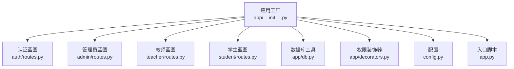
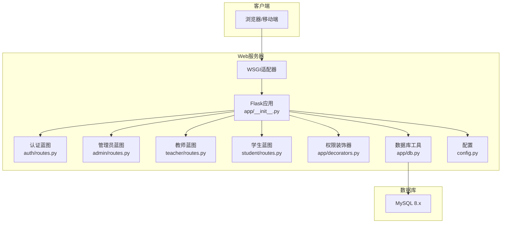
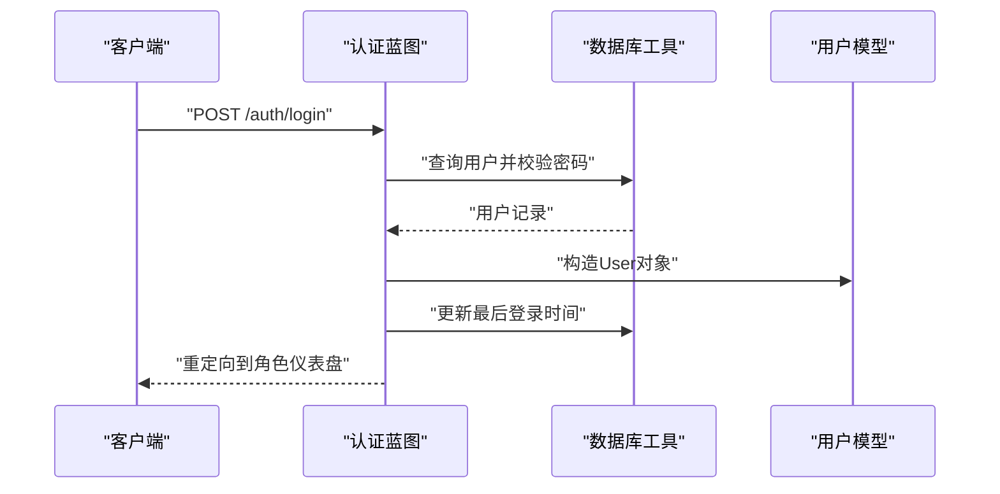
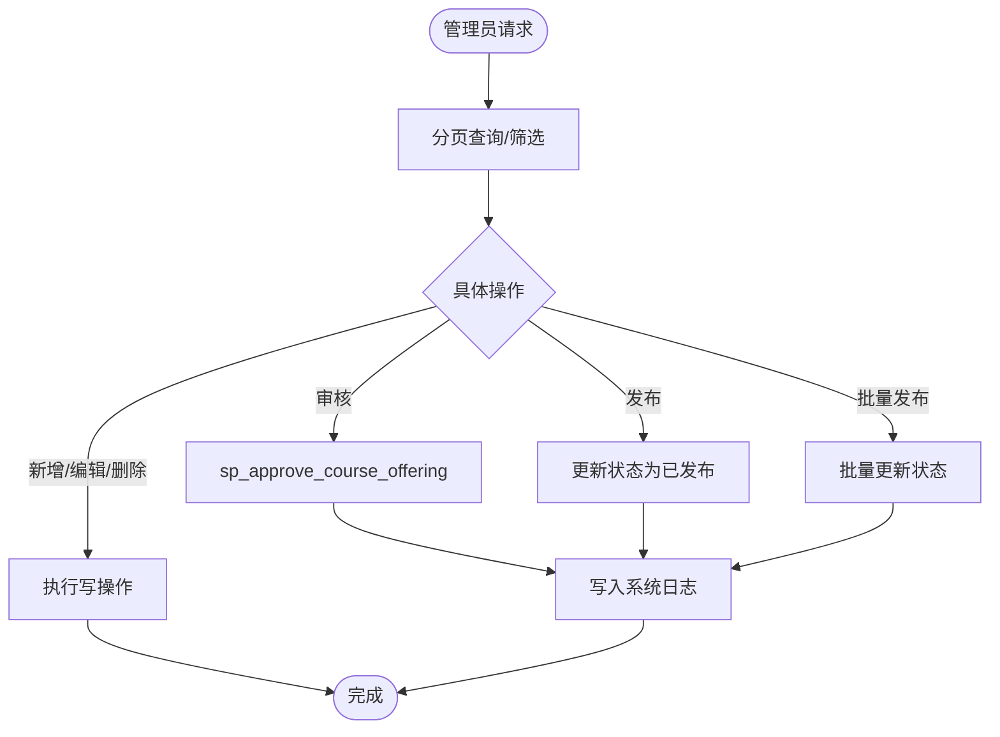
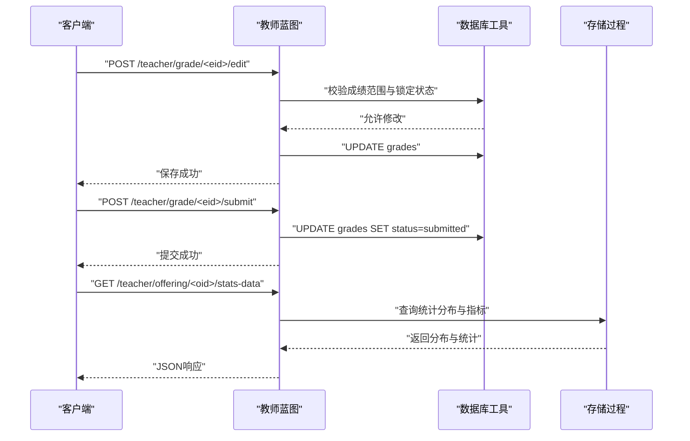
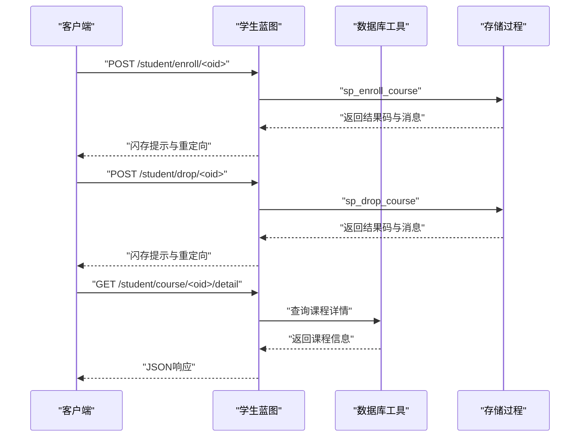
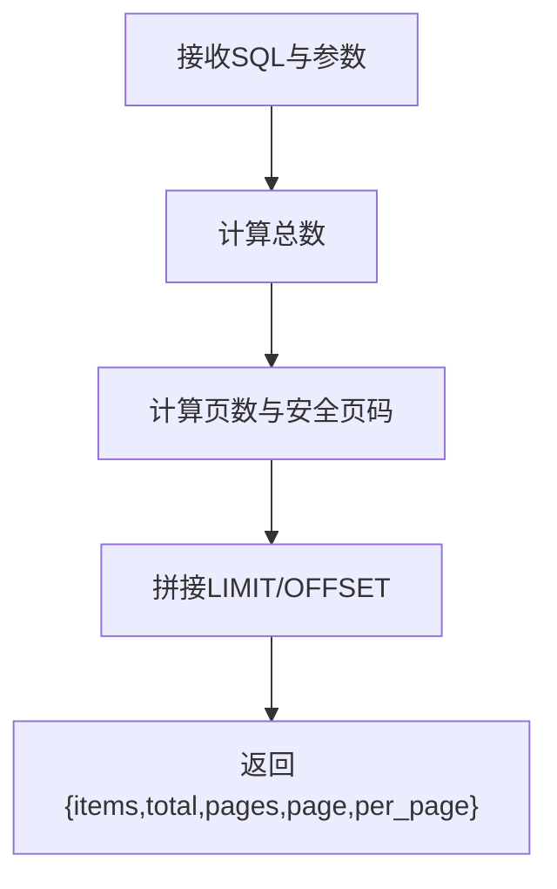
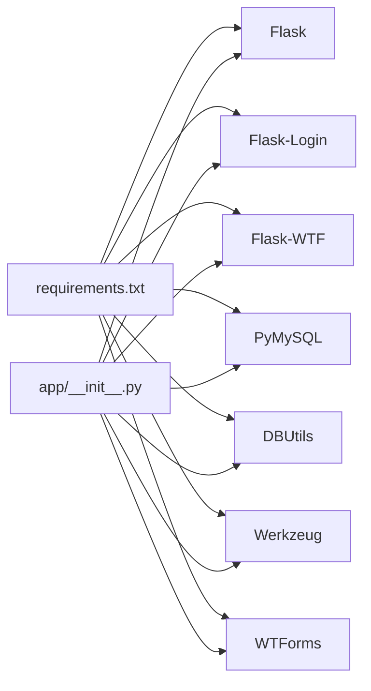

# API参考文档

<cite>
**本文引用的文件**
- [app.py](file://app.py)
- [config.py](file://config.py)
- [app/__init__.py](file://app/__init__.py)
- [app/db.py](file://app/db.py)
- [app/decorators.py](file://app/decorators.py)
- [app/auth/routes.py](file://app/auth/routes.py)
- [app/auth/forms.py](file://app/auth/forms.py)
- [app/admin/routes.py](file://app/admin/routes.py)
- [app/student/routes.py](file://app/student/routes.py)
- [app/teacher/routes.py](file://app/teacher/routes.py)
- [sql/01_schema.sql](file://sql/01_schema.sql)
- [README.md](file://README.md)
- [requirements.txt](file://requirements.txt)
- [app/templates/_pagination.html](file://app/templates/_pagination.html)
- [app/templates/student/courses.html](file://app/templates/student/courses.html)
- [app/templates/teacher/my_offerings.html](file://app/templates/teacher/my_offerings.html)
</cite>

## 目录
1. [简介](#简介)
2. [项目结构](#项目结构)
3. [核心组件](#核心组件)
4. [架构总览](#架构总览)
5. [详细组件分析](#详细组件分析)
6. [依赖分析](#依赖分析)
7. [性能考虑](#性能考虑)
8. [故障排查指南](#故障排查指南)
9. [结论](#结论)
10. [附录](#附录)

## 简介
本项目为“校园教务选课与成绩管理系统”，采用Python Flask 3.x作为后端框架，MySQL 8.x作为数据存储，PyMySQL与DBUtils连接池提供数据库访问能力。系统支持管理员、教师、学生三类角色，围绕“开课申请—选课—成绩录入—审核发布—学业预警”的完整业务闭环。

- 技术栈：Flask 3.x + MySQL 8.x + PyMySQL + DBUtils + WTForms + Flask-Login + Bootstrap 5 + Jinja2
- 项目目标：提供REST风格的API端点（以蓝图形式暴露）、完善的认证与授权、分页查询、成绩处理、学业预警、以及前后端模板渲染。

## 项目结构
系统采用蓝图（Blueprint）按角色划分模块，统一在应用工厂中注册，配合数据库连接池与装饰器实现权限控制与CSRF保护。

图表来源
- [app/__init__.py:29-93](file://app/__init__.py#L29-L93)
- [app/auth/routes.py:29](file://app/auth/routes.py#L29)
- [app/admin/routes.py:10](file://app/admin/routes.py#L10)
- [app/teacher/routes.py:7](file://app/teacher/routes.py#L7)
- [app/student/routes.py:7](file://app/student/routes.py#L7)
- [app/db.py:10-41](file://app/db.py#L10-L41)
- [app/decorators.py:7-26](file://app/decorators.py#L7-L26)
- [config.py:6-36](file://config.py#L6-L36)
- [app.py:29-13](file://app.py#L29-L13)

章节来源
- [README.md:46-87](file://README.md#L46-L87)
- [app/__init__.py:29-93](file://app/__init__.py#L29-L93)
- [app.py:29-13](file://app.py#L29-L13)

## 核心组件
- 应用工厂与蓝图注册：在应用工厂中初始化CSRF保护、数据库连接池、Flask-Login，并注册各角色蓝图。
- 数据库工具：封装连接池、查询、写入、存储过程调用、分页查询等通用能力。
- 权限装饰器：统一实现登录与角色校验。
- 表单验证：基于WTForms对注册与登录进行输入校验。
- 模板与分页：前端模板使用分页组件，后端提供分页工具函数。

章节来源
- [app/__init__.py:29-93](file://app/__init__.py#L29-L93)
- [app/db.py:43-121](file://app/db.py#L43-L121)
- [app/decorators.py:7-26](file://app/decorators.py#L7-L26)
- [app/auth/forms.py:6-37](file://app/auth/forms.py#L6-L37)
- [app/templates/_pagination.html:1-11](file://app/templates/_pagination.html#L1-L11)

## 架构总览
系统采用“蓝图 + 装饰器 + 数据库工具”的分层架构，认证与授权通过Flask-Login与自定义装饰器实现，数据库访问通过连接池统一管理。

图表来源
- [app/__init__.py:29-93](file://app/__init__.py#L29-L93)
- [app/auth/routes.py:29](file://app/auth/routes.py#L29)
- [app/admin/routes.py:10](file://app/admin/routes.py#L10)
- [app/teacher/routes.py:7](file://app/teacher/routes.py#L7)
- [app/student/routes.py:7](file://app/student/routes.py#L7)
- [app/db.py:10-41](file://app/db.py#L10-L41)
- [config.py:6-36](file://config.py#L6-L36)

## 详细组件分析

### 认证与授权机制
- 登录流程：用户提交用户名/密码，服务端校验并创建用户会话，记录最后登录时间。
- 注册流程：根据角色生成唯一编号（学号/工号），写入users与对应角色表。
- 权限控制：通过装饰器强制登录与角色校验，未登录跳转登录页，角色不符返回403。
- CSRF保护：全局启用CSRF保护，模板中包含CSRF字段。
- 会话管理：基于Flask-Login，支持记住我与用户状态持久化。

图表来源
- [app/auth/routes.py:32-56](file://app/auth/routes.py#L32-L56)
- [app/auth/routes.py:70-110](file://app/auth/routes.py#L70-L110)
- [app/__init__.py:47-51](file://app/__init__.py#L47-L51)
- [app/decorators.py:7-26](file://app/decorators.py#L7-L26)

章节来源
- [app/auth/routes.py:32-118](file://app/auth/routes.py#L32-L118)
- [app/auth/forms.py:6-37](file://app/auth/forms.py#L6-L37)
- [app/__init__.py:47-51](file://app/__init__.py#L47-L51)
- [app/decorators.py:7-26](file://app/decorators.py#L7-L26)

### 管理员模块API
- 仪表盘：聚合统计与最近日志。
- 学期管理：增删改查。
- 专业与班级管理：增删改查。
- 课程管理：增删改查。
- 学生与教师管理：分页、搜索、启停账号、重置密码、新增。
- 开课审核：分页展示，审批与发布。
- 选课时间配置：增删改查与启停。
- 成绩审核与批量发布：分页展示，逐条审核与批量发布。
- 系统日志：分页过滤。
- 统计分析：选课统计、成绩分布、教师工作量。
- 学业预警：分学期筛选、风险等级过滤、搜索、汇总。

图表来源
- [app/admin/routes.py:366-405](file://app/admin/routes.py#L366-L405)
- [app/admin/routes.py:454-526](file://app/admin/routes.py#L454-L526)
- [app/admin/routes.py:529-543](file://app/admin/routes.py#L529-L543)
- [app/admin/routes.py:577-615](file://app/admin/routes.py#L577-L615)

章节来源
- [app/admin/routes.py:42-57](file://app/admin/routes.py#L42-L57)
- [app/admin/routes.py:61-97](file://app/admin/routes.py#L61-L97)
- [app/admin/routes.py:100-127](file://app/admin/routes.py#L100-L127)
- [app/admin/routes.py:130-159](file://app/admin/routes.py#L130-L159)
- [app/admin/routes.py:162-193](file://app/admin/routes.py#L162-L193)
- [app/admin/routes.py:202-283](file://app/admin/routes.py#L202-L283)
- [app/admin/routes.py:286-363](file://app/admin/routes.py#L286-L363)
- [app/admin/routes.py:366-405](file://app/admin/routes.py#L366-L405)
- [app/admin/routes.py:408-451](file://app/admin/routes.py#L408-L451)
- [app/admin/routes.py:454-526](file://app/admin/routes.py#L454-L526)
- [app/admin/routes.py:529-543](file://app/admin/routes.py#L529-L543)
- [app/admin/routes.py:547-574](file://app/admin/routes.py#L547-L574)
- [app/admin/routes.py:577-615](file://app/admin/routes.py#L577-L615)

### 教师模块API
- 仪表盘：展示本人开课与报名人数。
- 开课申请：提交、撤销、编辑。
- 查看学生名单：按开课ID查询选课学生与成绩。
- 成绩录入与提交：单条修改、单条提交、批量提交。
- 成绩统计：按学期筛选，返回分数段分布与统计指标。

图表来源
- [app/teacher/routes.py:158-198](file://app/teacher/routes.py#L158-L198)
- [app/teacher/routes.py:200-213](file://app/teacher/routes.py#L200-L213)
- [app/teacher/routes.py:237-271](file://app/teacher/routes.py#L237-L271)

章节来源
- [app/teacher/routes.py:50-103](file://app/teacher/routes.py#L50-L103)
- [app/teacher/routes.py:105-131](file://app/teacher/routes.py#L105-L131)
- [app/teacher/routes.py:133-156](file://app/teacher/routes.py#L133-L156)
- [app/teacher/routes.py:158-198](file://app/teacher/routes.py#L158-L198)
- [app/teacher/routes.py:200-213](file://app/teacher/routes.py#L200-L213)
- [app/teacher/routes.py:215-235](file://app/teacher/routes.py#L215-L235)
- [app/teacher/routes.py:237-271](file://app/teacher/routes.py#L237-L271)

### 学生模块API
- 仪表盘：选课数量、累计GPA、近期成绩、学业预警。
- 可选课程：分页、搜索、类型筛选、冲突检测。
- 课程详情：JSON返回课程信息。
- 选课/退课：调用存储过程处理业务规则与并发约束。
- 个人课表、成绩、成绩单：多视图聚合查询。
- 成绩统计：累计GPA与已发布学分统计。

图表来源
- [app/student/routes.py:133-159](file://app/student/routes.py#L133-L159)
- [app/student/routes.py:117-131](file://app/student/routes.py#L117-L131)
- [app/student/routes.py:34-64](file://app/student/routes.py#L34-L64)

章节来源
- [app/student/routes.py:34-64](file://app/student/routes.py#L34-L64)
- [app/student/routes.py:78-115](file://app/student/routes.py#L78-L115)
- [app/student/routes.py:117-159](file://app/student/routes.py#L117-L159)
- [app/student/routes.py:161-168](file://app/student/routes.py#L161-L168)
- [app/student/routes.py:170-198](file://app/student/routes.py#L170-L198)
- [app/student/routes.py:200-218](file://app/student/routes.py#L200-L218)

### 分页查询实现
- 后端：提供通用分页函数，支持自动计数、自定义每页大小、安全的页码边界处理。
- 前端：模板中渲染分页导航，携带当前筛选条件。

图表来源
- [app/db.py:92-121](file://app/db.py#L92-L121)
- [app/templates/_pagination.html:1-11](file://app/templates/_pagination.html#L1-L11)

章节来源
- [app/db.py:92-121](file://app/db.py#L92-L121)
- [app/templates/_pagination.html:1-11](file://app/templates/_pagination.html#L1-L11)

### 文件上传与批量处理
- 当前代码库未提供专门的文件上传接口（如批量导入成绩单）。若需扩展，建议：
  - 新增蓝图与路由，接收multipart/form-data。
  - 使用表单验证与文件类型/大小限制。
  - 批量解析与入库采用事务与分批提交，结合进度反馈。
  - 对异常进行捕获并返回标准化错误响应。

[本节为概念性说明，不直接分析具体文件]

## 依赖分析
- 外部依赖：Flask、Flask-Login、Flask-WTF、PyMySQL、DBUtils、Werkzeug、WTForms。
- 内部依赖：蓝图间通过装饰器与数据库工具解耦；数据库工具向上提供统一接口。

图表来源
- [requirements.txt:1-8](file://requirements.txt#L1-L8)
- [app/__init__.py:29-93](file://app/__init__.py#L29-L93)

章节来源
- [requirements.txt:1-8](file://requirements.txt#L1-L8)
- [app/__init__.py:29-93](file://app/__init__.py#L29-L93)

## 性能考虑
- 连接池：通过DBUtils配置最小缓存、最大缓存与最大连接数，降低连接开销。
- 分页：后端统一实现分页，避免一次性加载大结果集；前端模板复用分页组件。
- 索引与约束：核心表具备必要索引与约束，减少查询成本与保证一致性。
- 存储过程：将复杂业务逻辑下沉至数据库，减少网络往返与应用侧逻辑。

章节来源
- [config.py:19-25](file://config.py#L19-L25)
- [app/db.py:10-41](file://app/db.py#L10-L41)
- [sql/01_schema.sql:14-26](file://sql/01_schema.sql#L14-L26)
- [sql/01_schema.sql:42-50](file://sql/01_schema.sql#L42-L50)
- [sql/01_schema.sql:100-108](file://sql/01_schema.sql#L100-L108)
- [sql/01_schema.sql:129-155](file://sql/01_schema.sql#L129-L155)
- [sql/01_schema.sql:159-175](file://sql/01_schema.sql#L159-L175)
- [sql/01_schema.sql:177-199](file://sql/01_schema.sql#L177-L199)

## 故障排查指南
- 403/404/500错误页面：应用已注册错误处理器，返回对应模板。
- 权限不足：检查是否登录、角色是否匹配。
- 数据库连接失败：核对环境变量与连接池配置。
- 分页异常：确认传入page与per_page类型与范围。
- 成绩范围校验：教师端对0-100范围进行校验，超出范围将返回警告。

章节来源
- [app/__init__.py:76-91](file://app/__init__.py#L76-L91)
- [app/decorators.py:17-23](file://app/decorators.py#L17-L23)
- [app/db.py:92-121](file://app/db.py#L92-L121)
- [app/teacher/routes.py:164-172](file://app/teacher/routes.py#L164-L172)

## 结论
本系统以蓝图划分清晰、装饰器统一鉴权、数据库工具抽象通用操作，形成稳定可扩展的后端架构。管理员、教师、学生三大角色的业务流程覆盖完整，分页与统计能力完善。建议后续补充文件上传与批量处理接口，并持续完善错误处理与监控告警。

## 附录

### API端点一览（按模块）
- 认证
  - GET /auth/login
  - POST /auth/login
  - GET /auth/register
  - POST /auth/register
  - GET /auth/logout
  - GET /auth/profile
  - POST /auth/profile

- 管理员
  - GET /admin
  - GET /admin/semesters
  - POST /admin/semesters/add
  - POST /admin/semesters/<int:sid>/edit
  - POST /admin/semesters/<int:sid>/delete
  - GET /admin/majors
  - POST /admin/majors/add
  - POST /admin/majors/<int:mid>/edit
  - POST /admin/majors/<int:mid>/delete
  - GET /admin/classes
  - POST /admin/classes/add
  - POST /admin/classes/<int:cid>/edit
  - POST /admin/classes/<int:cid>/delete
  - GET /admin/courses
  - POST /admin/courses/add
  - POST /admin/courses/<int:cid>/edit
  - POST /admin/courses/<int:cid>/delete
  - GET /admin/students
  - POST /admin/students/<int:sid>/toggle
  - POST /admin/students/<int:sid>/edit
  - POST /admin/students/add
  - POST /admin/students/<int:sid>/reset-password
  - GET /admin/teachers
  - POST /admin/teachers/<int:tid>/toggle
  - POST /admin/teachers/<int:tid>/edit
  - POST /admin/teachers/add
  - POST /admin/teachers/<int:tid>/reset-password
  - GET /admin/offerings
  - POST /admin/offerings/<int:oid>/review
  - POST /admin/offerings/<int:oid>/publish
  - GET /admin/selection-periods
  - POST /admin/selection-periods/add
  - POST /admin/selection-periods/<int:pid>/edit
  - POST /admin/selection-periods/<int:pid>/toggle
  - POST /admin/selection-periods/<int:pid>/delete
  - GET /admin/grades-review
  - POST /admin/grades/<int:gid>/approve
  - POST /admin/grades/<int:gid>/publish
  - POST /admin/grades/batch-publish
  - GET /admin/logs
  - GET /admin/statistics
  - GET /admin/academic-alerts

- 教师
  - GET /teacher
  - GET /teacher/apply-offering
  - POST /teacher/apply-offering
  - GET /teacher/my-offerings
  - POST /teacher/offering/<int:oid>/withdraw
  - POST /teacher/offering/<int:oid>/edit
  - GET /teacher/offering/<int:oid>/students
  - POST /teacher/grade/<int:eid>/edit
  - POST /teacher/grade/<int:eid>/submit
  - POST /teacher/offering/<int:oid>/submit-all
  - GET /teacher/grade-stats
  - GET /teacher/offering/<int:oid>/stats-data

- 学生
  - GET /student
  - GET /student/courses
  - GET /student/course/<int:oid>/detail
  - POST /student/enroll/<int:oid>
  - POST /student/drop/<int:oid>
  - GET /student/schedule
  - GET /student/grades
  - GET /student/transcript

章节来源
- [app/auth/routes.py:32-118](file://app/auth/routes.py#L32-L118)
- [app/admin/routes.py:42-615](file://app/admin/routes.py#L42-L615)
- [app/teacher/routes.py:50-271](file://app/teacher/routes.py#L50-L271)
- [app/student/routes.py:34-218](file://app/student/routes.py#L34-L218)

### 认证与授权机制说明
- JWT令牌：未实现JWT，采用Flask-Login会话与CSRF保护。
- 会话管理：登录成功后创建会话，支持记住我；登出销毁会话。
- 权限验证：通过装饰器校验登录与角色，未登录重定向登录页，角色不符返回403。

章节来源
- [app/auth/routes.py:32-56](file://app/auth/routes.py#L32-L56)
- [app/__init__.py:47-51](file://app/__init__.py#L47-L51)
- [app/decorators.py:7-26](file://app/decorators.py#L7-L26)

### 数据验证规则
- 注册表单：用户名长度、密码长度、确认密码一致性、角色选择、姓名与性别、可选专业/班级、电话与邮箱长度。
- 成绩录入：教师端对平时/期末成绩范围进行0-100校验，且仅draft状态可修改。
- 其他：数据库层面约束（如枚举值、非负数值、唯一键、外键）保障数据完整性。

章节来源
- [app/auth/forms.py:11-37](file://app/auth/forms.py#L11-L37)
- [app/teacher/routes.py:164-172](file://app/teacher/routes.py#L164-L172)
- [sql/01_schema.sql:14-26](file://sql/01_schema.sql#L14-L26)
- [sql/01_schema.sql:113-125](file://sql/01_schema.sql#L113-L125)
- [sql/01_schema.sql:177-199](file://sql/01_schema.sql#L177-L199)

### 错误处理机制
- HTTP状态码：403（未授权）、404（未找到）、500（服务器错误）。
- 错误消息格式：模板渲染错误页面，部分接口返回JSON错误对象（如课程详情未找到）。
- 异常处理策略：路由内try-catch捕获异常并闪存提示，存储过程调用返回结果码与消息。

章节来源
- [app/__init__.py:76-91](file://app/__init__.py#L76-L91)
- [app/student/routes.py:129](file://app/student/routes.py#L129)
- [app/admin/routes.py:388-397](file://app/admin/routes.py#L388-L397)
- [app/student/routes.py:142-144](file://app/student/routes.py#L142-L144)

### API调用示例（场景）
- 用户管理（教师）：登录后进入教师仪表盘，查看本人开课列表与学生名单，编辑某学生某门课的成绩并提交。
- 课程操作（学生）：登录后进入可选课程列表，按条件筛选，点击详情查看课程信息，提交选课申请。
- 成绩处理（管理员）：登录后进入成绩审核页面，逐条审核并通过，或批量发布已审核成绩。

章节来源
- [app/teacher/routes.py:50-103](file://app/teacher/routes.py#L50-L103)
- [app/teacher/routes.py:133-156](file://app/teacher/routes.py#L133-L156)
- [app/teacher/routes.py:158-198](file://app/teacher/routes.py#L158-L198)
- [app/student/routes.py:78-115](file://app/student/routes.py#L78-L115)
- [app/student/routes.py:117-159](file://app/student/routes.py#L117-L159)
- [app/admin/routes.py:454-526](file://app/admin/routes.py#L454-L526)

### 分页查询实现细节
- 参数：page（默认1）、per_page（默认来自配置）、search/type/action等筛选参数透传。
- 结果：返回items、total、pages、page、per_page。
- 性能优化：自动包装COUNT查询，限制每页大小，避免超大偏移。

章节来源
- [app/db.py:92-121](file://app/db.py#L92-L121)
- [config.py:24-25](file://config.py#L24-L25)
- [app/templates/_pagination.html:1-11](file://app/templates/_pagination.html#L1-L11)
- [app/templates/student/courses.html:4-12](file://app/templates/student/courses.html#L4-L12)
- [app/templates/teacher/my_offerings.html:4-29](file://app/templates/teacher/my_offerings.html#L4-L29)

### 文件上传接口建议
- 接口设计：POST /upload/batch-grades（示例路径），接收CSV/Excel文件。
- 校验：文件类型白名单、大小限制、内容结构校验。
- 处理：事务内批量写入，分批提交，记录进度与错误明细。
- 响应：成功返回批次统计，失败返回错误码与定位信息。

[本节为概念性说明，不直接分析具体文件]

### API版本控制策略与兼容性
- 版本策略：当前未实现版本号前缀或Accept头版本协商，建议引入/v1前缀或媒体类型版本。
- 向后兼容：新增字段采用可选，变更字段保持默认值与兼容性，逐步淘汰旧字段。

[本节为概念性说明，不直接分析具体文件]

### 调试工具与常见问题
- 调试工具：Flask内置调试模式（开发环境），结合浏览器开发者工具观察网络请求与响应。
- 常见问题：登录失败（用户名/密码错误）、选课冲突（时间冲突提示）、成绩范围错误（超出0-100）、权限不足（角色不符）。

章节来源
- [README.md:12-36](file://README.md#L12-L36)
- [app/auth/routes.py:52-54](file://app/auth/routes.py#L52-L54)
- [app/student/routes.py:46-50](file://app/student/routes.py#L46-L50)
- [app/teacher/routes.py:164-172](file://app/teacher/routes.py#L164-L172)
- [app/decorators.py:17-23](file://app/decorators.py#L17-L23)