# 学生功能API

<cite>
**本文档引用的文件**
- [app/student/routes.py](file://app/student/routes.py)
- [app/db.py](file://app/db.py)
- [app/helpers.py](file://app/helpers.py)
- [app/decorators.py](file://app/decorators.py)
- [app/templates/student/courses.html](file://app/templates/student/courses.html)
- [app/templates/student/schedule.html](file://app/templates/student/schedule.html)
- [app/templates/student/grades.html](file://app/templates/student/grades.html)
- [app/templates/student/transcript.html](file://app/templates/student/transcript.html)
- [sql/03_procedures.sql](file://sql/03_procedures.sql)
- [config.py](file://config.py)
</cite>

## 目录
1. [简介](#简介)
2. [项目结构](#项目结构)
3. [核心组件](#核心组件)
4. [架构概览](#架构概览)
5. [详细组件分析](#详细组件分析)
6. [依赖关系分析](#依赖关系分析)
7. [性能考虑](#性能考虑)
8. [故障排除指南](#故障排除指南)
9. [结论](#结论)

## 简介

学生功能模块是MIS（管理信息系统）的核心组成部分，为学生用户提供完整的选课、成绩管理和课表查询服务。该模块基于Flask框架构建，采用蓝图（Blueprint）模式实现模块化设计，通过存储过程确保数据一致性和业务逻辑的完整性。

本模块主要包含以下核心功能：
- 课程查询与筛选
- 选课与退课管理
- 个人课表生成
- 成绩查询与管理
- 成绩单生成与打印
- 学生个人信息维护

## 项目结构

学生功能模块采用清晰的分层架构设计：

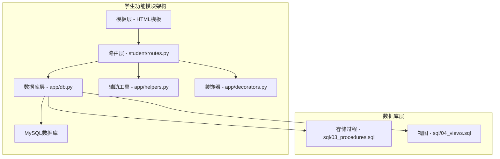

**图表来源**
- [app/student/routes.py:1-220](file://app/student/routes.py#L1-L220)
- [app/db.py:1-121](file://app/db.py#L1-L121)

**章节来源**
- [app/student/routes.py:1-220](file://app/student/routes.py#L1-L220)
- [app/db.py:1-121](file://app/db.py#L1-L121)

## 核心组件

### 路由蓝图设计

学生功能模块通过蓝图（Blueprint）实现模块化路由管理：

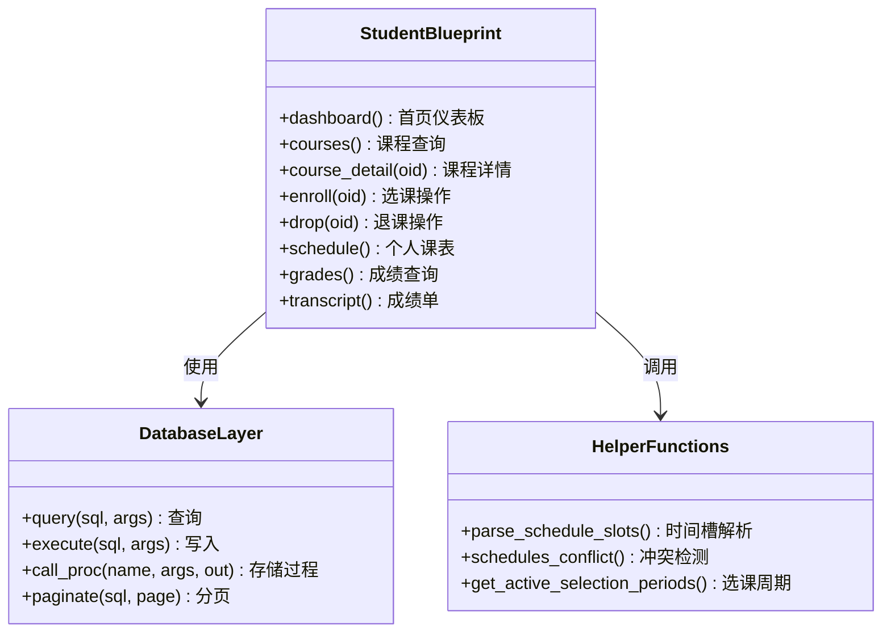

**图表来源**
- [app/student/routes.py:19-220](file://app/student/routes.py#L19-L220)
- [app/db.py:43-121](file://app/db.py#L43-L121)
- [app/helpers.py:23-80](file://app/helpers.py#L23-L80)

### 数据库连接池

系统采用连接池管理数据库连接，确保高并发场景下的性能和稳定性：

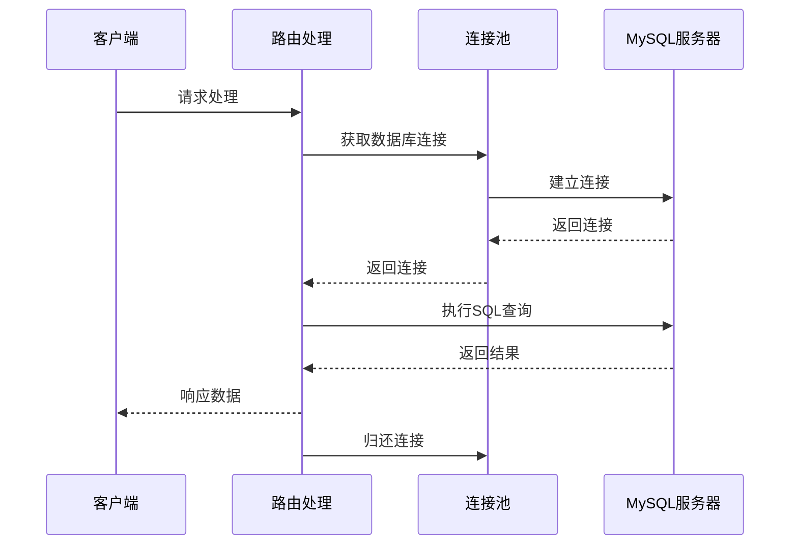

**图表来源**
- [app/db.py:29-41](file://app/db.py#L29-L41)
- [app/db.py:43-60](file://app/db.py#L43-L60)

**章节来源**
- [app/student/routes.py:19-220](file://app/student/routes.py#L19-L220)
- [app/db.py:1-121](file://app/db.py#L1-L121)
- [app/helpers.py:1-80](file://app/helpers.py#L1-L80)

## 架构概览

### 系统架构图

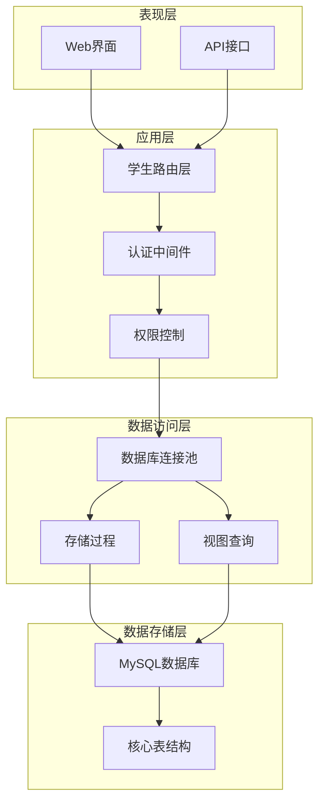

**图表来源**
- [app/__init__.py:29-93](file://app/__init__.py#L29-L93)
- [app/student/routes.py:1-220](file://app/student/routes.py#L1-L220)
- [app/db.py:1-121](file://app/db.py#L1-L121)

### 数据流图

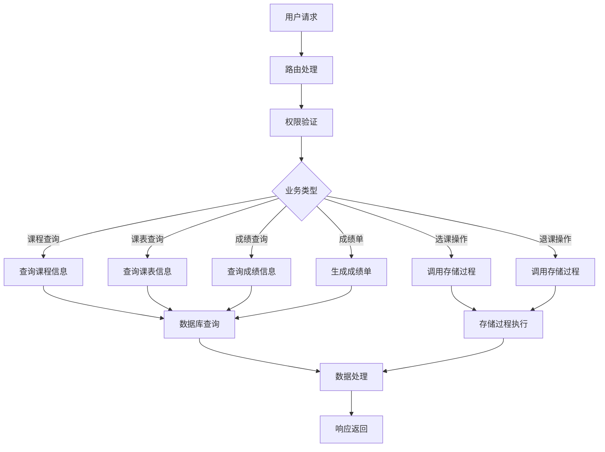

**图表来源**
- [app/student/routes.py:80-220](file://app/student/routes.py#L80-L220)
- [app/db.py:62-81](file://app/db.py#L62-L81)

## 详细组件分析

### 课程查询接口

#### 接口定义

| 属性 | 详情 |
|------|------|
| 路径 | `/student/courses` |
| 方法 | GET |
| 权限 | 学生角色 |
| 返回 | HTML模板渲染 |

#### 查询参数

| 参数名 | 类型 | 必填 | 描述 | 默认值 |
|--------|------|------|------|--------|
| search | string | 否 | 搜索关键词 | 空字符串 |
| type | string | 否 | 课程类型 | 空字符串 |
| page | integer | 否 | 页码 | 1 |

#### 筛选条件

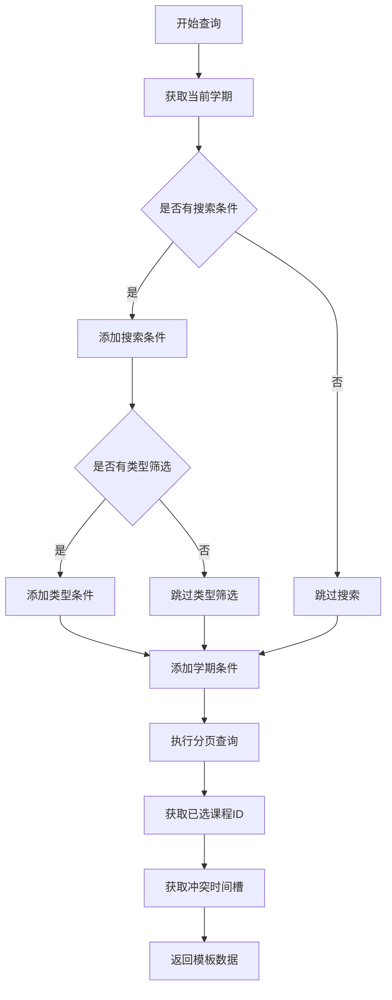

**图表来源**
- [app/student/routes.py:80-117](file://app/student/routes.py#L80-L117)

#### 课程详情接口

| 属性 | 详情 |
|------|------|
| 路径 | `/student/course/<int:oid>/detail` |
| 方法 | GET |
| 权限 | 学生角色 |
| 返回 | JSON格式课程详情 |

**章节来源**
- [app/student/routes.py:80-133](file://app/student/routes.py#L80-L133)

### 选课退课接口

#### 选课接口

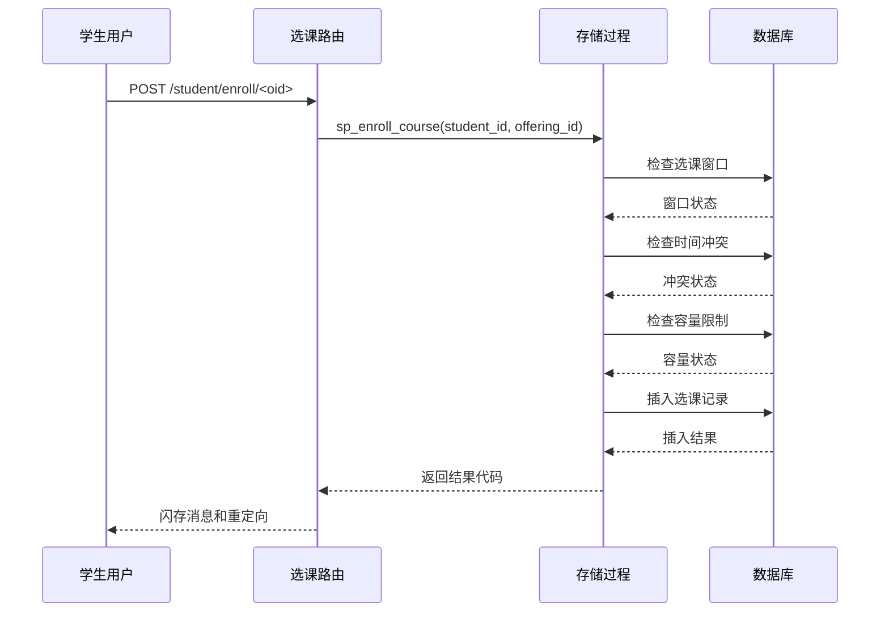

**图表来源**
- [app/student/routes.py:135-147](file://app/student/routes.py#L135-L147)
- [sql/03_procedures.sql:14-114](file://sql/03_procedures.sql#L14-L114)

#### 退课接口

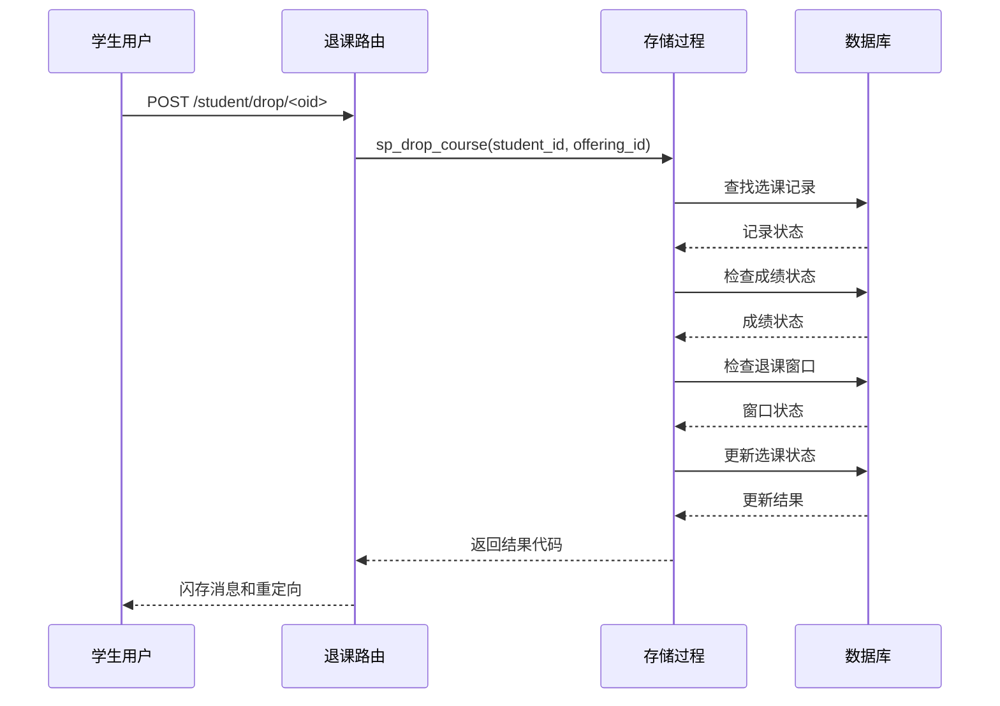

**图表来源**
- [app/student/routes.py:149-161](file://app/student/routes.py#L149-L161)
- [sql/03_procedures.sql:119-195](file://sql/03_procedures.sql#L119-L195)

#### 冲突检测机制

系统实现了智能的时间冲突检测机制：

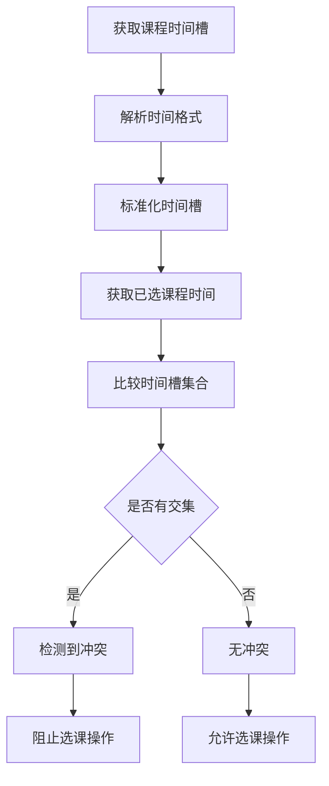

**图表来源**
- [app/helpers.py:23-64](file://app/helpers.py#L23-L64)

**章节来源**
- [app/student/routes.py:135-161](file://app/student/routes.py#L135-L161)
- [app/helpers.py:23-64](file://app/helpers.py#L23-L64)
- [sql/03_procedures.sql:14-195](file://sql/03_procedures.sql#L14-L195)

### 个人课表接口

#### 课表生成流程

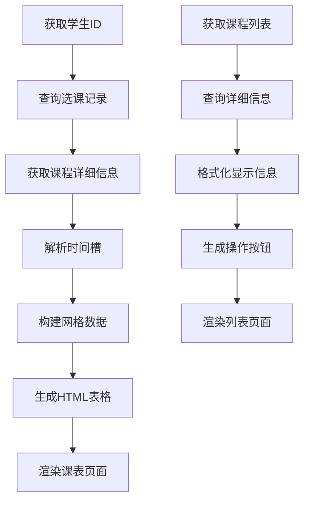

**图表来源**
- [app/student/routes.py:163-169](file://app/student/routes.py#L163-L169)

#### 课表显示特性

系统提供了丰富的课表显示功能：

| 功能特性 | 实现方式 | 用户体验 |
|----------|----------|----------|
| 时间网格布局 | CSS Grid布局 | 清晰直观的课程时间分布 |
| 课程颜色编码 | 随机颜色分配 | 区分不同课程标识 |
| 课程详情提示 | Bootstrap Tooltip | 鼠标悬停显示详细信息 |
| 响应式设计 | 移动端适配 | 支持多种设备访问 |
| 退课操作集成 | 模态框确认 | 安全的退课操作流程 |

**章节来源**
- [app/student/routes.py:163-169](file://app/student/routes.py#L163-L169)
- [app/templates/student/schedule.html:1-97](file://app/templates/student/schedule.html#L1-L97)

### 成绩查询接口

#### 成绩查询流程

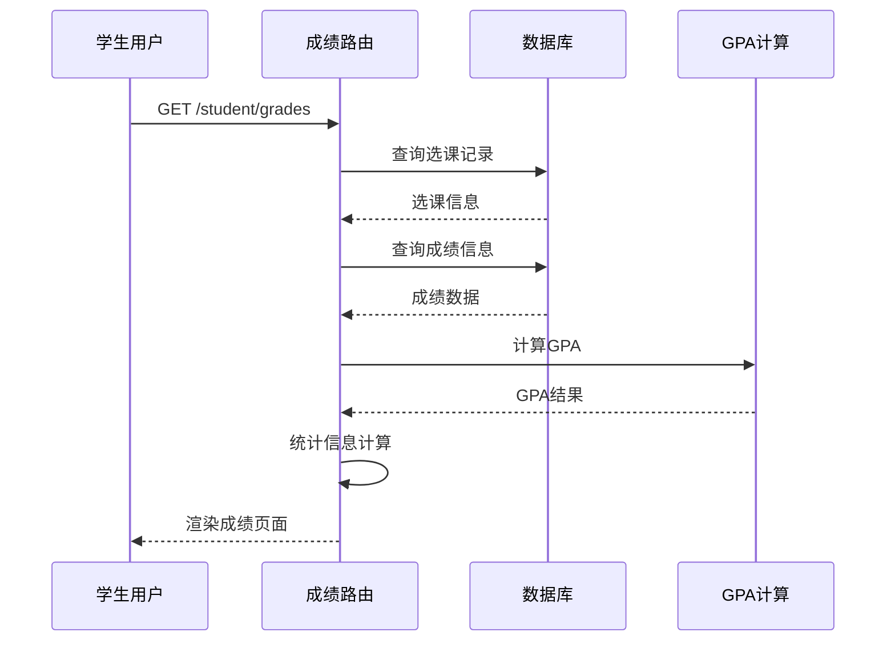

**图表来源**
- [app/student/routes.py:172-199](file://app/student/routes.py#L172-L199)

#### 成绩统计功能

系统提供多层次的成绩统计分析：

| 统计指标 | 计算方式 | 展示位置 |
|----------|----------|----------|
| 当前GPA | 加权平均绩点 | 仪表板卡片 |
| 总学分 | 已选课程学分合计 | 仪表板卡片 |
| 已发布成绩数 | 状态为已发布的成绩数量 | 仪表板卡片 |
| 总课程数 | 已选课程总数 | 仪表板卡片 |
| 学期GPA趋势 | 多学期GPA对比 | 图表展示 |

**章节来源**
- [app/student/routes.py:172-199](file://app/student/routes.py#L172-L199)
- [app/templates/student/grades.html:1-75](file://app/templates/student/grades.html#L1-L75)

### 成绩单生成接口

#### 成绩单生成流程

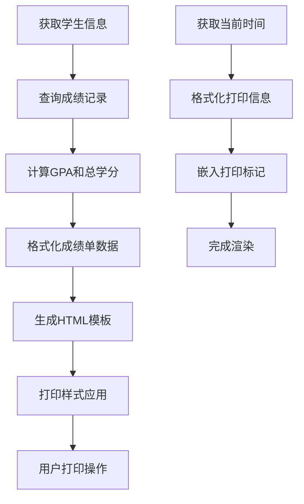

**图表来源**
- [app/student/routes.py:202-220](file://app/student/routes.py#L202-L220)

#### 打印功能特性

| 功能特性 | 实现方式 | 技术细节 |
|----------|----------|----------|
| 打印按钮 | JavaScript window.print() | 一键打印操作 |
| 打印样式 | CSS媒体查询 | 自动隐藏非打印元素 |
| 响应式布局 | 移动端适配 | 不同设备优化显示 |
| 格式化输出 | HTML表格结构 | 标准化的成绩单格式 |

**章节来源**
- [app/student/routes.py:202-220](file://app/student/routes.py#L202-L220)
- [app/templates/student/transcript.html:1-32](file://app/templates/student/transcript.html#L1-L32)

### 学生个人信息维护

#### 个人信息接口

虽然学生个人信息维护主要在认证模块中实现，但学生功能模块也提供了相关的查询和更新能力：

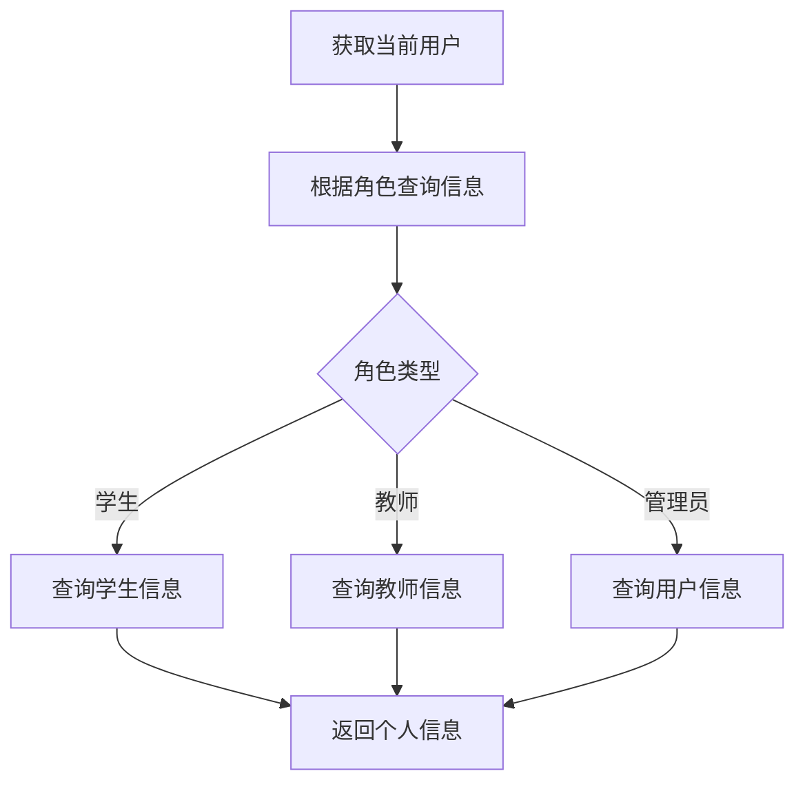

**图表来源**
- [app/auth/routes.py:129-186](file://app/auth/routes.py#L129-L186)

**章节来源**
- [app/auth/routes.py:129-186](file://app/auth/routes.py#L129-L186)

## 依赖关系分析

### 组件依赖图

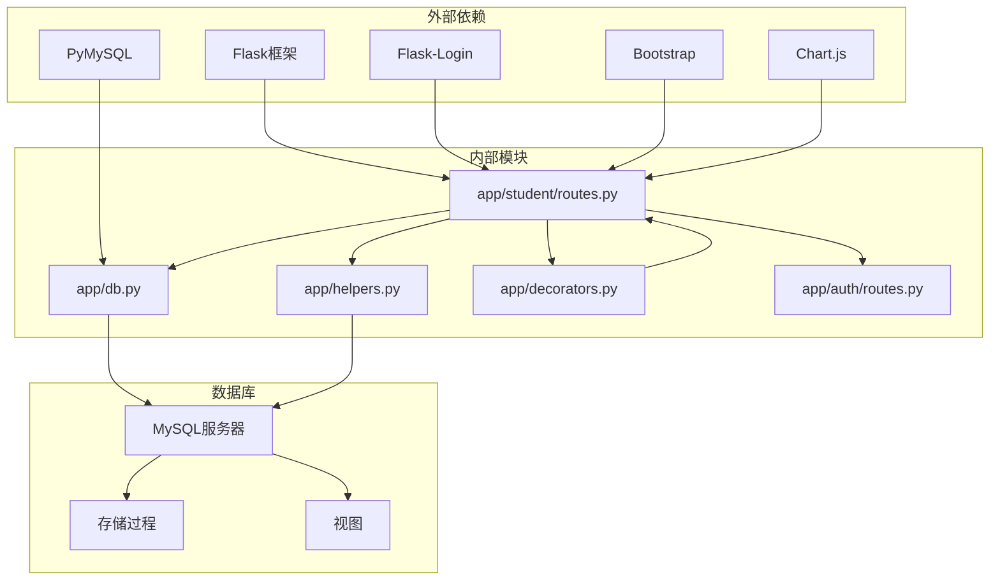

**图表来源**
- [app/__init__.py:29-93](file://app/__init__.py#L29-L93)
- [app/student/routes.py:1-220](file://app/student/routes.py#L1-L220)

### 数据库依赖关系

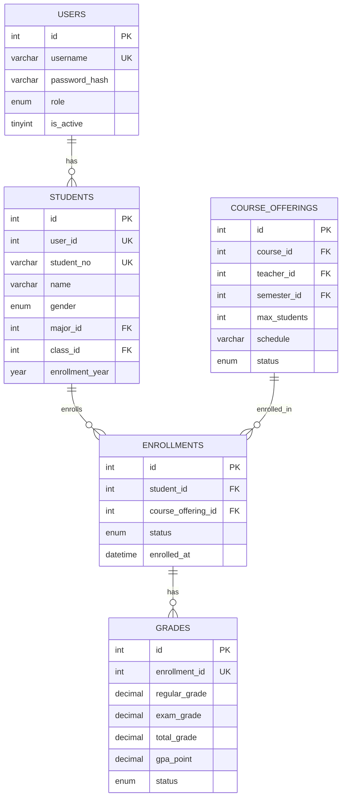

**图表来源**
- [sql/01_schema.sql:15-235](file://sql/01_schema.sql#L15-L235)

**章节来源**
- [app/student/routes.py:1-220](file://app/student/routes.py#L1-L220)
- [sql/01_schema.sql:15-235](file://sql/01_schema.sql#L15-L235)

## 性能考虑

### 数据库性能优化

1. **连接池管理**
   - 最小连接数：2个
   - 最大连接数：20个
   - 字符集：utf8mb4

2. **查询优化策略**
   - 使用LIMIT和OFFSET进行分页
   - 合理的索引设计
   - 存储过程减少网络往返

3. **缓存策略**
   - 会话数据缓存
   - 频繁查询结果缓存

### 前端性能优化

1. **资源压缩**
   - CSS和JavaScript压缩
   - 图片优化
   - CDN加速

2. **懒加载机制**
   - 课程详情异步加载
   - 分页内容延迟加载

## 故障排除指南

### 常见问题诊断

#### 选课失败问题

| 错误代码 | 错误信息 | 可能原因 | 解决方案 |
|----------|----------|----------|----------|
| 1 | 不在选课窗口期 | 选课时间未到或已结束 | 检查选课时间段配置 |
| 2 | 时间冲突 | 与已选课程时间重叠 | 调整课程时间安排 |
| 3 | 课程已满 | 选课人数达到上限 | 选择其他时间段或课程 |
| 4 | 已选过该课程 | 重复选课 | 检查已选课程列表 |
| 5 | 课程未发布 | 开课申请未通过 | 等待管理员审核 |

#### 退课失败问题

| 错误代码 | 错误信息 | 可能原因 | 解决方案 |
|----------|----------|----------|----------|
| 1 | 不在退课窗口期 | 退课时间已过 | 等待下一轮退课期 |
| 2 | 未找到选课记录 | 课程未选或已退 | 检查选课状态 |
| 3 | 有成绩不可退 | 已有成绩记录 | 联系管理员处理 |

### 调试建议

1. **启用调试模式**
   ```python
   # 在config.py中设置
   FLASK_DEBUG = True
   ```

2. **查看系统日志**
   - 数据库操作日志
   - 用户行为追踪
   - 错误堆栈信息

3. **性能监控**
   - 查询执行时间
   - 连接池使用率
   - 响应时间统计

**章节来源**
- [app/student/routes.py:135-161](file://app/student/routes.py#L135-L161)
- [sql/03_procedures.sql:14-195](file://sql/03_procedures.sql#L14-L195)

## 结论

学生功能模块通过精心设计的架构和完善的业务逻辑，为学生提供了全面的在线学习管理服务。模块具有以下特点：

1. **模块化设计**：采用蓝图模式实现清晰的功能分离
2. **安全性保障**：严格的权限控制和输入验证
3. **性能优化**：连接池管理和查询优化
4. **用户体验**：响应式设计和友好的交互界面
5. **扩展性**：良好的代码结构便于功能扩展

该模块不仅满足了当前的教学管理需求，也为未来的功能扩展奠定了坚实的基础。通过持续的优化和完善，将为师生提供更加优质的在线学习体验。