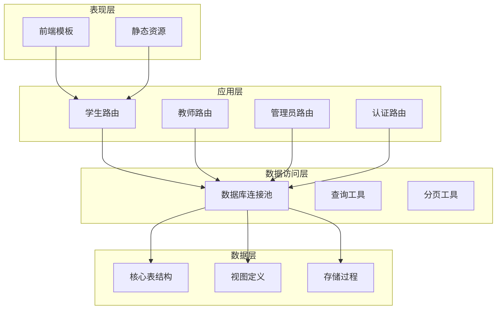
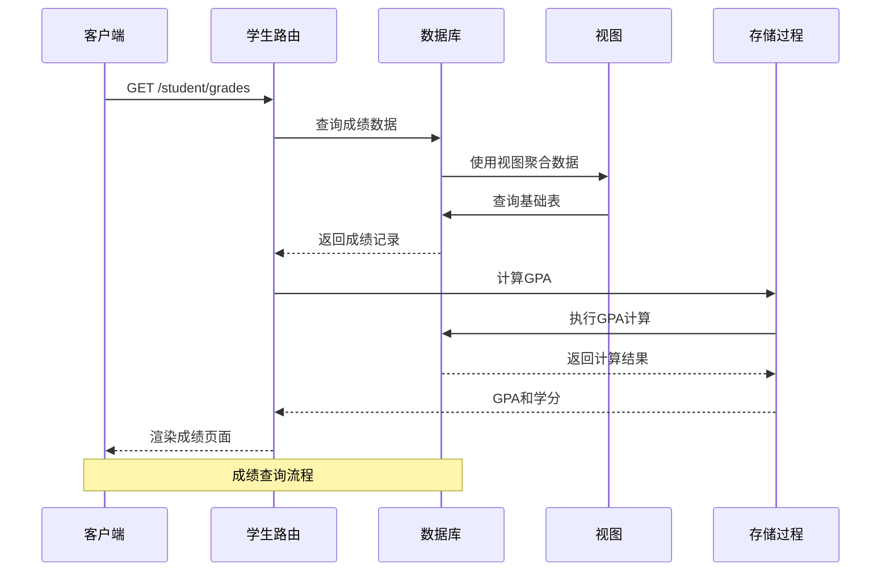
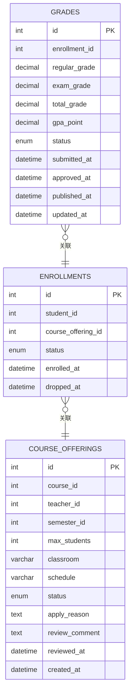
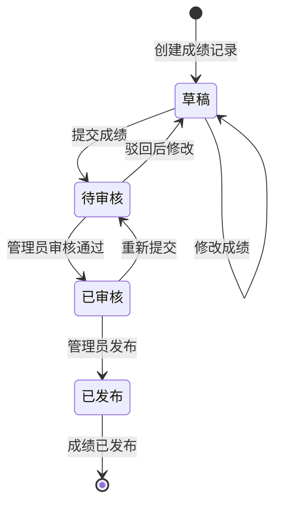
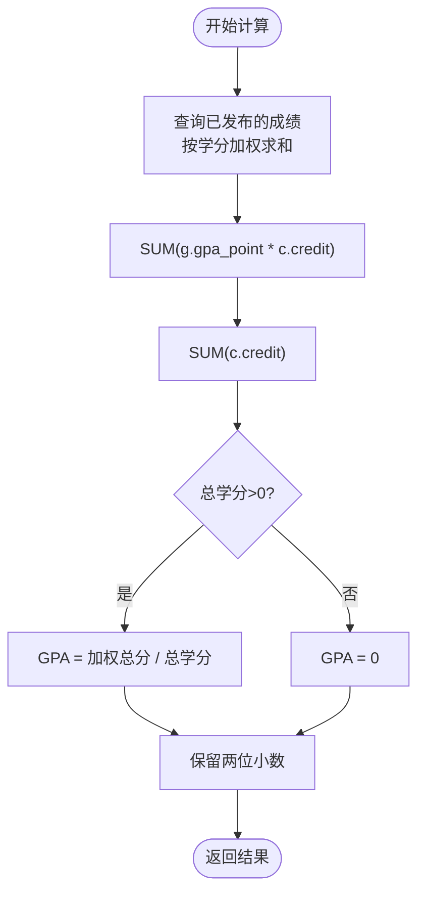
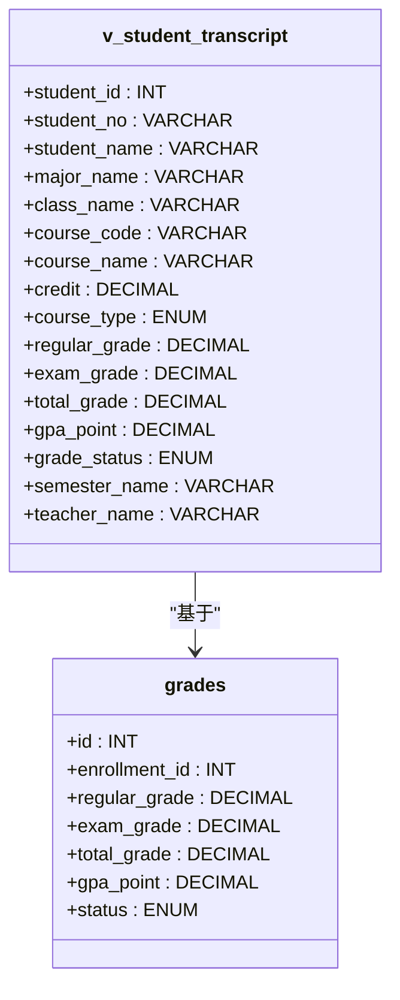
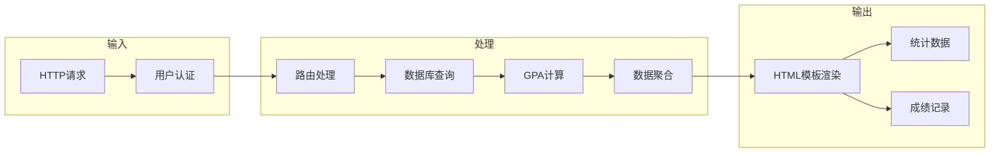
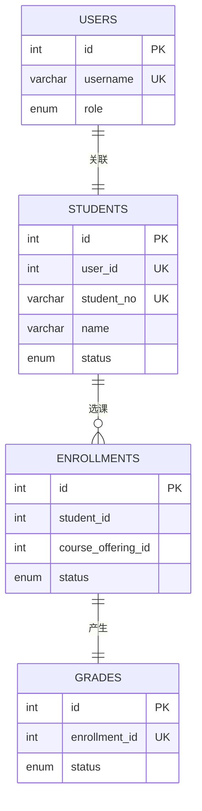

# 成绩与成绩单API

<cite>
**本文档引用的文件**
- [app/student/routes.py](file://app/student/routes.py)
- [sql/04_views.sql](file://sql/04_views.sql)
- [sql/03_procedures.sql](file://sql/03_procedures.sql)
- [sql/01_schema.sql](file://sql/01_schema.sql)
- [app/db.py](file://app/db.py)
- [app/helpers.py](file://app/helpers.py)
- [app/templates/student/grades.html](file://app/templates/student/grades.html)
- [app/templates/student/transcript.html](file://app/templates/student/transcript.html)
</cite>

## 目录
1. [简介](#简介)
2. [项目结构](#项目结构)
3. [核心组件](#核心组件)
4. [架构概览](#架构概览)
5. [详细组件分析](#详细组件分析)
6. [依赖关系分析](#依赖关系分析)
7. [性能考虑](#性能考虑)
8. [故障排除指南](#故障排除指南)
9. [结论](#结论)

## 简介

本文档详细说明了MIS系统中成绩与成绩单功能的API实现，包括成绩查询接口、GPA计算逻辑、成绩单生成接口以及成绩状态管理机制。系统采用Flask框架构建，使用MySQL数据库存储，通过视图和存储过程实现复杂的数据聚合和业务逻辑处理。

## 项目结构

系统采用典型的三层架构设计，主要包含以下模块：

**图表来源**
- [app/student/routes.py:1-233](file://app/student/routes.py#L1-L233)
- [app/db.py:1-121](file://app/db.py#L1-L121)
- [sql/01_schema.sql:1-235](file://sql/01_schema.sql#L1-L235)

**章节来源**
- [app/student/routes.py:1-233](file://app/student/routes.py#L1-L233)
- [app/db.py:1-121](file://app/db.py#L1-L121)

## 核心组件

### 成绩查询接口

系统提供完整的成绩查询功能，支持多种筛选条件和排序方式：

- **端点**: `/student/grades`
- **方法**: GET
- **认证**: 需要学生角色权限
- **功能**: 返回当前学生的完整成绩记录

### 成绩GPA计算

系统实现了两种GPA计算方式：
1. **累计GPA**: 基于所有已发布成绩的学分加权平均
2. **学期GPA**: 基于特定学期的学分加权平均

### 成绩单生成接口

- **端点**: `/student/transcript`
- **方法**: GET
- **功能**: 生成可打印的成绩单，包含学生基本信息和完整成绩记录

**章节来源**
- [app/student/routes.py:185-232](file://app/student/routes.py#L185-L232)

## 架构概览

系统采用模块化设计，各组件职责明确：

**图表来源**
- [app/student/routes.py:185-212](file://app/student/routes.py#L185-L212)
- [sql/04_views.sql:36-66](file://sql/04_views.sql#L36-L66)
- [sql/03_procedures.sql:242-274](file://sql/03_procedures.sql#L242-L274)

## 详细组件分析

### 成绩查询API

#### 接口定义

| 属性 | 值 |
|------|-----|
| 方法 | GET |
| 路径 | `/student/grades` |
| 认证 | 需要登录且为学生角色 |
| 内容类型 | text/html |

#### 请求参数

| 参数名 | 类型 | 必需 | 默认值 | 描述 |
|--------|------|------|--------|------|
| 无 | 无 | 无 | 无 | 直接查询当前登录学生的成绩 |

#### 响应数据结构

**图表来源**
- [sql/01_schema.sql:177-198](file://sql/01_schema.sql#L177-L198)
- [sql/01_schema.sql:158-174](file://sql/01_schema.sql#L158-L174)
- [sql/01_schema.sql:128-155](file://sql/01_schema.sql#L128-L155)

#### 成绩数据字段说明

| 字段名 | 类型 | 取值范围 | 含义 | 是否必填 |
|--------|------|----------|------|----------|
| regular_grade | DECIMAL(5,2) | 0-100 | 平时成绩 | 否 |
| exam_grade | DECIMAL(5,2) | 0-100 | 期末成绩 | 否 |
| total_grade | DECIMAL(5,2) | 0-100 | 总评成绩 | 自动计算 |
| gpa_point | DECIMAL(3,1) | 0.0-4.0 | 绩点 | 自动计算 |
| status | ENUM | draft/submitted/approved/published | 成绩状态 | 是 |

#### 成绩状态管理

**图表来源**
- [sql/01_schema.sql:186-186](file://sql/01_schema.sql#L186-L186)
- [app/student/routes.py:24-33](file://app/student/routes.py#L24-L33)

#### 时间发布机制

| 状态 | 发布时间字段 | 触发条件 |
|------|-------------|----------|
| draft | submitted_at | 创建时自动设置 |
| submitted | submitted_at | 教师提交时更新 |
| approved | approved_at | 管理员审核通过时更新 |
| published | published_at | 管理员发布时更新 |

**章节来源**
- [app/student/routes.py:185-212](file://app/student/routes.py#L185-L212)
- [sql/01_schema.sql:186-189](file://sql/01_schema.sql#L186-L189)

### GPA计算逻辑

#### 累计GPA计算

系统使用SQL实现累计GPA计算，采用学分加权平均算法：

**图表来源**
- [app/student/routes.py:24-33](file://app/student/routes.py#L24-L33)
- [sql/03_procedures.sql:253-270](file://sql/03_procedures.sql#L253-L270)

#### 学期GPA计算

学期GPA计算使用存储过程实现，支持按学期维度的独立计算：

| 参数 | 类型 | 描述 |
|------|------|------|
| p_student_id | INT | 学生ID |
| p_semester_id | INT | 学期ID |
| p_gpa | DECIMAL(4,2) | 输出：GPA结果 |
| p_total_credits | DECIMAL(5,1) | 输出：总学分 |
| p_message | VARCHAR(200) | 输出：处理结果描述 |

**章节来源**
- [app/student/routes.py:24-33](file://app/student/routes.py#L24-L33)
- [sql/03_procedures.sql:242-274](file://sql/03_procedures.sql#L242-L274)

### 成绩单生成API

#### 接口定义

| 属性 | 值 |
|------|-----|
| 方法 | GET |
| 路径 | `/student/transcript` |
| 认证 | 需要登录且为学生角色 |
| 内容类型 | text/html |

#### 成绩单视图使用

系统使用专门的视图 `v_student_transcript` 来生成成绩单：

**图表来源**
- [sql/04_views.sql:36-66](file://sql/04_views.sql#L36-L66)
- [sql/01_schema.sql:177-198](file://sql/01_schema.sql#L177-L198)

#### 成绩统计功能

系统提供完整的成绩统计信息：

| 统计指标 | SQL查询 | 说明 |
|----------|---------|------|
| 已发布成绩数量 | `COUNT(CASE WHEN g.status='published' THEN 1 END)` | 统计已发布的成绩数量 |
| 总课程数 | `COUNT(*)` | 统计选课记录总数 |
| 当前GPA | `_calc_overall_gpa()` | 基于已发布成绩计算的累计GPA |
| 总学分 | `SUM(c.credit)` | 已发布成绩的学分总和 |

**章节来源**
- [app/student/routes.py:200-212](file://app/student/routes.py#L200-L212)
- [app/templates/student/grades.html:6-9](file://app/templates/student/grades.html#L6-L9)

### 数据流分析

**图表来源**
- [app/student/routes.py:185-232](file://app/student/routes.py#L185-L232)
- [app/db.py:43-80](file://app/db.py#L43-L80)

## 依赖关系分析

### 数据库依赖关系

**图表来源**
- [sql/01_schema.sql:15-26](file://sql/01_schema.sql#L15-L26)
- [sql/01_schema.sql:55-77](file://sql/01_schema.sql#L55-L77)
- [sql/01_schema.sql:158-174](file://sql/01_schema.sql#L158-L174)
- [sql/01_schema.sql:177-198](file://sql/01_schema.sql#L177-L198)

### 组件耦合度分析

系统采用低耦合设计：
- **路由层**: 专注于HTTP请求处理
- **数据访问层**: 封装数据库操作
- **业务逻辑层**: 实现复杂的计算和聚合
- **视图层**: 提供数据展示

**章节来源**
- [app/db.py:1-121](file://app/db.py#L1-L121)
- [sql/04_views.sql:1-113](file://sql/04_views.sql#L1-L113)

## 性能考虑

### 查询优化策略

1. **索引优化**: 关键字段建立适当索引
   - `grades.status`: 支持状态过滤
   - `enrollments.student_id`: 支持学生查询
   - `course_offerings.semester_id`: 支持学期筛选

2. **视图优化**: 使用视图减少重复查询
   - `v_student_transcript`: 预聚合学生成绩数据
   - `v_student_schedule`: 预聚合课表信息

3. **缓存策略**: 
   - 连接池复用数据库连接
   - 分页查询避免大数据量传输

### 存储过程优势

- **原子性**: 成绩计算在数据库层面保证一致性
- **性能**: 减少网络往返次数
- **安全性**: 防止SQL注入攻击

## 故障排除指南

### 常见问题及解决方案

| 问题类型 | 症状 | 可能原因 | 解决方案 |
|----------|------|----------|----------|
| 成绩未显示 | 页面显示"成绩未发布" | 成绩状态非"published" | 检查管理员是否已发布 |
| GPA计算异常 | GPA显示为0或NaN | 无已发布成绩或数据异常 | 检查成绩状态和学分数据 |
| 查询超时 | 页面加载缓慢 | 大数据量查询 | 优化分页参数或添加索引 |
| 权限错误 | 403 Forbidden | 非学生用户访问 | 确认用户角色认证 |

### 调试建议

1. **启用数据库日志**: 监控SQL执行情况
2. **检查视图定义**: 确保视图正确反映基础数据
3. **验证存储过程**: 测试GPA计算逻辑
4. **监控连接池**: 确保数据库连接正常

**章节来源**
- [app/student/routes.py:185-232](file://app/student/routes.py#L185-L232)
- [app/db.py:43-80](file://app/db.py#L43-L80)

## 结论

MIS系统的成绩与成绩单功能实现了完整的教育管理需求，具有以下特点：

1. **完整的生命周期管理**: 从成绩录入到发布的全流程管理
2. **灵活的查询能力**: 支持多种筛选条件和排序方式
3. **精确的计算逻辑**: 基于学分加权的GPA计算
4. **良好的扩展性**: 模块化设计便于功能扩展
5. **可靠的性能**: 通过视图和存储过程优化查询性能

系统通过合理的架构设计和完善的错误处理机制，为学生提供了便捷的成绩查询和成绩单生成服务，同时为管理员提供了高效的成绩管理工具。