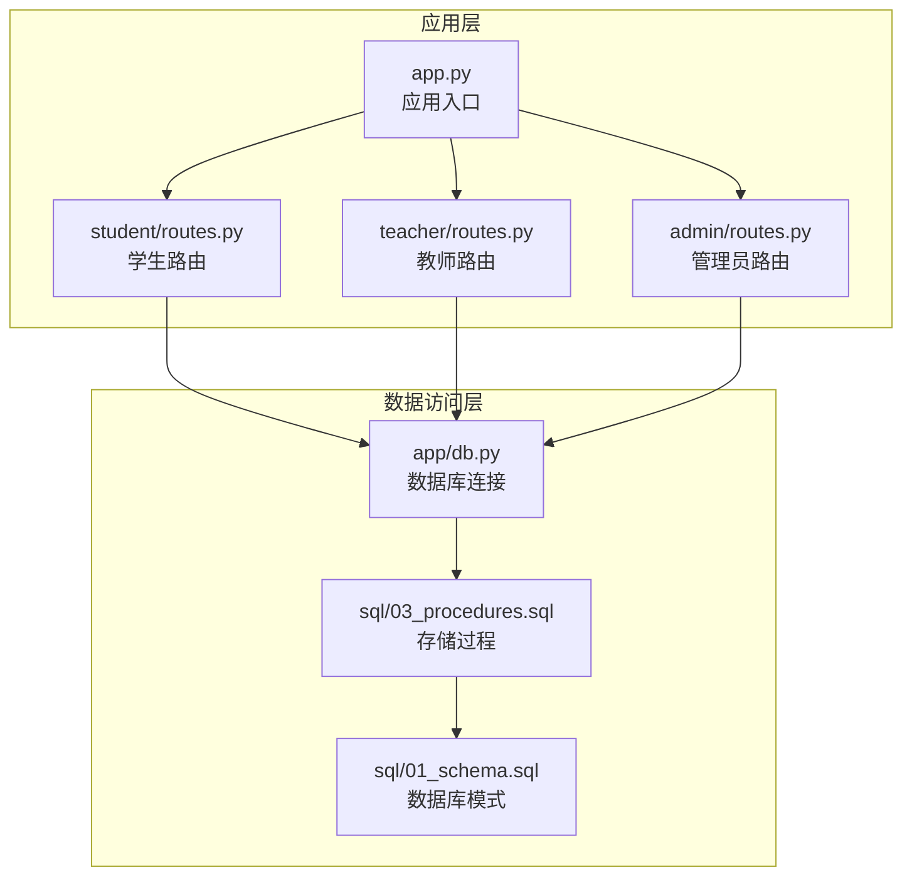
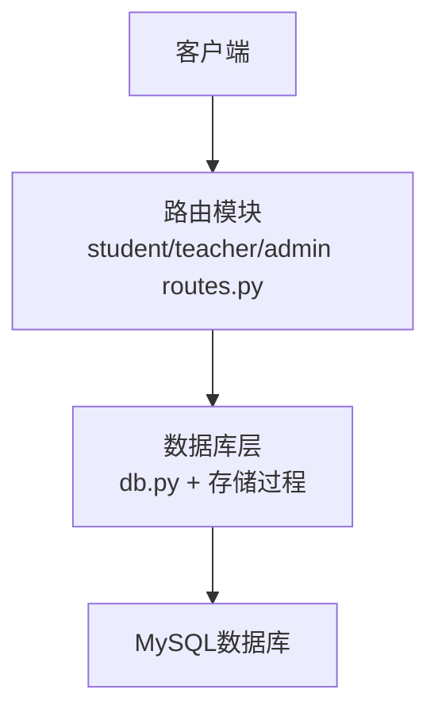
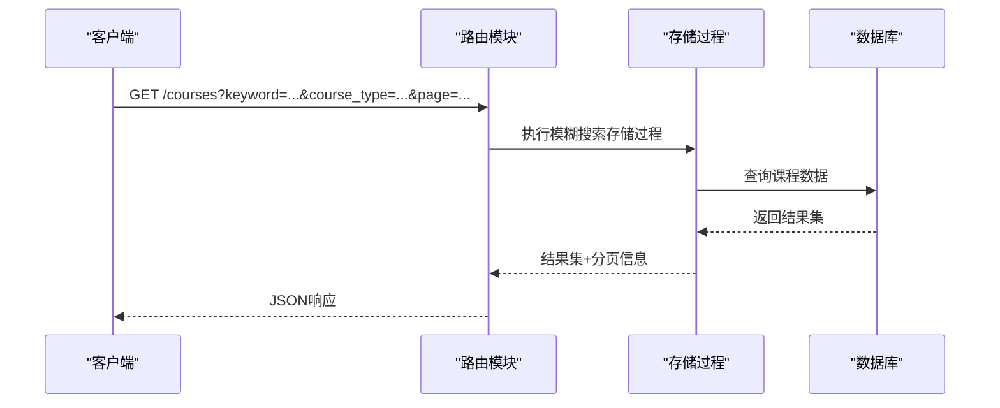
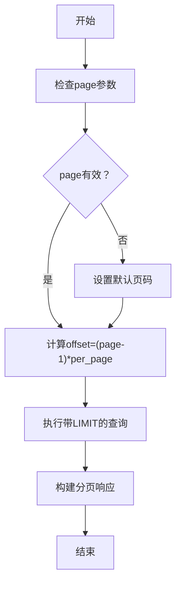
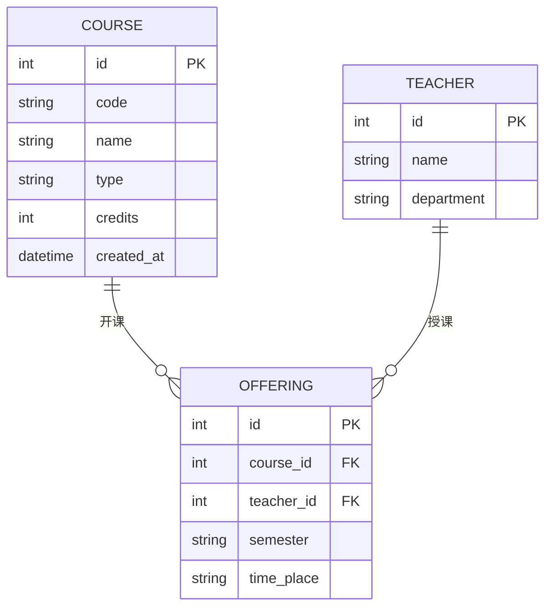
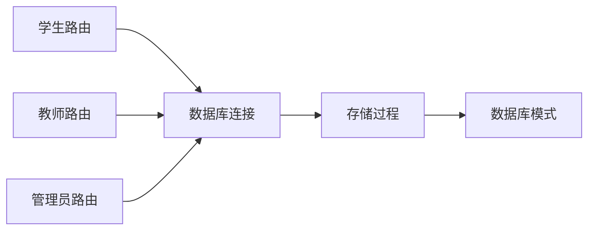

# 课程查询API

<cite>
**本文档引用的文件**
- [app.py](file://app.py)
- [app/db.py](file://app/db.py)
- [app/student/routes.py](file://app/student/routes.py)
- [app/teacher/routes.py](file://app/teacher/routes.py)
- [app/admin/routes.py](file://app/admin/routes.py)
- [sql/01_schema.sql](file://sql/01_schema.sql)
- [sql/03_procedures.sql](file://sql/03_procedures.sql)
</cite>

## 目录
1. [简介](#简介)
2. [项目结构](#项目结构)
3. [核心组件](#核心组件)
4. [架构概览](#架构概览)
5. [详细组件分析](#详细组件分析)
6. [依赖分析](#依赖分析)
7. [性能考虑](#性能考虑)
8. [故障排除指南](#故障排除指南)
9. [结论](#结论)

## 简介
本文件为课程查询功能的API文档，涵盖以下核心功能：
- 课程搜索接口：支持按课程名称、课程代码、教师姓名进行模糊搜索
- 课程类型筛选：通过course_type参数过滤不同类型的课程
- 分页查询机制：page参数的使用与每页显示数量控制
- 课程详情获取：course_detail路由的JSON响应格式
- SQL查询语句与字段映射：课程列表查询的数据库实现
- 请求示例与响应格式：包含错误处理与异常情况

## 项目结构
课程查询功能主要分布在应用入口、数据库连接、以及各角色（学生、教师、管理员）的路由模块中。数据库层通过存储过程和视图提供查询能力。

**图表来源**
- [app.py](file://app.py)
- [app/student/routes.py](file://app/student/routes.py)
- [app/teacher/routes.py](file://app/teacher/routes.py)
- [app/admin/routes.py](file://app/admin/routes.py)
- [app/db.py](file://app/db.py)
- [sql/01_schema.sql](file://sql/01_schema.sql)
- [sql/03_procedures.sql](file://sql/03_procedures.sql)

**章节来源**
- [app.py](file://app.py)
- [app/db.py](file://app/db.py)
- [app/student/routes.py](file://app/student/routes.py)
- [app/teacher/routes.py](file://app/teacher/routes.py)
- [app/admin/routes.py](file://app/admin/routes.py)
- [sql/01_schema.sql](file://sql/01_schema.sql)
- [sql/03_procedures.sql](file://sql/03_procedures.sql)

## 核心组件
- 应用入口：负责初始化Flask应用、注册蓝图、配置数据库连接等
- 数据库连接：封装数据库连接池、事务管理与查询执行
- 路由模块：按角色划分，提供课程查询、筛选、分页与详情获取接口
- 存储过程：封装复杂的查询逻辑，支持模糊匹配、类型筛选与分页
- 数据库模式：定义课程、教师、开课等核心表结构

**章节来源**
- [app.py](file://app.py)
- [app/db.py](file://app/db.py)
- [sql/01_schema.sql](file://sql/01_schema.sql)
- [sql/03_procedures.sql](file://sql/03_procedures.sql)

## 架构概览
课程查询API采用分层架构：
- 表现层：路由模块处理HTTP请求，返回JSON响应
- 业务层：路由中调用数据库操作，实现搜索、筛选与分页
- 数据访问层：通过存储过程执行SQL查询，确保性能与安全性
- 数据层：MySQL数据库存储课程、教师、开课等信息

**图表来源**
- [app/student/routes.py](file://app/student/routes.py)
- [app/teacher/routes.py](file://app/teacher/routes.py)
- [app/admin/routes.py](file://app/admin/routes.py)
- [app/db.py](file://app/db.py)
- [sql/03_procedures.sql](file://sql/03_procedures.sql)

## 详细组件分析

### 课程搜索接口
- 功能描述：支持按课程名称、课程代码、教师姓名进行模糊搜索
- 实现方式：路由接收关键词参数，调用存储过程执行模糊匹配查询
- 参数说明：
  - keyword：搜索关键词（字符串）
  - course_type：课程类型过滤（可选）
  - page：页码（整数，默认1）
  - per_page：每页条数（整数，默认固定值）
- 返回格式：JSON对象，包含课程列表、总条数、当前页等信息

**图表来源**
- [app/student/routes.py](file://app/student/routes.py)
- [app/teacher/routes.py](file://app/teacher/routes.py)
- [app/admin/routes.py](file://app/admin/routes.py)
- [sql/03_procedures.sql](file://sql/03_procedures.sql)

**章节来源**
- [app/student/routes.py](file://app/student/routes.py)
- [app/teacher/routes.py](file://app/teacher/routes.py)
- [app/admin/routes.py](file://app/admin/routes.py)
- [sql/03_procedures.sql](file://sql/03_procedures.sql)

### 课程类型筛选功能
- 参数：course_type（字符串或枚举值）
- 实现：存储过程在查询时添加类型过滤条件
- 支持类型：根据数据库schema定义的课程类型枚举
- 多类型筛选：可通过逗号分隔传入多个类型值

**章节来源**
- [sql/01_schema.sql](file://sql/01_schema.sql)
- [sql/03_procedures.sql](file://sql/03_procedures.sql)

### 分页查询机制
- page参数：当前页码（从1开始）
- per_page参数：每页显示数量（默认固定值）
- 计算逻辑：page-1乘以per_page作为偏移量
- 返回信息：包含total（总数）、pages（总页数）、current_page、has_next、has_prev等

**图表来源**
- [app/student/routes.py](file://app/student/routes.py)
- [app/teacher/routes.py](file://app/teacher/routes.py)
- [app/admin/routes.py](file://app/admin/routes.py)

**章节来源**
- [app/student/routes.py](file://app/student/routes.py)
- [app/teacher/routes.py](file://app/teacher/routes.py)
- [app/admin/routes.py](file://app/admin/routes.py)

### 课程详情获取接口
- 路由：course_detail（具体路径以实际路由为准）
- 功能：根据课程ID获取详细信息
- 响应格式：JSON对象，包含课程基本信息、教师信息、时间地点、选课人数等
- 错误处理：课程不存在时返回404状态码

**章节来源**
- [app/student/routes.py](file://app/student/routes.py)
- [app/teacher/routes.py](file://app/teacher/routes.py)
- [app/admin/routes.py](file://app/admin/routes.py)

### 课程列表查询的SQL实现
- 存储过程：封装了模糊搜索、类型过滤、分页查询的完整逻辑
- 关键查询要素：
  - 模糊匹配：对课程名称、课程代码、教师姓名使用LIKE操作符
  - 类型过滤：WHERE子句根据course_type参数动态生成
  - 排序规则：按课程ID或创建时间排序
  - 分页限制：使用LIMIT和OFFSET控制结果集大小
- 字段映射：查询结果映射到JSON响应的字段结构

**图表来源**
- [sql/01_schema.sql](file://sql/01_schema.sql)
- [sql/03_procedures.sql](file://sql/03_procedures.sql)

**章节来源**
- [sql/01_schema.sql](file://sql/01_schema.sql)
- [sql/03_procedures.sql](file://sql/03_procedures.sql)

## 依赖分析
- 路由模块依赖数据库连接层，通过统一的db.py进行查询
- 存储过程依赖数据库schema定义的表结构
- 各角色路由共享相同的查询逻辑，但可能有不同的权限控制
- 前端模板依赖后端提供的JSON接口

**图表来源**
- [app/student/routes.py](file://app/student/routes.py)
- [app/teacher/routes.py](file://app/teacher/routes.py)
- [app/admin/routes.py](file://app/admin/routes.py)
- [app/db.py](file://app/db.py)
- [sql/01_schema.sql](file://sql/01_schema.sql)
- [sql/03_procedures.sql](file://sql/03_procedures.sql)

**章节来源**
- [app/student/routes.py](file://app/student/routes.py)
- [app/teacher/routes.py](file://app/teacher/routes.py)
- [app/admin/routes.py](file://app/admin/routes.py)
- [app/db.py](file://app/db.py)
- [sql/01_schema.sql](file://sql/01_schema.sql)
- [sql/03_procedures.sql](file://sql/03_procedures.sql)

## 性能考虑
- 使用存储过程集中处理复杂查询，减少网络往返
- 合理设置每页数量，避免一次性返回过多数据
- 对常用查询字段建立索引，提升模糊匹配性能
- 控制LIKE操作符前缀，优先使用后缀匹配以利用索引

## 故障排除指南
- 400错误：参数缺失或格式不正确（如page非整数）
- 404错误：课程不存在或搜索无结果
- 500错误：数据库连接失败或存储过程执行异常
- 建议的日志记录点：请求参数验证、数据库查询执行、异常捕获

**章节来源**
- [app/student/routes.py](file://app/student/routes.py)
- [app/teacher/routes.py](file://app/teacher/routes.py)
- [app/admin/routes.py](file://app/admin/routes.py)
- [app/db.py](file://app/db.py)

## 结论
课程查询API提供了完整的课程搜索、筛选、分页与详情获取能力。通过存储过程实现高性能查询，配合清晰的参数规范与响应格式，满足不同角色用户的需求。建议在生产环境中进一步完善参数校验、缓存策略与监控告警机制。