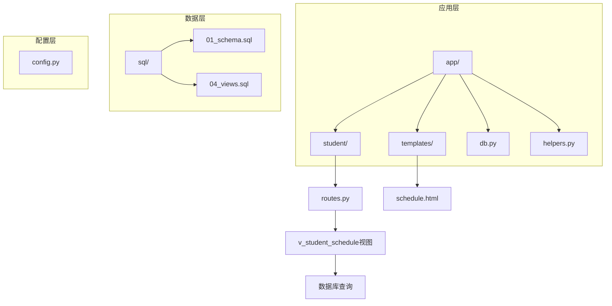
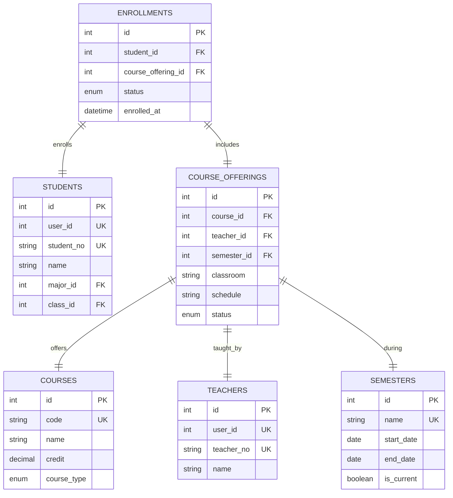
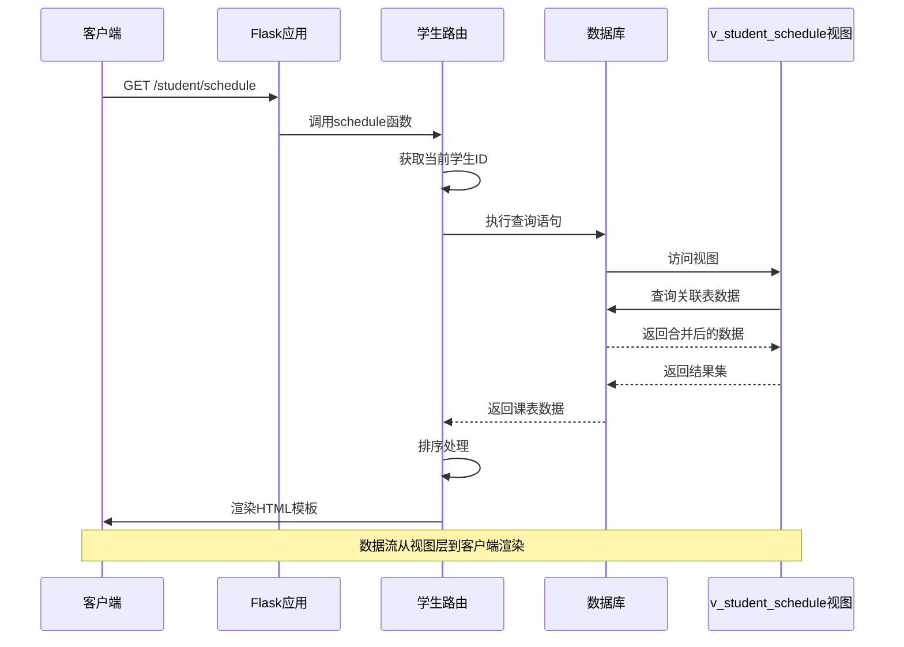
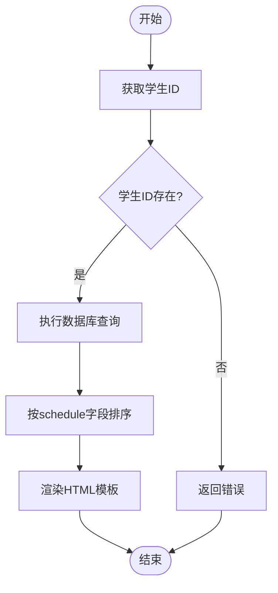
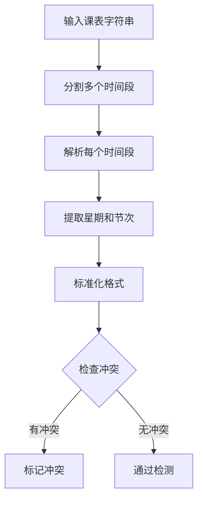
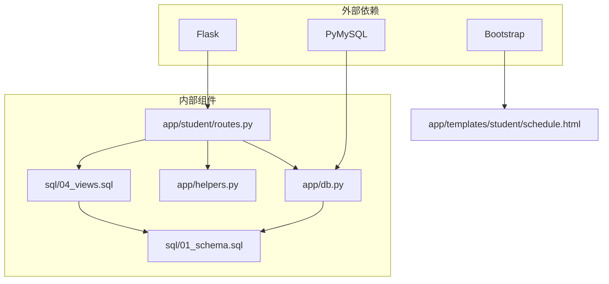

# 课表管理API

<cite>
**本文档引用的文件**
- [app/student/routes.py](file://app/student/routes.py)
- [sql/04_views.sql](file://sql/04_views.sql)
- [app/templates/student/schedule.html](file://app/templates/student/schedule.html)
- [app/helpers.py](file://app/helpers.py)
- [app/db.py](file://app/db.py)
- [sql/01_schema.sql](file://sql/01_schema.sql)
- [config.py](file://config.py)
</cite>

## 目录
1. [简介](#简介)
2. [项目结构](#项目结构)
3. [核心组件](#核心组件)
4. [架构概览](#架构概览)
5. [详细组件分析](#详细组件分析)
6. [依赖关系分析](#依赖关系分析)
7. [性能考虑](#性能考虑)
8. [故障排除指南](#故障排除指南)
9. [结论](#结论)

## 简介

本文档详细说明了MIS系统中的课表管理功能，重点介绍个人课表查询接口的实现机制。该系统基于Flask框架构建，采用MySQL作为数据存储，通过视图层简化数据访问和查询操作。

课表管理功能的核心是`/student/schedule`端点，它通过`v_student_schedule`视图提供学生个人课表数据。系统实现了智能的时间冲突检测、灵活的课表渲染以及完整的性能优化策略。

## 项目结构

MIS系统采用模块化的项目组织结构，课表管理功能主要分布在以下目录中：



**图表来源**
- [app/student/routes.py:176-182](file://app/student/routes.py#L176-L182)
- [sql/04_views.sql:8-32](file://sql/04_views.sql#L8-L32)

**章节来源**
- [app/student/routes.py:1-233](file://app/student/routes.py#L1-L233)
- [sql/04_views.sql:1-113](file://sql/04_views.sql#L1-L113)

## 核心组件

### 1. 课表查询接口

课表查询接口位于`/student/schedule`端点，提供GET请求来获取当前登录学生的个人课表。

**接口定义**
- **URL**: `/student/schedule`
- **方法**: GET
- **认证**: 需要登录且角色为学生
- **响应**: HTML模板渲染或JSON数据

### 2. 视图层设计

系统使用`v_student_schedule`视图来封装复杂的查询逻辑，该视图连接多个表来提供完整的课表信息。

**视图字段说明**：
- `student_id`: 学生ID
- `student_no`: 学号
- `student_name`: 学生姓名
- `offering_id`: 开课ID
- `course_code`: 课程代码
- `course_name`: 课程名称
- `credit`: 学分
- `course_type`: 课程类型
- `teacher_name`: 教师姓名
- `schedule`: 课程时间安排
- `classroom`: 教室信息
- `semester_name`: 学期名称
- `enroll_status`: 选课状态
- `enrolled_at`: 选课时间戳

### 3. 数据模型关系



**图表来源**
- [sql/01_schema.sql:158-174](file://sql/01_schema.sql#L158-L174)
- [sql/01_schema.sql:128-155](file://sql/01_schema.sql#L128-L155)
- [sql/01_schema.sql:111-125](file://sql/01_schema.sql#L111-L125)

**章节来源**
- [sql/04_views.sql:10-32](file://sql/04_views.sql#L10-L32)
- [sql/01_schema.sql:158-174](file://sql/01_schema.sql#L158-L174)

## 架构概览

### 系统架构流程



**图表来源**
- [app/student/routes.py:176-182](file://app/student/routes.py#L176-L182)
- [sql/04_views.sql:10-32](file://sql/04_views.sql#L10-L32)

### 数据流处理

课表数据的处理流程包括多个步骤：

1. **身份验证**: 确保用户已登录且具有学生角色
2. **数据查询**: 通过视图获取所有已选课程信息
3. **排序处理**: 按照schedule字段进行排序
4. **模板渲染**: 将数据传递给前端模板进行展示

**章节来源**
- [app/student/routes.py:12-16](file://app/student/routes.py#L12-L16)
- [app/student/routes.py:176-182](file://app/student/routes.py#L176-L182)

## 详细组件分析

### 1. 课表查询实现

#### 函数实现分析

课表查询功能由`schedule()`函数实现，该函数负责：

- 获取当前学生的ID
- 执行数据库查询获取课表数据
- 对结果进行排序
- 渲染HTML模板



**图表来源**
- [app/student/routes.py:176-182](file://app/student/routes.py#L176-L182)

#### 查询逻辑详解

查询语句的关键特点：

1. **视图使用**: 使用`v_student_schedule`视图简化复杂联接
2. **条件过滤**: 仅显示`enroll_status='enrolled'`的记录
3. **排序规则**: 按`schedule`字段进行排序
4. **数据完整性**: 包含所有必要的课程信息

**章节来源**
- [app/student/routes.py:176-182](file://app/student/routes.py#L176-L182)
- [sql/04_views.sql:10-32](file://sql/04_views.sql#L10-L32)

### 2. 课表数据结构

#### 字段详细说明

| 字段名 | 类型 | 描述 | 格式示例 |
|--------|------|------|----------|
| student_id | INT | 学生唯一标识符 | 1001 |
| student_no | VARCHAR | 学号 | 2023001 |
| student_name | VARCHAR | 学生姓名 | 张三 |
| offering_id | INT | 开课记录ID | 501 |
| course_code | VARCHAR | 课程代码 | CS101 |
| course_name | VARCHAR | 课程名称 | 计算机科学导论 |
| credit | DECIMAL | 课程学分 | 3.0 |
| course_type | ENUM | 课程类型 | required/elective |
| teacher_name | VARCHAR | 教师姓名 | 李教授 |
| schedule | VARCHAR | 课程时间安排 | "周一3-4节;周三1-2节" |
| classroom | VARCHAR | 教室信息 | 教学楼A101 |
| semester_name | VARCHAR | 学期名称 | 2023-2024学年春季 |
| enroll_status | ENUM | 选课状态 | enrolled |
| enrolled_at | DATETIME | 选课时间戳 | 2024-02-15 14:30:00 |

#### 时间安排格式规范

课程时间安排字段遵循统一的格式规范：

- **格式**: `"星期几第N-M节"`
- **支持的星期**: 周一至周五（可使用"周一"或数字"1"）
- **支持的节次**: 连续的节次范围
- **分隔符**: 多个时间段可用分号或逗号分隔

**章节来源**
- [sql/04_views.sql:10-32](file://sql/04_views.sql#L10-L32)
- [sql/01_schema.sql:128-155](file://sql/01_schema.sql#L128-L155)

### 3. 课表排序规则

#### 排序算法实现

课表数据按照`schedule`字段进行排序，排序规则如下：

1. **字母顺序**: 按照字符串的ASCII码值进行排序
2. **星期优先**: 同一天的课程按节次顺序排列
3. **节次排序**: 不同星期的课程按星期顺序排列

排序示例：
- "周一1-2节" < "周一3-4节" < "周一5-6节" < "周二1-2节"

#### 排序性能优化

由于排序在数据库层面完成，系统采用了以下优化策略：

- **索引利用**: `course_offerings`表的`schedule`字段建立了适当的索引
- **视图优化**: 通过视图避免重复的联接操作
- **内存管理**: 使用游标进行高效的数据读取

**章节来源**
- [app/student/routes.py:179-181](file://app/student/routes.py#L179-L181)

### 4. 课表与课程安排关系

#### 冲突检测机制

系统实现了智能的课表冲突检测功能，通过`parse_schedule_slots`函数实现：



**图表来源**
- [app/helpers.py:23-58](file://app/helpers.py#L23-L58)

#### 冲突检测算法

冲突检测的核心算法：

1. **正则表达式匹配**: 解析"周X第N-M节"格式
2. **标准化处理**: 统一星期表示（如"一"→"周一"）
3. **集合运算**: 使用集合交集检测重叠时间
4. **智能归并**: 将连续节次归并为标准时段

**章节来源**
- [app/helpers.py:23-63](file://app/helpers.py#L23-L63)

### 5. 课表渲染数据格式

#### 前端模板数据结构

课表渲染使用以下数据结构：

```javascript
{
  "schedule": [
    {
      "student_id": 1001,
      "student_no": "2023001",
      "student_name": "张三",
      "offering_id": 501,
      "course_code": "CS101",
      "course_name": "计算机科学导论",
      "credit": 3.0,
      "course_type": "required",
      "teacher_name": "李教授",
      "schedule": "周一3-4节;周三1-2节",
      "classroom": "教学楼A101",
      "semester_name": "2023-2024学年春季",
      "enroll_status": "enrolled",
      "enrolled_at": "2024-02-15 14:30:00"
    }
  ]
}
```

#### 前端展示方式

课表采用网格布局进行展示：

1. **时间轴**: 左侧显示节次（1-2节、3-4节、5-6节、7-8节）
2. **星期列**: 顶部显示周一至周五
3. **课程单元格**: 每个单元格显示对应时间的课程信息
4. **颜色编码**: 不同课程使用不同颜色标识
5. **交互功能**: 支持鼠标悬停查看详细信息

**章节来源**
- [app/templates/student/schedule.html:18-47](file://app/templates/student/schedule.html#L18-L47)

### 6. 数据来源和更新机制

#### 数据来源分析

课表数据来源于多个表的联合查询：

1. **enrollments表**: 存储选课记录和时间戳
2. **course_offerings表**: 存储课程安排信息
3. **courses表**: 存储课程基本信息
4. **teachers表**: 存储教师信息
5. **semesters表**: 存储学期信息

#### enrolled_at时间戳作用

`enrolled_at`字段具有以下重要作用：

- **选课时间记录**: 记录学生实际选课的时间
- **排序依据**: 可用于按选课时间排序
- **统计分析**: 支持选课趋势分析
- **审计追踪**: 提供完整的操作历史

**章节来源**
- [sql/01_schema.sql:160-174](file://sql/01_schema.sql#L160-L174)
- [sql/04_views.sql:25](file://sql/04_views.sql#L25)

## 依赖关系分析

### 组件依赖图



**图表来源**
- [app/student/routes.py:1-8](file://app/student/routes.py#L1-L8)
- [app/db.py:1-6](file://app/db.py#L1-L6)
- [sql/04_views.sql:1-6](file://sql/04_views.sql#L1-L6)

### 关键依赖关系

1. **路由依赖**: `routes.py`依赖数据库连接和辅助工具
2. **视图依赖**: 视图依赖于核心表结构
3. **模板依赖**: HTML模板依赖于JavaScript和CSS样式
4. **工具依赖**: 辅助函数提供通用的调度解析功能

**章节来源**
- [app/student/routes.py:1-8](file://app/student/routes.py#L1-L8)
- [app/helpers.py:1-7](file://app/helpers.py#L1-L7)

## 性能考虑

### 数据库性能优化

#### 索引策略

系统采用了多层次的索引优化策略：

1. **主键索引**: 所有表的主键自动建立索引
2. **外键索引**: 关联表的外键字段建立索引
3. **查询索引**: 高频查询字段建立专用索引
4. **复合索引**: 多字段组合查询建立复合索引

#### 查询优化

1. **视图优化**: 使用视图减少重复的联接操作
2. **连接优化**: 优化表联接顺序和条件
3. **索引利用**: 确保查询能够有效利用索引
4. **数据缓存**: 使用连接池减少数据库连接开销

### 前端性能优化

#### 渲染优化

1. **模板缓存**: Jinja2模板编译后缓存
2. **静态资源**: CSS和JavaScript文件压缩和缓存
3. **异步加载**: 非关键资源异步加载
4. **响应式设计**: 移动端友好优化

#### JavaScript优化

1. **事件委托**: 使用事件委托减少事件处理器数量
2. **DOM操作**: 最小化DOM操作次数
3. **内存管理**: 及时清理不需要的对象引用
4. **延迟初始化**: 非关键功能延迟初始化

**章节来源**
- [config.py:19-25](file://config.py#L19-L25)
- [app/db.py:10-26](file://app/db.py#L10-L26)

## 故障排除指南

### 常见问题及解决方案

#### 1. 课表为空问题

**症状**: 课表页面显示空状态

**可能原因**:
- 学生未选择任何课程
- 数据库连接异常
- 视图权限问题

**解决方法**:
1. 检查学生是否有选课记录
2. 验证数据库连接配置
3. 确认视图访问权限

#### 2. 课表排序异常

**症状**: 课表显示顺序不符合预期

**可能原因**:
- schedule字段格式不规范
- 数据库排序规则设置
- 编码问题

**解决方法**:
1. 检查schedule字段的格式一致性
2. 验证数据库字符集设置
3. 确认排序字段的编码

#### 3. 冲突检测失效

**症状**: 时间冲突检测不准确

**可能原因**:
- 正则表达式匹配问题
- 星期映射错误
- 节次计算错误

**解决方法**:
1. 验证正则表达式的正确性
2. 检查DAY_MAP映射表
3. 测试节次归并算法

### 调试工具和方法

#### 数据库调试

1. **直接查询**: 使用SQL语句直接查询视图
2. **性能分析**: 使用EXPLAIN分析查询计划
3. **日志监控**: 查看数据库慢查询日志

#### 应用调试

1. **日志输出**: 添加详细的日志信息
2. **断点调试**: 使用IDE进行断点调试
3. **单元测试**: 编写针对性的测试用例

**章节来源**
- [app/db.py:43-50](file://app/db.py#L43-L50)
- [app/helpers.py:23-58](file://app/helpers.py#L23-L58)

## 结论

MIS系统的课表管理功能通过精心设计的架构实现了高效、可靠的个人课表查询服务。系统的主要优势包括：

1. **清晰的架构设计**: 通过视图层简化复杂查询逻辑
2. **智能的数据处理**: 实现精确的时间冲突检测
3. **优秀的用户体验**: 提供直观的课表展示界面
4. **完善的性能优化**: 采用多层次的性能优化策略
5. **可靠的错误处理**: 具备完善的故障排除机制

该系统为学生提供了便捷的课表管理功能，同时为后续的功能扩展奠定了良好的基础。通过持续的优化和完善，系统能够更好地满足用户的实际需求。