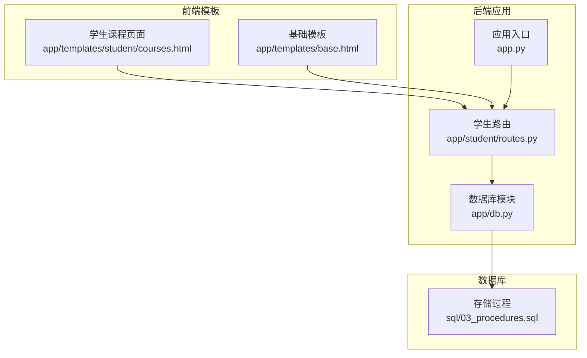
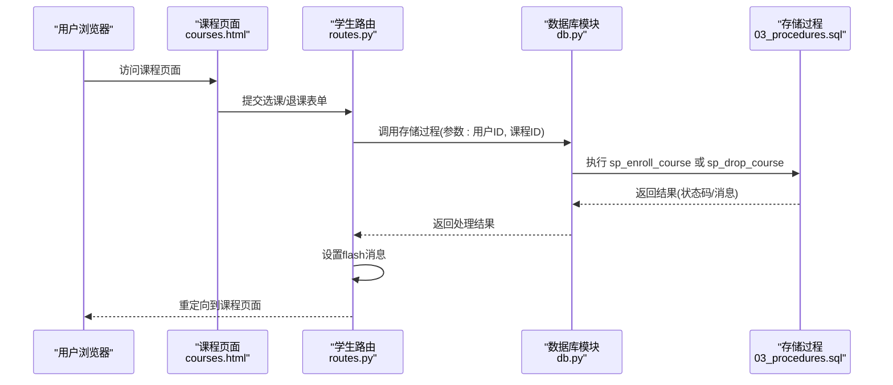
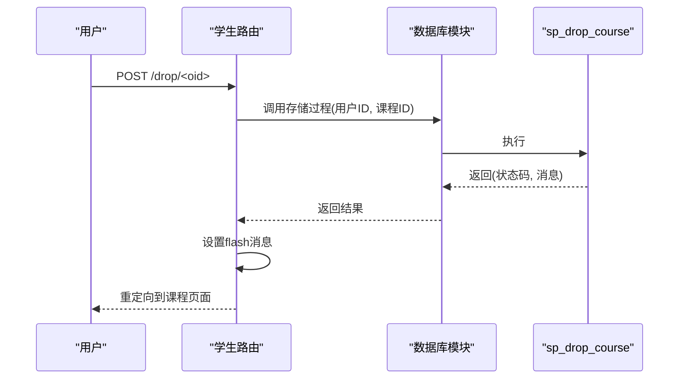
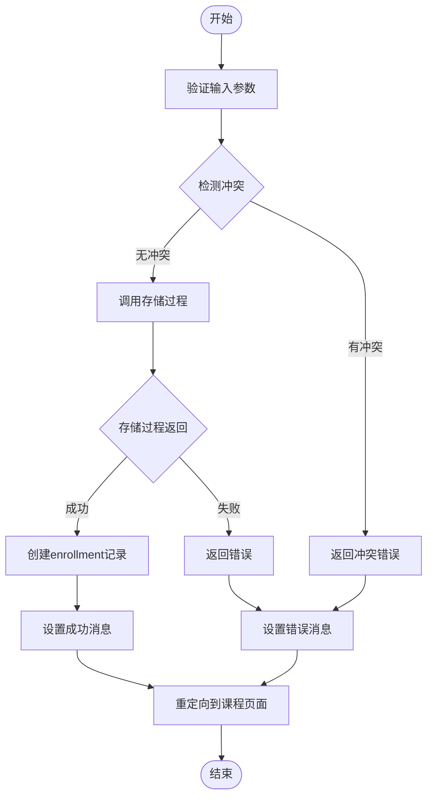
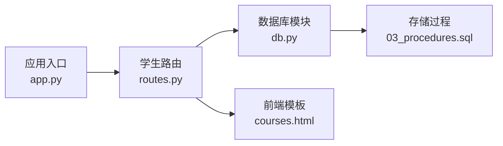

# 选课退课管理API

<cite>
**本文档引用的文件**
- [app.py](file://app.py)
- [app/student/routes.py](file://app/student/routes.py)
- [app/db.py](file://app/db.py)
- [sql/03_procedures.sql](file://sql/03_procedures.sql)
- [app/templates/student/courses.html](file://app/templates/student/courses.html)
- [app/templates/base.html](file://app/templates/base.html)
</cite>

## 目录
1. [简介](#简介)
2. [项目结构](#项目结构)
3. [核心组件](#核心组件)
4. [架构概览](#架构概览)
5. [详细组件分析](#详细组件分析)
6. [依赖关系分析](#依赖关系分析)
7. [性能考虑](#性能考虑)
8. [故障排除指南](#故障排除指南)
9. [结论](#结论)

## 简介
本文件为选课退课管理功能的API文档，涵盖以下内容：
- 选课接口：/enroll/<int:oid> 的POST请求实现与存储过程调用
- 退课接口：/drop/<int:oid> 的POST请求实现与存储过程调用
- 选课状态管理：enrollment状态变更与冲突检测机制
- 结果反馈：flash消息与错误处理
- 完整流程示例：成功选课、时间冲突、容量限制等场景
- 存储过程返回参数与业务逻辑

## 项目结构
该系统采用Flask应用结构，学生端路由负责处理选课/退课请求，并通过数据库模块调用存储过程完成业务逻辑。

**图表来源**
- [app.py](file://app.py)
- [app/student/routes.py](file://app/student/routes.py)
- [app/db.py](file://app/db.py)
- [sql/03_procedures.sql](file://sql/03_procedures.sql)

**章节来源**
- [app.py](file://app.py)
- [app/student/routes.py](file://app/student/routes.py)
- [app/db.py](file://app/db.py)
- [sql/03_procedures.sql](file://sql/03_procedures.sql)

## 核心组件
- 学生路由模块：定义/enroll/<int:oid> 和 /drop/<int:oid> 路由，处理表单提交与重定向
- 数据库模块：封装数据库连接与存储过程调用
- 存储过程：sp_enroll_course（选课）、sp_drop_course（退课）
- 前端模板：courses.html 展示课程列表与操作按钮

**章节来源**
- [app/student/routes.py](file://app/student/routes.py)
- [app/db.py](file://app/db.py)
- [sql/03_procedures.sql](file://sql/03_procedures.sql)
- [app/templates/student/courses.html](file://app/templates/student/courses.html)

## 架构概览
选课/退课请求从学生课程页面发起，经由学生路由处理，调用数据库模块执行存储过程，最终返回flash消息并重定向到课程页面。

**图表来源**
- [app/student/routes.py](file://app/student/routes.py)
- [app/db.py](file://app/db.py)
- [sql/03_procedures.sql](file://sql/03_procedures.sql)
- [app/templates/student/courses.html](file://app/templates/student/courses.html)

## 详细组件分析

### 选课接口 /enroll/<int:oid>
- 请求方法：POST
- 功能：根据课程ID执行选课逻辑
- 参数传递：
  - 路径参数：oid（课程ID）
  - 表单数据：包含用户ID（通常来自会话）
- 存储过程调用：sp_enroll_course
  - 输入参数：用户ID、课程ID
  - 返回参数：状态码、提示信息
- 状态管理：
  - enrollment状态变更：成功时创建enrollment记录；失败时保持不变
  - 冲突检测：时间冲突、容量限制、重复选课等
- 结果反馈：
  - 成功：设置成功flash消息
  - 失败：设置错误flash消息
  - 重定向：返回课程页面

**图表来源**
- [app/student/routes.py](file://app/student/routes.py)
- [app/db.py](file://app/db.py)
- [sql/03_procedures.sql](file://sql/03_procedures.sql)

**章节来源**
- [app/student/routes.py](file://app/student/routes.py)
- [app/db.py](file://app/db.py)
- [sql/03_procedures.sql](file://sql/03_procedures.sql)

### 退课接口 /drop/<int:oid>
- 请求方法：POST
- 功能：根据课程ID执行退课逻辑
- 参数传递：
  - 路径参数：oid（课程ID）
  - 表单数据：包含用户ID（通常来自会话）
- 存储过程调用：sp_drop_course
  - 输入参数：用户ID、课程ID
  - 返回参数：状态码、提示信息
- 状态管理：
  - enrollment状态变更：成功时删除enrollment记录
  - 冲突检测：不允许在已录入成绩或超出退课截止时间后退课
- 结果反馈：
  - 成功：设置成功flash消息
  - 失败：设置错误flash消息
  - 重定向：返回课程页面

**图表来源**
- [app/student/routes.py](file://app/student/routes.py)
- [app/db.py](file://app/db.py)
- [sql/03_procedures.sql](file://sql/03_procedures.sql)

**章节来源**
- [app/student/routes.py](file://app/student/routes.py)
- [app/db.py](file://app/db.py)
- [sql/03_procedures.sql](file://sql/03_procedures.sql)

### 选课状态管理与冲突检测
- enrollment状态变更：
  - 选课成功：创建enrollment记录
  - 退课成功：删除enrollment记录
- 冲突检测机制：
  - 时间冲突：检查课程时间是否与其他已选课程冲突
  - 容量限制：检查课程剩余容量
  - 重复选课：检查是否已存在相同enrollment记录
  - 成绩已录入：禁止退课
  - 截止时间：超过退课截止时间则不允许退课

**图表来源**
- [app/student/routes.py](file://app/student/routes.py)
- [app/db.py](file://app/db.py)
- [sql/03_procedures.sql](file://sql/03_procedures.sql)

**章节来源**
- [app/student/routes.py](file://app/student/routes.py)
- [app/db.py](file://app/db.py)
- [sql/03_procedures.sql](file://sql/03_procedures.sql)

### 选课结果反馈机制
- flash消息：
  - 成功消息：用于确认选课/退课成功
  - 错误消息：用于提示冲突、容量不足、权限问题等
- 错误处理：
  - 参数校验失败：返回400错误
  - 权限不足：返回403错误
  - 业务逻辑异常：返回500错误
- 重定向：
  - 所有操作完成后重定向到课程页面，确保用户界面刷新

**章节来源**
- [app/student/routes.py](file://app/student/routes.py)
- [app/templates/student/courses.html](file://app/templates/student/courses.html)

### 完整流程示例

#### 场景一：成功选课
- 步骤：
  1. 用户在课程页面点击“选课”
  2. 路由接收POST请求，提取用户ID与课程ID
  3. 调用sp_enroll_course
  4. 存储过程返回成功状态
  5. 设置成功flash消息
  6. 重定向到课程页面
- 预期结果：课程出现在用户的已选课程列表中

#### 场景二：时间冲突
- 触发条件：新选课程与已选课程时间重叠
- 处理流程：
  1. 路由调用存储过程
  2. 存储过程检测到时间冲突
  3. 返回冲突错误
  4. 设置错误flash消息
  5. 重定向到课程页面
- 预期结果：课程未被添加，用户收到冲突提示

#### 场景三：容量限制
- 触发条件：课程剩余容量为0
- 处理流程：
  1. 路由调用存储过程
  2. 存储过程检测到容量不足
  3. 返回容量限制错误
  4. 设置错误flash消息
  5. 重定向到课程页面
- 预期结果：课程未被添加，用户收到容量不足提示

#### 场景四：退课
- 步骤：
  1. 用户在课程页面点击“退课”
  2. 路由接收POST请求，提取用户ID与课程ID
  3. 调用sp_drop_course
  4. 存储过程返回成功状态
  5. 设置成功flash消息
  6. 重定向到课程页面
- 预期结果：课程从已选课程列表移除

**章节来源**
- [app/student/routes.py](file://app/student/routes.py)
- [app/db.py](file://app/db.py)
- [sql/03_procedures.sql](file://sql/03_procedures.sql)
- [app/templates/student/courses.html](file://app/templates/student/courses.html)

## 依赖关系分析
- 学生路由依赖数据库模块进行存储过程调用
- 数据库模块依赖存储过程实现业务逻辑
- 前端模板依赖路由提供的数据与flash消息
- 应用入口负责注册蓝图与配置

**图表来源**
- [app.py](file://app.py)
- [app/student/routes.py](file://app/student/routes.py)
- [app/db.py](file://app/db.py)
- [sql/03_procedures.sql](file://sql/03_procedures.sql)
- [app/templates/student/courses.html](file://app/templates/student/courses.html)

**章节来源**
- [app.py](file://app.py)
- [app/student/routes.py](file://app/student/routes.py)
- [app/db.py](file://app/db.py)
- [sql/03_procedures.sql](file://sql/03_procedures.sql)

## 性能考虑
- 存储过程优化：在数据库层面实现冲突检测与状态更新，减少往返次数
- 连接池：复用数据库连接，降低连接开销
- 前端缓存：课程页面静态资源缓存，提升加载速度
- 异步处理：对于非关键路径的操作可考虑异步化

## 故障排除指南
- 选课失败但无明确错误提示：
  - 检查存储过程返回值与日志
  - 确认用户权限与课程状态
- 时间冲突检测无效：
  - 核对课程时间字段与冲突算法
  - 检查数据库索引与查询性能
- 退课后课程仍显示：
  - 确认enrollment记录已删除
  - 检查页面缓存与重定向逻辑
- flash消息不显示：
  - 检查模板中flash渲染代码
  - 确认消息在重定向前已设置

**章节来源**
- [app/student/routes.py](file://app/student/routes.py)
- [app/db.py](file://app/db.py)
- [sql/03_procedures.sql](file://sql/03_procedures.sql)
- [app/templates/student/courses.html](file://app/templates/student/courses.html)

## 结论
本API文档详细描述了选课退课管理功能的实现细节，包括路由设计、存储过程调用、状态管理与冲突检测、结果反馈机制以及典型场景处理。通过标准化的流程与清晰的错误处理，系统能够稳定地支持学生选课与退课操作。