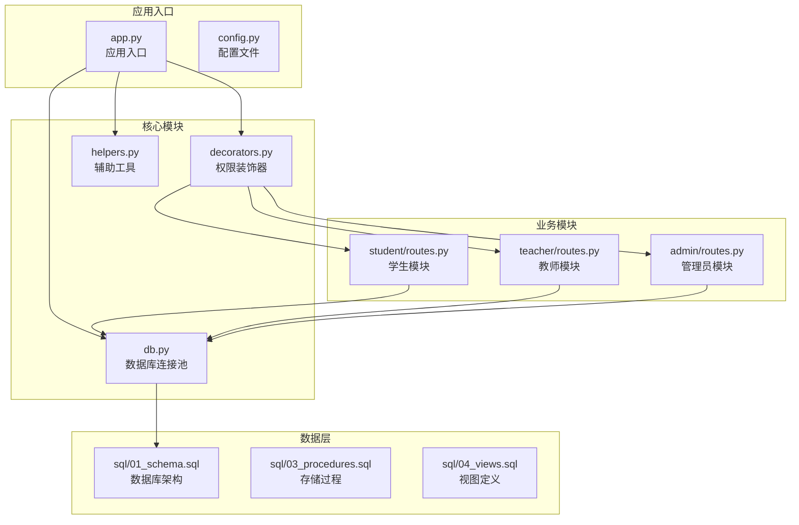
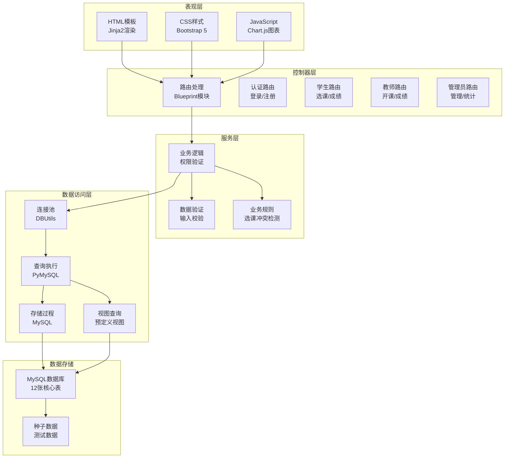
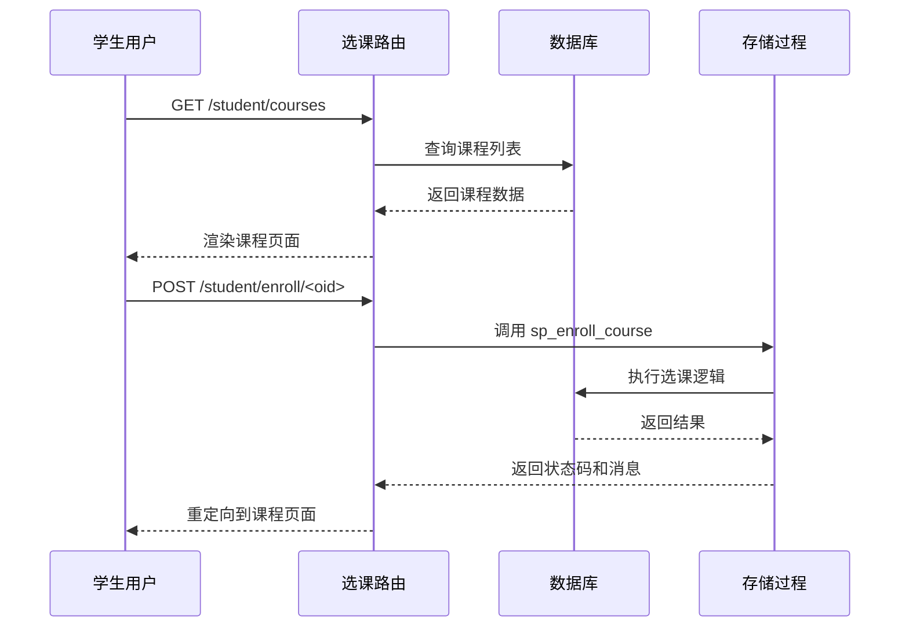
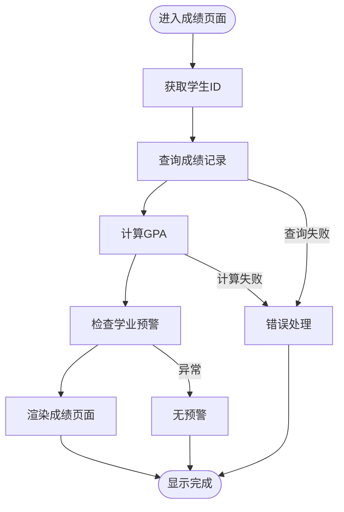
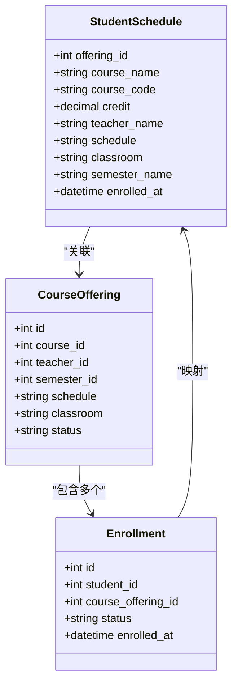
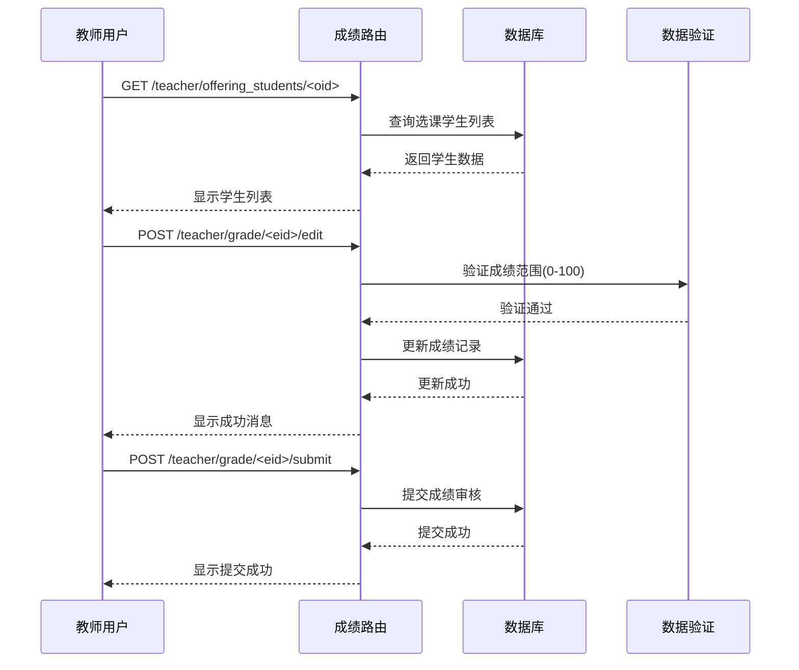
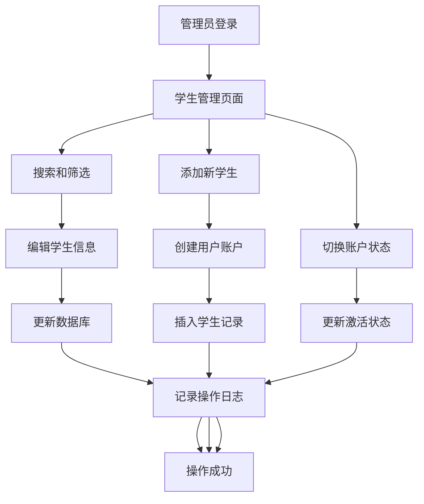
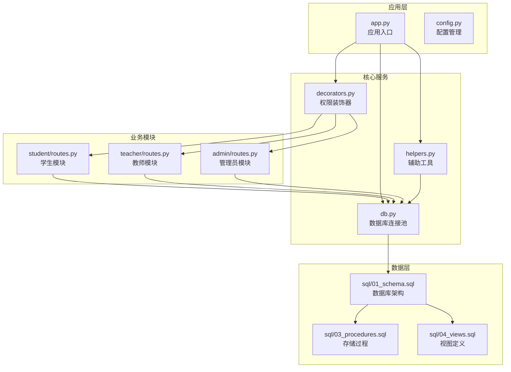

# 学生管理API

<cite>
**本文档引用的文件**
- [app.py](file://app.py)
- [app/student/routes.py](file://app/student/routes.py)
- [app/admin/routes.py](file://app/admin/routes.py)
- [app/teacher/routes.py](file://app/teacher/routes.py)
- [app/db.py](file://app/db.py)
- [app/helpers.py](file://app/helpers.py)
- [app/decorators.py](file://app/decorators.py)
- [sql/01_schema.sql](file://sql/01_schema.sql)
- [README.md](file://README.md)
</cite>

## 目录
1. [简介](#简介)
2. [项目结构](#项目结构)
3. [核心组件](#核心组件)
4. [架构概览](#架构概览)
5. [详细组件分析](#详细组件分析)
6. [依赖关系分析](#依赖关系分析)
7. [性能考虑](#性能考虑)
8. [故障排除指南](#故障排除指南)
9. [结论](#结论)

## 简介

校园教务选课与成绩管理系统是一个基于Python Flask框架开发的综合性教务管理平台。该系统实现了完整的教务业务流程，包括学生选课、成绩管理、教师教学管理等功能模块。

本系统采用三层架构设计，使用MySQL作为数据存储，通过PyMySQL驱动和DBUtils连接池进行数据库连接管理。系统支持多角色用户（学生、教师、管理员），每个角色都有相应的权限控制和功能访问范围。

## 项目结构

系统采用模块化组织方式，主要包含以下核心模块：

**图表来源**
- [app.py:1-13](file://app.py#L1-L13)
- [app/db.py:1-121](file://app/db.py#L1-L121)
- [app/student/routes.py:1-233](file://app/student/routes.py#L1-L233)

**章节来源**
- [README.md:46-69](file://README.md#L46-L69)
- [app.py:1-13](file://app.py#L1-L13)

## 核心组件

### 数据库架构

系统采用12张核心表的设计，遵循第三范式（3NF）规范，确保数据一致性和完整性。核心数据表包括：

- **users**: 用户账户表，存储系统用户的基本信息和认证数据
- **students**: 学生信息表，包含学生的个人资料、专业班级等信息
- **teachers**: 教师信息表，存储教师的基本信息和联系方式
- **courses**: 课程信息表，记录课程的基本属性和学分学时
- **course_offerings**: 开课申请表，管理课程的开课申请和状态
- **enrollments**: 选课记录表，跟踪学生的选课状态
- **grades**: 成绩表，存储学生的各科成绩和GPA计算结果

### 权限控制系统

系统实现了基于角色的访问控制（RBAC），通过装饰器机制确保不同角色只能访问相应的功能：

- **@login_required**: 要求用户必须登录才能访问
- **@role_required('student')**: 仅学生角色可访问
- **@role_required('teacher')**: 仅教师角色可访问
- **@role_required('admin')**: 仅管理员角色可访问

### 数据访问层

数据库访问通过统一的工具函数实现，支持查询、插入、更新、存储过程调用等操作：

- **query()**: 执行查询操作，支持单行和多行结果
- **execute()**: 执行写操作，返回受影响的行数
- **insert()**: 执行插入操作，返回自增ID
- **call_proc()**: 调用存储过程并读取输出参数
- **paginate()**: 实现分页查询功能

**章节来源**
- [sql/01_schema.sql:12-235](file://sql/01_schema.sql#L12-L235)
- [app/db.py:43-121](file://app/db.py#L43-L121)
- [app/decorators.py:7-26](file://app/decorators.py#L7-L26)

## 架构概览

系统采用经典的MVC架构模式，结合Flask框架的特点实现：

**图表来源**
- [app/student/routes.py:12-16](file://app/student/routes.py#L12-L16)
- [app/admin/routes.py:14-18](file://app/admin/routes.py#L14-L18)
- [app/teacher/routes.py:11-15](file://app/teacher/routes.py#L11-L15)

## 详细组件分析

### 学生管理模块

学生模块是系统的核心功能之一，提供了完整的学生成绩管理和选课功能。

#### 选课功能

学生可以通过课程列表浏览可选课程，并进行选课操作：

**图表来源**
- [app/student/routes.py:82-129](file://app/student/routes.py#L82-L129)
- [app/student/routes.py:148-159](file://app/student/routes.py#L148-L159)

#### 成绩查询功能

学生可以查看自己的成绩记录和GPA统计：

**图表来源**
- [app/student/routes.py:185-212](file://app/student/routes.py#L185-L212)
- [app/student/routes.py:24-33](file://app/student/routes.py#L24-L33)

#### 课表管理

学生可以查看自己的课程安排和时间表：

**图表来源**
- [app/student/routes.py:176-182](file://app/student/routes.py#L176-L182)
- [app/student/routes.py:71-79](file://app/student/routes.py#L71-L79)

**章节来源**
- [app/student/routes.py:12-233](file://app/student/routes.py#L12-L233)

### 教师管理模块

教师模块提供了课程管理和成绩录入功能：

#### 成绩管理流程

教师可以为所教授的学生录入和管理成绩：

**图表来源**
- [app/teacher/routes.py:162-204](file://app/teacher/routes.py#L162-L204)
- [app/teacher/routes.py:238-275](file://app/teacher/routes.py#L238-L275)

**章节来源**
- [app/teacher/routes.py:162-333](file://app/teacher/routes.py#L162-L333)

### 管理员管理模块

管理员模块提供了系统管理功能，包括学生管理、课程管理、成绩审核等：

#### 学生信息管理

管理员可以管理学生的基本信息和账户状态：

**图表来源**
- [app/admin/routes.py:215-300](file://app/admin/routes.py#L215-L300)
- [app/admin/routes.py:254-283](file://app/admin/routes.py#L254-L283)

**章节来源**
- [app/admin/routes.py:208-300](file://app/admin/routes.py#L208-L300)

## 依赖关系分析

系统采用模块化设计，各组件之间的依赖关系清晰明确：

**图表来源**
- [app.py:1-13](file://app.py#L1-L13)
- [app/db.py:10-26](file://app/db.py#L10-L26)
- [app/student/routes.py:3-7](file://app/student/routes.py#L3-L7)

### 外部依赖

系统的主要外部依赖包括：

- **Flask 3.x**: Web框架，提供路由、模板渲染、会话管理等功能
- **PyMySQL**: MySQL数据库驱动，支持连接池和异步操作
- **DBUtils**: Python数据库连接池库，提供线程安全的连接管理
- **Bootstrap 5**: 前端UI框架，提供响应式布局和组件
- **Jinja2**: 模板引擎，用于动态生成HTML页面
- **Chart.js**: 图表库，用于数据可视化展示

**章节来源**
- [README.md:5-11](file://README.md#L5-L11)
- [requirements.txt](file://requirements.txt)

## 性能考虑

系统在设计时充分考虑了性能优化，采用了多种策略来提升系统响应速度和并发处理能力：

### 数据库优化

- **连接池管理**: 使用DBUtils实现连接池，避免频繁创建和销毁数据库连接
- **索引优化**: 在常用查询字段上建立索引，如用户角色、课程状态、学期标识等
- **查询优化**: 通过视图和存储过程减少复杂查询的重复编写
- **分页处理**: 实现高效的分页查询，避免大数据量时的内存溢出

### 缓存策略

- **会话缓存**: 利用Flask-Login的会话管理机制
- **查询结果缓存**: 对不经常变化的数据进行缓存
- **模板渲染缓存**: 减少重复的模板解析开销

### 并发控制

- **事务管理**: 正确使用数据库事务确保数据一致性
- **锁机制**: 在高并发场景下使用适当的锁策略
- **超时处理**: 设置合理的数据库操作超时时间

## 故障排除指南

### 常见问题及解决方案

#### 数据库连接问题

**症状**: 应用启动时报数据库连接错误
**解决方案**:
1. 检查数据库配置参数是否正确
2. 验证数据库服务是否正常运行
3. 确认网络连接和防火墙设置
4. 检查用户权限和认证信息

#### 权限访问错误

**症状**: 访问受保护页面时出现403错误
**解决方案**:
1. 确认用户已正确登录
2. 验证用户角色是否正确
3. 检查路由装饰器配置
4. 确认会话状态是否有效

#### 选课冲突检测

**症状**: 选课时提示时间冲突
**解决方案**:
1. 检查课程时间安排格式
2. 确认冲突检测算法是否正确
3. 验证课表字符串解析规则
4. 检查数据库中的课程安排数据

#### 成绩录入异常

**症状**: 成绩录入后无法正常显示
**解决方案**:
1. 验证成绩数值范围(0-100)
2. 检查成绩状态流转是否正确
3. 确认存储过程执行是否成功
4. 验证视图数据是否更新

**章节来源**
- [app/helpers.py:23-58](file://app/helpers.py#L23-L58)
- [app/db.py:43-81](file://app/db.py#L43-L81)

## 结论

校园教务选课与成绩管理系统是一个功能完整、架构清晰的教务管理平台。系统通过模块化设计实现了良好的可维护性和扩展性，通过权限控制确保了系统的安全性，通过数据库优化保证了系统的性能。

该系统的主要优势包括：

1. **完整的业务覆盖**: 涵盖了从基础信息管理到成绩审核的完整教务流程
2. **清晰的架构设计**: 采用MVC模式和模块化组织，便于维护和扩展
3. **完善的权限控制**: 基于角色的访问控制确保了数据安全
4. **性能优化**: 通过连接池、索引优化等手段提升了系统性能
5. **易于部署**: 提供了完整的安装和配置指导

未来可以考虑的功能增强包括：
- 添加移动端适配
- 实现更丰富的数据分析功能
- 增加消息通知系统
- 优化用户体验界面
- 添加更多的报表统计功能