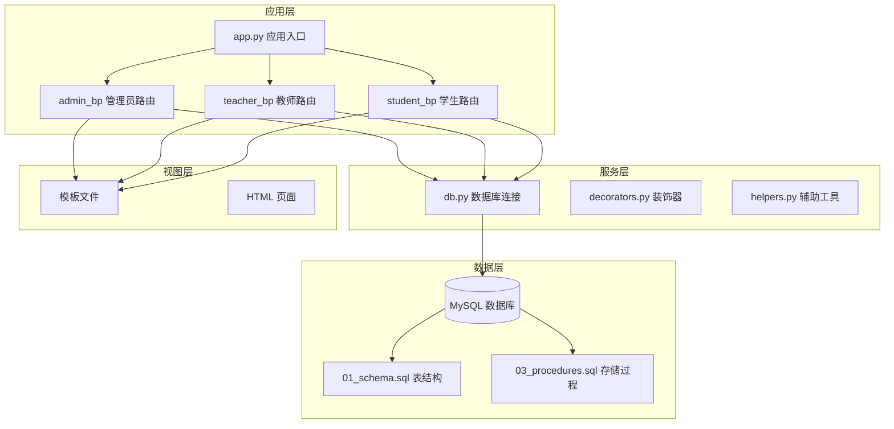
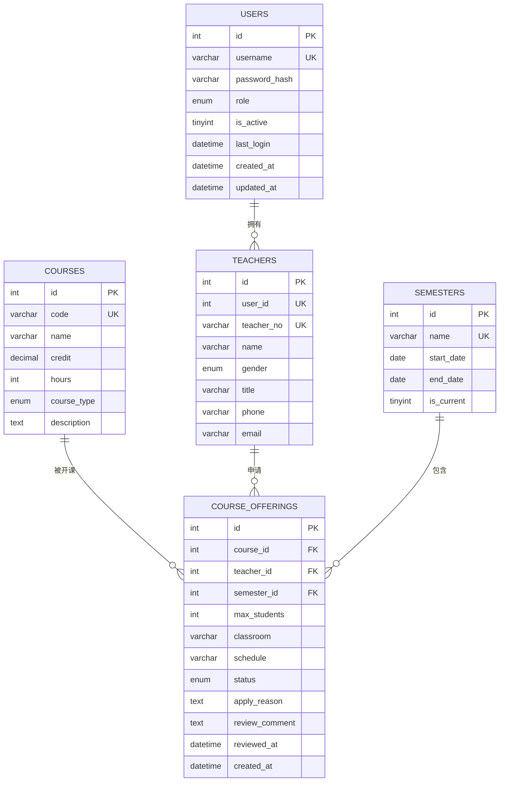
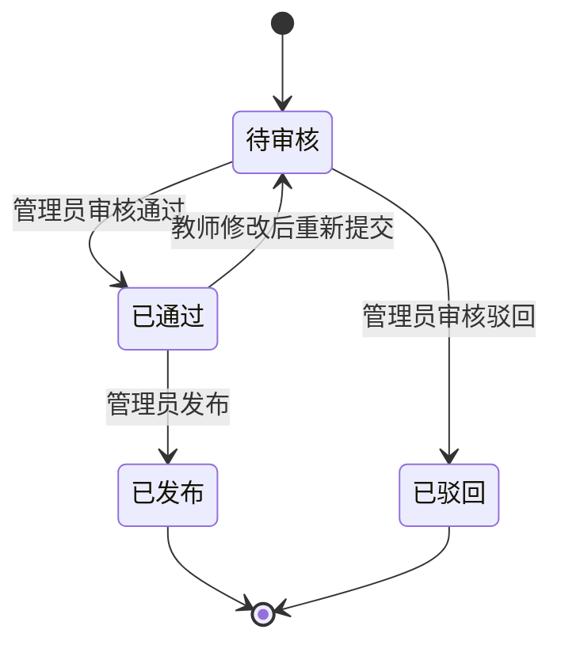
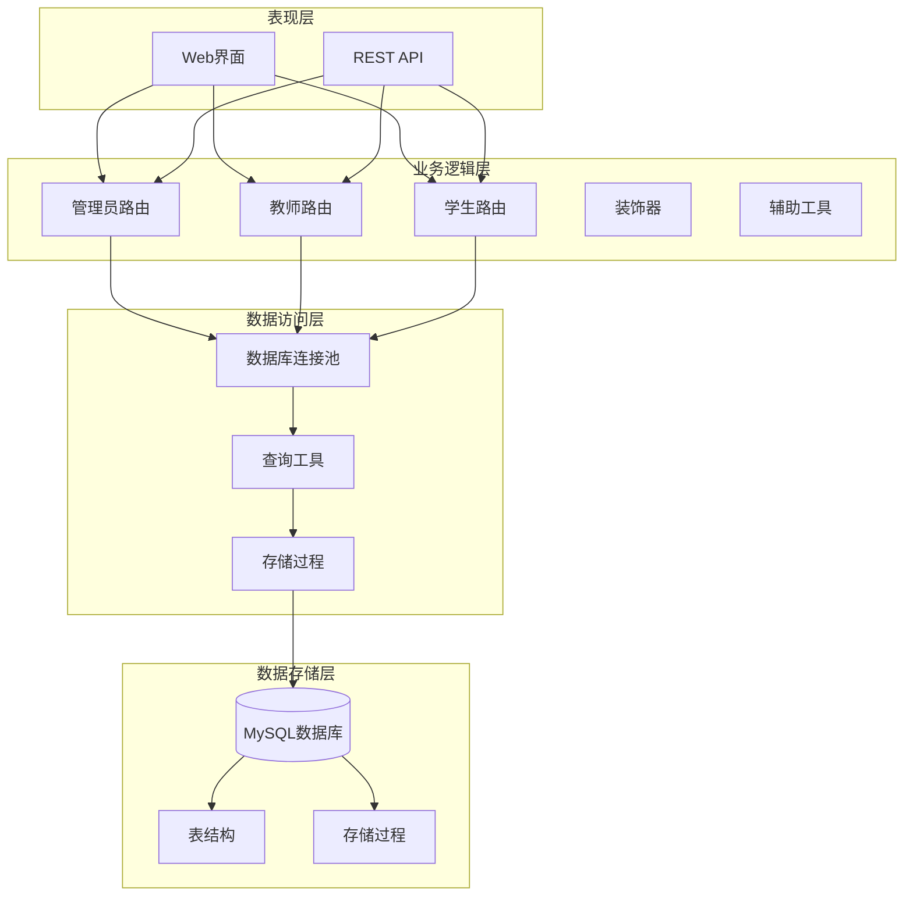
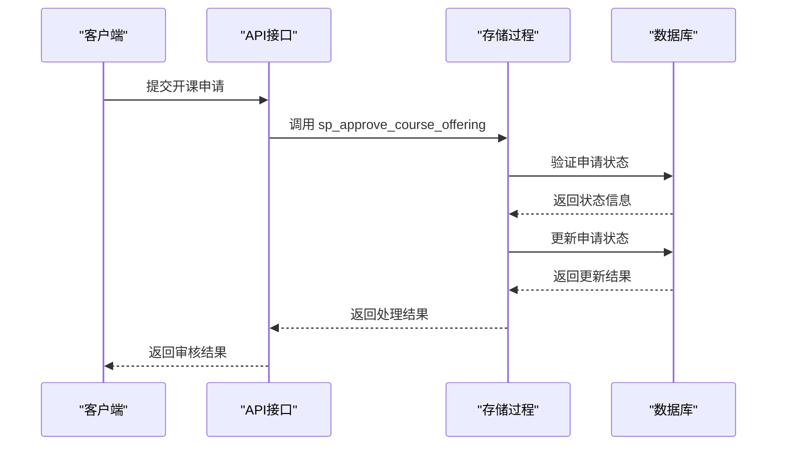
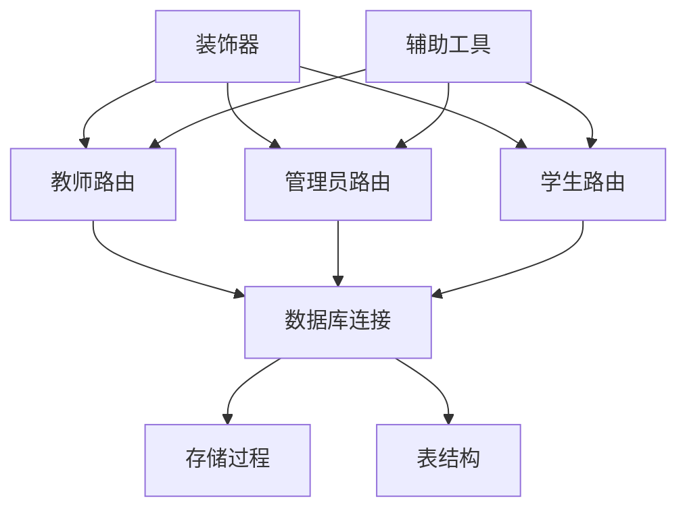
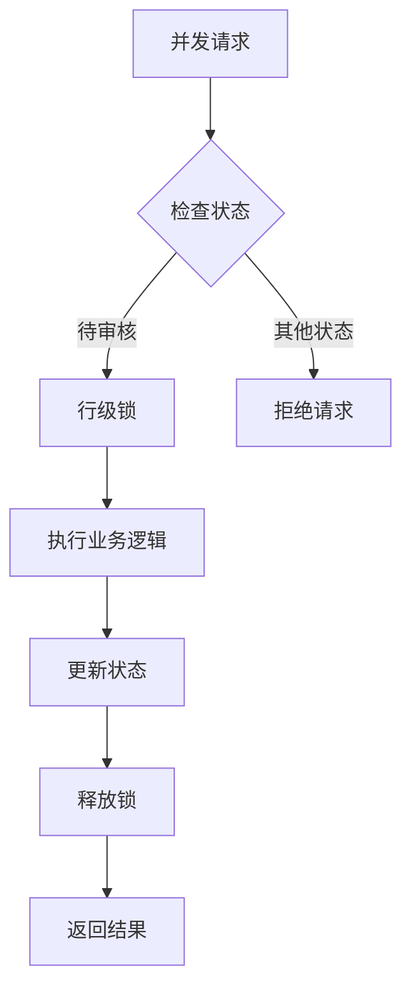

# 开课申请API

<cite>
**本文档引用的文件**
- [app.py](file://app.py)
- [app/admin/routes.py](file://app/admin/routes.py)
- [app/teacher/routes.py](file://app/teacher/routes.py)
- [app/student/routes.py](file://app/student/routes.py)
- [app/db.py](file://app/db.py)
- [app/decorators.py](file://app/decorators.py)
- [app/helpers.py](file://app/helpers.py)
- [sql/01_schema.sql](file://sql/01_schema.sql)
- [sql/03_procedures.sql](file://sql/03_procedures.sql)
- [app/templates/teacher/apply_offering.html](file://app/templates/teacher/apply_offering.html)
- [app/templates/admin/offerings.html](file://app/templates/admin/offerings.html)
- [app/templates/teacher/my_offerings.html](file://app/templates/teacher/my_offerings.html)
</cite>

## 目录
1. [简介](#简介)
2. [项目结构](#项目结构)
3. [核心组件](#核心组件)
4. [架构概览](#架构概览)
5. [详细组件分析](#详细组件分析)
6. [依赖关系分析](#依赖关系分析)
7. [性能考虑](#性能考虑)
8. [故障排除指南](#故障排除指南)
9. [结论](#结论)

## 简介

开课申请API是校园教务管理系统中的核心功能模块，负责管理教师开课申请的完整生命周期。该系统采用Flask框架构建，支持多角色用户（管理员、教师、学生），提供从开课申请提交到最终发布的完整工作流程。

系统的核心功能包括：
- 教师开课申请提交和管理
- 管理员开课申请审核和发布
- 申请状态跟踪和审批进度查询
- 已申请课程查看和历史记录管理
- 开课申请的修改和撤销操作
- 批量操作功能

## 项目结构

**图表来源**
- [app.py:1-13](file://app.py#L1-L13)
- [app/admin/routes.py:1-10](file://app/admin/routes.py#L1-L10)
- [app/teacher/routes.py:1-10](file://app/teacher/routes.py#L1-L10)
- [app/student/routes.py:1-10](file://app/student/routes.py#L1-L10)

**章节来源**
- [app.py:1-13](file://app.py#L1-L13)
- [app/admin/routes.py:1-10](file://app/admin/routes.py#L1-L10)
- [app/teacher/routes.py:1-10](file://app/teacher/routes.py#L1-L10)
- [app/student/routes.py:1-10](file://app/student/routes.py#L1-L10)

## 核心组件

### 数据模型

课程开课申请系统基于以下核心数据模型：

**图表来源**
- [sql/01_schema.sql:15-155](file://sql/01_schema.sql#L15-L155)

### 状态流转

开课申请的状态流转遵循严格的业务逻辑：

**图表来源**
- [sql/01_schema.sql:138](file://sql/01_schema.sql#L138)
- [app/admin/routes.py:414-431](file://app/admin/routes.py#L414-L431)

**章节来源**
- [sql/01_schema.sql:128-155](file://sql/01_schema.sql#L128-L155)
- [app/admin/routes.py:414-431](file://app/admin/routes.py#L414-L431)

## 架构概览

系统采用经典的三层架构设计，结合Flask的Blueprint模块化组织：

**图表来源**
- [app/admin/routes.py:1-10](file://app/admin/routes.py#L1-L10)
- [app/teacher/routes.py:1-10](file://app/teacher/routes.py#L1-L10)
- [app/student/routes.py:1-10](file://app/student/routes.py#L1-L10)
- [app/db.py:1-121](file://app/db.py#L1-L121)

## 详细组件分析

### 教师开课申请模块

#### 申请提交接口

教师可以通过以下接口提交开课申请：

**接口定义**
- 方法：POST
- 路径：`/teacher/apply-offering`
- 权限：教师角色
- 内容类型：application/x-www-form-urlencoded

**请求参数**

| 参数名 | 必填 | 类型 | 描述 | 验证规则 |
|--------|------|------|------|----------|
| course_id | 是 | integer | 课程ID | 存在性验证 |
| semester_id | 是 | integer | 学期ID | 存在性验证 |
| max_students | 是 | integer | 最大选课人数 | ≥ 1 |
| classroom | 否 | string | 上课教室 | 最大长度100字符 |
| schedule | 否 | string | 上课时间 | 格式验证 |
| apply_reason | 否 | text | 申请理由 | 最大长度 |

**响应状态**
- 200 OK：申请提交成功
- 400 Bad Request：参数验证失败
- 403 Forbidden：权限不足

**章节来源**
- [app/teacher/routes.py:68-85](file://app/teacher/routes.py#L68-L85)
- [app/templates/teacher/apply_offering.html:7-35](file://app/templates/teacher/apply_offering.html#L7-L35)

#### 申请状态查询接口

**接口定义**
- 方法：GET
- 路径：`/teacher/my-offerings`
- 权限：教师角色

**响应内容**
- 返回当前教师的所有开课申请记录
- 包含课程信息、学期信息、申请状态、已选人数等

**章节来源**
- [app/teacher/routes.py:88-104](file://app/teacher/routes.py#L88-L104)
- [app/templates/teacher/my_offerings.html:1-62](file://app/templates/teacher/my_offerings.html#L1-L62)

#### 申请修改接口

**接口定义**
- 方法：POST
- 路径：`/teacher/offering/<int:oid>/edit`
- 权限：教师角色
- 条件：仅待审核状态的申请允许修改

**请求参数**
- course_id：课程ID
- semester_id：学期ID  
- max_students：最大选课人数
- classroom：教室
- schedule：时间安排
- apply_reason：申请理由

**章节来源**
- [app/teacher/routes.py:120-134](file://app/teacher/routes.py#L120-L134)

#### 申请撤销接口

**接口定义**
- 方法：POST
- 路径：`/teacher/offering/<int:oid>/withdraw`
- 权限：教师角色
- 条件：仅待审核状态的申请允许撤销

**响应状态**
- 200 OK：撤销成功
- 400 Bad Request：状态不允许撤销

**章节来源**
- [app/teacher/routes.py:107-117](file://app/teacher/routes.py#L107-L117)

### 管理员审核模块

#### 开课申请审核接口

**接口定义**
- 方法：POST
- 路径：`/admin/offerings/<int:oid>/review`
- 权限：管理员角色

**请求参数**

| 参数名 | 必填 | 类型 | 描述 |
|--------|------|------|------|
| action | 是 | enum | 'approved' 或 'rejected' |
| comment | 否 | text | 审核意见 |

**审核流程**
1. 验证申请状态必须为'pending'
2. 调用存储过程 `sp_approve_course_offering`
3. 更新申请状态为'approved'或'rejected'
4. 记录审核日志

**章节来源**
- [app/admin/routes.py:414-431](file://app/admin/routes.py#L414-L431)
- [sql/03_procedures.sql:277-319](file://sql/03_procedures.sql#L277-L319)

#### 开课申请发布接口

**接口定义**
- 方法：POST
- 路径：`/admin/offerings/<int:oid>/publish`
- 权限：管理员角色
- 条件：仅已通过状态的申请允许发布

**章节来源**
- [app/admin/routes.py:434-439](file://app/admin/routes.py#L434-L439)

#### 申请列表查询接口

**接口定义**
- 方法：GET
- 路径：`/admin/offerings`
- 权限：管理员角色

**查询参数**
- status：申请状态过滤
- search：搜索关键词

**章节来源**
- [app/admin/routes.py:386-412](file://app/admin/routes.py#L386-L412)
- [app/templates/admin/offerings.html:1-76](file://app/templates/admin/offerings.html#L1-L76)

### 存储过程实现

系统使用存储过程确保业务逻辑的一致性和原子性：

**图表来源**
- [sql/03_procedures.sql:277-319](file://sql/03_procedures.sql#L277-L319)
- [app/admin/routes.py:423-425](file://app/admin/routes.py#L423-L425)

**章节来源**
- [sql/03_procedures.sql:277-319](file://sql/03_procedures.sql#L277-L319)

## 依赖关系分析

### 组件耦合度

**图表来源**
- [app/teacher/routes.py:1-10](file://app/teacher/routes.py#L1-L10)
- [app/admin/routes.py:1-10](file://app/admin/routes.py#L1-L10)
- [app/student/routes.py:1-10](file://app/student/routes.py#L1-L10)
- [app/db.py:1-121](file://app/db.py#L1-L121)

### 外部依赖

系统主要依赖以下外部组件：
- **Flask**: Web框架
- **PyMySQL**: MySQL数据库驱动
- **DBUtils**: 连接池管理
- **Flask-Login**: 用户认证
- **Werkzeug**: 安全工具

**章节来源**
- [app/db.py:1-26](file://app/db.py#L1-L26)

## 性能考虑

### 数据库优化

1. **连接池管理**: 使用DBUtils实现连接池，减少连接创建开销
2. **索引优化**: 关键字段建立适当索引
3. **查询优化**: 分页查询避免大数据集加载
4. **事务控制**: 存储过程确保业务逻辑原子性

### 缓存策略

系统采用以下缓存策略：
- **连接池**: 复用数据库连接
- **会话缓存**: Flask-login会话管理
- **模板缓存**: Jinja2模板编译缓存

### 并发控制

**图表来源**
- [sql/03_procedures.sql:35-41](file://sql/03_procedures.sql#L35-L41)

## 故障排除指南

### 常见问题及解决方案

**1. 权限错误 (403 Forbidden)**
- 检查用户角色是否正确
- 验证装饰器配置
- 确认用户登录状态

**2. 数据库连接问题**
- 检查数据库配置参数
- 验证连接池设置
- 查看连接超时设置

**3. 申请状态异常**
- 检查存储过程执行结果
- 验证状态转换逻辑
- 查看系统日志

**章节来源**
- [app/decorators.py:13-25](file://app/decorators.py#L13-L25)
- [app/db.py:10-41](file://app/db.py#L10-L41)

### 错误处理机制

系统采用统一的错误处理策略：
- **HTTP状态码**: 正确映射业务状态
- **Flash消息**: 用户友好的错误提示
- **系统日志**: 详细的错误记录
- **事务回滚**: 数据一致性保证

**章节来源**
- [app/admin/routes.py:429-431](file://app/admin/routes.py#L429-L431)
- [app/helpers.py:9-21](file://app/helpers.py#L9-L21)

## 结论

开课申请API系统提供了完整的开课管理解决方案，具有以下特点：

**优势**
- 清晰的职责分离和模块化设计
- 完善的权限控制和安全机制
- 严格的状态管理和业务流程控制
- 可扩展的存储过程架构

**改进建议**
- 添加API文档自动生成
- 实现更细粒度的日志记录
- 增加数据验证和清理机制
- 考虑添加异步任务处理

该系统为校园教务管理提供了可靠的技术基础，能够满足复杂的开课申请管理需求。