# 成绩审核API

<cite>
**本文档引用的文件**
- [app.py](file://app.py)
- [config.py](file://config.py)
- [app/db.py](file://app/db.py)
- [app/decorators.py](file://app/decorators.py)
- [app/helpers.py](file://app/helpers.py)
- [app/admin/routes.py](file://app/admin/routes.py)
- [app/teacher/routes.py](file://app/teacher/routes.py)
- [app/student/routes.py](file://app/student/routes.py)
- [sql/01_schema.sql](file://sql/01_schema.sql)
- [sql/03_procedures.sql](file://sql/03_procedures.sql)
- [app/templates/admin/grades_review.html](file://app/templates/admin/grades_review.html)
- [app/templates/teacher/offering_students.html](file://app/templates/teacher/offering_students.html)
- [app/templates/student/grades.html](file://app/templates/student/grades.html)
</cite>

## 目录
1. [简介](#简介)
2. [项目结构](#项目结构)
3. [核心组件](#核心组件)
4. [架构概览](#架构概览)
5. [详细组件分析](#详细组件分析)
6. [依赖关系分析](#依赖关系分析)
7. [性能考虑](#性能考虑)
8. [故障排除指南](#故障排除指南)
9. [结论](#结论)

## 简介

本系统是一个基于Flask框架开发的校园教务选课与成绩管理系统，专注于成绩审核功能。系统实现了完整的成绩审核流程，包括成绩录入、审核、发布等环节，支持多角色协作（管理员、教师、学生），并提供了丰富的统计分析功能。

系统采用模块化设计，通过蓝图（Blueprint）实现功能分离，使用MySQL数据库存储数据，配合存储过程和触发器确保数据一致性和业务逻辑完整性。

## 项目结构

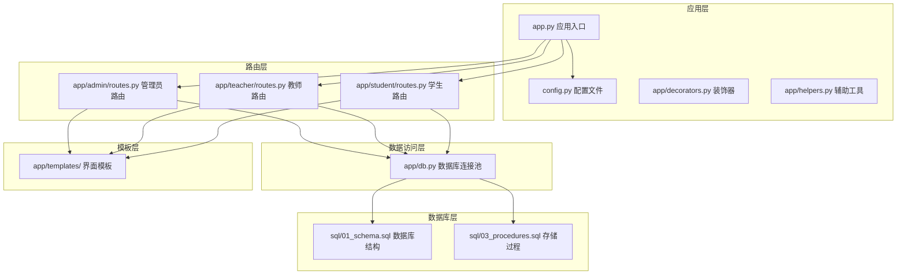

**图表来源**
- [app.py:1-13](file://app.py#L1-L13)
- [config.py:1-36](file://config.py#L1-L36)
- [app/admin/routes.py:1-692](file://app/admin/routes.py#L1-L692)

**章节来源**
- [app.py:1-13](file://app.py#L1-L13)
- [config.py:1-36](file://config.py#L1-L36)

## 核心组件

### 数据库连接池
系统使用PooledDB实现数据库连接池管理，支持配置化的连接池参数，包括最小缓存连接数、最大缓存连接数和最大连接数。

### 路由蓝图
系统采用Flask蓝图模式，将不同角色的功能分离到独立的蓝图中：
- 管理员蓝图：负责成绩审核、系统管理
- 教师蓝图：负责成绩录入、提交
- 学生蓝图：负责成绩查询、统计

### 权限控制
通过装饰器实现基于角色的权限控制，确保不同角色只能访问相应的功能。

**章节来源**
- [app/db.py:1-121](file://app/db.py#L1-L121)
- [app/decorators.py:1-26](file://app/decorators.py#L1-L26)

## 架构概览

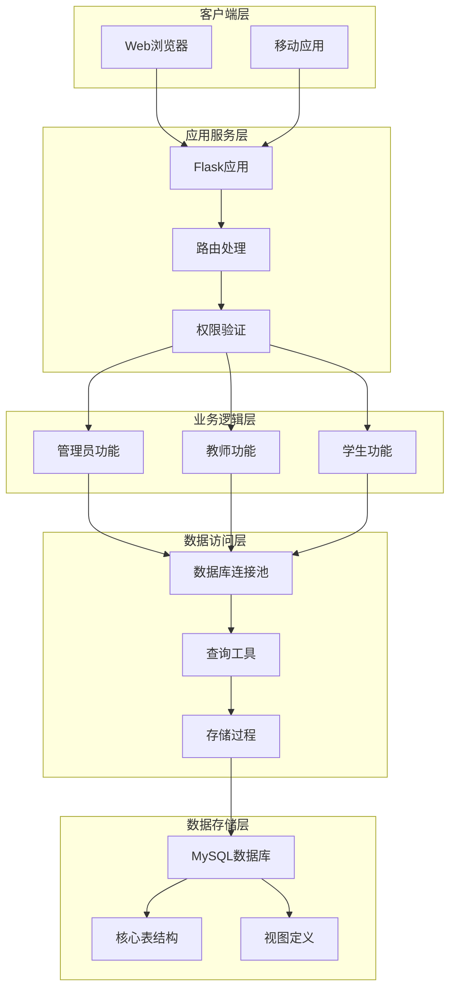

**图表来源**
- [app/admin/routes.py:1-692](file://app/admin/routes.py#L1-L692)
- [app/teacher/routes.py:1-333](file://app/teacher/routes.py#L1-L333)
- [app/student/routes.py:1-233](file://app/student/routes.py#L1-L233)

## 详细组件分析

### 成绩审核功能

#### 审核状态更新接口

系统实现了完整的成绩审核状态流转机制：

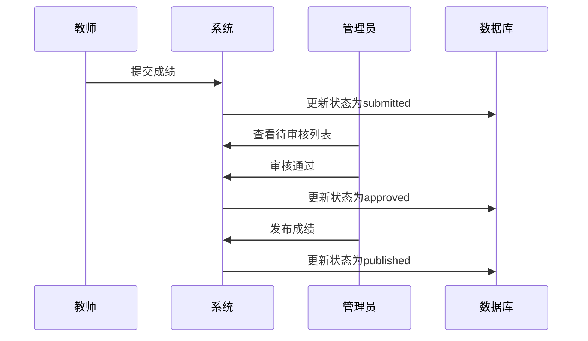

**图表来源**
- [app/admin/routes.py:511-542](file://app/admin/routes.py#L511-L542)
- [app/teacher/routes.py:194-203](file://app/teacher/routes.py#L194-L203)

##### 审核状态流转
- 草稿状态（draft）：教师录入但未提交
- 待审核状态（submitted）：教师已提交等待审核
- 已审核状态（approved）：管理员审核通过
- 已发布状态（published）：管理员发布成绩

##### 审核操作接口
- 单个审核通过：`POST /grades/<int:gid>/approve`
- 单个发布：`POST /grades/<int:gid>/publish`
- 单个驳回：`POST /grades/<int:gid>/reject`
- 批量发布：`POST /grades/batch-publish`

**章节来源**
- [app/admin/routes.py:492-583](file://app/admin/routes.py#L492-L583)

#### 审核意见提交接口

系统支持审核意见的提交和管理：

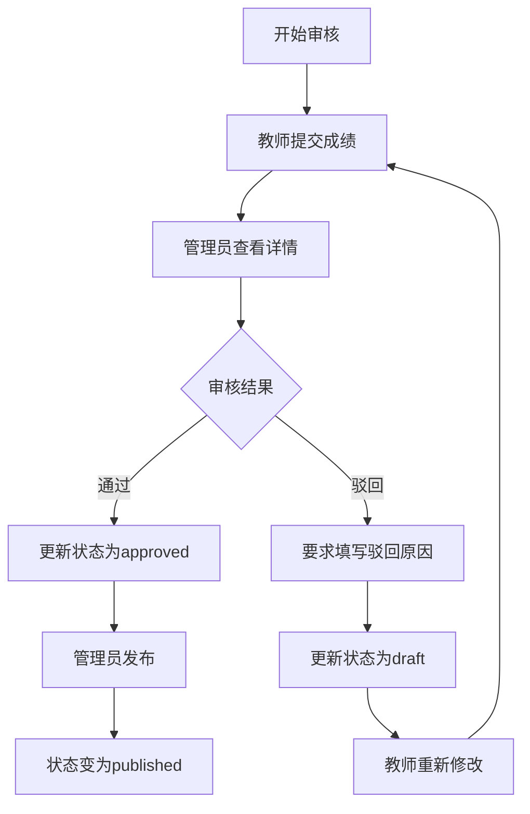

**图表来源**
- [app/admin/routes.py:545-566](file://app/admin/routes.py#L545-L566)

**章节来源**
- [app/admin/routes.py:545-566](file://app/admin/routes.py#L545-L566)

#### 审核记录查询接口

系统提供完整的审核历史查询功能：

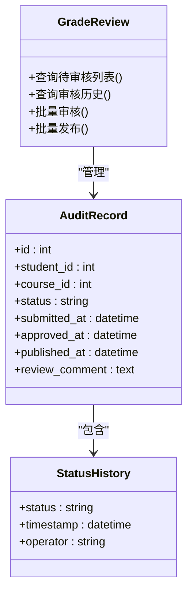

**图表来源**
- [app/admin/routes.py:492-508](file://app/admin/routes.py#L492-L508)

**章节来源**
- [app/admin/routes.py:492-508](file://app/admin/routes.py#L492-L508)

### 成绩修改申请接口

#### 修改申请提交

教师可以对已提交的成绩进行修改申请：

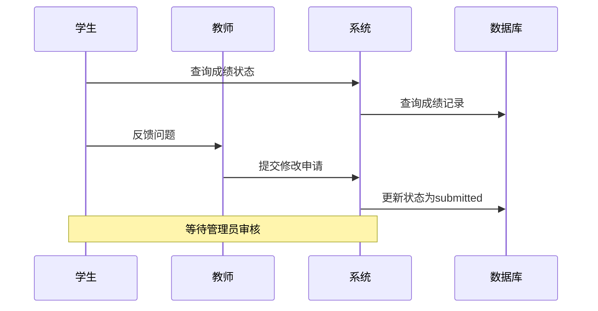

**图表来源**
- [app/teacher/routes.py:194-203](file://app/teacher/routes.py#L194-L203)

#### 原因说明和材料附件

系统支持成绩修改申请的原因说明功能，虽然当前版本主要支持文本说明，但接口设计预留了附件上传能力。

#### 申请状态跟踪

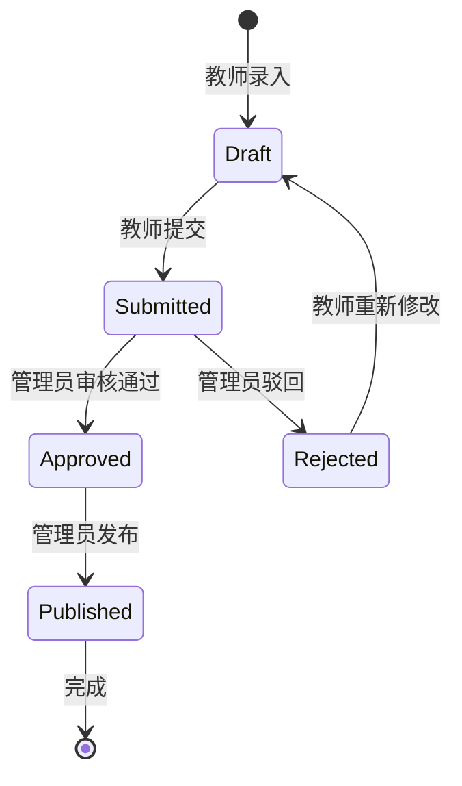

**图表来源**
- [app/teacher/routes.py:222-235](file://app/teacher/routes.py#L222-L235)

**章节来源**
- [app/teacher/routes.py:162-235](file://app/teacher/routes.py#L162-L235)

### 审核流程管理接口

#### 审核权限分配

系统通过角色权限模型实现审核权限管理：

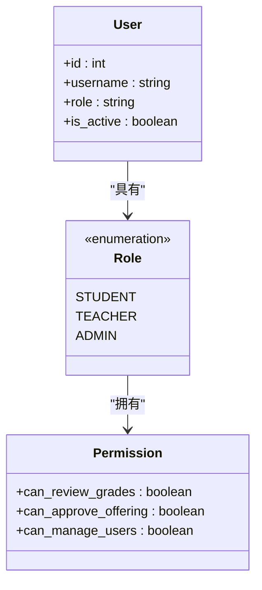

**图表来源**
- [app/decorators.py:13-25](file://app/decorators.py#L13-L25)

#### 多级审核设置

系统支持多级审核流程，通过存储过程实现复杂的审核逻辑：

**章节来源**
- [app/decorators.py:13-25](file://app/decorators.py#L13-L25)

#### 流程配置

系统通过数据库配置实现审核流程的灵活管理，包括审核权重、阈值等参数。

### 审核历史查询接口

#### 审核记录追溯

系统提供完整的历史记录追溯功能：

**图表来源**
- [app/helpers.py:9-21](file://app/helpers.py#L9-L21)

#### 状态变更历史

系统通过触发器自动记录状态变更历史，确保审计追踪的完整性。

#### 责任认定

系统支持责任认定功能，通过日志记录明确各环节的责任人。

**章节来源**
- [app/helpers.py:9-21](file://app/helpers.py#L9-L21)

### 审核统计接口

#### 审核数量统计

系统提供多种统计维度：

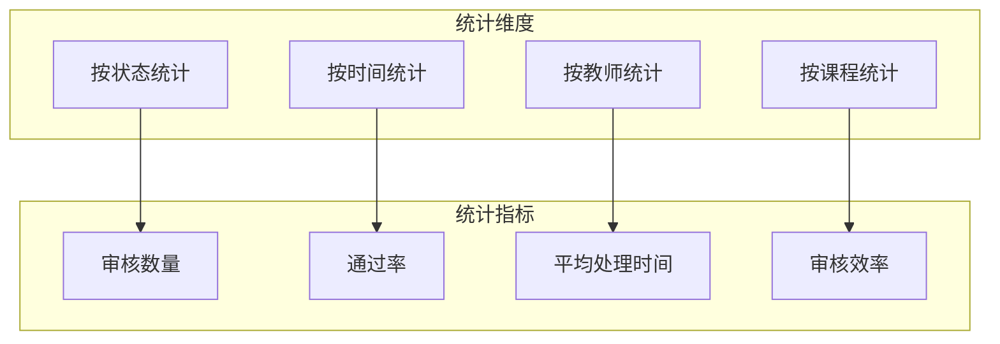

**图表来源**
- [app/admin/routes.py:611-638](file://app/admin/routes.py#L611-L638)

#### 通过率计算

系统支持实时通过率计算，基于已审核和已发布的成绩数据。

#### 审核效率分析

系统提供审核效率分析功能，包括处理时间、响应速度等指标。

**章节来源**
- [app/admin/routes.py:611-638](file://app/admin/routes.py#L611-L638)

### 审核通知接口

#### 审核结果通知

系统支持审核结果的通知功能，通过日志记录实现通知机制：

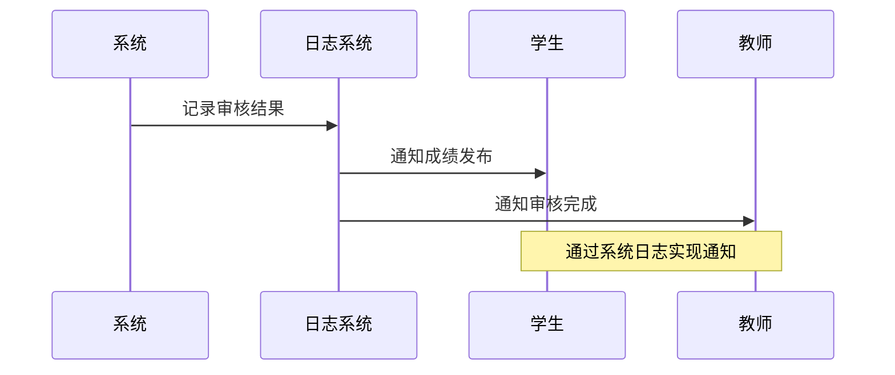

**图表来源**
- [app/helpers.py:9-21](file://app/helpers.py#L9-L21)

#### 邮件短信提醒

系统预留了邮件和短信提醒的扩展接口，可通过存储过程实现。

#### 消息推送功能

系统支持消息推送功能，通过日志系统实现消息通知。

**章节来源**
- [app/helpers.py:9-21](file://app/helpers.py#L9-L21)

## 依赖关系分析

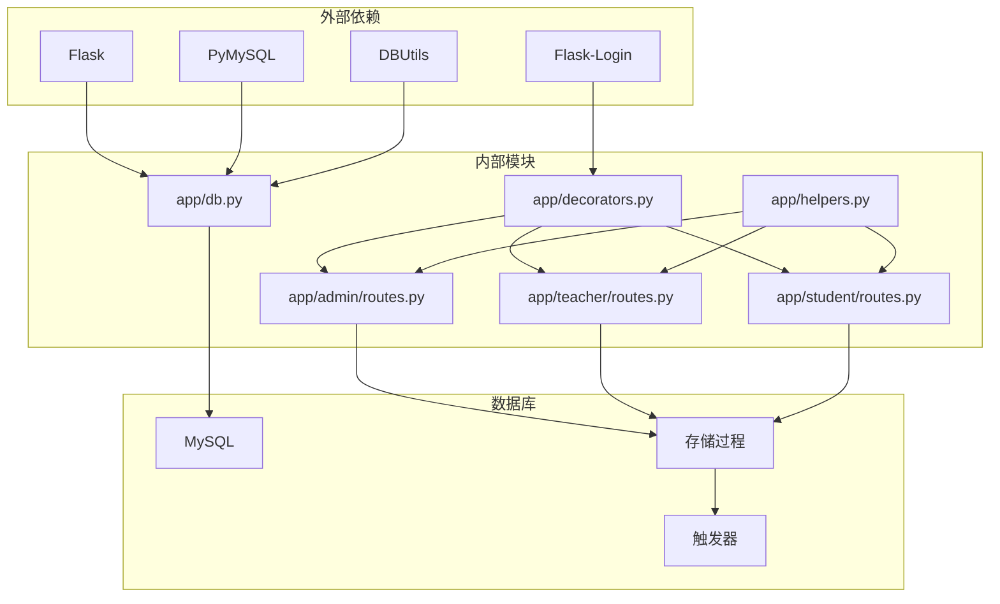

**图表来源**
- [app/db.py:1-121](file://app/db.py#L1-L121)
- [app/decorators.py:1-26](file://app/decorators.py#L1-L26)

**章节来源**
- [app/db.py:1-121](file://app/db.py#L1-L121)
- [app/decorators.py:1-26](file://app/decorators.py#L1-L26)

## 性能考虑

### 数据库优化
- 使用连接池减少连接开销
- 合理的索引设计提升查询性能
- 存储过程避免网络往返

### 缓存策略
- 分页查询优化大数据量场景
- 结果集缓存减少重复计算

### 并发控制
- 行级锁确保数据一致性
- 事务管理保证操作原子性

## 故障排除指南

### 常见问题
1. **连接超时**：检查数据库连接池配置
2. **权限不足**：确认用户角色和权限设置
3. **数据不一致**：检查事务处理和触发器

### 错误处理
系统通过统一的错误处理机制，确保异常情况下的数据安全和用户体验。

**章节来源**
- [app/db.py:62-80](file://app/db.py#L62-L80)

## 结论

本成绩审核系统通过模块化的设计和完善的权限控制，实现了从成绩录入到审核发布的完整流程管理。系统采用存储过程和触发器确保数据一致性和业务逻辑完整性，同时提供了丰富的统计分析和审计功能。通过合理的架构设计和性能优化，系统能够满足大规模校园环境下的使用需求。

系统的主要优势包括：
- 完整的审核流程支持
- 多角色权限管理
- 实时统计分析功能
- 完善的审计追踪
- 良好的扩展性设计