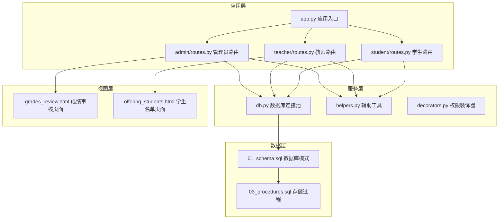
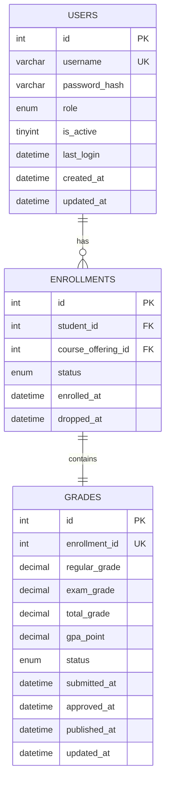
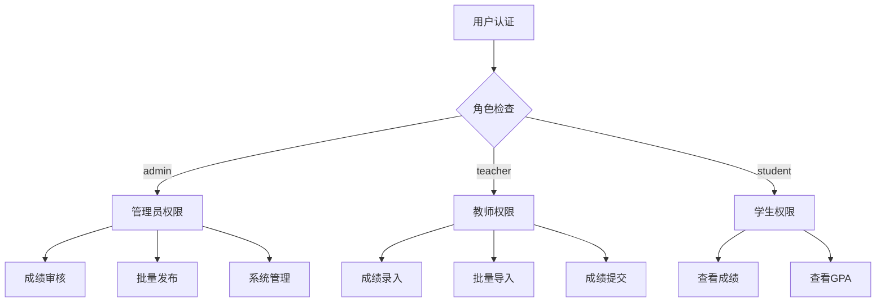
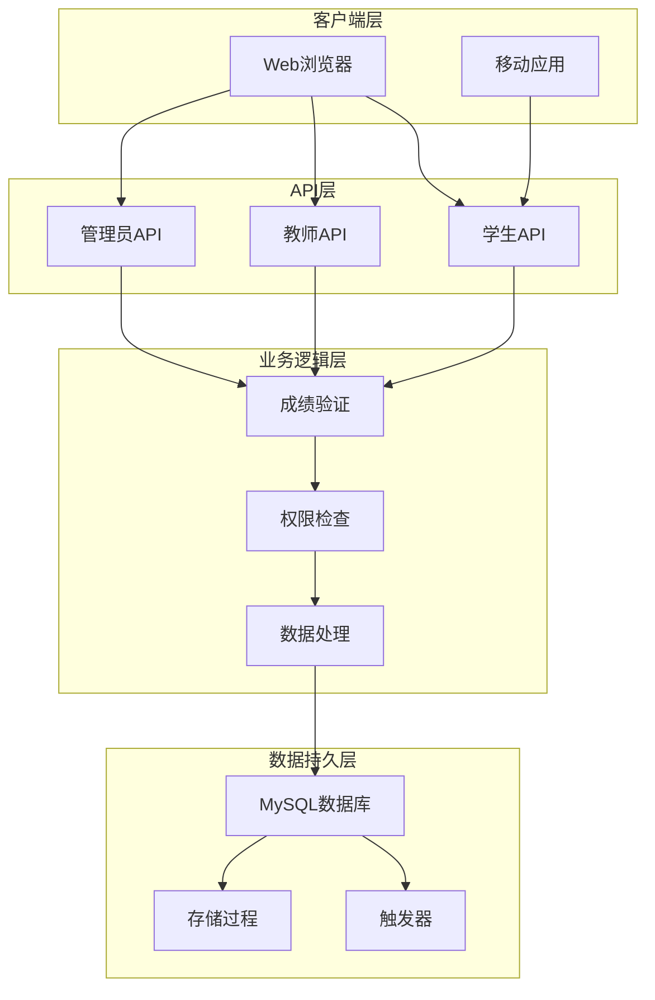
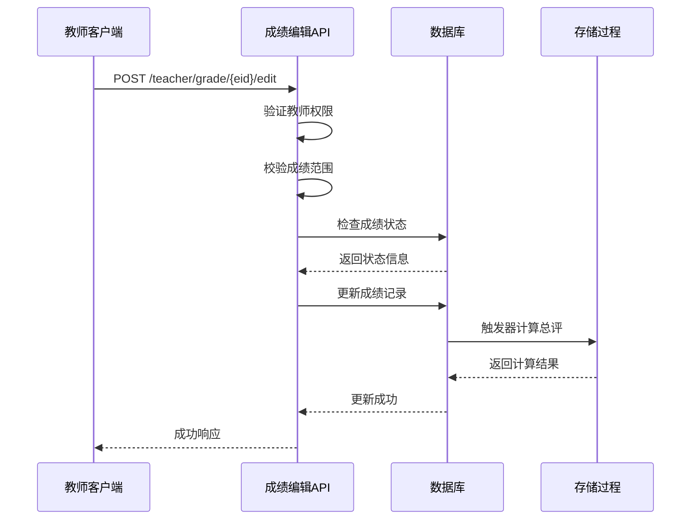
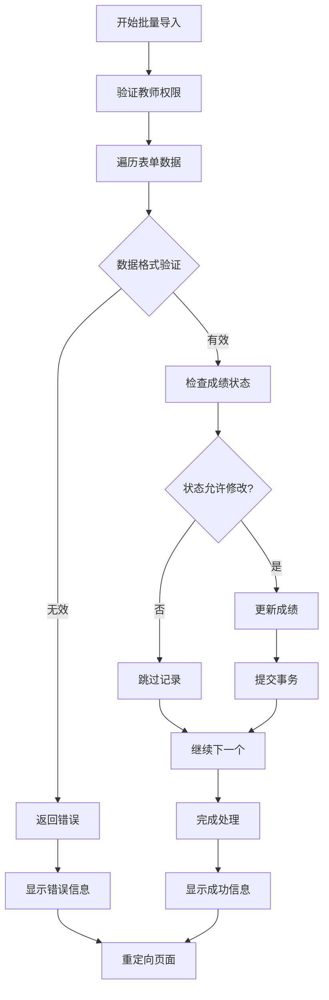
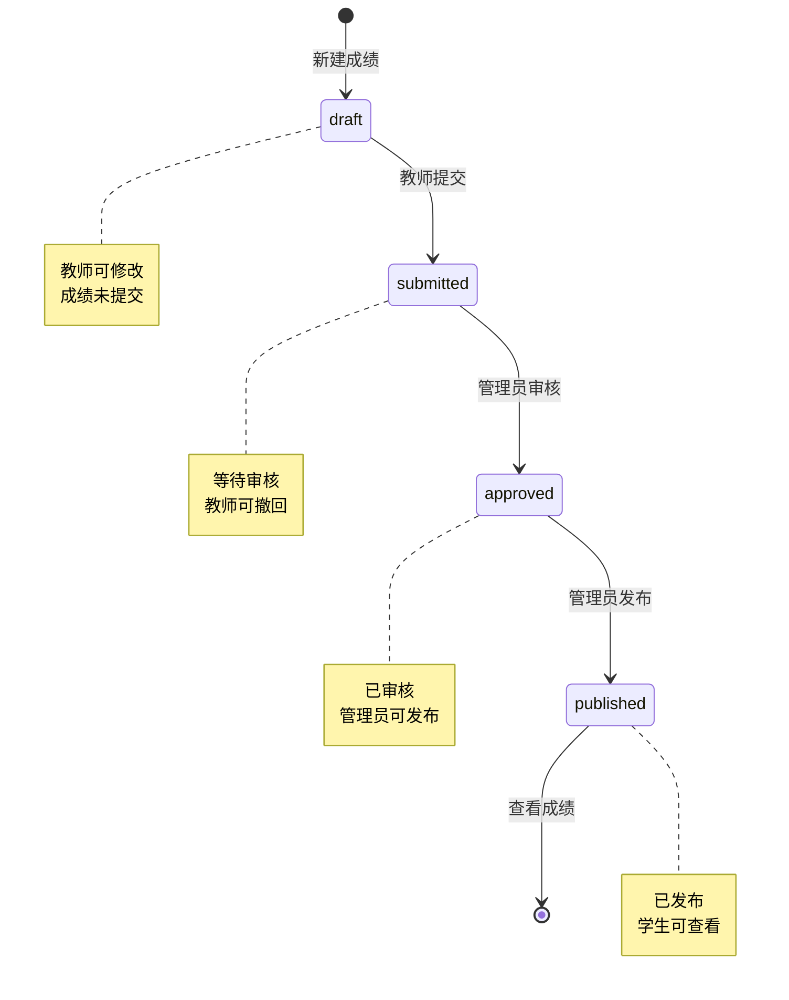
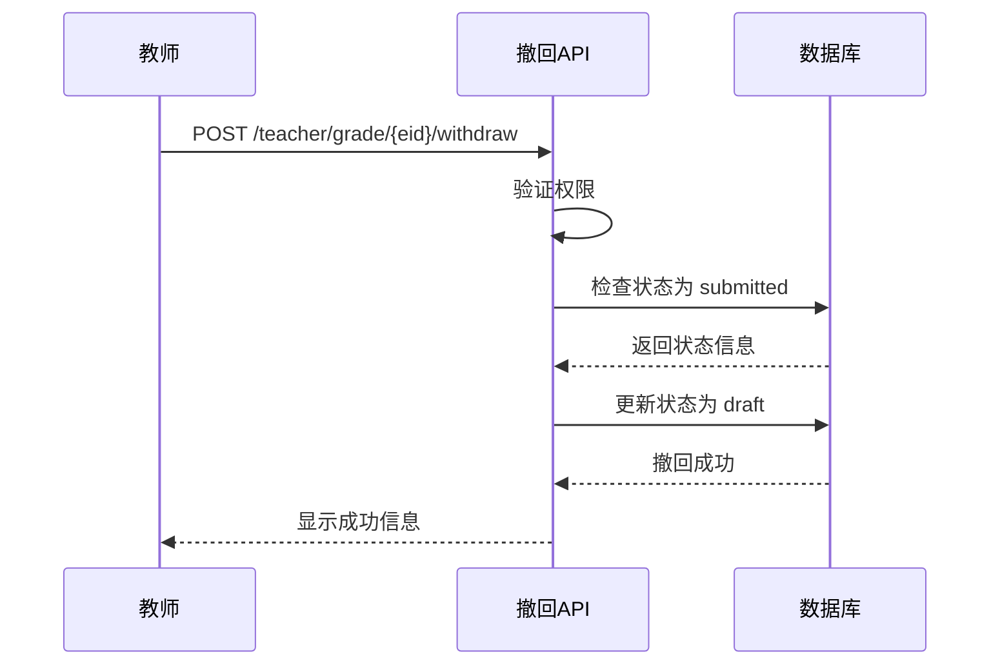
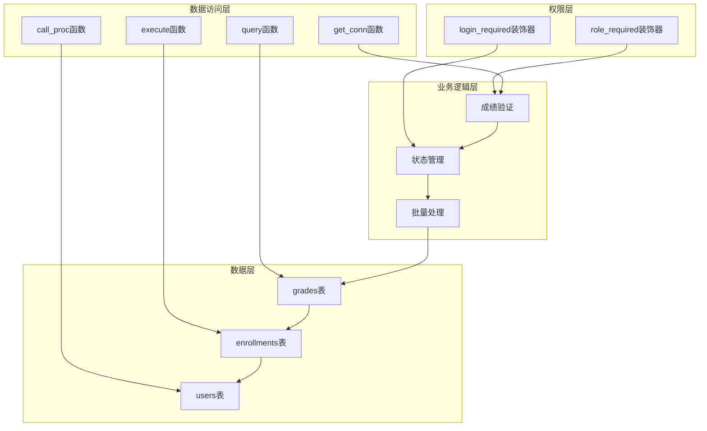

# 成绩录入API

<cite>
**本文档引用的文件**
- [app.py](file://app.py)
- [admin/routes.py](file://app/admin/routes.py)
- [teacher/routes.py](file://app/teacher/routes.py)
- [student/routes.py](file://app/student/routes.py)
- [db.py](file://app/db.py)
- [helpers.py](file://app/helpers.py)
- [decorators.py](file://app/decorators.py)
- [01_schema.sql](file://sql/01_schema.sql)
- [03_procedures.sql](file://sql/03_procedures.sql)
- [grades_review.html](file://app/templates/admin/grades_review.html)
- [offering_students.html](file://app/templates/teacher/offering_students.html)
</cite>

## 目录
1. [简介](#简介)
2. [项目结构](#项目结构)
3. [核心组件](#核心组件)
4. [架构概览](#架构概览)
5. [详细组件分析](#详细组件分析)
6. [依赖分析](#依赖分析)
7. [性能考虑](#性能考虑)
8. [故障排除指南](#故障排除指南)
9. [结论](#结论)

## 简介

本文档详细记录了MIS系统中的成绩录入功能API，基于Flask框架和MySQL数据库实现。系统采用三层架构设计，包含管理员、教师和学生三个角色，每个角色都有特定的成绩管理权限和流程。

系统的核心数据模型围绕`grades`表构建，支持单个成绩录入、批量导入、成绩修改、删除和验证等功能。所有操作都经过严格的权限验证和数据完整性检查。

## 项目结构

**图表来源**
- [app.py:1-13](file://app.py#L1-L13)
- [admin/routes.py:1-692](file://app/admin/routes.py#L1-L692)
- [teacher/routes.py:1-333](file://app/teacher/routes.py#L1-L333)
- [db.py:1-121](file://app/db.py#L1-L121)

**章节来源**
- [app.py:1-13](file://app.py#L1-L13)
- [README.md:46-87](file://README.md#L46-L87)

## 核心组件

### 数据库架构

系统采用12张核心表的数据模型，其中`grades`表是成绩管理的核心：

**图表来源**
- [01_schema.sql:177-198](file://sql/01_schema.sql#L177-L198)
- [01_schema.sql:158-174](file://sql/01_schema.sql#L158-L174)

### 权限控制机制

系统采用基于角色的访问控制（RBAC）模型：

**图表来源**
- [decorators.py:13-25](file://app/decorators.py#L13-L25)
- [admin/routes.py:14-18](file://app/admin/routes.py#L14-L18)
- [teacher/routes.py:11-15](file://app/teacher/routes.py#L11-L15)
- [student/routes.py:12-16](file://app/student/routes.py#L12-L16)

**章节来源**
- [01_schema.sql:15-26](file://sql/01_schema.sql#L15-L26)
- [decorators.py:1-26](file://app/decorators.py#L1-L26)

## 架构概览

**图表来源**
- [teacher/routes.py:162-204](file://app/teacher/routes.py#L162-L204)
- [admin/routes.py:511-542](file://app/admin/routes.py#L511-L542)
- [03_procedures.sql:197-236](file://sql/03_procedures.sql#L197-L236)

## 详细组件分析

### 单个成绩录入接口

#### 接口规范

**URL**: `/teacher/grade/<int:eid>/edit`
**方法**: POST
**权限**: 教师角色
**参数**:
- `regular_grade`: 平时成绩 (0-100)
- `exam_grade`: 期末成绩 (0-100)

#### 处理流程

**图表来源**
- [teacher/routes.py:162-191](file://app/teacher/routes.py#L162-L191)
- [03_procedures.sql:338-360](file://sql/03_procedures.sql#L338-L360)

#### 数据验证规则

| 字段 | 验证规则 | 错误消息 |
|------|----------|----------|
| regular_grade | 0-100 或 null | 平时成绩须在 0-100 之间 |
| exam_grade | 0-100 或 null | 期末成绩须在 0-100 之间 |
| 状态检查 | draft 状态 | 成绩已提交，无法修改 |

**章节来源**
- [teacher/routes.py:162-191](file://app/teacher/routes.py#L162-L191)
- [01_schema.sql:195-197](file://sql/01_schema.sql#L195-L197)

### 批量成绩导入接口

#### 接口规范

**URL**: `/teacher/offering/<int:oid>/batch-grade`
**方法**: POST
**权限**: 教师角色
**参数**: 表单数据格式
- `regular_{eid}`: 平时成绩
- `exam_{eid}`: 期末成绩

#### 批量处理流程

**图表来源**
- [teacher/routes.py:238-274](file://app/teacher/routes.py#L238-L274)

#### 批量验证规则

1. **数据格式验证**: 检查字段命名格式 `regular_{eid}` 和 `exam_{eid}`
2. **数值范围验证**: 0-100 之间的数字
3. **状态检查**: 只能修改 draft 状态的成绩
4. **事务处理**: 使用 FOR UPDATE 锁定记录

**章节来源**
- [teacher/routes.py:238-274](file://app/teacher/routes.py#L238-L274)

### 成绩修改接口

#### 接口规范

**URL**: `/teacher/grade/<int:eid>/submit`
**方法**: POST
**权限**: 教师角色
**参数**: 无

#### 提交流程

**图表来源**
- [teacher/routes.py:194-203](file://app/teacher/routes.py#L194-L203)
- [admin/routes.py:511-542](file://app/admin/routes.py#L511-L542)

**章节来源**
- [teacher/routes.py:194-203](file://app/teacher/routes.py#L194-L203)
- [admin/routes.py:511-542](file://app/admin/routes.py#L511-L542)

### 成绩删除接口

#### 删除条件

系统不提供直接删除接口，但支持以下删除场景：

1. **撤回已提交成绩**: 将 submitted 状态撤回至 draft
2. **退课时的自动清理**: 通过存储过程自动删除 draft 状态的成绩

#### 撤回流程

**图表来源**
- [teacher/routes.py:222-235](file://app/teacher/routes.py#L222-L235)

**章节来源**
- [teacher/routes.py:222-235](file://app/teacher/routes.py#L222-L235)

### 成绩验证接口

#### 验证规则

系统通过多种机制确保数据完整性：

1. **数据库约束**: 
   - CHECK 约束限制成绩范围 (0-100)
   - UNIQUE 约束防止重复录入
   - 外键约束维护引用完整性

2. **业务逻辑验证**:
   - 角色权限检查
   - 状态机验证
   - 事务一致性保证

3. **触发器自动验证**:
   - 成绩更新时自动计算总评
   - 自动转换为绩点 (4.0制)

**章节来源**
- [01_schema.sql:195-197](file://sql/01_schema.sql#L195-L197)
- [03_procedures.sql:338-360](file://sql/03_procedures.sql#L338-L360)

### 成绩导入模板下载接口

#### 模板格式

系统提供标准的Excel/CSV模板用于批量导入：

| 字段名称 | 列名 | 数据类型 | 必填 | 说明 |
|----------|------|----------|------|------|
| 学号 | student_no | 文本 | 是 | 学生唯一标识符 |
| 平时成绩 | regular_grade | 数值 | 否 | 0-100范围 |
| 期末成绩 | exam_grade | 数值 | 否 | 0-100范围 |
| 课程编号 | course_code | 文本 | 是 | 课程唯一标识符 |
| 教师工号 | teacher_no | 文本 | 是 | 教师唯一标识符 |
| 学期名称 | semester_name | 文本 | 是 | 学期标识符 |

#### 使用指南

1. **下载模板**: 从教师面板下载Excel模板
2. **填写数据**: 按照模板格式填写成绩信息
3. **上传文件**: 支持Excel和CSV格式
4. **验证导入**: 系统自动验证数据格式和业务规则
5. **确认导入**: 查看导入结果和错误报告

**章节来源**
- [offering_students.html:52-76](file://app/templates/teacher/offering_students.html#L52-L76)

## 依赖分析

### 组件耦合关系

**图表来源**
- [decorators.py:13-25](file://app/decorators.py#L13-L25)
- [db.py:43-80](file://app/db.py#L43-L80)
- [teacher/routes.py:162-274](file://app/teacher/routes.py#L162-L274)

### 外部依赖

| 依赖项 | 版本 | 用途 |
|--------|------|------|
| Flask | 3.x | Web框架 |
| PyMySQL | - | MySQL驱动 |
| DBUtils | - | 连接池 |
| Bootstrap | 5 | 前端UI |
| Chart.js | - | 图表展示 |

**章节来源**
- [README.md:5-11](file://README.md#L5-L11)

## 性能考虑

### 数据库优化

1. **索引策略**:
   - 在 `grades.status` 上建立索引加速状态查询
   - 在 `enrollment_id` 上建立唯一索引确保数据完整性
   - 在 `users.role` 上建立索引优化权限检查

2. **连接池管理**:
   - 使用 DBUtils 实现连接池复用
   - 配置合适的最大连接数避免资源耗尽
   - 自动回收空闲连接

3. **事务优化**:
   - 批量操作使用事务保证原子性
   - 使用 FOR UPDATE 锁定避免并发冲突
   - 合理设置事务超时时间

### 缓存策略

系统采用以下缓存机制：

1. **连接池缓存**: 复用数据库连接减少创建开销
2. **会话缓存**: Flask Login 缓存用户信息
3. **模板缓存**: Jinja2 模板编译缓存

## 故障排除指南

### 常见错误及解决方案

#### 权限错误 (403 Forbidden)
**症状**: 访问被拒绝
**原因**: 用户角色不匹配
**解决方案**: 
- 确认用户已登录
- 验证用户角色权限
- 检查课程归属关系

#### 数据验证错误
**症状**: 成绩保存失败
**原因**: 数据格式或范围不正确
**解决方案**:
- 检查成绩范围 (0-100)
- 验证必填字段
- 确认状态允许修改

#### 并发冲突
**症状**: 批量操作失败
**原因**: 多用户同时修改同一记录
**解决方案**:
- 使用 FOR UPDATE 锁定记录
- 实施重试机制
- 优化批量处理逻辑

#### 数据库连接问题
**症状**: 查询超时或连接失败
**原因**: 连接池耗尽或网络问题
**解决方案**:
- 检查连接池配置
- 监控连接使用情况
- 实施连接重试策略

**章节来源**
- [teacher/routes.py:162-191](file://app/teacher/routes.py#L162-L191)
- [db.py:10-26](file://app/db.py#L10-L26)

## 结论

MIS系统的成绩录入API设计遵循了RESTful原则，结合了Flask框架的优势和MySQL数据库的强大功能。系统通过严格的权限控制、数据验证和事务管理确保了成绩数据的完整性和安全性。

主要特点包括：

1. **多层次权限控制**: 基于角色的访问控制确保只有授权用户才能进行成绩操作
2. **数据完整性保障**: 通过数据库约束、业务逻辑验证和触发器实现全面的数据保护
3. **并发安全**: 使用事务和锁机制避免并发操作导致的数据不一致
4. **用户体验优化**: 提供批量导入、状态管理和实时反馈功能
5. **扩展性设计**: 模块化架构便于功能扩展和维护

该系统为教育机构提供了完整、可靠的成绩管理解决方案，能够满足日常教学管理的各种需求。