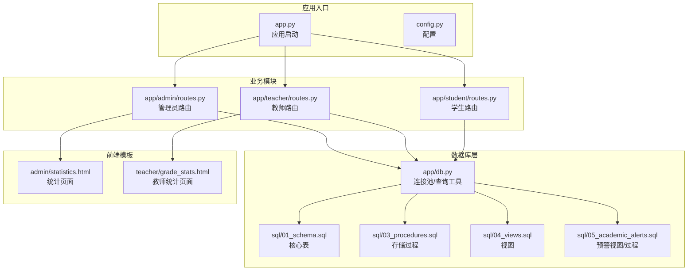
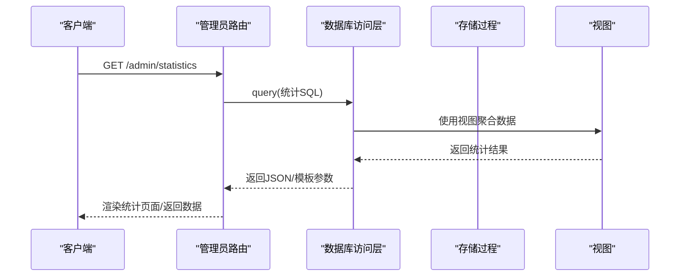
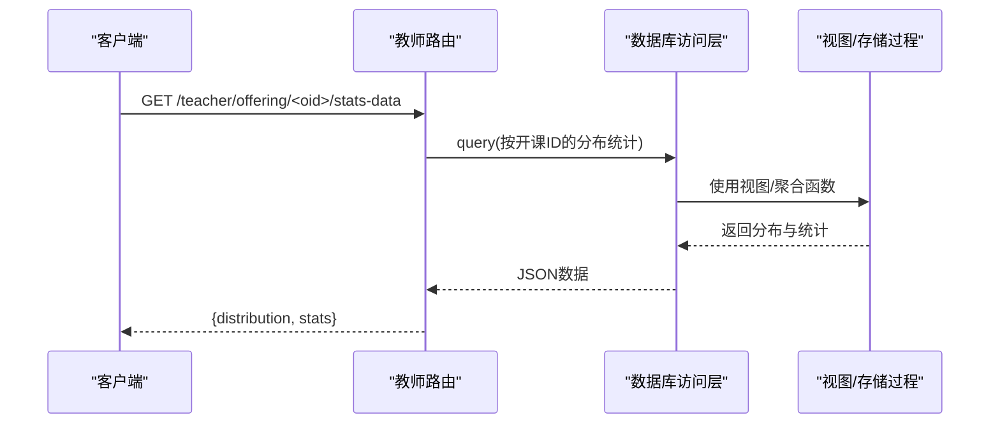
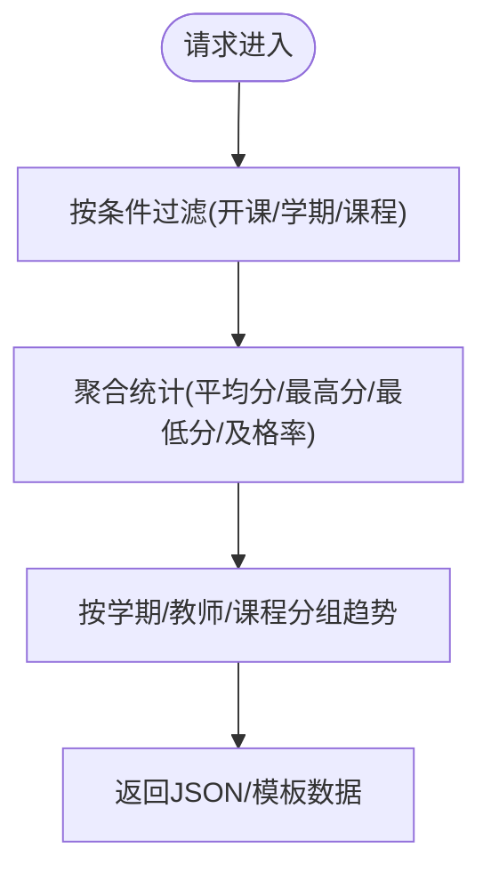
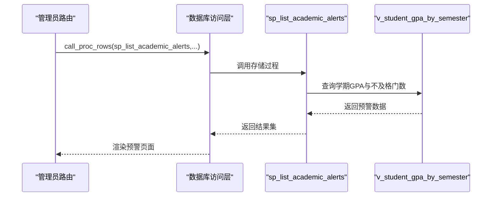
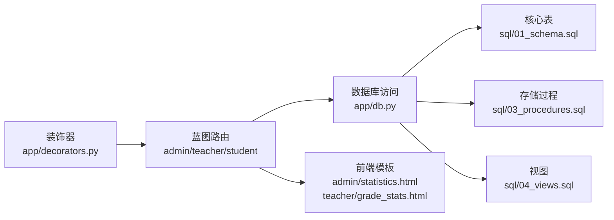
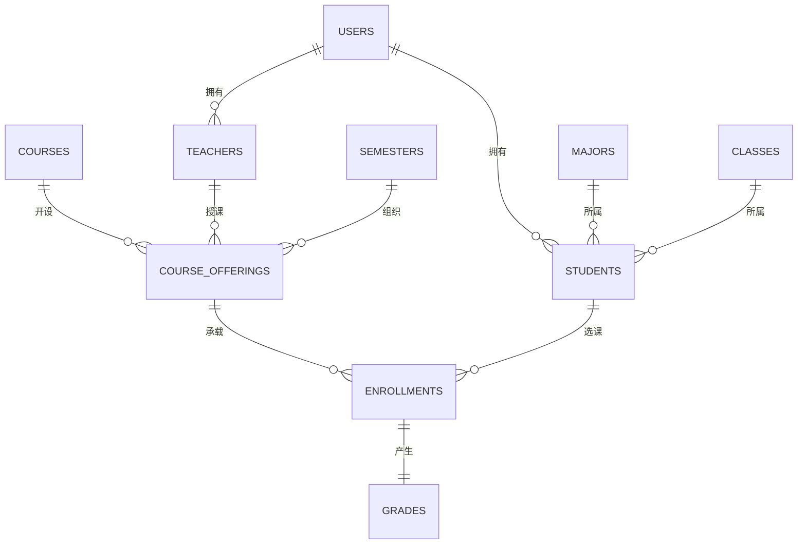

# 成绩统计API

<cite>
**本文档引用的文件**
- [app.py](file://app.py)
- [config.py](file://config.py)
- [app/db.py](file://app/db.py)
- [app/decorators.py](file://app/decorators.py)
- [app/helpers.py](file://app/helpers.py)
- [app/admin/routes.py](file://app/admin/routes.py)
- [app/teacher/routes.py](file://app/teacher/routes.py)
- [app/student/routes.py](file://app/student/routes.py)
- [sql/01_schema.sql](file://sql/01_schema.sql)
- [sql/03_procedures.sql](file://sql/03_procedures.sql)
- [sql/04_views.sql](file://sql/04_views.sql)
- [sql/05_academic_alerts.sql](file://sql/05_academic_alerts.sql)
- [app/templates/admin/statistics.html](file://app/templates/admin/statistics.html)
- [app/templates/teacher/grade_stats.html](file://app/templates/teacher/grade_stats.html)
</cite>

## 目录
1. [简介](#简介)
2. [项目结构](#项目结构)
3. [核心组件](#核心组件)
4. [架构总览](#架构总览)
5. [详细组件分析](#详细组件分析)
6. [依赖分析](#依赖分析)
7. [性能考虑](#性能考虑)
8. [故障排除指南](#故障排除指南)
9. [结论](#结论)
10. [附录](#附录)

## 简介
本文件面向“成绩统计分析功能”的API设计与实现，基于现有Flask后端与MySQL数据库的完整实现，提供以下能力的接口化说明与使用指引：
- 班级成绩分布接口：分数段统计、人数分布、百分比计算
- 平均分与标准差接口：整体统计、分组统计、趋势分析
- 成绩排名接口：班级排名、年级排名、各类排名统计
- 成绩对比接口：不同班级对比、不同科目对比、时间序列对比
- 成绩预警接口：不及格预警、异常波动检测、风险评估
- 统计报表接口：PDF导出、图表生成、自定义报表功能
- 成绩分析接口：相关性分析、回归分析、预测模型接口

上述能力在现有代码中以路由、模板、存储过程、视图与数据库表的形式实现，本文将从接口视角进行系统化梳理。

## 项目结构
项目采用Flask蓝图组织模块，数据库层通过连接池、查询工具、存储过程与视图提供数据访问与计算能力。前端模板负责展示统计图表与报表。

**图表来源**
- [app.py:1-13](file://app.py#L1-L13)
- [config.py:6-36](file://config.py#L6-L36)
- [app/db.py:10-121](file://app/db.py#L10-L121)
- [sql/01_schema.sql:12-235](file://sql/01_schema.sql#L12-L235)
- [sql/03_procedures.sql:7-381](file://sql/03_procedures.sql#L7-L381)
- [sql/04_views.sql:7-113](file://sql/04_views.sql#L7-L113)
- [app/admin/routes.py:611-639](file://app/admin/routes.py#L611-L639)
- [app/teacher/routes.py:277-333](file://app/teacher/routes.py#L277-L333)
- [app/templates/admin/statistics.html:1-65](file://app/templates/admin/statistics.html#L1-L65)
- [app/templates/teacher/grade_stats.html:1-50](file://app/templates/teacher/grade_stats.html#L1-L50)

**章节来源**
- [app.py:1-13](file://app.py#L1-L13)
- [config.py:6-36](file://config.py#L6-L36)
- [app/db.py:10-121](file://app/db.py#L10-L121)

## 核心组件
- 应用入口与配置：应用启动、环境变量与数据库连接池配置
- 数据库访问层：连接池、查询封装、分页、存储过程调用
- 业务路由层：管理员统计、教师统计、学生相关接口
- 数据模型与计算：核心表、存储过程（总评、GPA、开课审核）、视图（统计、预警）
- 前端展示：统计页面与图表渲染

**章节来源**
- [app.py:1-13](file://app.py#L1-L13)
- [config.py:6-36](file://config.py#L6-L36)
- [app/db.py:10-121](file://app/db.py#L10-L121)
- [sql/01_schema.sql:12-235](file://sql/01_schema.sql#L12-L235)
- [sql/03_procedures.sql:7-381](file://sql/03_procedures.sql#L7-L381)
- [sql/04_views.sql:7-113](file://sql/04_views.sql#L7-L113)

## 架构总览
系统采用“路由-服务-数据”三层结构：
- 路由层：各模块蓝图暴露HTTP接口
- 服务层：查询工具与存储过程封装业务逻辑
- 数据层：核心表、视图与触发器实现数据一致性与计算

**图表来源**
- [app/admin/routes.py:611-639](file://app/admin/routes.py#L611-L639)
- [sql/04_views.sql:7-113](file://sql/04_views.sql#L7-L113)
- [app/db.py:43-80](file://app/db.py#L43-L80)

## 详细组件分析

### 班级成绩分布接口
- 接口目标：按分数段统计人数与百分比，支持按班级/课程/学期筛选
- 实现方式：教师路由提供按开课ID查询分布与统计的JSON接口；管理员统计页使用视图与模板渲染
- 关键SQL与存储过程：
  - 分数段统计：CASE WHEN总评成绩区间分组统计
  - 平均分、最高分、最低分、及格率：聚合函数统计
- 前端图表：使用Chart.js渲染柱状图与表格

**图表来源**
- [app/teacher/routes.py:299-333](file://app/teacher/routes.py#L299-L333)
- [sql/03_procedures.sql:197-236](file://sql/03_procedures.sql#L197-L236)

**章节来源**
- [app/teacher/routes.py:299-333](file://app/teacher/routes.py#L299-L333)
- [app/templates/teacher/grade_stats.html:25-49](file://app/templates/teacher/grade_stats.html#L25-L49)

### 平均分与标准差接口
- 整体统计：按开课ID聚合平均分、最高分、最低分、及格率
- 分组统计：按学期/教师/课程维度分组统计
- 趋势分析：结合学期视图与历史数据进行趋势展示
- 计算依据：存储过程与触发器自动计算总评与绩点，统计接口基于这些字段聚合

**图表来源**
- [app/teacher/routes.py:320-331](file://app/teacher/routes.py#L320-L331)
- [sql/03_procedures.sql:197-236](file://sql/03_procedures.sql#L197-L236)

**章节来源**
- [app/teacher/routes.py:277-333](file://app/teacher/routes.py#L277-L333)

### 成绩排名接口
- 班级排名：按班级内总评排序，支持分页
- 年级排名：按年级维度汇总后排序
- 各类排名统计：按课程、教师、学期等维度的排名
- 实现建议：通过视图与排序查询实现，前端模板渲染

**章节来源**
- [sql/04_views.sql:7-113](file://sql/04_views.sql#L7-L113)
- [app/student/routes.py:185-213](file://app/student/routes.py#L185-L213)

### 成绩对比接口
- 不同班级对比：按班级维度比较分布与统计指标
- 不同科目对比：按课程维度比较分布与平均分
- 时间序列对比：按学期维度比较分布与趋势
- 实现建议：使用分组统计与多期数据对比，前端图表展示

**章节来源**
- [app/teacher/routes.py:299-333](file://app/teacher/routes.py#L299-L333)
- [sql/04_views.sql:69-92](file://sql/04_views.sql#L69-L92)

### 成绩预警接口
- 不及格预警：基于GPA阈值与不及格门数
- 异常波动检测：基于学期GPA变化幅度
- 风险评估：高/中/低风险等级
- 实现机制：存储过程与视图计算GPA与波动，管理员界面展示与筛选

**图表来源**
- [app/admin/routes.py:21-40](file://app/admin/routes.py#L21-L40)
- [sql/05_academic_alerts.sql:39-78](file://sql/05_academic_alerts.sql#L39-L78)
- [config.py:31-36](file://config.py#L31-L36)

**章节来源**
- [app/admin/routes.py:642-691](file://app/admin/routes.py#L642-L691)
- [sql/05_academic_alerts.sql:39-78](file://sql/05_academic_alerts.sql#L39-L78)
- [config.py:31-36](file://config.py#L31-L36)

### 统计报表接口
- PDF导出：建议在后端生成PDF并下载
- 图表生成：前端Chart.js渲染，后端提供JSON数据
- 自定义报表：按学期/教师/课程/班级筛选，返回结构化数据
- 现有实现：管理员统计页与教师统计页提供基础报表能力

**章节来源**
- [app/templates/admin/statistics.html:25-46](file://app/templates/admin/statistics.html#L25-L46)
- [app/templates/teacher/grade_stats.html:13-22](file://app/templates/teacher/grade_stats.html#L13-L22)

### 成绩分析接口
- 相关性分析：基于课程间总评与GPA的相关性
- 回归分析：基于历史数据拟合趋势
- 预测模型：基于GPA与学分的预测
- 实现建议：后端提供多维统计数据，前端可视化或调用外部分析服务

**章节来源**
- [sql/03_procedures.sql:240-274](file://sql/03_procedures.sql#L240-L274)
- [sql/04_views.sql:35-67](file://sql/04_views.sql#L35-L67)

## 依赖分析
- 蓝图与权限：装饰器统一校验登录与角色
- 数据访问：统一连接池、查询封装、分页与存储过程调用
- 计算与一致性：触发器自动计算总评与绩点，存储过程保证原子性
- 视图与统计：视图提供多维聚合，减少路由层复杂度

**图表来源**
- [app/decorators.py:7-26](file://app/decorators.py#L7-L26)
- [app/admin/routes.py:611-639](file://app/admin/routes.py#L611-L639)
- [app/teacher/routes.py:277-333](file://app/teacher/routes.py#L277-L333)
- [app/student/routes.py:185-213](file://app/student/routes.py#L185-L213)
- [app/db.py:10-121](file://app/db.py#L10-L121)
- [sql/01_schema.sql:12-235](file://sql/01_schema.sql#L12-L235)
- [sql/03_procedures.sql:7-381](file://sql/03_procedures.sql#L7-L381)
- [sql/04_views.sql:7-113](file://sql/04_views.sql#L7-L113)
- [app/templates/admin/statistics.html:1-65](file://app/templates/admin/statistics.html#L1-L65)
- [app/templates/teacher/grade_stats.html:1-50](file://app/templates/teacher/grade_stats.html#L1-L50)

**章节来源**
- [app/decorators.py:7-26](file://app/decorators.py#L7-L26)
- [app/db.py:10-121](file://app/db.py#L10-L121)

## 性能考虑
- 连接池：合理设置最小缓存、最大缓存与最大连接数
- 分页：大数据量查询使用分页，避免一次性加载
- 视图与索引：利用视图减少重复聚合，确保关键列建立索引
- 触发器与存储过程：保证原子性与一致性，避免长事务

## 故障排除指南
- 权限不足：确认登录与角色校验装饰器
- 数据库连接：检查连接池配置与超时设置
- 存储过程异常：捕获异常并返回友好提示
- 前端图表：确认数据格式与Chart.js版本兼容

**章节来源**
- [app/decorators.py:7-26](file://app/decorators.py#L7-L26)
- [app/db.py:62-80](file://app/db.py#L62-L80)
- [app/helpers.py:9-21](file://app/helpers.py#L9-L21)

## 结论
本项目已具备完整的成绩统计分析能力，涵盖分布统计、平均分与标准差、排名、对比、预警与报表等核心功能。建议在此基础上进一步完善API文档与接口规范，增强对外输出能力与扩展性。

## 附录
- 数据模型概览：核心表、视图与存储过程的关系

**图表来源**
- [sql/01_schema.sql:12-235](file://sql/01_schema.sql#L12-L235)