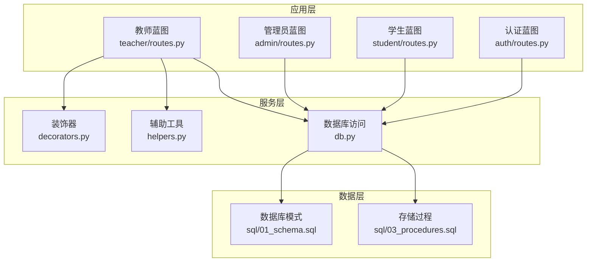
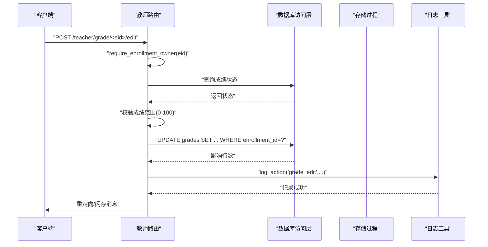
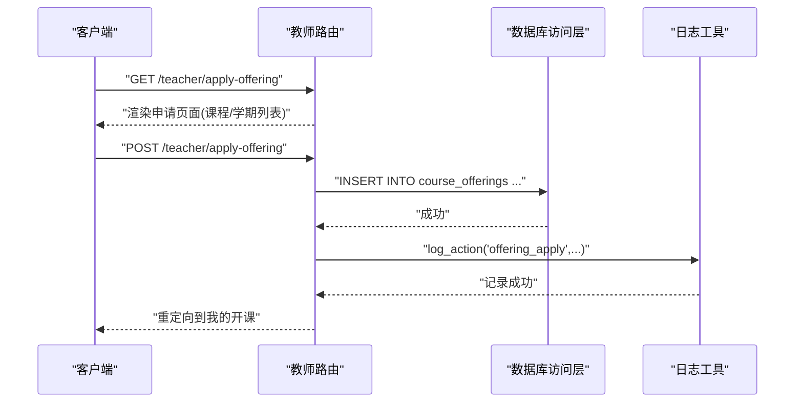
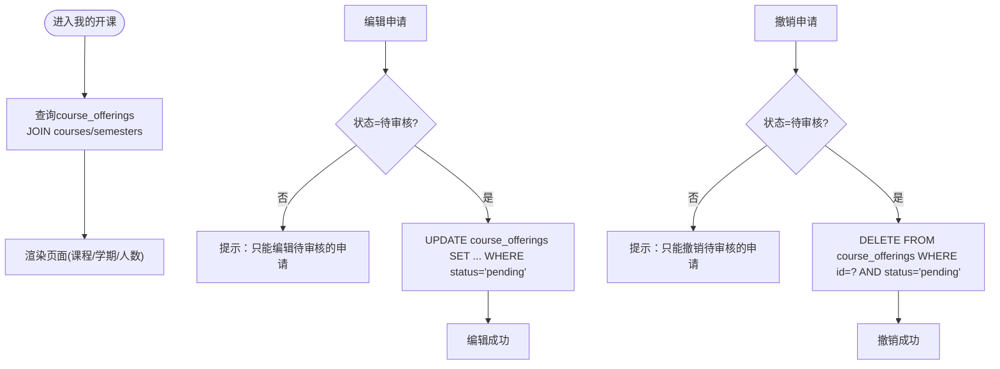
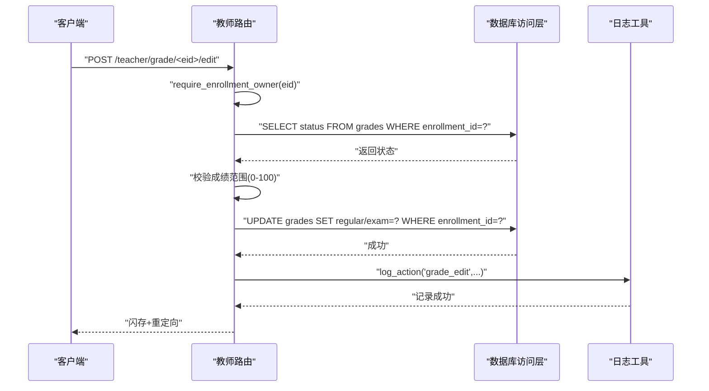
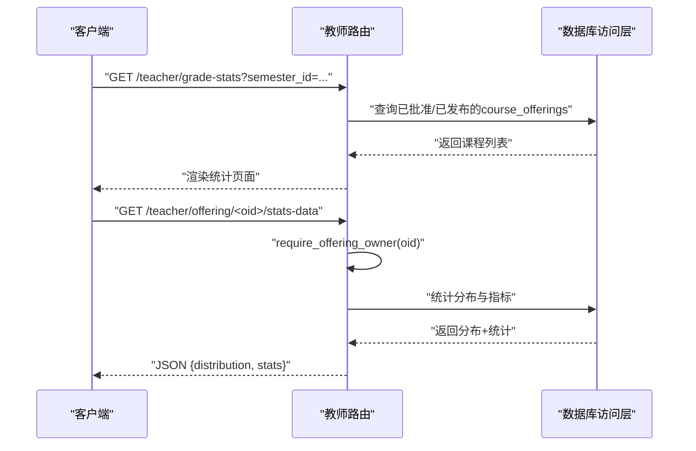
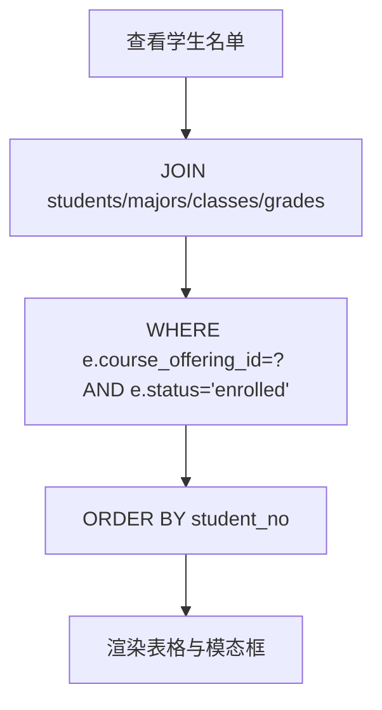
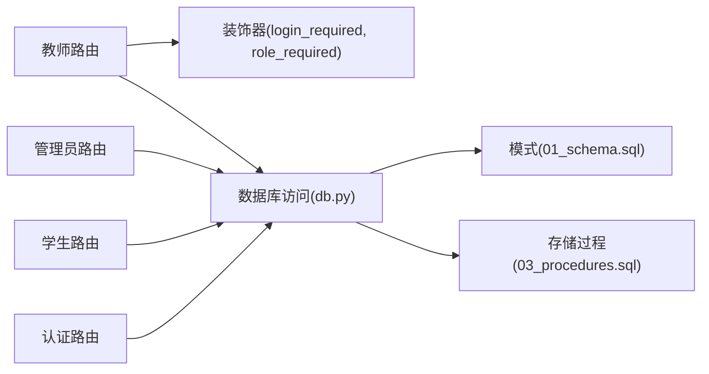

# 教师功能API

<cite>
**本文档引用的文件**
- [routes.py](file://app/teacher/routes.py)
- [routes.py](file://app/admin/routes.py)
- [routes.py](file://app/student/routes.py)
- [routes.py](file://app/auth/routes.py)
- [db.py](file://app/db.py)
- [decorators.py](file://app/decorators.py)
- [helpers.py](file://app/helpers.py)
- [01_schema.sql](file://sql/01_schema.sql)
- [03_procedures.sql](file://sql/03_procedures.sql)
- [apply_offering.html](file://app/templates/teacher/apply_offering.html)
- [offering_students.html](file://app/templates/teacher/offering_students.html)
- [grade_stats.html](file://app/templates/teacher/grade_stats.html)
</cite>

## 目录
1. [简介](#简介)
2. [项目结构](#项目结构)
3. [核心组件](#核心组件)
4. [架构概览](#架构概览)
5. [详细组件分析](#详细组件分析)
6. [依赖分析](#依赖分析)
7. [性能考虑](#性能考虑)
8. [故障排除指南](#故障排除指南)
9. [结论](#结论)

## 简介
本文件面向教师角色，提供完整的教师功能API文档，涵盖开课申请、课程管理、成绩录入与审核、成绩统计以及教师个人信息维护等核心业务场景。文档基于实际代码实现，确保接口定义、参数说明、权限控制与错误处理均以系统现有逻辑为准。

## 项目结构
教师功能主要由Flask蓝图路由、数据库访问层、装饰器与辅助工具组成，配合MySQL存储过程实现关键业务逻辑。

**图示来源**
- [routes.py:1-294](file://app/teacher/routes.py#L1-L294)
- [db.py:1-121](file://app/db.py#L1-L121)
- [01_schema.sql:1-235](file://sql/01_schema.sql#L1-L235)
- [03_procedures.sql:1-381](file://sql/03_procedures.sql#L1-L381)

**章节来源**
- [routes.py:1-294](file://app/teacher/routes.py#L1-L294)
- [db.py:1-121](file://app/db.py#L1-L121)

## 核心组件
- 教师蓝图路由：提供开课申请、课程管理、成绩录入与审核、统计查询等接口
- 数据库访问层：统一的查询、执行、分页与存储过程调用封装
- 装饰器：统一的登录与角色校验
- 辅助工具：系统日志记录、课表解析与选课时间段查询
- 存储过程：选课/退课原子操作、成绩计算与开课审核

**章节来源**
- [routes.py:1-294](file://app/teacher/routes.py#L1-L294)
- [db.py:1-121](file://app/db.py#L1-L121)
- [decorators.py:1-26](file://app/decorators.py#L1-L26)
- [helpers.py:1-80](file://app/helpers.py#L1-L80)
- [03_procedures.sql:1-381](file://sql/03_procedures.sql#L1-L381)

## 架构概览
教师功能遵循MVC模式，路由负责请求处理与权限校验，服务层封装数据库操作，存储过程保证关键业务的原子性与一致性。

**图示来源**
- [routes.py:162-191](file://app/teacher/routes.py#L162-L191)
- [db.py:53-59](file://app/db.py#L53-L59)
- [helpers.py:9-21](file://app/helpers.py#L9-L21)

**章节来源**
- [routes.py:162-191](file://app/teacher/routes.py#L162-L191)
- [db.py:53-59](file://app/db.py#L53-L59)

## 详细组件分析

### 开课申请接口
- 接口路径：/teacher/apply-offering
- 方法：GET/POST
- 权限：教师登录且角色为teacher
- 功能：提交开课申请，包含课程、学期、最大人数、教室、时间安排与申请理由
- 表单字段：
  - course_id：课程ID
  - semester_id：学期ID
  - max_students：最大选课人数
  - classroom：教室
  - schedule：时间安排
  - apply_reason：申请理由
- 提交后行为：插入course_offerings记录，状态默认pending，记录系统日志

**图示来源**
- [routes.py:68-85](file://app/teacher/routes.py#L68-L85)
- [apply_offering.html:1-33](file://app/templates/teacher/apply_offering.html#L1-L33)
- [01_schema.sql:128-155](file://sql/01_schema.sql#L128-L155)

**章节来源**
- [routes.py:68-85](file://app/teacher/routes.py#L68-L85)
- [apply_offering.html:1-33](file://app/templates/teacher/apply_offering.html#L1-L33)

### 课程管理接口
- 我的开课(/teacher/my-offerings)
  - 方法：GET
  - 功能：列出当前教师的所有开课记录，包含课程名称、学期、已选人数等
  - 权限：教师登录
- 撤销申请(/teacher/offering/<int:oid>/withdraw)
  - 方法：POST
  - 条件：仅待审核(pending)状态可撤销
  - 行为：删除对应开课记录
- 编辑申请(/teacher/offering/<int:oid>/edit)
  - 方法：POST
  - 条件：仅待审核(pending)状态可编辑
  - 字段：course_id、semester_id、max_students、classroom、schedule、apply_reason

**图示来源**
- [routes.py:88-134](file://app/teacher/routes.py#L88-L134)
- [01_schema.sql:128-155](file://sql/01_schema.sql#L128-L155)

**章节来源**
- [routes.py:88-134](file://app/teacher/routes.py#L88-L134)

### 成绩录入与审核接口
- 单个成绩录入/修改(/teacher/grade/<int:eid>/edit)
  - 方法：POST
  - 权限：仅允许修改自己所授课程的选课记录
  - 校验：平时/期末成绩范围0-100
  - 状态限制：仅draft状态可修改
  - 行为：更新grades中的regular_grade与exam_grade
- 单个成绩提交(/teacher/grade/<int:eid>/submit)
  - 方法：POST
  - 条件：仅draft状态可提交
  - 行为：设置status='submitted'并记录提交时间
- 批量提交(/teacher/offering/<int:oid>/submit-all)
  - 方法：POST
  - 条件：仅对已录入且非空的课程进行批量提交
  - 行为：批量更新grades状态为submitted
- 撤回提交(/teacher/grade/<int:eid>/withdraw)
  - 方法：POST
  - 条件：仅submitted状态可撤回
  - 行为：退回draft并清空提交时间

**图示来源**
- [routes.py:162-235](file://app/teacher/routes.py#L162-L235)
- [db.py:53-59](file://app/db.py#L53-L59)
- [helpers.py:9-21](file://app/helpers.py#L9-L21)

**章节来源**
- [routes.py:162-235](file://app/teacher/routes.py#L162-L235)

### 成绩统计接口
- 页面(/teacher/grade-stats)
  - 方法：GET
  - 功能：按学期筛选，列出已批准/已发布的课程，供查看统计
- 统计数据接口(/teacher/offering/<int:oid>/stats-data)
  - 方法：GET
  - 返回：成绩分布(90-100, 80-89, ..., <60)与统计指标(总数、平均分、最高/最低分、及格率)
  - 权限：仅课程任课教师可访问

**图示来源**
- [routes.py:238-293](file://app/teacher/routes.py#L238-L293)
- [grade_stats.html:1-50](file://app/templates/teacher/grade_stats.html#L1-L50)

**章节来源**
- [routes.py:238-293](file://app/teacher/routes.py#L238-L293)
- [grade_stats.html:1-50](file://app/templates/teacher/grade_stats.html#L1-L50)

### 学生管理接口
- 查看选课学生(/teacher/offering/<int:oid>/students)
  - 方法：GET
  - 功能：列出课程的已选学生，包含个人与班级信息、各阶段成绩与状态
  - 权限：仅课程任课教师可访问
  - 模板：offering_students.html，包含成绩录入、提交、批量提交与撤回按钮

**图示来源**
- [routes.py:137-159](file://app/teacher/routes.py#L137-L159)
- [offering_students.html:1-71](file://app/templates/teacher/offering_students.html#L1-L71)

**章节来源**
- [routes.py:137-159](file://app/teacher/routes.py#L137-L159)
- [offering_students.html:1-71](file://app/templates/teacher/offering_students.html#L1-L71)

### 教师个人信息维护与教学工作量
- 个人信息维护
  - 登录后通过认证蓝图的个人资料页面进行密码修改与联系方式更新
  - 教师信息包含姓名、性别、职称、电话、邮箱等
- 教学工作量统计
  - 管理员端提供教师工作量统计视图，汇总开课数量与选课人数
  - 教师可通过个人仪表盘查看所授课程与选课情况

**章节来源**
- [routes.py:129-185](file://app/auth/routes.py#L129-L185)
- [routes.py:629-634](file://app/admin/routes.py#L629-L634)

## 依赖分析
- 路由依赖
  - 教师蓝图依赖登录与角色装饰器，确保仅教师可访问
  - 使用数据库访问层进行查询与写入
  - 使用日志工具记录关键操作
- 数据库依赖
  - course_offerings：开课申请与状态管理
  - enrollments：选课记录，自动触发grades创建
  - grades：成绩记录，包含状态机与计算逻辑
  - 存储过程：选课/退课原子操作、总评与GPA计算、开课审核

**图示来源**
- [routes.py:1-294](file://app/teacher/routes.py#L1-L294)
- [decorators.py:1-26](file://app/decorators.py#L1-L26)
- [db.py:1-121](file://app/db.py#L1-L121)
- [01_schema.sql:1-235](file://sql/01_schema.sql#L1-L235)
- [03_procedures.sql:1-381](file://sql/03_procedures.sql#L1-L381)

**章节来源**
- [routes.py:1-294](file://app/teacher/routes.py#L1-L294)
- [db.py:1-121](file://app/db.py#L1-L121)

## 性能考虑
- 连接池：数据库连接通过PooledDB实现连接复用，减少连接开销
- 分页：查询支持分页，避免一次性加载大量数据
- 索引：关键表对常用查询字段建立索引，提升查询效率
- 存储过程：关键业务逻辑在数据库侧执行，减少网络往返与事务复杂度

## 故障排除指南
- 权限不足
  - 现象：返回403
  - 原因：未登录或角色非teacher
  - 处理：确保登录且角色正确
- 非本人课程操作
  - 现象：拒绝访问
  - 原因：require_offering_owner或require_enrollment_owner校验失败
  - 处理：仅能操作本人所授课程
- 成绩状态限制
  - 现象：无法修改/提交
  - 原因：状态非draft或已提交
  - 处理：先撤回至draft再修改，或确保已录入完整后再提交
- 参数范围校验
  - 现象：输入超出0-100范围被拒绝
  - 处理：调整为合法数值

**章节来源**
- [routes.py:23-48](file://app/teacher/routes.py#L23-L48)
- [routes.py:162-235](file://app/teacher/routes.py#L162-L235)

## 结论
教师功能API围绕“开课—选课—成绩—统计”闭环设计，通过严格的权限控制、状态机管理与存储过程保障业务一致性。建议在生产环境中结合前端模板与日志审计，持续优化用户体验与系统稳定性。