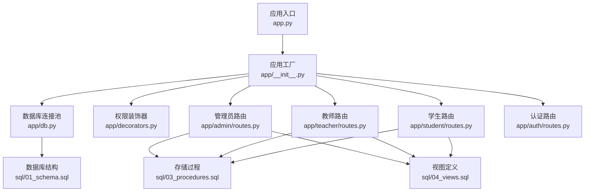
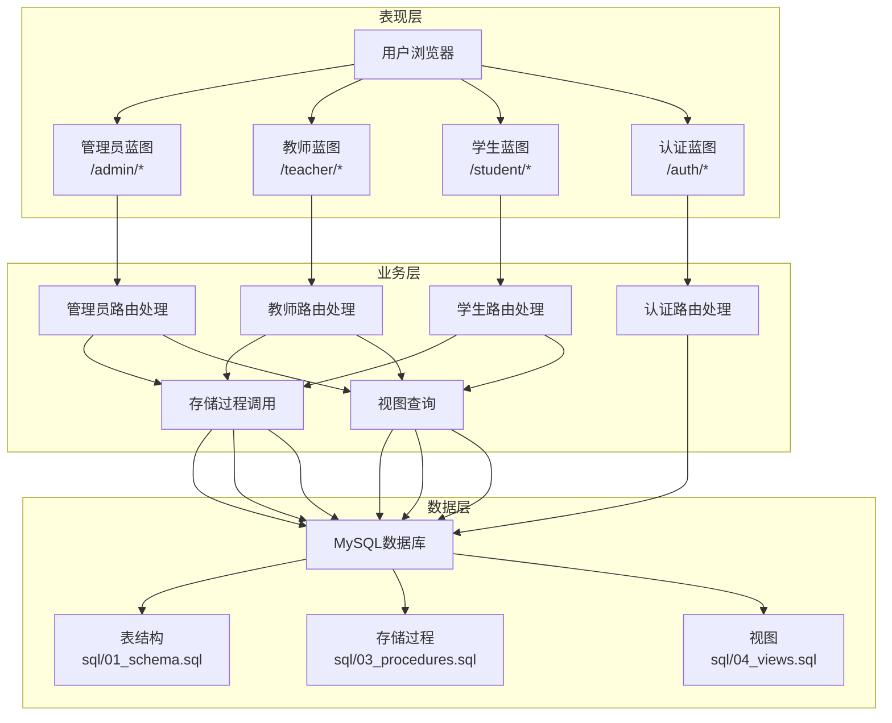
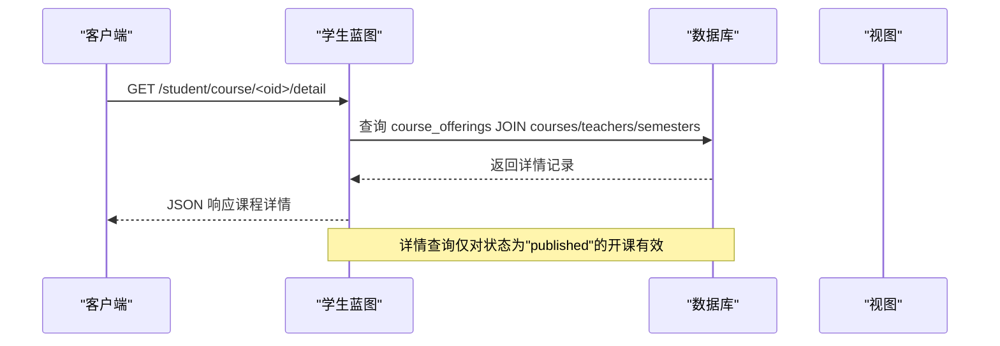
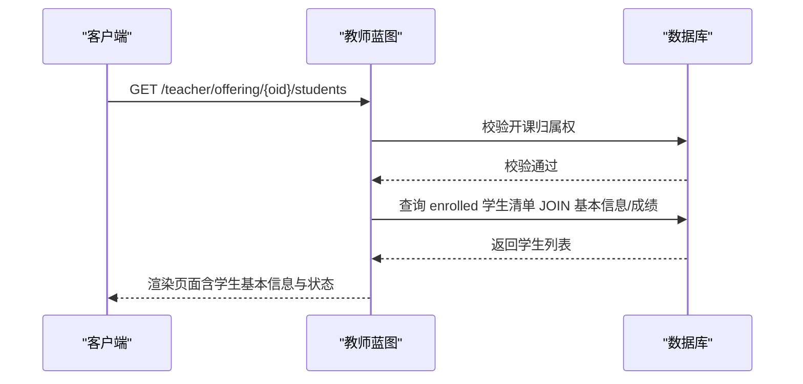
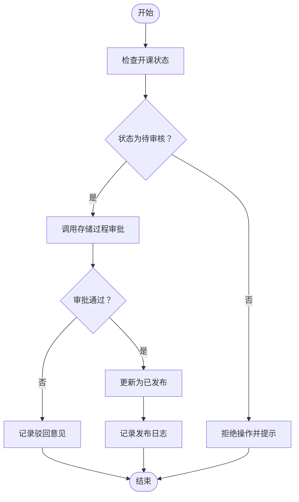
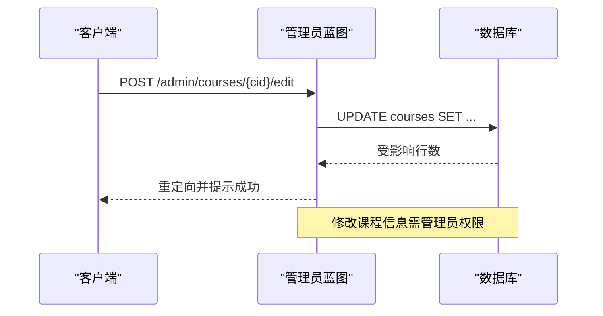
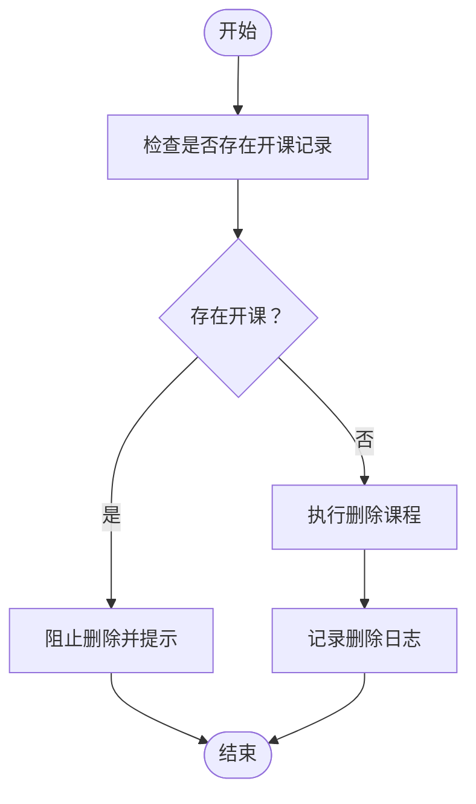
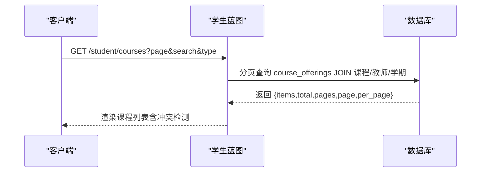
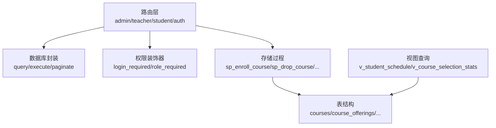

# 课程管理API

<cite>
**本文档引用的文件**
- [app.py](file://app.py)
- [app/__init__.py](file://app/__init__.py)
- [app/db.py](file://app/db.py)
- [app/decorators.py](file://app/decorators.py)
- [app/admin/routes.py](file://app/admin/routes.py)
- [app/teacher/routes.py](file://app/teacher/routes.py)
- [app/student/routes.py](file://app/student/routes.py)
- [app/auth/routes.py](file://app/auth/routes.py)
- [config.py](file://config.py)
- [sql/01_schema.sql](file://sql/01_schema.sql)
- [sql/03_procedures.sql](file://sql/03_procedures.sql)
- [sql/04_views.sql](file://sql/04_views.sql)
</cite>

## 目录
1. [简介](#简介)
2. [项目结构](#项目结构)
3. [核心组件](#核心组件)
4. [架构概览](#架构概览)
5. [详细组件分析](#详细组件分析)
6. [依赖分析](#依赖分析)
7. [性能考虑](#性能考虑)
8. [故障排除指南](#故障排除指南)
9. [结论](#结论)

## 简介
本文件面向课程管理功能的API设计与实现，覆盖课程信息查看、学生名单获取、课程状态管理、信息修改、删除与归档、搜索与筛选等核心能力。系统采用Flask微服务框架，结合MySQL数据库与存储过程/触发器实现业务逻辑，提供基于角色的权限控制与操作日志审计。

## 项目结构
- 应用入口与初始化：应用工厂模式创建Flask实例，注册蓝图，初始化数据库连接池与登录管理。
- 蓝图模块：
  - 管理员模块：课程管理、开课审核、选课时间段配置、成绩审核、统计分析、学业预警等。
  - 教师模块：开课申请、教学班学生名单、成绩录入与提交、统计分析。
  - 学生模块：课程浏览与详情查询、选课/退课、个人课表、成绩查询、成绩单。
  - 认证模块：登录/注册/登出、个人信息维护。
- 数据层：统一的数据库连接池封装、分页查询、存储过程调用、视图查询。
- 配置：数据库连接参数、分页配置、权重与预警阈值等。

**图表来源**
- [app.py:1-13](file://app.py#L1-L13)
- [app/__init__.py:29-93](file://app/__init__.py#L29-L93)
- [app/db.py:10-121](file://app/db.py#L10-L121)
- [app/decorators.py:1-26](file://app/decorators.py#L1-L26)
- [app/admin/routes.py:1-692](file://app/admin/routes.py#L1-L692)
- [app/teacher/routes.py:1-333](file://app/teacher/routes.py#L1-L333)
- [app/student/routes.py:1-233](file://app/student/routes.py#L1-L233)
- [app/auth/routes.py:1-186](file://app/auth/routes.py#L1-L186)
- [sql/01_schema.sql:1-235](file://sql/01_schema.sql#L1-L235)
- [sql/03_procedures.sql:1-381](file://sql/03_procedures.sql#L1-L381)
- [sql/04_views.sql:1-113](file://sql/04_views.sql#L1-L113)

**章节来源**
- [app.py:1-13](file://app.py#L1-L13)
- [app/__init__.py:29-93](file://app/__init__.py#L29-L93)
- [app/db.py:10-121](file://app/db.py#L10-L121)

## 核心组件
- 权限控制
  - 登录必经：所有受保护路由均使用登录装饰器。
  - 角色限定：管理员/教师/学生分别通过角色装饰器进行访问控制。
- 数据访问
  - 连接池：PooledDB提供连接池，避免频繁建立/销毁连接。
  - 查询封装：query/execut/paginate/call_proc/call_proc_rows/insert等方法统一封装SQL操作。
- 存储过程与触发器
  - 选课/退课原子性保障、时间冲突检测、容量检查、成绩计算与GPA转换。
- 视图
  - 学生课表、成绩单、选课统计、教师工作量等常用聚合视图。

**章节来源**
- [app/decorators.py:7-26](file://app/decorators.py#L7-L26)
- [app/db.py:43-121](file://app/db.py#L43-L121)
- [sql/03_procedures.sql:14-114](file://sql/03_procedures.sql#L14-L114)
- [sql/04_views.sql:10-113](file://sql/04_views.sql#L10-L113)

## 架构概览
系统采用分层架构：
- 表现层：各模块蓝图负责HTTP请求处理与响应渲染。
- 业务层：路由函数内调用数据库封装与存储过程，执行业务规则。
- 数据层：MySQL数据库，配合存储过程/触发器保证一致性与性能。

**图表来源**
- [app/admin/routes.py:14-18](file://app/admin/routes.py#L14-L18)
- [app/teacher/routes.py:11-15](file://app/teacher/routes.py#L11-L15)
- [app/student/routes.py:12-16](file://app/student/routes.py#L12-L16)
- [app/auth/routes.py:33-57](file://app/auth/routes.py#L33-L57)
- [sql/01_schema.sql:100-155](file://sql/01_schema.sql#L100-L155)
- [sql/03_procedures.sql:14-114](file://sql/03_procedures.sql#L14-L114)
- [sql/04_views.sql:10-66](file://sql/04_views.sql#L10-L66)

## 详细组件分析

### 课程信息查看接口
- 接口目标
  - 课程详情查询：返回课程名称、代码、学分、学时、类型、描述、任课教师、开课学期、教室、时间安排、最大人数、当前选课人数、状态等。
  - 开课信息获取：按学期、课程类型、教师等维度聚合展示。
  - 课程状态展示：公开发布的课程方可被查询详情。
- 实现要点
  - 学生端详情接口直接返回JSON，管理员/教师端用于页面渲染。
  - 使用视图简化联表查询，提升性能。
  - 详情查询限制为“已发布”状态。
- 关键路由与方法
  - 学生详情查询：GET /student/course/<int:oid>/detail
  - 课程列表与筛选：GET /student/courses（支持按学期、关键词、类型筛选）
- 数据模型映射
  - course_offerings、courses、teachers、semesters、enrollments、grades等多表关联。
- 性能与复杂度
  - 分页查询默认每页固定数量，避免一次性加载过多数据。
  - 详情查询为单条记录读取，时间复杂度O(1)。

**图表来源**
- [app/student/routes.py:132-146](file://app/student/routes.py#L132-L146)
- [sql/04_views.sql:10-32](file://sql/04_views.sql#L10-L32)

**章节来源**
- [app/student/routes.py:82-146](file://app/student/routes.py#L82-L146)
- [sql/04_views.sql:10-32](file://sql/04_views.sql#L10-L32)

### 学生名单获取接口
- 接口目标
  - 选课学生列表：按教学班返回已选该课程的学生清单。
  - 学生基本信息：学号、姓名、性别、专业、班级、入校年份等。
  - 选课状态管理：显示选课/退课状态、选课时间、成绩状态等。
- 实现要点
  - 教师端专属路由，需具备开课归属权校验。
  - 支持按教学班、专业、班级等维度筛选。
  - 结合视图与联表查询，确保数据一致性。
- 关键路由与方法
  - 教师端学生列表：GET /teacher/offering/<int:oid>/students
- 数据模型映射
  - enrollments、students、majors、classes、grades等。

**图表来源**
- [app/teacher/routes.py:137-159](file://app/teacher/routes.py#L137-L159)

**章节来源**
- [app/teacher/routes.py:137-159](file://app/teacher/routes.py#L137-L159)

### 课程状态管理接口
- 接口目标
  - 开课申请审核：管理员对待审核申请进行审批或驳回。
  - 发布开课：将已批准的开课状态更新为“已发布”，供学生选课。
  - 选课时间段管理：配置选课/退课窗口，支持启用/禁用。
- 实现要点
  - 审核流程通过存储过程保证原子性与一致性。
  - 发布操作仅允许对“已批准”的开课执行。
  - 选课时间段支持按学期筛选与状态切换。
- 关键路由与方法
  - 审核申请：POST /admin/offering/<int:oid>/review
  - 发布开课：POST /admin/offering/<int:oid>/publish
  - 选课时间段管理：GET/POST /admin/selection-periods*
- 数据模型映射
  - course_offerings、course_selection_periods、semesters等。

**图表来源**
- [app/admin/routes.py:414-440](file://app/admin/routes.py#L414-L440)
- [sql/03_procedures.sql:280-319](file://sql/03_procedures.sql#L280-L319)

**章节来源**
- [app/admin/routes.py:386-440](file://app/admin/routes.py#L386-L440)
- [sql/03_procedures.sql:280-319](file://sql/03_procedures.sql#L280-L319)

### 课程信息修改接口
- 接口目标
  - 修改课程基础信息：代码、名称、学分、学时、类型、描述等。
  - 修改开课信息：最大人数、教室、时间安排、申请理由等。
- 实现要点
  - 管理员与教师分别具备不同修改范围与权限。
  - 修改开课信息仅允许对“待审核”状态的申请进行。
  - 更新后记录系统日志便于审计。
- 关键路由与方法
  - 课程修改：POST /admin/courses/<int:cid>/edit
  - 开课修改：POST /teacher/offering/<int:oid>/edit
- 数据模型映射
  - courses、course_offerings等。

**图表来源**
- [app/admin/routes.py:189-198](file://app/admin/routes.py#L189-L198)

**章节来源**
- [app/admin/routes.py:178-198](file://app/admin/routes.py#L178-L198)
- [app/teacher/routes.py:120-135](file://app/teacher/routes.py#L120-L135)

### 课程删除与归档接口
- 接口目标
  - 删除课程：从课程表移除课程记录。
  - 归档策略：通过软删除机制保留历史数据（本项目未实现软删除，实际为物理删除）。
- 实现要点
  - 删除前需确保无相关开课记录，避免外键约束冲突。
  - 删除操作记录系统日志。
- 关键路由与方法
  - 删除课程：POST /admin/courses/<int:cid>/delete
- 数据模型映射
  - courses、course_offerings等。

**图表来源**
- [app/admin/routes.py:200-206](file://app/admin/routes.py#L200-L206)

**章节来源**
- [app/admin/routes.py:200-206](file://app/admin/routes.py#L200-L206)

### 课程搜索与筛选接口
- 接口目标
  - 按关键词、课程类型、学期等条件查询课程。
  - 支持分页与排序，返回总数、页码、每页数量等元信息。
- 实现要点
  - 学生端课程列表支持按学期、关键词、类型筛选。
  - 管理端与教师端也提供相应筛选与分页能力。
  - 分页查询通过通用分页函数实现，支持自定义计数SQL。
- 关键路由与方法
  - 学生课程列表：GET /student/courses（支持search、type、page）
  - 管理端课程管理：GET /admin/courses
  - 管理端开课审核：GET /admin/offerings（支持status、search筛选）
- 数据模型映射
  - courses、course_offerings、semesters、teachers等。

**图表来源**
- [app/student/routes.py:82-130](file://app/student/routes.py#L82-L130)
- [app/admin/routes.py:387-412](file://app/admin/routes.py#L387-L412)

**章节来源**
- [app/student/routes.py:82-130](file://app/student/routes.py#L82-L130)
- [app/admin/routes.py:387-412](file://app/admin/routes.py#L387-L412)

## 依赖分析
- 组件耦合
  - 路由层依赖数据库封装与存储过程；存储过程依赖表结构与触发器。
  - 权限装饰器贯穿所有蓝图，确保角色隔离。
- 外部依赖
  - Flask、Flask-Login、PyMySQL、DBUtils PooledDB。
- 循环依赖
  - 未发现循环导入；蓝图注册在应用工厂中集中完成。

**图表来源**
- [app/admin/routes.py:14-18](file://app/admin/routes.py#L14-L18)
- [app/teacher/routes.py:11-15](file://app/teacher/routes.py#L11-L15)
- [app/student/routes.py:12-16](file://app/student/routes.py#L12-L16)
- [app/db.py:43-121](file://app/db.py#L43-L121)
- [sql/01_schema.sql:112-155](file://sql/01_schema.sql#L112-L155)
- [sql/03_procedures.sql:14-114](file://sql/03_procedures.sql#L14-L114)
- [sql/04_views.sql:10-92](file://sql/04_views.sql#L10-L92)

**章节来源**
- [app/db.py:43-121](file://app/db.py#L43-L121)
- [sql/01_schema.sql:112-155](file://sql/01_schema.sql#L112-L155)
- [sql/03_procedures.sql:14-114](file://sql/03_procedures.sql#L14-L114)
- [sql/04_views.sql:10-92](file://sql/04_views.sql#L10-L92)

## 性能考虑
- 连接池与事务
  - 使用连接池减少连接开销；存储过程内部使用事务保证原子性。
- 查询优化
  - 合理使用索引（如status、semester_id、course_id等），避免全表扫描。
  - 分页查询避免一次性加载大量数据。
- 缓存与视图
  - 利用视图减少重复联表查询，提高报表类查询效率。
- 并发控制
  - 选课/退课使用行级锁，防止超卖与时间冲突。

## 故障排除指南
- 权限相关
  - 403错误：未登录或角色不匹配，检查装饰器与用户角色。
- 业务异常
  - 选课失败：不在选课窗口、时间冲突、课程已满、已选过、课程未发布等，查看存储过程返回码与消息。
  - 退课失败：不在退课窗口、已有非草稿成绩等。
- 数据库异常
  - 外键约束：删除课程前确认无相关开课记录。
  - 连接池耗尽：检查连接池配置与释放时机。

**章节来源**
- [app/decorators.py:7-26](file://app/decorators.py#L7-L26)
- [sql/03_procedures.sql:14-114](file://sql/03_procedures.sql#L14-L114)
- [app/admin/routes.py:200-206](file://app/admin/routes.py#L200-L206)

## 结论
本课程管理API围绕“课程信息查看、学生名单、状态管理、信息修改、删除与归档、搜索与筛选”六大能力构建，结合存储过程与视图实现高性能与强一致性的业务逻辑。通过角色化权限控制与系统日志审计，确保系统的安全性与可追溯性。建议后续引入软删除与更细粒度的缓存策略以进一步提升用户体验与系统性能。