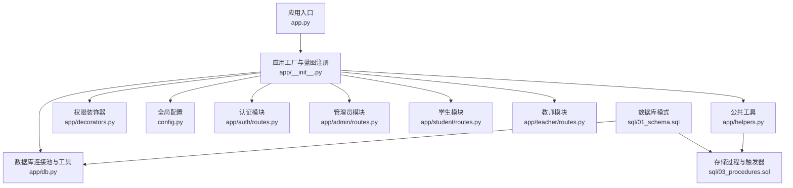
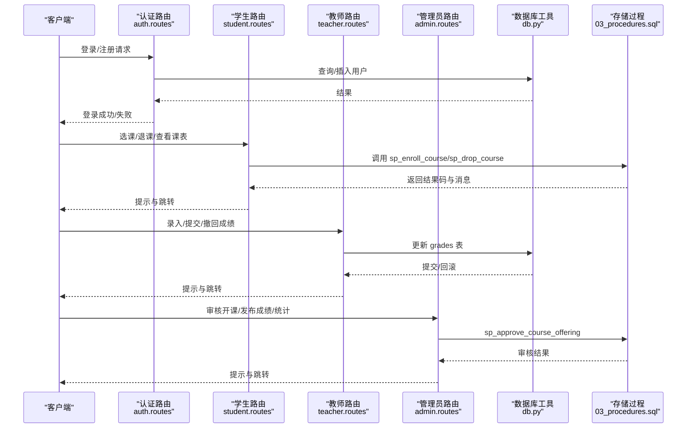
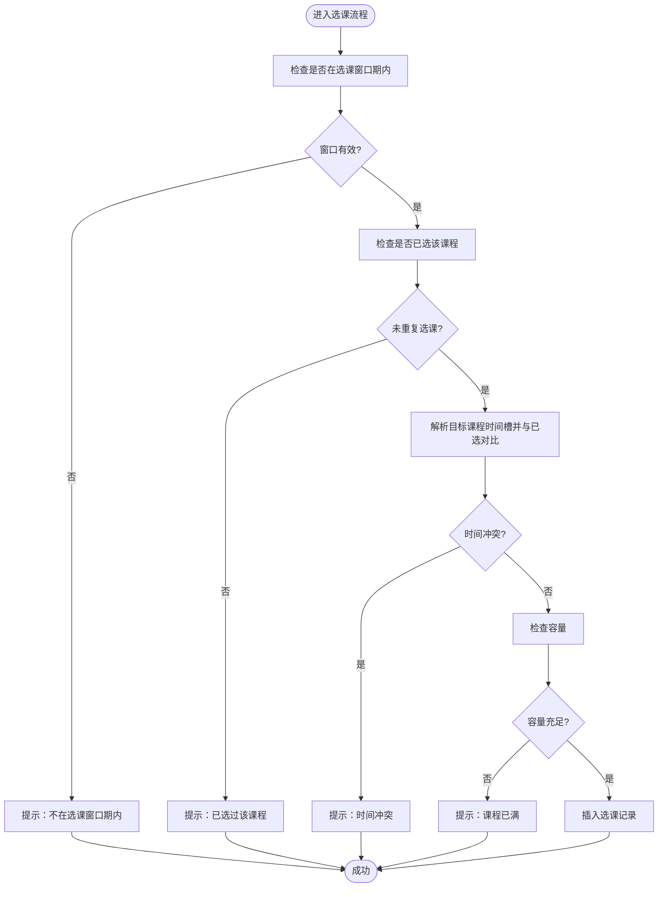
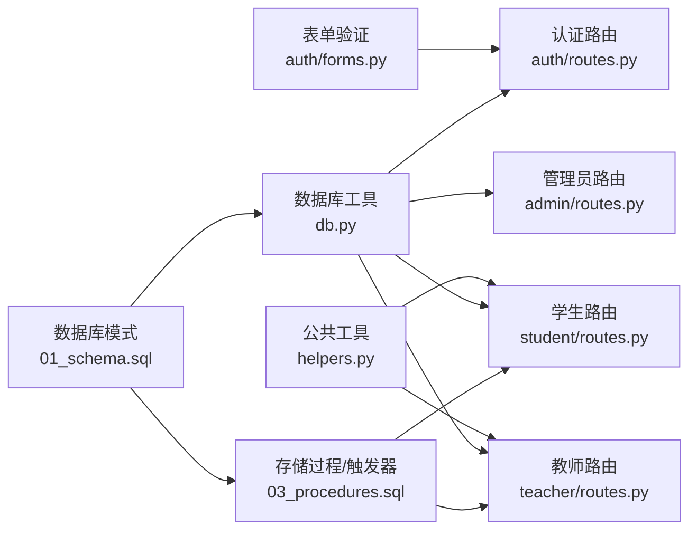

# 数据验证API

<cite>
**本文引用的文件**
- [app.py](file://app.py)
- [app/__init__.py](file://app/__init__.py)
- [app/db.py](file://app/db.py)
- [app/decorators.py](file://app/decorators.py)
- [config.py](file://config.py)
- [app/admin/routes.py](file://app/admin/routes.py)
- [app/auth/routes.py](file://app/auth/routes.py)
- [app/student/routes.py](file://app/student/routes.py)
- [app/teacher/routes.py](file://app/teacher/routes.py)
- [app/helpers.py](file://app/helpers.py)
- [app/auth/forms.py](file://app/auth/forms.py)
- [sql/01_schema.sql](file://sql/01_schema.sql)
- [sql/03_procedures.sql](file://sql/03_procedures.sql)
- [app/templates/auth/login.html](file://app/templates/auth/login.html)
- [app/templates/404.html](file://app/templates/404.html)
- [app/templates/500.html](file://app/templates/500.html)
</cite>

## 目录
1. [简介](#简介)
2. [项目结构](#项目结构)
3. [核心组件](#核心组件)
4. [架构总览](#架构总览)
5. [详细组件分析](#详细组件分析)
6. [依赖分析](#依赖分析)
7. [性能考虑](#性能考虑)
8. [故障排查指南](#故障排查指南)
9. [结论](#结论)
10. [附录](#附录)

## 简介
本文件面向“数据验证系统”的API设计与实现，聚焦于以下方面：
- 输入参数验证：必填字段、数据类型与格式校验
- 业务规则验证：选课冲突检测、成绩范围检查、时间重叠验证
- 唯一性验证：学号、工号、课程代码等唯一性
- 数据完整性验证：外键约束、关联数据一致性
- 权限验证：角色权限与操作权限
- 数据更新验证：并发控制、乐观锁机制、版本检查
- 错误处理与用户友好提示

## 项目结构
系统采用Flask蓝图分层组织，按角色划分模块，配合数据库约束与存储过程实现强一致的业务校验。

**图表来源**
- [app.py:1-13](file://app.py#L1-L13)
- [app/__init__.py:29-93](file://app/__init__.py#L29-L93)
- [app/db.py:1-121](file://app/db.py#L1-L121)
- [app/decorators.py:1-26](file://app/decorators.py#L1-L26)
- [config.py:1-36](file://config.py#L1-L36)
- [app/auth/routes.py:1-186](file://app/auth/routes.py#L1-L186)
- [app/admin/routes.py:1-692](file://app/admin/routes.py#L1-L692)
- [app/student/routes.py:1-233](file://app/student/routes.py#L1-L233)
- [app/teacher/routes.py:1-333](file://app/teacher/routes.py#L1-L333)
- [app/helpers.py:1-80](file://app/helpers.py#L1-L80)
- [sql/01_schema.sql:1-235](file://sql/01_schema.sql#L1-L235)
- [sql/03_procedures.sql:1-381](file://sql/03_procedures.sql#L1-L381)

**章节来源**
- [app.py:1-13](file://app.py#L1-L13)
- [app/__init__.py:29-93](file://app/__init__.py#L29-L93)

## 核心组件
- 应用工厂与蓝图注册：集中初始化CSRF保护、数据库连接池、登录管理、错误处理器与蓝图注册。
- 数据库工具：统一查询、写入、分页、存储过程调用，确保事务与一致性。
- 权限装饰器：统一登录与角色校验，简化路由层权限控制。
- 表单验证：基于WTForms的输入校验，覆盖长度、正则、相等性等。
- 公共工具：时间槽解析、冲突检测、选课时间段查询等。
- 存储过程与触发器：在数据库层实现并发控制、业务规则与数据一致性。

**章节来源**
- [app/__init__.py:29-93](file://app/__init__.py#L29-L93)
- [app/db.py:43-121](file://app/db.py#L43-L121)
- [app/decorators.py:7-26](file://app/decorators.py#L7-L26)
- [app/auth/forms.py:6-37](file://app/auth/forms.py#L6-L37)
- [app/helpers.py:9-80](file://app/helpers.py#L9-L80)
- [sql/03_procedures.sql:14-113](file://sql/03_procedures.sql#L14-L113)

## 架构总览
系统通过蓝图将不同角色的业务接口隔离，统一由装饰器进行权限拦截，数据库层通过约束与存储过程保障数据完整性与并发安全。

**图表来源**
- [app/auth/routes.py:33-117](file://app/auth/routes.py#L33-L117)
- [app/student/routes.py:148-174](file://app/student/routes.py#L148-L174)
- [app/teacher/routes.py:162-236](file://app/teacher/routes.py#L162-L236)
- [app/admin/routes.py:414-440](file://app/admin/routes.py#L414-L440)
- [sql/03_procedures.sql:14-113](file://sql/03_procedures.sql#L14-L113)

## 详细组件分析

### 输入参数验证与格式规范
- 必填字段检查：使用WTForms的DataRequired，确保用户名、密码、角色、姓名等关键字段非空。
- 数据类型与格式：
  - 用户名长度3-50，仅允许字母、数字、下划线。
  - 密码长度6-30。
  - 性别枚举M/F。
  - 邮箱/电话长度限制。
- 表单渲染与错误展示：模板中对字段错误进行逐项显示，提升用户体验。

**章节来源**
- [app/auth/forms.py:6-37](file://app/auth/forms.py#L6-L37)
- [app/templates/auth/login.html:13-27](file://app/templates/auth/login.html#L13-L27)

### 业务规则验证

#### 选课冲突检测
- 前端：解析课表字符串为标准化时间槽集合，检测与已选课程是否存在交集。
- 后端：存储过程在事务内加锁，检查选课窗口、是否已选、时间冲突与容量上限，原子化执行选课。

**图表来源**
- [app/helpers.py:23-64](file://app/helpers.py#L23-L64)
- [sql/03_procedures.sql:14-113](file://sql/03_procedures.sql#L14-L113)

**章节来源**
- [app/helpers.py:23-64](file://app/helpers.py#L23-L64)
- [app/student/routes.py:108-126](file://app/student/routes.py#L108-L126)
- [sql/03_procedures.sql:14-113](file://sql/03_procedures.sql#L14-L113)

#### 成绩范围检查
- 数据库约束：平时/期末/总评成绩范围0-100。
- 路由层：教师录入时对数值范围进行二次校验，防止越界。
- 自动计算：触发器在成绩更新时按权重计算总评与绩点。

**章节来源**
- [sql/01_schema.sql:195-198](file://sql/01_schema.sql#L195-L198)
- [app/teacher/routes.py:165-176](file://app/teacher/routes.py#L165-L176)
- [sql/03_procedures.sql:338-360](file://sql/03_procedures.sql#L338-L360)

#### 时间重叠验证
- 选课时间段表：通过起止时间与类型标识当前是否处于选课/退课窗口。
- 退课流程：在事务中锁定记录，检查成绩状态与退课窗口，避免违规退课。

**章节来源**
- [app/helpers.py:66-80](file://app/helpers.py#L66-L80)
- [sql/03_procedures.sql:119-194](file://sql/03_procedures.sql#L119-L194)

### 唯一性验证
- 用户名唯一：users表唯一索引。
- 学号唯一：students表唯一索引。
- 工号唯一：teachers表唯一索引。
- 课程代码唯一：courses表唯一索引。
- 开课组合唯一：course_offerings联合唯一索引（课程+教师+学期）。

**章节来源**
- [sql/01_schema.sql:24](file://sql/01_schema.sql#L24)
- [sql/01_schema.sql:67](file://sql/01_schema.sql#L67)
- [sql/01_schema.sql:91](file://sql/01_schema.sql#L91)
- [sql/01_schema.sql:121](file://sql/01_schema.sql#L121)
- [sql/01_schema.sql:143](file://sql/01_schema.sql#L143)

### 数据完整性验证
- 外键约束：学生/教师/班级/专业/开课/学期/选课/成绩等表间严格外键关系。
- 约束检查：课程学分与学时必须大于0；最大容量≥1；成绩范围0-100。
- 关联一致性：存储过程与触发器保证选课即创建成绩、成绩更新即时计算总评与绩点。

**章节来源**
- [sql/01_schema.sql:123-125](file://sql/01_schema.sql#L123-L125)
- [sql/01_schema.sql:154](file://sql/01_schema.sql#L154)
- [sql/01_schema.sql:195-198](file://sql/01_schema.sql#L195-L198)
- [sql/03_procedures.sql:326-360](file://sql/03_procedures.sql#L326-L360)

### 权限验证接口
- 登录必需：所有受保护路由均需登录。
- 角色校验：装饰器role_required按角色放行，否则返回403。
- 管理员：统一前缀/admin，仅admin可访问。
- 教师：仅能操作本人开课与所授班级成绩。
- 学生：仅能操作本人选课与个人课表/成绩。

**章节来源**
- [app/decorators.py:7-26](file://app/decorators.py#L7-L26)
- [app/admin/routes.py:14-18](file://app/admin/routes.py#L14-L18)
- [app/student/routes.py:12-16](file://app/student/routes.py#L12-L16)
- [app/teacher/routes.py:11-15](file://app/teacher/routes.py#L11-L15)

### 数据更新验证与并发控制
- 事务与锁：选课/退课/审核等关键流程在存储过程中开启事务并加行级锁，避免并发写冲突。
- 状态机：成绩与开课状态遵循draft/submitted/approved/published等有限状态转换，路由层与存储过程共同维护。
- 日志审计：系统日志记录关键操作，便于追踪与复盘。

**章节来源**
- [sql/03_procedures.sql:14-113](file://sql/03_procedures.sql#L14-L113)
- [sql/03_procedures.sql:277-320](file://sql/03_procedures.sql#L277-L320)
- [app/helpers.py:9-21](file://app/helpers.py#L9-L21)

### 错误处理与用户友好提示
- 路由层：对异常进行捕获并以flash消息反馈，结合模板渲染错误页面。
- 通用错误页：404/500模板提供统一的错误提示与返回入口。
- 表单错误：WTForms在模板中逐项显示字段错误，帮助用户快速修正。

**章节来源**
- [app/admin/routes.py:280-282](file://app/admin/routes.py#L280-L282)
- [app/auth/routes.py:114-116](file://app/auth/routes.py#L114-L116)
- [app/teacher/routes.py:272-274](file://app/teacher/routes.py#L272-L274)
- [app/templates/404.html:1-13](file://app/templates/404.html#L1-L13)
- [app/templates/500.html:1-14](file://app/templates/500.html#L1-L14)

## 依赖分析
- 组件耦合：路由层依赖装饰器、数据库工具与公共工具；存储过程与触发器依赖数据库模式。
- 外部依赖：Flask、Flask-Login、Flask-WTF、PyMySQL、DBUtils Pool。
- 循环依赖：未发现循环导入；蓝图注册在应用工厂中集中完成，避免循环引用。

**图表来源**
- [app/auth/forms.py:1-37](file://app/auth/forms.py#L1-L37)
- [app/auth/routes.py:1-186](file://app/auth/routes.py#L1-L186)
- [app/helpers.py:1-80](file://app/helpers.py#L1-L80)
- [app/student/routes.py:1-233](file://app/student/routes.py#L1-L233)
- [app/teacher/routes.py:1-333](file://app/teacher/routes.py#L1-L333)
- [app/db.py:1-121](file://app/db.py#L1-L121)
- [sql/01_schema.sql:1-235](file://sql/01_schema.sql#L1-L235)
- [sql/03_procedures.sql:1-381](file://sql/03_procedures.sql#L1-L381)

**章节来源**
- [app/__init__.py:53-64](file://app/__init__.py#L53-L64)
- [app/db.py:10-41](file://app/db.py#L10-L41)

## 性能考虑
- 连接池：启用PooledDB，减少连接建立开销，提高并发响应能力。
- 分页查询：统一paginate封装，避免全表扫描。
- 索引策略：在常用过滤字段（如role、is_current、status、semester_id等）建立索引，加速查询。
- 存储过程：将复杂业务逻辑下沉至数据库，减少网络往返与应用侧计算。

**章节来源**
- [config.py:19-25](file://config.py#L19-L25)
- [app/db.py:92-121](file://app/db.py#L92-L121)
- [sql/01_schema.sql:25](file://sql/01_schema.sql#L25)
- [sql/01_schema.sql:107](file://sql/01_schema.sql#L107)
- [sql/01_schema.sql:147](file://sql/01_schema.sql#L147)
- [sql/01_schema.sql:192](file://sql/01_schema.sql#L192)

## 故障排查指南
- 登录失败：检查用户名是否存在且账户激活；确认密码哈希匹配。
- 注册失败：用户名重复、角色非法、学号/工号生成冲突。
- 选课失败：不在选课窗口、时间冲突、课程已满、课程未发布。
- 退课失败：不在退课窗口、已有非草稿成绩。
- 成绩录入异常：超出0-100范围、状态不可修改、并发冲突。
- 审核异常：重复审核、状态不符。
- 通用错误：查看系统日志定位具体操作与参数。

**章节来源**
- [app/auth/routes.py:33-57](file://app/auth/routes.py#L33-L57)
- [app/auth/routes.py:72-117](file://app/auth/routes.py#L72-L117)
- [app/student/routes.py:148-174](file://app/student/routes.py#L148-L174)
- [app/teacher/routes.py:162-236](file://app/teacher/routes.py#L162-L236)
- [app/admin/routes.py:414-440](file://app/admin/routes.py#L414-L440)
- [app/helpers.py:9-21](file://app/helpers.py#L9-L21)

## 结论
本系统通过“前端表单校验 + 后端装饰器权限 + 数据库约束 + 存储过程事务”的多层防护，实现了严格的输入验证、业务规则、唯一性与完整性保障。同时，完善的错误处理与日志体系提升了可观测性与可维护性。建议在生产环境进一步完善参数签名与防重放机制，并持续优化索引与查询计划。

## 附录

### API与验证要点对照
- 认证与注册
  - 输入：用户名、密码、确认密码、角色、姓名、性别、专业、班级、电话、邮箱
  - 校验：必填、长度、正则、相等性、唯一性（用户名）
  - 结果：成功/失败提示，错误字段高亮
- 学生选课
  - 输入：课程开课ID
  - 校验：窗口期、重复选课、时间冲突、容量、状态（已发布）
  - 结果：成功/失败提示，冲突详情
- 学生退课
  - 输入：课程开课ID
  - 校验：窗口期、无非草稿成绩、存在有效记录
  - 结果：成功/失败提示
- 教师录入/提交/撤回成绩
  - 输入：平时成绩、期末成绩
  - 校验：0-100范围、状态限制、并发锁定
  - 结果：成功/失败提示
- 管理员审核与发布
  - 输入：审核动作、评论
  - 校验：状态机、重复审核
  - 结果：成功/失败提示

**章节来源**
- [app/auth/forms.py:6-37](file://app/auth/forms.py#L6-L37)
- [app/student/routes.py:148-174](file://app/student/routes.py#L148-L174)
- [app/teacher/routes.py:162-236](file://app/teacher/routes.py#L162-L236)
- [app/admin/routes.py:414-440](file://app/admin/routes.py#L414-L440)
- [sql/03_procedures.sql:14-113](file://sql/03_procedures.sql#L14-L113)
- [sql/03_procedures.sql:119-194](file://sql/03_procedures.sql#L119-L194)
- [sql/03_procedures.sql:277-320](file://sql/03_procedures.sql#L277-L320)