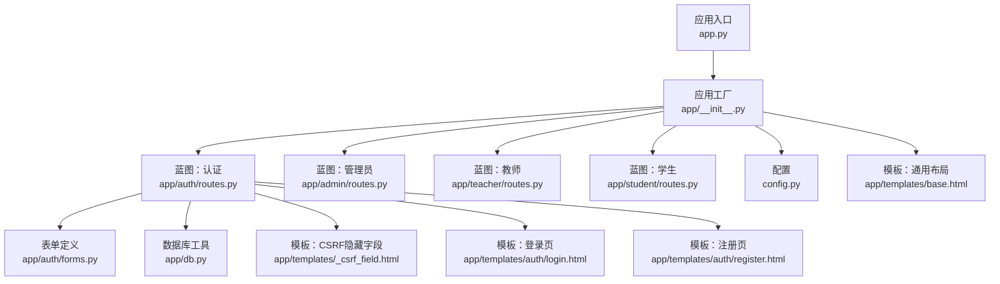
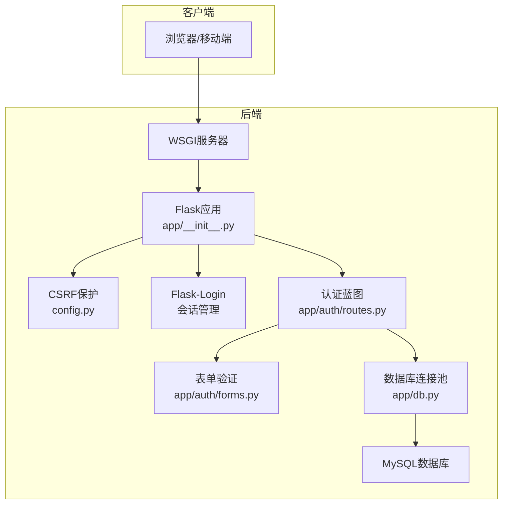
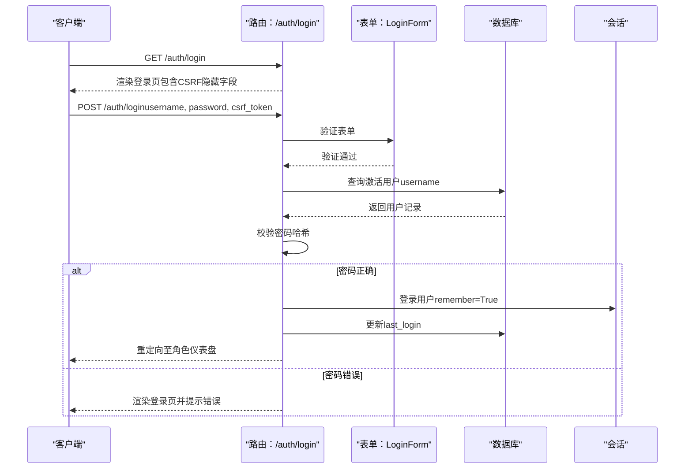
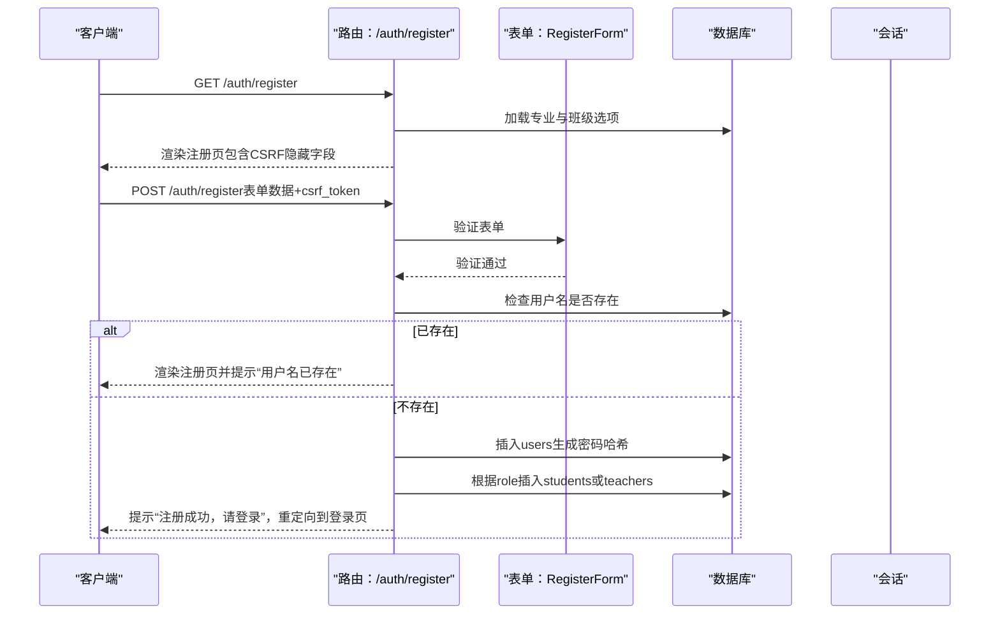
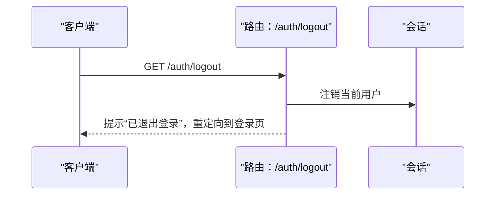
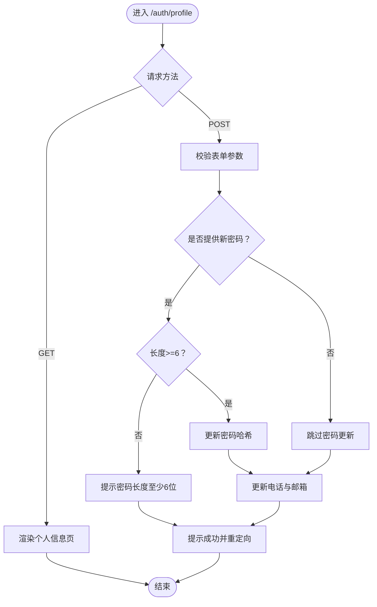
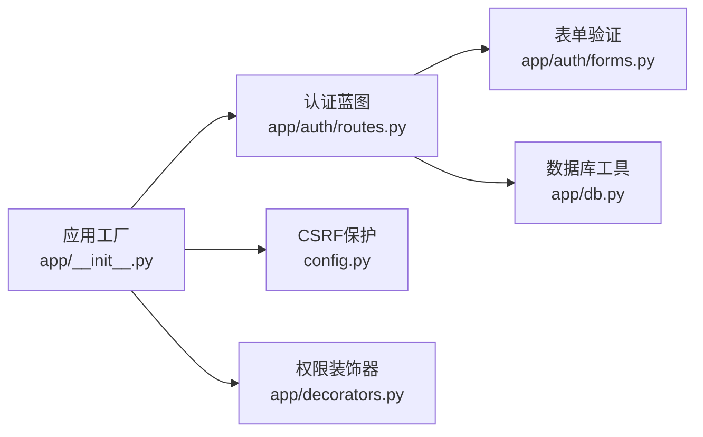

# 用户认证API

<cite>
**本文引用的文件**
- [app.py](file://app.py)
- [app/__init__.py](file://app/__init__.py)
- [app/auth/routes.py](file://app/auth/routes.py)
- [app/auth/forms.py](file://app/auth/forms.py)
- [app/decorators.py](file://app/decorators.py)
- [app/db.py](file://app/db.py)
- [config.py](file://config.py)
- [app/templates/_csrf_field.html](file://app/templates/_csrf_field.html)
- [app/templates/auth/login.html](file://app/templates/auth/login.html)
- [app/templates/auth/register.html](file://app/templates/auth/register.html)
- [app/templates/base.html](file://app/templates/base.html)
- [sql/01_schema.sql](file://sql/01_schema.sql)
- [sql/02_seed.sql](file://sql/02_seed.sql)
- [README.md](file://README.md)
</cite>

## 目录
1. [简介](#简介)
2. [项目结构](#项目结构)
3. [核心组件](#核心组件)
4. [架构总览](#架构总览)
5. [详细组件分析](#详细组件分析)
6. [依赖分析](#依赖分析)
7. [性能考虑](#性能考虑)
8. [故障排除指南](#故障排除指南)
9. [结论](#结论)
10. [附录](#附录)

## 简介
本文件为“用户认证API”的完整技术文档，覆盖登录、注册、登出与个人信息维护等接口的HTTP方法、URL路径、请求参数、响应格式与错误处理策略。同时说明CSRF保护机制、表单验证规则、用户会话管理（登录状态检查、会话超时处理、多设备登录限制）、认证中间件与权限验证机制，并提供认证流程的最佳实践与调用示例。

## 项目结构
- 应用入口负责创建Flask应用实例并运行服务。
- 认证模块通过蓝图提供登录、注册、登出与个人信息维护接口。
- 表单层使用WTForms进行字段与验证规则声明。
- 数据访问层封装数据库连接池与常用查询/写入方法。
- 配置文件集中管理密钥、CSRF开关、数据库连接参数等。
- 模板层提供CSRF隐藏字段与登录/注册页面，页面中嵌入CSRF令牌。

**图表来源**
- [app.py:1-13](file://app.py#L1-L13)
- [app/__init__.py:29-93](file://app/__init__.py#L29-L93)
- [app/auth/routes.py:29-167](file://app/auth/routes.py#L29-L167)
- [app/auth/forms.py:1-37](file://app/auth/forms.py#L1-L37)
- [app/db.py:1-121](file://app/db.py#L1-L121)
- [config.py:1-36](file://config.py#L1-L36)
- [app/templates/_csrf_field.html:1-2](file://app/templates/_csrf_field.html#L1-L2)
- [app/templates/auth/login.html:1-45](file://app/templates/auth/login.html#L1-L45)
- [app/templates/auth/register.html:1-102](file://app/templates/auth/register.html#L1-L102)
- [app/templates/base.html:1-85](file://app/templates/base.html#L1-L85)

**章节来源**
- [app.py:1-13](file://app.py#L1-L13)
- [app/__init__.py:29-93](file://app/__init__.py#L29-L93)
- [README.md:46-69](file://README.md#L46-L69)

## 核心组件
- 应用工厂与CSRF保护：应用工厂初始化Flask实例、CSRF保护、数据库连接池与Flask-Login，并注册各蓝图。
- 认证蓝图：提供登录、注册、登出、个人信息维护等路由。
- 表单验证：使用WTForms定义用户名、密码、角色、性别、专业、班级、电话、邮箱等字段与验证规则。
- 数据访问：统一的数据库连接池与查询/写入工具，支持事务与分页。
- 权限装饰器：基于Flask-Login的登录与角色校验装饰器。
- 模板与CSRF：模板中嵌入CSRF隐藏字段，确保POST请求受CSRF保护。

**章节来源**
- [app/__init__.py:7-51](file://app/__init__.py#L7-L51)
- [app/auth/routes.py:29-167](file://app/auth/routes.py#L29-L167)
- [app/auth/forms.py:6-37](file://app/auth/forms.py#L6-L37)
- [app/db.py:10-90](file://app/db.py#L10-L90)
- [app/decorators.py:7-26](file://app/decorators.py#L7-L26)
- [app/templates/_csrf_field.html:1-2](file://app/templates/_csrf_field.html#L1-L2)

## 架构总览
认证系统采用Flask + Flask-Login + WTForms + PyMySQL + DBUtils连接池的组合。CSRF保护由Flask-WTF启用，会话状态由Flask-Login维护。数据库层通过连接池提升并发性能。

**图表来源**
- [app/__init__.py:29-93](file://app/__init__.py#L29-L93)
- [config.py:6-9](file://config.py#L6-L9)
- [app/auth/routes.py:29-167](file://app/auth/routes.py#L29-L167)
- [app/auth/forms.py:1-37](file://app/auth/forms.py#L1-L37)
- [app/db.py:10-90](file://app/db.py#L10-L90)

## 详细组件分析

### 登录接口
- HTTP方法与URL
  - 方法：GET、POST
  - 路径：/auth/login
- 请求参数
  - GET：无请求体，渲染登录表单。
  - POST：表单字段
    - username：字符串，必填
    - password：字符串，必填
    - csrf_token：隐藏字段，必填（由模板提供）
- 响应
  - 成功：重定向到对应角色的仪表盘（如student.dashboard、teacher.dashboard、admin.dashboard）。
  - 失败：返回登录页并显示错误提示（用户名或密码错误）。
- 表单验证规则
  - 用户名与密码均非空。
- CSRF保护
  - 所有POST请求必须携带CSRF令牌。
- 会话管理
  - 登录成功后，使用Flask-Login记住登录状态。
- 错误处理
  - 用户名或密码错误：提示“用户名或密码错误”。

**图表来源**
- [app/auth/routes.py:32-55](file://app/auth/routes.py#L32-L55)
- [app/auth/forms.py:6-8](file://app/auth/forms.py#L6-L8)
- [app/templates/_csrf_field.html:1-2](file://app/templates/_csrf_field.html#L1-L2)
- [app/templates/auth/login.html:11-29](file://app/templates/auth/login.html#L11-L29)

**章节来源**
- [app/auth/routes.py:32-55](file://app/auth/routes.py#L32-L55)
- [app/auth/forms.py:6-8](file://app/auth/forms.py#L6-L8)
- [app/templates/_csrf_field.html:1-2](file://app/templates/_csrf_field.html#L1-L2)
- [app/templates/auth/login.html:11-29](file://app/templates/auth/login.html#L11-L29)

### 注册接口
- HTTP方法与URL
  - 方法：GET、POST
  - 路径：/auth/register
- 请求参数
  - GET：无请求体，渲染注册表单并加载专业与班级选项。
  - POST：表单字段
    - username：字符串，3-50字符，仅允许字母、数字、下划线，必填
    - password：字符串，6-30字符，必填
    - password2：字符串，需与password一致，必填
    - role：枚举值，student或teacher，必填
    - name：字符串，必填
    - gender：枚举值，M或F，可选
    - major_id：整数，可选（仅学生）
    - class_id：整数，可选（仅学生）
    - phone：字符串，最大长度20，可选
    - email：字符串，最大长度100，可选
    - csrf_token：隐藏字段，必填
- 响应
  - 成功：插入users表并根据角色插入students或teachers表，提示“注册成功，请登录”，重定向到登录页。
  - 失败：返回注册页并显示相应错误提示（用户名已存在、注册失败等）。
- 表单验证规则
  - 用户名长度与字符集校验、密码长度校验、确认密码一致性校验、角色必填、姓名必填、性别可选、专业/班级可选、电话/邮箱长度可选。
- CSRF保护
  - 所有POST请求必须携带CSRF令牌。
- 会话管理
  - 注册成功后不自动登录，需跳转到登录页。
- 错误处理
  - 用户名已存在：提示“用户名已存在”。
  - 学号/工号生成失败：提示“学号生成失败，请稍后重试”。
  - 其他异常：提示“注册失败：...”。

**图表来源**
- [app/auth/routes.py:58-110](file://app/auth/routes.py#L58-L110)
- [app/auth/forms.py:11-37](file://app/auth/forms.py#L11-L37)
- [app/templates/_csrf_field.html:1-2](file://app/templates/_csrf_field.html#L1-L2)
- [app/templates/auth/register.html:9-77](file://app/templates/auth/register.html#L9-L77)

**章节来源**
- [app/auth/routes.py:58-110](file://app/auth/routes.py#L58-L110)
- [app/auth/forms.py:11-37](file://app/auth/forms.py#L11-L37)
- [app/templates/_csrf_field.html:1-2](file://app/templates/_csrf_field.html#L1-L2)
- [app/templates/auth/register.html:9-77](file://app/templates/auth/register.html#L9-L77)

### 登出接口
- HTTP方法与URL
  - 方法：GET
  - 路径：/auth/logout
- 请求参数
  - 无请求体。
- 响应
  - 成功：注销当前用户，提示“已退出登录”，重定向到登录页。
- 权限要求
  - 需要登录（@login_required装饰）。
- 会话管理
  - 使用Flask-Login注销当前会话。

**图表来源**
- [app/auth/routes.py:113-118](file://app/auth/routes.py#L113-L118)

**章节来源**
- [app/auth/routes.py:113-118](file://app/auth/routes.py#L113-L118)

### 个人信息维护接口
- HTTP方法与URL
  - 方法：GET、POST
  - 路径：/auth/profile
- 请求参数
  - GET：无请求体，返回个人信息页。
  - POST：表单字段
    - new_password：字符串，最小长度6，可选
    - phone：字符串，最大长度20，可选
    - email：字符串，最大长度100，可选
    - csrf_token：隐藏字段，必填
- 响应
  - 成功：若提供新密码则更新密码哈希，更新电话与邮箱，提示“密码修改成功/个人信息更新成功”，重定向到个人信息页。
  - 失败：返回个人信息页并显示相应错误提示。
- 权限要求
  - 需要登录（@login_required装饰）。
- 会话管理
  - 仅对已登录用户开放。

**图表来源**
- [app/auth/routes.py:121-167](file://app/auth/routes.py#L121-L167)

**章节来源**
- [app/auth/routes.py:121-167](file://app/auth/routes.py#L121-L167)

### CSRF保护机制
- 配置
  - 在配置中启用WTF_CSRF_ENABLED，应用工厂中初始化CSRFProtect。
- 模板集成
  - 模板中包含CSRF隐藏字段，确保所有POST请求携带令牌。
- 生效范围
  - 对所有蓝图中的POST路由生效，防止跨站请求伪造攻击。

**章节来源**
- [config.py:8](file://config.py#L8)
- [app/__init__.py:33](file://app/__init__.py#L33)
- [app/templates/_csrf_field.html:1-2](file://app/templates/_csrf_field.html#L1-L2)

### 表单验证规则
- 登录表单（LoginForm）
  - username：必填
  - password：必填
- 注册表单（RegisterForm）
  - username：必填，3-50字符，仅字母、数字、下划线
  - password：必填，6-30字符
  - password2：必填，需与password一致
  - role：必填，枚举值student或teacher
  - name：必填
  - gender：可选，枚举值M或F
  - major_id：可选（仅学生）
  - class_id：可选（仅学生）
  - phone：可选，最大长度20
  - email：可选，最大长度100

**章节来源**
- [app/auth/forms.py:6-37](file://app/auth/forms.py#L6-L37)

### 用户会话管理
- 登录状态检查
  - 使用Flask-Login的current_user.is_authenticated判断是否登录。
- 会话超时处理
  - 未在代码中显式设置超时时间，默认由Flask-Login与Cookie策略决定。
- 多设备登录限制
  - 未实现强制单点登录；同一账户可在多设备登录。
- 角色路由保护
  - 通过装饰器@role_required(role)限制访问特定角色的路由。

**章节来源**
- [app/decorators.py:13-25](file://app/decorators.py#L13-L25)
- [app/__init__.py:47-51](file://app/__init__.py#L47-L51)

### 认证中间件与权限验证机制
- 中间件
  - Flask-Login：负责用户加载、登录状态维护与未登录重定向。
  - CSRFProtect：全局启用CSRF保护。
- 权限验证
  - @login_required：要求登录。
  - @role_required(role)：要求指定角色，否则返回403。
- 登录视图
  - 未登录访问受保护路由时，重定向到登录页。

**章节来源**
- [app/__init__.py:40-51](file://app/__init__.py#L40-L51)
- [app/decorators.py:7-25](file://app/decorators.py#L7-L25)

### 数据模型与数据库交互
- 用户表（users）
  - 字段：id、username、password_hash、role、is_active、last_login、created_at、updated_at。
  - 索引：唯一索引uk_username，索引idx_role。
- 学生表（students）
  - 字段：user_id、student_no、name、gender、major_id、class_id、enrollment_year、phone、email、status。
  - 唯一索引：uk_student_no、uk_student_user。
- 教师权限
  - 通过role字段区分角色，登录后根据role重定向到对应仪表盘。

**章节来源**
- [sql/01_schema.sql:15-26](file://sql/01_schema.sql#L15-L26)
- [sql/01_schema.sql:55-77](file://sql/01_schema.sql#L55-L77)
- [sql/01_schema.sql:82-95](file://sql/01_schema.sql#L82-L95)
- [sql/02_seed.sql:8-9](file://sql/02_seed.sql#L8-L9)

## 依赖分析
- 组件耦合
  - 认证蓝图依赖表单验证与数据库工具。
  - 应用工厂统一初始化CSRF、Flask-Login与蓝图注册。
- 外部依赖
  - Flask、Flask-Login、Flask-WTF、PyMySQL、DBUtils。
- 可能的循环依赖
  - 当前结构清晰，未发现循环导入。

**图表来源**
- [app/__init__.py:29-93](file://app/__init__.py#L29-L93)
- [app/auth/routes.py:29-167](file://app/auth/routes.py#L29-L167)
- [app/auth/forms.py:1-37](file://app/auth/forms.py#L1-L37)
- [app/db.py:1-121](file://app/db.py#L1-L121)
- [app/decorators.py:1-26](file://app/decorators.py#L1-L26)
- [config.py:1-36](file://config.py#L1-L36)

**章节来源**
- [app/__init__.py:29-93](file://app/__init__.py#L29-L93)
- [app/auth/routes.py:29-167](file://app/auth/routes.py#L29-L167)
- [app/auth/forms.py:1-37](file://app/auth/forms.py#L1-L37)
- [app/db.py:1-121](file://app/db.py#L1-L121)
- [app/decorators.py:1-26](file://app/decorators.py#L1-L26)
- [config.py:1-36](file://config.py#L1-L36)

## 性能考虑
- 数据库连接池
  - 使用DBUtils连接池减少连接开销，提高并发性能。
- 查询优化
  - users表建立唯一索引与角色索引，加速登录与角色查询。
- CSRF与会话
  - CSRF令牌与Flask-Login会话管理开销较小，建议在生产环境开启调试模式以外的配置。

**章节来源**
- [app/db.py:10-41](file://app/db.py#L10-L41)
- [sql/01_schema.sql:24](file://sql/01_schema.sql#L24)
- [sql/01_schema.sql:25](file://sql/01_schema.sql#L25)

## 故障排除指南
- 用户名或密码错误
  - 现象：登录失败并提示“用户名或密码错误”。
  - 排查：确认用户名存在且is_active为真；核对密码哈希匹配。
- 用户名已存在
  - 现象：注册时报“用户名已存在”。
  - 排查：检查users表唯一索引uk_username。
- 注册失败
  - 现象：注册时报“注册失败：...”。
  - 排查：检查数据库连接、事务提交、字段长度与类型。
- CSRF校验失败
  - 现象：POST请求被拒绝。
  - 排查：确认表单包含CSRF隐藏字段且未过期。
- 未登录访问受保护路由
  - 现象：重定向到登录页。
  - 排查：确保已登录或添加@role_required装饰器。
- 403权限不足
  - 现象：返回403页面。
  - 排查：确认当前用户角色满足@role_required要求。

**章节来源**
- [app/auth/routes.py:32-55](file://app/auth/routes.py#L32-L55)
- [app/auth/routes.py:58-110](file://app/auth/routes.py#L58-L110)
- [app/__init__.py:77-90](file://app/__init__.py#L77-L90)
- [app/decorators.py:18-23](file://app/decorators.py#L18-L23)

## 结论
本认证API以Flask-Login与Flask-WTF为核心，结合CSRF保护与数据库连接池，提供了安全、稳定的登录、注册、登出与个人信息维护能力。通过明确的表单验证规则与权限装饰器，系统实现了良好的用户体验与安全性。建议在生产环境中进一步完善会话超时策略与单点登录控制，并持续监控数据库性能与CSRF防护有效性。

## 附录

### API调用示例（最佳实践）
- 登录
  - 步骤：访问GET /auth/login获取表单；提交POST /auth/login携带username、password与csrf_token；登录成功后自动重定向至角色仪表盘。
  - 注意：确保表单包含CSRF隐藏字段。
- 注册
  - 步骤：访问GET /auth/register获取表单；提交POST /auth/register携带注册信息与csrf_token；注册成功后重定向至登录页。
  - 注意：角色为student时可选填写专业与班级；密码长度至少6位。
- 登出
  - 步骤：访问GET /auth/logout注销当前会话并返回登录页。
- 个人信息维护
  - 步骤：访问GET /auth/profile查看；提交POST /auth/profile更新密码与联系方式；提交后刷新页面并显示成功提示。

**章节来源**
- [app/auth/routes.py:32-55](file://app/auth/routes.py#L32-L55)
- [app/auth/routes.py:58-110](file://app/auth/routes.py#L58-L110)
- [app/auth/routes.py:113-118](file://app/auth/routes.py#L113-L118)
- [app/auth/routes.py:121-167](file://app/auth/routes.py#L121-L167)
- [app/templates/_csrf_field.html:1-2](file://app/templates/_csrf_field.html#L1-L2)