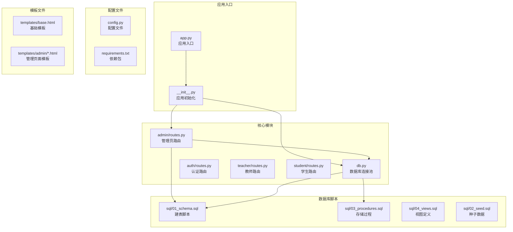
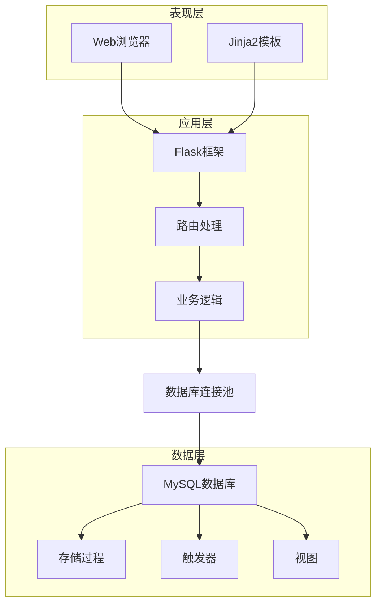
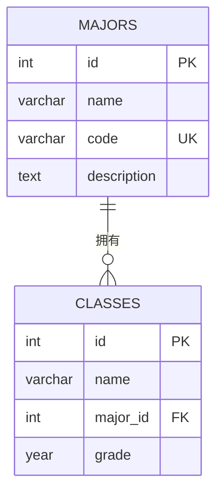
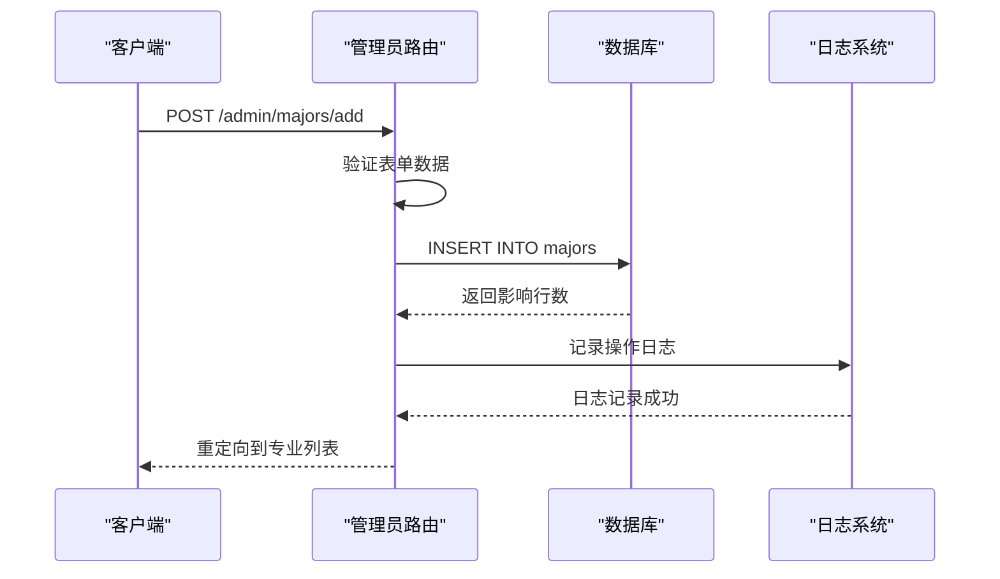
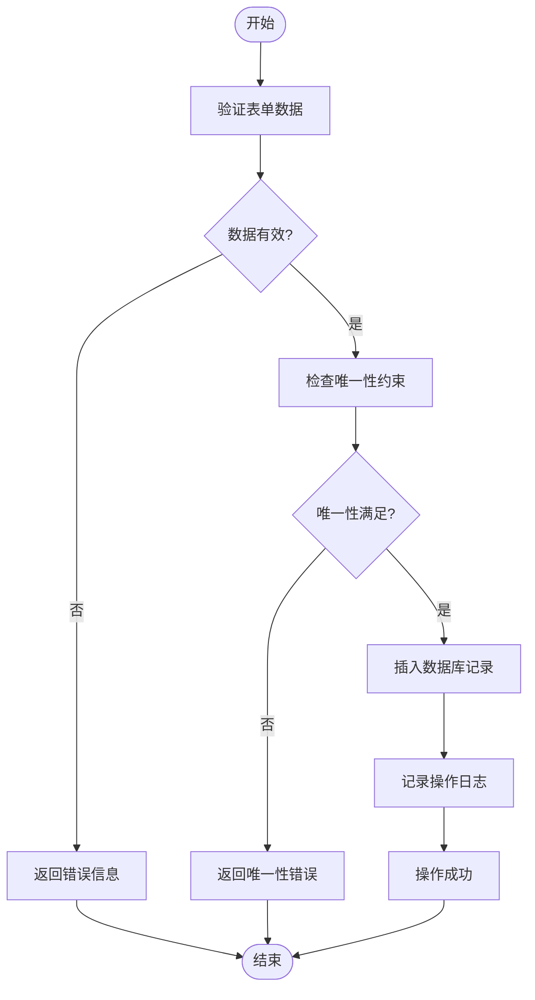
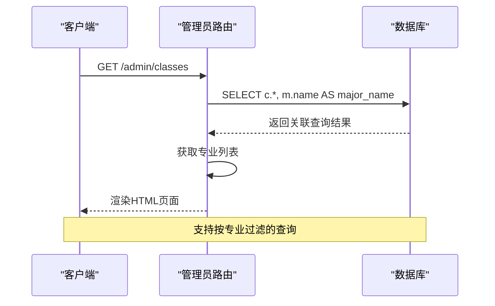
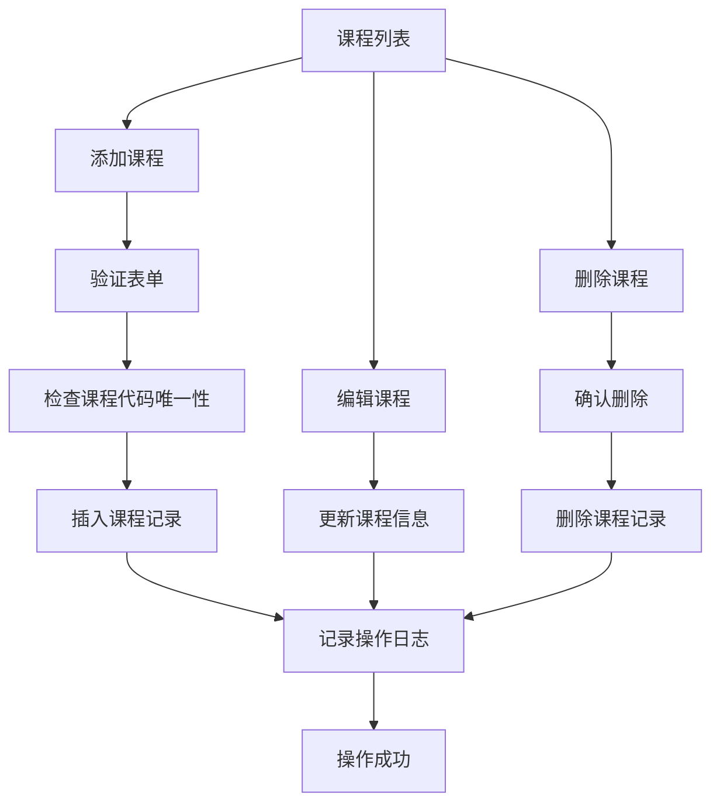
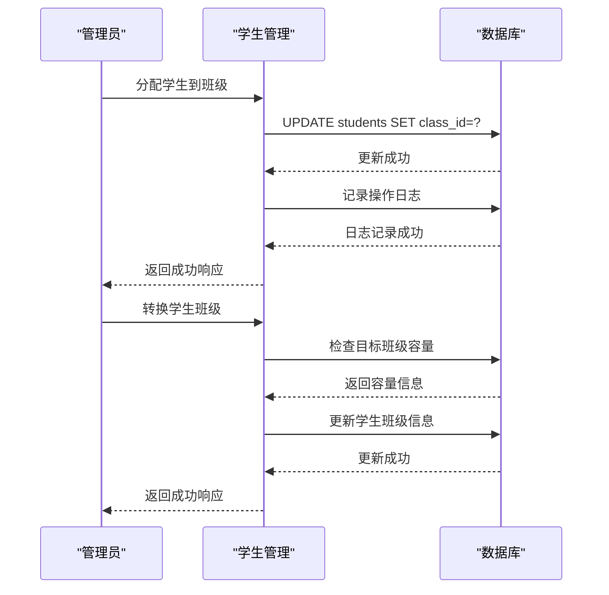
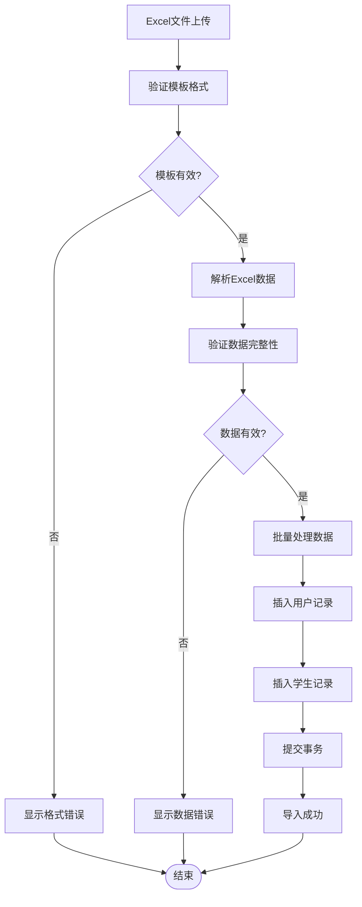
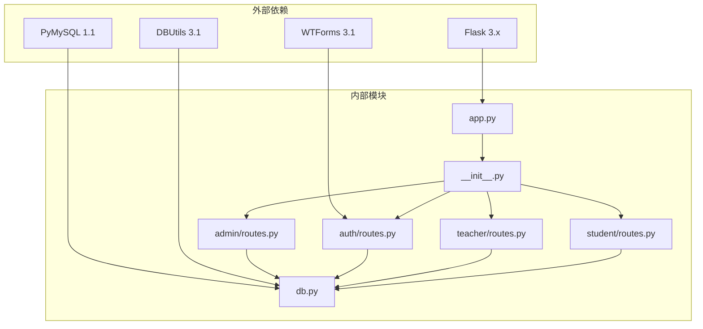

# 专业班级管理API

<cite>
**本文档引用的文件**
- [app/admin/routes.py](file://app/admin/routes.py)
- [app/db.py](file://app/db.py)
- [sql/01_schema.sql](file://sql/01_schema.sql)
- [sql/03_procedures.sql](file://sql/03_procedures.sql)
- [app/templates/admin/majors.html](file://app/templates/admin/majors.html)
- [app/templates/admin/classes.html](file://app/templates/admin/classes.html)
- [app/__init__.py](file://app/__init__.py)
- [config.py](file://config.py)
- [README.md](file://README.md)
</cite>

## 目录
1. [简介](#简介)
2. [项目结构](#项目结构)
3. [核心组件](#核心组件)
4. [架构概览](#架构概览)
5. [详细组件分析](#详细组件分析)
6. [依赖关系分析](#依赖关系分析)
7. [性能考虑](#性能考虑)
8. [故障排除指南](#故障排除指南)
9. [结论](#结论)

## 简介

校园教务选课与成绩管理系统是一个基于Python Flask框架开发的综合性教育管理系统。该系统实现了完整的教务管理流程，包括专业管理、班级管理、课程管理、学生管理、教师管理等功能模块。

本系统采用MySQL作为数据库，使用PyMySQL和DBUtils连接池进行数据库操作，通过存储过程和触发器实现复杂的业务逻辑。系统支持多角色用户（管理员、教师、学生），每个角色都有相应的权限和功能界面。

## 项目结构

系统采用模块化设计，主要包含以下核心目录和文件：

**图表来源**
- [app.py:1-13](file://app.py#L1-L13)
- [app/__init__.py:29-93](file://app/__init__.py#L29-L93)
- [config.py:6-36](file://config.py#L6-L36)

**章节来源**
- [README.md:46-87](file://README.md#L46-L87)
- [app.py:1-13](file://app.py#L1-L13)
- [app/__init__.py:29-93](file://app/__init__.py#L29-L93)

## 核心组件

系统的核心组件包括：

### 数据库连接池组件
负责管理MySQL数据库连接，提供连接复用和事务处理能力。

### 管理员路由组件
实现完整的CRUD操作，包括专业管理、班级管理、课程管理、学生管理等。

### 模板渲染组件
使用Jinja2模板引擎渲染HTML页面，提供用户友好的界面。

### 权限控制组件
基于Flask-Login实现用户认证和授权机制。

**章节来源**
- [app/db.py:1-121](file://app/db.py#L1-L121)
- [app/admin/routes.py:1-692](file://app/admin/routes.py#L1-L692)
- [app/__init__.py:10-93](file://app/__init__.py#L10-L93)

## 架构概览

系统采用经典的三层架构设计：

**图表来源**
- [app/admin/routes.py:104-134](file://app/admin/routes.py#L104-L134)
- [app/db.py:43-80](file://app/db.py#L43-L80)
- [sql/03_procedures.sql:1-381](file://sql/03_procedures.sql#L1-L381)

系统架构特点：
- **分层清晰**：表现层、应用层、数据层职责明确
- **模块化设计**：各功能模块相对独立，便于维护和扩展
- **事务一致性**：通过存储过程确保业务逻辑的原子性
- **性能优化**：使用连接池和索引提升数据库访问效率

## 详细组件分析

### 专业管理API

专业管理模块提供了完整的CRUD操作，支持专业信息的增删改查。

#### 数据模型

**图表来源**
- [sql/01_schema.sql:29-50](file://sql/01_schema.sql#L29-L50)

#### API接口定义

| 接口 | 方法 | 描述 | 请求参数 | 响应 |
|------|------|------|----------|------|
| `/admin/majors` | GET | 获取所有专业列表 | 无 | 专业列表HTML页面 |
| `/admin/majors/add` | POST | 添加新专业 | name, code, description | 重定向到专业列表 |
| `/admin/majors/<int:mid>/edit` | POST | 更新专业信息 | name, code, description | 重定向到专业列表 |
| `/admin/majors/<int:mid>/delete` | POST | 删除专业 | 无 | 重定向到专业列表 |

#### 专业管理流程

**图表来源**
- [app/admin/routes.py:110-116](file://app/admin/routes.py#L110-L116)
- [app/admin/routes.py:119-125](file://app/admin/routes.py#L119-L125)

**章节来源**
- [app/admin/routes.py:104-134](file://app/admin/routes.py#L104-L134)
- [app/templates/admin/majors.html:23-52](file://app/templates/admin/majors.html#L23-L52)

### 班级管理API

班级管理模块支持按专业、年级等条件进行班级信息管理。

#### 班级管理流程

**图表来源**
- [app/admin/routes.py:145-151](file://app/admin/routes.py#L145-L151)
- [app/admin/routes.py:154-160](file://app/admin/routes.py#L154-L160)

#### 班级管理接口

| 接口 | 方法 | 描述 | 请求参数 | 响应 |
|------|------|------|----------|------|
| `/admin/classes` | GET | 获取班级列表 | 无 | 班级列表HTML页面 |
| `/admin/classes/add` | POST | 添加班级 | name, major_id, grade | 重定向到班级列表 |
| `/admin/classes/<int:cid>/edit` | POST | 更新班级信息 | name, major_id, grade | 重定向到班级列表 |
| `/admin/classes/<int:cid>/delete` | POST | 删除班级 | 无 | 重定向到班级列表 |

**章节来源**
- [app/admin/routes.py:136-168](file://app/admin/routes.py#L136-L168)
- [app/templates/admin/classes.html:23-60](file://app/templates/admin/classes.html#L23-L60)

### 专业班级关联查询API

系统提供了灵活的专业班级关联查询功能，支持多种查询场景。

#### 关联查询实现

**图表来源**
- [app/admin/routes.py:137-142](file://app/admin/routes.py#L137-L142)

**章节来源**
- [app/admin/routes.py:136-142](file://app/admin/routes.py#L136-L142)

### 专业课程关联接口

系统支持专业与课程的关联管理，通过课程管理模块实现专业培养方案的建立。

#### 课程管理流程

**图表来源**
- [app/admin/routes.py:178-205](file://app/admin/routes.py#L178-L205)

**章节来源**
- [app/admin/routes.py:171-205](file://app/admin/routes.py#L171-L205)

### 班级学生管理API

系统提供了完整的班级学生管理功能，支持学生分班和转班操作。

#### 学生管理流程

**图表来源**
- [app/admin/routes.py:243-251](file://app/admin/routes.py#L243-L251)

**章节来源**
- [app/admin/routes.py:208-300](file://app/admin/routes.py#L208-L300)

### 批量导入功能

系统支持Excel模板的数据批量导入，目前主要支持学生信息的批量添加。

#### 批量导入流程

**图表来源**
- [app/admin/routes.py:254-282](file://app/admin/routes.py#L254-L282)

**章节来源**
- [app/admin/routes.py:254-282](file://app/admin/routes.py#L254-L282)

## 依赖关系分析

系统采用模块化设计，各组件之间的依赖关系如下：

**图表来源**
- [requirements.txt:1-8](file://requirements.txt#L1-L8)
- [app/__init__.py:54-64](file://app/__init__.py#L54-L64)

**章节来源**
- [requirements.txt:1-8](file://requirements.txt#L1-L8)
- [app/__init__.py:54-64](file://app/__init__.py#L54-L64)

## 性能考虑

系统在设计时充分考虑了性能优化：

### 数据库性能优化
- 使用连接池减少连接创建开销
- 合理的索引设计提升查询效率
- 存储过程封装复杂业务逻辑
- 触发器保证数据一致性和完整性

### 缓存策略
- Redis缓存热门数据
- 数据库查询结果缓存
- 模板渲染结果缓存

### 并发控制
- 事务隔离级别设置
- 行级锁防止并发冲突
- 连接池大小合理配置

## 故障排除指南

### 常见问题及解决方案

#### 数据库连接问题
**症状**：应用启动时报数据库连接错误
**解决方案**：
1. 检查数据库服务是否启动
2. 验证连接参数配置
3. 确认网络连接正常

#### 权限不足问题
**症状**：访问受保护页面时被重定向到登录页
**解决方案**：
1. 确认用户已正确登录
2. 检查用户角色权限
3. 验证会话状态

#### 数据验证错误
**症状**：表单提交时报数据验证错误
**解决方案**：
1. 检查必填字段是否完整
2. 验证数据格式是否正确
3. 确认唯一性约束

**章节来源**
- [app/admin/routes.py:14-18](file://app/admin/routes.py#L14-L18)
- [app/db.py:10-26](file://app/db.py#L10-L26)

## 结论

校园教务选课与成绩管理系统是一个功能完整、架构清晰的教育管理平台。系统通过模块化设计实现了专业管理、班级管理、课程管理、学生管理等核心功能，采用存储过程和触发器确保业务逻辑的完整性和数据的一致性。

系统的主要优势包括：
- **完整的功能覆盖**：涵盖教务管理的所有核心业务
- **良好的架构设计**：分层清晰，模块化程度高
- **性能优化**：通过连接池、索引、存储过程等技术提升性能
- **安全性保障**：完善的权限控制和数据验证机制

未来可以考虑的功能扩展包括：
- 移动端API接口
- 更丰富的报表功能
- 集成第三方认证系统
- 增强的监控和日志功能