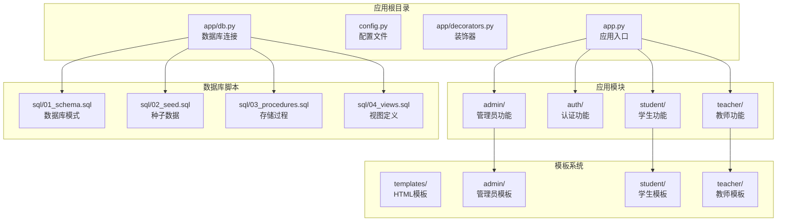
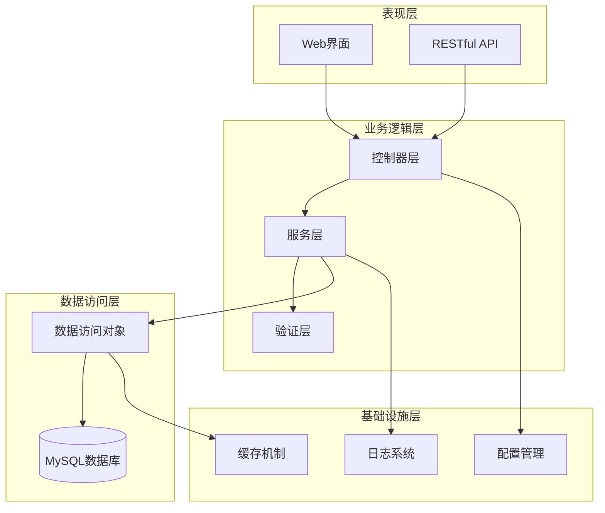
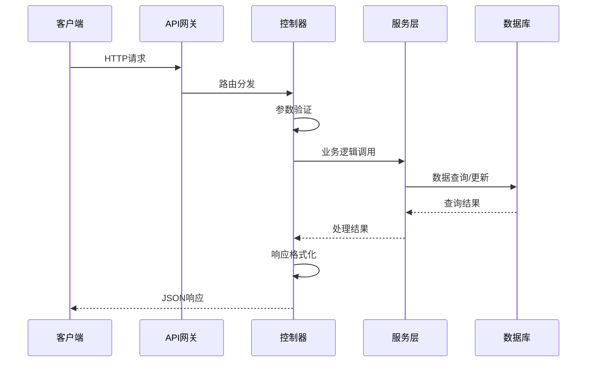
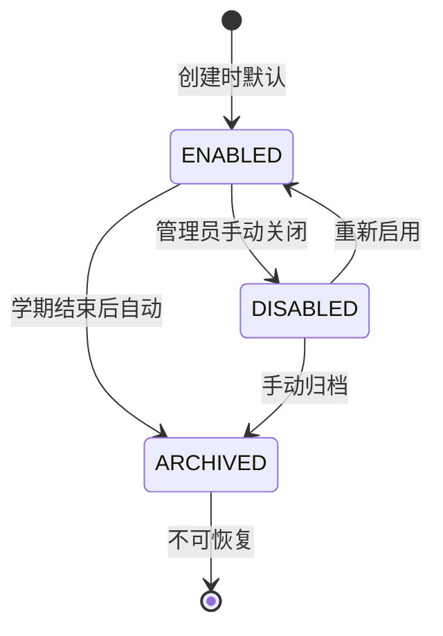
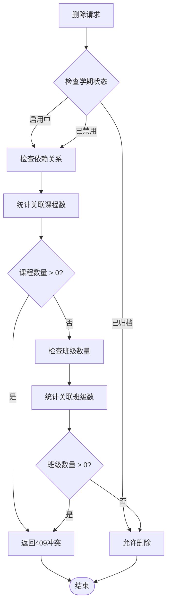
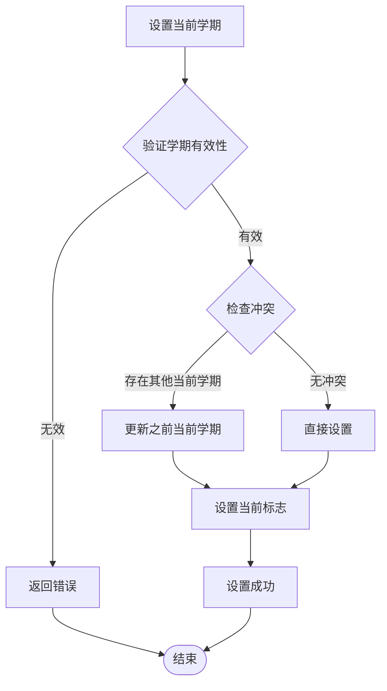
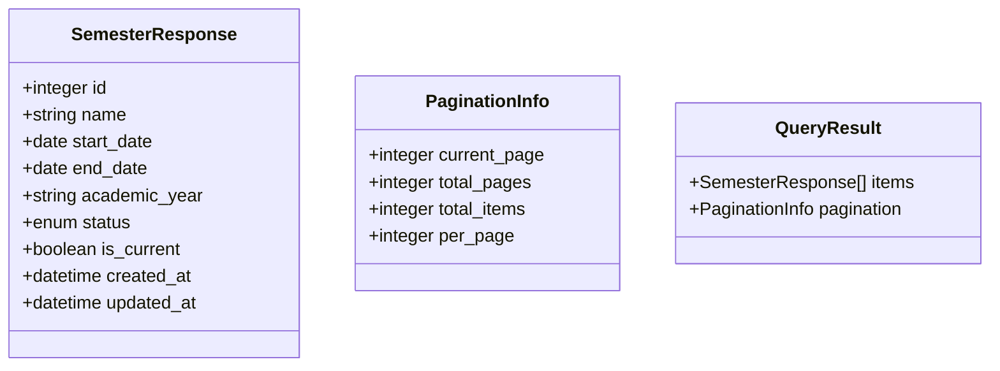
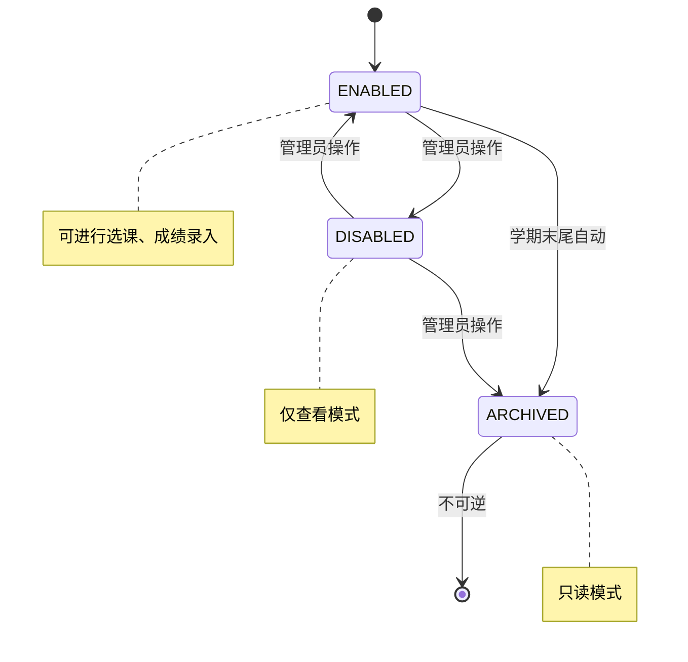
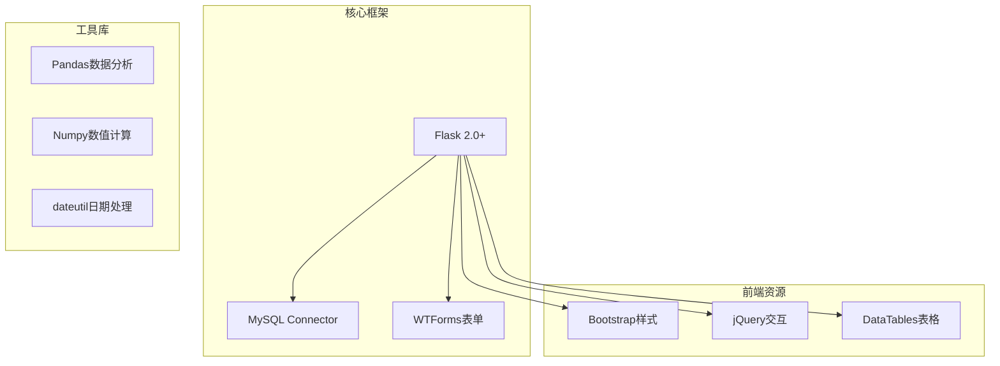
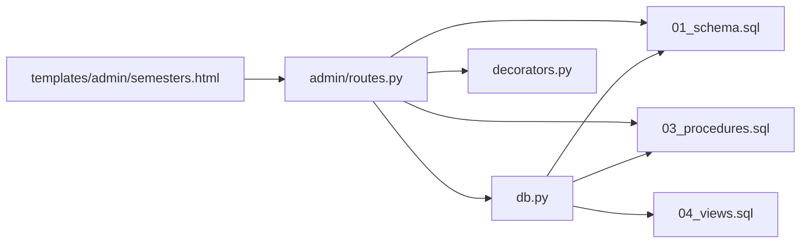

# 学期管理API

<cite>
**本文档引用的文件**
- [app.py](file://app.py)
- [app/admin/routes.py](file://app/admin/routes.py)
- [app/db.py](file://app/db.py)
- [sql/01_schema.sql](file://sql/01_schema.sql)
- [sql/02_seed.sql](file://sql/02_seed.sql)
- [sql/03_procedures.sql](file://sql/03_procedures.sql)
- [sql/04_views.sql](file://sql/04_views.sql)
- [app/templates/admin/semesters.html](file://app/templates/admin/semesters.html)
</cite>

## 目录
1. [简介](#简介)
2. [项目结构](#项目结构)
3. [核心组件](#核心组件)
4. [架构概览](#架构概览)
5. [详细组件分析](#详细组件分析)
6. [依赖关系分析](#依赖关系分析)
7. [性能考虑](#性能考虑)
8. [故障排除指南](#故障排除指南)
9. [结论](#结论)

## 简介

本文件为学期管理API的详细技术文档，涵盖学期管理系统的完整功能接口设计与实现细节。该系统基于Flask框架构建，采用MySQL数据库存储，提供完整的学期生命周期管理能力，包括学期创建、更新、删除、查询以及状态管理等核心功能。

系统采用分层架构设计，包含Web界面层、路由处理层、数据访问层和数据库层。所有API接口均通过HTTP协议提供RESTful风格的服务，支持JSON格式的数据交换。

## 项目结构

项目采用典型的Flask应用结构，主要目录组织如下：



**图表来源**
- [app.py](file://app.py)
- [app/admin/routes.py](file://app/admin/routes.py)
- [sql/01_schema.sql](file://sql/01_schema.sql)

**章节来源**
- [app.py](file://app.py)
- [app/admin/routes.py](file://app/admin/routes.py)

## 核心组件

### 数据模型设计

系统采用关系型数据库设计，核心实体包括学期、课程、班级等。学期作为核心业务实体，具有以下关键属性：

- **学期标识**：唯一标识符，自增主键
- **学期名称**：如"2023-2024学年春季学期"
- **开始日期**：学期正式开始的日期
- **结束日期**：学期正式结束的日期
- **学年标识**：标识所属的学年周期
- **状态字段**：控制学期的启用、禁用、归档状态
- **创建时间**：记录创建时间
- **更新时间**：记录最后修改时间

### 数据库架构

```mermaid
erDiagram
SEMESTER {
int id PK
string name
date start_date
date end_date
string academic_year
enum status
timestamp created_at
timestamp updated_at
}
COURSE {
int id PK
string course_code
string course_name
int semester_id FK
int credits
int capacity
timestamp created_at
}
CLASS {
int id PK
string class_code
int course_id FK
int semester_id FK
string schedule_info
int enrolled_count
timestamp created_at
}
SEMESTER ||--o{ COURSE : contains
COURSE ||--o{ CLASS : offers
SEMESTER ||--o{ CLASS : schedules
```

**图表来源**
- [sql/01_schema.sql](file://sql/01_schema.sql)

### 路由架构

系统采用模块化路由设计，管理员模块专门负责学期管理相关的API接口：

- **路由前缀**：/admin/api/semesters
- **认证要求**：需要管理员权限
- **数据格式**：JSON
- **响应格式**：统一的API响应结构

**章节来源**
- [app/admin/routes.py](file://app/admin/routes.py)
- [sql/01_schema.sql](file://sql/01_schema.sql)

## 架构概览

系统采用经典的三层架构模式，确保关注点分离和代码可维护性：



**图表来源**
- [app.py](file://app.py)
- [app/admin/routes.py](file://app/admin/routes.py)
- [app/db.py](file://app/db.py)

### 控制流分析



**图表来源**
- [app/admin/routes.py](file://app/admin/routes.py)
- [app/db.py](file://app/db.py)

## 详细组件分析

### 学期创建接口

#### 接口定义
- **URL**：POST /admin/api/semesters
- **认证**：管理员身份验证
- **请求头**：Content-Type: application/json
- **请求体**：包含学期基本信息的JSON对象

#### 请求参数规范

| 参数名 | 类型 | 必填 | 描述 | 验证规则 |
|--------|------|------|------|----------|
| name | string | 是 | 学期名称 | 长度1-100字符，唯一性验证 |
| start_date | date | 是 | 开始日期 | 不能早于当前日期 |
| end_date | date | 是 | 结束日期 | 必须晚于开始日期 |
| academic_year | string | 是 | 学年标识 | 格式YYYY-YYYY，唯一性 |
| status | enum | 否 | 学期状态 | 默认启用 |

#### 成功响应
- **状态码**：201 Created
- **响应体**：包含新创建学期的完整信息

#### 错误处理
- **400 Bad Request**：参数验证失败
- **401 Unauthorized**：未授权访问
- **409 Conflict**：学期名称或学年重复
- **500 Internal Server Error**：服务器内部错误

**章节来源**
- [app/admin/routes.py](file://app/admin/routes.py)
- [sql/01_schema.sql](file://sql/01_schema.sql)

### 学期更新接口

#### 接口定义
- **URL**：PUT /admin/api/semesters/{semester_id}
- **认证**：管理员身份验证
- **路径参数**：semester_id - 学期唯一标识

#### 支持的更新字段

| 字段名 | 类型 | 描述 | 更新规则 |
|--------|------|------|----------|
| name | string | 学期名称 | 唯一性验证 |
| start_date | date | 开始日期 | 不能早于当前日期 |
| end_date | date | 结束日期 | 必须晚于开始日期 |
| academic_year | string | 学年标识 | 唯一性验证 |
| status | enum | 学期状态 | 受业务规则约束 |

#### 状态变更规则



**图表来源**
- [sql/03_procedures.sql](file://sql/03_procedures.sql)

**章节来源**
- [app/admin/routes.py](file://app/admin/routes.py)
- [sql/03_procedures.sql](file://sql/03_procedures.sql)

### 学期删除接口

#### 接口定义
- **URL**：DELETE /admin/api/semesters/{semester_id}
- **认证**：管理员身份验证

#### 删除安全检查机制

系统实施多层次的安全检查以防止误删正在使用的学期：



**图表来源**
- [app/admin/routes.py](file://app/admin/routes.py)

#### 删除保护机制

| 检查类型 | 检查内容 | 防护效果 |
|----------|----------|----------|
| 状态检查 | 归档状态的学期可直接删除 | 防止误删活跃学期 |
| 课程检查 | 关联的课程记录 | 防止破坏教学计划 |
| 班级检查 | 关联的班级记录 | 保护学生选课数据 |
| 选课检查 | 关联的选课记录 | 维护成绩数据完整性 |

**章节来源**
- [app/admin/routes.py](file://app/admin/routes.py)

### 当前学期设置接口

#### 接口定义
- **URL**：PATCH /admin/api/semesters/current
- **认证**：管理员身份验证

#### 业务规则



**图表来源**
- [app/admin/routes.py](file://app/admin/routes.py)

#### 影响范围

当前学期设置会影响以下系统功能：

- **选课系统**：仅开放当前学期的选课
- **成绩录入**：只允许录入当前学期的成绩
- **统计报表**：默认统计当前学期数据
- **排课系统**：优先考虑当前学期的课程安排

**章节来源**
- [app/admin/routes.py](file://app/admin/routes.py)

### 学期查询接口

#### 接口定义
- **URL**：GET /admin/api/semesters
- **认证**：管理员身份验证

#### 查询参数

| 参数名 | 类型 | 描述 | 默认值 |
|--------|------|------|---------|
| page | integer | 页码 | 1 |
| per_page | integer | 每页数量 | 10 |
| status | string | 状态过滤 | 全部 |
| academic_year | string | 学年过滤 | 全部 |
| sort_by | string | 排序字段 | created_at |
| order | string | 排序顺序 | desc |

#### 返回数据结构



**图表来源**
- [app/admin/routes.py](file://app/admin/routes.py)

**章节来源**
- [app/admin/routes.py](file://app/admin/routes.py)

### 学期状态管理接口

#### 接口定义
- **URL**：PATCH /admin/api/semesters/{semester_id}/status
- **认证**：管理员身份验证

#### 支持的状态操作

| 操作类型 | 目标状态 | 业务含义 | 触发条件 |
|----------|----------|----------|----------|
| enable | ENABLED | 启用学期 | 学期在进行中或即将开始 |
| disable | DISABLED | 禁用学期 | 学期暂停但未结束 |
| archive | ARCHIVED | 归档学期 | 学期已结束且无活动记录 |

#### 状态转换约束



**图表来源**
- [sql/03_procedures.sql](file://sql/03_procedures.sql)

**章节来源**
- [app/admin/routes.py](file://app/admin/routes.py)
- [sql/03_procedures.sql](file://sql/03_procedures.sql)

## 依赖关系分析

### 外部依赖

系统依赖的关键外部组件：



**图表来源**
- [requirements.txt](file://requirements.txt)

### 内部模块依赖



**图表来源**
- [app/admin/routes.py](file://app/admin/routes.py)
- [app/db.py](file://app/db.py)

**章节来源**
- [app/admin/routes.py](file://app/admin/routes.py)
- [app/db.py](file://app/db.py)

## 性能考虑

### 数据库优化策略

1. **索引优化**
   - 在状态字段上建立索引以加速状态查询
   - 在学年标识上建立复合索引支持多字段查询
   - 在创建时间上建立索引优化排序性能

2. **查询优化**
   - 使用分页查询避免大量数据传输
   - 实施适当的连接策略减少查询复杂度
   - 缓存常用查询结果减少数据库压力

3. **事务管理**
   - 合理使用事务保证数据一致性
   - 避免长时间持有数据库连接
   - 实施超时机制防止死锁

### 缓存策略

- **查询结果缓存**：对频繁访问的学期列表实施缓存
- **配置信息缓存**：缓存系统配置减少数据库查询
- **会话数据缓存**：使用Redis缓存用户会话信息

## 故障排除指南

### 常见错误及解决方案

| 错误类型 | 错误代码 | 可能原因 | 解决方案 |
|----------|----------|----------|----------|
| 参数验证错误 | 400 | 请求参数格式不正确 | 检查JSON格式和必填字段 |
| 权限不足 | 401 | 未登录或权限不够 | 确认管理员身份验证 |
| 资源冲突 | 409 | 学期名称或学年重复 | 修改为唯一的学期标识 |
| 业务规则违反 | 422 | 违反业务约束条件 | 检查学期状态和时间关系 |
| 服务器错误 | 500 | 数据库连接失败 | 检查数据库服务状态 |

### 调试建议

1. **启用详细日志**：在开发环境中启用SQL查询日志
2. **监控数据库连接**：定期检查数据库连接池状态
3. **性能监控**：监控慢查询和高延迟操作
4. **错误追踪**：使用异常追踪工具定位问题根源

**章节来源**
- [app/admin/routes.py](file://app/admin/routes.py)
- [app/db.py](file://app/db.py)

## 结论

学期管理API提供了完整的学期生命周期管理能力，具有以下特点：

1. **完整的业务覆盖**：从创建到归档的全生命周期管理
2. **严格的数据完整性**：多重验证和约束确保数据一致性
3. **灵活的查询能力**：支持多种筛选和排序条件
4. **完善的安全机制**：防止误删和越权操作
5. **良好的扩展性**：模块化设计便于功能扩展

系统通过合理的架构设计和严格的业务规则，为教育管理系统提供了可靠的学期管理基础。建议在生产环境中配合完善的监控和备份机制，确保系统的稳定运行。