# 开课管理API

<cite>
**本文档引用的文件**
- [app.py](file://app.py)
- [config.py](file://config.py)
- [app/db.py](file://app/db.py)
- [app/decorators.py](file://app/decorators.py)
- [app/admin/routes.py](file://app/admin/routes.py)
- [app/teacher/routes.py](file://app/teacher/routes.py)
- [app/student/routes.py](file://app/student/routes.py)
- [app/helpers.py](file://app/helpers.py)
- [sql/01_schema.sql](file://sql/01_schema.sql)
- [sql/02_seed.sql](file://sql/02_seed.sql)
- [sql/03_procedures.sql](file://sql/03_procedures.sql)
- [sql/04_views.sql](file://sql/04_views.sql)
- [app/templates/admin/offerings.html](file://app/templates/admin/offerings.html)
- [app/templates/teacher/my_offerings.html](file://app/templates/teacher/my_offerings.html)
- [app/templates/teacher/apply_offering.html](file://app/templates/teacher/apply_offering.html)
</cite>

## 目录
1. [简介](#简介)
2. [项目结构](#项目结构)
3. [核心组件](#核心组件)
4. [架构概览](#架构概览)
5. [详细组件分析](#详细组件分析)
6. [依赖关系分析](#依赖关系分析)
7. [性能考虑](#性能考虑)
8. [故障排除指南](#故障排除指南)
9. [结论](#结论)
10. [附录](#附录)

## 简介

开课管理API是MIS（管理信息系统）中的核心模块，负责处理大学课程开设的完整生命周期管理。该系统实现了从教师开课申请、管理员审核、教室分配到课程执行的全流程管理。

本系统采用Flask框架构建，使用SQLite作为数据库存储，通过RESTful API提供服务。系统支持多角色用户：教师、学生、管理员，每个角色都有特定的功能权限和数据访问范围。

## 项目结构

项目采用典型的Flask应用结构，按照功能模块组织代码：

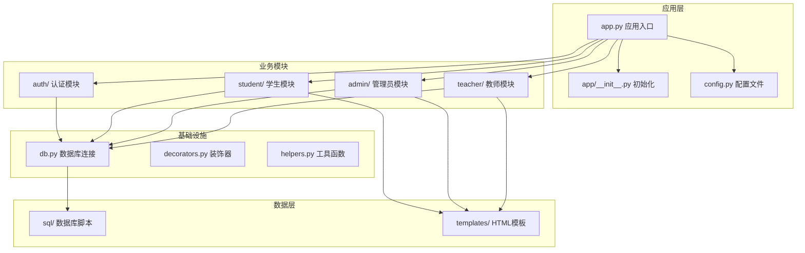

**图表来源**
- [app.py:1-50](file://app.py#L1-L50)
- [app/__init__.py:1-50](file://app/__init__.py#L1-L50)
- [config.py:1-50](file://config.py#L1-L50)

**章节来源**
- [app.py:1-100](file://app.py#L1-L100)
- [app/__init__.py:1-100](file://app/__init__.py#L1-L100)
- [config.py:1-100](file://config.py#L1-L100)

## 核心组件

### 数据模型架构

系统基于以下核心实体构建：

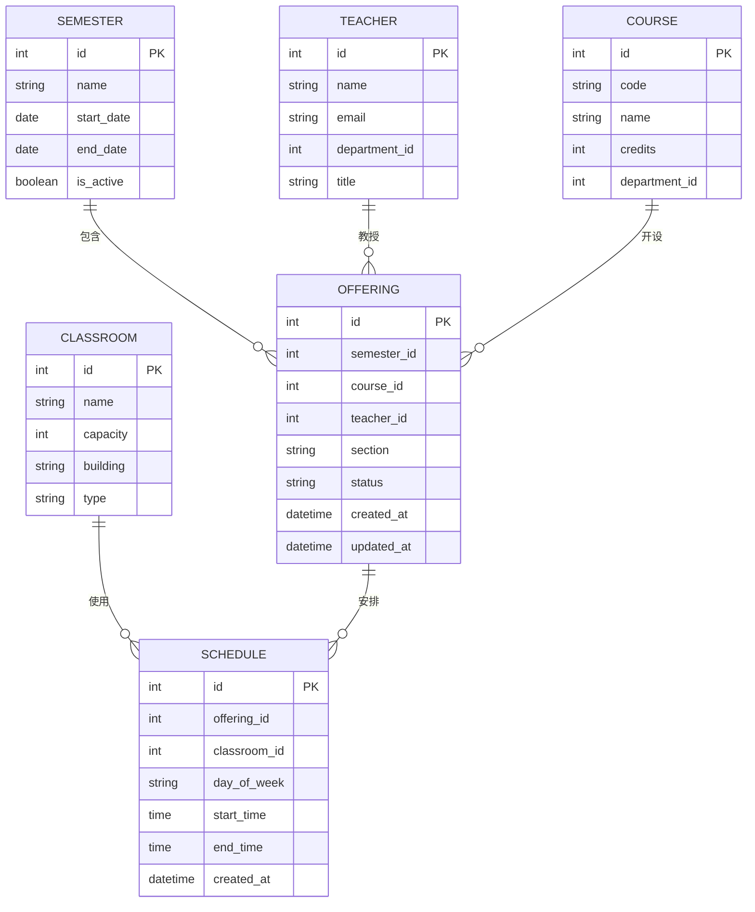

**图表来源**
- [sql/01_schema.sql:1-200](file://sql/01_schema.sql#L1-L200)

### API端点设计

系统提供以下主要API端点：

| 模块 | 方法 | 端点 | 描述 |
|------|------|------|------|
| 教师 | GET | `/teacher/offerings` | 获取教师所有开课申请 |
| 教师 | POST | `/teacher/offerings` | 创建新的开课申请 |
| 教师 | PUT | `/teacher/offerings/<id>` | 更新开课申请 |
| 教师 | DELETE | `/teacher/offerings/<id>` | 取消开课申请 |
| 管理员 | GET | `/admin/offerings` | 获取所有开课申请 |
| 管理员 | PUT | `/admin/offerings/<id>/approve` | 审批开课申请 |
| 管理员 | PUT | `/admin/offerings/<id>/reject` | 驳回开课申请 |
| 查询 | GET | `/api/offerings/search` | 多维度查询开课信息 |
| 统计 | GET | `/api/offerings/stats` | 获取开课统计数据 |

**章节来源**
- [app/teacher/routes.py:1-200](file://app/teacher/routes.py#L1-L200)
- [app/admin/routes.py:1-200](file://app/admin/routes.py#L1-L200)
- [sql/01_schema.sql:1-200](file://sql/01_schema.sql#L1-L200)

## 架构概览

系统采用分层架构设计，确保关注点分离和代码可维护性：

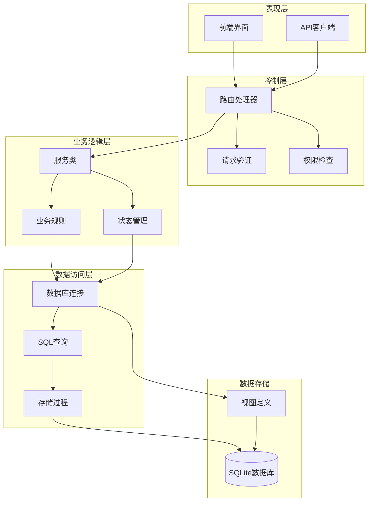

**图表来源**
- [app.py:1-100](file://app.py#L1-L100)
- [app/db.py:1-100](file://app/db.py#L1-L100)
- [app/decorators.py:1-100](file://app/decorators.py#L1-L100)

### 请求处理流程

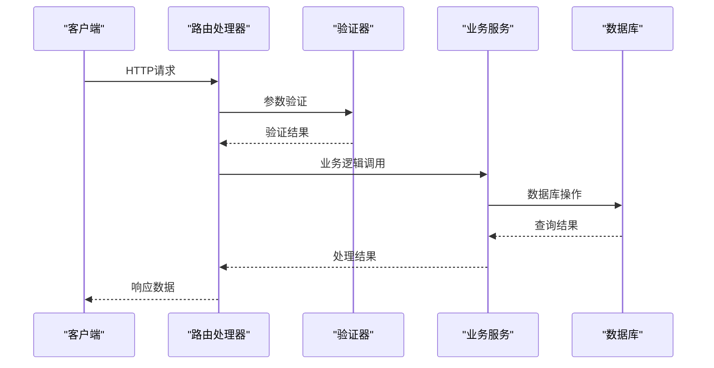

**图表来源**
- [app/teacher/routes.py:1-150](file://app/teacher/routes.py#L1-L150)
- [app/admin/routes.py:1-150](file://app/admin/routes.py#L1-L150)

## 详细组件分析

### 教师开课申请模块

教师开课申请是系统的核心功能之一，支持完整的申请流程：

#### 申请流程状态机

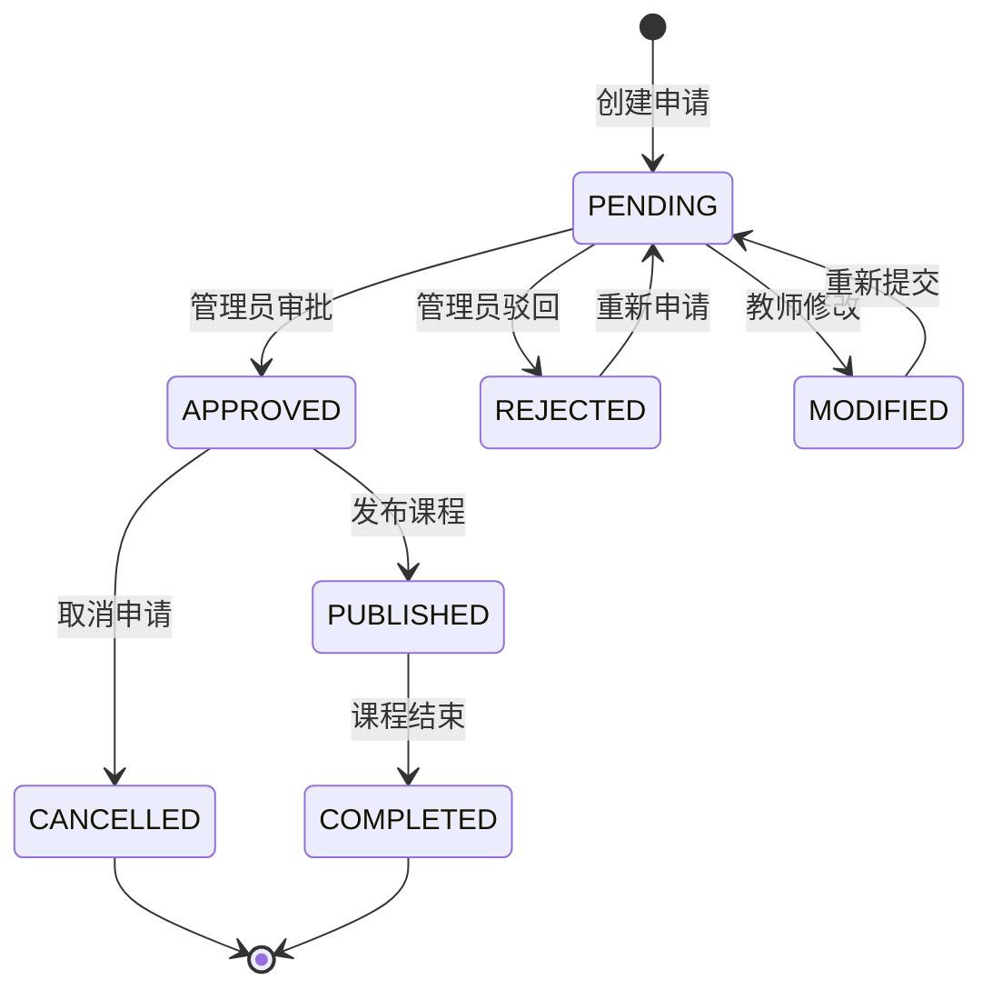

**图表来源**
- [app/teacher/routes.py:1-100](file://app/teacher/routes.py#L1-L100)

#### 申请表单字段

| 字段名 | 类型 | 必填 | 描述 |
|--------|------|------|------|
| semester_id | integer | 是 | 学期ID |
| course_id | integer | 是 | 课程ID |
| section | string | 否 | 课程小班号 |
| credits | integer | 否 | 学分 |
| max_students | integer | 否 | 最大选课人数 |
| prerequisites | string | 否 | 先修课程要求 |
| description | text | 否 | 课程描述 |

**章节来源**
- [app/teacher/routes.py:1-200](file://app/teacher/routes.py#L1-L200)
- [app/templates/teacher/apply_offering.html:1-100](file://app/templates/teacher/apply_offering.html#L1-L100)

### 管理员审核模块

管理员审核模块提供完整的审批流程管理：

#### 审核决策流程

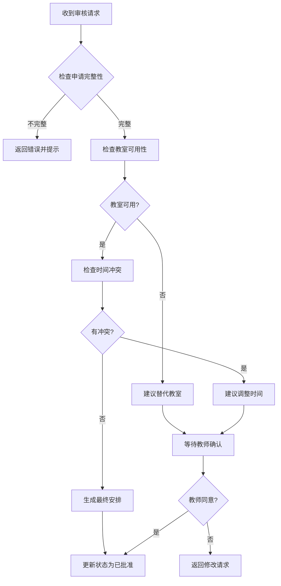

**图表来源**
- [app/admin/routes.py:1-150](file://app/admin/routes.py#L1-L150)

#### 审核操作类型

| 操作类型 | 端点 | 描述 |
|----------|------|------|
| 批准 | PUT `/admin/offerings/<id>/approve` | 批准开课申请 |
| 驳回 | PUT `/admin/offerings/<id>/reject` | 驳回开课申请 |
| 修改 | PUT `/admin/offerings/<id}/modify` | 要求修改申请 |
| 查看 | GET `/admin/offerings/<id>` | 查看申请详情 |

**章节来源**
- [app/admin/routes.py:1-200](file://app/admin/routes.py#L1-L200)

### 教室分配与时间冲突检测

系统实现了智能的教室分配算法，自动检测和避免时间冲突：

#### 冲突检测算法

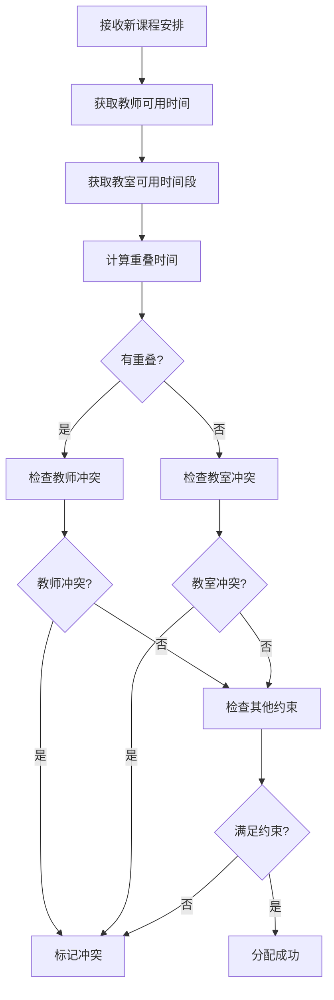

**图表来源**
- [app/helpers.py:1-150](file://app/helpers.py#L1-L150)

#### 时间冲突检测规则

| 冲突类型 | 检测条件 | 处理方式 |
|----------|----------|----------|
| 教师冲突 | 同一教师在同一时间段有其他课程 | 自动调整时间 |
| 教室冲突 | 同一教室在同一时间段被占用 | 分配替代教室 |
| 学生冲突 | 同一学生在同一时间段有其他课程 | 提示冲突警告 |
| 时间重叠 | 课程开始时间在其他课程时间段内 | 调整课程时间 |

**章节来源**
- [app/helpers.py:1-200](file://app/helpers.py#L1-L200)
- [sql/03_procedures.sql:1-200](file://sql/03_procedures.sql#L1-L200)

### 开课状态管理

系统实现了完整的状态管理系统，支持多状态流转：

#### 状态流转图

```mermaid
graph LR
PENDING["待审核<br/>PENDING"] --> APPROVED["已批准<br/>APPROVED"]
PENDING --> REJECTED["已驳回<br/>REJECTED"]
PENDING --> MODIFIED["需要修改<br/>MODIFIED"]
APPROVED --> PUBLISHED["已发布<br/>PUBLISHED"]
APPROVED --> CANCELLED["已取消<br/>CANCELLED"]
PUBLISHED --> COMPLETED["已完成<br/>COMPLETED"]
PUBLISHED --> IN_PROGRESS["进行中<br/>IN_PROGRESS"]
IN_PROGRESS --> COMPLETED
MODIFIED --> PENDING
CANCELLED --> [*]
COMPLETED --> [*]
REJECTED --> [*]
```

**图表来源**
- [app/admin/routes.py:1-100](file://app/admin/routes.py#L1-L100)
- [app/teacher/routes.py:1-100](file://app/teacher/routes.py#L1-L100)

#### 状态查询接口

| 状态 | 查询参数 | 返回数据 |
|------|----------|----------|
| 待审核 | status=PENDING | 未处理的申请列表 |
| 已批准 | status=APPROVED | 已批准但未发布的课程 |
| 已发布 | status=PUBLISHED | 正在进行的课程 |
| 已完成 | status=COMPLETED | 历史完成的课程 |
| 已取消 | status=CANCELLED | 被取消的申请 |

**章节来源**
- [app/admin/routes.py:1-150](file://app/admin/routes.py#L1-L150)
- [app/student/routes.py:1-150](file://app/student/routes.py#L1-L150)

### 开课查询接口

系统提供灵活的多维度查询功能：

#### 查询参数设计

| 查询类型 | 参数 | 示例值 | 说明 |
|----------|------|--------|------|
| 按学期查询 | semester_id | 1 | 查询指定学期的开课 |
| 按教师查询 | teacher_id | 5 | 查询指定教师的开课 |
| 按课程查询 | course_id | 10 | 查询指定课程的开课 |
| 按状态查询 | status | PUBLISHED | 查询指定状态的开课 |
| 按时间查询 | start_date, end_date | 2024-01-01 | 查询指定时间范围的开课 |
| 按教室查询 | classroom_id | 3 | 查询指定教室的开课 |

**章节来源**
- [app/student/routes.py:1-200](file://app/student/routes.py#L1-L200)
- [app/teacher/routes.py:1-200](file://app/teacher/routes.py#L1-L200)

### 开课统计接口

系统提供丰富的统计数据分析功能：

#### 统计指标

| 统计类型 | 指标名称 | 计算方法 | 数据来源 |
|----------|----------|----------|----------|
| 数量统计 | 开课总数 | COUNT(*) | OFFERING表 |
| 数量统计 | 按学期分布 | GROUP BY semester_id | OFFERING表 |
| 数量统计 | 按教师分布 | GROUP BY teacher_id | OFFERING表 |
| 数量统计 | 按课程分布 | GROUP BY course_id | OFFERING表 |
| 利用率统计 | 教室利用率 | 使用时长/总可用时长 | SCHEDULE+CLASSROOM |
| 工作量统计 | 教师工作量 | 总学分*周次 | OFFERING+COURSE |
| 完成度统计 | 课程完成率 | 已完成/总数 | OFFERING状态 |

**章节来源**
- [sql/04_views.sql:1-200](file://sql/04_views.sql#L1-L200)
- [app/admin/routes.py:1-150](file://app/admin/routes.py#L1-L150)

### 开课取消和调整接口

系统支持灵活的课程管理和调整功能：

#### 取消流程

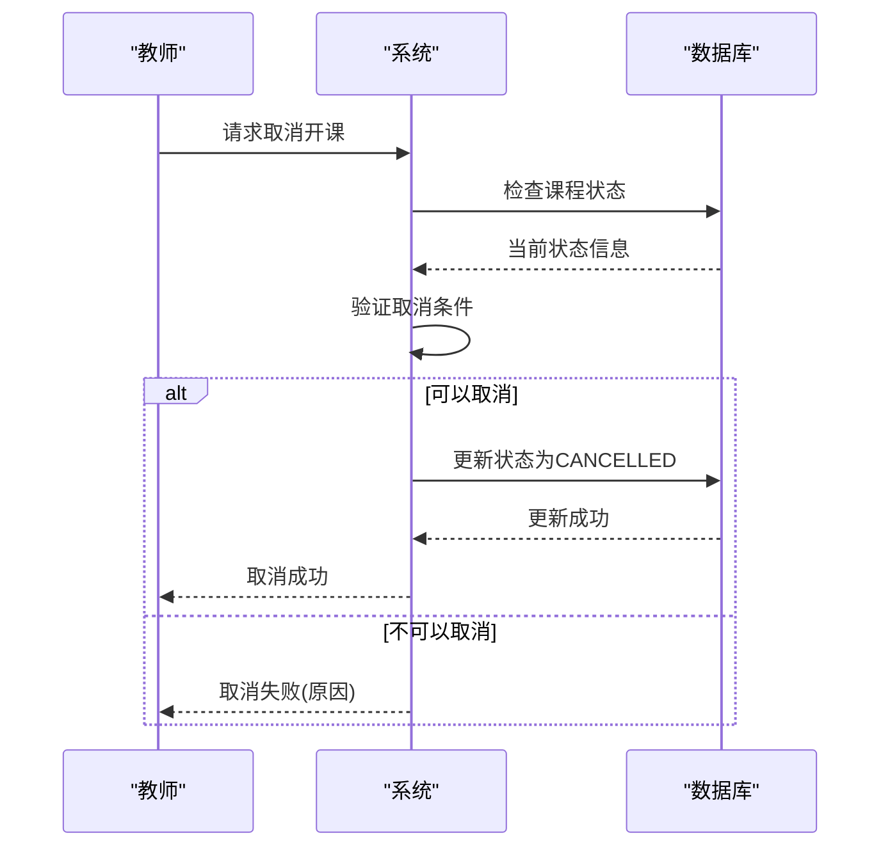

**图表来源**
- [app/teacher/routes.py:1-100](file://app/teacher/routes.py#L1-L100)

#### 调整流程

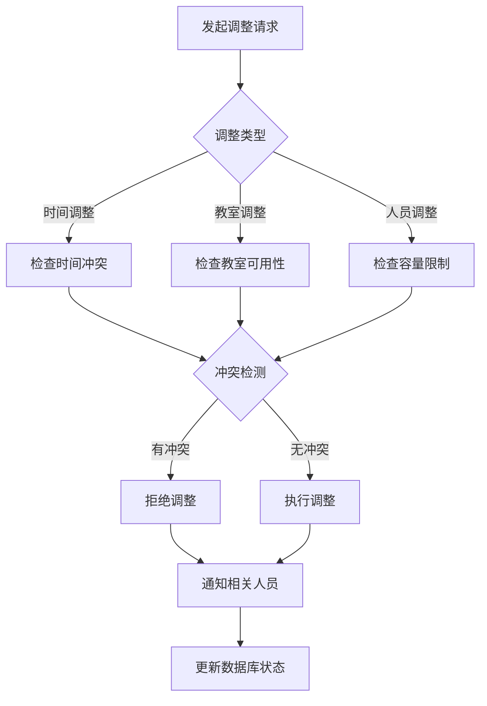

**图表来源**
- [app/admin/routes.py:1-150](file://app/admin/routes.py#L1-L150)

## 依赖关系分析

系统各组件之间的依赖关系如下：

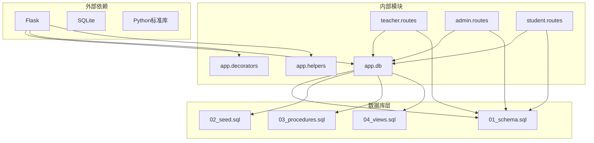

**图表来源**
- [app.py:1-100](file://app.py#L1-L100)
- [app/db.py:1-100](file://app/db.py#L1-L100)
- [sql/01_schema.sql:1-100](file://sql/01_schema.sql#L1-L100)

### 关键依赖关系

| 依赖方向 | 说明 | 影响范围 |
|----------|------|----------|
| 路由模块 → 数据库模块 | 所有业务逻辑都依赖数据库访问 | 全部功能模块 |
| 装饰器模块 → 路由模块 | 权限验证和认证装饰器 | 所有受保护的API |
| 辅助模块 → 业务逻辑 | 工具函数和通用算法 | 所有业务处理 |
| SQL脚本 → 数据库 | 数据结构和约束定义 | 全部数据访问 |

**章节来源**
- [app/decorators.py:1-150](file://app/decorators.py#L1-L150)
- [app/helpers.py:1-150](file://app/helpers.py#L1-L150)
- [sql/01_schema.sql:1-150](file://sql/01_schema.sql#L1-L150)

## 性能考虑

### 数据库优化策略

1. **索引优化**
   - 在经常查询的字段上建立索引
   - 优化复合查询的索引顺序
   - 定期分析查询计划

2. **查询优化**
   - 使用预编译语句防止SQL注入
   - 实现分页查询避免大数据集
   - 缓存常用查询结果

3. **连接池管理**
   - 实现数据库连接池
   - 合理设置连接超时
   - 监控连接使用情况

### 缓存策略

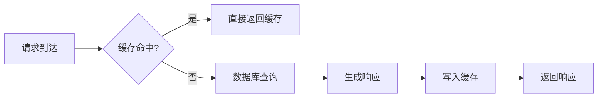

**图表来源**
- [app/db.py:1-100](file://app/db.py#L1-L100)

## 故障排除指南

### 常见问题及解决方案

| 问题类型 | 症状 | 可能原因 | 解决方案 |
|----------|------|----------|----------|
| 数据库连接失败 | 连接超时或拒绝 | 数据库服务未启动 | 检查数据库服务状态 |
| 权限不足 | 403错误 | 用户权限不够 | 检查用户角色和权限 |
| 参数验证失败 | 400错误 | 请求参数格式错误 | 检查API文档和参数格式 |
| 数据冲突 | 409错误 | 数据唯一性冲突 | 检查重复数据 |
| 服务器错误 | 500错误 | 服务器内部异常 | 查看日志文件 |

### 错误处理机制

系统实现了统一的错误处理机制：

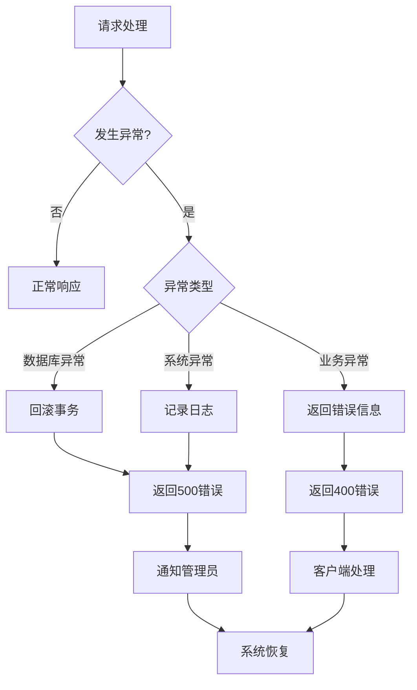

**图表来源**
- [app.py:1-100](file://app.py#L1-L100)

**章节来源**
- [app.py:1-150](file://app.py#L1-L150)
- [app/db.py:1-150](file://app/db.py#L1-L150)

## 结论

开课管理API是一个功能完整、结构清晰的课程管理解决方案。系统通过合理的架构设计和完善的业务逻辑，实现了从开课申请到课程执行的全生命周期管理。

### 主要优势

1. **模块化设计**：清晰的模块划分便于维护和扩展
2. **状态管理**：完善的开课状态流转确保业务流程规范
3. **冲突检测**：智能的时间和资源冲突检测提升系统可靠性
4. **多维度查询**：灵活的查询接口满足不同用户需求
5. **统计分析**：丰富的统计数据为管理决策提供支持

### 改进建议

1. **性能优化**：实现更高效的缓存策略和数据库查询优化
2. **监控告警**：增加系统监控和异常告警机制
3. **API文档**：完善API文档和示例代码
4. **测试覆盖**：增加单元测试和集成测试覆盖率

## 附录

### API使用示例

由于安全考虑，这里不提供具体的代码示例。请参考相应的HTML模板文件了解前端使用方式：

- 教师开课申请页面：[apply_offering.html](file://app/templates/teacher/apply_offering.html)
- 教师开课管理页面：[my_offerings.html](file://app/templates/teacher/my_offerings.html)
- 管理员开课管理页面：[offerings.html](file://app/templates/admin/offerings.html)

### 数据库设计要点

系统采用关系型数据库设计，通过外键约束保证数据完整性。所有重要的业务关系都在数据库层面得到体现，确保数据的一致性和准确性。