# 成绩审核管理API

<cite>
**本文档引用的文件**
- [app.py](file://app.py)
- [config.py](file://config.py)
- [app/db.py](file://app/db.py)
- [app/decorators.py](file://app/decorators.py)
- [app/helpers.py](file://app/helpers.py)
- [app/admin/routes.py](file://app/admin/routes.py)
- [app/teacher/routes.py](file://app/teacher/routes.py)
- [app/student/routes.py](file://app/student/routes.py)
- [sql/01_schema.sql](file://sql/01_schema.sql)
- [sql/03_procedures.sql](file://sql/03_procedures.sql)
- [app/templates/admin/grades_review.html](file://app/templates/admin/grades_review.html)
- [app/templates/teacher/offering_students.html](file://app/templates/teacher/offering_students.html)
- [app/templates/student/grades.html](file://app/templates/student/grades.html)
</cite>

## 目录
1. [简介](#简介)
2. [项目结构](#项目结构)
3. [核心组件](#核心组件)
4. [架构概览](#架构概览)
5. [详细组件分析](#详细组件分析)
6. [依赖关系分析](#依赖关系分析)
7. [性能考虑](#性能考虑)
8. [故障排除指南](#故障排除指南)
9. [结论](#结论)

## 简介

校园教务选课与成绩管理系统是一个基于Python Flask框架开发的Web应用程序，专门用于管理学校的教学事务。该系统实现了完整的成绩审核管理功能，包括成绩复核、分数修改、审核意见提交、批量成绩发布、状态跟踪、统计分析、申诉处理和成绩导出等核心功能。

系统采用三层架构设计，使用MySQL作为数据库，通过存储过程和触发器实现复杂的业务逻辑，确保数据一致性和完整性。系统支持三种用户角色：管理员、教师和学生，每个角色都有特定的功能权限和操作范围。

## 项目结构

系统采用模块化设计，按照功能层次组织代码结构：

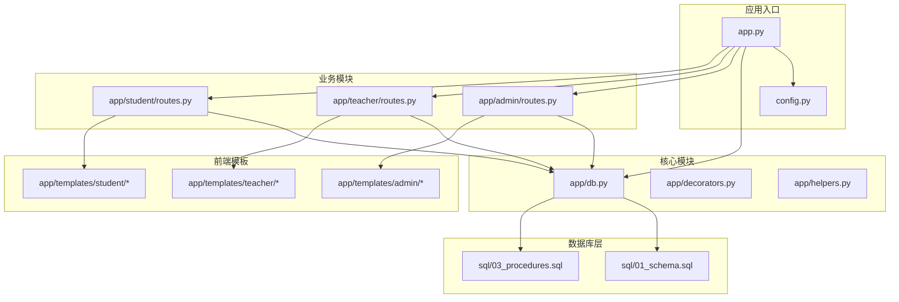

**图表来源**
- [app.py:1-13](file://app.py#L1-L13)
- [config.py:1-36](file://config.py#L1-L36)
- [app/db.py:1-121](file://app/db.py#L1-L121)

**章节来源**
- [app.py:1-13](file://app.py#L1-L13)
- [config.py:1-36](file://config.py#L1-L36)

## 核心组件

### 数据库连接池
系统使用DBUtils库实现MySQL连接池管理，提供高效的数据库连接复用机制：

- **连接池配置**：最小缓存2个连接，最大缓存10个连接，最大连接数20个
- **字符集设置**：UTF8MB4支持中文字符
- **事务管理**：手动提交模式，确保数据一致性

### 权限控制系统
通过装饰器实现基于角色的访问控制：

- **登录验证**：确保用户已登录
- **角色验证**：限制不同角色的访问权限
- **资源保护**：防止未授权访问敏感功能

### 辅助工具
提供常用功能的封装：

- **系统日志**：记录用户操作和系统事件
- **课表解析**：智能解析和冲突检测
- **选课周期管理**：动态获取当前有效的选课时间段

**章节来源**
- [app/db.py:1-121](file://app/db.py#L1-L121)
- [app/decorators.py:1-26](file://app/decorators.py#L1-L26)
- [app/helpers.py:1-80](file://app/helpers.py#L1-L80)

## 架构概览

系统采用经典的MVC架构模式，结合存储过程和触发器实现复杂业务逻辑：

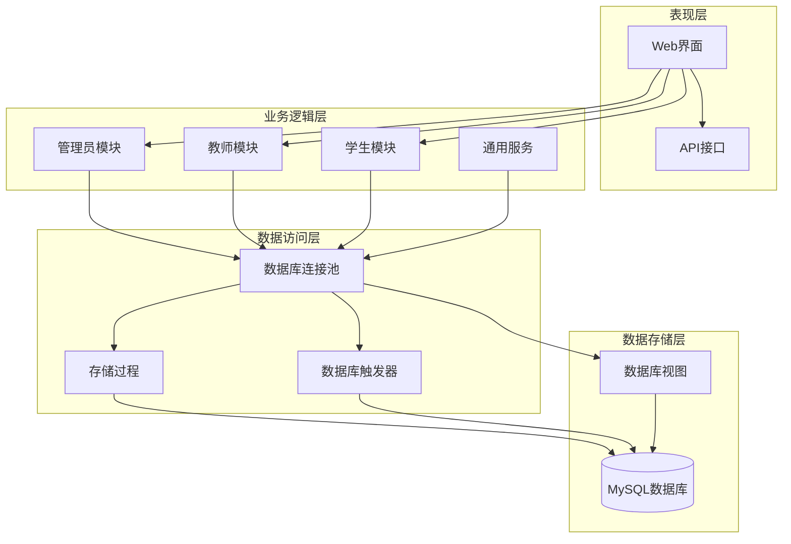

**图表来源**
- [app/admin/routes.py:1-692](file://app/admin/routes.py#L1-L692)
- [app/teacher/routes.py:1-333](file://app/teacher/routes.py#L1-L333)
- [app/student/routes.py:1-233](file://app/student/routes.py#L1-L233)

## 详细组件分析

### 成绩审核管理模块

#### 单个成绩审核接口

系统提供了完整的单个成绩审核流程，支持管理员对已提交的成绩进行审核：

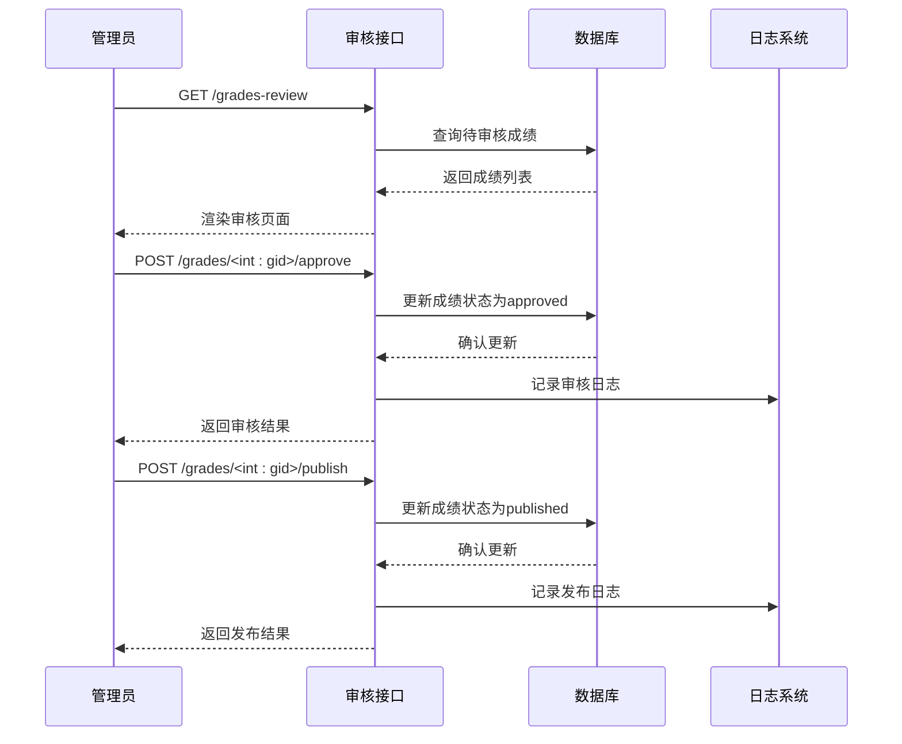

**图表来源**
- [app/admin/routes.py:511-542](file://app/admin/routes.py#L511-L542)

**审核流程特点**：
- **状态验证**：确保成绩处于正确的审核状态下
- **事务处理**：使用数据库事务保证操作原子性
- **日志记录**：完整记录每次审核操作
- **错误处理**：提供友好的错误提示和回滚机制

#### 批量成绩发布接口

系统支持按课程和按班级的批量操作：

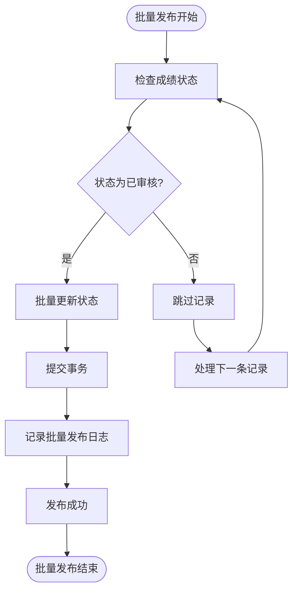

**图表来源**
- [app/admin/routes.py:569-582](file://app/admin/routes.py#L569-L582)

**批量操作特性**：
- **课程维度**：按开课课程批量发布
- **班级维度**：按教学班批量发布
- **状态同步**：自动同步相关状态字段
- **性能优化**：使用单次批量SQL操作

#### 成绩状态跟踪接口

系统提供完整的状态跟踪功能：

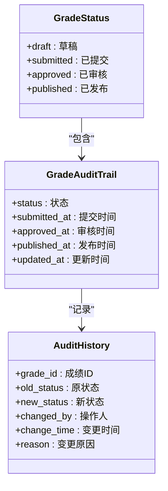

**图表来源**
- [sql/01_schema.sql:176-198](file://sql/01_schema.sql#L176-L198)
- [app/admin/routes.py:492-508](file://app/admin/routes.py#L492-L508)

**状态跟踪功能**：
- **实时状态查询**：显示当前审核进度
- **历史记录查看**：追踪完整的状态变更历史
- **状态变更通知**：通过系统日志通知相关人员
- **进度可视化**：提供直观的状态展示

#### 成绩统计分析接口

系统内置多种统计分析功能：

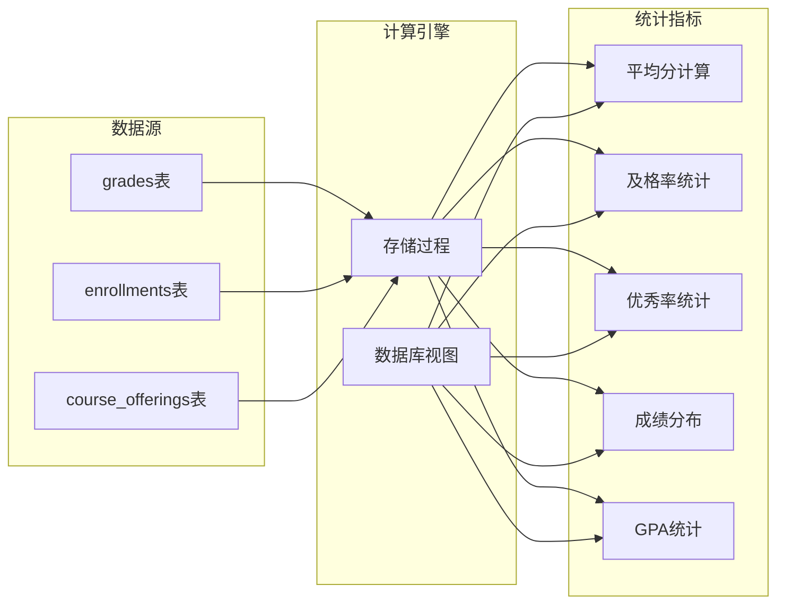

**图表来源**
- [app/admin/routes.py:611-638](file://app/admin/routes.py#L611-L638)
- [app/teacher/routes.py:299-332](file://app/teacher/routes.py#L299-L332)

**统计分析功能**：
- **平均分计算**：基于已发布成绩的加权平均
- **及格率统计**：计算60分及以上学生的比例
- **优秀率分析**：统计90分以上学生的比例
- **成绩分布**：按等级区间统计学生人数
- **教师工作量**：统计教师的教学负担

#### 成绩申诉处理接口

系统支持完整的申诉处理流程：

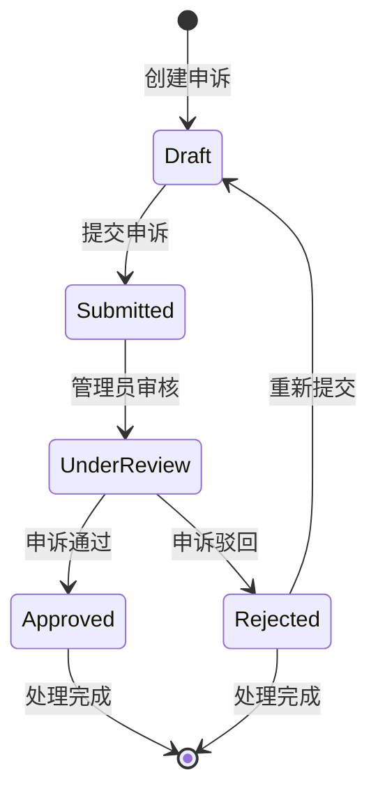

**申诉处理流程**：
- **申诉创建**：学生提交成绩申诉申请
- **材料审核**：管理员审查申诉材料
- **复核决定**：根据事实做出最终决定
- **结果通知**：向相关方发送处理结果

#### 成绩导出接口

系统提供Excel格式的成绩报表生成功能：

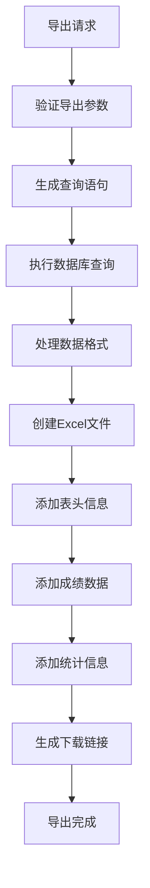

**导出功能特性**：
- **多维度导出**：支持按课程、按班级、按学期导出
- **格式规范**：符合教育部门标准的Excel格式
- **数据完整**：包含所有必要的成绩和统计信息
- **批量处理**：支持大量数据的高效导出

**章节来源**
- [app/admin/routes.py:492-582](file://app/admin/routes.py#L492-L582)
- [app/teacher/routes.py:162-274](file://app/teacher/routes.py#L162-L274)
- [app/student/routes.py:185-212](file://app/student/routes.py#L185-L212)

### 教师模块功能

#### 成绩录入和修改

教师可以通过直观的界面录入和修改学生成绩：

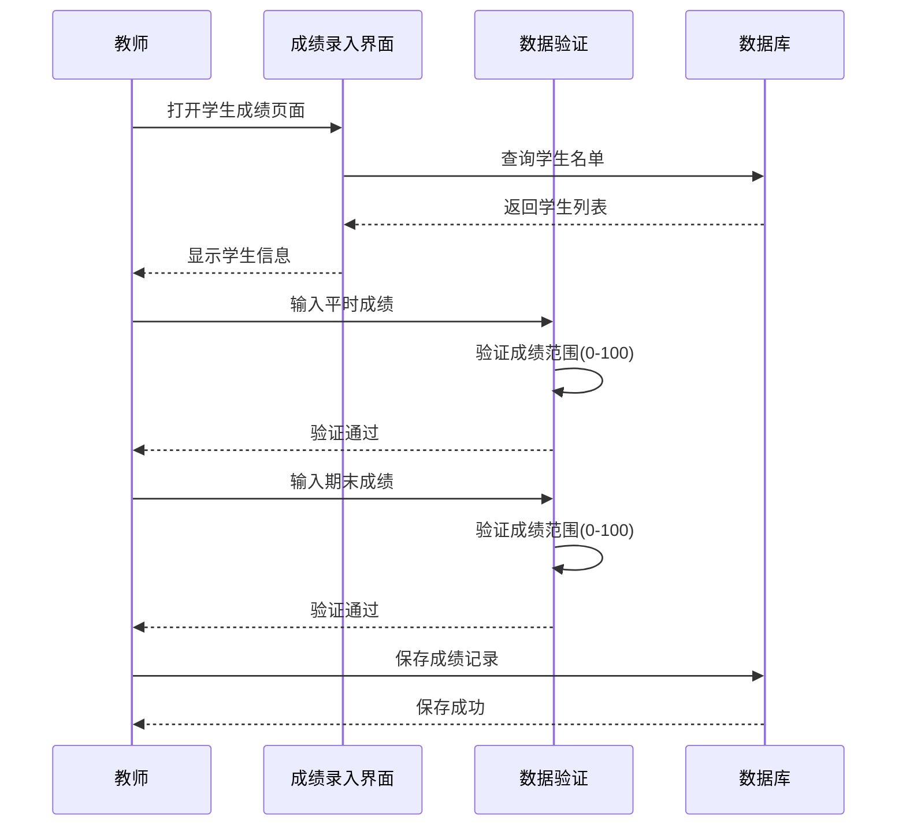

**图表来源**
- [app/teacher/routes.py:162-191](file://app/teacher/routes.py#L162-L191)

#### 批量成绩处理

教师可以使用批量功能快速处理多个学生的成绩：

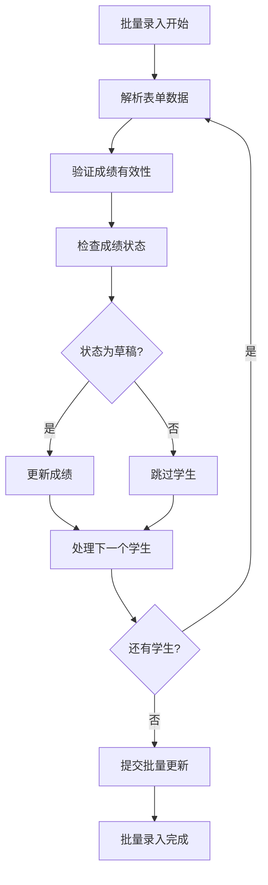

**图表来源**
- [app/teacher/routes.py:238-274](file://app/teacher/routes.py#L238-L274)

### 学生模块功能

#### 成绩查询和展示

学生可以查看自己的成绩记录和GPA统计：

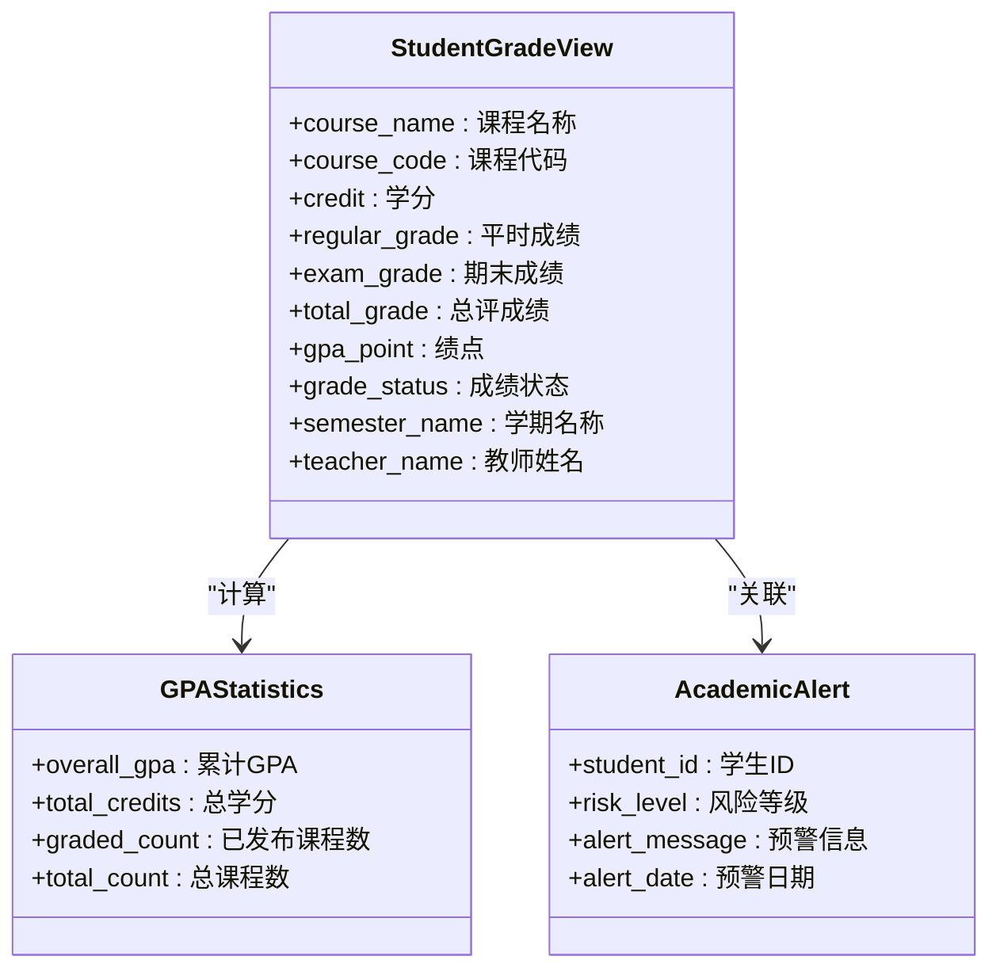

**图表来源**
- [app/student/routes.py:185-212](file://app/student/routes.py#L185-L212)
- [app/student/routes.py:24-33](file://app/student/routes.py#L24-L33)

**学生功能特性**：
- **实时查询**：查看已发布的成绩
- **GPA计算**：自动计算累计GPA和总学分
- **学术预警**：接收学业风险提醒
- **成绩单打印**：生成官方成绩单

**章节来源**
- [app/teacher/routes.py:162-274](file://app/teacher/routes.py#L162-L274)
- [app/student/routes.py:185-212](file://app/student/routes.py#L185-L212)

## 依赖关系分析

系统采用松耦合的设计，各模块间通过清晰的接口进行交互：

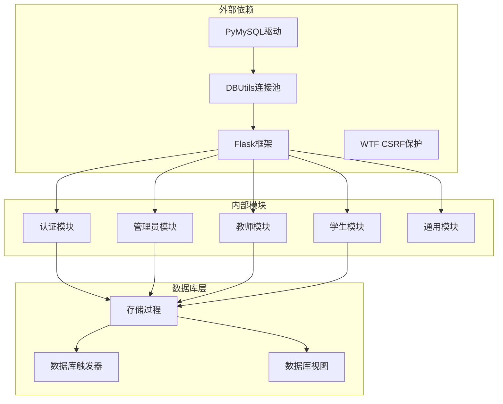

**图表来源**
- [requirements.txt](file://requirements.txt)
- [app.py:1-13](file://app.py#L1-L13)

**依赖关系特点**：
- **模块独立**：各业务模块相对独立，便于维护和扩展
- **共享资源**：数据库连接池和配置信息在模块间共享
- **接口清晰**：通过蓝图和路由定义明确的接口契约
- **版本兼容**：严格控制第三方库版本，确保系统稳定性

**章节来源**
- [app.py:1-13](file://app.py#L1-L13)
- [requirements.txt](file://requirements.txt)

## 性能考虑

### 数据库性能优化

系统通过多种方式优化数据库性能：

1. **连接池管理**：合理配置连接池大小，避免频繁创建连接
2. **索引优化**：为常用查询字段建立适当索引
3. **查询优化**：使用分页查询处理大数据量
4. **事务管理**：批量操作使用事务提高效率

### 缓存策略

系统采用多层次缓存策略：

- **连接池缓存**：DBUtils连接池减少连接开销
- **查询结果缓存**：对静态数据进行缓存
- **会话缓存**：Flask session存储用户状态

### 并发控制

系统通过以下机制处理并发访问：

- **行级锁**：使用FOR UPDATE锁定需要修改的数据
- **事务隔离**：合理设置事务隔离级别
- **乐观锁**：在某些场景使用版本号控制并发

## 故障排除指南

### 常见问题及解决方案

#### 数据库连接问题
**症状**：应用启动时报数据库连接错误
**解决方案**：
1. 检查数据库服务是否正常运行
2. 验证连接参数配置
3. 确认防火墙设置允许连接

#### 权限不足错误
**症状**：访问受保护页面时出现403错误
**解决方案**：
1. 确认用户已正确登录
2. 检查用户角色权限
3. 验证URL路径是否正确

#### 成绩审核异常
**症状**：成绩状态无法正常更新
**解决方案**：
1. 检查当前成绩状态是否正确
2. 验证操作权限
3. 查看系统日志获取详细错误信息

#### 批量操作失败
**症状**：批量更新操作部分失败
**解决方案**：
1. 检查单条记录的有效性
2. 确认事务回滚机制正常工作
3. 分析具体失败的记录并单独处理

**章节来源**
- [app/admin/routes.py:511-582](file://app/admin/routes.py#L511-L582)
- [app/teacher/routes.py:162-274](file://app/teacher/routes.py#L162-L274)

## 结论

校园教务选课与成绩管理系统是一个功能完整、架构清晰的Web应用程序。系统通过合理的模块划分和接口设计，实现了成绩审核管理的核心功能，包括：

1. **完整的审核流程**：从成绩录入到最终发布的全流程管理
2. **灵活的批量操作**：支持按课程、按班级的批量处理
3. **实时状态跟踪**：提供详细的状态变更历史和进度查询
4. **丰富的统计分析**：内置多种统计指标和可视化展示
5. **完善的权限控制**：基于角色的安全访问管理
6. **高性能的数据库设计**：通过存储过程和触发器优化性能

系统采用的技术栈成熟稳定，代码结构清晰，具有良好的可维护性和扩展性。通过合理的数据库设计和业务逻辑封装，系统能够满足高校教务管理的实际需求，为教学管理工作提供有力的技术支撑。