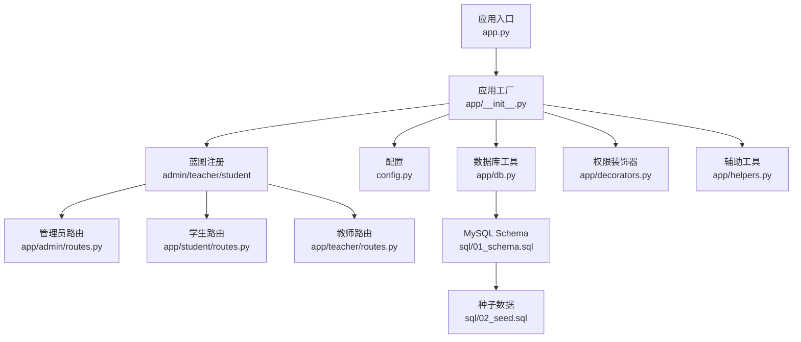
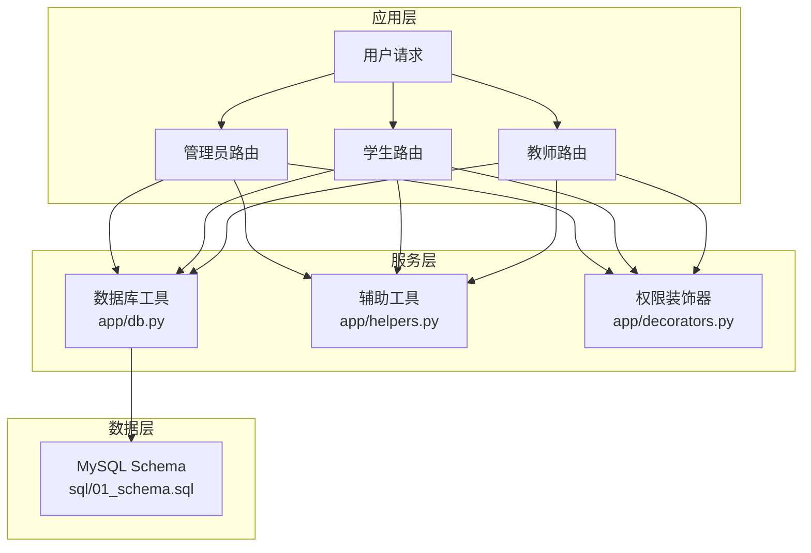
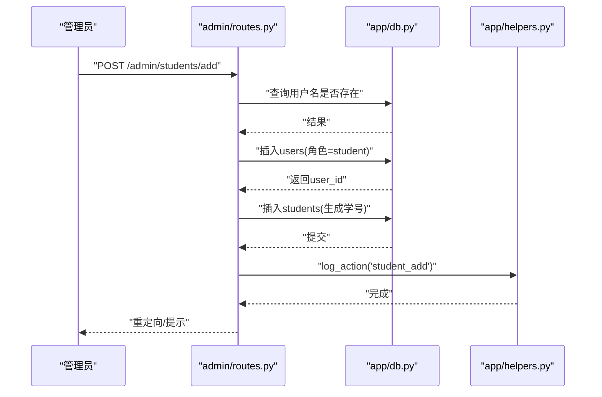
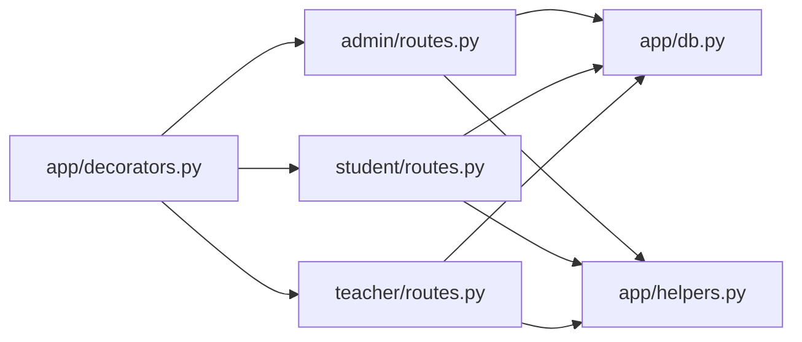

# 用户管理API

<cite>
**本文引用的文件**
- [app.py](file://app.py)
- [app/__init__.py](file://app/__init__.py)
- [config.py](file://config.py)
- [app/db.py](file://app/db.py)
- [app/decorators.py](file://app/decorators.py)
- [app/helpers.py](file://app/helpers.py)
- [app/admin/routes.py](file://app/admin/routes.py)
- [app/student/routes.py](file://app/student/routes.py)
- [app/teacher/routes.py](file://app/teacher/routes.py)
- [sql/01_schema.sql](file://sql/01_schema.sql)
- [sql/02_seed.sql](file://sql/02_seed.sql)
</cite>

## 目录
1. [简介](#简介)
2. [项目结构](#项目结构)
3. [核心组件](#核心组件)
4. [架构总览](#架构总览)
5. [详细组件分析](#详细组件分析)
6. [依赖分析](#依赖分析)
7. [性能考虑](#性能考虑)
8. [故障排查指南](#故障排查指南)
9. [结论](#结论)
10. [附录](#附录)

## 简介
本文件面向“用户管理API”的使用与维护，覆盖学生与教师两类用户从增删改查到状态切换、密码重置、批量重置、搜索筛选、权限分配与验证、以及操作日志追踪等完整能力。系统采用Flask + MySQL架构，通过蓝图划分功能域，统一的数据库连接池与分页工具支撑高并发场景。

## 项目结构
- 应用入口与初始化：应用启动、蓝图注册、错误处理、Flask-Login集成
- 蓝图模块：
  - 管理员模块：用户管理、课程/班级/专业/学期管理、开课审核、成绩管理、统计与预警、系统日志
  - 学生模块：课程查询、选课/退课、课表、成绩、成绩单
  - 教师模块：开课申请、教学班名单、成绩录入与提交
- 数据库与工具：连接池、分页、存储过程调用、日志写入、调度解析
- 数据模型：users、students、teachers、system_logs等核心表



图表来源
- [app.py:1-13](file://app.py#L1-L13)
- [app/__init__.py:29-93](file://app/__init__.py#L29-L93)
- [config.py:6-36](file://config.py#L6-L36)
- [app/db.py:10-121](file://app/db.py#L10-L121)
- [app/decorators.py:7-26](file://app/decorators.py#L7-L26)
- [app/helpers.py:9-80](file://app/helpers.py#L9-L80)
- [app/admin/routes.py:11-692](file://app/admin/routes.py#L11-L692)
- [app/student/routes.py:1-233](file://app/student/routes.py#L1-L233)
- [app/teacher/routes.py:1-333](file://app/teacher/routes.py#L1-L333)
- [sql/01_schema.sql:12-235](file://sql/01_schema.sql#L12-L235)
- [sql/02_seed.sql:7-49](file://sql/02_seed.sql#L7-L49)

章节来源
- [app.py:1-13](file://app.py#L1-L13)
- [app/__init__.py:29-93](file://app/__init__.py#L29-L93)
- [config.py:6-36](file://config.py#L6-L36)

## 核心组件
- 应用工厂与蓝图
  - 创建Flask实例、初始化CSRF保护、数据库连接池、Flask-Login用户加载器，并注册admin、teacher、student蓝图
- 权限控制
  - 登录与角色装饰器，确保各模块仅对授权角色开放
- 数据库工具
  - 连接池、查询/执行、存储过程调用、分页封装
- 日志与辅助
  - 系统日志写入、课表冲突解析、选课时间段查询

章节来源
- [app/__init__.py:29-93](file://app/__init__.py#L29-L93)
- [app/decorators.py:7-26](file://app/decorators.py#L7-L26)
- [app/db.py:10-121](file://app/db.py#L10-L121)
- [app/helpers.py:9-80](file://app/helpers.py#L9-L80)

## 架构总览
系统采用“蓝图 + 工具函数 + 数据模型”的分层架构。管理员模块承担用户管理与全局治理职责；学生与教师模块分别提供业务操作入口；数据库层以连接池与事务保证一致性与性能。



图表来源
- [app/admin/routes.py:11-692](file://app/admin/routes.py#L11-L692)
- [app/student/routes.py:1-233](file://app/student/routes.py#L1-L233)
- [app/teacher/routes.py:1-333](file://app/teacher/routes.py#L1-L333)
- [app/db.py:10-121](file://app/db.py#L10-L121)
- [app/helpers.py:9-80](file://app/helpers.py#L9-L80)
- [app/decorators.py:7-26](file://app/decorators.py#L7-L26)
- [sql/01_schema.sql:12-235](file://sql/01_schema.sql#L12-L235)

## 详细组件分析

### 管理员用户管理API
管理员负责学生与教师两类用户的全生命周期管理，包括注册、信息修改、状态切换、密码重置等。

- 学生管理
  - 列表与搜索：支持按姓名、学号、用户名模糊搜索，分页展示
  - 新增：生成唯一学号，创建用户并绑定学生信息
  - 编辑：更新专业、班级、联系方式、状态
  - 状态切换：启用/禁用对应用户
  - 密码重置：设置新密码（长度校验）
- 教师管理
  - 列表与搜索：支持按姓名、工号、用户名模糊搜索，分页展示
  - 新增：生成唯一工号，创建用户并绑定教师信息
  - 编辑：更新职称、联系方式
  - 状态切换：启用/禁用对应用户
  - 密码重置：设置新密码（长度校验）



图表来源
- [app/admin/routes.py:254-283](file://app/admin/routes.py#L254-L283)
- [app/db.py:43-89](file://app/db.py#L43-L89)
- [app/helpers.py:9-21](file://app/helpers.py#L9-L21)

章节来源
- [app/admin/routes.py:208-300](file://app/admin/routes.py#L208-L300)
- [app/admin/routes.py:302-384](file://app/admin/routes.py#L302-L384)

### 用户搜索与筛选
- 学生：支持按姓名、学号、用户名模糊匹配
- 教师：支持按姓名、工号、用户名模糊匹配
- 分页：统一使用分页工具，支持自定义每页数量

章节来源
- [app/admin/routes.py:215-230](file://app/admin/routes.py#L215-L230)
- [app/admin/routes.py:303-317](file://app/admin/routes.py#L303-L317)
- [app/db.py:92-121](file://app/db.py#L92-L121)

### 用户状态切换（启用/禁用）
- 学生：根据学生记录定位user_id，切换users.is_active
- 教师：根据教师记录定位user_id，切换users.is_active

章节来源
- [app/admin/routes.py:232-241](file://app/admin/routes.py#L232-L241)
- [app/admin/routes.py:319-328](file://app/admin/routes.py#L319-L328)

### 密码重置与批量重置
- 单个重置：校验新密码长度，更新users.password_hash
- 批量重置：管理员端暂未提供批量导入/导出接口，但可通过后端逻辑扩展

章节来源
- [app/admin/routes.py:285-299](file://app/admin/routes.py#L285-L299)
- [app/admin/routes.py:369-383](file://app/admin/routes.py#L369-L383)

### 用户权限分配与验证
- 角色字段：users.role决定用户身份（student/teacher/admin）
- 权限验证：蓝图前置装饰器限制访问角色
- 登录状态：Flask-Login统一管理

章节来源
- [sql/01_schema.sql:14-26](file://sql/01_schema.sql#L14-L26)
- [app/admin/routes.py:14-18](file://app/admin/routes.py#L14-L18)
- [app/student/routes.py:12-16](file://app/student/routes.py#L12-L16)
- [app/teacher/routes.py:11-15](file://app/teacher/routes.py#L11-L15)
- [app/__init__.py:47-51](file://app/__init__.py#L47-L51)

### 用户操作日志
- 写入：统一通过helpers.log_action写入system_logs
- 字段：user_id、action、target_type、target_id、detail、ip_address
- 查询：管理员可按action过滤查看系统日志

章节来源
- [app/helpers.py:9-21](file://app/helpers.py#L9-L21)
- [app/admin/routes.py:585-609](file://app/admin/routes.py#L585-L609)
- [sql/01_schema.sql:218-235](file://sql/01_schema.sql#L218-L235)

### 批量导入/导出与CSV模板
- 当前代码未提供批量导入/导出接口
- 建议扩展方向：新增Excel/CSV上传接口，结合数据库事务与校验规则，导出时按模板字段映射

章节来源
- [app/admin/routes.py:11-692](file://app/admin/routes.py#L11-L692)

## 依赖分析
- 组件耦合
  - 路由层依赖数据库工具与辅助工具
  - 权限装饰器贯穿各蓝图，确保访问控制
- 外部依赖
  - Flask、Flask-Login、PyMySQL、dbutils连接池
- 循环依赖
  - 通过蓝图延迟导入避免循环



图表来源
- [app/admin/routes.py:11-692](file://app/admin/routes.py#L11-L692)
- [app/student/routes.py:1-233](file://app/student/routes.py#L1-L233)
- [app/teacher/routes.py:1-333](file://app/teacher/routes.py#L1-L333)
- [app/db.py:10-121](file://app/db.py#L10-L121)
- [app/helpers.py:9-80](file://app/helpers.py#L9-L80)
- [app/decorators.py:7-26](file://app/decorators.py#L7-L26)

章节来源
- [app/db.py:10-121](file://app/db.py#L10-L121)
- [app/decorators.py:7-26](file://app/decorators.py#L7-L26)

## 性能考虑
- 连接池：配置最小缓存、最大缓存与最大连接数，降低连接开销
- 分页：统一分页工具，避免一次性加载大量数据
- 索引：users(role)、system_logs(action/created_at)等索引提升查询效率
- 事务：批量操作建议使用事务，保证一致性与原子性

章节来源
- [config.py:19-25](file://config.py#L19-L25)
- [app/db.py:92-121](file://app/db.py#L92-L121)
- [sql/01_schema.sql:24-26](file://sql/01_schema.sql#L24-L26)
- [sql/01_schema.sql:229-231](file://sql/01_schema.sql#L229-L231)

## 故障排查指南
- 403未授权
  - 检查当前用户角色与目标路由所需角色是否一致
- 404资源不存在
  - 确认学生/教师ID、课程开课ID等参数正确
- 500服务器错误
  - 查看系统日志action与detail定位具体操作
- 密码重置失败
  - 校验新密码长度是否满足最小长度要求
- 选课/退课异常
  - 检查选课时间段是否有效、课表是否冲突

章节来源
- [app/__init__.py:77-90](file://app/__init__.py#L77-L90)
- [app/admin/routes.py:285-299](file://app/admin/routes.py#L285-L299)
- [app/helpers.py:66-79](file://app/helpers.py#L66-L79)

## 结论
本系统围绕管理员、学生、教师三大角色构建了完善的用户管理体系，具备用户增删改查、状态切换、密码重置、搜索筛选与操作日志等核心能力。建议后续补充批量导入/导出接口与更细粒度的权限控制，以进一步提升运维效率与安全性。

## 附录

### 数据模型概览
```mermaid
erDiagram
USERS {
int id PK
varchar username UK
varchar password_hash
enum role
tinyint is_active
datetime last_login
datetime created_at
datetime updated_at
}
STUDENTS {
int id PK
int user_id UK FK
varchar student_no UK
varchar name
enum gender
int major_id FK
int class_id FK
year enrollment_year
varchar phone
varchar email
enum status
}
TEACHERS {
int id PK
int user_id UK FK
varchar teacher_no UK
varchar name
enum gender
varchar title
varchar phone
varchar email
}
SYSTEM_LOGS {
int id PK
int user_id FK
varchar action
varchar target_type
int target_id
text detail
varchar ip_address
datetime created_at
}
USERS ||--o| STUDENTS : "拥有"
USERS ||--o| TEACHERS : "拥有"
STUDENTS }o--|| SYSTEM_LOGS : "产生"
TEACHERS }o--|| SYSTEM_LOGS : "产生"
```

图表来源
- [sql/01_schema.sql:14-26](file://sql/01_schema.sql#L14-L26)
- [sql/01_schema.sql:55-77](file://sql/01_schema.sql#L55-L77)
- [sql/01_schema.sql:82-95](file://sql/01_schema.sql#L82-L95)
- [sql/01_schema.sql:220-235](file://sql/01_schema.sql#L220-L235)

### 接口清单与参数说明
- 学生管理
  - GET /admin/students?page=&search=
    - 参数：page（页码）、search（模糊搜索）
  - POST /admin/students/add
    - 表单字段：username、password、name、gender、major_id、class_id、enrollment_year、phone、email
  - POST /admin/students/<int:sid>/edit
    - 表单字段：major_id、class_id、phone、email、status
  - POST /admin/students/<int:sid>/toggle
    - 无额外参数
  - POST /admin/students/<int:sid>/reset-password
    - 表单字段：new_password（≥6位）
- 教师管理
  - GET /admin/teachers?page=&search=
    - 参数：page（页码）、search（模糊搜索）
  - POST /admin/teachers/add
    - 表单字段：username、password、name、gender、title、phone、email
  - POST /admin/teachers/<int:tid>/edit
    - 表单字段：title、phone、email
  - POST /admin/teachers/<int:tid>/toggle
    - 无额外参数
  - POST /admin/teachers/<int:tid>/reset-password
    - 表单字段：new_password（≥6位）
- 系统日志
  - GET /admin/logs?page=&action=
    - 参数：page（页码）、action（过滤关键字）

章节来源
- [app/admin/routes.py:215-230](file://app/admin/routes.py#L215-L230)
- [app/admin/routes.py:254-283](file://app/admin/routes.py#L254-L283)
- [app/admin/routes.py:243-252](file://app/admin/routes.py#L243-L252)
- [app/admin/routes.py:232-241](file://app/admin/routes.py#L232-L241)
- [app/admin/routes.py:285-299](file://app/admin/routes.py#L285-L299)
- [app/admin/routes.py:303-317](file://app/admin/routes.py#L303-L317)
- [app/admin/routes.py:340-367](file://app/admin/routes.py#L340-L367)
- [app/admin/routes.py:330-338](file://app/admin/routes.py#L330-L338)
- [app/admin/routes.py:319-328](file://app/admin/routes.py#L319-L328)
- [app/admin/routes.py:369-383](file://app/admin/routes.py#L369-L383)
- [app/admin/routes.py:585-609](file://app/admin/routes.py#L585-L609)