# 管理员管理API

<cite>
**本文档引用的文件**
- [app/admin/routes.py](file://app/admin/routes.py)
- [app/__init__.py](file://app/__init__.py)
- [app/db.py](file://app/db.py)
- [app/decorators.py](file://app/decorators.py)
- [config.py](file://config.py)
- [sql/01_schema.sql](file://sql/01_schema.sql)
- [sql/03_procedures.sql](file://sql/03_procedures.sql)
- [sql/04_views.sql](file://sql/04_views.sql)
- [README.md](file://README.md)
</cite>

## 目录
1. [简介](#简介)
2. [项目结构](#项目结构)
3. [核心组件](#核心组件)
4. [架构概览](#架构概览)
5. [详细组件分析](#详细组件分析)
6. [依赖关系分析](#依赖关系分析)
7. [性能考虑](#性能考虑)
8. [故障排除指南](#故障排除指南)
9. [结论](#结论)

## 简介

这是一个基于Flask框架开发的校园教务选课与成绩管理系统，专门为管理员提供全面的管理功能。系统采用Python 3.x + MySQL 8.x技术栈，实现了完整的教务管理业务流程，包括用户管理、课程管理、开课审核、选课管理、成绩管理等核心功能。

系统支持多角色权限管理，其中管理员拥有最高权限，可以进行所有管理操作。通过RESTful风格的API接口，管理员可以高效地管理整个教务系统的日常运营。

## 项目结构

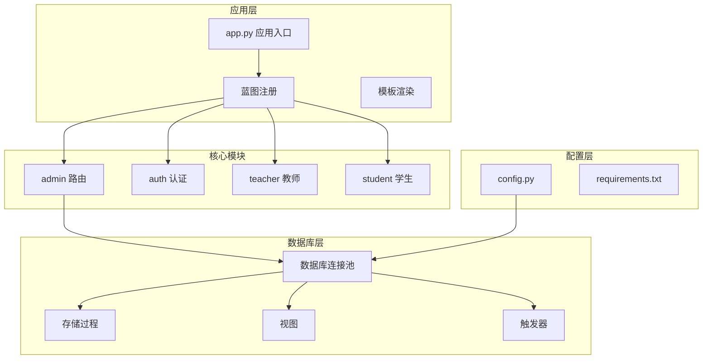

**图表来源**
- [app/__init__.py:29-65](file://app/__init__.py#L29-L65)
- [app/admin/routes.py:10](file://app/admin/routes.py#L10)

**章节来源**
- [README.md:46-69](file://README.md#L46-L69)
- [app/__init__.py:29-65](file://app/__init__.py#L29-L65)

## 核心组件

### 数据库连接池管理
系统使用DBUtils连接池实现高效的数据库连接管理，支持配置化的连接池参数，包括最小缓存连接数、最大缓存连接数和最大连接数。

### 权限控制装饰器
通过自定义装饰器实现基于角色的访问控制，确保只有管理员才能访问管理功能。

### 分页查询工具
提供通用的分页查询功能，支持复杂的SQL查询和动态参数绑定。

**章节来源**
- [app/db.py:10-121](file://app/db.py#L10-L121)
- [app/decorators.py:13-26](file://app/decorators.py#L13-L26)

## 架构概览

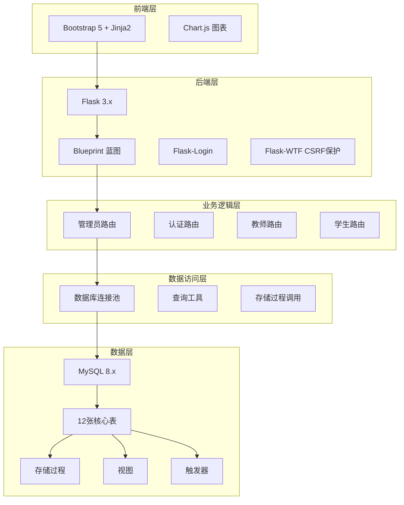

**图表来源**
- [README.md:5-11](file://README.md#L5-L11)
- [app/__init__.py:29-65](file://app/__init__.py#L29-L65)

## 详细组件分析

### 用户管理接口

#### 学生管理接口

**增删改查接口**
- GET `/admin/students` - 获取学生列表（支持分页和搜索）
- POST `/admin/students/add` - 添加学生
- POST `/admin/students/<int:sid>/edit` - 编辑学生信息
- POST `/admin/students/<int:sid>/toggle` - 切换学生账号状态
- POST `/admin/students/<int:sid>/reset-password` - 重置学生密码

**批量操作接口**
- 支持通过搜索框按姓名、学号、用户名搜索
- 支持分页显示，每页15条记录
- 支持批量密码重置

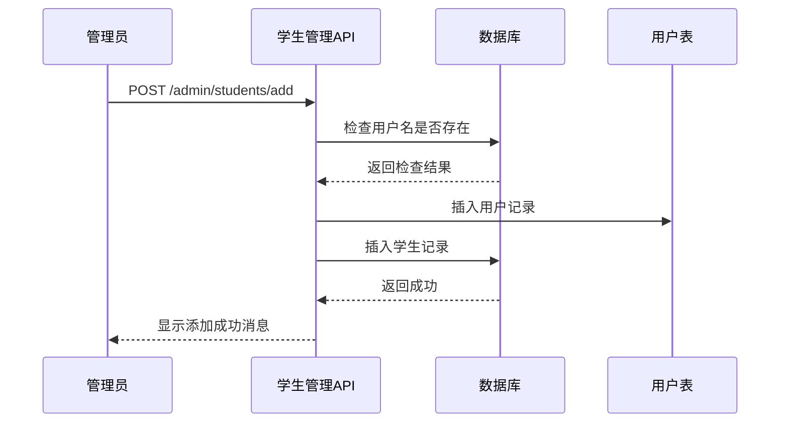

**图表来源**
- [app/admin/routes.py:239-267](file://app/admin/routes.py#L239-L267)

**教师管理接口**
- GET `/admin/teachers` - 获取教师列表（支持分页和搜索）
- POST `/admin/teachers/add` - 添加教师
- POST `/admin/teachers/<int:tid>/edit` - 编辑教师信息
- POST `/admin/teachers/<int:tid>/toggle` - 切换教师账号状态
- POST `/admin/teachers/<int:tid>/reset-password` - 重置教师密码

**章节来源**
- [app/admin/routes.py:285-363](file://app/admin/routes.py#L285-L363)

#### 状态切换机制

系统实现了灵活的用户状态管理机制：

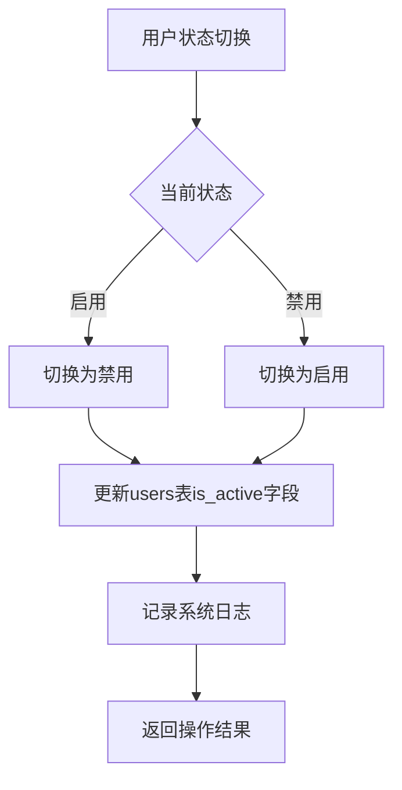

**图表来源**
- [app/admin/routes.py:219-227](file://app/admin/routes.py#L219-L227)
- [app/admin/routes.py:302-310](file://app/admin/routes.py#L302-L310)

### 学期管理接口

#### 学期生命周期管理

**接口规范**
- GET `/admin/semesters` - 获取学期列表
- POST `/admin/semesters/add` - 创建新学期
- POST `/admin/semesters/<int:sid>/edit` - 更新学期信息
- POST `/admin/semesters/<int:sid>/delete` - 删除学期

**核心业务逻辑**
- 当设置某个学期为当前学期时，系统会自动将其他学期的`is_current`字段设为0
- 支持学期名称唯一性约束
- 支持学期日期的有效性检查

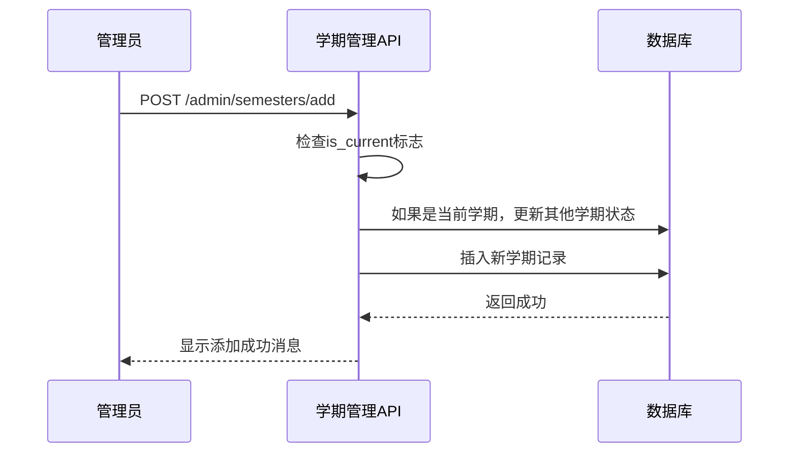

**图表来源**
- [app/admin/routes.py:67-96](file://app/admin/routes.py#L67-L96)

**章节来源**
- [app/admin/routes.py:60-96](file://app/admin/routes.py#L60-L96)

### 专业和班级管理接口

#### 专业管理接口
- GET `/admin/majors` - 获取专业列表
- POST `/admin/majors/add` - 添加专业
- POST `/admin/majors/<int:mid>/edit` - 编辑专业信息
- POST `/admin/majors/<int:mid>/delete` - 删除专业

#### 班级管理接口
- GET `/admin/classes` - 获取班级列表
- POST `/admin/classes/add` - 添加班级
- POST `/admin/classes/<int:cid>/edit` - 编辑班级信息
- POST `/admin/classes/<int:cid>/delete` - 删除班级

**关联查询机制**
系统通过LEFT JOIN实现专业和班级的关联查询，支持按专业名称筛选班级信息。

**章节来源**
- [app/admin/routes.py:99-159](file://app/admin/routes.py#L99-L159)

### 课程管理接口

#### 课程信息维护

**接口规范**
- GET `/admin/courses` - 获取课程列表
- POST `/admin/courses/add` - 添加课程
- POST `/admin/courses/<int:cid>/edit` - 更新课程信息
- POST `/admin/courses/<int:cid>/delete` - 删除课程

**课程属性管理**
- 课程编号（唯一约束）
- 课程名称
- 学分（DECIMAL类型，必须大于0）
- 学时（整数，必须大于0）
- 课程类型（必修、选修、任选）
- 课程描述

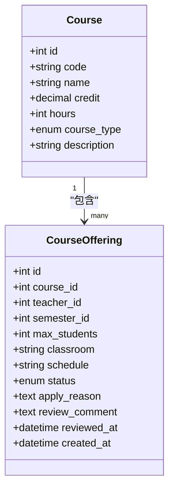

**图表来源**
- [sql/01_schema.sql:113-125](file://sql/01_schema.sql#L113-L125)
- [sql/01_schema.sql:129-155](file://sql/01_schema.sql#L129-L155)

**章节来源**
- [app/admin/routes.py:161-193](file://app/admin/routes.py#L161-L193)

### 开课审核接口

#### 审核流程管理

**接口规范**
- GET `/admin/offerings` - 获取开课申请列表（支持分页）
- POST `/admin/offerings/<int:oid>/review` - 审核开课申请
- POST `/admin/offerings/<int:oid>/publish` - 发布已批准的课程

**审核状态流转**
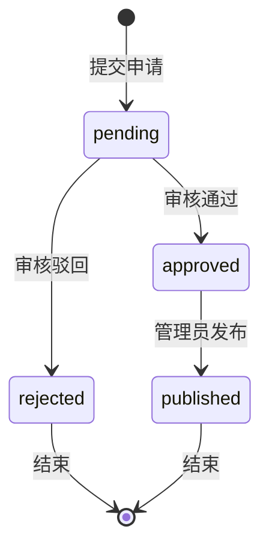

**审核机制**
- 使用存储过程`sp_approve_course_offering`处理审核逻辑
- 支持审核意见和评论功能
- 自动记录审核状态变更

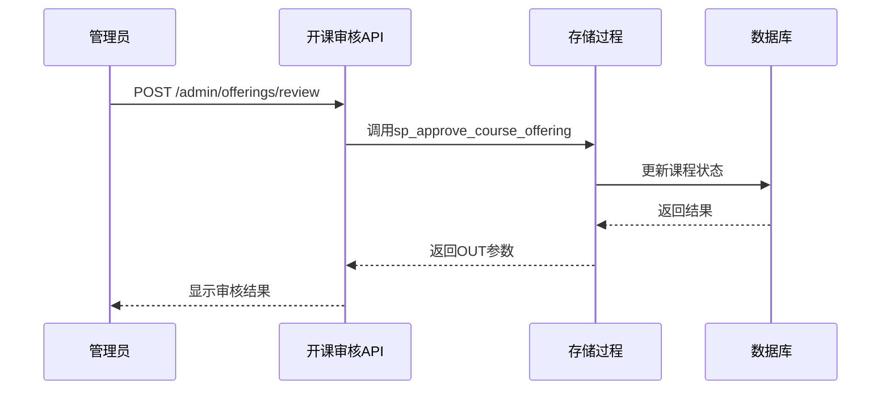

**图表来源**
- [app/admin/routes.py:380-398](file://app/admin/routes.py#L380-L398)
- [sql/03_procedures.sql:14-113](file://sql/03_procedures.sql#L14-L113)

**章节来源**
- [app/admin/routes.py:365-405](file://app/admin/routes.py#L365-L405)

### 选课时间段管理接口

#### 时间段配置管理

**接口规范**
- GET `/admin/selection-periods` - 获取选课时间段列表
- POST `/admin/selection-periods/add` - 添加时间段
- POST `/admin/selection-periods/<int:pid>/edit` - 更新时间段
- POST `/admin/selection-periods/<int:pid>/toggle` - 切换时间段状态
- POST `/admin/selection-periods/<int:pid>/delete` - 删除时间段

**时间段类型**
- 选课窗口（selection）
- 退课窗口（drop）

**状态管理**
- 支持启用/禁用状态切换
- 系统自动检查当前有效的时间段

**章节来源**
- [app/admin/routes.py:407-451](file://app/admin/routes.py#L407-L451)

### 成绩审核接口

#### 成绩管理流程

**接口规范**
- GET `/admin/grades-review` - 获取待审核成绩列表
- POST `/admin/grades/<int:gid>/approve` - 审核通过
- POST `/admin/grades/<int:gid>/publish` - 发布成绩
- POST `/admin/grades/batch-publish` - 批量发布

**成绩状态管理**
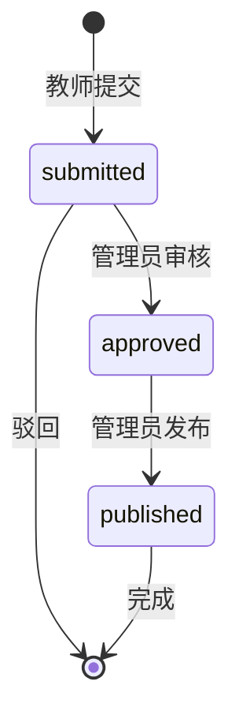

**审核机制**
- 单个成绩审核和批量发布功能
- 自动记录审核和发布的系统日志
- 支持成绩状态的原子性更新

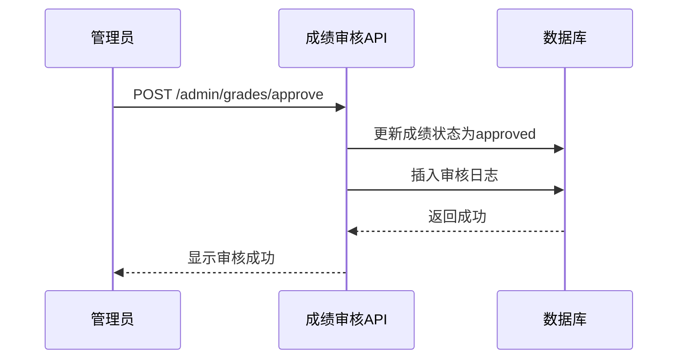

**图表来源**
- [app/admin/routes.py:472-489](file://app/admin/routes.py#L472-L489)

**章节来源**
- [app/admin/routes.py:453-526](file://app/admin/routes.py#L453-L526)

### 系统日志查看接口

#### 日志管理功能

**接口规范**
- GET `/admin/logs` - 获取系统日志列表（支持分页和过滤）
- 支持按操作类型过滤日志
- 显示用户操作的详细信息

**日志内容**
- 用户ID和用户名
- 操作类型（grade_approved, grade_published等）
- 目标类型和ID
- 操作详情

**章节来源**
- [app/admin/routes.py:528-544](file://app/admin/routes.py#L528-L544)

### 统计分析接口

#### 数据统计功能

**接口规范**
- GET `/admin/statistics` - 获取统计分析数据

**统计指标**
- 选课统计：按选课人数排序的课程统计
- 成绩分布：按分数段统计的成绩分布
- 教师工作量：按开课数量和学生人数统计的教师工作量

**数据源**
- 使用预定义视图提供统计数据
- 支持实时数据查询

**章节来源**
- [app/admin/routes.py:546-574](file://app/admin/routes.py#L546-L574)

## 依赖关系分析

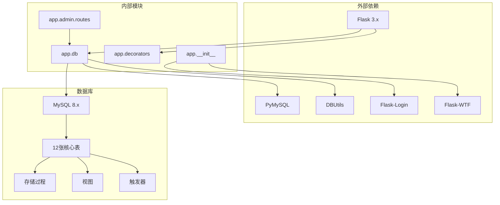

**图表来源**
- [requirements.txt:1-8](file://requirements.txt#L1-L8)
- [app/__init__.py:29-65](file://app/__init__.py#L29-L65)

**章节来源**
- [requirements.txt:1-8](file://requirements.txt#L1-L8)
- [app/__init__.py:29-65](file://app/__init__.py#L29-L65)

## 性能考虑

### 数据库优化策略
- 使用连接池减少连接开销
- 实现分页查询避免大数据量加载
- 通过索引优化常用查询条件
- 使用存储过程减少网络往返

### 缓存机制
- Redis缓存热门数据
- 会话数据本地缓存
- 配置信息内存缓存

### 异步处理
- 大数据量导出使用异步任务
- 邮件通知使用队列处理
- 日志记录异步写入

## 故障排除指南

### 常见问题诊断

**数据库连接问题**
- 检查数据库连接参数配置
- 验证连接池配置是否合理
- 查看连接超时和死锁情况

**权限相关问题**
- 确认用户角色为admin
- 检查CSRF令牌有效性
- 验证会话状态

**数据一致性问题**
- 检查外键约束
- 验证存储过程执行结果
- 查看触发器执行日志

**章节来源**
- [app/db.py:10-41](file://app/db.py#L10-L41)
- [app/decorators.py:13-26](file://app/decorators.py#L13-L26)

## 结论

管理员管理API提供了完整的教务系统管理功能，涵盖了用户管理、课程管理、开课审核、选课管理、成绩管理等核心业务。系统采用模块化设计，具有良好的扩展性和维护性。

通过RESTful API设计，管理员可以高效地管理整个教务系统的日常运营。系统的权限控制、数据验证、事务处理等机制确保了数据的安全性和一致性。

建议在生产环境中：
- 配置适当的日志级别和监控
- 设置合理的连接池参数
- 定期备份数据库
- 实施安全审计机制