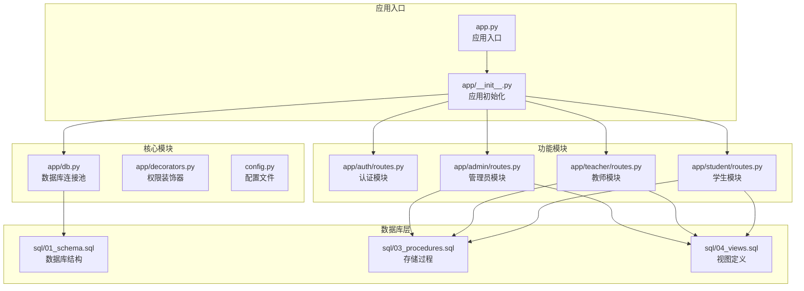
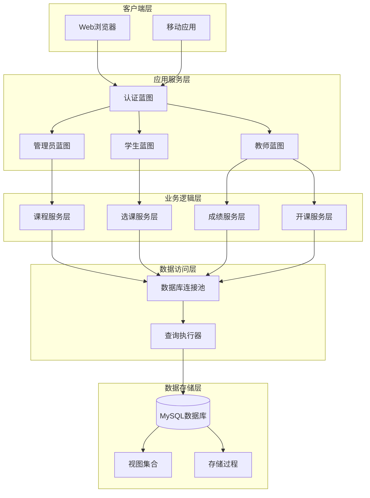
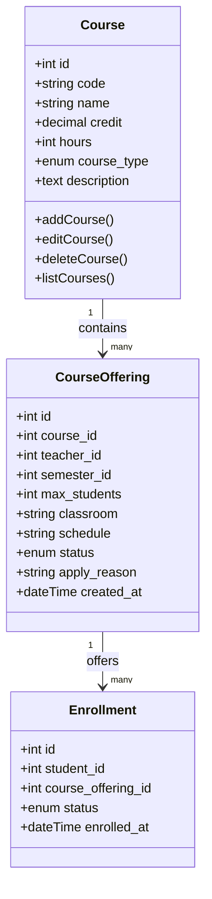
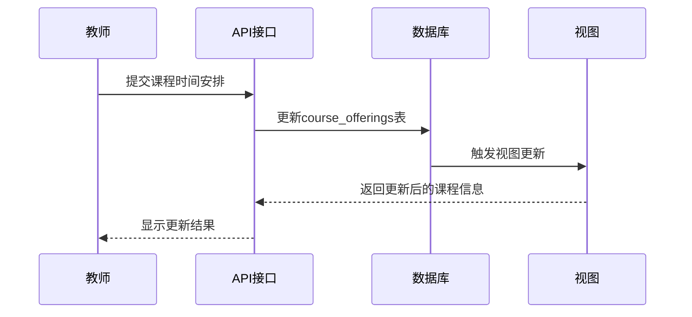
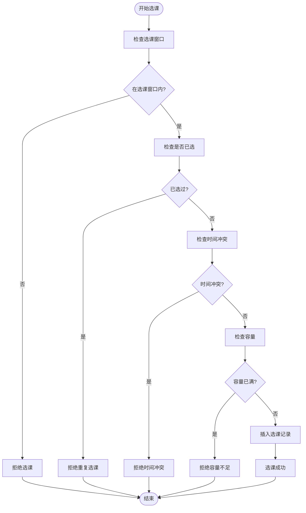
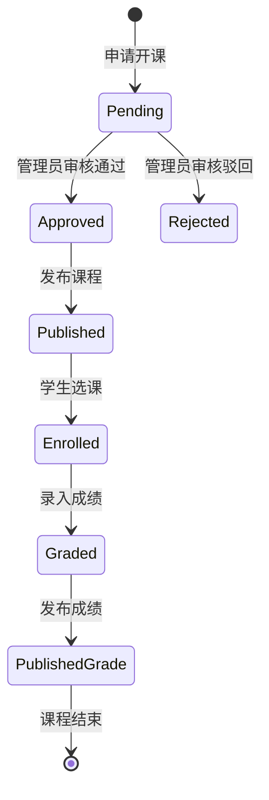
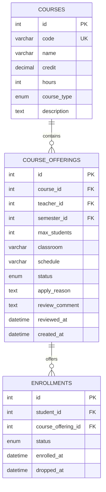

# 课程管理API

<cite>
**本文档引用的文件**
- [app.py](file://app.py)
- [app/__init__.py](file://app/__init__.py)
- [app/db.py](file://app/db.py)
- [config.py](file://config.py)
- [README.md](file://README.md)
- [app/admin/routes.py](file://app/admin/routes.py)
- [app/teacher/routes.py](file://app/teacher/routes.py)
- [app/student/routes.py](file://app/student/routes.py)
- [app/auth/routes.py](file://app/auth/routes.py)
- [app/decorators.py](file://app/decorators.py)
- [sql/01_schema.sql](file://sql/01_schema.sql)
- [sql/03_procedures.sql](file://sql/03_procedures.sql)
- [sql/04_views.sql](file://sql/04_views.sql)
- [requirements.txt](file://requirements.txt)
</cite>

## 目录
1. [简介](#简介)
2. [项目结构](#项目结构)
3. [核心组件](#核心组件)
4. [架构概览](#架构概览)
5. [详细组件分析](#详细组件分析)
6. [依赖关系分析](#依赖关系分析)
7. [性能考虑](#性能考虑)
8. [故障排除指南](#故障排除指南)
9. [结论](#结论)

## 简介

本项目是一个基于Python Flask框架开发的校园教务选课与成绩管理系统。系统实现了完整的课程管理功能，包括课程信息维护、课程属性设置、课程描述管理、课程时间安排、课程容量管理以及课程状态管理等核心业务流程。

系统采用前后端分离的设计模式，使用MySQL作为数据库，PyMySQL和DBUtils连接池进行数据库操作，实现了高并发场景下的稳定性和性能表现。整个系统遵循MVC架构模式，通过蓝图(BP)模块化组织不同角色的功能模块。

## 项目结构

**图表来源**
- [app.py:1-13](file://app.py#L1-L13)
- [app/__init__.py:29-93](file://app/__init__.py#L29-L93)
- [app/db.py:1-121](file://app/db.py#L1-L121)

**章节来源**
- [README.md:46-69](file://README.md#L46-L69)
- [requirements.txt:1-8](file://requirements.txt#L1-L8)

## 核心组件

### 数据库连接池管理

系统使用DBUtils连接池实现数据库连接的高效管理，支持最小缓存、最大缓存和最大连接数的配置。连接池确保了在高并发场景下的数据库操作性能和稳定性。

### 权限控制系统

通过Flask-Login实现用户认证，结合自定义装饰器实现角色权限控制。系统支持管理员、教师、学生三种角色，每个角色具有不同的功能权限和访问限制。

### 蓝图模块化架构

采用Flask蓝图机制将不同角色的功能模块化，每个模块独立管理自己的路由和业务逻辑，提高了代码的可维护性和扩展性。

**章节来源**
- [app/db.py:10-81](file://app/db.py#L10-L81)
- [app/decorators.py:7-26](file://app/decorators.py#L7-L26)
- [app/__init__.py:53-65](file://app/__init__.py#L53-L65)

## 架构概览

**图表来源**
- [app/__init__.py:53-65](file://app/__init__.py#L53-L65)
- [app/admin/routes.py:171-206](file://app/admin/routes.py#L171-L206)
- [app/teacher/routes.py:68-86](file://app/teacher/routes.py#L68-L86)
- [app/student/routes.py:148-174](file://app/student/routes.py#L148-L174)

## 详细组件分析

### 课程信息管理模块

#### 课程基本信息维护

系统提供了完整的课程信息管理功能，支持课程编号、名称、学分、学时、课程性质等核心字段的维护。

**图表来源**
- [sql/01_schema.sql:112-155](file://sql/01_schema.sql#L112-L155)
- [app/admin/routes.py:178-205](file://app/admin/routes.py#L178-L205)

#### 课程属性设置接口

系统支持课程性质的分类管理，包括必修、选修、实验等不同类型的课程属性设置。

**章节来源**
- [app/admin/routes.py:178-205](file://app/admin/routes.py#L178-L205)
- [sql/01_schema.sql:119](file://sql/01_schema.sql#L119)

#### 课程描述和教学大纲管理

系统提供课程描述的维护功能，支持课程简介、教学目标、考核方式等文本内容的管理。

**章节来源**
- [app/admin/routes.py:180-183](file://app/admin/routes.py#L180-L183)

### 课程时间安排管理

#### 时间地点设置接口

教师可以为所教授的课程设置具体的时间和地点信息，支持理论课和实验课的不同安排需求。

**图表来源**
- [app/teacher/routes.py:72-78](file://app/teacher/routes.py#L72-L78)
- [sql/01_schema.sql:135-138](file://sql/01_schema.sql#L135-L138)

**章节来源**
- [app/teacher/routes.py:72-78](file://app/teacher/routes.py#L72-L78)
- [app/teacher/routes.py:127-132](file://app/teacher/routes.py#L127-L132)

### 课程容量管理

#### 最大选课人数控制

系统通过存储过程实现精确的选课容量控制，确保不会超过设定的最大选课人数限制。

**图表来源**
- [sql/03_procedures.sql:14-113](file://sql/03_procedures.sql#L14-L113)

**章节来源**
- [sql/03_procedures.sql:93-104](file://sql/03_procedures.sql#L93-L104)
- [sql/01_schema.sql:135](file://sql/01_schema.sql#L135)

### 课程状态管理

#### 多状态生命周期管理

系统实现了完整的课程状态管理，支持从申请到发布的完整生命周期管理。

**图表来源**
- [sql/01_schema.sql:138](file://sql/01_schema.sql#L138)
- [app/admin/routes.py:414-440](file://app/admin/routes.py#L414-L440)

**章节来源**
- [app/admin/routes.py:414-440](file://app/admin/routes.py#L414-L440)
- [app/teacher/routes.py:107-117](file://app/teacher/routes.py#L107-L117)

## 依赖关系分析

### 数据库表结构关系

**图表来源**
- [sql/01_schema.sql:112-174](file://sql/01_schema.sql#L112-L174)

### API接口映射关系

系统通过蓝图机制将不同角色的功能模块化，每个模块负责特定的业务领域：

- **管理员模块**：课程管理、开课审核、选课时间配置、成绩管理
- **教师模块**：开课申请、学生管理、成绩录入、统计分析
- **学生模块**：课程浏览、选课退课、成绩查询、课表查看

**章节来源**
- [app/admin/routes.py:171-206](file://app/admin/routes.py#L171-L206)
- [app/teacher/routes.py:68-104](file://app/teacher/routes.py#L68-L104)
- [app/student/routes.py:82-129](file://app/student/routes.py#L82-L129)

## 性能考虑

### 数据库优化策略

1. **连接池配置**：通过DBUtils实现连接池管理，支持最小缓存2、最大缓存10、最大连接20的配置
2. **索引优化**：在常用查询字段上建立索引，如课程类型、状态、学期等字段
3. **视图优化**：使用视图减少复杂查询的重复计算，提高查询性能

### 缓存策略

系统通过视图和存储过程实现数据的高效访问，避免了复杂的联表查询带来的性能损耗。

## 故障排除指南

### 常见问题诊断

1. **数据库连接问题**：检查数据库连接配置和连接池参数
2. **权限验证失败**：确认用户角色和权限设置
3. **存储过程执行异常**：检查存储过程的参数传递和返回值处理

### 错误处理机制

系统实现了完善的错误处理机制，包括：
- 数据库异常捕获和回滚
- 业务逻辑异常的友好提示
- 权限验证失败的403响应

**章节来源**
- [app/db.py:26-31](file://app/db.py#L26-L31)
- [app/decorators.py:18-23](file://app/decorators.py#L18-L23)

## 结论

本课程管理系统通过模块化的架构设计和完善的业务功能实现，为校园教务管理提供了全面的解决方案。系统支持多角色协作、高并发访问和数据一致性保证，能够满足现代高校对教务管理的需求。

通过蓝图机制实现的功能模块化、存储过程保证的数据一致性和视图优化的查询性能，使得整个系统具有良好的可维护性和扩展性。未来可以在前端交互体验、移动端支持和数据分析功能方面进一步完善。