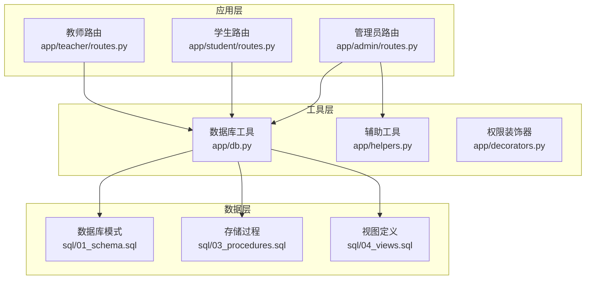
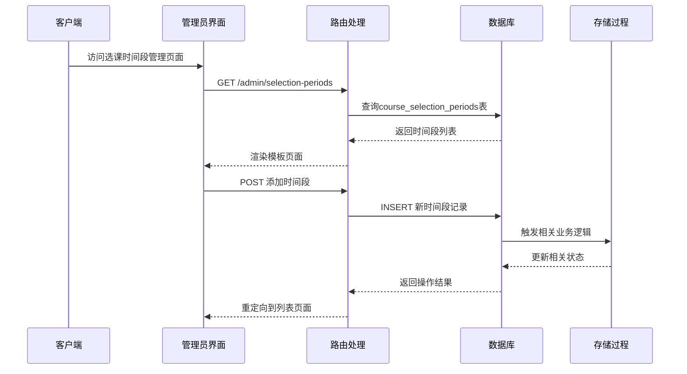
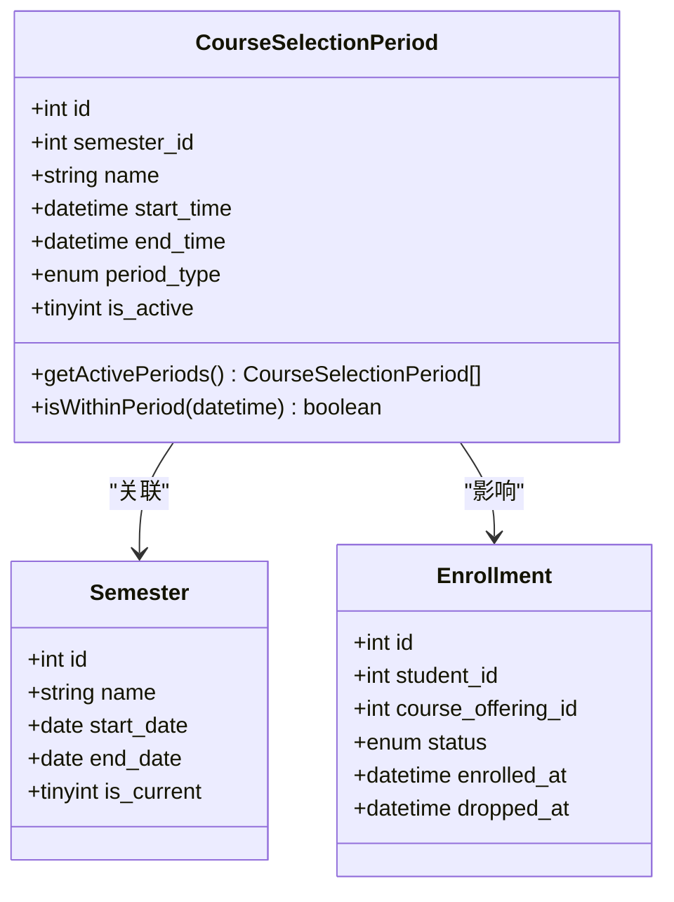
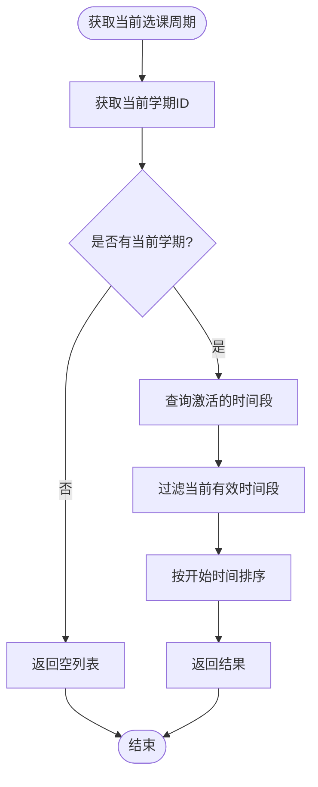
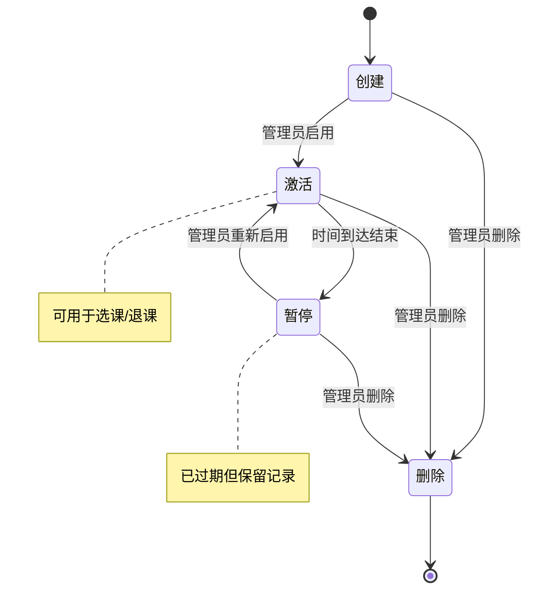
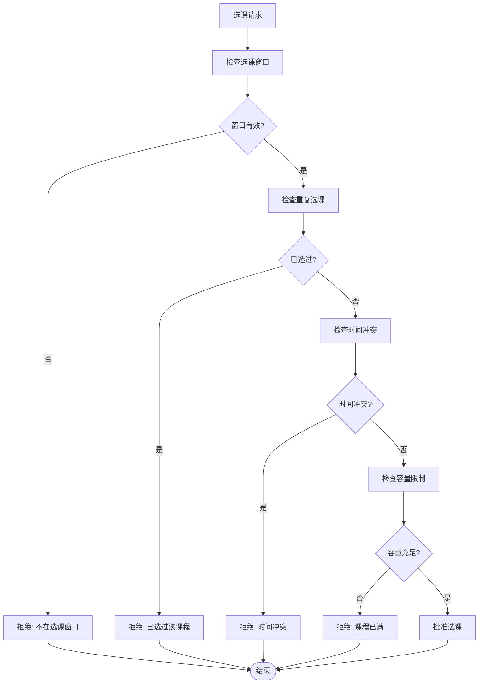
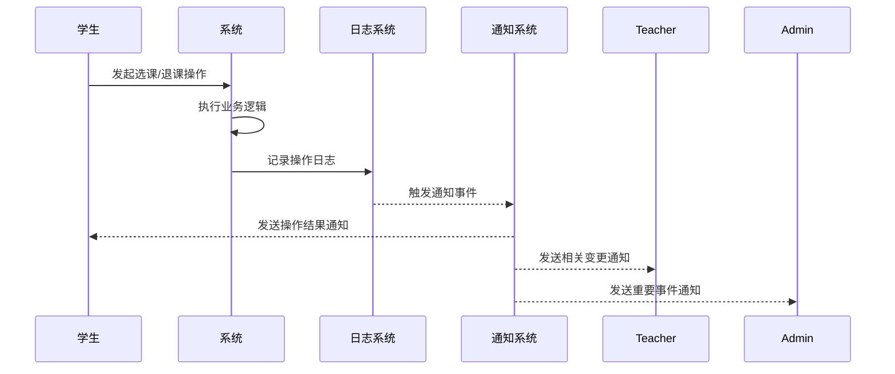
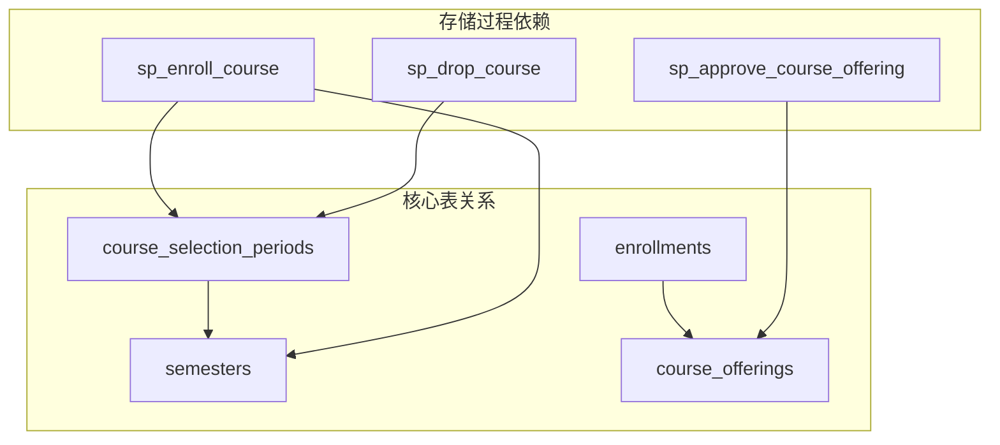

# 选课时间段管理API

<cite>
**本文档引用的文件**
- [app/admin/routes.py](file://app/admin/routes.py)
- [sql/01_schema.sql](file://sql/01_schema.sql)
- [sql/03_procedures.sql](file://sql/03_procedures.sql)
- [app/helpers.py](file://app/helpers.py)
- [app/db.py](file://app/db.py)
- [app/templates/admin/selection_periods.html](file://app/templates/admin/selection_periods.html)
- [app/__init__.py](file://app/__init__.py)
- [config.py](file://config.py)
</cite>

## 目录
1. [简介](#简介)
2. [项目结构](#项目结构)
3. [核心组件](#核心组件)
4. [架构概览](#架构概览)
5. [详细组件分析](#详细组件分析)
6. [依赖关系分析](#依赖关系分析)
7. [性能考虑](#性能考虑)
8. [故障排除指南](#故障排除指南)
9. [结论](#结论)

## 简介

选课时间段管理API是校园教务选课与成绩管理系统的核心功能模块，负责管理学期内的选课和退课时间段配置。该系统支持多种选课周期类型，包括第一轮选课、补选、重修等不同类型的配置，并提供完整的时间窗口设置、周期查询、状态管理和冲突检测功能。

系统采用Flask框架构建，使用MySQL数据库存储所有选课相关数据，通过存储过程实现复杂的业务逻辑，确保数据一致性和事务完整性。

## 项目结构

选课时间段管理功能主要分布在以下模块中：

**图表来源**
- [app/admin/routes.py:442-488](file://app/admin/routes.py#L442-L488)
- [sql/01_schema.sql:200-215](file://sql/01_schema.sql#L200-L215)
- [app/db.py:1-121](file://app/db.py#L1-L121)

**章节来源**
- [app/admin/routes.py:1-692](file://app/admin/routes.py#L1-L692)
- [sql/01_schema.sql:1-235](file://sql/01_schema.sql#L1-L235)

## 核心组件

### 数据模型

选课时间段管理的核心数据模型由course_selection_periods表定义，包含以下关键字段：

| 字段名 | 类型 | 描述 | 约束 |
|--------|------|------|------|
| id | INT | 主键标识 | AUTO_INCREMENT |
| semester_id | INT | 关联学期ID | 外键引用semesters表 |
| name | VARCHAR(100) | 时间段名称 | 非空 |
| start_time | DATETIME | 开始时间 | 非空 |
| end_time | DATETIME | 结束时间 | 非空 |
| period_type | ENUM('selection','drop') | 周期类型 | 非空，默认'selection' |
| is_active | TINYINT(1) | 是否激活 | 非空，默认1 |

### 业务流程

系统支持两种主要的选课周期类型：

1. **选课周期 (selection)**: 学生进行课程选择的时间窗口
2. **退课周期 (drop)**: 学生进行课程退选的时间窗口

每个学期可以配置多个时间段，系统会根据当前学期和时间条件自动筛选有效的选课时间段。

**章节来源**
- [sql/01_schema.sql:200-215](file://sql/01_schema.sql#L200-L215)
- [app/admin/routes.py:442-488](file://app/admin/routes.py#L442-L488)

## 架构概览

选课时间段管理采用三层架构设计：

**图表来源**
- [app/admin/routes.py:442-488](file://app/admin/routes.py#L442-L488)
- [app/db.py:43-89](file://app/db.py#L43-L89)

## 详细组件分析

### 选课周期类型定义接口

#### 接口定义

系统支持两种选课周期类型，通过period_type字段区分：

| 类型 | 值 | 描述 | 功能影响 |
|------|-----|------|----------|
| 选课 | selection | 学生进行课程选择 | 触发sp_enroll_course存储过程 |
| 退课 | drop | 学生进行课程退选 | 触发sp_drop_course存储过程 |

#### 数据结构

**图表来源**
- [sql/01_schema.sql:200-215](file://sql/01_schema.sql#L200-L215)
- [sql/01_schema.sql:97-108](file://sql/01_schema.sql#L97-L108)

**章节来源**
- [sql/01_schema.sql:200-215](file://sql/01_schema.sql#L200-L215)
- [app/helpers.py:66-79](file://app/helpers.py#L66-L79)

### 选课时间窗口设置接口

#### 接口规范

系统提供完整的RESTful API用于管理选课时间段：

| 方法 | 路径 | 描述 | 请求参数 | 响应 |
|------|------|------|----------|------|
| GET | /admin/selection-periods | 获取所有时间段列表 | 无 | JSON数组 |
| POST | /admin/selection-periods/add | 添加新时间段 | 表单数据 | 重定向 |
| POST | /admin/selection-periods/<pid>/edit | 编辑时间段 | 表单数据 | 重定向 |
| POST | /admin/selection-periods/<pid>/toggle | 切换激活状态 | 无 | 重定向 |
| POST | /admin/selection-periods/<pid>/delete | 删除时间段 | 无 | 重定向 |

#### 时间窗口参数

每个时间段包含以下关键参数：

- **开始时间 (start_time)**: 选课窗口的起始时刻
- **结束时间 (end_time)**: 选课窗口的终止时刻  
- **持续天数**: 通过结束时间减去开始时间计算
- **允许退课时间**: 通过period_type区分选课和退课窗口

**章节来源**
- [app/admin/routes.py:442-488](file://app/admin/routes.py#L442-L488)
- [app/templates/admin/selection_periods.html:31-52](file://app/templates/admin/selection_periods.html#L31-L52)

### 选课周期查询接口

#### 当前周期获取

系统提供专门的辅助函数获取当前生效的选课时间段：

**图表来源**
- [app/helpers.py:66-79](file://app/helpers.py#L66-L79)

#### 历史周期查询

系统支持查询特定学期的历史选课时间段，通过semester_id参数过滤：

- **参数**: semester_id (可选)
- **返回**: 指定学期内的所有时间段记录
- **排序**: 按ID降序排列

#### 周期状态检查

提供实时的状态检查功能，判断当前是否处于有效的选课或退课窗口内。

**章节来源**
- [app/helpers.py:66-79](file://app/helpers.py#L66-L79)
- [app/admin/routes.py:442-448](file://app/admin/routes.py#L442-L448)

### 选课周期状态管理接口

#### 周期生命周期管理

**图表来源**
- [app/admin/routes.py:475-481](file://app/admin/routes.py#L475-L481)

#### 状态转换规则

| 当前状态 | 可执行操作 | 新状态 | 业务影响 |
|----------|------------|--------|----------|
| 创建 | 启用 | 激活 | 可进行选课/退课 |
| 创建 | 删除 | 删除 | 彻底移除记录 |
| 激活 | 暂停 | 暂停 | 停止选课/退课功能 |
| 激活 | 删除 | 删除 | 彻底移除记录 |
| 暂停 | 启用 | 激活 | 恢复选课/退课功能 |
| 暂停 | 删除 | 删除 | 彻底移除记录 |

**章节来源**
- [app/admin/routes.py:475-481](file://app/admin/routes.py#L475-L481)

### 选课周期冲突检测接口

#### 冲突检测机制

系统通过存储过程实现智能的冲突检测：

**图表来源**
- [sql/03_procedures.sql:14-113](file://sql/03_procedures.sql#L14-L113)

#### 冲突类型识别

系统能够检测以下类型的冲突：

1. **时间冲突**: 课程时间安排重叠
2. **容量冲突**: 课程达到最大选课人数
3. **状态冲突**: 课程未发布或不在有效窗口内
4. **重复冲突**: 学生重复选同一门课程

**章节来源**
- [sql/03_procedures.sql:14-113](file://sql/03_procedures.sql#L14-L113)

### 选课周期通知接口

#### 通知机制

系统通过存储过程和触发器实现自动化的通知和日志记录：

**图表来源**
- [sql/03_procedures.sql:326-378](file://sql/03_procedures.sql#L326-L378)
- [app/helpers.py:9-21](file://app/helpers.py#L9-L21)

#### 通知类型

系统支持多种类型的自动化通知：

- **操作成功通知**: 选课/退课成功后的确认通知
- **操作失败通知**: 由于各种原因导致的操作失败通知
- **状态变更通知**: 课程状态变化时的通知
- **系统维护通知**: 系统维护期间的重要通知

**章节来源**
- [app/helpers.py:9-21](file://app/helpers.py#L9-L21)
- [sql/03_procedures.sql:326-378](file://sql/03_procedures.sql#L326-L378)

## 依赖关系分析

### 数据库依赖

**图表来源**
- [sql/01_schema.sql:200-215](file://sql/01_schema.sql#L200-L215)
- [sql/03_procedures.sql:14-194](file://sql/03_procedures.sql#L14-L194)

### 应用层依赖

系统采用模块化设计，各组件之间的依赖关系清晰：

- **路由层**: 依赖数据库工具和权限装饰器
- **模板层**: 依赖路由层提供的数据
- **工具层**: 被路由层和模板层共同依赖

**章节来源**
- [app/admin/routes.py:1-10](file://app/admin/routes.py#L1-L10)
- [app/db.py:1-121](file://app/db.py#L1-L121)

## 性能考虑

### 数据库优化

1. **索引策略**: 在course_selection_periods表上建立了复合索引，优化查询性能
2. **连接池**: 使用DBUtils连接池减少数据库连接开销
3. **事务管理**: 通过存储过程实现原子性操作，避免数据不一致

### 缓存策略

系统采用以下缓存策略：
- **连接池缓存**: 预分配数据库连接，提高响应速度
- **查询结果缓存**: 对频繁访问的配置数据进行缓存
- **会话缓存**: 使用Flask-Login管理用户会话状态

### 并发控制

通过以下机制保证并发安全性：
- **行级锁**: 在存储过程中使用FOR UPDATE锁定相关记录
- **事务隔离**: 使用MySQL的事务特性保证数据一致性
- **乐观锁**: 在某些场景下使用版本号防止并发修改冲突

## 故障排除指南

### 常见问题及解决方案

#### 1. 选课失败问题

**症状**: 学生无法选课，系统提示"不在选课窗口内"

**可能原因**:
- 选课时间段未激活
- 当前时间不在有效窗口内
- 课程未发布

**解决步骤**:
1. 检查course_selection_periods表中的is_active字段
2. 验证当前时间是否在start_time和end_time范围内
3. 确认相关课程的status为'published'

#### 2. 时间冲突检测问题

**症状**: 系统报告时间冲突，但实际没有冲突

**可能原因**:
- 课表格式不规范
- 正则表达式匹配错误

**解决步骤**:
1. 检查parse_schedule_slots函数的输入格式
2. 验证课表字符串的标准化处理
3. 确认DAY_MAP映射关系正确

#### 3. 数据库连接问题

**症状**: 系统无法连接到数据库

**可能原因**:
- 数据库配置错误
- 连接池耗尽
- 网络连接异常

**解决步骤**:
1. 检查config.py中的数据库配置
2. 验证DB_POOL_MAX_CONNECTIONS设置
3. 确认数据库服务正常运行

**章节来源**
- [app/helpers.py:23-63](file://app/helpers.py#L23-L63)
- [config.py:11-22](file://config.py#L11-L22)

## 结论

选课时间段管理API提供了完整、可靠的选课周期管理功能。系统通过合理的数据模型设计、完善的业务逻辑实现和高效的存储过程调用，确保了选课系统的稳定性和可靠性。

主要特点包括：
- **灵活的周期类型支持**: 支持选课和退课两种周期类型
- **智能的冲突检测**: 通过存储过程实现复杂的时间冲突检测
- **完整的状态管理**: 提供从创建到删除的全生命周期管理
- **自动化的通知机制**: 通过触发器实现自动化的日志记录和通知
- **高性能的设计**: 采用连接池和索引优化提升系统性能

该系统为校园教务选课与成绩管理提供了坚实的技术基础，能够满足复杂的选课管理需求。