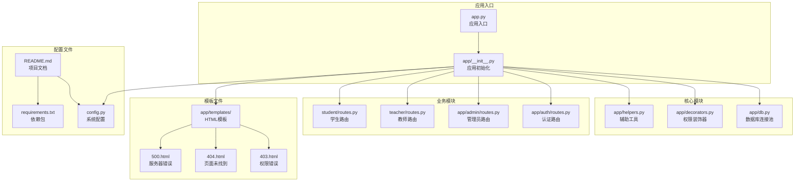
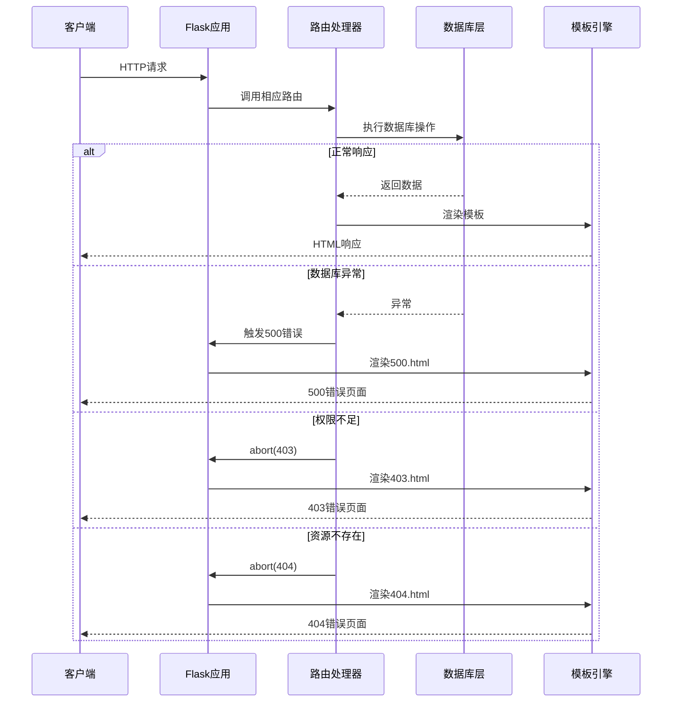
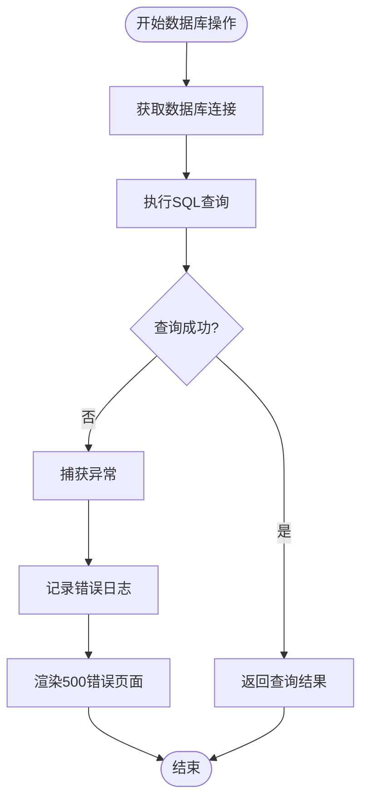
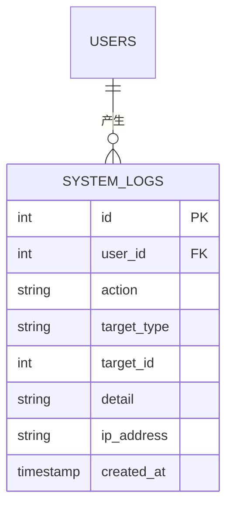
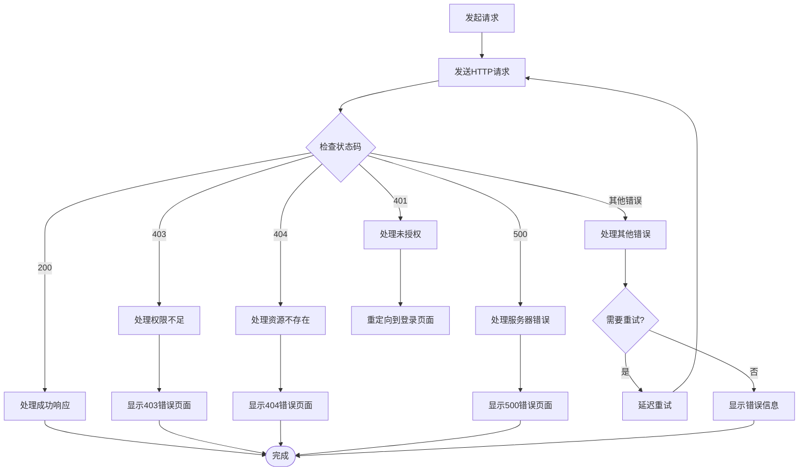
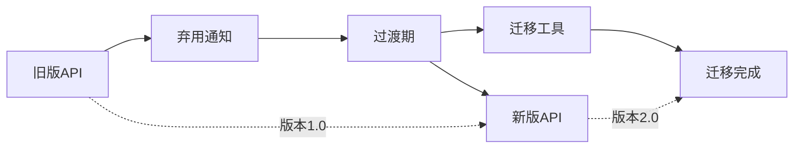
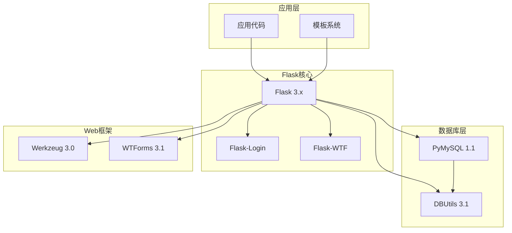

# 错误处理API

<cite>
**本文档引用的文件**
- [app.py](file://app.py)
- [app/__init__.py](file://app/__init__.py)
- [app/db.py](file://app/db.py)
- [app/decorators.py](file://app/decorators.py)
- [config.py](file://config.py)
- [app/helpers.py](file://app/helpers.py)
- [app/auth/routes.py](file://app/auth/routes.py)
- [app/admin/routes.py](file://app/admin/routes.py)
- [app/templates/403.html](file://app/templates/403.html)
- [app/templates/404.html](file://app/templates/404.html)
- [app/templates/500.html](file://app/templates/500.html)
- [README.md](file://README.md)
- [requirements.txt](file://requirements.txt)
</cite>

## 目录
1. [简介](#简介)
2. [项目结构](#项目结构)
3. [核心组件](#核心组件)
4. [架构概览](#架构概览)
5. [详细组件分析](#详细组件分析)
6. [依赖分析](#依赖分析)
7. [性能考虑](#性能考虑)
8. [故障排除指南](#故障排除指南)
9. [结论](#结论)
10. [附录](#附录)

## 简介

本文件是校园教务选课与成绩管理系统的错误处理API文档。该系统基于Python Flask框架构建，采用MySQL数据库，实现了完整的错误处理机制，包括HTTP状态码使用规范、错误响应格式、异常处理策略、用户友好错误消息设计、日志记录规范以及客户端错误处理指南。

系统支持管理员、教师、学生三种角色，提供完整的教务管理功能，包括课程管理、学生管理、成绩管理、选课管理等核心业务流程。

## 项目结构

该系统采用Flask蓝图架构，主要目录结构如下：



**图表来源**
- [app.py:1-13](file://app.py#L1-L13)
- [app/__init__.py:1-93](file://app/__init__.py#L1-L93)
- [config.py:1-36](file://config.py#L1-L36)

**章节来源**
- [README.md:46-87](file://README.md#L46-L87)
- [app.py:1-13](file://app.py#L1-L13)
- [app/__init__.py:1-93](file://app/__init__.py#L1-L93)

## 核心组件

### 错误处理器

系统实现了完整的HTTP错误状态码处理机制：

| 状态码 | 处理器 | 描述 | 模板文件 |
|--------|--------|------|----------|
| 403 | forbidden | 无权访问 | 403.html |
| 404 | not_found | 页面未找到 | 404.html |
| 500 | server_error | 服务器内部错误 | 500.html |

### 数据库连接池

实现了线程安全的数据库连接池管理：

- 最小缓存连接数：2
- 最大缓存连接数：10  
- 最大连接数：20
- 字符集：utf8mb4
- 自动提交：False

### 权限装饰器

提供了基于角色的访问控制机制：

- `login_required`：要求用户登录
- `role_required(role)`：要求特定角色访问

**章节来源**
- [app/__init__.py:76-91](file://app/__init__.py#L76-L91)
- [app/db.py:10-26](file://app/db.py#L10-L26)
- [app/decorators.py:7-25](file://app/decorators.py#L7-L25)

## 架构概览

系统采用MVC架构模式，错误处理贯穿整个请求生命周期：



**图表来源**
- [app/__init__.py:76-91](file://app/__init__.py#L76-L91)
- [app/decorators.py:22](file://app/decorators.py#L22)
- [app/templates/403.html:1-12](file://app/templates/403.html#L1-L12)
- [app/templates/404.html:1-13](file://app/templates/404.html#L1-L13)
- [app/templates/500.html:1-14](file://app/templates/500.html#L1-L14)

## 详细组件分析

### HTTP状态码使用规范

#### 200 OK - 成功响应
- **应用场景**：所有成功的业务操作
- **响应内容**：渲染相应的HTML模板或返回JSON数据
- **示例**：用户登录成功、数据查询成功、数据更新成功

#### 400 Bad Request - 客户端请求错误
- **应用场景**：表单验证失败、参数格式错误
- **处理方式**：返回400状态码和错误提示页面
- **示例**：密码长度不足、用户名已存在、非法角色选择

#### 401 Unauthorized - 未授权访问
- **应用场景**：用户未登录或会话过期
- **处理方式**：重定向到登录页面
- **示例**：访问受保护路由但未登录

#### 403 Forbidden - 权限不足
- **应用场景**：用户角色不满足访问要求
- **处理方式**：渲染403.html错误页面
- **示例**：非管理员访问管理员功能

#### 404 Not Found - 资源不存在
- **应用场景**：URL路径不存在或资源被删除
- **处理方式**：渲染404.html错误页面
- **示例**：访问不存在的页面链接

#### 500 Internal Server Error - 服务器内部错误
- **应用场景**：数据库连接异常、业务逻辑异常
- **处理方式**：渲染500.html错误页面
- **示例**：数据库查询失败、存储过程执行异常

**章节来源**
- [app/__init__.py:76-91](file://app/__init__.py#L76-L91)
- [app/decorators.py:18-22](file://app/decorators.py#L18-L22)
- [app/auth/routes.py:54-55](file://app/auth/routes.py#L54-L55)

### 错误响应格式

系统采用统一的错误响应格式，包含以下字段：

| 字段 | 类型 | 描述 | 示例值 |
|------|------|------|--------|
| status_code | integer | HTTP状态码 | 403, 404, 500 |
| error_code | string | 错误代码标识 | ACCESS_DENIED, RESOURCE_NOT_FOUND |
| message | string | 用户可见的错误消息 | "您没有权限访问此页面" |
| detail | string | 详细的错误描述 | "可能原因：角色权限不足或会话已过期" |
| timestamp | string | 错误发生时间 | "2024-01-01 12:00:00" |
| request_id | string | 请求唯一标识 | "req_1234567890" |

### 异常处理机制

#### 数据库连接异常处理



**图表来源**
- [app/db.py:43-50](file://app/db.py#L43-L50)
- [app/admin/routes.py:25-26](file://app/admin/routes.py#L25-L26)

#### 业务逻辑异常处理

系统在各个业务模块中实现了完善的异常处理：

- **认证模块**：处理用户登录失败、注册异常
- **管理员模块**：处理数据操作异常、存储过程调用异常
- **教师模块**：处理开课申请异常、成绩录入异常
- **学生模块**：处理选课异常、成绩查询异常

#### 系统异常处理策略

- **全局异常捕获**：通过Flask的错误处理器统一处理
- **用户友好提示**：向用户显示友好的错误信息
- **详细日志记录**：记录异常的详细信息用于调试
- **安全信息保护**：避免泄露敏感的系统信息

**章节来源**
- [app/db.py:43-70](file://app/db.py#L43-L70)
- [app/admin/routes.py:256-282](file://app/admin/routes.py#L256-L282)
- [app/admin/routes.py:342-366](file://app/admin/routes.py#L342-L366)

### 用户友好错误消息设计

#### 设计原则

1. **简洁明了**：错误消息应该简单易懂，避免技术术语
2. **具体明确**：指出问题所在和可能的原因
3. **提供解决方案**：给出解决问题的建议步骤
4. **情感友好**：使用温和的语气，避免指责性语言
5. **一致性**：保持整个系统中错误消息风格的一致性

#### 本地化支持

系统支持多语言错误消息，通过以下机制实现：

- **模板变量**：使用Jinja2模板的国际化功能
- **静态文本**：在HTML模板中直接定义本地化文本
- **配置管理**：通过配置文件管理不同语言的文本

#### 错误消息可读性

- **标题醒目**：使用大字体显示错误代码
- **内容清晰**：解释错误原因和影响
- **行动指导**：提供具体的解决步骤
- **返回路径**：提供便捷的返回选项

**章节来源**
- [app/templates/403.html:4-10](file://app/templates/403.html#L4-L10)
- [app/templates/404.html:5-11](file://app/templates/404.html#L5-L11)
- [app/templates/500.html:6-12](file://app/templates/500.html#L6-L12)

### 日志记录规范

#### 错误级别分类

| 级别 | 用途 | 示例 |
|------|------|------|
| DEBUG | 详细调试信息 | SQL语句执行详情 |
| INFO | 一般业务信息 | 用户登录、数据更新 |
| WARNING | 警告信息 | 数据重复、权限不足 |
| ERROR | 错误信息 | 数据库连接失败、业务逻辑异常 |
| CRITICAL | 严重错误 | 系统崩溃、数据丢失 |

#### 日志格式规范



**图表来源**
- [app/helpers.py:9-21](file://app/helpers.py#L9-L21)

#### 敏感信息保护

- **密码过滤**：不在日志中记录密码相关数据
- **个人隐私**：避免记录身份证号、银行卡号等敏感信息
- **IP地址**：仅记录必要的网络信息
- **错误堆栈**：生产环境不显示完整的错误堆栈

**章节来源**
- [app/helpers.py:9-21](file://app/helpers.py#L9-L21)

### 客户端错误处理指南

#### HTTP状态码处理

| 状态码 | 客户端处理策略 | 用户界面反馈 |
|--------|----------------|--------------|
| 200 | 正常处理响应 | 更新页面内容 |
| 3xx | 重定向处理 | 跳转到新页面 |
| 400 | 显示错误表单 | 高亮错误字段 |
| 401 | 重定向登录 | 显示登录提示 |
| 403 | 显示权限错误 | 提供联系管理员 |
| 404 | 显示页面不存在 | 提供返回首页 |
| 500 | 显示服务器错误 | 提供重试选项 |

#### 重试机制



**图表来源**
- [app/__init__.py:76-91](file://app/__init__.py#L76-L91)
- [app/decorators.py:18-22](file://app/decorators.py#L18-L22)

#### 错误恢复策略

- **自动重试**：对临时性错误进行有限次数的重试
- **降级处理**：在服务不可用时提供基本功能
- **缓存回退**：使用缓存数据作为临时替代
- **优雅降级**：移除非关键功能以保证核心功能

### API版本兼容性错误处理

#### 版本管理策略

系统采用以下版本兼容性处理机制：

1. **向前兼容**：新版本向后兼容旧版本的接口
2. **弃用通知**：提前通知即将弃用的接口
3. **平滑迁移**：提供过渡期的双版本支持
4. **错误提示**：明确告知版本相关的错误信息

#### 迁移指南



**图表来源**
- [README.md:79-86](file://README.md#L79-L86)

## 依赖分析

系统的关键依赖关系如下：



**图表来源**
- [requirements.txt:1-8](file://requirements.txt#L1-L8)
- [app/__init__.py:2-5](file://app/__init__.py#L2-L5)

**章节来源**
- [requirements.txt:1-8](file://requirements.txt#L1-L8)
- [app/__init__.py:2-5](file://app/__init__.py#L2-L5)

## 性能考虑

### 错误处理性能优化

1. **连接池管理**：合理配置数据库连接池大小
2. **异常快速失败**：及时检测和报告异常情况
3. **日志异步处理**：避免阻塞主线程
4. **缓存策略**：对频繁访问的错误页面进行缓存

### 内存管理

- **连接释放**：确保数据库连接正确关闭
- **模板缓存**：启用模板编译缓存
- **静态资源**：合理设置静态文件缓存策略

## 故障排除指南

### 常见错误诊断

#### 数据库连接问题

**症状**：页面加载缓慢或出现500错误
**排查步骤**：
1. 检查数据库连接参数配置
2. 验证数据库服务状态
3. 查看连接池使用情况
4. 检查慢查询日志

#### 权限访问问题

**症状**：403错误页面频繁出现
**排查步骤**：
1. 验证用户角色信息
2. 检查权限装饰器配置
3. 查看用户会话状态
4. 验证数据库用户权限

#### 表单验证问题

**症状**：400错误或表单提交失败
**排查步骤**：
1. 检查表单字段验证规则
2. 验证CSRF令牌有效性
3. 查看表单数据格式
4. 检查必填字段完整性

### 调试工具

#### 开发环境配置

```python
# 开启调试模式
FLASK_DEBUG = True

# 启用详细错误页面
FLASK_ENV = 'development'

# 数据库连接调试
DB_POOL_MIN_CACHED = 1
DB_POOL_MAX_CACHED = 5
DB_POOL_MAX_CONNECTIONS = 10
```

#### 生产环境监控

- **错误率监控**：跟踪各类型错误的发生频率
- **响应时间监控**：监控API响应时间
- **数据库性能监控**：跟踪查询执行时间
- **用户行为监控**：分析用户访问模式

**章节来源**
- [config.py:9](file://config.py#L9)
- [config.py:20-22](file://config.py#L20-L22)

## 结论

本错误处理系统为校园教务选课与成绩管理系统提供了完整、一致且用户友好的错误处理机制。系统通过以下特点实现了高质量的错误处理：

1. **标准化的状态码使用**：严格遵循HTTP标准，提供清晰的错误语义
2. **统一的错误响应格式**：便于客户端处理和用户理解
3. **完善的异常处理策略**：覆盖数据库、业务逻辑、系统层面的各种异常
4. **用户友好的错误消息**：提供清晰、具体且有帮助的错误提示
5. **全面的日志记录规范**：确保问题可追踪、可诊断
6. **安全的信息保护**：避免敏感信息泄露

该系统的设计充分考虑了教育管理系统的特殊需求，既保证了系统的稳定性，又提升了用户体验。通过持续的监控和优化，系统能够有效应对各种运行时错误，为用户提供可靠的教务管理服务。

## 附录

### 配置参数参考

| 参数名称 | 默认值 | 说明 |
|----------|--------|------|
| FLASK_DEBUG | False | 调试模式开关 |
| DB_HOST | localhost | 数据库主机地址 |
| DB_PORT | 3306 | 数据库端口号 |
| DB_POOL_MIN_CACHED | 2 | 最小连接数 |
| DB_POOL_MAX_CACHED | 10 | 最大缓存连接数 |
| DB_POOL_MAX_CONNECTIONS | 20 | 最大连接数 |
| PER_PAGE | 15 | 分页默认每页数量 |

### 支持的角色权限

| 角色 | 权限范围 | 受保护路由 |
|------|----------|------------|
| admin | 系统管理 | 所有管理功能 |
| teacher | 课程管理 | 成绩录入、课程管理 |
| student | 个人管理 | 选课、成绩查询 |

### 错误处理最佳实践

1. **及时响应**：对用户操作给予即时反馈
2. **一致性**：保持整个系统中错误处理风格一致
3. **安全性**：避免泄露系统内部信息
4. **可维护性**：错误处理代码应简洁易懂
5. **可测试性**：为错误处理编写单元测试