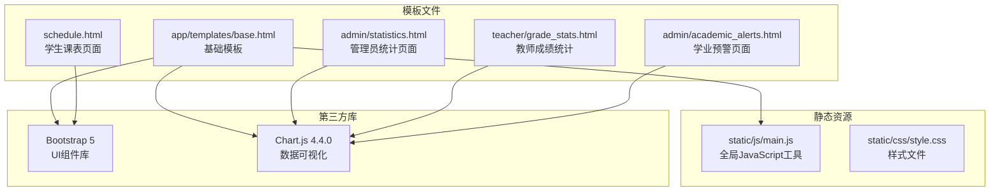
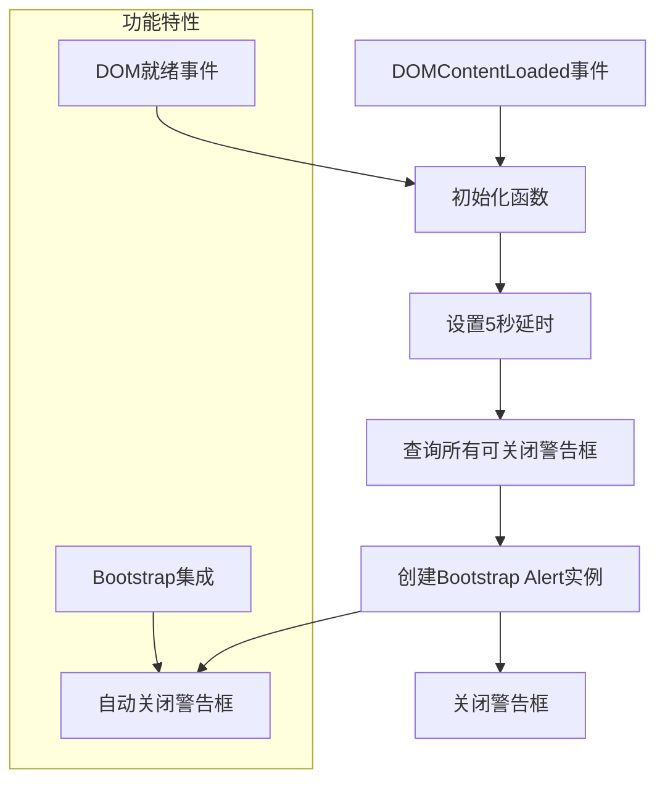
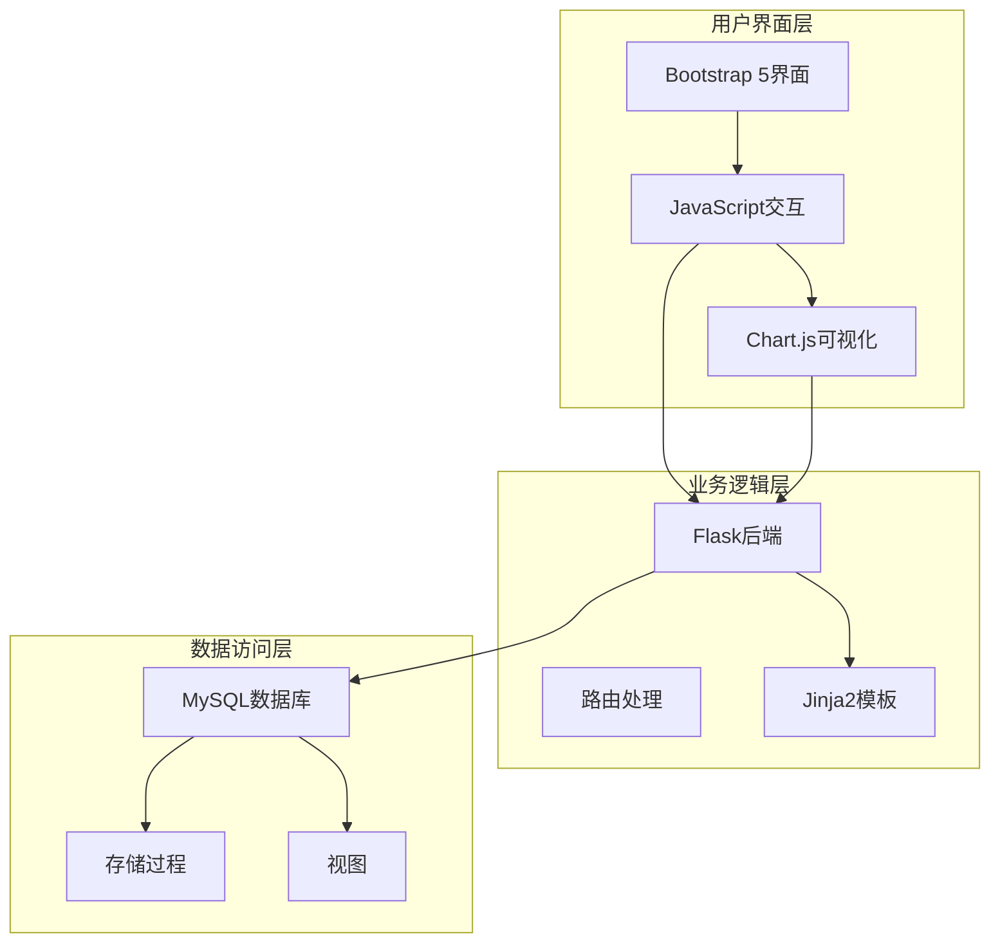
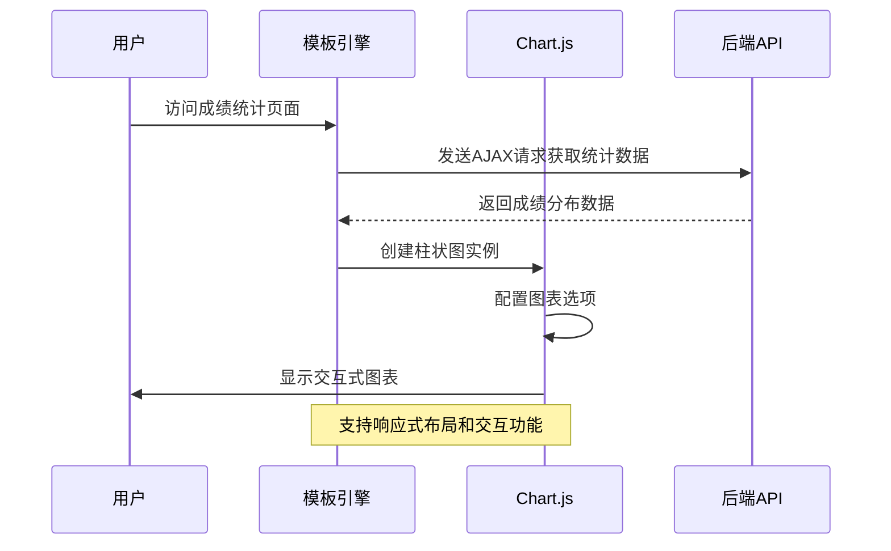
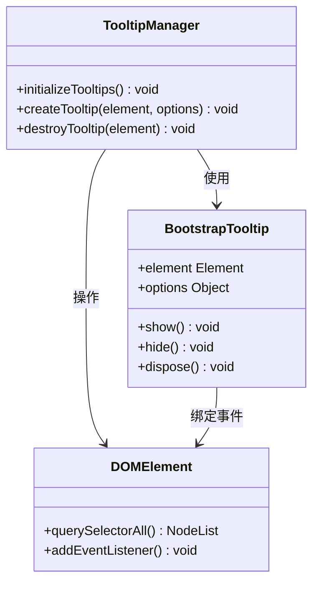
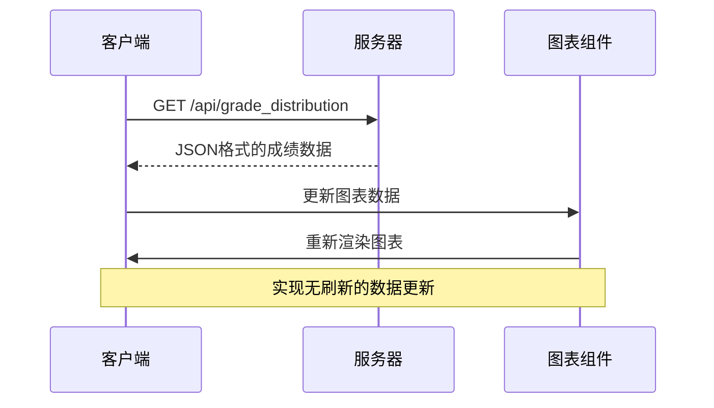
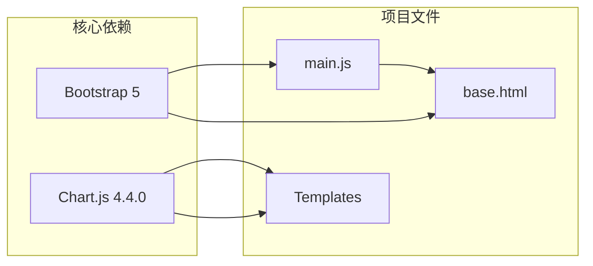

# JavaScript交互功能

<cite>
**本文档引用的文件**
- [main.js](file://static/js/main.js)
- [base.html](file://app/templates/base.html)
- [statistics.html](file://app/templates/admin/statistics.html)
- [grade_stats.html](file://app/templates/teacher/grade_stats.html)
- [academic_alerts.html](file://app/templates/admin/academic_alerts.html)
- [schedule.html](file://app/templates/student/schedule.html)
- [README.md](file://README.md)
</cite>

## 目录
1. [引言](#引言)
2. [项目结构](#项目结构)
3. [核心组件](#核心组件)
4. [架构概览](#架构概览)
5. [详细组件分析](#详细组件分析)
6. [依赖关系分析](#依赖关系分析)
7. [性能考虑](#性能考虑)
8. [故障排除指南](#故障排除指南)
9. [结论](#结论)

## 引言

本项目是一个基于Python Flask框架开发的校园教务选课与成绩管理系统，采用Bootstrap 5 + Jinja2 + Chart.js的技术栈。本文档专注于JavaScript交互功能的详细技术分析，涵盖Chart.js数据可视化集成、Bootstrap组件增强、动态内容更新机制以及事件监听器管理等方面。

项目采用前后端分离的设计模式，后端使用Flask提供RESTful API接口，前端使用Bootstrap 5构建响应式界面，Chart.js用于数据可视化展示。系统支持管理员、教师、学生三种角色，每个角色都有特定的功能权限和界面布局。

## 项目结构

项目采用模块化组织结构，JavaScript相关的核心文件位于static/js目录下，主要包含全局JavaScript工具函数。前端模板文件位于app/templates目录，采用Jinja2模板引擎进行渲染。

**图表来源**
- [main.js:1-11](file://static/js/main.js#L1-L11)
- [base.html:75-77](file://app/templates/base.html#L75-L77)

**章节来源**
- [README.md:6-10](file://README.md#L6-L10)
- [base.html:67-77](file://app/templates/base.html#L67-L77)

## 核心组件

### 全局JavaScript工具 (main.js)

项目的核心JavaScript工具位于main.js文件中，提供了全局的交互功能支持。该文件在DOM加载完成后自动初始化，主要负责自动关闭可关闭的警告框功能。

**图表来源**
- [main.js:2-9](file://static/js/main.js#L2-L9)

### Bootstrap组件集成

项目在基础模板中集成了Bootstrap 5组件，包括导航栏、侧边栏、模态框等。通过CDN引入Bootstrap JavaScript库，确保所有Bootstrap组件的正常运行。

**章节来源**
- [main.js:1-11](file://static/js/main.js#L1-L11)
- [base.html:75-85](file://app/templates/base.html#L75-L85)

## 架构概览

系统采用三层架构设计，JavaScript层负责用户交互和数据展示，后端Flask提供API服务，数据库层处理数据持久化。

**图表来源**
- [base.html:75-77](file://app/templates/base.html#L75-L77)
- [README.md:7-9](file://README.md#L7-L9)

## 详细组件分析

### Chart.js数据可视化集成

项目实现了多种类型的图表展示，包括柱状图、环形图等，用于展示统计数据和分析结果。

#### 成绩分布统计图表

在教师成绩统计页面中，使用Chart.js创建了成绩分布的柱状图：

**图表来源**
- [grade_stats.html:29-46](file://app/templates/teacher/grade_stats.html#L29-L46)

#### 管理员统计图表

管理员统计页面使用柱状图展示学生成绩分布情况：

**章节来源**
- [statistics.html:52-62](file://app/templates/admin/statistics.html#L52-L62)

#### 学业风险分析图表

在学业预警页面中，使用环形图展示不同风险级别的学生分布：

**章节来源**
- [academic_alerts.html:180-198](file://app/templates/admin/academic_alerts.html#L180-L198)

### Bootstrap组件JavaScript增强

项目充分利用Bootstrap 5的JavaScript组件，提供丰富的用户交互体验。

#### 工具提示系统

在学生课表页面中，实现了基于Bootstrap Tooltip的工具提示功能：

**图表来源**
- [schedule.html:93-94](file://app/templates/student/schedule.html#L93-L94)

#### 侧边栏交互功能

基础模板中实现了侧边栏的展开/收起功能：

**章节来源**
- [base.html:79-84](file://app/templates/base.html#L79-L84)

### 动态内容更新机制

项目采用多种方式实现动态内容更新，提升用户体验：

#### AJAX数据加载

教师成绩统计页面使用AJAX异步加载数据，避免页面刷新：

**图表来源**
- [grade_stats.html:29-46](file://app/templates/teacher/grade_stats.html#L29-L46)

#### 自动消息提示

全局JavaScript工具实现了自动关闭的消息提示功能：

**章节来源**
- [main.js:3-9](file://static/js/main.js#L3-L9)

### 事件监听器管理

项目中的事件监听器采用了合理的管理模式，确保内存安全和性能优化。

#### DOM就绪事件处理

所有JavaScript功能都在DOM加载完成后执行，避免元素未就绪导致的问题：

**章节来源**
- [main.js:2-2](file://static/js/main.js#L2-L2)
- [base.html:79-85](file://app/templates/base.html#L79-L85)

## 依赖关系分析

系统JavaScript功能的依赖关系清晰明确，主要依赖于Bootstrap 5和Chart.js两个核心库。

**图表来源**
- [base.html:75-77](file://app/templates/base.html#L75-L77)
- [main.js:1-11](file://static/js/main.js#L1-L11)

**章节来源**
- [base.html:75-77](file://app/templates/base.html#L75-L77)
- [README.md:9-9](file://README.md#L9-L9)

## 性能考虑

### 资源加载优化

项目采用CDN加载第三方库，减少本地带宽占用，提高加载速度。

### 内存管理

JavaScript代码遵循最佳实践，避免内存泄漏：
- 使用事件委托减少事件监听器数量
- 及时清理定时器和事件监听器
- 合理使用闭包避免循环引用

### 响应式设计

所有图表和组件都支持响应式布局，在不同设备上提供一致的用户体验。

## 故障排除指南

### 常见问题及解决方案

#### 图表不显示问题

**症状**: Chart.js图表无法正常显示
**原因**: 可能是Canvas元素不存在或数据格式不正确
**解决方法**: 检查模板中Canvas元素的ID是否正确，确认数据格式符合Chart.js要求

#### Bootstrap组件失效

**症状**: 模态框、工具提示等功能不工作
**原因**: Bootstrap JavaScript库未正确加载
**解决方法**: 确认CDN链接有效，检查浏览器控制台是否有错误信息

#### 事件监听器冲突

**症状**: 页面交互功能异常
**原因**: 多个JavaScript文件对同一元素绑定事件
**解决方法**: 确保事件监听器只绑定一次，使用适当的事件命名空间

**章节来源**
- [main.js:1-11](file://static/js/main.js#L1-L11)
- [base.html:75-85](file://app/templates/base.html#L75-L85)

## 结论

本项目在JavaScript交互功能方面实现了以下关键特性：

1. **完整的数据可视化集成**: 通过Chart.js实现了多种图表类型的动态展示
2. **Bootstrap组件增强**: 充分利用Bootstrap 5的JavaScript组件提供丰富的交互体验
3. **动态内容更新**: 采用AJAX技术实现无刷新的数据更新和页面交互
4. **事件管理优化**: 采用合理的事件监听器管理模式，确保内存安全和性能
5. **响应式设计**: 所有功能都支持移动端和桌面端的响应式布局

项目的技术架构清晰，代码结构合理，为后续的功能扩展和维护奠定了良好的基础。通过采用渐进增强的策略，系统能够在不同浏览器环境下提供一致的功能体验。