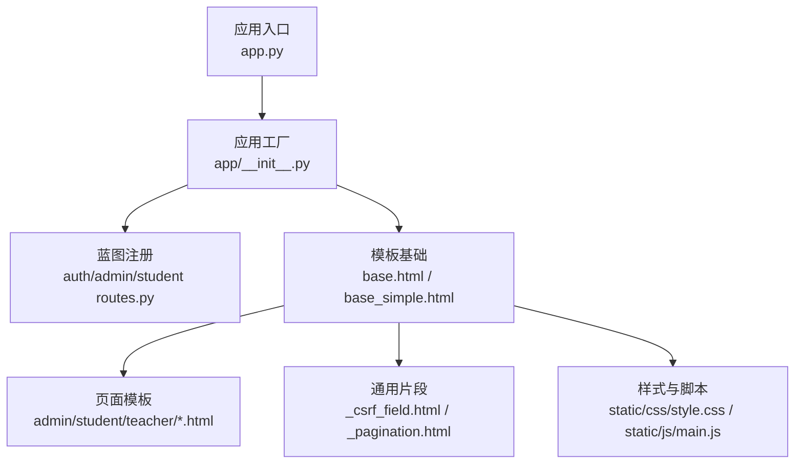
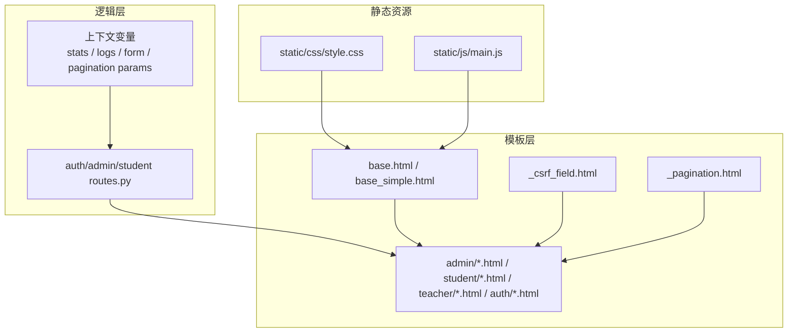
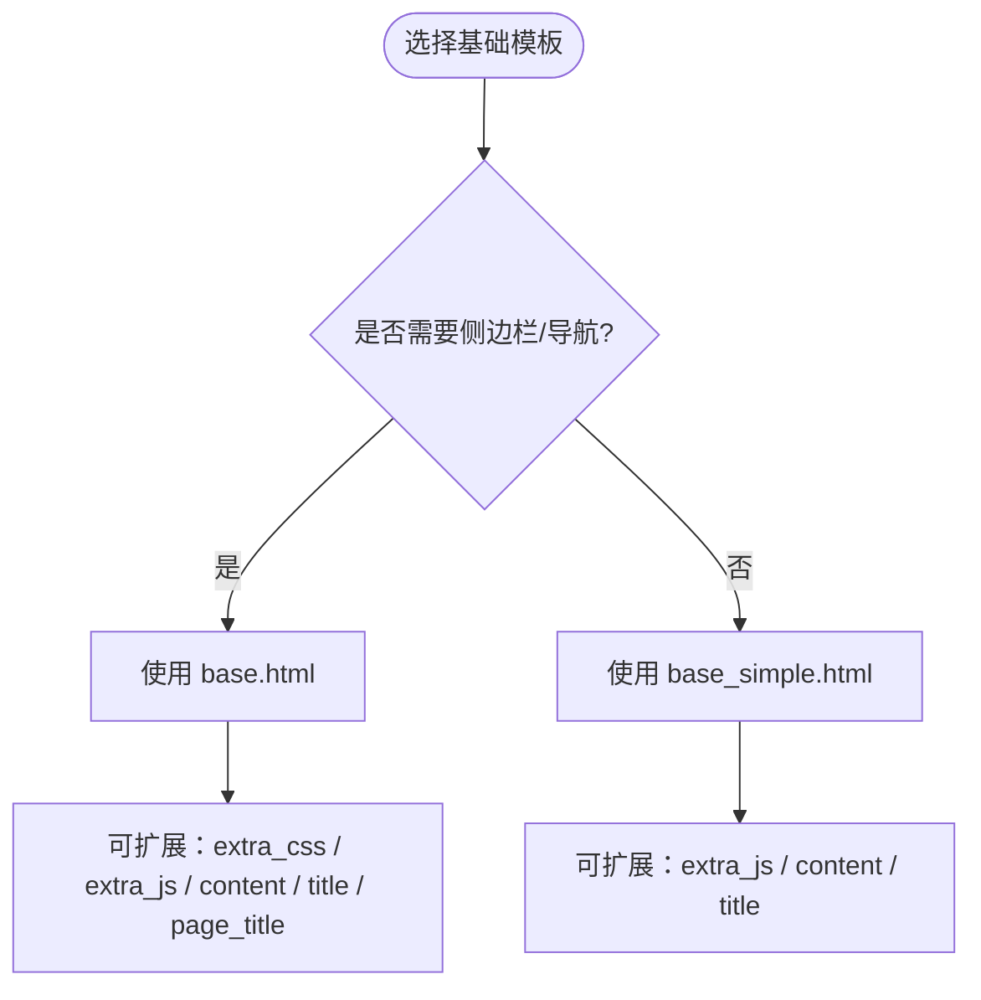
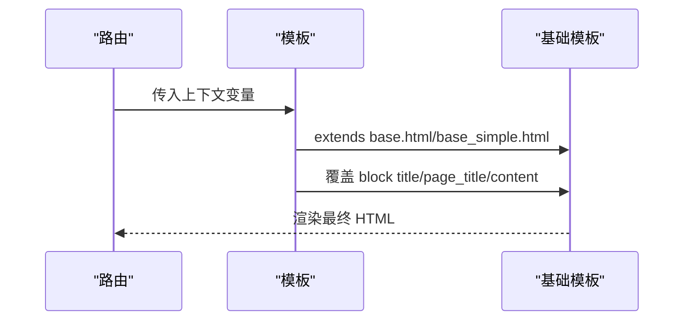
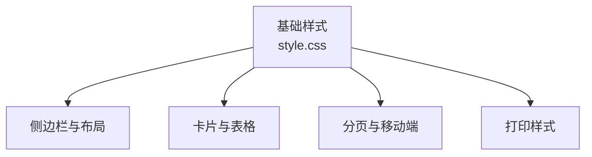
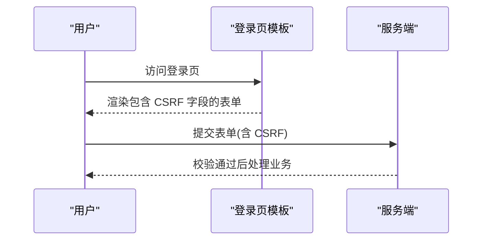
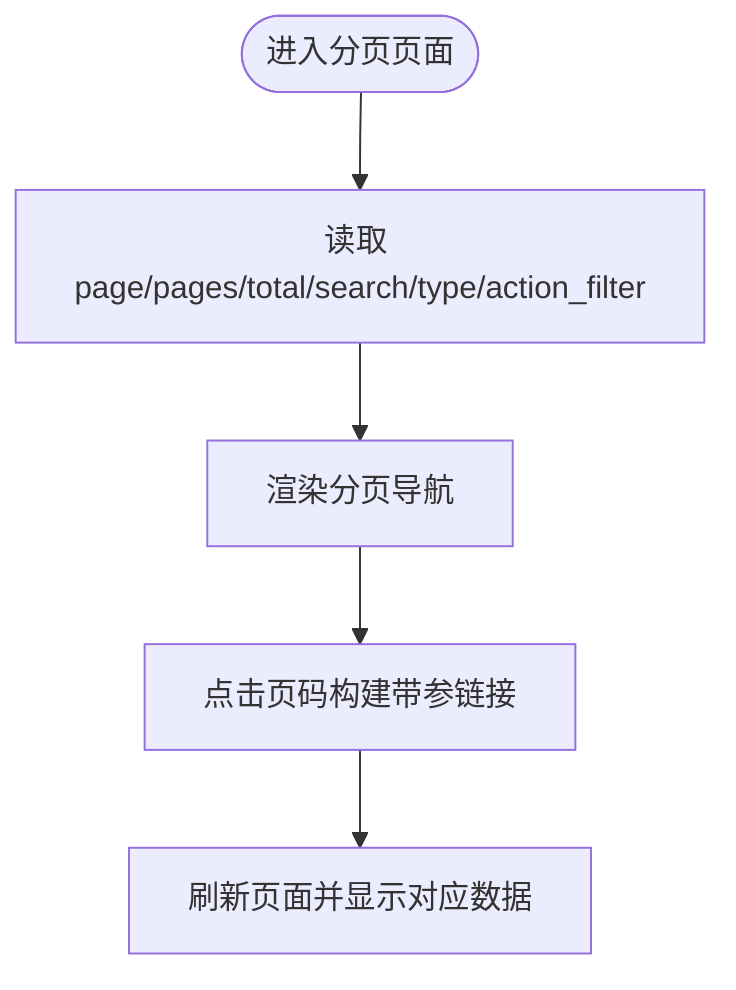
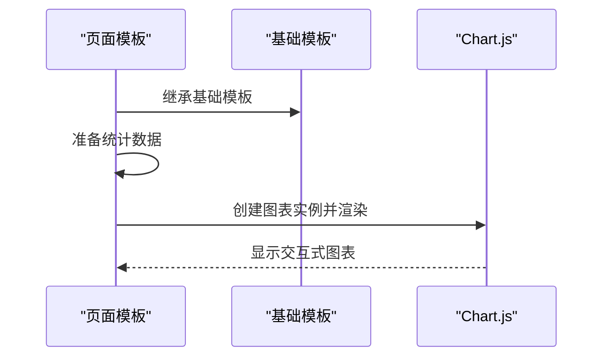
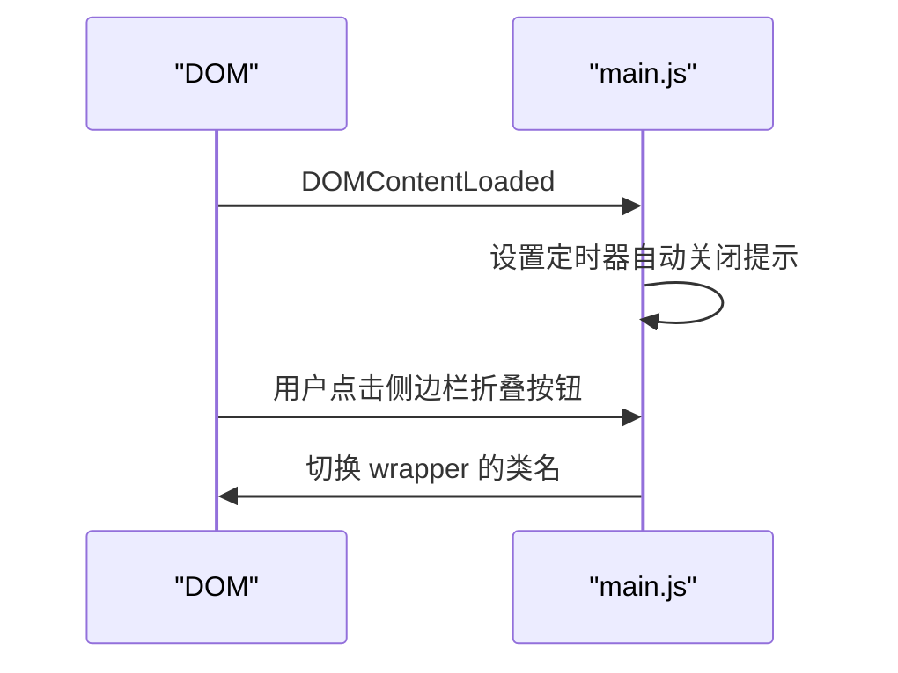
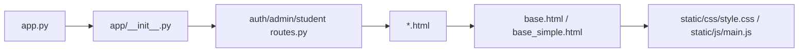

# 前端模板系统

<cite>
**本文引用的文件**
- [app/templates/base.html](file://app/templates/base.html)
- [app/templates/base_simple.html](file://app/templates/base_simple.html)
- [app/templates/_csrf_field.html](file://app/templates/_csrf_field.html)
- [app/templates/_pagination.html](file://app/templates/_pagination.html)
- [app/templates/admin/dashboard.html](file://app/templates/admin/dashboard.html)
- [app/templates/student/dashboard.html](file://app/templates/student/dashboard.html)
- [app/templates/teacher/dashboard.html](file://app/templates/teacher/dashboard.html)
- [app/templates/auth/login.html](file://app/templates/auth/login.html)
- [static/css/style.css](file://static/css/style.css)
- [static/js/main.js](file://static/js/main.js)
- [app.py](file://app.py)
- [config.py](file://config.py)
- [app/__init__.py](file://app/__init__.py)
- [requirements.txt](file://requirements.txt)
- [app/auth/routes.py](file://app/auth/routes.py)
- [app/admin/routes.py](file://app/admin/routes.py)
- [app/student/routes.py](file://app/student/routes.py)
</cite>

## 目录
1. [简介](#简介)
2. [项目结构](#项目结构)
3. [核心组件](#核心组件)
4. [架构总览](#架构总览)
5. [详细组件分析](#详细组件分析)
6. [依赖关系分析](#依赖关系分析)
7. [性能考虑](#性能考虑)
8. [故障排查指南](#故障排查指南)
9. [结论](#结论)
10. [附录](#附录)

## 简介
本文件面向前端模板系统，围绕 Jinja2 模板引擎与 Bootstrap 5 的集成实践，系统性说明模板继承、变量传递、循环与条件控制、CSRF 保护、分页组件、Chart.js 可视化、以及 JavaScript 交互。文档同时给出基础模板 base.html 与 base_simple.html 的差异与适用场景，并提供模板继承体系、区块定义与覆盖、条件渲染的完整说明。

## 项目结构
模板系统采用 Flask + Jinja2 + Bootstrap 5 的组合，模板位于 app/templates 下，静态资源位于 static/css 与 static/js，应用入口与蓝图在 app/ 与各模块 routes.py 中组织业务逻辑。

**图表来源**
- [app.py:1-13](file://app.py#L1-L13)
- [app/__init__.py:29-93](file://app/__init__.py#L29-L93)
- [app/auth/routes.py:29-167](file://app/auth/routes.py#L29-L167)
- [app/admin/routes.py:10-615](file://app/admin/routes.py#L10-L615)
- [app/student/routes.py:7-218](file://app/student/routes.py#L7-L218)

**章节来源**
- [app.py:1-13](file://app.py#L1-L13)
- [app/__init__.py:29-93](file://app/__init__.py#L29-L93)

## 核心组件
- 基础模板
  - base.html：带侧边栏、导航、消息提示与 Chart.js 引入，适合角色化后台页面。
  - base_simple.html：简洁容器，适合登录等简单页面。
- 通用片段
  - _csrf_field.html：CSRF 隐藏字段注入。
  - _pagination.html：分页导航与页码计算。
- 样式与脚本
  - style.css：侧边栏、卡片、表格、分页、移动端与打印样式。
  - main.js：全局自动关闭提示等交互。
- 路由与数据传递
  - 各模块路由负责查询与分页，向模板传入上下文变量。

**章节来源**
- [app/templates/base.html:1-85](file://app/templates/base.html#L1-L85)
- [app/templates/base_simple.html:1-25](file://app/templates/base_simple.html#L1-L25)
- [app/templates/_csrf_field.html:1-2](file://app/templates/_csrf_field.html#L1-L2)
- [app/templates/_pagination.html:1-11](file://app/templates/_pagination.html#L1-L11)
- [static/css/style.css:1-79](file://static/css/style.css#L1-L79)
- [static/js/main.js:1-11](file://static/js/main.js#L1-L11)

## 架构总览
模板系统以“基础模板 + 页面模板 + 片段”三层结构实现，配合 Flask 蓝图与路由，完成数据到模板的传递与渲染。

**图表来源**
- [app/templates/base.html:1-85](file://app/templates/base.html#L1-L85)
- [app/templates/base_simple.html:1-25](file://app/templates/base_simple.html#L1-L25)
- [app/templates/_csrf_field.html:1-2](file://app/templates/_csrf_field.html#L1-L2)
- [app/templates/_pagination.html:1-11](file://app/templates/_pagination.html#L1-L11)
- [app/auth/routes.py:32-56](file://app/auth/routes.py#L32-L56)
- [app/admin/routes.py:42-57](file://app/admin/routes.py#L42-L57)
- [app/student/routes.py:34-64](file://app/student/routes.py#L34-L64)

## 详细组件分析

### 基础模板：base.html vs base_simple.html
- 共同点
  - 均引入 Bootstrap 5 与图标字体、自定义样式。
  - 均支持 Flash 消息展示与额外 CSS/JS 区块扩展。
- 差异与适用场景
  - base.html：含侧边栏、导航栏、用户下拉菜单、Chart.js 引入，适合后台管理类页面。
  - base_simple.html：极简容器，适合登录、注册等轻量页面。

**章节来源**
- [app/templates/base.html:1-85](file://app/templates/base.html#L1-L85)
- [app/templates/base_simple.html:1-25](file://app/templates/base_simple.html#L1-L25)

### 模板继承体系：块定义、覆盖与条件渲染
- 常用块
  - title/page_title/content：标题、页面标题、主体内容。
  - extra_css/extra_js：按需注入额外样式或脚本。
- 条件渲染示例
  - 角色侧边栏：根据 current_user.role 渲染不同菜单。
  - 登录页 Flash 消息：基于 get_flashed_messages 展示。
  - 学业预警提示：根据 risk_level 动态样式与文案。
- 内容覆盖
  - 各角色 dashboard 继承 base.html 并覆盖 title、page_title、content。

**图表来源**
- [app/templates/admin/dashboard.html:1-30](file://app/templates/admin/dashboard.html#L1-L30)
- [app/templates/student/dashboard.html:1-73](file://app/templates/student/dashboard.html#L1-L73)
- [app/templates/teacher/dashboard.html:1-27](file://app/templates/teacher/dashboard.html#L1-L27)
- [app/templates/base.html:6,50,70:6-70](file://app/templates/base.html#L6-L70)

**章节来源**
- [app/templates/admin/dashboard.html:1-30](file://app/templates/admin/dashboard.html#L1-L30)
- [app/templates/student/dashboard.html:1-73](file://app/templates/student/dashboard.html#L1-L73)
- [app/templates/teacher/dashboard.html:1-27](file://app/templates/teacher/dashboard.html#L1-L27)
- [app/templates/base.html:13-47](file://app/templates/base.html#L13-L47)

### 变量传递与上下文
- 路由向模板传递变量
  - 管理员仪表盘：stats、logs。
  - 学生仪表盘：enrolled_count、gpa、total_credits、recent_grades、academic_alert。
  - 分页场景：admin/students、teachers、offerings、grades_review、logs 等均传递分页参数与数据集。
- 表单与验证
  - 登录页使用 LoginForm，模板内显示字段错误与 Flash 提示。

**章节来源**
- [app/admin/routes.py:42-57](file://app/admin/routes.py#L42-L57)
- [app/student/routes.py:34-64](file://app/student/routes.py#L34-L64)
- [app/admin/routes.py:202-217](file://app/admin/routes.py#L202-L217)
- [app/admin/routes.py:286-299](file://app/admin/routes.py#L286-L299)
- [app/admin/routes.py:366-377](file://app/admin/routes.py#L366-L377)
- [app/admin/routes.py:454-469](file://app/admin/routes.py#L454-L469)
- [app/admin/routes.py:529-543](file://app/admin/routes.py#L529-L543)
- [app/auth/routes.py:32-56](file://app/auth/routes.py#L32-L56)

### 循环控制与条件判断
- 循环
  - 日志列表、最近成绩、课程列表、开课卡片等。
- 条件
  - 角色菜单、预警等级样式、Badge 状态、空表提示。
- 过滤与格式化
  - 字符串截断、数值格式化、布尔判断。

**章节来源**
- [app/templates/admin/dashboard.html:18-28](file://app/templates/admin/dashboard.html#L18-L28)
- [app/templates/student/dashboard.html:57-68](file://app/templates/student/dashboard.html#L57-L68)
- [app/templates/teacher/dashboard.html:6-25](file://app/templates/teacher/dashboard.html#L6-L25)
- [app/templates/student/dashboard.html:4-20](file://app/templates/student/dashboard.html#L4-L20)

### Bootstrap 5 集成与自定义样式
- 组件使用
  - 导航栏、下拉菜单、卡片、表格、进度条、徽章、分页。
- 响应式布局
  - Flex 容器、列栅格、媒体查询适配移动端。
- 主题定制
  - 自定义颜色、阴影、过渡动画、打印样式隐藏不必要元素。

**图表来源**
- [static/css/style.css:1-79](file://static/css/style.css#L1-L79)

**章节来源**
- [static/css/style.css:1-79](file://static/css/style.css#L1-L79)
- [app/templates/base.html:14-72](file://app/templates/base.html#L14-L72)

### CSRF 保护机制
- 令牌注入
  - 在表单中包含隐藏字段，值来自 csrf_token()。
- 表单验证
  - 路由层启用 CSRFProtect，提交时自动校验。
- 实践建议
  - 所有 POST 表单均应包含 CSRF 字段；避免在 AJAX 中遗漏。

**图表来源**
- [app/templates/auth/login.html:11-29](file://app/templates/auth/login.html#L11-L29)
- [app/templates/_csrf_field.html:1-2](file://app/templates/_csrf_field.html#L1-L2)
- [app/__init__.py:33](file://app/__init__.py#L33)

**章节来源**
- [app/templates/auth/login.html:11-29](file://app/templates/auth/login.html#L11-L29)
- [app/templates/_csrf_field.html:1-2](file://app/templates/_csrf_field.html#L1-L2)
- [app/__init__.py:33](file://app/__init__.py#L33)

### 分页组件设计与实现
- 页码计算
  - 基于请求参数 page、pages、total 计算前后页与边界禁用。
- URL 参数处理
  - 保留 search、type、action_filter 等筛选参数。
- 样式美化
  - 使用 Bootstrap 分页组件，居中显示与页码高亮。

**图表来源**
- [app/templates/_pagination.html:1-11](file://app/templates/_pagination.html#L1-L11)
- [app/admin/routes.py:202-217](file://app/admin/routes.py#L202-L217)
- [app/admin/routes.py:286-299](file://app/admin/routes.py#L286-L299)
- [app/admin/routes.py:366-377](file://app/admin/routes.py#L366-L377)
- [app/admin/routes.py:454-469](file://app/admin/routes.py#L454-L469)
- [app/admin/routes.py:529-543](file://app/admin/routes.py#L529-L543)

**章节来源**
- [app/templates/_pagination.html:1-11](file://app/templates/_pagination.html#L1-L11)
- [app/admin/routes.py:202-217](file://app/admin/routes.py#L202-L217)
- [app/admin/routes.py:286-299](file://app/admin/routes.py#L286-L299)
- [app/admin/routes.py:366-377](file://app/admin/routes.py#L366-L377)
- [app/admin/routes.py:454-469](file://app/admin/routes.py#L454-L469)
- [app/admin/routes.py:529-543](file://app/admin/routes.py#L529-L543)

### Chart.js 数据可视化集成
- 引入与初始化
  - 在基础模板中引入 Chart.js，可在页面模板中按需使用。
- 图表类型与数据
  - 可在统计页面或仪表盘中使用柱状图、饼图等展示数据分布与趋势。
- 交互功能
  - 支持缩放、悬停、图例切换等默认交互。

**图表来源**
- [app/templates/base.html:76](file://app/templates/base.html#L76)
- [app/admin/routes.py:547-574](file://app/admin/routes.py#L547-L574)

**章节来源**
- [app/templates/base.html:76](file://app/templates/base.html#L76)
- [app/admin/routes.py:547-574](file://app/admin/routes.py#L547-L574)

### JavaScript 交互实现
- 全局工具
  - 自动关闭可关闭提示，提升用户体验。
- 事件绑定
  - 侧边栏折叠按钮事件绑定，切换容器类名实现收起展开。
- 与模板联动
  - 模板中注入脚本，运行时读取 DOM 并绑定事件。

**图表来源**
- [static/js/main.js:1-11](file://static/js/main.js#L1-L11)
- [app/templates/base.html:78-81](file://app/templates/base.html#L78-L81)

**章节来源**
- [static/js/main.js:1-11](file://static/js/main.js#L1-L11)
- [app/templates/base.html:78-81](file://app/templates/base.html#L78-L81)

## 依赖关系分析
- 模板依赖
  - 页面模板依赖基础模板与通用片段。
  - 基础模板依赖 Bootstrap、图标字体、Chart.js 与自定义样式。
- 应用依赖
  - app.py 作为入口，app/__init__.py 初始化 Flask、CSRF、蓝图与错误处理器。
  - 各模块 routes.py 注入上下文变量并渲染模板。

**图表来源**
- [app.py:1-13](file://app.py#L1-L13)
- [app/__init__.py:29-93](file://app/__init__.py#L29-L93)
- [app/auth/routes.py:29-167](file://app/auth/routes.py#L29-L167)
- [app/admin/routes.py:10-615](file://app/admin/routes.py#L10-L615)
- [app/student/routes.py:7-218](file://app/student/routes.py#L7-L218)

**章节来源**
- [app.py:1-13](file://app.py#L1-L13)
- [app/__init__.py:29-93](file://app/__init__.py#L29-L93)

## 性能考虑
- 模板层面
  - 避免在模板中进行复杂计算，尽量在路由层预处理数据。
  - 合理使用过滤器与格式化，减少重复逻辑。
- 资源层面
  - 外部 CDN 资源加载，注意网络稳定性与回退策略。
  - 将自定义样式与脚本合并压缩，减少请求数量。
- 分页与查询
  - 使用分页函数限制结果集大小，避免一次性渲染大量数据。

## 故障排查指南
- CSRF 校验失败
  - 确认表单包含隐藏 CSRF 字段且未被模板覆盖。
  - 检查 CSRFProtect 是否正确初始化。
- 侧边栏不生效
  - 检查基础模板中脚本事件绑定是否执行。
  - 确认按钮 ID 与事件监听一致。
- 分页链接丢失筛选参数
  - 检查 _pagination.html 中是否拼接了 search、type、action_filter。
- Chart.js 未渲染
  - 确认基础模板已引入 Chart.js，且页面模板中正确初始化图表。

**章节来源**
- [app/templates/_csrf_field.html:1-2](file://app/templates/_csrf_field.html#L1-L2)
- [app/__init__.py:33](file://app/__init__.py#L33)
- [app/templates/base.html:78-81](file://app/templates/base.html#L78-L81)
- [app/templates/_pagination.html:3-7](file://app/templates/_pagination.html#L3-L7)
- [app/templates/base.html:76](file://app/templates/base.html#L76)

## 结论
本模板系统通过清晰的模板继承与通用片段复用，结合 Bootstrap 5 的组件体系与 Chart.js 的可视化能力，实现了角色化、响应式、可扩展的前端界面。配合 Flask 的蓝图与路由，能够高效地将数据传递至模板并完成渲染。建议在后续迭代中进一步完善数据预处理与资源优化，确保在大数据量场景下的稳定与性能表现。

## 附录
- 关键配置
  - SECRET_KEY、WTF_CSRF_ENABLED、数据库连接池、分页每页数量等。
- 依赖包
  - Flask、Flask-Login、Flask-WTF、PyMySQL、WTForms 等。

**章节来源**
- [config.py:6-36](file://config.py#L6-L36)
- [requirements.txt:1-8](file://requirements.txt#L1-L8)