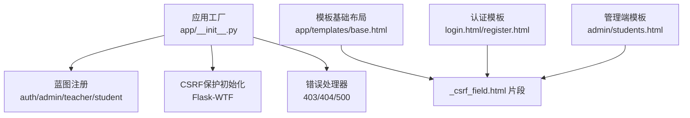
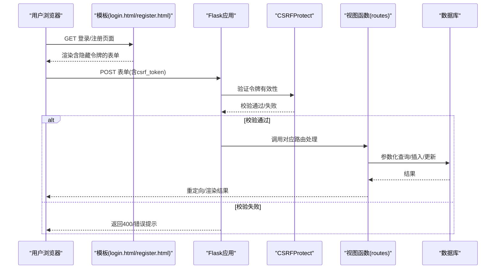
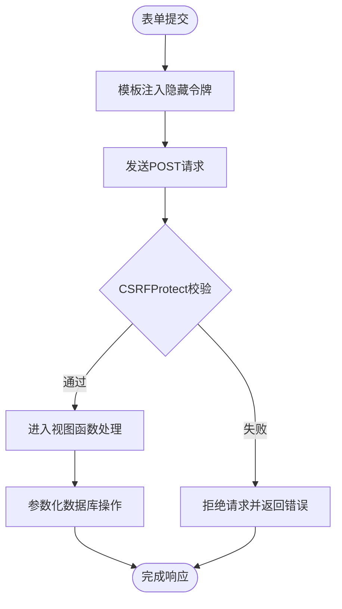
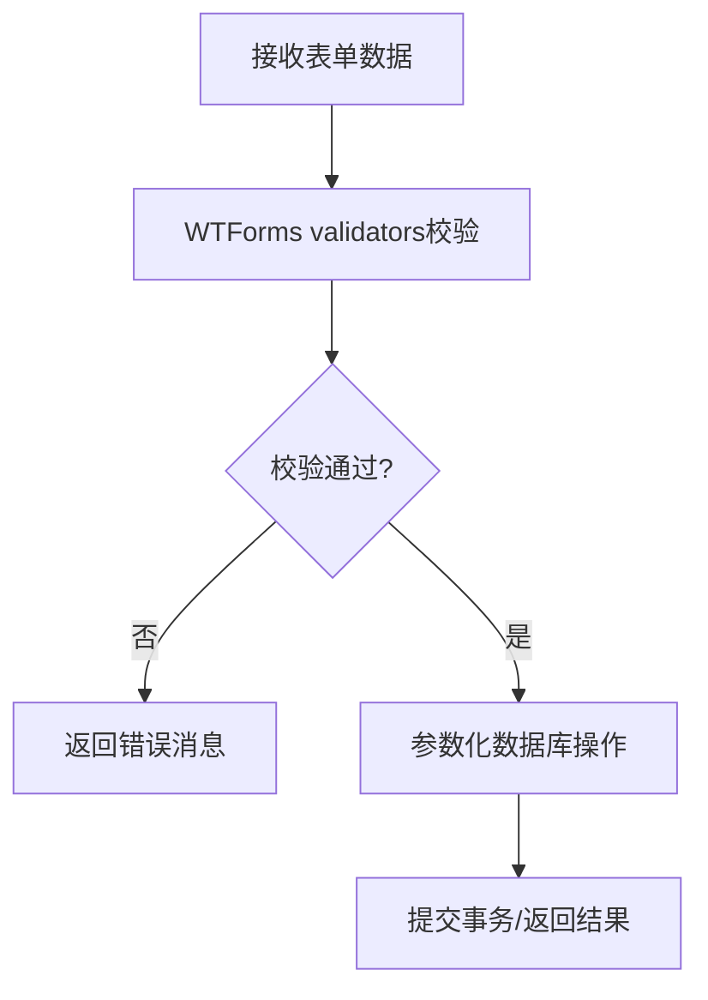
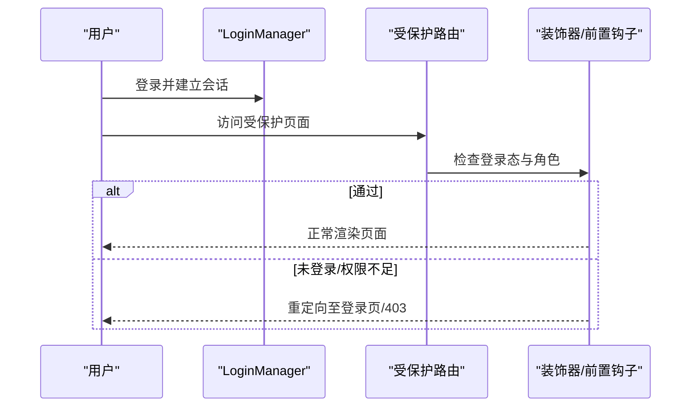
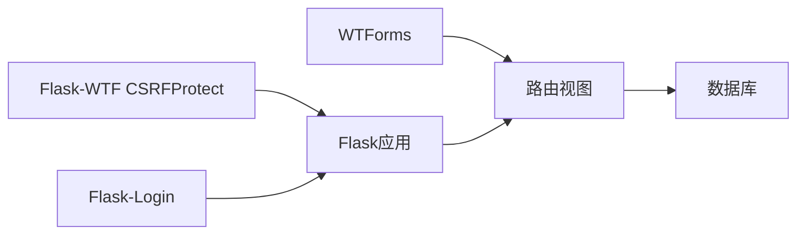

# 安全模板机制

<cite>
**本文引用的文件**
- [app.py](file://app.py)
- [app/__init__.py](file://app/__init__.py)
- [config.py](file://config.py)
- [app/decorators.py](file://app/decorators.py)
- [app/helpers.py](file://app/helpers.py)
- [app/templates/_csrf_field.html](file://app/templates/_csrf_field.html)
- [app/templates/base.html](file://app/templates/base.html)
- [app/templates/auth/login.html](file://app/templates/auth/login.html)
- [app/templates/auth/register.html](file://app/templates/auth/register.html)
- [app/templates/admin/students.html](file://app/templates/admin/students.html)
- [app/auth/routes.py](file://app/auth/routes.py)
- [app/admin/routes.py](file://app/admin/routes.py)
- [app/teacher/routes.py](file://app/teacher/routes.py)
- [app/student/routes.py](file://app/student/routes.py)
</cite>

## 目录
1. [引言](#引言)
2. [项目结构](#项目结构)
3. [核心组件](#核心组件)
4. [架构总览](#架构总览)
5. [详细组件分析](#详细组件分析)
6. [依赖分析](#依赖分析)
7. [性能考虑](#性能考虑)
8. [故障排查指南](#故障排查指南)
9. [结论](#结论)
10. [附录](#附录)

## 引言
本文件围绕“安全模板机制”展开，聚焦于CSRF（跨站请求伪造）保护在模板中的实现与落地，涵盖Flask-WTF CSRF保护的工作原理、令牌生成与验证流程、过期处理策略；同时阐述表单安全验证（POST请求校验、用户输入过滤）、会话管理与权限检查、安全头部与HTTPS强制跳转的现状与建议，以及安全最佳实践与常见漏洞的预防与检测方法。

## 项目结构
本项目采用Flask蓝图分层组织，模板位于app/templates目录，其中包含基础布局、认证模板与各角色子模板。CSRF保护通过全局初始化的CSRFProtect中间件与模板片段配合实现。

图表来源
- [app/__init__.py:29-92](file://app/__init__.py#L29-L92)
- [app/templates/base.html:1-85](file://app/templates/base.html#L1-L85)
- [app/templates/_csrf_field.html:1-2](file://app/templates/_csrf_field.html#L1-L2)
- [app/templates/auth/login.html:1-45](file://app/templates/auth/login.html#L1-L45)
- [app/templates/auth/register.html:1-102](file://app/templates/auth/register.html#L1-L102)
- [app/templates/admin/students.html:1-117](file://app/templates/admin/students.html#L1-L117)

章节来源
- [app/__init__.py:29-92](file://app/__init__.py#L29-L92)
- [app/templates/base.html:1-85](file://app/templates/base.html#L1-L85)
- [app/templates/_csrf_field.html:1-2](file://app/templates/_csrf_field.html#L1-L2)
- [app/templates/auth/login.html:1-45](file://app/templates/auth/login.html#L1-L45)
- [app/templates/auth/register.html:1-102](file://app/templates/auth/register.html#L1-L102)
- [app/templates/admin/students.html:1-117](file://app/templates/admin/students.html#L1-L117)

## 核心组件
- CSRF保护中间件与令牌注入
  - 在应用初始化时启用Flask-WTF的CSRFProtect，并在模板中通过包含_csrf_field.html向表单注入隐藏字段，确保POST请求携带有效令牌。
- 表单安全验证
  - 使用WTForms对输入进行服务端校验（长度、格式、必填、相等性等），结合数据库操作参数化防止SQL注入。
- 会话与权限控制
  - 借助Flask-Login维护用户会话，使用自定义装饰器与蓝图前置钩子实现登录态与角色权限检查。
- 安全日志
  - 通过统一的日志辅助函数记录用户行为、IP地址等信息，便于审计与追踪。

章节来源
- [app/__init__.py:7-33](file://app/__init__.py#L7-L33)
- [app/templates/_csrf_field.html:1-2](file://app/templates/_csrf_field.html#L1-L2)
- [app/auth/forms.py:1-37](file://app/auth/forms.py#L1-L37)
- [app/decorators.py:1-26](file://app/decorators.py#L1-L26)
- [app/helpers.py:9-21](file://app/helpers.py#L9-L21)

## 架构总览
下图展示从浏览器到后端路由、CSRF令牌校验与数据库交互的整体流程。

图表来源
- [app/templates/auth/login.html:11-29](file://app/templates/auth/login.html#L11-L29)
- [app/templates/auth/register.html:9-77](file://app/templates/auth/register.html#L9-L77)
- [app/__init__.py:33](file://app/__init__.py#L33)
- [app/auth/routes.py:33-57](file://app/auth/routes.py#L33-L57)

## 详细组件分析

### CSRF保护机制与令牌注入
- 模板设计
  - _csrf_field.html以隐藏域形式注入csrf_token()，被多个模板包含，确保所有POST表单均携带令牌。
- 中间件启用
  - 在应用初始化阶段调用csrf.init_app(app)，全局拦截非GET请求的CSRF令牌校验。
- 令牌生成与验证
  - Flask-WTF基于SECRET_KEY生成加密令牌，服务端解密比对；令牌随会话变化而轮换，降低重放风险。
- 过期与刷新
  - 令牌通常与会话生命周期绑定；若会话过期或跨域场景，需在模板中重新渲染令牌或引导用户刷新页面。

图表来源
- [app/templates/_csrf_field.html:1-2](file://app/templates/_csrf_field.html#L1-L2)
- [app/__init__.py:33](file://app/__init__.py#L33)
- [app/auth/routes.py:38-57](file://app/auth/routes.py#L38-L57)

章节来源
- [app/templates/_csrf_field.html:1-2](file://app/templates/_csrf_field.html#L1-L2)
- [app/templates/auth/login.html:11-12](file://app/templates/auth/login.html#L11-L12)
- [app/templates/auth/register.html:9-10](file://app/templates/auth/register.html#L9-L10)
- [app/__init__.py:33](file://app/__init__.py#L33)

### Flask-WTF CSRF工作原理
- 令牌生成
  - 基于SECRET_KEY与会话上下文生成签名令牌，保证唯一性与时效性。
- 令牌验证
  - 对POST/PUT/DELETE等非幂等请求进行严格校验；GET请求不参与校验，避免误伤。
- 过期处理
  - 会话失效或长时间无操作导致令牌过期时，需重新加载页面以获取新令牌。

章节来源
- [config.py:7](file://config.py#L7)
- [app/__init__.py:33](file://app/__init__.py#L33)

### 表单安全验证与输入过滤
- WTForms校验
  - 用户名、密码、邮箱、电话等字段设置长度、格式与必填规则；确认密码与原密码一致性校验。
- 数据库操作
  - 所有写操作均使用参数化查询，避免SQL注入；读取数据时进行空值与类型转换处理。
- 错误处理
  - 校验失败时返回具体错误消息；异常捕获后统一提示，不泄露内部细节。

图表来源
- [app/auth/forms.py:6-37](file://app/auth/forms.py#L6-L37)
- [app/auth/routes.py:72-117](file://app/auth/routes.py#L72-L117)

章节来源
- [app/auth/forms.py:1-37](file://app/auth/forms.py#L1-L37)
- [app/auth/routes.py:60-117](file://app/auth/routes.py#L60-L117)

### 会话管理与权限检查
- 会话与身份验证
  - Flask-Login负责登录态维护；用户加载器从数据库查询用户信息并封装为User对象。
- 权限控制
  - 自定义装饰器role_required与蓝图前置钩子组合，确保仅具备相应角色的用户可访问特定路由。
- 导航与界面
  - 基础模板根据current_user.role动态渲染侧边栏与菜单项，体现最小权限原则。

图表来源
- [app/__init__.py:41-51](file://app/__init__.py#L41-L51)
- [app/decorators.py:7-25](file://app/decorators.py#L7-L25)
- [app/templates/base.html:13-48](file://app/templates/base.html#L13-L48)

章节来源
- [app/__init__.py:41-51](file://app/__init__.py#L41-L51)
- [app/decorators.py:1-26](file://app/decorators.py#L1-L26)
- [app/templates/base.html:1-85](file://app/templates/base.html#L1-L85)

### 安全头与HTTPS强制跳转
- 当前实现
  - 仓库未发现显式的安全头设置（如Strict-Transport-Security、Content-Security-Policy等）与HTTPS强制跳转逻辑。
- 建议
  - 在生产环境启用HTTPS，结合HSTS头强化传输安全；按需引入Werkzeug中间件或反向代理实现301跳转至HTTPS。
  - 设置内容安全策略（CSP）限制脚本执行来源，降低XSS风险。

[本节为通用建议，不直接分析具体文件]

### 模板中的安全实践
- CSRF令牌
  - 所有POST表单均包含隐藏令牌字段，确保跨站请求被严格校验。
- 输入显示与转义
  - Jinja2默认对输出进行HTML转义，避免XSS；模板中未见显式绕过转义的用法。
- 菜单与导航
  - 基于角色渲染菜单项，防止越权访问敏感功能。

章节来源
- [app/templates/_csrf_field.html:1-2](file://app/templates/_csrf_field.html#L1-L2)
- [app/templates/base.html:13-48](file://app/templates/base.html#L13-L48)

## 依赖分析
- 组件耦合
  - CSRFProtect与模板片段低耦合，通过Jinja2上下文变量注入令牌，便于复用。
  - 权限装饰器与蓝图前置钩子共同作用，形成清晰的访问控制链路。
- 外部依赖
  - Flask-WTF（CSRF）、Flask-Login（会话与用户模型）、WTForms（表单校验）。

图表来源
- [app/__init__.py:33](file://app/__init__.py#L33)
- [app/auth/routes.py:1-11](file://app/auth/routes.py#L1-L11)

章节来源
- [app/__init__.py:33](file://app/__init__.py#L33)
- [app/auth/routes.py:1-11](file://app/auth/routes.py#L1-L11)

## 性能考虑
- CSRF令牌生成与校验成本较低，对请求延迟影响可忽略。
- 表单校验与数据库操作应尽量批量化与参数化，减少SQL往返与拼接开销。
- 日志写入建议异步化或落盘优化，避免阻塞主请求路径。

[本节提供一般性指导，不直接分析具体文件]

## 故障排查指南
- CSRF校验失败
  - 现象：POST请求被拒绝，出现令牌无效或缺失提示。
  - 排查：确认模板中包含_csrf_field.html；检查表单method为POST；确保页面未缓存旧令牌。
- 登录后重定向异常
  - 现象：未登录或权限不足时被重定向至错误页面。
  - 排查：检查LoginManager配置与装饰器使用；确认current_user属性正确。
- 数据库异常
  - 现象：注册/更新失败，提示约束冲突或参数错误。
  - 排查：核对表单校验与数据库约束；捕获异常并返回友好提示。

章节来源
- [app/__init__.py:77-90](file://app/__init__.py#L77-L90)
- [app/auth/routes.py:72-117](file://app/auth/routes.py#L72-L117)
- [app/helpers.py:9-21](file://app/helpers.py#L9-L21)

## 结论
本项目在模板层面通过_csrf_field.html与Flask-WTF CSRFProtect实现了基础但有效的CSRF防护；配合Flask-Login与自定义装饰器形成了清晰的会话与权限控制体系。建议在生产环境中补充安全头与HTTPS强制跳转，并持续完善输入校验与日志审计，以进一步提升整体安全性。

## 附录

### 安全最佳实践清单
- 敏感信息处理
  - 不在URL中传递敏感参数；密码使用哈希存储；避免在日志中记录明文密码。
- 错误信息隐藏
  - 对外仅显示通用错误提示，内部记录详细日志以便追溯。
- 安全日志
  - 记录用户ID、IP、时间戳、操作类型与目标对象，定期审计。
- 常见漏洞预防
  - XSS：依赖Jinja2默认转义；避免使用unsafe的Markup；必要时引入CSP。
  - CSRF：确保所有POST表单包含令牌；避免GET请求执行变更操作。
  - 注入攻击：统一使用参数化查询；限制数据库权限。
  - 强制性检测：定期扫描模板与路由，确保无遗漏的POST表单与敏感操作。

[本节为通用指导，不直接分析具体文件]