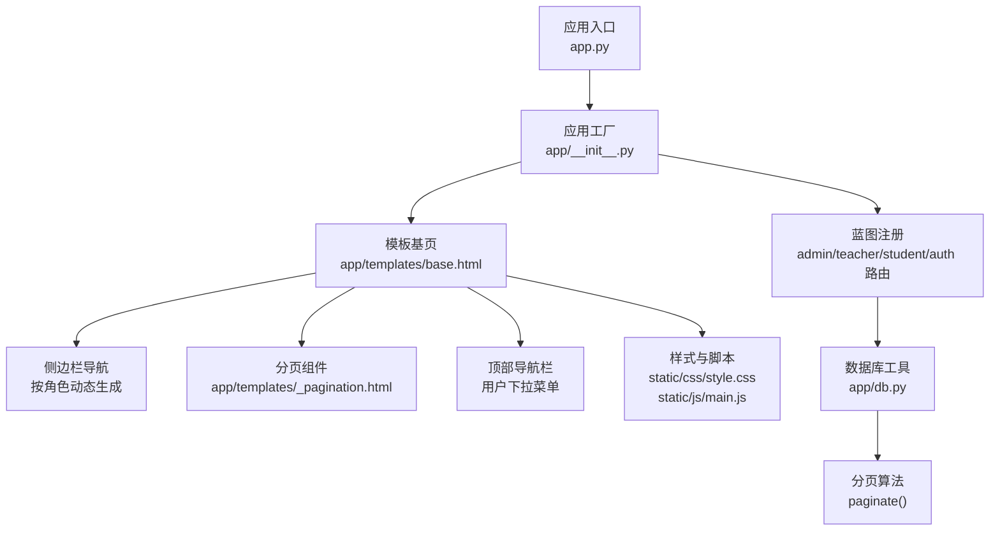
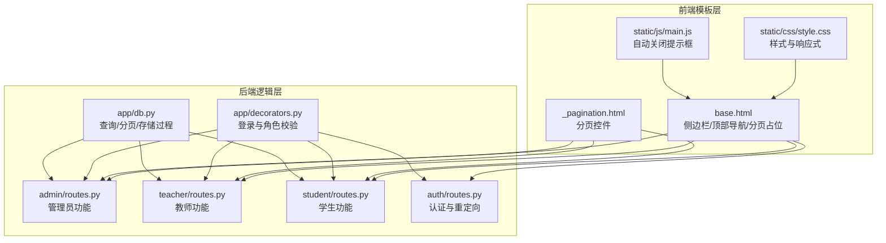
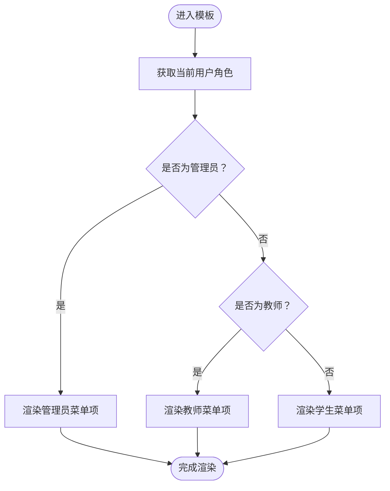
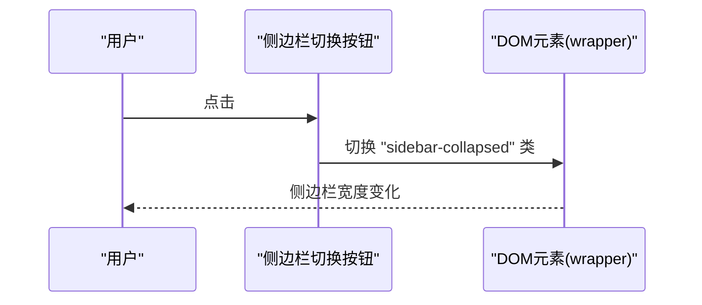
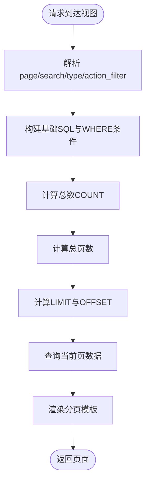
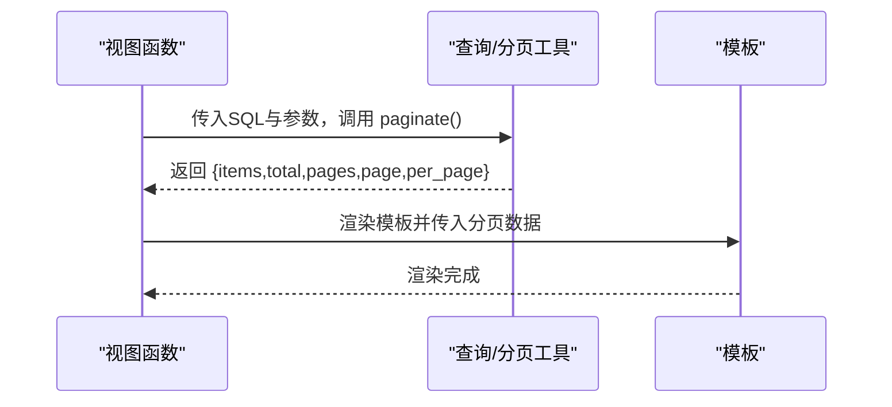
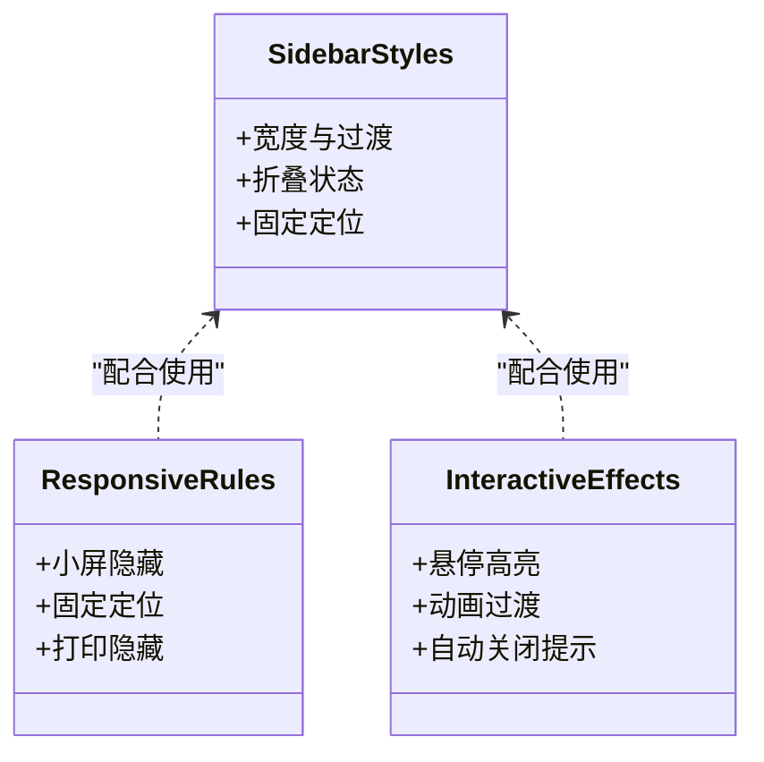
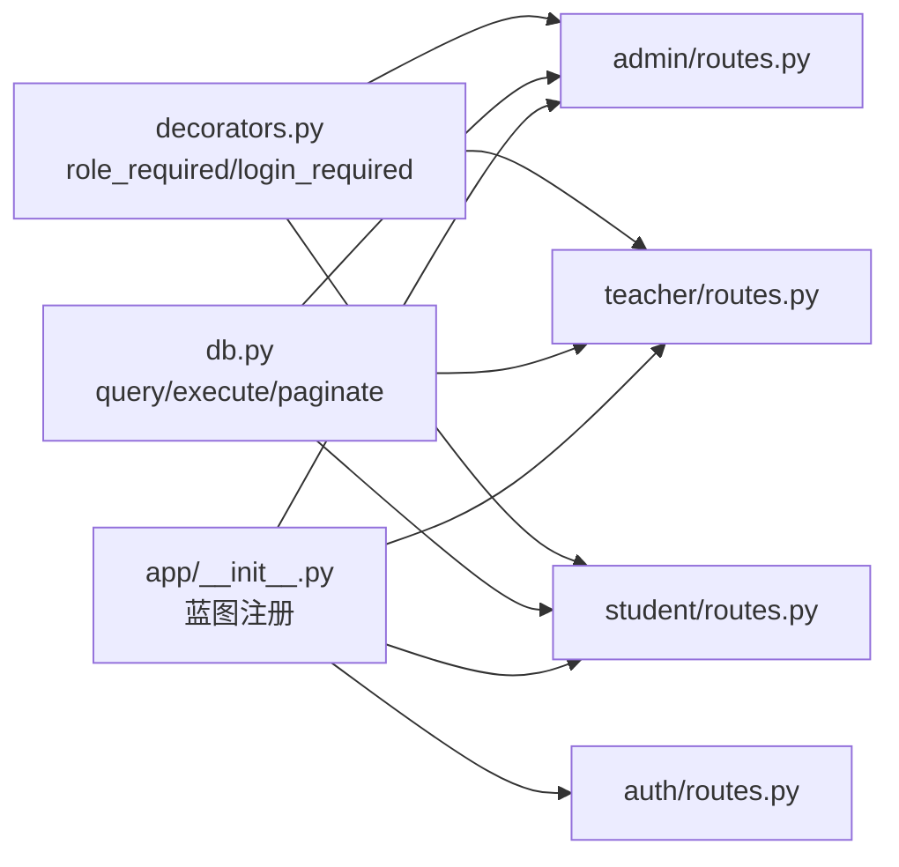

# 导航组件系统

<cite>
**本文档引用的文件**
- [app.py](file://app.py)
- [app/__init__.py](file://app/__init__.py)
- [config.py](file://config.py)
- [app/db.py](file://app/db.py)
- [app/decorators.py](file://app/decorators.py)
- [app/templates/base.html](file://app/templates/base.html)
- [app/templates/_pagination.html](file://app/templates/_pagination.html)
- [static/css/style.css](file://static/css/style.css)
- [static/js/main.js](file://static/js/main.js)
- [app/admin/routes.py](file://app/admin/routes.py)
- [app/teacher/routes.py](file://app/teacher/routes.py)
- [app/student/routes.py](file://app/student/routes.py)
- [app/auth/routes.py](file://app/auth/routes.py)
- [app/templates/admin/dashboard.html](file://app/templates/admin/dashboard.html)
- [app/templates/teacher/dashboard.html](file://app/templates/teacher/dashboard.html)
- [app/templates/student/dashboard.html](file://app/templates/student/dashboard.html)
- [app/templates/404.html](file://app/templates/404.html)
- [app/templates/403.html](file://app/templates/403.html)
</cite>

## 目录
1. [简介](#简介)
2. [项目结构](#项目结构)
3. [核心组件](#核心组件)
4. [架构总览](#架构总览)
5. [详细组件分析](#详细组件分析)
6. [依赖关系分析](#依赖关系分析)
7. [性能考量](#性能考量)
8. [故障排除指南](#故障排除指南)
9. [结论](#结论)
10. [附录](#附录)

## 简介
本文件面向导航组件系统，围绕 Bootstrap 5 集成与自定义实现展开，重点覆盖：
- 侧边栏导航设计与响应式布局
- 用户角色（admin、teacher、student）对应的菜单生成机制
- 导航链接的动态生成（url_for 的使用与路由参数传递）
- 分页组件设计（_pagination.html 模板的通用性、页码计算算法与 URL 参数处理）
- 导航状态管理与活动页面标识机制
- 导航样式自定义（颜色主题、图标使用、交互效果）
- 移动端适配的响应式设计

## 项目结构
系统采用 Flask 微框架，模板继承自 base.html，侧边栏导航在模板层按角色动态渲染；分页逻辑由数据库工具统一提供；样式与交互通过静态资源文件管理。

图表来源
- [app/__init__.py:29-93](file://app/__init__.py#L29-L93)
- [app/templates/base.html:13-73](file://app/templates/base.html#L13-L73)
- [app/templates/_pagination.html:1-11](file://app/templates/_pagination.html#L1-L11)
- [static/css/style.css:1-79](file://static/css/style.css#L1-L79)
- [static/js/main.js:1-11](file://static/js/main.js#L1-L11)
- [app/db.py:92-121](file://app/db.py#L92-L121)

章节来源
- [app/__init__.py:29-93](file://app/__init__.py#L29-L93)
- [app/templates/base.html:13-73](file://app/templates/base.html#L13-L73)
- [app/templates/_pagination.html:1-11](file://app/templates/_pagination.html#L1-L11)
- [static/css/style.css:1-79](file://static/css/style.css#L1-L79)
- [static/js/main.js:1-11](file://static/js/main.js#L1-L11)
- [app/db.py:92-121](file://app/db.py#L92-L121)

## 核心组件
- 基础模板与导航骨架：base.html 提供侧边栏、顶部导航、分页占位与脚本加载。
- 角色化侧边栏：根据当前用户角色动态渲染不同菜单项。
- 分页组件：_pagination.html 以通用模板形式支持多处列表分页。
- 数据库与分页工具：db.py 的 paginate 实现页码计算与 SQL 限制。
- 样式与交互：style.css 定义侧边栏折叠、移动端隐藏与打印样式；main.js 自动关闭提示框。

章节来源
- [app/templates/base.html:13-73](file://app/templates/base.html#L13-L73)
- [app/templates/_pagination.html:1-11](file://app/templates/_pagination.html#L1-L11)
- [app/db.py:92-121](file://app/db.py#L92-L121)
- [static/css/style.css:1-79](file://static/css/style.css#L1-L79)
- [static/js/main.js:1-11](file://static/js/main.js#L1-L11)

## 架构总览
系统通过 Flask 蓝图组织功能模块，模板层负责 UI 呈现与交互，数据库层提供数据访问与分页能力。

图表来源
- [app/templates/base.html:13-73](file://app/templates/base.html#L13-L73)
- [app/templates/_pagination.html:1-11](file://app/templates/_pagination.html#L1-L11)
- [static/css/style.css:1-79](file://static/css/style.css#L1-L79)
- [static/js/main.js:1-11](file://static/js/main.js#L1-L11)
- [app/admin/routes.py:1-615](file://app/admin/routes.py#L1-L615)
- [app/teacher/routes.py:1-271](file://app/teacher/routes.py#L1-L271)
- [app/student/routes.py:1-218](file://app/student/routes.py#L1-L218)
- [app/auth/routes.py:1-167](file://app/auth/routes.py#L1-L167)
- [app/db.py:43-121](file://app/db.py#L43-L121)
- [app/decorators.py:7-26](file://app/decorators.py#L7-L26)

## 详细组件分析

### 侧边栏导航与角色菜单生成
- 角色识别：模板通过 current_user.get('role') 获取角色字符串。
- 菜单分支：基于角色分别渲染 admin、teacher、student 的导航项。
- 动态链接：使用 url_for('role.endpoint') 生成路由链接，确保与蓝图前缀一致。
- 图标与样式：每个菜单项包含 Bootstrap Icons 图标，侧边栏采用深色背景与悬停高亮。

图表来源
- [app/templates/base.html:21-46](file://app/templates/base.html#L21-L46)

章节来源
- [app/templates/base.html:13-46](file://app/templates/base.html#L13-L46)

### 导航状态管理与活动页面标识
- 活动状态：模板中未直接设置“active”类名，但可通过扩展子模板中的导航项进行手动标记。
- 折叠行为：点击顶部按钮切换 #wrapper.sidebar-collapsed 类，控制侧边栏宽度与内容区域布局。
- 交互脚本：模板内绑定事件监听器，切换侧边栏折叠状态。

图表来源
- [app/templates/base.html:78-81](file://app/templates/base.html#L78-L81)
- [static/css/style.css:32-33](file://static/css/style.css#L32-L33)

章节来源
- [app/templates/base.html:78-81](file://app/templates/base.html#L78-L81)
- [static/css/style.css:32-33](file://static/css/style.css#L32-L33)

### 分页组件设计与实现
- 通用模板：_pagination.html 在页数大于 1 时渲染分页控件，包含上一页、页码列表、下一页与统计信息。
- URL 参数保留：分页链接通过拼接查询参数（如 search、type、action_filter）保持筛选条件。
- 页码计算：db.py 的 paginate 函数负责计算总页数、偏移量与边界修正。
- 配置项：每页条目数由配置 PER_PAGE 控制。

图表来源
- [app/templates/_pagination.html:1-11](file://app/templates/_pagination.html#L1-L11)
- [app/db.py:92-121](file://app/db.py#L92-L121)
- [config.py:24-25](file://config.py#L24-L25)

章节来源
- [app/templates/_pagination.html:1-11](file://app/templates/_pagination.html#L1-L11)
- [app/db.py:92-121](file://app/db.py#L92-L121)
- [config.py:24-25](file://config.py#L24-L25)

### 导航链接动态生成与路由参数传递
- url_for 使用：模板中使用 url_for('role.endpoint') 生成各角色专属路由链接。
- 路由参数：分页场景通过查询参数（page、search、type、action_filter）传递到视图函数，视图再调用 paginate 进行分页查询。
- 登录重定向：认证模块根据用户角色重定向至对应角色的 dashboard。

图表来源
- [app/admin/routes.py:202-216](file://app/admin/routes.py#L202-L216)
- [app/student/routes.py:78-114](file://app/student/routes.py#L78-L114)
- [app/db.py:92-121](file://app/db.py#L92-L121)
- [app/auth/routes.py:50-51](file://app/auth/routes.py#L50-L51)

章节来源
- [app/admin/routes.py:202-216](file://app/admin/routes.py#L202-L216)
- [app/student/routes.py:78-114](file://app/student/routes.py#L78-L114)
- [app/db.py:92-121](file://app/db.py#L92-L121)
- [app/auth/routes.py:50-51](file://app/auth/routes.py#L50-L51)

### 导航样式自定义与响应式设计
- 主题与颜色：侧边栏采用深色背景与浅色文字，悬停高亮；卡片阴影与表格样式提升可读性。
- 交互效果：侧边栏切换动画、导航项悬停过渡、提示框自动关闭。
- 响应式：在小屏设备上默认隐藏侧边栏，提供固定定位与显示控制；打印模式隐藏导航与侧边栏。
- 移动端：媒体查询在 992px 以下调整侧边栏位置与显示方式。

图表来源
- [static/css/style.css:8-38](file://static/css/style.css#L8-L38)
- [static/css/style.css:67-79](file://static/css/style.css#L67-L79)
- [static/js/main.js:2-10](file://static/js/main.js#L2-L10)

章节来源
- [static/css/style.css:8-38](file://static/css/style.css#L8-L38)
- [static/css/style.css:67-79](file://static/css/style.css#L67-L79)
- [static/js/main.js:2-10](file://static/js/main.js#L2-L10)

### 错误页面与导航一致性
- 403/404 页面：均继承 base_simple.html，保持与主站一致的导航与样式。
- 导航一致性：错误页面同样包含侧边栏与顶部导航，便于用户快速回到主功能。

章节来源
- [app/templates/403.html:1-10](file://app/templates/403.html#L1-L10)
- [app/templates/404.html:1-12](file://app/templates/404.html#L1-L12)

## 依赖关系分析
- 角色装饰器：role_required 与 login_required 在各模块 before_request 中统一校验。
- 数据访问：各模块通过 db.py 的 query/execute/paginate 调用数据库，保证分页与查询的一致性。
- 蓝图注册：应用工厂集中注册 admin、teacher、student、auth 四个蓝图，统一前缀与登录状态。

图表来源
- [app/decorators.py:7-26](file://app/decorators.py#L7-L26)
- [app/admin/routes.py:13-17](file://app/admin/routes.py#L13-L17)
- [app/teacher/routes.py:10-14](file://app/teacher/routes.py#L10-L14)
- [app/student/routes.py:10-14](file://app/student/routes.py#L10-L14)
- [app/db.py:43-121](file://app/db.py#L43-L121)
- [app/__init__.py:53-64](file://app/__init__.py#L53-L64)

章节来源
- [app/decorators.py:7-26](file://app/decorators.py#L7-L26)
- [app/admin/routes.py:13-17](file://app/admin/routes.py#L13-L17)
- [app/teacher/routes.py:10-14](file://app/teacher/routes.py#L10-L14)
- [app/student/routes.py:10-14](file://app/student/routes.py#L10-L14)
- [app/db.py:43-121](file://app/db.py#L43-L121)
- [app/__init__.py:53-64](file://app/__init__.py#L53-L64)

## 性能考量
- 连接池：数据库连接通过连接池管理，减少频繁建立/断开连接的开销。
- 分页优化：paginate 自动包装 COUNT 查询并限制返回数量，避免一次性加载大量数据。
- 前端缓存：Bootstrap 与 Chart.js 通过 CDN 加载，减少本地体积与带宽占用。
- 样式与脚本：合并与压缩静态资源可进一步降低加载时间（建议在生产环境启用）。

章节来源
- [app/db.py:10-26](file://app/db.py#L10-L26)
- [app/db.py:92-121](file://app/db.py#L92-L121)
- [static/css/style.css:1-79](file://static/css/style.css#L1-L79)
- [static/js/main.js:1-11](file://static/js/main.js#L1-L11)

## 故障排除指南
- 403 无权限访问：检查用户角色与 role_required 装饰器是否匹配；确认用户已登录。
- 404 页面不存在：确认路由名称与蓝图前缀正确；检查模板中 url_for 的参数。
- 分页异常：核对查询参数（page/search/type/action_filter）是否正确传递；检查 paginate 的 SQL 与参数绑定。
- 侧边栏不显示：确认移动端样式规则生效；检查 sidebar-collapsed 类切换逻辑。

章节来源
- [app/decorators.py:17-23](file://app/decorators.py#L17-L23)
- [app/templates/403.html:1-10](file://app/templates/403.html#L1-L10)
- [app/templates/404.html:1-12](file://app/templates/404.html#L1-L12)
- [app/templates/_pagination.html:1-11](file://app/templates/_pagination.html#L1-L11)
- [app/db.py:92-121](file://app/db.py#L92-L121)

## 结论
本导航组件系统以模板层为核心，结合角色化菜单与通用分页组件，实现了清晰的职责分离与良好的可维护性。通过 Bootstrap 5 与自定义样式，提供了优秀的响应式体验与交互效果。建议在生产环境中进一步优化静态资源与数据库查询性能，并完善活动页面标识的自动化方案。

## 附录
- 角色菜单示例路径
  - 管理员控制台：[app/templates/admin/dashboard.html:1-30](file://app/templates/admin/dashboard.html#L1-L30)
  - 教师控制台：[app/templates/teacher/dashboard.html:1-27](file://app/templates/teacher/dashboard.html#L1-L27)
  - 学生控制台：[app/templates/student/dashboard.html:1-73](file://app/templates/student/dashboard.html#L1-L73)
- 关键实现参考路径
  - 角色菜单生成：[app/templates/base.html:21-46](file://app/templates/base.html#L21-L46)
  - 分页模板：[app/templates/_pagination.html:1-11](file://app/templates/_pagination.html#L1-L11)
  - 分页算法：[app/db.py:92-121](file://app/db.py#L92-L121)
  - 样式与交互：[static/css/style.css:1-79](file://static/css/style.css#L1-L79), [static/js/main.js:1-11](file://static/js/main.js#L1-L11)
  - 角色装饰器：[app/decorators.py:13-25](file://app/decorators.py#L13-L25)
  - 蓝图注册与应用工厂：[app/__init__.py:53-64](file://app/__init__.py#L53-L64)