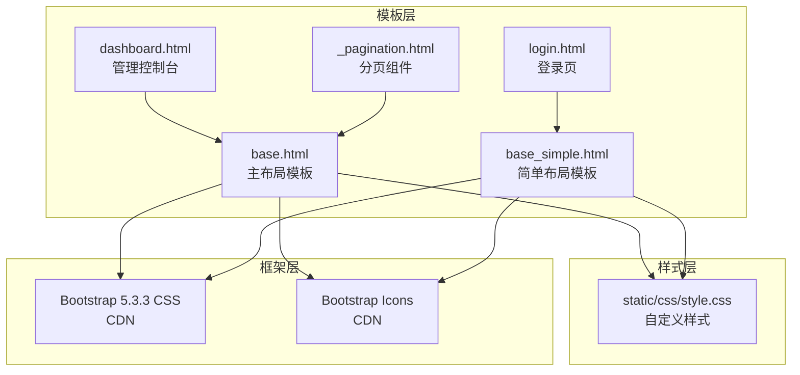
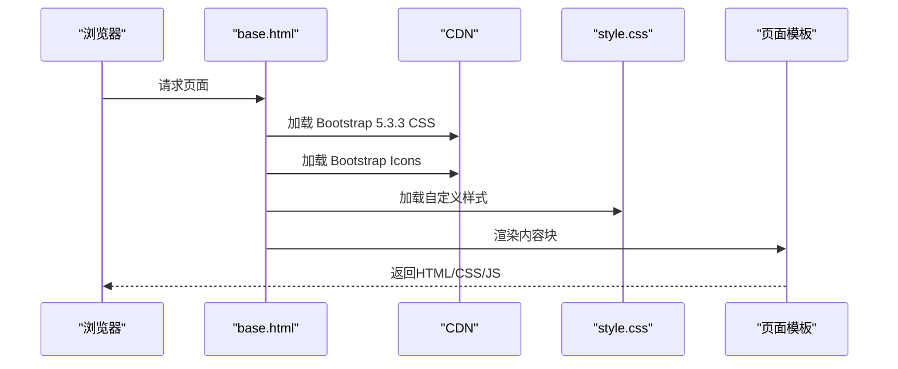
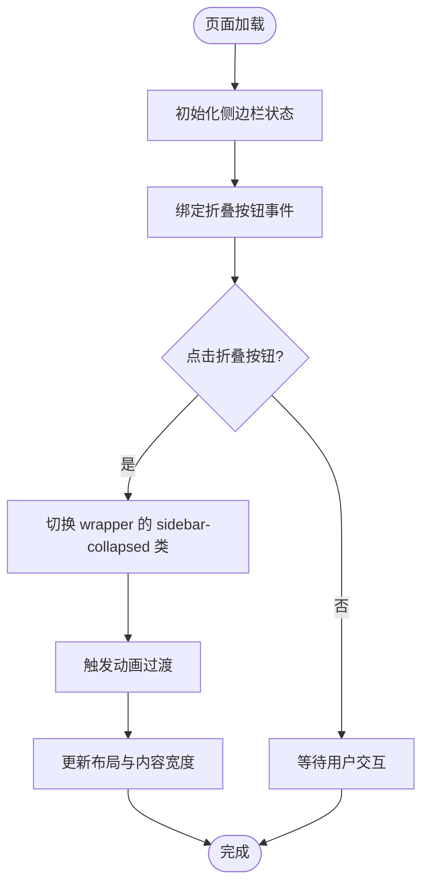
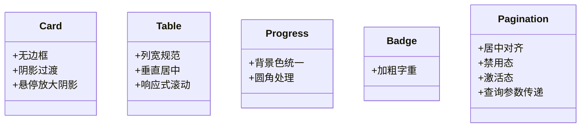
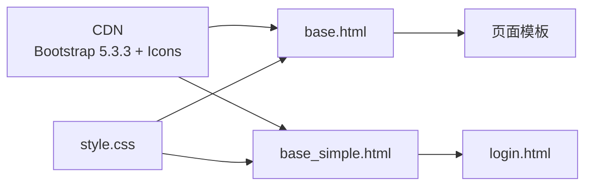

# 样式系统设计

<cite>
**本文档引用的文件**
- [style.css](file://static/css/style.css)
- [base.html](file://app/templates/base.html)
- [base_simple.html](file://app/templates/base_simple.html)
- [_pagination.html](file://app/templates/_pagination.html)
- [main.js](file://static/js/main.js)
- [login.html](file://app/templates/auth/login.html)
- [dashboard.html](file://app/templates/admin/dashboard.html)
- [README.md](file://README.md)
- [requirements.txt](file://requirements.txt)
</cite>

## 目录
1. [简介](#简介)
2. [项目结构](#项目结构)
3. [核心组件](#核心组件)
4. [架构总览](#架构总览)
5. [详细组件分析](#详细组件分析)
6. [依赖关系分析](#依赖关系分析)
7. [性能考量](#性能考量)
8. [故障排除指南](#故障排除指南)
9. [结论](#结论)
10. [附录](#附录)

## 简介
本项目采用Bootstrap 5作为主要CSS框架，结合自定义样式文件实现统一的视觉风格与交互体验。样式系统围绕以下目标构建：
- 使用CDN引入Bootstrap 5.3.3与Bootstrap Icons，确保跨浏览器兼容性与快速加载
- 通过自定义style.css实现主题化、响应式布局与组件增强
- 在基础模板中提供额外CSS块扩展点，便于页面级样式覆盖
- 统一管理颜色方案、间距与排版，支持移动端与打印场景

## 项目结构
样式系统由三层组成：
- 框架层：Bootstrap 5与Bootstrap Icons通过CDN引入
- 基础模板层：base.html与base_simple.html定义通用结构与样式注入点
- 自定义样式层：style.css提供全局样式、组件增强与响应式规则

图表来源
- [base.html:1-85](file://app/templates/base.html#L1-L85)
- [base_simple.html:1-25](file://app/templates/base_simple.html#L1-L25)
- [style.css:1-79](file://static/css/style.css#L1-L79)
- [login.html:1-45](file://app/templates/auth/login.html#L1-L45)
- [dashboard.html:1-30](file://app/templates/admin/dashboard.html#L1-L30)
- [_pagination.html:1-11](file://app/templates/_pagination.html#L1-L11)

章节来源
- [base.html:1-85](file://app/templates/base.html#L1-L85)
- [base_simple.html:1-25](file://app/templates/base_simple.html#L1-L25)
- [style.css:1-79](file://static/css/style.css#L1-L79)

## 核心组件
- Bootstrap 5.3.3：提供栅格系统、组件类、工具类与JavaScript插件
- Bootstrap Icons：提供图标字体与SVG图标
- 自定义样式style.css：覆盖默认样式、增强组件外观、实现响应式与打印样式
- 基础模板：base.html与base_simple.html分别提供复杂布局与简单布局的样式注入点

章节来源
- [base.html:7-10](file://app/templates/base.html#L7-L10)
- [base_simple.html:7-9](file://app/templates/base_simple.html#L7-L9)
- [style.css:1-79](file://static/css/style.css#L1-L79)
- [README.md:9-10](file://README.md#L9-L10)

## 架构总览
样式系统遵循“框架+自定义”的分层架构。基础模板负责引入框架与自定义样式，并提供额外CSS块扩展点；自定义样式通过选择器覆盖Bootstrap默认行为，实现主题化与组件增强。

图表来源
- [base.html:7-10](file://app/templates/base.html#L7-L10)
- [style.css:1-79](file://static/css/style.css#L1-L79)

## 详细组件分析

### 全局样式与排版
- 字体与背景：统一使用中文友好字体栈，设置页面背景色，确保阅读舒适度
- 间距与阴影：为卡片添加阴影与过渡效果，提升层次感
- 表格与进度条：规范表格列宽、垂直对齐与滚动行为；进度条圆角化增强视觉一致性

章节来源
- [style.css:1-79](file://static/css/style.css#L1-L79)

### 侧边栏与布局系统
- Flexbox布局：通过容器类实现主内容区自适应扩展
- 侧边栏定位：固定宽度侧边栏，支持折叠动画与移动端隐藏
- 响应式交互：在小屏设备上侧边栏变为固定定位并可显示/隐藏

图表来源
- [base.html:75-81](file://app/templates/base.html#L75-L81)
- [style.css:32-38](file://static/css/style.css#L32-L38)

章节来源
- [base.html:14-73](file://app/templates/base.html#L14-L73)
- [style.css:8-38](file://static/css/style.css#L8-L38)

### 组件样式定制
- 卡片：无边框、柔和阴影、悬停放大阴影，提升交互反馈
- 表格：规范列宽、居中对齐、响应式滚动，避免横向溢出
- 进度条：统一背景色与圆角，适配不同主题
- 徽章：加粗字重，提升可读性
- 分页：居中对齐、禁用态与激活态样式，配合查询参数传递

图表来源
- [style.css:40-65](file://static/css/style.css#L40-L65)
- [_pagination.html:1-11](file://app/templates/_pagination.html#L1-L11)

章节来源
- [style.css:40-65](file://static/css/style.css#L40-L65)
- [_pagination.html:1-11](file://app/templates/_pagination.html#L1-L11)

### 颜色方案与主题定制
- 主题色：使用Bootstrap语义色（如primary/success/info/warning/danger）与自定义颜色（如hover高亮）
- 导航栏：浅色背景与底部边框，提升可识别性
- 卡片边框：针对特定卡片类型设置强调色，突出状态
- 打印模式：隐藏非必要元素，保留主要内容

章节来源
- [style.css:63-78](file://static/css/style.css#L63-L78)
- [dashboard.html:4-16](file://app/templates/admin/dashboard.html#L4-L16)

### 响应式设计
- 移动端侧边栏：在小屏设备上隐藏并支持显示/隐藏
- 内容区域：自适应宽度，避免横向滚动
- 打印样式：隐藏导航、侧边栏与按钮，仅输出正文内容

章节来源
- [style.css:67-78](file://static/css/style.css#L67-L78)

### 样式覆盖机制
- 基础模板注入：通过模板块提供额外CSS注入点，便于页面级覆盖
- 选择器优先级：自定义样式在基础模板之后加载，确保覆盖Bootstrap默认样式
- 组件类复用：充分利用Bootstrap组件类，减少重复定义

章节来源
- [base.html](file://app/templates/base.html#L10)
- [base_simple.html](file://app/templates/base_simple.html#L9)

### JavaScript集成与自动提示
- 引导提示：页面加载后自动关闭可关闭提示，提升用户体验
- 交互增强：通过DOM事件与Bootstrap插件协作，实现平滑过渡

章节来源
- [main.js:1-11](file://static/js/main.js#L1-L11)
- [base.html:75-81](file://app/templates/base.html#L75-L81)

## 依赖关系分析
- 外部依赖：Bootstrap 5.3.3与Bootstrap Icons通过CDN引入，版本固定以保证稳定性
- 内部依赖：基础模板依赖自定义样式文件；页面模板继承基础模板并可扩展额外CSS
- 版本管理：通过CDN锁定版本，避免因框架升级导致的样式破坏

图表来源
- [base.html:7-10](file://app/templates/base.html#L7-L10)
- [base_simple.html:7-9](file://app/templates/base_simple.html#L7-L9)
- [style.css:1-79](file://static/css/style.css#L1-L79)

章节来源
- [base.html:7-10](file://app/templates/base.html#L7-L10)
- [base_simple.html:7-9](file://app/templates/base_simple.html#L7-L9)
- [requirements.txt:1-8](file://requirements.txt#L1-L8)

## 性能考量
- CDN加速：通过CDN加载框架与图标，减少本地带宽占用
- 样式合并：将自定义样式集中在一个文件中，减少HTTP请求
- 响应式优化：在小屏设备上隐藏非必要元素，降低渲染负担
- 动画节流：过渡动画时长适中，避免影响交互流畅性

## 故障排除指南
- 样式未生效：检查基础模板是否正确引入自定义样式文件与框架CSS
- 响应式异常：确认媒体查询范围与设备断点设置是否符合预期
- 图标不显示：验证Bootstrap Icons是否正确加载且CDN可用
- 交互失效：检查JavaScript是否正确加载，事件绑定是否在DOM就绪后执行

章节来源
- [base.html:7-10](file://app/templates/base.html#L7-L10)
- [base_simple.html:7-9](file://app/templates/base_simple.html#L7-L9)
- [main.js:1-11](file://static/js/main.js#L1-L11)

## 结论
该样式系统通过Bootstrap 5的强大多样性和自定义样式的精确控制，实现了统一、美观且高效的前端界面。其分层架构确保了可维护性与可扩展性，同时通过响应式与打印样式覆盖了多场景需求。建议在后续迭代中持续关注框架版本更新与浏览器兼容性，保持样式系统的稳定演进。

## 附录
- 最佳实践
  - 使用语义化类名与组件类，减少自定义选择器数量
  - 将页面级样式封装在模板块中，避免全局污染
  - 为关键交互设置过渡动画，提升用户体验
  - 在开发环境中启用Source Maps，便于调试与定位问题