# 模板继承体系

<cite>
**本文档引用的文件**
- [base.html](file://app/templates/base.html)
- [base_simple.html](file://app/templates/base_simple.html)
- [admin/dashboard.html](file://app/templates/admin/dashboard.html)
- [student/dashboard.html](file://app/templates/student/dashboard.html)
- [teacher/dashboard.html](file://app/templates/teacher/dashboard.html)
- [admin/students.html](file://app/templates/admin/students.html)
- [student/courses.html](file://app/templates/student/courses.html)
- [auth/login.html](file://app/templates/auth/login.html)
- [404.html](file://app/templates/404.html)
- [403.html](file://app/templates/403.html)
- [500.html](file://app/templates/500.html)
- [_csrf_field.html](file://app/templates/_csrf_field.html)
- [_pagination.html](file://app/templates/_pagination.html)
</cite>

## 目录
1. [简介](#简介)
2. [项目结构](#项目结构)
3. [核心组件](#核心组件)
4. [架构概览](#架构概览)
5. [详细组件分析](#详细组件分析)
6. [依赖关系分析](#依赖关系分析)
7. [性能考虑](#性能考虑)
8. [故障排除指南](#故障排除指南)
9. [结论](#结论)

## 简介

本项目采用Jinja2模板引擎构建的完整Web应用，实现了基于模板继承的现代化前端架构。模板继承体系通过基础模板和子模板的组合，提供了高度一致的用户体验和灵活的内容定制能力。

系统的核心设计理念是：
- **统一性**：所有页面共享相同的布局结构和样式
- **可扩展性**：通过块（block）机制实现内容的局部替换
- **角色适配**：根据用户角色动态调整导航菜单和功能展示
- **响应式设计**：支持移动端和桌面端的自适应布局

## 项目结构

项目采用按功能模块组织的模板结构，主要分为以下几类：

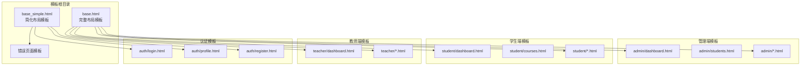

**图表来源**
- [base.html:1-85](file://app/templates/base.html#L1-L85)
- [base_simple.html:1-25](file://app/templates/base_simple.html#L1-L25)

**章节来源**
- [base.html:1-85](file://app/templates/base.html#L1-L85)
- [base_simple.html:1-25](file://app/templates/base_simple.html#L1-L25)

## 核心组件

### 基础模板体系

系统包含两个核心基础模板，分别服务于不同的使用场景：

#### 完整布局模板（base.html）
提供完整的管理界面布局，包含侧边栏导航、顶部导航栏和消息提示系统。

#### 简化布局模板（base_simple.html）
专为简单页面设计，适用于登录、错误页面等不需要复杂导航的场景。

### 关键块结构

模板继承体系通过预定义的块实现内容的模块化管理：

| 块名称 | 类型 | 作用 | 继承规则 |
|--------|------|------|----------|
| title | 必需 | 页面标题 | 子模板必须覆盖 |
| page_title | 可选 | 页面标题栏显示 | 子模板可覆盖 |
| content | 必需 | 主要内容区域 | 子模板必须覆盖 |
| extra_css | 可选 | 额外CSS样式 | 子模板可覆盖 |
| extra_js | 可选 | 额外JavaScript脚本 | 子模板可覆盖 |

**章节来源**
- [base.html:6-10](file://app/templates/base.html#L6-L10)
- [base.html:52-52](file://app/templates/base.html#L52-L52)
- [base.html:70-70](file://app/templates/base.html#L70-L70)
- [base.html:10-10](file://app/templates/base.html#L10-L10)
- [base.html:82-82](file://app/templates/base.html#L82-L82)
- [base_simple.html:6-6](file://app/templates/base_simple.html#L6-L6)
- [base_simple.html:19-19](file://app/templates/base_simple.html#L19-L19)
- [base_simple.html:22-22](file://app/templates/base_simple.html#L22-L22)

## 架构概览

系统采用分层模板架构，通过继承关系实现代码复用和功能扩展：

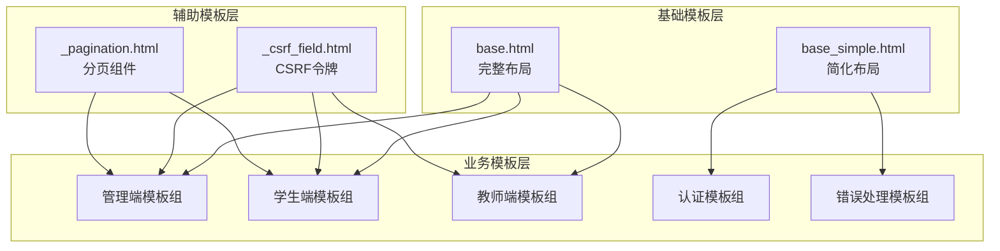

**图表来源**
- [base.html:1-85](file://app/templates/base.html#L1-L85)
- [base_simple.html:1-25](file://app/templates/base_simple.html#L1-L25)
- [_csrf_field.html:1-2](file://app/templates/_csrf_field.html#L1-L2)
- [_pagination.html:1-11](file://app/templates/_pagination.html#L1-L11)

## 详细组件分析

### 基础模板（base.html）

#### 结构设计
完整布局模板提供了现代化的管理界面框架，包含以下核心组件：

1. **侧边栏导航系统**
   - 动态角色菜单（管理员、教师、学生）
   - 响应式折叠功能
   - Bootstrap图标集成

2. **顶部导航栏**
   - 用户信息下拉菜单
   - 登录状态显示
   - 个人资料和退出功能

3. **消息提示系统**
   - Flask消息闪现机制集成
   - 多种消息类型支持（成功、警告、错误等）
   - 自动关闭功能

#### 条件渲染机制

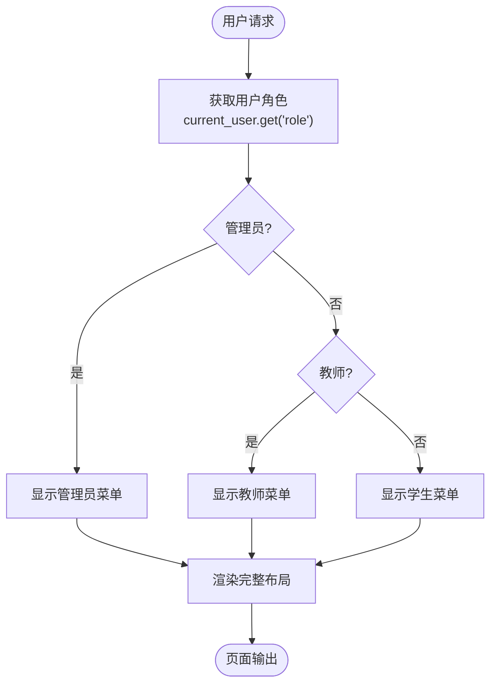

**图表来源**
- [base.html:13-18](file://app/templates/base.html#L13-L18)
- [base.html:21-46](file://app/templates/base.html#L21-L46)

#### 消息系统实现

模板集成了Flask的flash消息机制，通过以下流程实现：

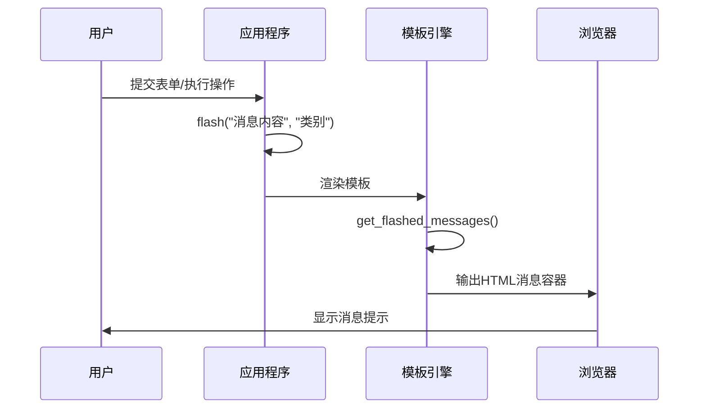

**图表来源**
- [base.html:64-69](file://app/templates/base.html#L64-L69)

**章节来源**
- [base.html:1-85](file://app/templates/base.html#L1-L85)

### 基础模板（base_simple.html）

#### 设计理念
简化布局模板专注于提供最小化的页面骨架，适用于：

- 登录和注册页面
- 错误页面（404、403、500）
- 简单的信息展示页面

#### 核心特性
- 精简的HTML结构
- 基础的Bootstrap集成
- 内置消息提示系统
- 可扩展的JavaScript区域

**章节来源**
- [base_simple.html:1-25](file://app/templates/base_simple.html#L1-L25)

### 管理端模板分析

#### 管理员控制台（admin/dashboard.html）

管理员控制台展示了完整的数据仪表板设计：

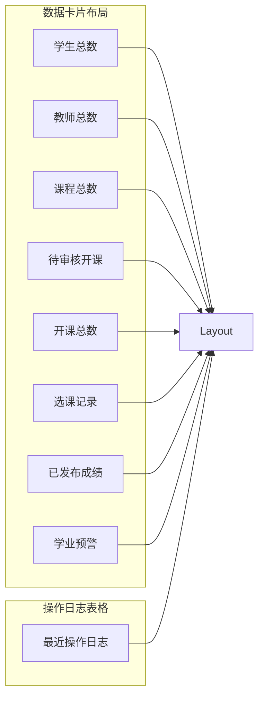

**图表来源**
- [admin/dashboard.html:4-16](file://app/templates/admin/dashboard.html#L4-L16)
- [admin/dashboard.html:17-28](file://app/templates/admin/dashboard.html#L17-L28)

#### 学生管理页面（admin/students.html）

学生管理页面体现了复杂的数据表格和模态对话框设计：

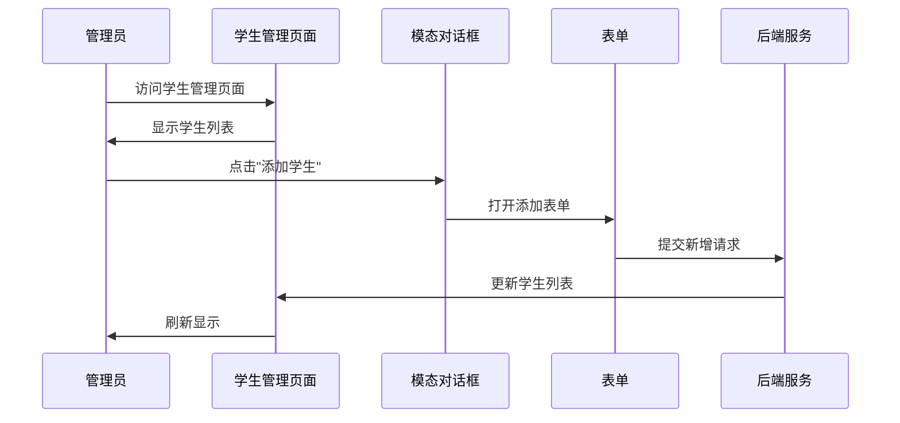

**图表来源**
- [admin/students.html:39-67](file://app/templates/admin/students.html#L39-L67)
- [admin/students.html:70-100](file://app/templates/admin/students.html#L70-L100)

**章节来源**
- [admin/dashboard.html:1-30](file://app/templates/admin/dashboard.html#L1-L30)
- [admin/students.html:1-117](file://app/templates/admin/students.html#L1-L117)

### 学生端模板分析

#### 学生控制台（student/dashboard.html）

学生控制台采用了响应式卡片布局设计：

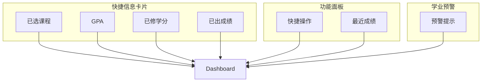

**图表来源**
- [student/dashboard.html:21-42](file://app/templates/student/dashboard.html#L21-L42)
- [student/dashboard.html:44-71](file://app/templates/student/dashboard.html#L44-L71)

#### 课程选择页面（student/courses.html）

课程选择页面展示了复杂的交互设计：

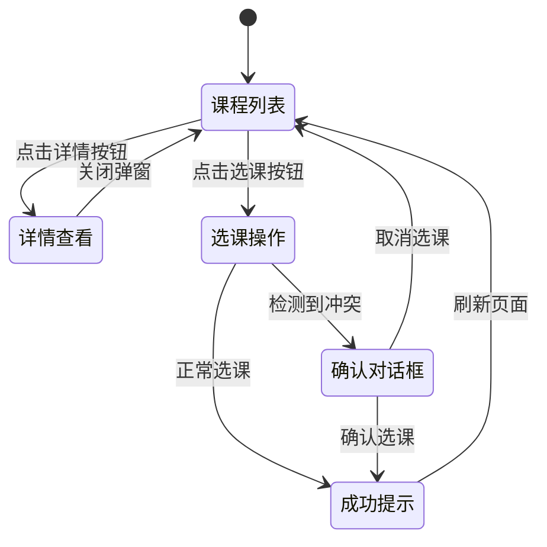

**图表来源**
- [student/courses.html:43-52](file://app/templates/student/courses.html#L43-L52)
- [student/courses.html:69-94](file://app/templates/student/courses.html#L69-L94)

**章节来源**
- [student/dashboard.html:1-73](file://app/templates/student/dashboard.html#L1-L73)
- [student/courses.html:1-95](file://app/templates/student/courses.html#L1-L95)

### 教师端模板分析

#### 教师控制台（teacher/dashboard.html）

教师控制台采用了网格布局展示开课信息：

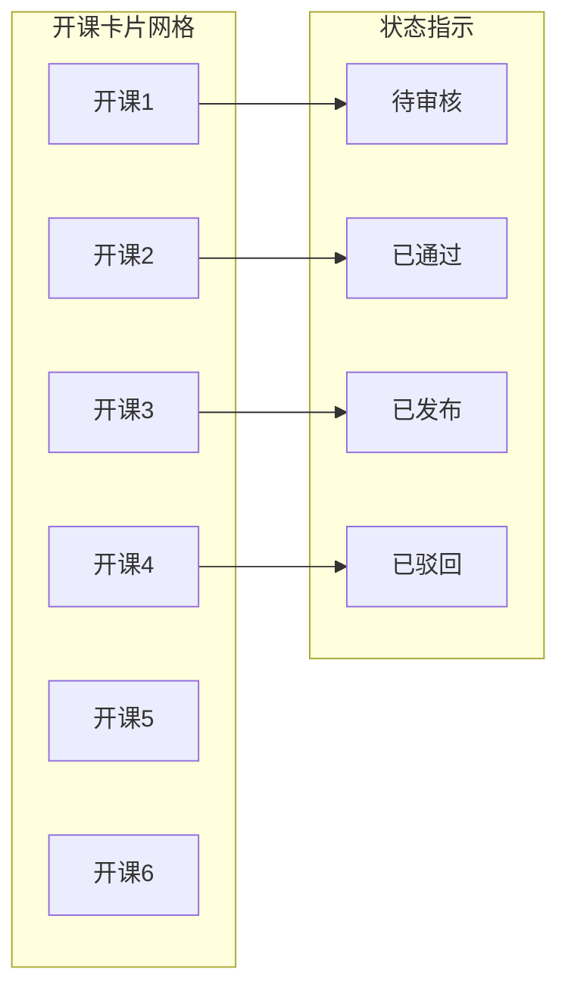

**图表来源**
- [teacher/dashboard.html:6-25](file://app/templates/teacher/dashboard.html#L6-L25)

**章节来源**
- [teacher/dashboard.html:1-27](file://app/templates/teacher/dashboard.html#L1-L27)

### 认证和错误页面

#### 登录页面（auth/login.html）

登录页面使用简化模板，专注于用户认证功能：

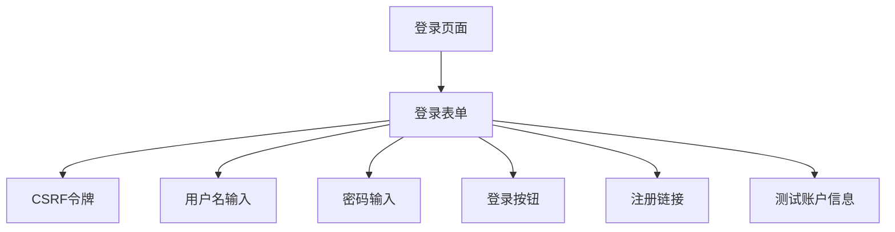

**图表来源**
- [auth/login.html:11-33](file://app/templates/auth/login.html#L11-L33)

#### 错误页面（404、403、500）

错误页面统一使用简化模板，提供一致的用户体验：

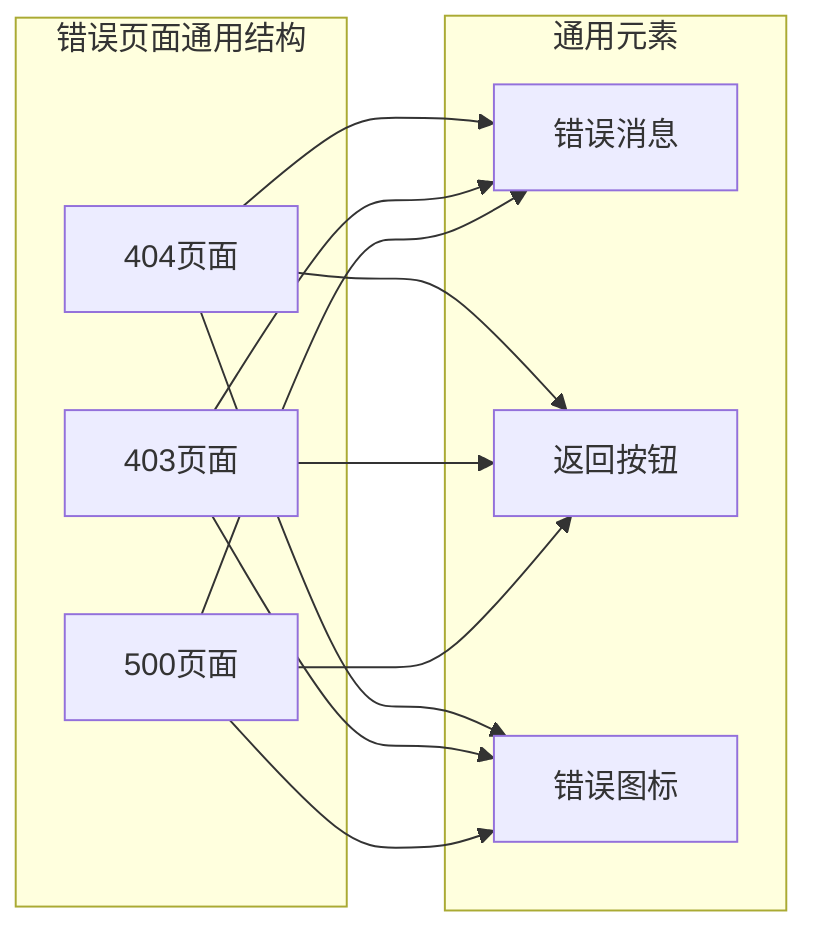

**图表来源**
- [404.html:4-10](file://app/templates/404.html#L4-L10)
- [403.html:4-8](file://app/templates/403.html#L4-L8)
- [500.html:4-10](file://app/templates/500.html#L4-L10)

**章节来源**
- [auth/login.html:1-45](file://app/templates/auth/login.html#L1-L45)
- [404.html:1-12](file://app/templates/404.html#L1-L12)
- [403.html:1-10](file://app/templates/403.html#L1-L10)
- [500.html:1-12](file://app/templates/500.html#L1-L12)

## 依赖关系分析

### 模板继承链路

系统中的模板继承关系形成了清晰的层次结构：

```mermaid
graph TD
subgraph "基础模板"
Base[base.html]
BaseSimple[base_simple.html]
end
subgraph "管理端模板"
AdminDashboard[admin/dashboard.html]
AdminStudents[admin/students.html]
AdminClasses[admin/classes.html]
AdminTeachers[admin/teachers.html]
end
subgraph "学生端模板"
StudentDashboard[student/dashboard.html]
StudentCourses[student/courses.html]
StudentGrades[student/grades.html]
StudentSchedule[student/schedule.html]
end
subgraph "教师端模板"
TeacherDashboard[teacher/dashboard.html]
TeacherOfferings[teacher/my_offerings.html]
TeacherStats[teacher/grade_stats.html]
end
subgraph "认证模板"
Login[auth/login.html]
Profile[auth/profile.html]
Register[auth/register.html]
end
subgraph "错误模板"
NotFound[404.html]
Forbidden[403.html]
ServerError[500.html]
end
Base --> AdminDashboard
Base --> StudentDashboard
Base --> TeacherDashboard
BaseSimple --> Login
BaseSimple --> NotFound
BaseSimple --> Forbidden
BaseSimple --> ServerError
Base --> AdminStudents
Base --> AdminClasses
Base --> AdminTeachers
Base --> StudentCourses
Base --> StudentGrades
Base --> StudentSchedule
Base --> TeacherOfferings
Base --> TeacherStats
BaseSimple --> Profile
BaseSimple --> Register
```

**图表来源**
- [base.html:1-85](file://app/templates/base.html#L1-L85)
- [base_simple.html:1-25](file://app/templates/base_simple.html#L1-L25)

### 辅助模板依赖

系统中的辅助模板提供了可复用的功能组件：

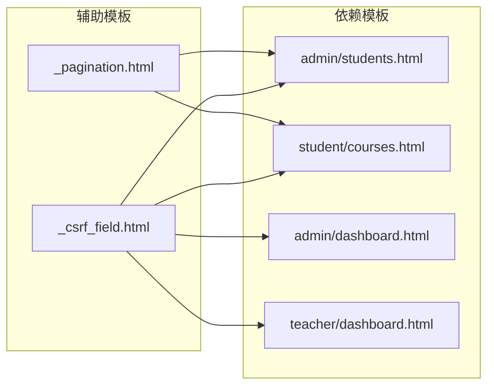

**图表来源**
- [_csrf_field.html:1-2](file://app/templates/_csrf_field.html#L1-L2)
- [_pagination.html:1-11](file://app/templates/_pagination.html#L1-L11)

**章节来源**
- [admin/dashboard.html:1-30](file://app/templates/admin/dashboard.html#L1-L30)
- [student/courses.html:1-95](file://app/templates/student/courses.html#L1-L95)
- [admin/students.html:1-117](file://app/templates/admin/students.html#L1-L117)

## 性能考虑

### 模板渲染优化

1. **静态资源缓存**
   - Bootstrap CSS/JS CDN缓存
   - 本地静态文件版本控制
   - 图标字体文件缓存

2. **条件渲染优化**
   - 角色相关的菜单项仅在必要时渲染
   - 分页组件仅在数据量超过阈值时显示
   - 消息提示系统避免重复渲染

3. **JavaScript延迟加载**
   - 额外的JavaScript脚本延迟到页面底部
   - 仅在需要时加载Chart.js库
   - 事件监听器的合理绑定

### 模板继承性能

- **编译时优化**：基础模板预编译，减少运行时解析
- **缓存策略**：Jinja2模板缓存机制
- **内存管理**：避免不必要的变量存储

## 故障排除指南

### 常见问题诊断

#### 模板继承问题
- **症状**：子模板无法正确继承基础模板
- **原因**：extends标签语法错误或路径不正确
- **解决方案**：检查模板文件路径和extends语法

#### 块覆盖问题
- **症状**：自定义内容未显示
- **原因**：块名称不匹配或语法错误
- **解决方案**：确保块名称完全一致

#### 导航菜单问题
- **症状**：菜单项显示异常或缺失
- **原因**：用户角色判断逻辑错误
- **解决方案**：检查current_user数据结构

#### 消息提示问题
- **症状**：flash消息不显示
- **原因**：消息闪现机制未正确配置
- **解决方案**：验证get_flashed_messages调用

**章节来源**
- [base.html:13-18](file://app/templates/base.html#L13-L18)
- [base.html:64-69](file://app/templates/base.html#L64-L69)

### 调试技巧

1. **模板变量调试**
   ```python
   # 在Flask视图函数中添加调试信息
   print(f"Current user: {current_user}")
   print(f"Template blocks: {template_blocks}")
   ```

2. **模板渲染调试**
   - 使用Jinja2的调试模式
   - 检查模板文件编码格式
   - 验证模板语法正确性

3. **浏览器开发者工具**
   - 检查网络请求和响应
   - 验证JavaScript错误
   - 分析DOM结构

## 结论

本项目的模板继承体系展现了现代Web应用的最佳实践：

### 设计优势
- **高度一致性**：通过基础模板确保用户体验的一致性
- **灵活扩展**：块机制允许精确的内容定制
- **角色适配**：动态菜单和功能展示提升用户体验
- **代码复用**：减少重复代码，提高维护效率

### 技术亮点
- **响应式设计**：Bootstrap框架提供跨设备兼容性
- **消息系统**：集成Flask消息闪现机制
- **安全考虑**：CSRF保护和权限控制
- **性能优化**：合理的资源管理和延迟加载

### 改进建议
- 可以考虑引入模板宏来进一步减少重复代码
- 建立更完善的模板测试套件
- 考虑添加模板缓存配置优化性能
- 实现模板热更新机制提升开发效率

这个模板继承体系为MIS系统提供了坚实的技术基础，既满足了当前的功能需求，又为未来的功能扩展预留了充足的空间。