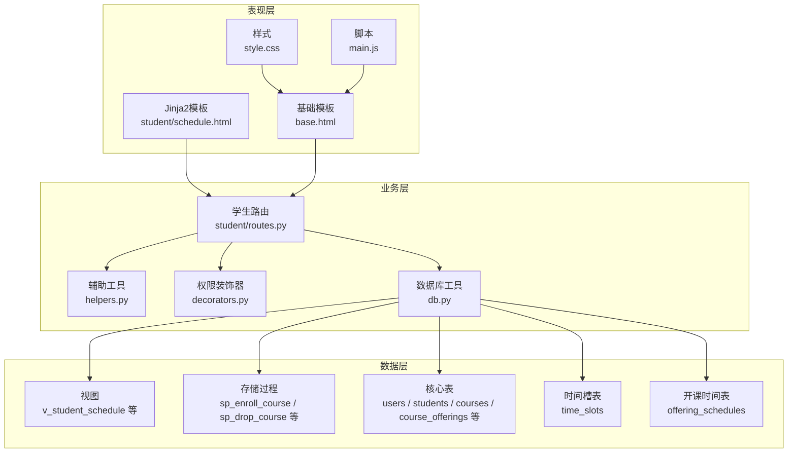
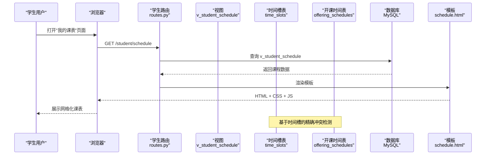
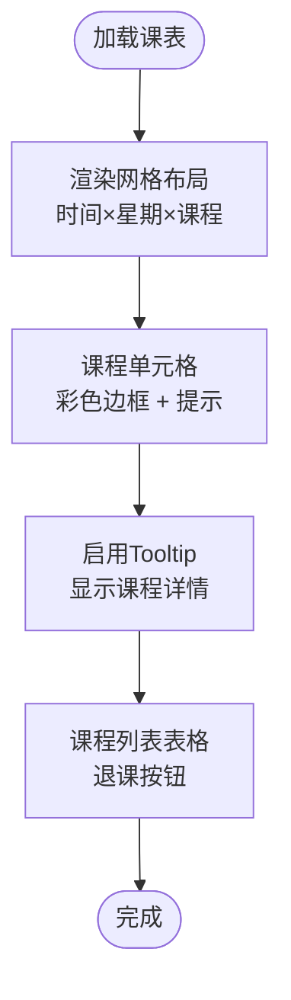
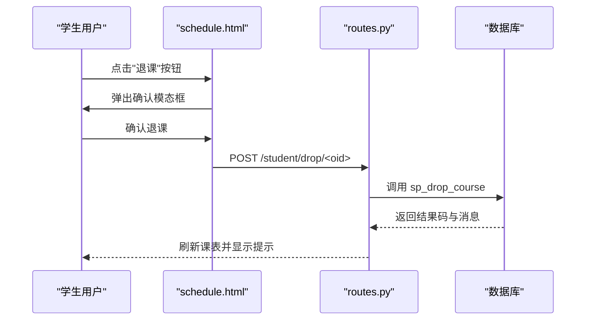
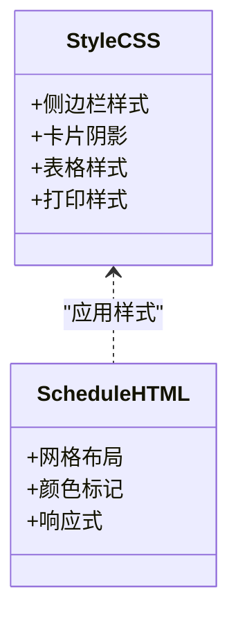
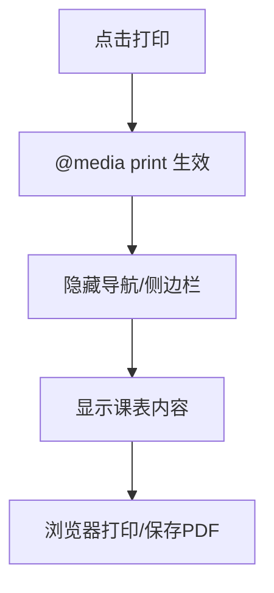
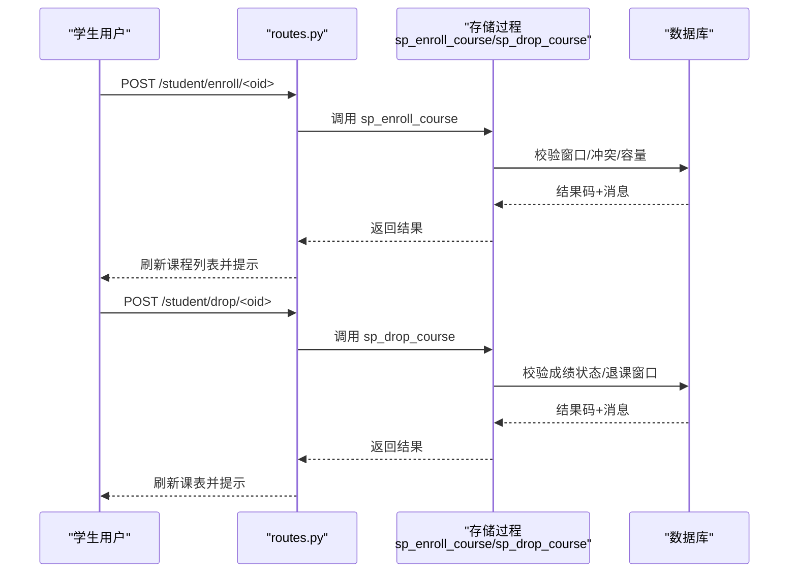
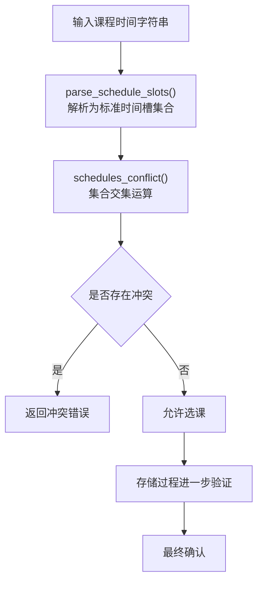
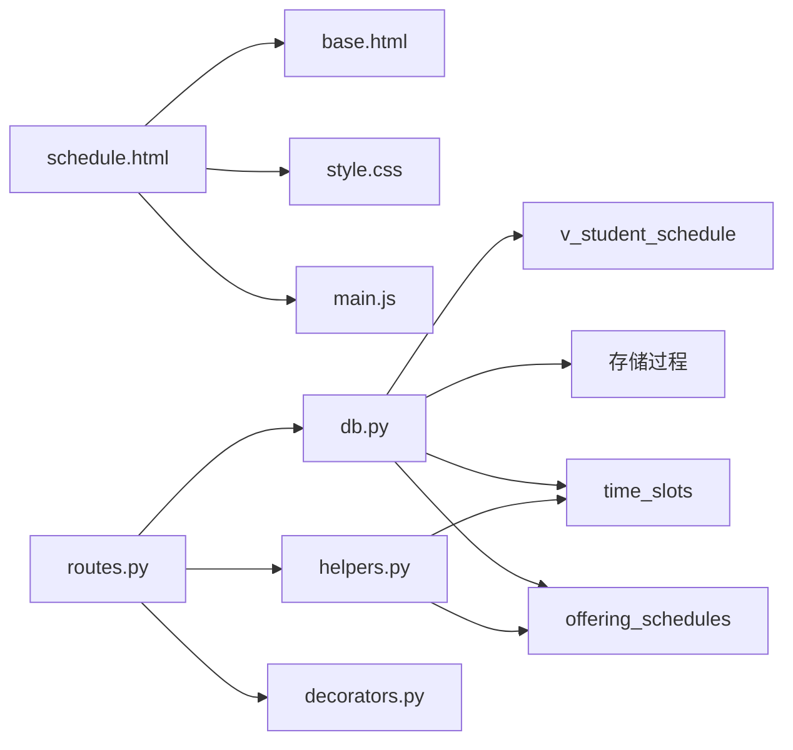

# 个人课表管理

<cite>
**本文档引用的文件**
- [app/templates/student/schedule.html](file://app/templates/student/schedule.html)
- [app/student/routes.py](file://app/student/routes.py)
- [app/templates/base.html](file://app/templates/base.html)
- [static/css/style.css](file://static/css/style.css)
- [static/js/main.js](file://static/js/main.js)
- [app/db.py](file://app/db.py)
- [app/helpers.py](file://app/helpers.py)
- [sql/01_schema.sql](file://sql/01_schema.sql)
- [sql/04_views.sql](file://sql/04_views.sql)
- [sql/03_procedures.sql](file://sql/03_procedures.sql)
- [sql/06_schedule_migration.sql](file://sql/06_schedule_migration.sql)
- [app/decorators.py](file://app/decorators.py)
- [config.py](file://config.py)
- [README.md](file://README.md)
</cite>

## 目录
1. [简介](#简介)
2. [项目结构](#项目结构)
3. [核心组件](#核心组件)
4. [架构概览](#架构概览)
5. [详细组件分析](#详细组件分析)
6. [依赖分析](#依赖分析)
7. [性能考虑](#性能考虑)
8. [故障排除指南](#故障排除指南)
9. [结论](#结论)
10. [附录](#附录)

## 简介
本文件面向学生用户，提供个人课表管理功能的完整使用文档。内容涵盖课表显示界面设计、课程查看与详情、个性化设置、导出与打印、最佳实践以及故障排除指南。系统基于Flask + MySQL构建，采用Bootstrap 5进行界面展示，支持响应式布局与移动端适配。**新增**了基于时间槽的精确冲突检测机制，提供更可靠的课表冲突避免能力。

## 项目结构
系统采用典型的三层架构：
- 表现层：Jinja2模板渲染，Bootstrap 5样式与交互
- 业务层：Flask蓝图路由处理请求，调用数据库工具与存储过程
- 数据层：MySQL数据库，包含12张核心表、视图、存储过程与触发器

**图表来源**
- [app/templates/student/schedule.html:1-97](file://app/templates/student/schedule.html#L1-L97)
- [app/templates/base.html:1-85](file://app/templates/base.html#L1-L85)
- [static/css/style.css:1-79](file://static/css/style.css#L1-L79)
- [static/js/main.js:1-11](file://static/js/main.js#L1-L11)
- [app/student/routes.py:1-220](file://app/student/routes.py#L1-L220)
- [app/db.py:1-121](file://app/db.py#L1-L121)
- [app/helpers.py:1-80](file://app/helpers.py#L1-L80)
- [sql/01_schema.sql:1-235](file://sql/01_schema.sql#L1-L235)
- [sql/04_views.sql:1-113](file://sql/04_views.sql#L1-L113)
- [sql/03_procedures.sql:1-381](file://sql/03_procedures.sql#L1-L381)
- [sql/06_schedule_migration.sql:23-51](file://sql/06_schedule_migration.sql#L23-L51)

**章节来源**
- [README.md:1-87](file://README.md#L1-L87)
- [app/templates/base.html:1-85](file://app/templates/base.html#L1-L85)
- [app/templates/student/schedule.html:1-97](file://app/templates/student/schedule.html#L1-L97)

## 核心组件
- 课表视图与模板：基于网格布局的课程时间轴，支持课程单元格点击提示与颜色区分
- 学生路由：提供课表查询、课程详情、选课/退课等接口
- 数据库工具：封装连接池、查询、分页与存储过程调用
- 辅助工具：解析课表字符串、检测时间冲突、获取选课时间段
- 权限装饰器：统一登录与角色校验
- 配置：数据库连接池、分页、权重与预警阈值等参数
- **新增**时间槽系统：基于time_slots表的标准化时间槽定义，支持精确的冲突检测

**章节来源**
- [app/student/routes.py:163-169](file://app/student/routes.py#L163-L169)
- [app/templates/student/schedule.html:16-96](file://app/templates/student/schedule.html#L16-L96)
- [app/db.py:43-121](file://app/db.py#L43-L121)
- [app/helpers.py:23-80](file://app/helpers.py#L23-L80)
- [app/decorators.py:7-26](file://app/decorators.py#L7-L26)
- [config.py:6-36](file://config.py#L6-L36)
- [sql/06_schedule_migration.sql:23-51](file://sql/06_schedule_migration.sql#L23-L51)

## 架构概览
课表管理的端到端流程如下：

**图表来源**
- [app/student/routes.py:163-169](file://app/student/routes.py#L163-L169)
- [sql/04_views.sql:10-32](file://sql/04_views.sql#L10-L32)
- [sql/06_schedule_migration.sql:23-51](file://sql/06_schedule_migration.sql#L23-L51)
- [app/templates/student/schedule.html:16-96](file://app/templates/student/schedule.html#L16-L96)

## 详细组件分析

### 课表显示界面设计与布局
- 网格布局：左侧为时间列，上方为星期标题，形成5列×4行的课程网格
- 单元格样式：课程单元格带彩色左边界线，悬停高亮，包含课程名称、教师、教室与学分信息
- 响应式设计：在小屏设备上缩小字体与列宽，保证可读性
- 工具提示：启用Bootstrap Tooltip，鼠标悬停显示课程详情
- 课程列表：下方表格列出所有已选课程，便于快速查阅与退课

**图表来源**
- [app/templates/student/schedule.html:18-48](file://app/templates/student/schedule.html#L18-L48)
- [app/templates/student/schedule.html:50-66](file://app/templates/student/schedule.html#L50-L66)
- [app/templates/student/schedule.html:92-96](file://app/templates/student/schedule.html#L92-L96)

**章节来源**
- [app/templates/student/schedule.html:1-97](file://app/templates/student/schedule.html#L1-L97)

### 课程查看与详情
- 课程网格：每个单元格代表一个时间槽，若存在课程则显示课程名称、教师、教室与学分
- 课程列表：表格形式展示课程代码、学分、教师、时间与教室，提供退课操作入口
- 退课弹窗：点击"退课"按钮弹出确认对话框，提交CSRF保护的POST请求

**图表来源**
- [app/templates/student/schedule.html:59-81](file://app/templates/student/schedule.html#L59-L81)
- [app/student/routes.py:149-160](file://app/student/routes.py#L149-L160)
- [sql/03_procedures.sql:119-194](file://sql/03_procedures.sql#L119-L194)

**章节来源**
- [app/templates/student/schedule.html:50-81](file://app/templates/student/schedule.html#L50-L81)
- [app/student/routes.py:149-160](file://app/student/routes.py#L149-L160)

### 个性化设置
- 主题与样式：通过全局CSS控制侧边栏、卡片、表格与打印样式，支持打印输出
- 显示模式：网格布局与列表布局结合，满足不同阅读习惯
- 重要课程标记：课程单元格使用不同颜色左边界线，便于视觉识别

**图表来源**
- [static/css/style.css:1-79](file://static/css/style.css#L1-L79)
- [app/templates/student/schedule.html:4-14](file://app/templates/student/schedule.html#L4-L14)

**章节来源**
- [static/css/style.css:1-79](file://static/css/style.css#L1-L79)
- [app/templates/student/schedule.html:4-14](file://app/templates/student/schedule.html#L4-L14)

### 导出与打印
- 打印样式：通过@media print隐藏导航与侧边栏，仅输出主要内容
- 日历导出：当前模板未内置日历导出功能，可通过浏览器打印或截图保存
- 移动设备同步：课表为Web页面，可在移动端浏览器中打开与分享

**图表来源**
- [static/css/style.css:74-79](file://static/css/style.css#L74-L79)
- [app/templates/base.html:75-82](file://app/templates/base.html#L75-L82)

**章节来源**
- [static/css/style.css:74-79](file://static/css/style.css#L74-L79)
- [app/templates/base.html:75-82](file://app/templates/base.html#L75-L82)

### 选课与退课流程
- 选课：通过课程详情接口返回JSON，前端根据结果更新UI
- 退课：提交CSRF保护的POST请求，调用存储过程执行原子性退课操作

**图表来源**
- [app/student/routes.py:135-160](file://app/student/routes.py#L135-L160)
- [sql/03_procedures.sql:14-114](file://sql/03_procedures.sql#L14-L114)
- [sql/03_procedures.sql:119-194](file://sql/03_procedures.sql#L119-L194)

**章节来源**
- [app/student/routes.py:135-160](file://app/student/routes.py#L135-L160)
- [sql/03_procedures.sql:14-114](file://sql/03_procedures.sql#L14-L114)
- [sql/03_procedures.sql:119-194](file://sql/03_procedures.sql#L119-L194)

### 时间槽冲突检测机制
**新增**系统现在具备精确的时间槽冲突检测能力，通过以下机制实现：

- **时间槽标准化**：time_slots表定义标准时间槽，包括星期几、节次编号、开始结束时间
- **开课时间关联**：offering_schedules表建立课程与具体时间槽的关联关系
- **冲突检测算法**：基于集合运算的精确冲突判断，避免传统字符串匹配的误差
- **实时验证**：前端和后端双重验证，确保选课时的准确性

**图表来源**
- [app/helpers.py:22-64](file://app/helpers.py#L22-L64)
- [sql/06_schedule_migration.sql:23-51](file://sql/06_schedule_migration.sql#L23-L51)
- [sql/03_procedures.sql:75-80](file://sql/03_procedures.sql#L75-L80)

**章节来源**
- [app/helpers.py:22-64](file://app/helpers.py#L22-L64)
- [sql/06_schedule_migration.sql:23-51](file://sql/06_schedule_migration.sql#L23-L51)
- [sql/03_procedures.sql:75-80](file://sql/03_procedures.sql#L75-L80)

## 依赖分析
- 模板依赖：schedule.html继承base.html，引入Bootstrap与本地样式
- 路由依赖：学生路由依赖数据库工具、辅助工具与权限装饰器
- 数据依赖：视图v_student_schedule提供课表数据，存储过程保证选课/退课一致性
- **新增**时间槽依赖：辅助工具依赖time_slots和offering_schedules表进行精确冲突检测

**图表来源**
- [app/templates/student/schedule.html:1-15](file://app/templates/student/schedule.html#L1-L15)
- [app/templates/base.html:7-10](file://app/templates/base.html#L7-L10)
- [app/student/routes.py:1-9](file://app/student/routes.py#L1-L9)
- [app/db.py:1-121](file://app/db.py#L1-L121)
- [sql/04_views.sql:10-32](file://sql/04_views.sql#L10-L32)
- [sql/03_procedures.sql:1-381](file://sql/03_procedures.sql#L1-L381)
- [sql/06_schedule_migration.sql:23-51](file://sql/06_schedule_migration.sql#L23-L51)
- [app/helpers.py:22-64](file://app/helpers.py#L22-L64)

**章节来源**
- [app/templates/student/schedule.html:1-15](file://app/templates/student/schedule.html#L1-L15)
- [app/templates/base.html:7-10](file://app/templates/base.html#L7-L10)
- [app/student/routes.py:1-9](file://app/student/routes.py#L1-L9)
- [app/db.py:1-121](file://app/db.py#L1-L121)

## 性能考虑
- 数据库连接池：使用DBUtils连接池，减少连接开销，提高并发性能
- 分页查询：默认每页15条，减轻网络传输与前端渲染压力
- 存储过程：在数据库层面执行选课/退课逻辑，减少往返次数与并发冲突风险
- 视图优化：通过视图聚合关联查询，简化路由层SQL复杂度
- **新增**索引优化：time_slots表的day_of_week和period_num字段建立唯一索引，提升查询性能

**章节来源**
- [app/db.py:10-26](file://app/db.py#L10-L26)
- [app/db.py:92-121](file://app/db.py#L92-L121)
- [config.py:24-25](file://config.py#L24-L25)
- [sql/04_views.sql:10-32](file://sql/04_views.sql#L10-L32)
- [sql/06_schedule_migration.sql:27-35](file://sql/06_schedule_migration.sql#L27-L35)

## 故障排除指南
- 无法看到课表
  - 检查是否已选课且课程状态为已发布
  - 确认当前学期是否正确设置
  - 查看是否有空数据分支并跳转到选课页面
- 退课失败
  - 确认当前是否处于退课窗口期
  - 若课程已有非草稿成绩，系统禁止退课
  - 检查CSRF令牌是否正确提交
- 选课冲突
  - **更新**系统现在使用精确的时间槽冲突检测，基于time_slots表的标准时间槽定义
  - 冲突检测基于集合运算，比传统字符串匹配更加准确
  - 如果出现冲突，请检查课程的具体时间槽定义
- 打印异常
  - 使用浏览器打印功能，确保@media print生效
  - 关闭隐藏元素的扩展插件以避免样式干扰

**章节来源**
- [app/templates/student/schedule.html:83-89](file://app/templates/student/schedule.html#L83-L89)
- [app/student/routes.py:149-160](file://app/student/routes.py#L149-L160)
- [sql/03_procedures.sql:119-194](file://sql/03_procedures.sql#L119-L194)
- [app/helpers.py:61-64](file://app/helpers.py#L61-L64)
- [static/css/style.css:74-79](file://static/css/style.css#L74-L79)

## 结论
本课表管理功能以简洁直观的网格布局呈现课程信息，结合响应式设计与打印样式，满足学生在桌面与移动端的使用需求。**新增**的基于time_slots表的时间槽冲突检测机制提供了更精确的冲突避免能力，通过标准化的时间槽定义和集合运算实现了可靠的课表管理。通过存储过程与视图保障数据一致性与查询效率，配合权限控制与CSRF防护提升安全性。建议用户合理规划课程时间，利用新的冲突检测机制避免时间重叠，并利用打印功能保存课表以便复习与排课参考。

## 附录

### 使用示例
- 查看课表
  - 登录后进入"我的课表"，查看网格化课程时间轴
  - 悬停课程单元格查看教师与教室信息
- 查看课程列表
  - 在课程列表中查看课程代码、学分、教师、时间与教室
  - 点击"退课"按钮进行退课操作
- 个性化设置
  - 使用不同颜色的课程单元格进行视觉区分
  - 在小屏设备上调整字体大小以适应屏幕宽度
- 导出与打印
  - 使用浏览器打印功能生成PDF课表
  - 通过打印预览确认布局与内容
- **新增**冲突检测体验
  - 系统自动检测时间槽冲突，避免同一时间多门课程
  - 新的时间槽机制提供更精确的冲突判断

**章节来源**
- [app/templates/student/schedule.html:16-96](file://app/templates/student/schedule.html#L16-L96)
- [static/css/style.css:68-79](file://static/css/style.css#L68-L79)
- [app/helpers.py:61-64](file://app/helpers.py#L61-L64)

### 最佳实践
- 时间安排建议
  - 将需要大量自习的课程安排在上午或下午较早时段
  - 避免连续多节在同一时间的课程，留出缓冲时间
  - **新增**利用时间槽机制合理规划课程间隔
- 冲突避免
  - **更新**系统现在具备精确的时间槽冲突检测，基于time_slots表的标准定义
  - 使用新的冲突检测机制，系统会自动识别潜在的时间槽冲突
  - 合理选择课程类型（必修/选修），平衡学分与兴趣
- 学习计划制定
  - 结合课表制定每日/每周学习计划，预留复习与作业时间
  - 利用打印版课表进行线下规划与提醒
  - **新增**基于时间槽的精确时间安排，避免时间重叠

**章节来源**
- [app/helpers.py:61-64](file://app/helpers.py#L61-L64)
- [config.py:31-35](file://config.py#L31-L35)
- [sql/06_schedule_migration.sql:23-51](file://sql/06_schedule_migration.sql#L23-L51)