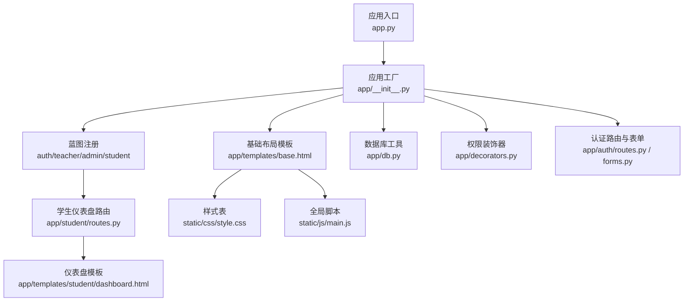
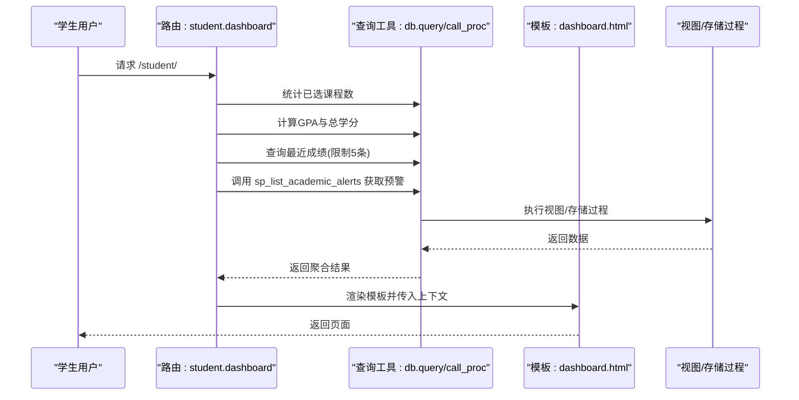
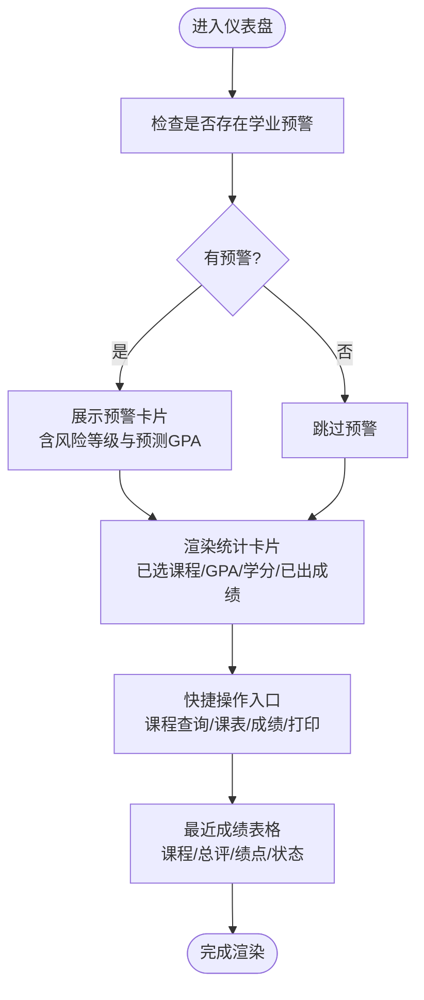
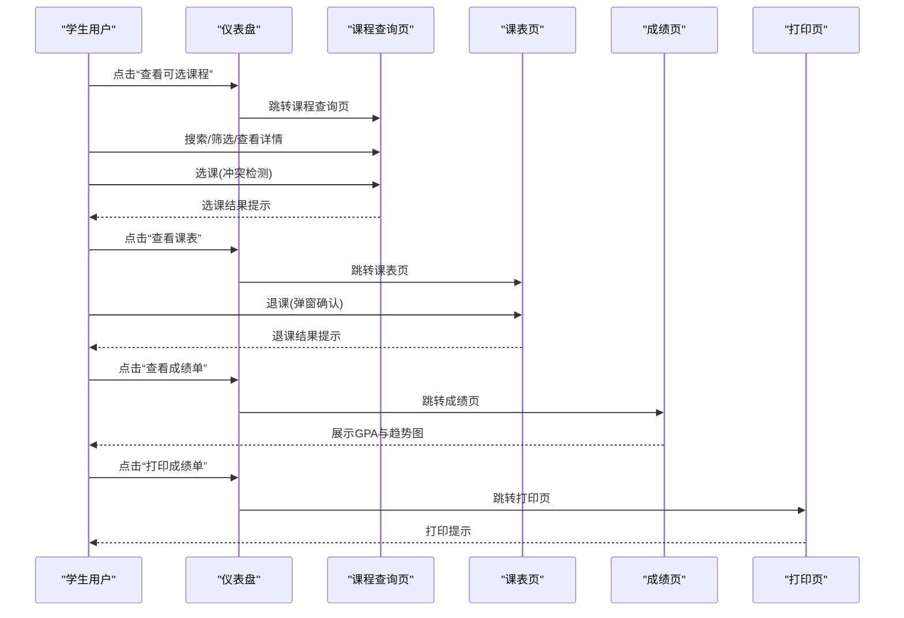
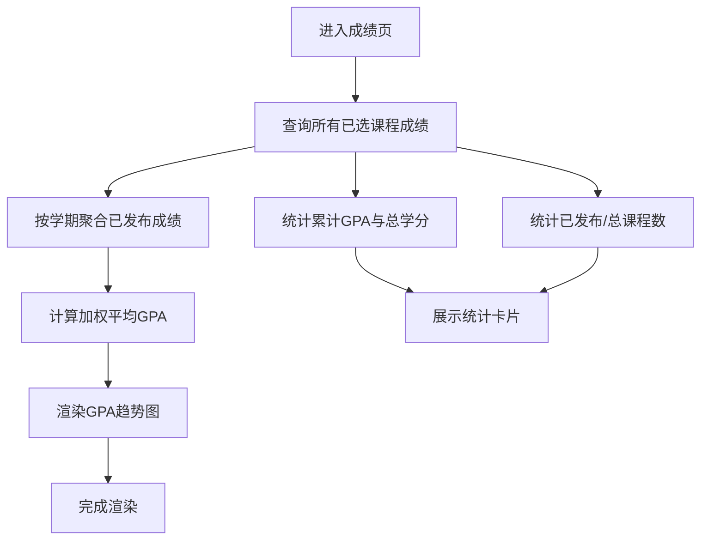
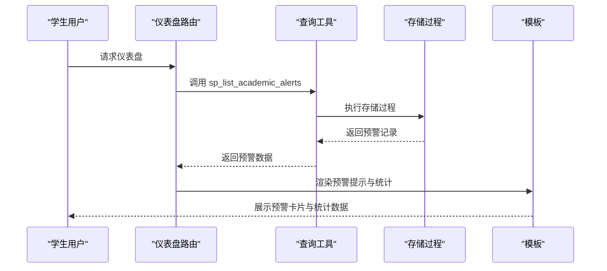
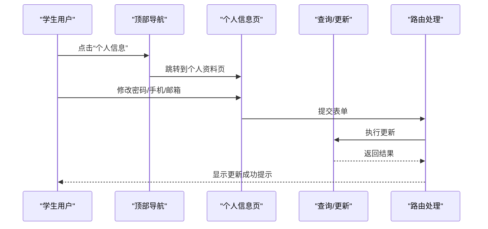
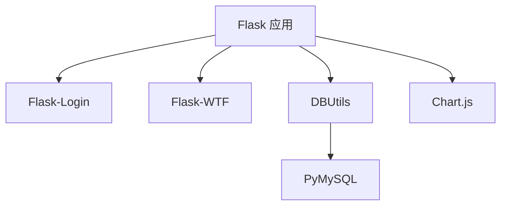

# 学生仪表盘

<cite>
**本文引用的文件**
- [app.py](file://app.py)
- [config.py](file://config.py)
- [requirements.txt](file://requirements.txt)
- [README.md](file://README.md)
- [app/__init__.py](file://app/__init__.py)
- [app/db.py](file://app/db.py)
- [app/decorators.py](file://app/decorators.py)
- [app/auth/routes.py](file://app/auth/routes.py)
- [app/auth/forms.py](file://app/auth/forms.py)
- [app/student/routes.py](file://app/student/routes.py)
- [app/templates/base.html](file://app/templates/base.html)
- [app/templates/student/dashboard.html](file://app/templates/student/dashboard.html)
- [app/templates/student/courses.html](file://app/templates/student/courses.html)
- [app/templates/student/schedule.html](file://app/templates/student/schedule.html)
- [app/templates/student/grades.html](file://app/templates/student/grades.html)
- [app/templates/student/transcript.html](file://app/templates/student/transcript.html)
- [static/css/style.css](file://static/css/style.css)
- [static/js/main.js](file://static/js/main.js)
</cite>

## 目录
1. [简介](#简介)
2. [项目结构](#项目结构)
3. [核心组件](#核心组件)
4. [架构总览](#架构总览)
5. [详细组件分析](#详细组件分析)
6. [依赖分析](#依赖分析)
7. [性能考虑](#性能考虑)
8. [故障排除指南](#故障排除指南)
9. [结论](#结论)
10. [附录](#附录)

## 简介
本文件为“学生仪表盘”功能的详细使用文档，面向学生用户，帮助快速熟悉并高效使用仪表盘的各项功能。内容涵盖整体设计理念与布局结构、个人信息与快捷入口、学习进度统计与系统通知中心，以及数据更新与实时同步机制。同时提供自定义选项的使用指南与常见问题排查建议。

## 项目结构
该项目采用 Flask 微框架，按角色划分蓝图模块，前端使用 Bootstrap 5 + Jinja2 模板引擎，通过 Chart.js 展示统计图表。仪表盘位于学生模块，路由与模板共同构成学生工作台的核心页面。

**图表来源**
- [app.py](file://app.py)
- [app/__init__.py](file://app/__init__.py)
- [app/student/routes.py](file://app/student/routes.py)
- [app/templates/student/dashboard.html](file://app/templates/student/dashboard.html)
- [app/templates/base.html](file://app/templates/base.html)
- [static/css/style.css](file://static/css/style.css)
- [static/js/main.js](file://static/js/main.js)
- [app/db.py](file://app/db.py)
- [app/decorators.py](file://app/decorators.py)
- [app/auth/routes.py](file://app/auth/routes.py)
- [app/auth/forms.py](file://app/auth/forms.py)

**章节来源**
- [README.md](file://README.md)
- [app/__init__.py](file://app/__init__.py)
- [app/templates/base.html](file://app/templates/base.html)

## 核心组件
- 仪表盘路由与数据聚合：负责计算已选课程数、GPA、已修学分、最近成绩，并查询学业预警。
- 仪表盘模板：渲染快捷操作、统计卡片、最近成绩表格与预警提示。
- 课程查询与选课：支持筛选、冲突检测、选课/退课流程。
- 课表展示：网格化课表与课程列表，支持退课弹窗。
- 成绩查询与统计：展示累计GPA、学分、已发布/总课程数，绘制各学期GPA趋势图。
- 成绩单打印：打印版成绩单，含学号、姓名、专业、班级、GPA与完整成绩明细。
- 全局布局与样式：侧边栏导航、响应式布局、打印样式、自动关闭提示等。

**章节来源**
- [app/student/routes.py](file://app/student/routes.py)
- [app/templates/student/dashboard.html](file://app/templates/student/dashboard.html)
- [app/templates/student/courses.html](file://app/templates/student/courses.html)
- [app/templates/student/schedule.html](file://app/templates/student/schedule.html)
- [app/templates/student/grades.html](file://app/templates/student/grades.html)
- [app/templates/student/transcript.html](file://app/templates/student/transcript.html)
- [app/templates/base.html](file://app/templates/base.html)
- [static/css/style.css](file://static/css/style.css)
- [static/js/main.js](file://static/js/main.js)

## 架构总览
学生仪表盘是“学生模块”的首页，通过蓝图路由与模板渲染实现。数据由数据库工具层统一访问，权限由装饰器与登录管理保障，前端通过 Bootstrap 与 Chart.js 提供交互与可视化。

**图表来源**
- [app/student/routes.py](file://app/student/routes.py)
- [app/db.py](file://app/db.py)

## 详细组件分析

### 仪表盘页面与布局
- 设计理念
  - 以“信息密度高、操作入口清晰、状态提示明确”为核心，帮助学生快速掌握学习状态与行动路径。
  - 使用卡片式统计与列表式快捷入口，兼顾概览与效率。
- 布局结构
  - 顶部导航：角色标识、用户名下拉、侧边栏切换。
  - 侧边栏：按角色显示不同菜单项，学生包含“控制台、课程查询、我的课表、成绩查询、打印成绩单”。
  - 主体内容：仪表盘卡片、快捷操作、最近成绩与学业预警提示。
- 自定义选项
  - 侧边栏折叠：点击“菜单”按钮可折叠/展开侧边栏，适配窄屏设备。
  - 打印样式：打印时自动隐藏非打印元素，突出成绩单内容。
- 实时性
  - 页面数据来源于后端查询，刷新页面即可获取最新统计与成绩状态。

**图表来源**
- [app/templates/student/dashboard.html](file://app/templates/student/dashboard.html)
- [app/templates/base.html](file://app/templates/base.html)
- [static/css/style.css](file://static/css/style.css)
- [static/js/main.js](file://static/js/main.js)

**章节来源**
- [app/templates/student/dashboard.html](file://app/templates/student/dashboard.html)
- [app/templates/base.html](file://app/templates/base.html)
- [static/css/style.css](file://static/css/style.css)
- [static/js/main.js](file://static/js/main.js)

### 快捷操作入口
- 功能说明
  - 查看可选课程与选课：支持按课程名/代码/教师搜索、按课程类型筛选，显示冲突检测与进度条。
  - 查看课表与退课：网格化课表与课程列表，支持退课确认弹窗。
  - 查看成绩单：展示累计GPA、总学分、已发布/总课程数，绘制各学期GPA趋势。
  - 打印成绩单：打印版成绩单，一键打印。
- 使用方法
  - 在仪表盘“快捷操作”区域点击相应入口，或通过侧边栏导航访问对应页面。
  - 选课时如遇时间冲突，系统会提示并允许确认继续。
  - 退课需在课表页面确认弹窗后提交。

**图表来源**
- [app/templates/student/dashboard.html](file://app/templates/student/dashboard.html)
- [app/templates/student/courses.html](file://app/templates/student/courses.html)
- [app/templates/student/schedule.html](file://app/templates/student/schedule.html)
- [app/templates/student/grades.html](file://app/templates/student/grades.html)
- [app/templates/student/transcript.html](file://app/templates/student/transcript.html)

**章节来源**
- [app/templates/student/dashboard.html](file://app/templates/student/dashboard.html)
- [app/templates/student/courses.html](file://app/templates/student/courses.html)
- [app/templates/student/schedule.html](file://app/templates/student/schedule.html)
- [app/templates/student/grades.html](file://app/templates/student/grades.html)
- [app/templates/student/transcript.html](file://app/templates/student/transcript.html)

### 学习进度统计与图表
- 统计维度
  - 已选课程数：当前选课状态为“已选”的课程数量。
  - GPA：基于已发布成绩计算的累计GPA。
  - 已修学分：已计入GPA的课程学分总和。
  - 已出成绩：已发布的成绩条目数量。
- 图表说明
  - 各学期GPA趋势图：按学期聚合已发布成绩，计算加权平均GPA并绘制折线图。
- 使用建议
  - 关注GPA趋势变化，结合课程难度与投入时间进行学习规划。
  - 利用“已出成绩”与“已发布/总课程数”了解成绩发布节奏。

**图表来源**
- [app/templates/student/grades.html](file://app/templates/student/grades.html)
- [app/student/routes.py](file://app/student/routes.py)

**章节来源**
- [app/templates/student/grades.html](file://app/templates/student/grades.html)
- [app/student/routes.py](file://app/student/routes.py)

### 系统通知中心与预警提示
- 学业预警
  - 当存在预警时，仪表盘顶部展示带风险等级的提示卡片，包含风险原因与预测本学期GPA。
  - 风险等级通过颜色区分，便于快速识别紧急程度。
- 自动提示
  - 页面加载后5秒自动关闭可关闭的提示框，避免遮挡视线。
- 处理建议
  - 高/中风险：优先关注薄弱环节，合理安排复习与补考计划。
  - 低风险：保持现有节奏，关注课程质量与学习方法。

**图表来源**
- [app/student/routes.py](file://app/student/routes.py)
- [app/db.py](file://app/db.py)
- [app/templates/student/dashboard.html](file://app/templates/student/dashboard.html)

**章节来源**
- [app/student/routes.py](file://app/student/routes.py)
- [app/templates/student/dashboard.html](file://app/templates/student/dashboard.html)
- [static/js/main.js](file://static/js/main.js)

### 个人信息查看与编辑
- 查看与编辑入口
  - 顶部导航右上角“个人信息”，进入个人资料页面。
- 可编辑内容
  - 登录密码（长度至少6位）、手机号、电子邮箱。
- 更新流程
  - 修改后提交，系统提示“个人信息更新成功”。

**图表来源**
- [app/templates/base.html](file://app/templates/base.html)
- [app/auth/routes.py](file://app/auth/routes.py)
- [app/auth/forms.py](file://app/auth/forms.py)

**章节来源**
- [app/templates/base.html](file://app/templates/base.html)
- [app/auth/routes.py](file://app/auth/routes.py)
- [app/auth/forms.py](file://app/auth/forms.py)

## 依赖分析
- 技术栈
  - 后端：Python Flask 3.x
  - 数据库：MySQL 8.x（原生SQL + 存储过程 + 视图）
  - 前端：Bootstrap 5 + Jinja2 + Chart.js
  - 驱动：PyMySQL + DBUtils 连接池
- 关键依赖
  - Flask-Login：用户会话与权限控制
  - Flask-WTF：表单校验
  - DBUtils：连接池
  - PyMySQL：数据库驱动
  - Chart.js：统计图表

**图表来源**
- [requirements.txt](file://requirements.txt)
- [app/__init__.py](file://app/__init__.py)
- [app/db.py](file://app/db.py)

**章节来源**
- [requirements.txt](file://requirements.txt)
- [app/__init__.py](file://app/__init__.py)
- [app/db.py](file://app/db.py)

## 性能考虑
- 数据库连接池：通过 DBUtils 的 PooledDB 减少连接开销，提高并发访问性能。
- 分页查询：课程查询与分页组件配合，避免一次性加载大量数据。
- 前端优化：Bootstrap 与 Chart.js 本地引入，减少第三方CDN依赖带来的延迟。
- 建议
  - 合理设置连接池参数（最小缓存、最大缓存、最大连接数），根据并发量调整。
  - 对高频查询建立索引，确保统计类查询（GPA、预警）在大数据量下仍具响应速度。

[本节为通用指导，无需特定文件分析]

## 故障排除指南
- 登录后无法进入仪表盘
  - 检查是否为学生角色且已正确登录。
  - 确认蓝图注册与路由前缀配置。
- 仪表盘无数据显示
  - 检查数据库连接参数与连接池初始化。
  - 确认存储过程与视图是否正确部署。
- 选课/退课失败
  - 查看提示消息中的错误类别（danger/warning）。
  - 检查课程时间冲突、容量上限与选课时间窗口。
- 成绩未显示或GPA异常
  - 确认成绩状态为“已发布”，且已计入GPA的课程学分有效。
- 侧边栏/提示框异常
  - 检查 Bootstrap 与 Chart.js 是否正确加载。
  - 确认自动关闭提示脚本未被覆盖。

**章节来源**
- [app/__init__.py](file://app/__init__.py)
- [app/db.py](file://app/db.py)
- [app/student/routes.py](file://app/student/routes.py)
- [app/auth/routes.py](file://app/auth/routes.py)
- [static/js/main.js](file://static/js/main.js)

## 结论
学生仪表盘以简洁直观的设计帮助学生快速掌握学习状态、高效完成日常事务，并通过预警提示与统计图表提升学习管理能力。通过合理的权限控制、数据查询与前端交互，系统在易用性与性能之间取得平衡。建议结合实际使用场景持续优化数据展示与交互细节，进一步提升用户体验。

[本节为总结性内容，无需特定文件分析]

## 附录
- 快速开始
  - 安装依赖：参考项目根目录下的安装与启动说明。
  - 初始化数据库：按顺序执行 SQL 脚本。
  - 修改配置：复制 .env.example 为 .env 或直接编辑 config.py。
  - 启动应用：运行应用入口文件，访问本地地址。
- 测试账户
  - 管理员：admin/admin123
  - 学生与教师：自行注册后登录

**章节来源**
- [README.md](file://README.md)