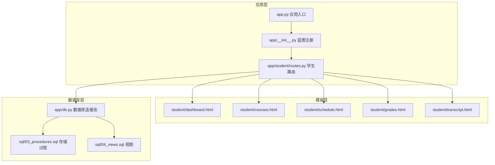
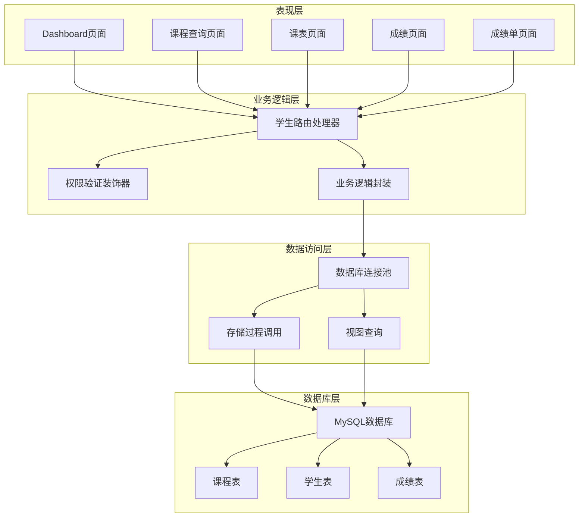
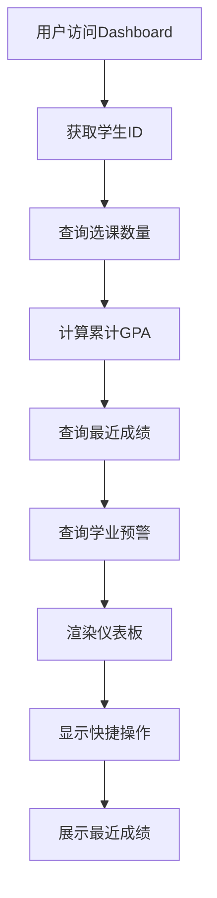
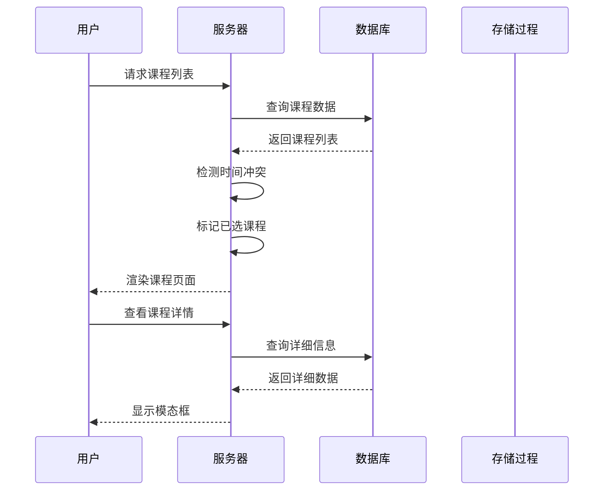
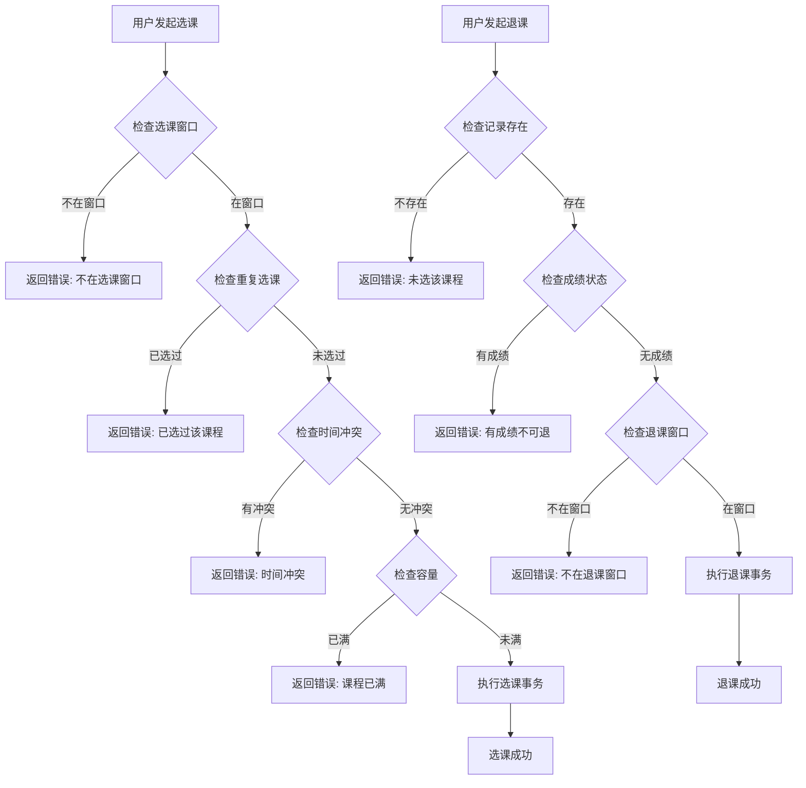
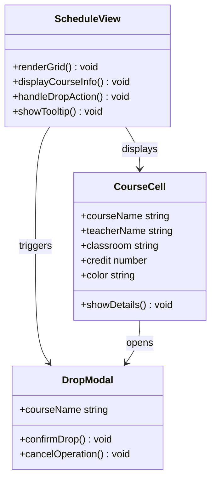
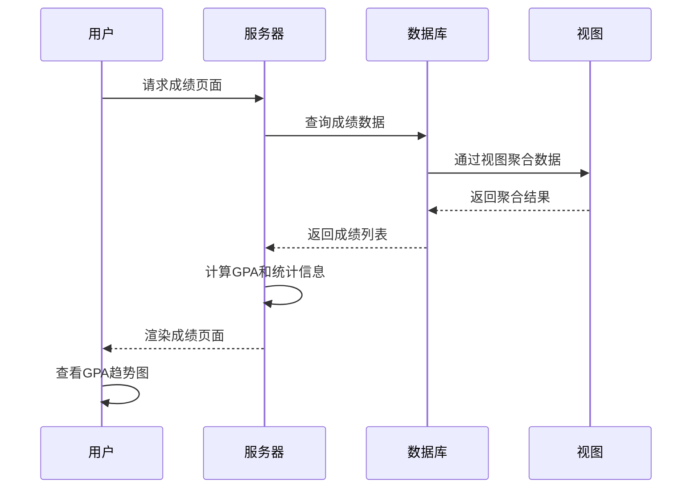
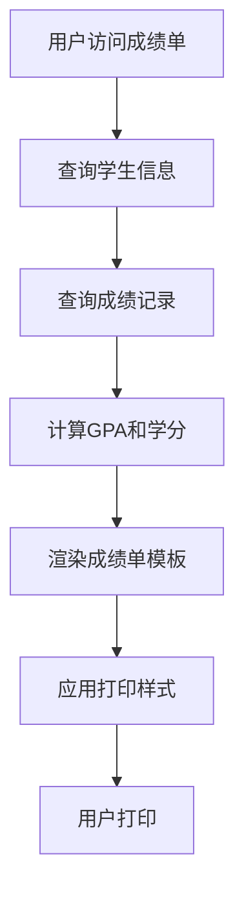
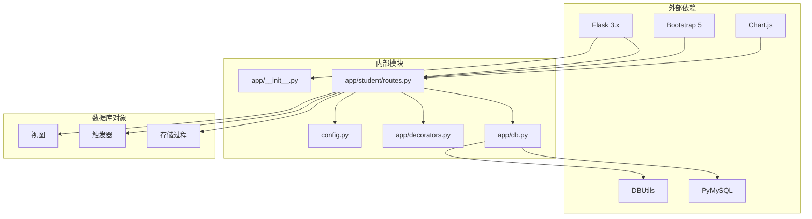

# 学生功能模块

<cite>
**本文档引用的文件**
- [app/student/routes.py](file://app/student/routes.py)
- [app/templates/student/dashboard.html](file://app/templates/student/dashboard.html)
- [app/templates/student/courses.html](file://app/templates/student/courses.html)
- [app/templates/student/schedule.html](file://app/templates/student/schedule.html)
- [app/templates/student/grades.html](file://app/templates/student/grades.html)
- [app/templates/student/transcript.html](file://app/templates/student/transcript.html)
- [app/db.py](file://app/db.py)
- [app/decorators.py](file://app/decorators.py)
- [app/__init__.py](file://app/__init__.py)
- [sql/03_procedures.sql](file://sql/03_procedures.sql)
- [sql/04_views.sql](file://sql/04_views.sql)
- [config.py](file://config.py)
- [app/templates/base.html](file://app/templates/base.html)
- [README.md](file://README.md)
</cite>

## 目录
1. [简介](#简介)
2. [项目结构](#项目结构)
3. [核心组件](#核心组件)
4. [架构概览](#架构概览)
5. [详细组件分析](#详细组件分析)
6. [依赖关系分析](#依赖关系分析)
7. [性能考虑](#性能考虑)
8. [故障排除指南](#故障排除指南)
9. [结论](#结论)
10. [附录](#附录)

## 简介
本文件为校园教务选课与成绩管理系统的学生功能模块完整使用文档。系统采用Flask + MySQL技术栈，实现了从课程查询到成绩管理的全流程功能。本文档详细说明了学生Dashboard的设计与个性化功能、课程查询与选课退课流程、个人课表管理、成绩查询与统计分析、成绩单打印以及成绩申诉流程等核心功能。

## 项目结构
学生功能模块位于`app/student/`目录下，包含路由定义和对应的HTML模板文件。系统采用蓝图(BP)模式组织代码，确保模块化和可维护性。

**图表来源**
- [app.py](file://app.py)
- [app/__init__.py](file://app/__init__.py)
- [app/student/routes.py](file://app/student/routes.py)

**章节来源**
- [README.md](file://README.md)
- [app/__init__.py](file://app/__init__.py)

## 核心组件
学生功能模块由以下核心组件构成：

### 路由组件
- **Dashboard路由**：提供学生主页概览，展示选课数量、GPA、学分和最近成绩
- **课程查询路由**：支持搜索、筛选、分页和冲突检测
- **课表管理路由**：展示个人课表和退课功能
- **成绩查询路由**：提供成绩明细和GPA统计
- **成绩单路由**：生成可打印的成绩单

### 数据访问组件
- **数据库连接池**：基于PyMySQL和DBUtils实现连接池管理
- **存储过程调用**：封装选课、退课、成绩计算等业务逻辑
- **视图查询**：提供课表和成绩单的数据聚合

### 模板组件
- **Bootstrap 5 UI框架**：响应式设计，支持移动端访问
- **Chart.js集成**：可视化GPA趋势分析
- **模态框和提示**：增强用户体验

**章节来源**
- [app/student/routes.py](file://app/student/routes.py)
- [app/db.py](file://app/db.py)
- [app/templates/base.html](file://app/templates/base.html)

## 架构概览
系统采用经典的三层架构设计，确保关注点分离和代码复用。

**图表来源**
- [app/student/routes.py](file://app/student/routes.py)
- [app/db.py](file://app/db.py)
- [sql/03_procedures.sql](file://sql/03_procedures.sql)
- [sql/04_views.sql](file://sql/04_views.sql)

## 详细组件分析

### Dashboard设计与个性化功能

Dashboard作为学生的主要入口页面，提供了全面的个性化信息展示：

#### 仪表板卡片布局
- **已选课程**：实时显示当前选课数量
- **GPA**：累计GPA计算和展示
- **已修学分**：总学分统计
- **已出成绩**：最近发布的成绩数量

#### 快捷操作入口
- **课程查询**：快速进入可选课程列表
- **查看课表**：管理个人课程安排
- **查看成绩**：访问详细成绩记录
- **打印成绩单**：生成官方成绩单

#### 最近成绩提醒
系统自动展示最近发布的5条成绩记录，包括课程名称、总评成绩、绩点和状态标识。

**图表来源**
- [app/student/routes.py](file://app/student/routes.py)
- [app/templates/student/dashboard.html](file://app/templates/student/dashboard.html)

**章节来源**
- [app/student/routes.py](file://app/student/routes.py)
- [app/templates/student/dashboard.html](file://app/templates/student/dashboard.html)

### 课程查询功能

课程查询功能提供了完整的课程浏览、搜索和筛选能力：

#### 搜索与筛选机制
- **关键词搜索**：支持课程名称、课程代码、教师姓名的模糊匹配
- **类型筛选**：区分必修、选修、任选三种课程类型
- **学期过滤**：默认显示当前学期的课程

#### 选课状态显示
- **容量进度条**：直观显示课程选课人数和最大容量
- **冲突检测**：自动标记与已选课程时间冲突的课程
- **状态标识**：显示课程的发布时间和选课状态

#### 详细信息查看
通过模态框弹窗展示课程的完整信息，包括学分、学时、上课时间、教室、教师信息等。

**图表来源**
- [app/student/routes.py](file://app/student/routes.py)
- [app/templates/student/courses.html](file://app/templates/student/courses.html)

**章节来源**
- [app/student/routes.py](file://app/student/routes.py)
- [app/templates/student/courses.html](file://app/templates/student/courses.html)

### 选课退课流程

系统实现了严格的选课和退课管理流程，确保学术管理的规范性和安全性。

#### 选课流程
1. **身份验证**：确保只有登录且具有学生角色的用户可以操作
2. **选课窗口检查**：验证当前时间是否在允许的选课时间段内
3. **重复选课检测**：防止同一门课程的重复选课
4. **时间冲突检测**：避免课程时间安排冲突
5. **容量检查**：确保课程未达到最大选课人数
6. **原子性操作**：使用数据库事务保证操作的完整性

#### 退课流程
1. **记录存在性检查**：确认学生确实选修了该课程
2. **成绩状态检查**：确保课程没有已发布的成绩记录
3. **退课窗口检查**：验证当前时间是否在允许的退课时间段内
4. **安全删除**：删除相关的成绩记录和选课记录

**图表来源**
- [sql/03_procedures.sql](file://sql/03_procedures.sql)
- [app/student/routes.py](file://app/student/routes.py)

**章节来源**
- [sql/03_procedures.sql](file://sql/03_procedures.sql)
- [app/student/routes.py](file://app/student/routes.py)

### 个人课表管理

课表管理功能提供了直观的课程安排展示和便捷的退课操作：

#### 课表显示设计
- **网格布局**：采用5列(周一至周五)×4行(课程时段)的网格结构
- **颜色编码**：为不同课程分配不同的颜色标识
- **响应式设计**：适配移动设备的屏幕尺寸
- **交互提示**：鼠标悬停显示课程详细信息

#### 课程详情展示
- **课程基本信息**：名称、代码、学分、教师
- **时间安排**：具体的上课时间和教室
- **退课操作**：一键确认退课的模态框

#### 退课确认机制
系统提供模态框确认，确保用户不会误操作退课。

**图表来源**
- [app/templates/student/schedule.html](file://app/templates/student/schedule.html)

**章节来源**
- [app/templates/student/schedule.html](file://app/templates/student/schedule.html)

### 成绩查询功能

成绩查询功能提供了全面的成绩管理和统计分析能力：

#### 成绩显示格式
- **GPA统计**：实时计算累计GPA和总学分
- **学期分布**：按学期组织显示课程成绩
- **成绩分类**：区分平时成绩、期末成绩、总评成绩和绩点
- **状态标识**：显示成绩的不同处理状态

#### 绩点计算机制
系统采用4.0制绩点计算标准：
- 90分以上：4.0
- 85-89分：3.7
- 82-84分：3.3
- 78-81分：3.0
- 75-77分：2.7
- 72-74分：2.3
- 68-71分：2.0
- 64-67分：1.5
- 60-63分：1.0
- 60分以下：0.0

#### 可视化分析
- **GPA趋势图**：使用Chart.js展示各学期GPA变化趋势
- **状态统计**：显示已发布、待审核、录入中等状态的课程数量

**图表来源**
- [app/student/routes.py](file://app/student/routes.py)
- [sql/04_views.sql](file://sql/04_views.sql)

**章节来源**
- [app/student/routes.py](file://app/student/routes.py)
- [app/templates/student/grades.html](file://app/templates/student/grades.html)
- [sql/04_views.sql](file://sql/04_views.sql)

### 成绩单功能

系统提供了官方成绩单的生成和打印功能：

#### 成绩单内容
- **个人信息**：学号、姓名、专业、班级
- **学术信息**：累计GPA、总学分
- **课程明细**：完整的课程成绩记录
- **打印优化**：专门的打印样式和打印按钮

#### 打印功能设计
- **打印样式**：隐藏导航栏、侧边栏等非必要元素
- **页面布局**：优化打印页面的排版和间距
- **打印预览**：支持浏览器原生打印功能

**图表来源**
- [app/student/routes.py](file://app/student/routes.py)
- [app/templates/student/transcript.html](file://app/templates/student/transcript.html)

**章节来源**
- [app/student/routes.py](file://app/student/routes.py)
- [app/templates/student/transcript.html](file://app/templates/student/transcript.html)

### 成绩申诉流程

虽然当前代码库中未直接实现成绩申诉的具体功能，但系统具备了实现该功能的基础架构：

#### 系统支持
- **成绩状态管理**：支持多种成绩状态（录入中、待审核、已审核、已发布）
- **日志记录**：完整的操作日志追踪
- **权限控制**：基于角色的访问控制机制

#### 实现建议
基于现有架构，可以扩展以下功能：
- **申诉申请表单**：收集申诉相关信息
- **材料上传**：支持相关证明材料的上传
- **进度跟踪**：实时显示申诉处理状态
- **结果通知**：通过系统消息通知申诉结果

## 依赖关系分析

系统各组件之间的依赖关系清晰明确，遵循单一职责原则：

**图表来源**
- [app/student/routes.py](file://app/student/routes.py)
- [app/db.py](file://app/db.py)
- [config.py](file://config.py)

**章节来源**
- [app/student/routes.py](file://app/student/routes.py)
- [app/db.py](file://app/db.py)
- [config.py](file://config.py)

## 性能考虑

系统在设计时充分考虑了性能优化：

### 数据库优化
- **连接池管理**：使用DBUtils实现连接池，减少连接建立开销
- **索引策略**：在常用查询字段上建立适当索引
- **查询优化**：使用视图简化复杂查询逻辑

### 缓存策略
- **会话缓存**：Flask-Login管理用户会话
- **静态资源缓存**：浏览器缓存CSS和JavaScript文件

### 前端优化
- **响应式设计**：适应不同设备的屏幕尺寸
- **懒加载**：模态框按需加载内容
- **CDN加速**：使用CDN加载第三方库

## 故障排除指南

### 常见问题及解决方案

#### 登录认证问题
- **症状**：访问受保护页面被重定向到登录页
- **原因**：会话过期或未正确登录
- **解决**：重新登录系统，检查浏览器Cookie设置

#### 数据库连接问题
- **症状**：页面加载缓慢或出现数据库错误
- **原因**：连接池耗尽或数据库服务异常
- **解决**：重启应用服务，检查数据库连接参数

#### 选课失败问题
- **症状**：选课操作返回错误信息
- **可能原因**：
  - 不在选课窗口期内
  - 课程已满额
  - 时间安排冲突
  - 已重复选课
- **解决**：检查系统提示信息，确认选课条件满足

#### 成绩显示异常
- **症状**：成绩页面显示空白或数据不完整
- **原因**：数据库查询异常或视图定义问题
- **解决**：刷新页面，检查数据库连接状态

**章节来源**
- [app/decorators.py](file://app/decorators.py)
- [app/db.py](file://app/db.py)

## 结论

学生功能模块完整地实现了校园教务系统的核心业务需求，具有以下特点：

### 技术优势
- **模块化设计**：清晰的蓝图架构，便于维护和扩展
- **安全性保障**：完善的权限控制和CSRF防护
- **性能优化**：连接池管理和查询优化
- **用户体验**：响应式界面和直观的操作流程

### 功能完整性
- **全流程覆盖**：从课程查询到成绩管理的完整业务链
- **实时性**：成绩和课表信息的及时更新
- **可视化**：GPA趋势图等数据分析功能
- **可扩展性**：为未来功能扩展预留接口

### 改进建议
- **成绩申诉**：实现完整的成绩申诉流程
- **移动端优化**：进一步提升移动端用户体验
- **性能监控**：添加系统性能监控和告警机制
- **国际化支持**：为多语言环境做准备

该模块为学生提供了高效、便捷的教务管理体验，是整个MIS系统的重要组成部分。

## 附录

### 快速操作指南

#### 登录系统
1. 访问系统主页
2. 输入用户名和密码
3. 点击登录按钮

#### 查看课程
1. 在侧边栏点击"课程查询"
2. 使用搜索框查找特定课程
3. 通过筛选器选择课程类型
4. 点击"详情"查看课程信息
5. 点击"选课"加入课程

#### 管理课表
1. 在侧边栏点击"我的课表"
2. 查看课程时间安排
3. 点击"退课"取消选课
4. 确认退课操作

#### 查看成绩
1. 在侧边栏点击"成绩查询"
2. 查看各学期成绩记录
3. 查看GPA趋势图
4. 点击"打印成绩单"生成官方成绩单

### 系统要求
- **浏览器**：支持ES6+的现代浏览器
- **网络**：稳定的互联网连接
- **存储**：足够的磁盘空间存储个人数据

### 技术支持
如遇系统问题，请联系技术支持团队或查看帮助文档。