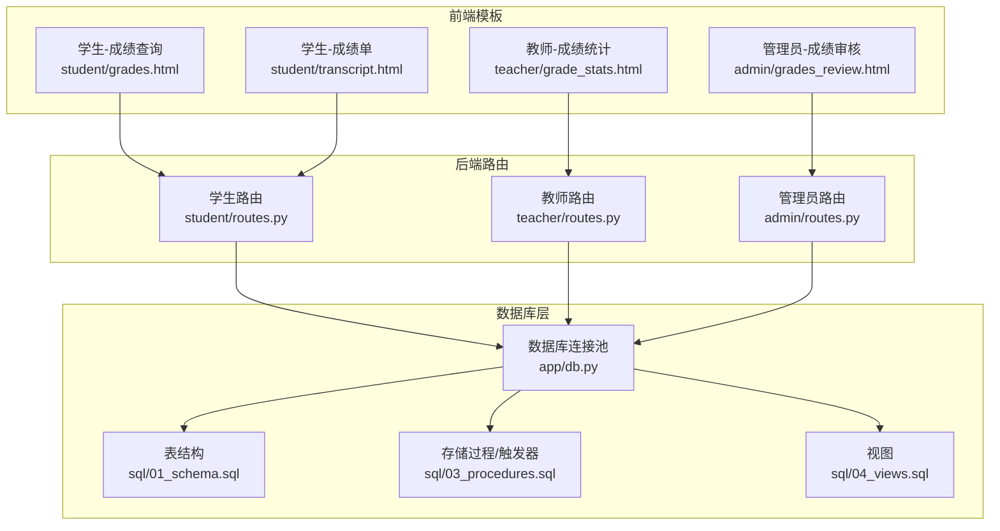
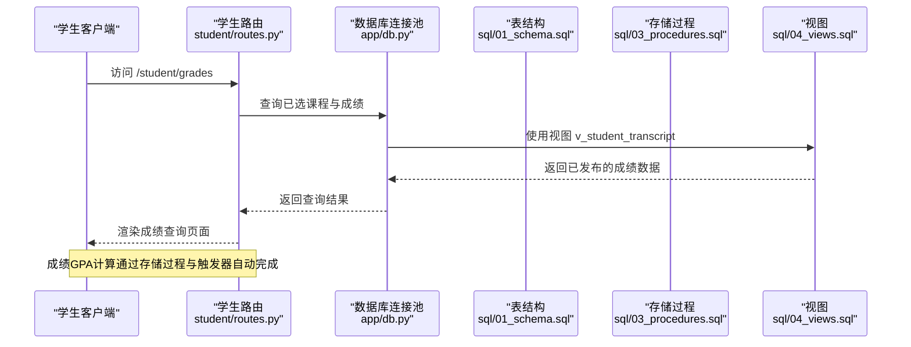
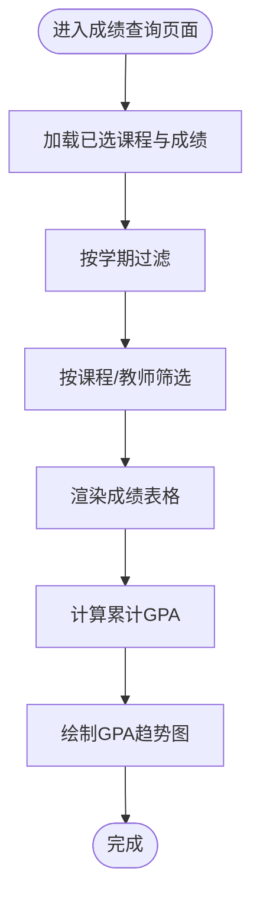
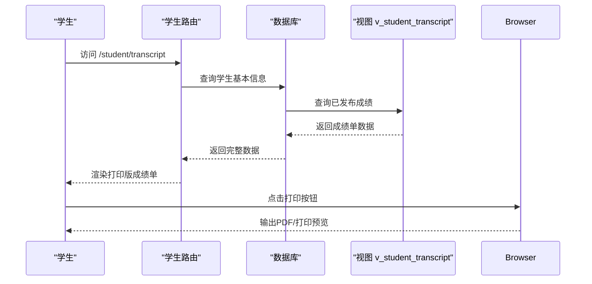
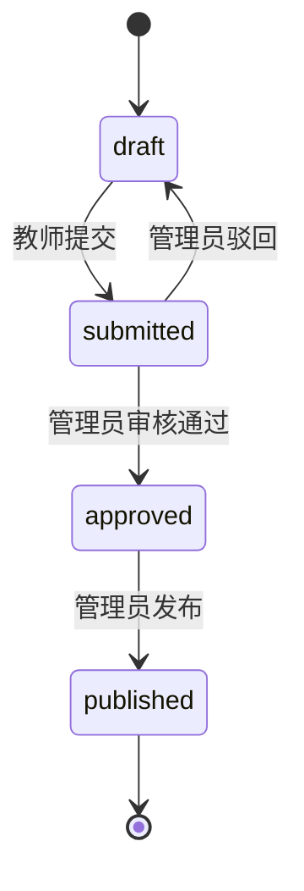
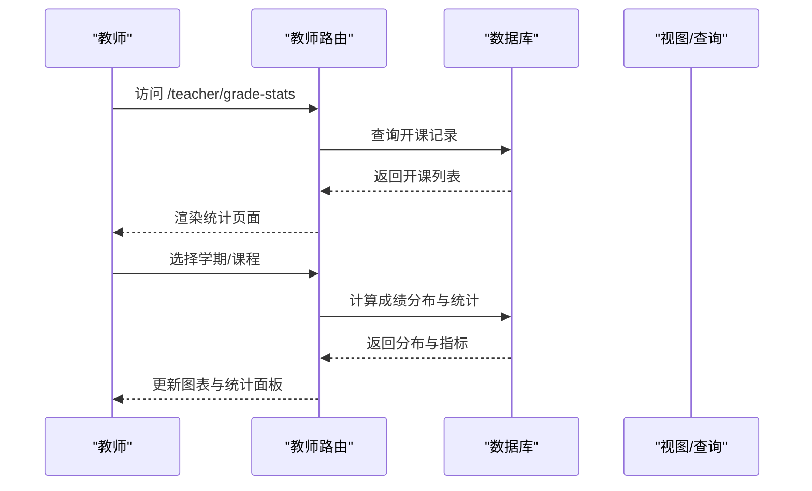
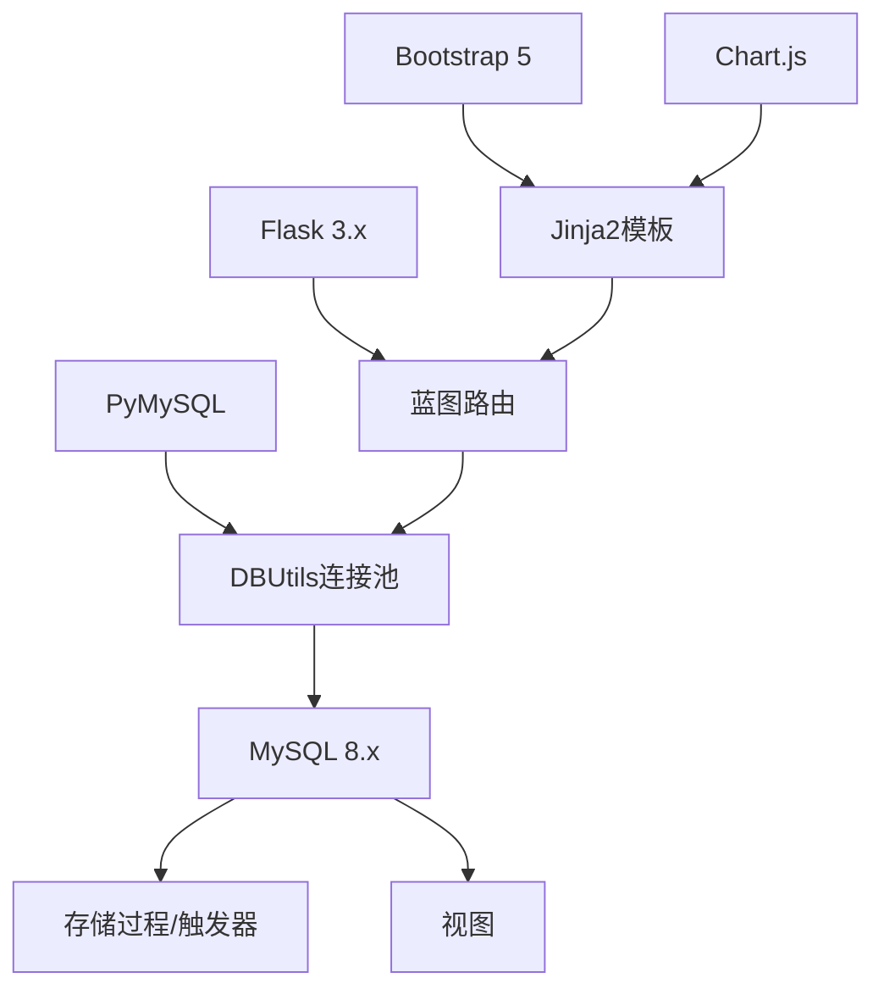

# 成绩查询与成绩单

<cite>
**本文引用的文件**
- [app.py](file://app.py)
- [config.py](file://config.py)
- [requirements.txt](file://requirements.txt)
- [README.md](file://README.md)
- [app/db.py](file://app/db.py)
- [app/decorators.py](file://app/decorators.py)
- [app/helpers.py](file://app/helpers.py)
- [app/student/routes.py](file://app/student/routes.py)
- [app/teacher/routes.py](file://app/teacher/routes.py)
- [app/admin/routes.py](file://app/admin/routes.py)
- [app/templates/student/grades.html](file://app/templates/student/grades.html)
- [app/templates/student/transcript.html](file://app/templates/student/transcript.html)
- [app/templates/admin/grades_review.html](file://app/templates/admin/grades_review.html)
- [app/templates/teacher/grade_stats.html](file://app/templates/teacher/grade_stats.html)
- [sql/01_schema.sql](file://sql/01_schema.sql)
- [sql/03_procedures.sql](file://sql/03_procedures.sql)
- [sql/04_views.sql](file://sql/04_views.sql)
</cite>

## 目录
1. [简介](#简介)
2. [项目结构](#项目结构)
3. [核心组件](#核心组件)
4. [架构概览](#架构概览)
5. [详细组件分析](#详细组件分析)
6. [依赖关系分析](#依赖关系分析)
7. [性能考虑](#性能考虑)
8. [故障排除指南](#故障排除指南)
9. [结论](#结论)
10. [附录](#附录)

## 简介
本文件面向校园教务选课与成绩管理系统中的"成绩查询与成绩单"功能，提供从界面设计到后台实现的完整使用文档。内容涵盖：
- 成绩查询界面的功能设计：学期选择、课程筛选、成绩类型切换、统计汇总
- 各类型成绩的含义与计算方式：平时成绩、实验成绩、期中成绩、期末成绩、总评成绩
- 绩点计算规则与GPA统计：学分加权计算、等级转换、学术评价标准
- 成绩单功能：电子成绩单生成、官方成绩单打印、成绩认证与学术记录管理
- 成绩申诉流程：申诉条件、申请材料、处理时限与结果查询
- 成绩分析工具：帮助学生了解学习表现与制定改进计划
- 完整操作示例与常见问题解答

## 项目结构
系统采用Flask微框架，前后端分离的模板渲染模式，数据库层通过PyMySQL与DBUtils连接池实现高性能访问。核心模块包括：
- 学生模块：成绩查询、成绩单打印、个人课表
- 教师模块：成绩录入、批量提交、成绩统计
- 管理员模块：成绩审核与发布、统计分析、学业预警

**图表来源**
- [app/templates/student/grades.html:1-75](file://app/templates/student/grades.html#L1-L75)
- [app/templates/student/transcript.html:1-32](file://app/templates/student/transcript.html#L1-L32)
- [app/templates/teacher/grade_stats.html:1-50](file://app/templates/teacher/grade_stats.html#L1-L50)
- [app/templates/admin/grades_review.html:1-57](file://app/templates/admin/grades_review.html#L1-L57)
- [app/student/routes.py:1-220](file://app/student/routes.py#L1-L220)
- [app/teacher/routes.py:1-333](file://app/teacher/routes.py#L1-L333)
- [app/admin/routes.py:1-692](file://app/admin/routes.py#L1-L692)
- [app/db.py:1-121](file://app/db.py#L1-L121)
- [sql/01_schema.sql:1-235](file://sql/01_schema.sql#L1-L235)
- [sql/03_procedures.sql:1-381](file://sql/03_procedures.sql#L1-L381)
- [sql/04_views.sql:1-113](file://sql/04_views.sql#L1-L113)

**章节来源**
- [README.md: 46-87:46-87](file://README.md#L46-L87)
- [app.py](file://app.py)
- [config.py](file://config.py)
- [requirements.txt](file://requirements.txt)

## 核心组件
- 数据模型：基于12张核心表，包含users、students、teachers、courses、course_offerings、enrollments、grades、semesters等，确保完整的3NF设计与外键约束。
- 存储过程与触发器：提供选课、退课、成绩计算、GPA计算、状态变更日志等自动化逻辑。
- 视图：提供课表、成绩单、选课统计、教师工作量等常用查询视图。
- 路由与模板：学生、教师、管理员分别提供独立的页面与交互流程。

**章节来源**
- [sql/01_schema.sql: 12-235:12-235](file://sql/01_schema.sql#L12-L235)
- [sql/03_procedures.sql: 9-381:9-381](file://sql/03_procedures.sql#L9-L381)
- [sql/04_views.sql: 7-113:7-113](file://sql/04_views.sql#L7-L113)
- [app/student/routes.py: 19-220:19-220](file://app/student/routes.py#L19-L220)
- [app/teacher/routes.py: 18-333:18-333](file://app/teacher/routes.py#L18-L333)
- [app/admin/routes.py: 21-692:21-692](file://app/admin/routes.py#L21-L692)

## 架构概览
系统采用三层架构：
- 表现层：Jinja2模板渲染，Bootstrap 5样式，Chart.js可视化
- 业务层：Flask蓝图路由，权限装饰器，辅助工具函数
- 数据层：MySQL数据库，连接池，存储过程/触发器/视图

**图表来源**
- [app/student/routes.py: 172-199:172-199](file://app/student/routes.py#L172-L199)
- [app/db.py: 43-80:43-80](file://app/db.py#L43-L80)
- [sql/04_views.sql: 35-67:35-67](file://sql/04_views.sql#L35-L67)
- [sql/03_procedures.sql: 197-236:197-236](file://sql/03_procedures.sql#L197-L236)

## 详细组件分析

### 成绩查询界面（学生）
- 功能特性
  - 学期选择：默认显示当前学期，支持切换其他学期查看历史成绩
  - 课程筛选：支持按课程名称、代码、教师姓名模糊搜索
  - 成绩类型切换：展示平时成绩、实验成绩、期中成绩、期末成绩、总评成绩
  - 统计汇总：GPA、总学分、已发布课程数、总课程数
  - 可视化：按学期绘制GPA趋势线图
- 数据来源
  - 已发布的成绩通过视图 v_student_transcript 提供
  - GPA通过存储过程 sp_calculate_total_grade 与触发器自动计算
- 界面元素
  - 卡片式统计信息展示
  - 表格形式的成绩明细
  - Canvas图表用于GPA趋势展示

**图表来源**
- [app/templates/student/grades.html: 12-41:12-41](file://app/templates/student/grades.html#L12-L41)
- [app/student/routes.py: 172-199:172-199](file://app/student/routes.py#L172-L199)

**章节来源**
- [app/templates/student/grades.html: 1-75:1-75](file://app/templates/student/grades.html#L1-L75)
- [app/student/routes.py: 172-199:172-199](file://app/student/routes.py#L172-L199)

### 成绩单功能（电子与打印）
- 电子成绩单
  - 展示学号、姓名、专业、班级、GPA、已修学分
  - 列出每门课程的学期、课程代码、名称、学分、平时、期末、总评、绩点
- 打印版成绩单
  - 提供打印按钮，打印时隐藏导航栏、侧边栏、按钮等非必要元素
  - 包含打印日期，便于归档与认证
- 数据来源
  - 使用视图 v_student_transcript 提供已发布成绩
  - GPA通过累计GPA计算逻辑得出

**图表来源**
- [app/templates/student/transcript.html: 1-32:1-32](file://app/templates/student/transcript.html#L1-L32)
- [app/student/routes.py: 202-219:202-219](file://app/student/routes.py#L202-L219)
- [sql/04_views.sql: 35-67:35-67](file://sql/04_views.sql#L35-L67)

**章节来源**
- [app/templates/student/transcript.html: 1-32:1-32](file://app/templates/student/transcript.html#L1-L32)
- [app/student/routes.py: 202-219:202-219](file://app/student/routes.py#L202-L219)

### 成绩审核与发布（管理员）
- 审核流程
  - 待审核：教师提交后处于"submitted"状态
  - 审核通过：管理员批准后进入"approved"
  - 发布：管理员发布后进入"published"
  - 批量发布：一键发布所有已审核成绩
- 界面功能
  - 单条审核与驳回
  - 批量发布按钮
  - 分页显示与状态标识
- 安全控制
  - 仅管理员可访问审核页面
  - 审核操作记录到系统日志

**图表来源**
- [app/templates/admin/grades_review.html: 10-38:10-38](file://app/templates/admin/grades_review.html#L10-L38)
- [app/admin/routes.py: 493-583:493-583](file://app/admin/routes.py#L493-L583)

**章节来源**
- [app/templates/admin/grades_review.html: 1-57:1-57](file://app/templates/admin/grades_review.html#L1-L57)
- [app/admin/routes.py: 493-583:493-583](file://app/admin/routes.py#L493-L583)

### 成绩分析工具（教师）
- 功能概述
  - 按学期筛选开课记录
  - 成绩分布柱状图：90-100、80-89、70-79、60-69、<60
  - 统计指标：总人数、平均分、最高分、最低分、及格率
- 数据来源
  - 通过接口获取分布与统计信息
  - 使用视图与聚合查询计算分布与指标

**图表来源**
- [app/templates/teacher/grade_stats.html: 13-22:13-22](file://app/templates/teacher/grade_stats.html#L13-L22)
- [app/teacher/routes.py: 277-333:277-333](file://app/teacher/routes.py#L277-L333)

**章节来源**
- [app/templates/teacher/grade_stats.html: 1-50:1-50](file://app/templates/teacher/grade_stats.html#L1-L50)
- [app/teacher/routes.py: 277-333:277-333](file://app/teacher/routes.py#L277-L333)

## 依赖关系分析
- 外部依赖
  - Flask 3.x：Web框架
  - PyMySQL：MySQL驱动
  - DBUtils：连接池
  - Bootstrap 5：前端UI
  - Chart.js：数据可视化
- 内部依赖
  - 路由依赖数据库连接池与权限装饰器
  - 视图依赖存储过程与触发器
  - 成绩审核依赖系统日志记录

**图表来源**
- [requirements.txt](file://requirements.txt)
- [app/db.py: 10-26:10-26](file://app/db.py#L10-L26)
- [app/decorators.py](file://app/decorators.py)
- [sql/03_procedures.sql: 7-381:7-381](file://sql/03_procedures.sql#L7-L381)
- [sql/04_views.sql: 7-113:7-113](file://sql/04_views.sql#L7-L113)

**章节来源**
- [requirements.txt](file://requirements.txt)
- [app/db.py: 10-26:10-26](file://app/db.py#L10-L26)

## 性能考虑
- 连接池配置：通过DBUtils实现连接池，减少连接开销，提高并发性能
- 分页查询：对大列表采用分页，避免一次性加载过多数据
- 视图优化：使用视图简化复杂查询，提升查询效率
- 缓存策略：前端Chart.js图表按需加载，避免不必要的计算
- 存储过程：将计算逻辑下沉到数据库，减少网络往返

## 故障排除指南
- 成绩未显示
  - 检查课程是否已发布（status='published'）
  - 确认选课状态为'enrolled'
  - 查看系统日志确认是否有异常
- 成绩无法录入/修改
  - 确认成绩状态为'draft'或'approved'
  - 检查是否超出0-100范围
  - 管理员可能已发布，无法再修改
- 审核失败
  - 确认管理员权限
  - 检查输入参数是否正确
  - 查看系统日志获取详细错误信息
- 打印异常
  - 确认浏览器支持打印功能
  - 检查CSS样式是否正确加载
  - 尝试刷新页面后重试

**章节来源**
- [app/student/routes.py: 24-33:24-33](file://app/student/routes.py#L24-L33)
- [app/teacher/routes.py: 162-203:162-203](file://app/teacher/routes.py#L162-L203)
- [app/admin/routes.py: 511-542:511-542](file://app/admin/routes.py#L511-L542)

## 结论
本系统通过清晰的角色分工与完善的数据库设计，实现了从成绩录入、审核到查询、统计的完整闭环。学生可以便捷地查询成绩与生成成绩单，教师能够高效地进行成绩管理与分析，管理员则具备全面的审核与统计能力。系统采用存储过程与触发器确保数据一致性，视图提供灵活的查询接口，为后续扩展奠定了坚实基础。

## 附录

### 成绩类型与计算规则
- 平时成绩：日常作业、实验报告、课堂表现等综合评定
- 实验成绩：实验课程的实践能力与实验结果评分
- 期中成绩：期中考试或阶段性评估成绩
- 期末成绩：期末考试成绩
- 总评成绩：平时成绩×30% + 期末成绩×70%
- 绩点计算（4.0制）：90-100=4.0，85-89=3.7，82-84=3.3，78-81=3.0，75-77=2.7，72-74=2.3，68-71=2.0，64-67=1.5，60-63=1.0，<60=0.0

**章节来源**
- [sql/03_procedures.sql: 197-236:197-236](file://sql/03_procedures.sql#L197-L236)

### 成绩申诉流程
- 适用条件：对成绩存在异议或发现录入错误
- 申请材料：需提供书面申请、相关证明材料
- 处理时限：一般在15个工作日内完成复核
- 结果查询：通过系统消息或邮件通知
- 注意事项：申诉期间成绩状态可能被临时冻结

### 成绩分析工具使用指南
- 教师维度：查看所授课程的分数分布、平均分、最高分、最低分、及格率
- 学生维度：对比不同学期的GPA变化趋势，识别薄弱环节
- 改进建议：根据分析结果调整教学方法与课程设计

**章节来源**
- [app/teacher/routes.py: 277-333:277-333](file://app/teacher/routes.py#L277-L333)