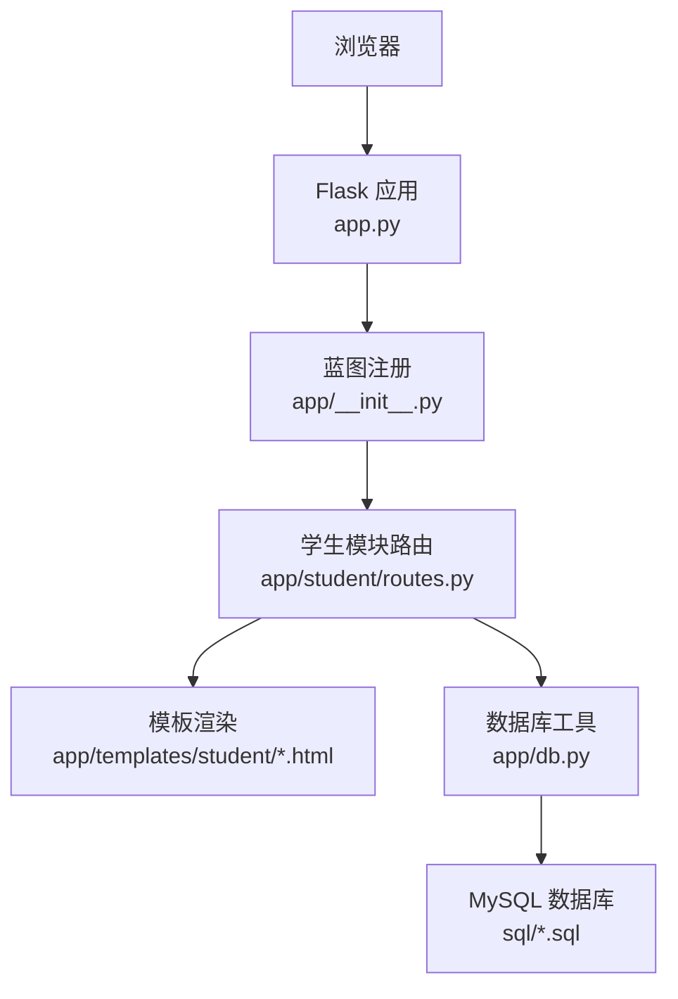
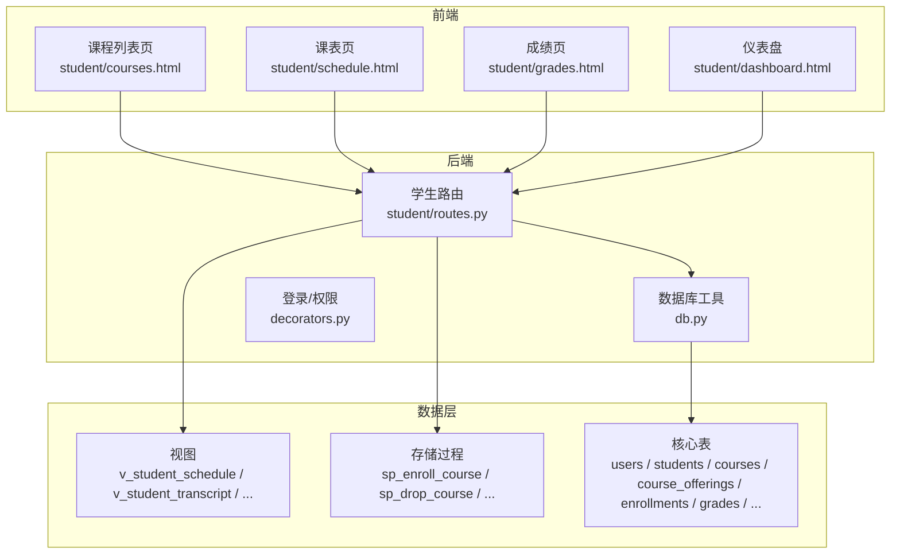
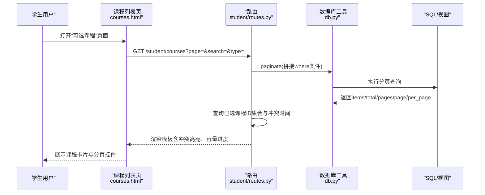
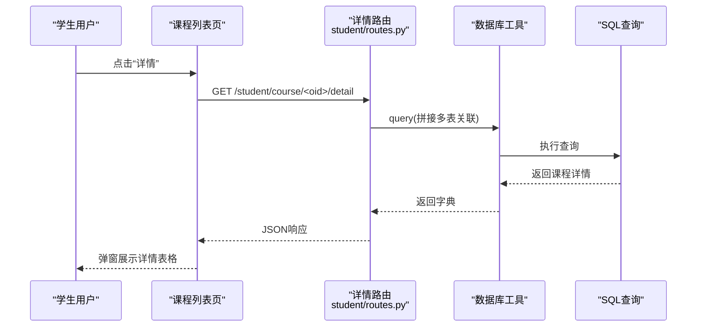
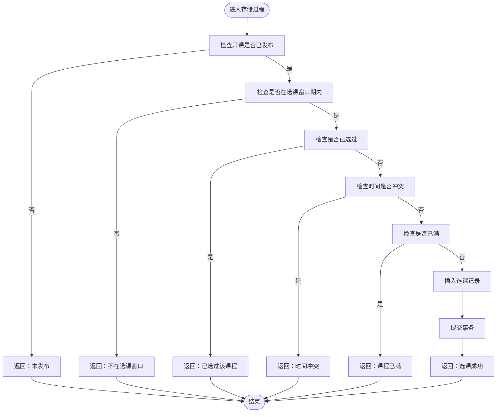
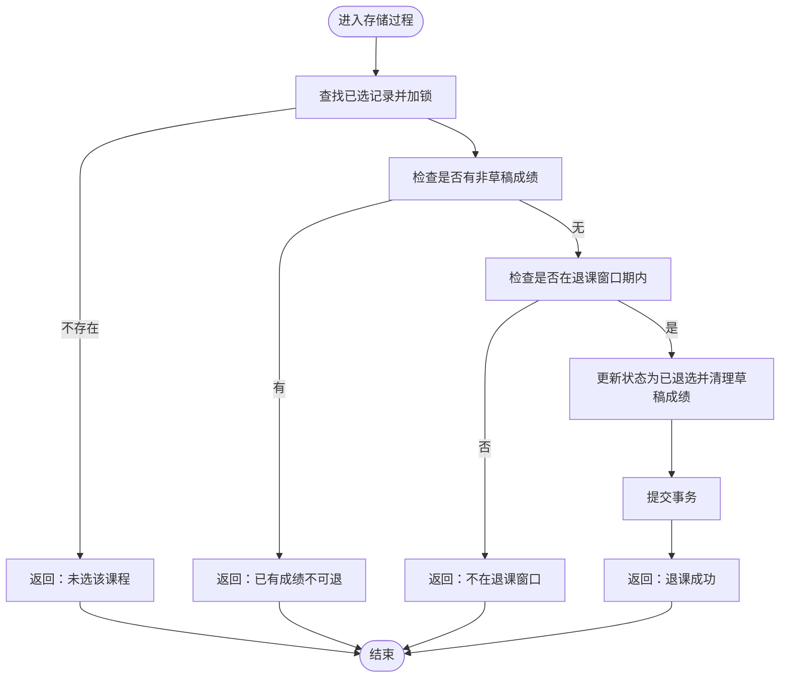
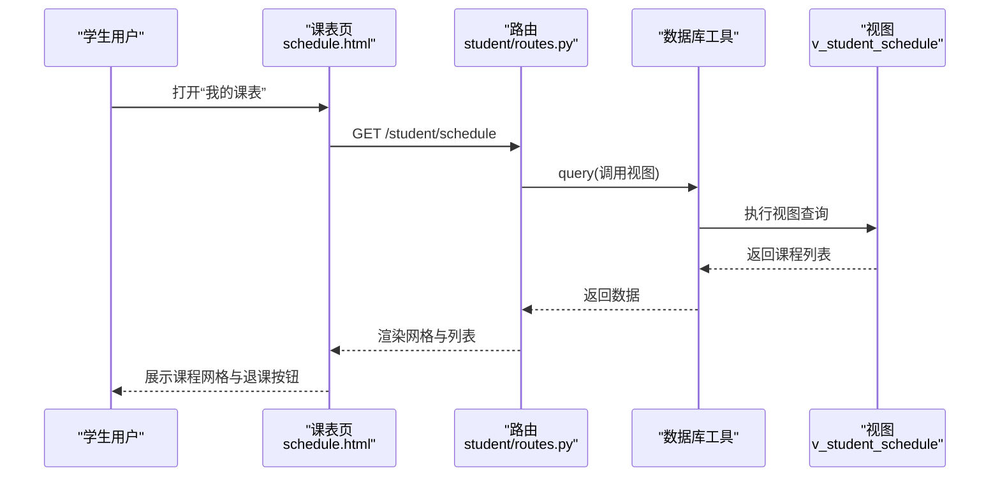
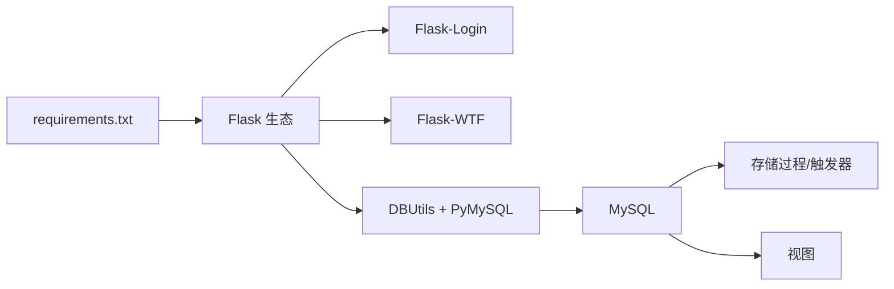

# 课程查询与选课

<cite>
**本文引用的文件**
- [app.py](file://app.py)
- [app/__init__.py](file://app/__init__.py)
- [app/db.py](file://app/db.py)
- [config.py](file://config.py)
- [README.md](file://README.md)
- [requirements.txt](file://requirements.txt)
- [app/student/routes.py](file://app/student/routes.py)
- [app/templates/student/courses.html](file://app/templates/student/courses.html)
- [app/templates/student/schedule.html](file://app/templates/student/schedule.html)
- [app/templates/student/grades.html](file://app/templates/student/grades.html)
- [app/templates/student/dashboard.html](file://app/templates/student/dashboard.html)
- [app/decorators.py](file://app/decorators.py)
- [sql/01_schema.sql](file://sql/01_schema.sql)
- [sql/03_procedures.sql](file://sql/03_procedures.sql)
- [sql/04_views.sql](file://sql/04_views.sql)
- [sql/05_academic_alerts.sql](file://sql/05_academic_alerts.sql)
- [app/admin/routes.py](file://app/admin/routes.py)
- [app/templates/admin/selection_periods.html](file://app/templates/admin/selection_periods.html)
</cite>

## 目录
1. [简介](#简介)
2. [项目结构](#项目结构)
3. [核心组件](#核心组件)
4. [架构总览](#架构总览)
5. [详细组件分析](#详细组件分析)
6. [依赖分析](#依赖分析)
7. [性能考虑](#性能考虑)
8. [故障排查指南](#故障排查指南)
9. [结论](#结论)
10. [附录](#附录)

## 简介
本指南面向学生用户，系统讲解“课程查询与选课”功能的完整使用流程与策略建议。内容涵盖：
- 课程搜索、多条件筛选、排序与分页浏览
- 课程详情查看（基本信息、教师、时间地点、容量、先修要求）
- 选课/退课全流程（时间窗口、冲突检测、容量检查、操作确认）
- 选课状态管理（已选课程、成功/失败提示）
- 选课策略与常见问题解答
- 界面截图与操作步骤说明

## 项目结构
系统采用 Flask 微服务化蓝图组织，学生模块提供课程查询、选课、退课、课表、成绩等功能；数据库通过存储过程与视图实现业务规则与统计。

图表来源
- [app.py:1-13](file://app.py#L1-L13)
- [app/__init__.py:29-93](file://app/__init__.py#L29-L93)
- [app/student/routes.py:1-218](file://app/student/routes.py#L1-L218)
- [app/db.py:1-121](file://app/db.py#L1-L121)

章节来源
- [README.md:1-87](file://README.md#L1-L87)
- [requirements.txt:1-8](file://requirements.txt#L1-L8)

## 核心组件
- 应用入口与蓝图注册：负责初始化 Flask、CSRF、数据库连接池、登录管理与蓝图注册。
- 数据库工具：封装连接池、查询、分页、存储过程调用等。
- 学生模块路由：提供课程列表、详情、选课、退课、课表、成绩等接口。
- 模板页面：课程列表、课表、成绩、仪表盘等前端展示。
- 存储过程与视图：实现选课/退课校验、成绩计算、GPA 统计、预警分析等。

章节来源
- [app/__init__.py:29-93](file://app/__init__.py#L29-L93)
- [app/db.py:43-121](file://app/db.py#L43-L121)
- [app/student/routes.py:78-218](file://app/student/routes.py#L78-L218)

## 架构总览
系统采用“前端模板 + 后端路由 + 存储过程/视图”的三层架构：
- 前端：Bootstrap + Jinja2 模板渲染，支持分页、模态框、图表。
- 后端：Flask 路由处理请求，调用数据库工具与存储过程。
- 数据层：MySQL 表 + 存储过程 + 视图，保证业务一致性与统计能力。

图表来源
- [app/student/routes.py:78-218](file://app/student/routes.py#L78-L218)
- [app/db.py:43-121](file://app/db.py#L43-L121)
- [sql/03_procedures.sql:14-194](file://sql/03_procedures.sql#L14-L194)
- [sql/04_views.sql:10-113](file://sql/04_views.sql#L10-L113)
- [sql/01_schema.sql:15-200](file://sql/01_schema.sql#L15-L200)

## 详细组件分析

### 课程查询与筛选
- 功能要点
  - 搜索：支持课程名、课程代码、教师名模糊匹配
  - 筛选：按课程类型（必修/选修/任选）过滤
  - 分页：默认每页条目数由配置控制，支持页码跳转
  - 排序：按开课 ID 倒序展示最新发布的课程
  - 冲突提示：若课程时间与已选课程冲突，卡片边框高亮并标注“时间冲突”
  - 容量进度：显示已选人数与最大容量，进度条颜色区分不同饱和度

- 关键实现路径
  - 路由与查询：[app/student/routes.py:78-115](file://app/student/routes.py#L78-L115)
  - 模板渲染与交互：[app/templates/student/courses.html:1-95](file://app/templates/student/courses.html#L1-L95)
  - 分页工具：[app/db.py:92-121](file://app/db.py#L92-L121)
  - 配置项：[config.py:24-25](file://config.py#L24-L25)

- 交互流程（课程列表页）

图表来源
- [app/student/routes.py:78-115](file://app/student/routes.py#L78-L115)
- [app/templates/student/courses.html:14-58](file://app/templates/student/courses.html#L14-L58)
- [app/db.py:92-121](file://app/db.py#L92-L121)

章节来源
- [app/student/routes.py:78-115](file://app/student/routes.py#L78-L115)
- [app/templates/student/courses.html:1-95](file://app/templates/student/courses.html#L1-L95)
- [config.py:24-25](file://config.py#L24-L25)

### 课程详情查看
- 功能要点
  - 弹窗详情：点击“详情”按钮，异步拉取课程详细信息并以表格形式展示
  - 信息维度：课程名称/代码、学分/学时、课程类型、授课教师、上课时间/教室、选课人数/容量、课程描述
  - 交互：前端通过 fetch 请求路由接口，返回 JSON 后填充弹窗内容

- 关键实现路径
  - 路由接口：[app/student/routes.py:117-131](file://app/student/routes.py#L117-L131)
  - 模板详情弹窗与脚本：[app/templates/student/courses.html:59-95](file://app/templates/student/courses.html#L59-L95)

- 详情查看流程

图表来源
- [app/student/routes.py:117-131](file://app/student/routes.py#L117-L131)
- [app/templates/student/courses.html:70-95](file://app/templates/student/courses.html#L70-L95)

章节来源
- [app/student/routes.py:117-131](file://app/student/routes.py#L117-L131)
- [app/templates/student/courses.html:59-95](file://app/templates/student/courses.html#L59-L95)

### 选课流程与规则
- 选课前提
  - 当前处于“选课”时间段内
  - 开课状态为“已发布”
  - 未重复选课
  - 时间不冲突
  - 未达到最大容量

- 选课接口与流程
  - 路由：POST /student/enroll/<oid>
  - 实现：调用存储过程 sp_enroll_course，返回结果码与消息
  - 前端：提交表单前弹出确认对话框（含冲突提示）
  - 结果：根据结果码显示成功/警告/危险提示

- 关键实现路径
  - 路由与存储过程调用：[app/student/routes.py:133-145](file://app/student/routes.py#L133-L145)
  - 存储过程（选课）：[sql/03_procedures.sql:14-114](file://sql/03_procedures.sql#L14-L114)
  - 模板确认与按钮状态：[app/templates/student/courses.html:42-52](file://app/templates/student/courses.html#L42-L52)

- 选课校验流程（存储过程）

图表来源
- [sql/03_procedures.sql:14-114](file://sql/03_procedures.sql#L14-L114)

章节来源
- [app/student/routes.py:133-145](file://app/student/routes.py#L133-L145)
- [app/templates/student/courses.html:42-52](file://app/templates/student/courses.html#L42-L52)
- [sql/03_procedures.sql:14-114](file://sql/03_procedures.sql#L14-L114)

### 退课流程与规则
- 退课前提
  - 当前处于“退课”时间段内
  - 未有已发布/已审核的成绩记录（草稿可删）
  - 已选记录存在且状态为“已选”

- 退课接口与流程
  - 路由：POST /student/drop/<oid>
  - 实现：调用存储过程 sp_drop_course，返回结果码与消息
  - 前端：课表页弹出确认模态框，二次确认
  - 结果：根据结果码显示提示

- 关键实现路径
  - 路由与存储过程调用：[app/student/routes.py:147-159](file://app/student/routes.py#L147-L159)
  - 存储过程（退课）：[sql/03_procedures.sql:119-194](file://sql/03_procedures.sql#L119-L194)
  - 课表页退课按钮与模态框：[app/templates/student/schedule.html:68-81](file://app/templates/student/schedule.html#L68-L81)

- 退课校验流程（存储过程）

图表来源
- [sql/03_procedures.sql:119-194](file://sql/03_procedures.sql#L119-L194)

章节来源
- [app/student/routes.py:147-159](file://app/student/routes.py#L147-L159)
- [app/templates/student/schedule.html:68-81](file://app/templates/student/schedule.html#L68-L81)
- [sql/03_procedures.sql:119-194](file://sql/03_procedures.sql#L119-L194)

### 选课状态管理与已选课程
- 已选课程展示
  - 课表页：按时间网格与课程列表展示已选课程，支持退课操作
  - 仪表盘：显示“已选课程数/GPA/已修学分/已出成绩数”
  - 成绩页：展示各学期课程、平时/期末/总评/绩点与状态

- 关键实现路径
  - 课表视图与路由：[sql/04_views.sql:10-32](file://sql/04_views.sql#L10-L32)、[app/student/routes.py:161-167](file://app/student/routes.py#L161-L167)
  - 仪表盘数据与模板：[app/student/routes.py:34-64](file://app/student/routes.py#L34-L64)、[app/templates/student/dashboard.html:1-73](file://app/templates/student/dashboard.html#L1-L73)
  - 成绩统计与模板：[app/student/routes.py:170-197](file://app/student/routes.py#L170-L197)、[app/templates/student/grades.html:1-75](file://app/templates/student/grades.html#L1-L75)

- 课表展示流程

图表来源
- [app/student/routes.py:161-167](file://app/student/routes.py#L161-L167)
- [sql/04_views.sql:10-32](file://sql/04_views.sql#L10-L32)
- [app/templates/student/schedule.html:16-97](file://app/templates/student/schedule.html#L16-L97)

章节来源
- [app/student/routes.py:161-197](file://app/student/routes.py#L161-L197)
- [sql/04_views.sql:10-32](file://sql/04_views.sql#L10-L32)
- [app/templates/student/schedule.html:16-97](file://app/templates/student/schedule.html#L16-L97)
- [app/templates/student/dashboard.html:1-73](file://app/templates/student/dashboard.html#L1-L73)
- [app/templates/student/grades.html:1-75](file://app/templates/student/grades.html#L1-L75)

### 选课策略建议与常见问题
- 选课策略
  - 提前关注“选课时间窗口”，避免错过
  - 使用“课程类型”筛选快速定位目标课程
  - 注意“时间冲突”标识，优先选择与已选时间不重叠的课程
  - 关注“容量进度条”，尽早选择热门课程
  - 利用“详情”弹窗确认教师、教室、时间安排

- 退课注意事项
  - 仅在“退课窗口”内可退
  - 若课程已有“已发布/已审核”成绩则不可退
  - 退课会同步清理草稿成绩

- 选课政策解读
  - 选课/退课窗口由管理员配置，可在后台维护
  - 开课需先“审核通过”再“发布”，学生方可选课

章节来源
- [app/templates/student/courses.html:17-52](file://app/templates/student/courses.html#L17-L52)
- [app/templates/student/schedule.html:68-81](file://app/templates/student/schedule.html#L68-L81)
- [app/admin/routes.py:408-428](file://app/admin/routes.py#L408-L428)
- [app/templates/admin/selection_periods.html:1-85](file://app/templates/admin/selection_periods.html#L1-L85)

## 依赖分析
- 外部依赖
  - Flask、Flask-Login、Flask-WTF、PyMySQL、DBUtils、Werkzeug、WTForms
- 数据库依赖
  - 存储过程与触发器保障选课/退课原子性与一致性
  - 视图为课表、成绩单、统计提供稳定查询口径

图表来源
- [requirements.txt:1-8](file://requirements.txt#L1-L8)
- [sql/03_procedures.sql:14-194](file://sql/03_procedures.sql#L14-L194)
- [sql/04_views.sql:10-113](file://sql/04_views.sql#L10-L113)

章节来源
- [requirements.txt:1-8](file://requirements.txt#L1-L8)
- [sql/03_procedures.sql:14-194](file://sql/03_procedures.sql#L14-L194)
- [sql/04_views.sql:10-113](file://sql/04_views.sql#L10-L113)

## 性能考虑
- 数据库连接池：通过 DBUtils 连接池减少连接开销，提高并发性能
- 分页查询：后端统一分页逻辑，避免一次性加载大量数据
- 视图与索引：核心表建立必要索引与唯一约束，视图简化复杂联接
- 前端渲染：Jinja2 在服务端渲染，减少客户端压力

章节来源
- [app/db.py:10-41](file://app/db.py#L10-L41)
- [app/db.py:92-121](file://app/db.py#L92-L121)
- [sql/01_schema.sql:15-200](file://sql/01_schema.sql#L15-L200)

## 故障排查指南
- 无法选课
  - 检查是否在“选课窗口”内：后台维护时间段
  - 检查课程状态是否为“已发布”
  - 检查是否重复选课或存在时间冲突
  - 检查课程是否已满
- 无法退课
  - 检查是否在“退课窗口”内
  - 检查课程是否已有“已发布/已审核”成绩
- 课程列表为空
  - 确认当前学期是否正确，是否存在“已发布”的开课
- 详情弹窗不显示
  - 检查路由返回状态与模板脚本是否正确渲染

章节来源
- [app/student/routes.py:133-159](file://app/student/routes.py#L133-L159)
- [sql/03_procedures.sql:14-194](file://sql/03_procedures.sql#L14-L194)
- [app/templates/student/courses.html:70-95](file://app/templates/student/courses.html#L70-L95)

## 结论
本系统通过清晰的前后端职责划分与完善的数据库存储过程/视图，实现了稳定可靠的课程查询与选课体验。学生可通过课程列表页完成搜索、筛选、分页与详情查看，并在严格的时间窗口与规则约束下完成选课/退课操作。建议在使用过程中关注时间窗口、冲突检测与容量情况，以提升成功率与效率。

## 附录

### 界面截图与操作步骤
- 登录与工作台
  - 步骤：访问首页 → 登录 → 跳转至“学生工作台”
  - 展示：快捷操作、已选课程/GPA/学分/近期成绩
  - 参考：[app/templates/student/dashboard.html:1-73](file://app/templates/student/dashboard.html#L1-L73)

- 查看可选课程与筛选
  - 步骤：点击“查看可选课程 & 选课” → 输入关键词/选择类型 → 点击“筛选”
  - 展示：课程卡片（含冲突高亮、容量进度）、分页控件
  - 参考：[app/templates/student/courses.html:4-12](file://app/templates/student/courses.html#L4-L12)、[app/templates/student/courses.html:14-58](file://app/templates/student/courses.html#L14-L58)

- 查看课程详情
  - 步骤：点击“详情” → 查看课程信息弹窗
  - 参考：[app/templates/student/courses.html:59-95](file://app/templates/student/courses.html#L59-L95)

- 选课操作
  - 步骤：确认无冲突/未满 → 点击“选课” → 确认提示 → 查看消息提示
  - 参考：[app/templates/student/courses.html:42-52](file://app/templates/student/courses.html#L42-L52)、[app/student/routes.py:133-145](file://app/student/routes.py#L133-L145)

- 查看课表与退课
  - 步骤：点击“查看课表 & 退课” → 选择课程 → 点击“退课” → 确认
  - 参考：[app/templates/student/schedule.html:16-97](file://app/templates/student/schedule.html#L16-L97)

- 查看成绩
  - 步骤：点击“查看成绩单” → 查看各学期课程与状态
  - 参考：[app/templates/student/grades.html:1-75](file://app/templates/student/grades.html#L1-L75)

### 选课时间窗口配置（管理员）
- 步骤：后台“选课时间配置”页面 → 新增/编辑/启用/禁用时间段
- 参考：[app/templates/admin/selection_periods.html:1-85](file://app/templates/admin/selection_periods.html#L1-L85)、[app/admin/routes.py:408-428](file://app/admin/routes.py#L408-L428)