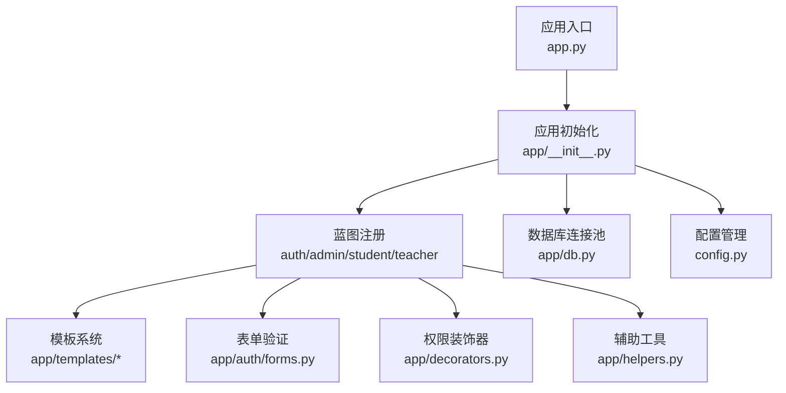
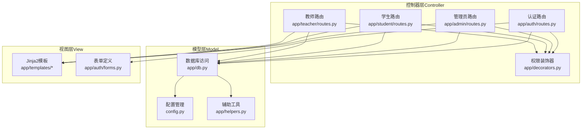
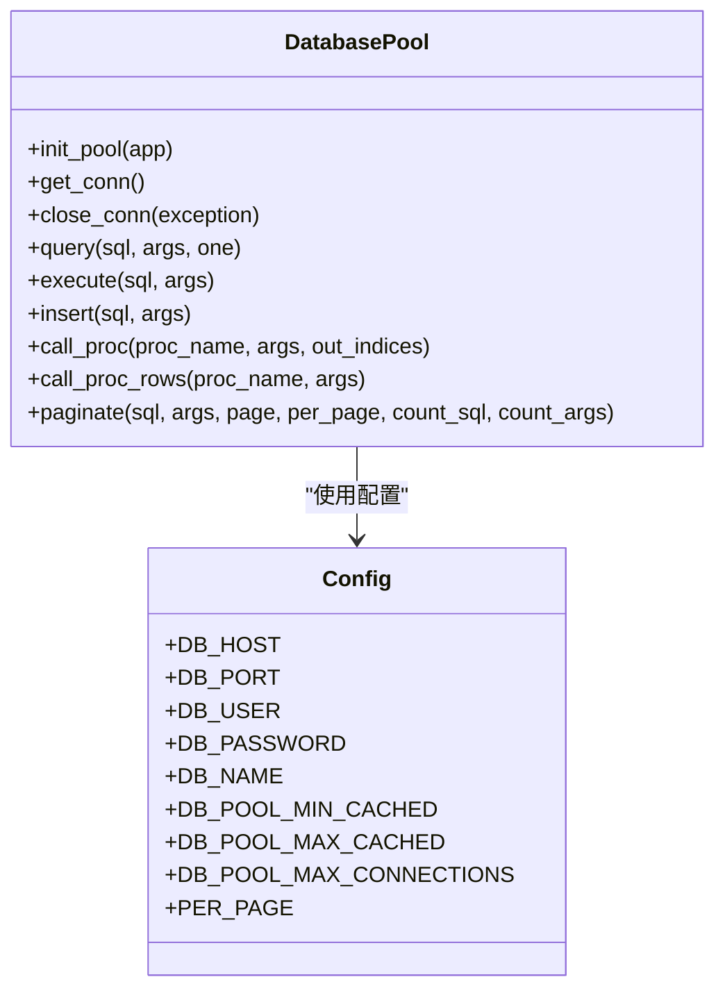
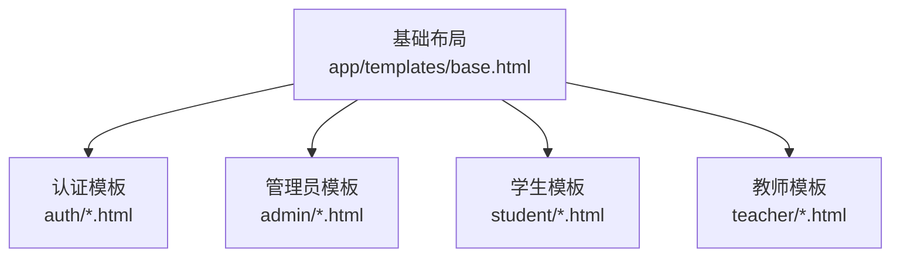
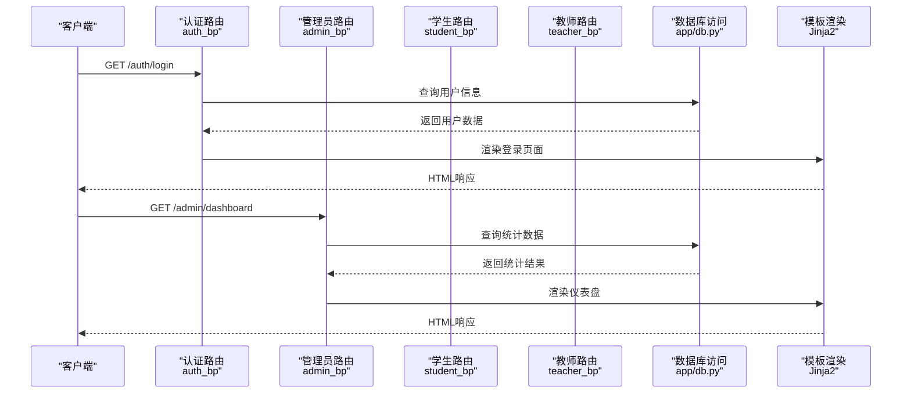
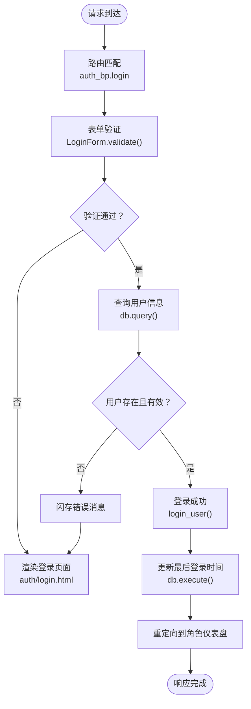
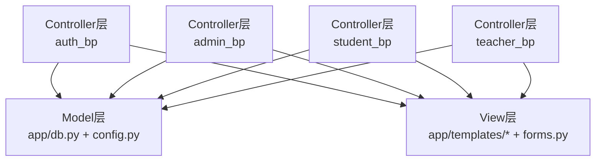
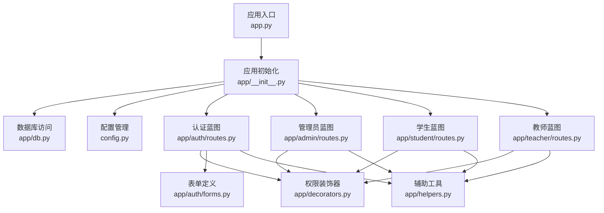

# MVC架构设计

<cite>
**本文档引用的文件**
- [app.py](file://app.py)
- [app/__init__.py](file://app/__init__.py)
- [app/db.py](file://app/db.py)
- [config.py](file://config.py)
- [app/auth/routes.py](file://app/auth/routes.py)
- [app/admin/routes.py](file://app/admin/routes.py)
- [app/student/routes.py](file://app/student/routes.py)
- [app/teacher/routes.py](file://app/teacher/routes.py)
- [app/decorators.py](file://app/decorators.py)
- [app/helpers.py](file://app/helpers.py)
- [app/auth/forms.py](file://app/auth/forms.py)
- [app/templates/base.html](file://app/templates/base.html)
</cite>

## 目录
1. [引言](#引言)
2. [项目结构](#项目结构)
3. [核心组件](#核心组件)
4. [架构总览](#架构总览)
5. [详细组件分析](#详细组件分析)
6. [依赖关系分析](#依赖关系分析)
7. [性能考虑](#性能考虑)
8. [故障排除指南](#故障排除指南)
9. [结论](#结论)
10. [附录](#附录)

## 引言
本项目采用Flask框架实现校园教务选课与成绩管理系统，遵循MVC（Model-View-Controller）架构模式。系统通过蓝图（Blueprint）组织不同角色（管理员、教师、学生）的功能模块，结合Jinja2模板引擎实现视图渲染，使用数据库连接池封装数据访问层，形成清晰的分层架构。本文档将深入解析MVC各层的设计与实现，阐述各层间的交互关系与数据流向，并提供完整的请求处理流程图。

## 项目结构
项目采用基于功能模块的目录组织方式，核心文件分布如下：
- 应用入口与初始化：app.py、app/__init__.py
- 配置管理：config.py
- 数据库访问：app/db.py
- 蓝图模块：app/auth/、app/admin/、app/student/、app/teacher/
- 模板系统：app/templates/
- 辅助工具：app/helpers.py、app/decorators.py、app/auth/forms.py

**图表来源**
- [app.py:1-13](file://app.py#L1-L13)
- [app/__init__.py:29-93](file://app/__init__.py#L29-L93)
- [app/db.py:10-121](file://app/db.py#L10-L121)

**章节来源**
- [app.py:1-13](file://app.py#L1-L13)
- [app/__init__.py:29-93](file://app/__init__.py#L29-L93)
- [config.py:1-36](file://config.py#L1-L36)

## 核心组件
本节从MVC三层视角分析系统的核心组件及其职责分工。

- 模型（Model）层
  - 数据库连接池与查询封装：app/db.py提供连接池初始化、查询执行、写操作、存储过程调用、分页查询等功能，统一管理数据库连接生命周期。
  - 配置管理：config.py集中管理数据库连接参数、分页配置、权重参数等系统配置。
  - 辅助工具：app/helpers.py提供日志记录、课表解析、选课时间段查询等通用功能。

- 视图（View）层
  - Jinja2模板系统：app/templates/目录包含基础布局与各模块模板，支持继承与块扩展，实现统一UI风格与模块化页面。
  - 表单渲染：app/auth/forms.py定义认证相关表单字段与验证规则，配合模板进行表单渲染与校验反馈。

- 控制器（Controller）层
  - 蓝图路由：app/auth/routes.py、app/admin/routes.py、app/student/routes.py、app/teacher/routes.py分别实现各角色的业务路由，承担请求处理与响应生成职责。
  - 权限控制：app/decorators.py提供登录与角色验证装饰器，确保路由访问的安全性。
  - 应用初始化：app/__init__.py负责Flask实例创建、CSRF保护、数据库连接池注册、蓝图注册、错误处理器与登录管理器配置。

**章节来源**
- [app/db.py:10-121](file://app/db.py#L10-L121)
- [config.py:6-36](file://config.py#L6-L36)
- [app/helpers.py:9-80](file://app/helpers.py#L9-L80)
- [app/auth/forms.py:6-37](file://app/auth/forms.py#L6-L37)
- [app/auth/routes.py:33-186](file://app/auth/routes.py#L33-L186)
- [app/admin/routes.py:43-692](file://app/admin/routes.py#L43-L692)
- [app/student/routes.py:36-233](file://app/student/routes.py#L36-L233)
- [app/teacher/routes.py:51-333](file://app/teacher/routes.py#L51-L333)
- [app/decorators.py:7-26](file://app/decorators.py#L7-L26)
- [app/__init__.py:29-93](file://app/__init__.py#L29-L93)

## 架构总览
系统采用Flask蓝图实现MVC分离，控制器层通过蓝图路由处理HTTP请求，模型层通过数据库访问工具执行数据操作，视图层通过Jinja2模板渲染HTML页面。整体架构清晰、职责明确，便于维护与扩展。

**图表来源**
- [app/auth/routes.py:33-186](file://app/auth/routes.py#L33-L186)
- [app/admin/routes.py:43-692](file://app/admin/routes.py#L43-L692)
- [app/student/routes.py:36-233](file://app/student/routes.py#L36-L233)
- [app/teacher/routes.py:51-333](file://app/teacher/routes.py#L51-L333)
- [app/db.py:10-121](file://app/db.py#L10-L121)
- [config.py:6-36](file://config.py#L6-L36)
- [app/helpers.py:9-80](file://app/helpers.py#L9-L80)
- [app/auth/forms.py:6-37](file://app/auth/forms.py#L6-L37)
- [app/templates/base.html:1-85](file://app/templates/base.html#L1-L85)

## 详细组件分析

### 模型层（Model）设计
模型层通过app/db.py实现数据库访问的抽象与封装，提供统一的数据操作接口，确保业务逻辑与数据访问解耦。

- 数据库连接池
  - 初始化：通过init_pool创建PooledDB实例，配置最小缓存、最大缓存、最大连接数等参数。
  - 连接管理：get_conn从Flask g对象获取连接，close_conn在请求结束时关闭连接，避免连接泄漏。
  - 配置来源：config.py中的DB_*配置项决定连接池参数与数据库连接信息。

- 查询与写操作
  - query：执行查询语句，支持返回单行或全部结果。
  - execute：执行写操作（INSERT/UPDATE/DELETE），返回受影响行数并自动提交事务。
  - insert：执行插入操作，返回自增ID。
  - call_proc/call_proc_rows：调用存储过程，支持OUT参数读取与返回结果集两种场景。

- 分页查询
  - paginate：实现通用分页逻辑，自动计算总数、页数与偏移量，支持自定义count_sql与count_args。

**图表来源**
- [app/db.py:10-121](file://app/db.py#L10-L121)
- [config.py:6-36](file://config.py#L6-L36)

**章节来源**
- [app/db.py:10-121](file://app/db.py#L10-L121)
- [config.py:6-36](file://config.py#L6-L36)

### 视图层（View）实现
视图层通过Jinja2模板系统与Bootstrap前端框架实现统一的UI风格与模块化页面。

- 基础布局
  - app/templates/base.html提供侧边栏导航、面包屑、消息提示与通用样式加载，各模块模板通过继承基础布局。
  - 根据当前用户角色动态生成菜单项，实现角色化界面展示。

- 模块化模板
  - 认证模块：auth/login.html、auth/register.html、auth/profile.html
  - 管理员模块：admin/dashboard.html、admin/students.html、admin/teachers.html等
  - 学生模块：student/dashboard.html、student/courses.html、student/grades.html等
  - 教师模块：teacher/dashboard.html、teacher/my_offerings.html、teacher/grade_stats.html等

- 表单渲染
  - app/auth/forms.py定义LoginForm与RegisterForm，包含字段验证规则与错误提示，配合模板进行表单渲染与用户输入校验。

**图表来源**
- [app/templates/base.html:1-85](file://app/templates/base.html#L1-L85)
- [app/auth/forms.py:6-37](file://app/auth/forms.py#L6-L37)

**章节来源**
- [app/templates/base.html:1-85](file://app/templates/base.html#L1-L85)
- [app/auth/forms.py:6-37](file://app/auth/forms.py#L6-L37)

### 控制器层（Controller）作用
控制器层通过Flask蓝图路由实现请求处理与业务逻辑协调，确保MVC各层职责清晰。

- 蓝图注册与路由
  - app/__init__.py中注册auth_bp、admin_bp、student_bp、teacher_bp四个蓝图，每个蓝图包含独立的路由处理函数。
  - 路由函数根据请求方法与参数执行相应的业务逻辑，调用模型层进行数据操作，然后渲染模板生成响应。

- 权限控制
  - app/decorators.py提供role_required装饰器，确保只有具备特定角色的用户才能访问相应路由。
  - @login_required装饰器保证用户必须登录后才能访问受保护的路由。

- 业务逻辑协调
  - 认证模块：处理用户登录、注册、个人信息修改等流程，调用数据库工具进行用户信息验证与更新。
  - 管理员模块：实现基础信息管理、开课审核、成绩审核、统计分析、学业预警等功能，大量使用存储过程与视图。
  - 学生模块：提供课程查询、选课/退课、课表查看、成绩查询、成绩单打印等服务。
  - 教师模块：支持开课申请、学生名单管理、成绩录入与审核、成绩统计分析等。

**图表来源**
- [app/auth/routes.py:33-186](file://app/auth/routes.py#L33-L186)
- [app/admin/routes.py:43-692](file://app/admin/routes.py#L43-L692)
- [app/db.py:43-90](file://app/db.py#L43-L90)
- [app/templates/base.html:1-85](file://app/templates/base.html#L1-L85)

**章节来源**
- [app/auth/routes.py:33-186](file://app/auth/routes.py#L33-L186)
- [app/admin/routes.py:43-692](file://app/admin/routes.py#L43-L692)
- [app/student/routes.py:36-233](file://app/student/routes.py#L36-L233)
- [app/teacher/routes.py:51-333](file://app/teacher/routes.py#L51-L333)
- [app/decorators.py:7-26](file://app/decorators.py#L7-L26)

### 请求处理流程图
下面展示一次典型的用户登录请求从发起到响应的完整流程，体现MVC各层的协作关系。

**图表来源**
- [app/auth/routes.py:33-57](file://app/auth/routes.py#L33-L57)
- [app/db.py:43-59](file://app/db.py#L43-L59)
- [app/__init__.py:47-51](file://app/__init__.py#L47-L51)

**章节来源**
- [app/auth/routes.py:33-57](file://app/auth/routes.py#L33-L57)
- [app/db.py:43-59](file://app/db.py#L43-L59)
- [app/__init__.py:47-51](file://app/__init__.py#L47-L51)

### MVC与Flask蓝图的对应关系
- Model层：app/db.py与config.py构成数据访问抽象，为所有蓝图提供统一的数据操作接口。
- View层：app/templates/*与app/auth/forms.py提供模板与表单渲染能力。
- Controller层：auth_bp、admin_bp、student_bp、teacher_bp四个蓝图分别承载不同角色的控制器逻辑。

**图表来源**
- [app/db.py:10-121](file://app/db.py#L10-L121)
- [config.py:6-36](file://config.py#L6-L36)
- [app/auth/routes.py:30](file://app/auth/routes.py#L30)
- [app/admin/routes.py:11](file://app/admin/routes.py#L11)
- [app/student/routes.py:9](file://app/student/routes.py#L9)
- [app/teacher/routes.py:8](file://app/teacher/routes.py#L8)

**章节来源**
- [app/db.py:10-121](file://app/db.py#L10-L121)
- [config.py:6-36](file://config.py#L6-L36)
- [app/auth/routes.py:30](file://app/auth/routes.py#L30)
- [app/admin/routes.py:11](file://app/admin/routes.py#L11)
- [app/student/routes.py:9](file://app/student/routes.py#L9)
- [app/teacher/routes.py:8](file://app/teacher/routes.py#L8)

## 依赖关系分析
系统各组件间存在清晰的依赖关系，确保模块化与可维护性。

**图表来源**
- [app.py:1-13](file://app.py#L1-L13)
- [app/__init__.py:29-93](file://app/__init__.py#L29-L93)
- [app/db.py:10-121](file://app/db.py#L10-L121)
- [config.py:6-36](file://config.py#L6-L36)
- [app/auth/routes.py:30](file://app/auth/routes.py#L30)
- [app/admin/routes.py:11](file://app/admin/routes.py#L11)
- [app/student/routes.py:9](file://app/student/routes.py#L9)
- [app/teacher/routes.py:8](file://app/teacher/routes.py#L8)
- [app/decorators.py:7-26](file://app/decorators.py#L7-L26)
- [app/auth/forms.py:6-37](file://app/auth/forms.py#L6-L37)
- [app/helpers.py:9-80](file://app/helpers.py#L9-L80)

**章节来源**
- [app.py:1-13](file://app.py#L1-L13)
- [app/__init__.py:29-93](file://app/__init__.py#L29-L93)
- [app/db.py:10-121](file://app/db.py#L10-L121)
- [config.py:6-36](file://config.py#L6-L36)
- [app/auth/routes.py:30](file://app/auth/routes.py#L30)
- [app/admin/routes.py:11](file://app/admin/routes.py#L11)
- [app/student/routes.py:9](file://app/student/routes.py#L9)
- [app/teacher/routes.py:8](file://app/teacher/routes.py#L8)
- [app/decorators.py:7-26](file://app/decorators.py#L7-L26)
- [app/auth/forms.py:6-37](file://app/auth/forms.py#L6-L37)
- [app/helpers.py:9-80](file://app/helpers.py#L9-L80)

## 性能考虑
- 数据库连接池：通过PooledDB减少连接创建与销毁开销，提高并发性能。
- 分页查询：paginate函数实现高效分页，避免一次性加载大量数据。
- 存储过程：管理员模块大量使用存储过程与视图，减少应用层SQL复杂度，提升查询效率。
- 缓存策略：建议在业务热点数据上引入Redis缓存，如用户会话、热门查询结果等。
- 前端优化：利用Bootstrap与Chart.js提升用户体验，合理使用静态资源压缩与CDN加速。

## 故障排除指南
- 登录失败
  - 检查用户名是否存在且处于激活状态，确认密码哈希验证是否通过。
  - 查看数据库连接池配置与连接状态，确保连接正常。
  
- 权限不足
  - 确认用户角色与目标路由的权限要求是否匹配。
  - 检查装饰器链路是否正确应用，避免权限绕过。

- 数据库异常
  - 查看存储过程执行结果与返回码，定位业务逻辑问题。
  - 检查事务提交与回滚逻辑，确保数据一致性。

**章节来源**
- [app/auth/routes.py:33-57](file://app/auth/routes.py#L33-L57)
- [app/admin/routes.py:423-431](file://app/admin/routes.py#L423-L431)
- [app/db.py:62-80](file://app/db.py#L62-L80)

## 结论
本项目通过Flask蓝图实现了清晰的MVC架构分离，模型层通过数据库访问工具提供统一的数据抽象，视图层利用Jinja2模板系统实现模块化页面渲染，控制器层通过蓝图路由协调业务逻辑。该架构具有职责明确、易于维护、扩展性强等优势，适合中大型Web应用开发。建议在生产环境中进一步完善缓存策略、监控体系与安全防护措施，以提升系统整体性能与稳定性。

## 附录
- 最佳实践
  - 保持控制器轻量化，将复杂业务逻辑封装到服务层或工具函数中。
  - 统一错误处理与日志记录，便于问题追踪与调试。
  - 使用装饰器进行权限控制，避免重复代码。
  - 合理使用分页与缓存，提升用户体验与系统性能。
  - 持续重构与测试，确保代码质量与可维护性。