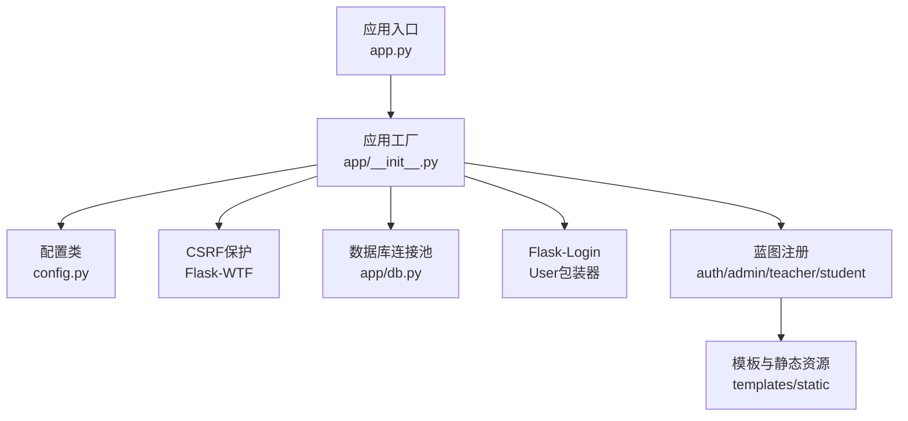
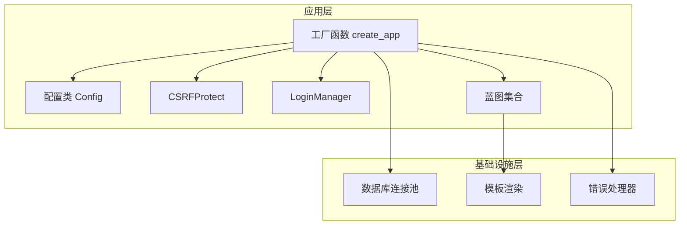
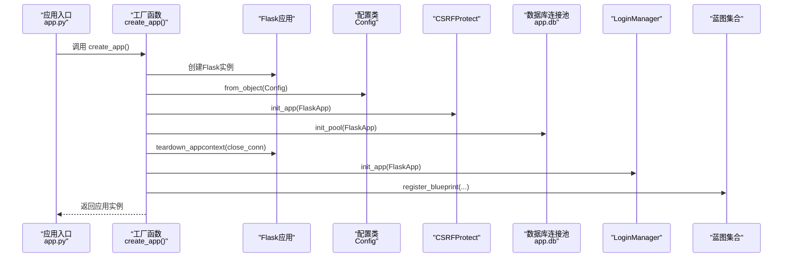
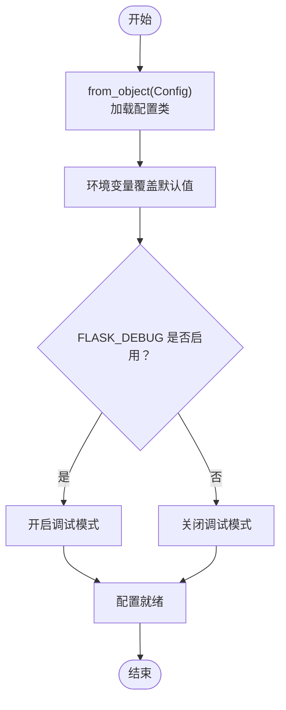
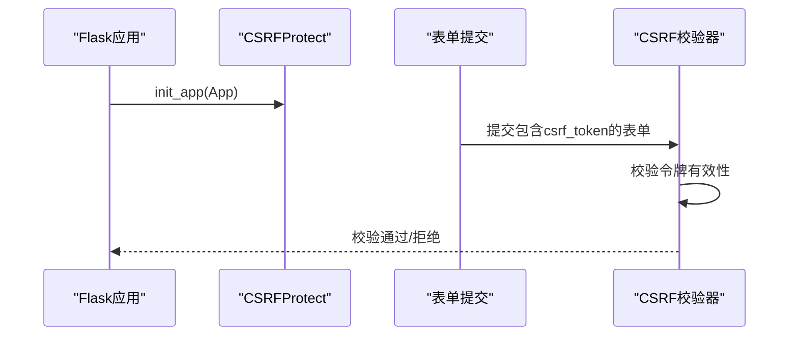
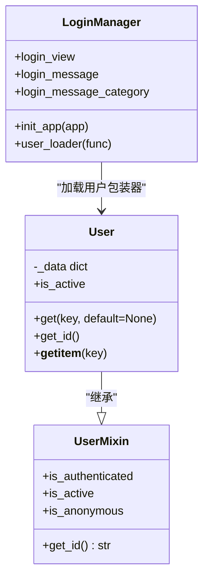
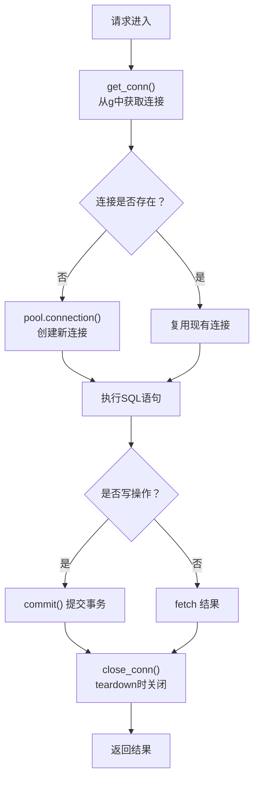
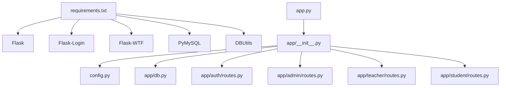

# 应用初始化与工厂模式

<cite>
**本文档引用的文件**
- [app.py](file://app.py)
- [config.py](file://config.py)
- [app/__init__.py](file://app/__init__.py)
- [app/db.py](file://app/db.py)
- [app/auth/routes.py](file://app/auth/routes.py)
- [app/admin/routes.py](file://app/admin/routes.py)
- [app/teacher/routes.py](file://app/teacher/routes.py)
- [app/student/routes.py](file://app/student/routes.py)
- [app/decorators.py](file://app/decorators.py)
- [requirements.txt](file://requirements.txt)
- [README.md](file://README.md)
</cite>

## 目录
1. [引言](#引言)
2. [项目结构](#项目结构)
3. [核心组件](#核心组件)
4. [架构总览](#架构总览)
5. [详细组件分析](#详细组件分析)
6. [依赖分析](#依赖分析)
7. [性能考虑](#性能考虑)
8. [故障排除指南](#故障排除指南)
9. [结论](#结论)

## 引言
本文件围绕Flask应用的“应用工厂模式”展开，系统性解析应用创建流程、配置管理、CSRF保护初始化、以及Flask-Login兼容的User类设计与身份验证流程。文档同时提供应用启动序列图与配置加载流程图，帮助读者从宏观到微观全面理解系统的初始化与运行机制。

## 项目结构
该项目采用模块化组织方式，入口文件负责创建应用实例，核心逻辑集中在app包内，按功能划分为认证、管理员、教师、学生四个蓝图模块，并通过统一的数据库工具层提供连接池与查询封装。

图表来源
- [app.py:1-13](file://app.py#L1-L13)
- [app/__init__.py:29-92](file://app/__init__.py#L29-L92)
- [config.py:6-36](file://config.py#L6-L36)
- [app/db.py:10-41](file://app/db.py#L10-L41)

章节来源
- [app.py:1-13](file://app.py#L1-L13)
- [README.md:48-69](file://README.md#L48-L69)

## 核心组件
- 应用工厂函数create_app：集中初始化Flask应用、配置、CSRF保护、数据库连接池、Flask-Login与蓝图注册。
- 配置类Config：集中管理应用配置项，支持环境变量覆盖。
- 数据库工具层app.db：提供连接池初始化、连接获取/释放、查询与事务封装。
- User类：实现Flask-Login兼容的用户包装器，提供身份标识与属性访问。
- 蓝图模块：认证(auth)、管理员(admin)、教师(teacher)、学生(student)，分别承担不同角色的业务逻辑。

章节来源
- [app/__init__.py:29-92](file://app/__init__.py#L29-L92)
- [config.py:6-36](file://config.py#L6-L36)
- [app/db.py:10-121](file://app/db.py#L10-L121)

## 架构总览
应用采用“工厂模式 + 蓝图 + 插件扩展”的架构：
- 工厂函数create_app负责装配应用，确保各组件按序初始化。
- 配置类Config通过from_object注入配置，支持环境变量覆盖。
- CSRFProtect与LoginManager作为插件初始化，贯穿整个应用生命周期。
- 数据库连接池通过app.teardown_appcontext在请求结束时回收连接。
- 蓝图按URL前缀注册，实现模块化路由管理。

图表来源
- [app/__init__.py:29-92](file://app/__init__.py#L29-L92)
- [app/db.py:10-41](file://app/db.py#L10-L41)

## 详细组件分析

### 应用工厂模式与create_app设计
- 设计思路
  - 将应用创建、配置注入、插件初始化、蓝图注册等步骤集中在一个函数中，便于测试与多环境部署。
  - 使用from_object加载配置类，结合环境变量实现灵活的配置覆盖。
  - 将数据库连接池初始化与请求上下文绑定，确保连接安全回收。
  - 将Flask-Login的user_loader与数据库查询解耦，避免循环导入。
- 应用创建流程
  - 实例化Flask应用。
  - 从Config类加载配置。
  - 初始化CSRF保护。
  - 初始化数据库连接池并注册teardown回调。
  - 初始化LoginManager并设置登录视图与消息。
  - 注册各蓝图并定义根路径重定向。
  - 注册全局错误处理器。

图表来源
- [app.py:5](file://app.py#L5)
- [app/__init__.py:29-92](file://app/__init__.py#L29-L92)
- [app/db.py:10-41](file://app/db.py#L10-L41)

章节来源
- [app/__init__.py:29-92](file://app/__init__.py#L29-L92)
- [app.py:5-12](file://app.py#L5-L12)

### 配置管理与环境变量处理
- 配置项设置
  - 安全与调试：SECRET_KEY、WTF_CSRF_ENABLED、FLASK_DEBUG。
  - 数据库连接：DB_HOST、DB_PORT、DB_USER、DB_PASSWORD、DB_NAME、DB_CHARSET。
  - 连接池参数：DB_POOL_MIN_CACHED、DB_POOL_MAX_CACHED、DB_POOL_MAX_CONNECTIONS。
  - 分页参数：PER_PAGE。
  - 成绩权重与预警阈值：REGULAR_WEIGHT、EXAM_WEIGHT、GPA_HIGH_RISK、GPA_WATCH、GPA_DECLINE_THRESHOLD、MIN_CREDITS_FOR_GPA_ALERT。
- 环境变量处理
  - 所有配置项均支持通过环境变量覆盖，若未提供则使用默认值。
  - FLASK_DEBUG通过字符串比较判断布尔值。
- 配置加载流程
  - 工厂函数调用app.config.from_object(Config)一次性注入全部配置。
  - 入口文件app.py在运行时读取环境变量控制主机与端口。

图表来源
- [app/__init__.py:31](file://app/__init__.py#L31)
- [config.py:7-9](file://config.py#L7-L9)

章节来源
- [config.py:6-36](file://config.py#L6-L36)
- [app/__init__.py:31](file://app/__init__.py#L31)

### CSRF保护初始化与配置
- 初始化位置
  - 在工厂函数中通过CSRFProtect实例init_app(app)完成初始化。
- 配置要点
  - 配置类中WTF_CSRF_ENABLED为True，确保CSRF令牌生效。
  - 模板中包含隐藏的csrf_token字段，用于表单提交校验。
- 防护机制
  - 对POST/PUT/DELETE等修改类请求进行CSRF令牌校验，防止跨站请求伪造攻击。
  - 与Flask-WTF集成，简化表单安全处理。

图表来源
- [app/__init__.py:33](file://app/__init__.py#L33)
- [config.py:8](file://config.py#L8)

章节来源
- [app/__init__.py:33](file://app/__init__.py#L33)
- [config.py:8](file://config.py#L8)

### User类设计与Flask-Login兼容性
- 设计目标
  - 包装数据库查询得到的用户数据，实现Flask-Login所需的UserMixin接口。
- 关键方法
  - get_id：返回字符串形式的用户ID，满足Flask-Login的身份标识要求。
  - get：提供字典式属性访问，便于模板与业务逻辑使用。
  - __getitem__：支持键访问，增强兼容性。
  - is_active：基于数据库字段决定用户是否激活。
- 身份验证流程
  - LoginManager通过user_loader从数据库查询用户并返回User包装对象。
  - 登录成功后，login_user将用户信息存入会话，后续请求可通过current_user访问。

图表来源
- [app/__init__.py:10-26](file://app/__init__.py#L10-L26)
- [app/__init__.py:47-51](file://app/__init__.py#L47-L51)

章节来源
- [app/__init__.py:10-26](file://app/__init__.py#L10-L26)
- [app/__init__.py:47-51](file://app/__init__.py#L47-L51)

### 数据库连接池与查询封装
- 连接池初始化
  - init_pool根据应用配置创建PooledDB实例，设置最小缓存、最大缓存与最大连接数。
- 连接管理
  - get_conn从请求上下文g中获取连接，避免重复创建。
  - teardown_appcontext在请求结束时关闭连接，防止泄漏。
- 查询封装
  - query：执行查询，支持单行(one=True)与多行返回。
  - execute/insert：执行写操作并提交事务。
  - call_proc/call_proc_rows：调用存储过程并处理OUT参数或结果集。
  - paginate：分页查询，自动计算总数与页数。

图表来源
- [app/db.py:29-41](file://app/db.py#L29-L41)
- [app/db.py:43-80](file://app/db.py#L43-L80)
- [app/db.py:92-121](file://app/db.py#L92-L121)

章节来源
- [app/db.py:10-121](file://app/db.py#L10-L121)

### 蓝图与权限控制
- 蓝图注册
  - 工厂函数中注册auth、admin、teacher、student四个蓝图，并设置URL前缀。
- 权限装饰器
  - role_required装饰器结合Flask-Login，确保只有对应角色可访问特定路由。
- 全局before_request
  - 各蓝图在before_request中统一执行登录与角色校验。

章节来源
- [app/__init__.py:53-64](file://app/__init__.py#L53-L64)
- [app/decorators.py:13-25](file://app/decorators.py#L13-L25)
- [app/admin/routes.py:13-17](file://app/admin/routes.py#L13-L17)
- [app/teacher/routes.py:10-14](file://app/teacher/routes.py#L10-L14)
- [app/student/routes.py:10-14](file://app/student/routes.py#L10-L14)

## 依赖分析
- 外部依赖
  - Flask 3.x、Flask-Login 0.6、Flask-WTF 1.2、PyMySQL 1.1、DBUtils 3.1、Werkzeug 3.0、WTForms 3.1。
- 内部依赖
  - app.py依赖app/__init__.py中的create_app。
  - app/__init__.py依赖config.py、app/db.py、蓝图模块。
  - 各蓝图模块依赖app/db.py与app/decorators.py。

图表来源
- [requirements.txt:1-8](file://requirements.txt#L1-L8)
- [app.py:3](file://app.py#L3)
- [app/__init__.py:29-92](file://app/__init__.py#L29-L92)

章节来源
- [requirements.txt:1-8](file://requirements.txt#L1-L8)
- [app.py:3](file://app.py#L3)

## 性能考虑
- 连接池优化
  - 合理设置DB_POOL_MIN_CACHED、DB_POOL_MAX_CACHED与DB_POOL_MAX_CONNECTIONS，平衡内存占用与并发性能。
- 查询与事务
  - 写操作后及时commit，避免长时间持有连接。
  - 使用分页paginate减少单次查询数据量。
- CSRF与登录
  - CSRF令牌校验在服务端完成，建议保持开启以提升安全性。
  - Flask-Login的session与user_loader应避免频繁数据库查询，可在业务层增加缓存策略。

## 故障排除指南
- CSRF校验失败
  - 确认表单中包含csrf_token字段，且未被模板过滤器移除。
  - 检查WTF_CSRF_ENABLED是否为True。
- 登录无响应或跳转异常
  - 检查LoginManager的login_view是否正确指向auth.login。
  - 确认user_loader能够正确查询用户并返回User包装对象。
- 数据库连接问题
  - 检查DB_*配置项是否正确，确认数据库可达。
  - 查看teardown回调是否正常关闭连接，避免连接泄漏。
- 蓝图访问403
  - 确认当前用户角色与蓝图装饰器role_required匹配。
  - 检查用户是否激活(is_active)。

章节来源
- [app/__init__.py:41-51](file://app/__init__.py#L41-L51)
- [app/auth/routes.py:32-55](file://app/auth/routes.py#L32-L55)
- [app/admin/routes.py:13-17](file://app/admin/routes.py#L13-L17)
- [app/db.py:36-41](file://app/db.py#L36-L41)

## 结论
本项目通过应用工厂模式实现了清晰的应用初始化流程，配合配置类与环境变量提供了灵活的部署能力；CSRF保护与Flask-Login的集成确保了安全与身份管理；数据库连接池与查询封装提升了性能与可维护性。蓝图与装饰器的组合使权限控制与模块化开发得以高效协同。建议在生产环境中进一步完善日志记录、监控告警与缓存策略，以提升系统的稳定性与可观测性。