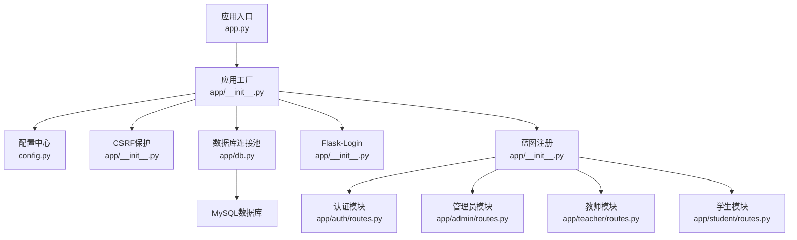
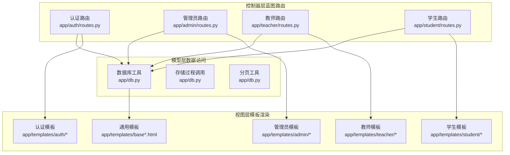
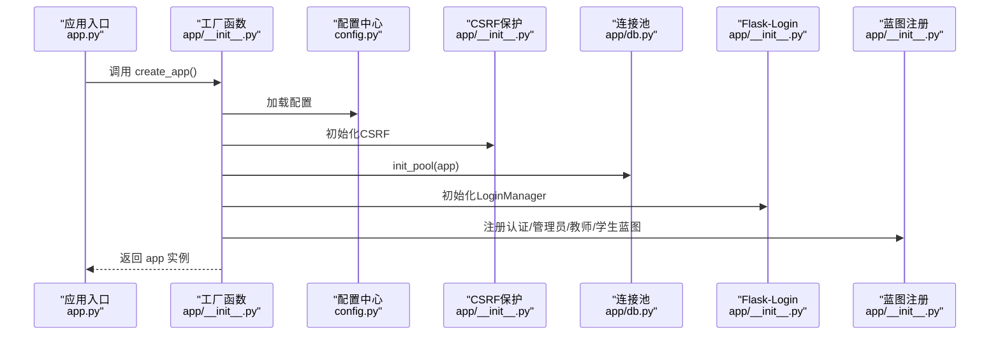
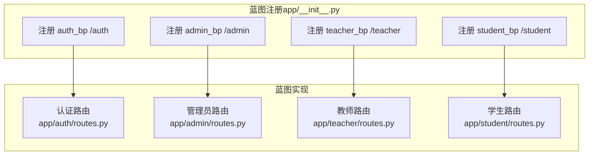
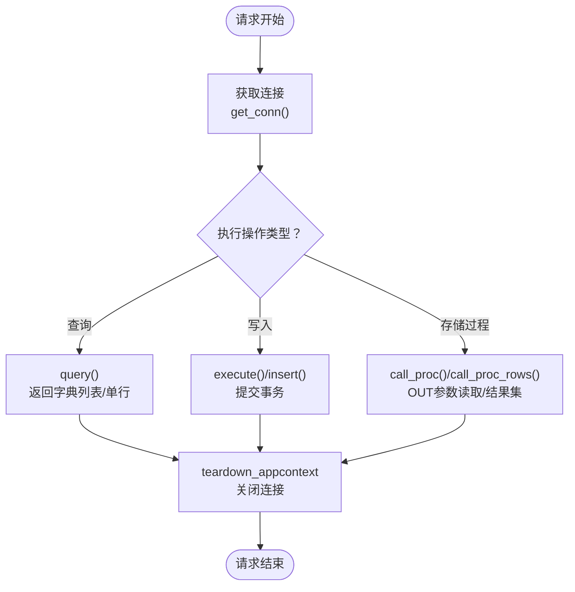
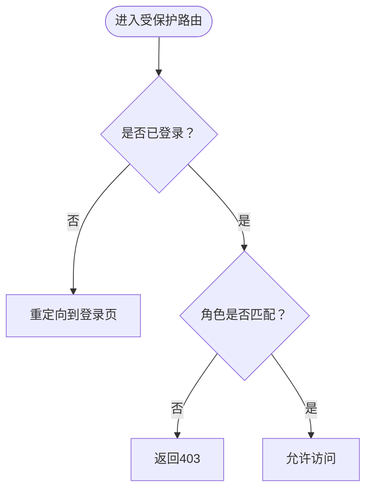
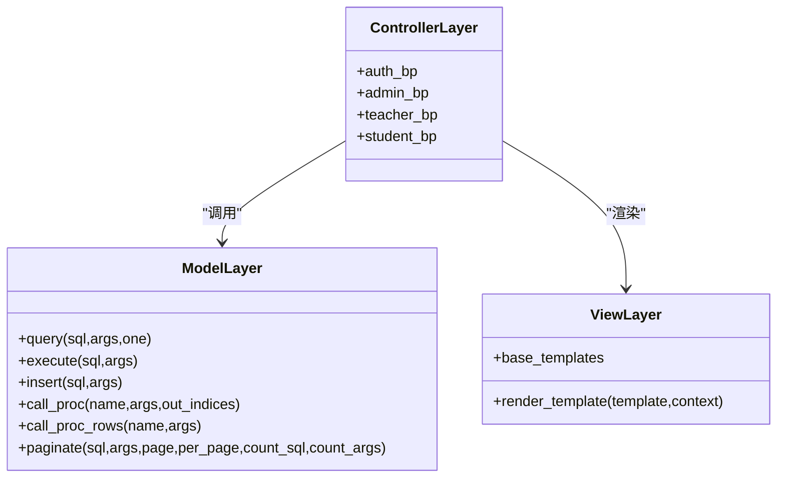
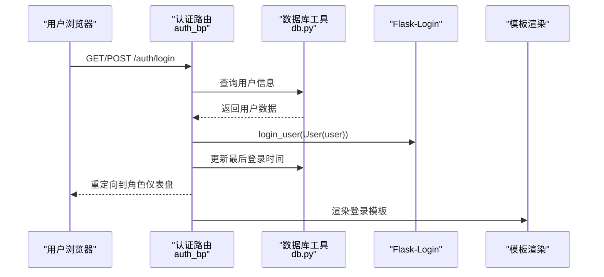
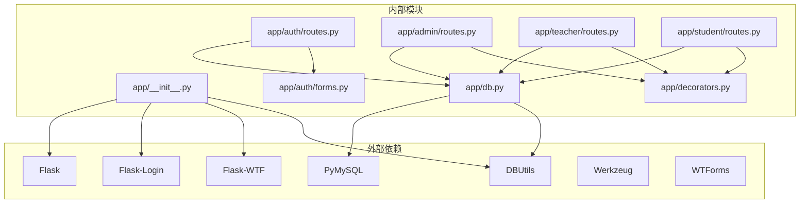

# 应用架构

<cite>
**本文引用的文件**
- [app.py](file://app.py)
- [app/__init__.py](file://app/__init__.py)
- [config.py](file://config.py)
- [requirements.txt](file://requirements.txt)
- [README.md](file://README.md)
- [app/db.py](file://app/db.py)
- [app/decorators.py](file://app/decorators.py)
- [app/auth/routes.py](file://app/auth/routes.py)
- [app/admin/routes.py](file://app/admin/routes.py)
- [app/student/routes.py](file://app/student/routes.py)
- [app/teacher/routes.py](file://app/teacher/routes.py)
- [app/auth/forms.py](file://app/auth/forms.py)
- [sql/01_schema.sql](file://sql/01_schema.sql)
</cite>

## 目录
1. [简介](#简介)
2. [项目结构](#项目结构)
3. [核心组件](#核心组件)
4. [架构总览](#架构总览)
5. [详细组件分析](#详细组件分析)
6. [依赖分析](#依赖分析)
7. [性能考虑](#性能考虑)
8. [故障排查指南](#故障排查指南)
9. [结论](#结论)
10. [附录](#附录)

## 简介
本项目是一个基于 Flask 的学生信息管理系统（MIS），采用工厂模式创建应用实例，通过蓝图（Blueprint）模块化组织认证、管理员、教师、学生四个功能域。系统使用 PyMySQL + DBUtils 实现连接池管理，配合 Flask-Login 提供会话与权限控制，结合 WTForms 表单校验与 CSRF 保护，形成完整的 MVC 架构：模型层负责数据访问与存储过程调用，视图层负责模板渲染，控制器层由蓝图路由处理请求与响应。

## 项目结构
项目采用“应用工厂 + 模块化蓝图”的组织方式：
- 应用入口与工厂：app.py 创建应用实例；app/__init__.py 实现 create_app 工厂函数，集中初始化 CSRF、数据库连接池、Flask-Login、蓝图注册与错误处理。
- 配置中心：config.py 统一管理数据库连接参数、连接池参数、分页参数与业务权重阈值。
- 数据访问层：app/db.py 封装连接池、连接获取/关闭、查询/写入/存储过程调用、分页工具。
- 权限控制：app/decorators.py 提供登录与角色校验装饰器。
- 功能模块：app/auth/、app/admin/、app/teacher/、app/student/ 分别实现认证、管理、教师、学生功能的蓝图路由。
- 表单与模板：app/auth/forms.py 定义认证相关表单；templates 下按模块存放页面模板。
- 数据库脚本：sql/01_schema.sql 等脚本定义 12 张核心表与约束、索引、外键关系。

图表来源
- [app.py:1-13](file://app.py#L1-L13)
- [app/__init__.py:29-92](file://app/__init__.py#L29-L92)
- [config.py:6-36](file://config.py#L6-L36)
- [app/db.py:10-121](file://app/db.py#L10-L121)
- [app/auth/routes.py:29](file://app/auth/routes.py#L29)
- [app/admin/routes.py:10](file://app/admin/routes.py#L10)
- [app/teacher/routes.py:7](file://app/teacher/routes.py#L7)
- [app/student/routes.py:7](file://app/student/routes.py#L7)

章节来源
- [app.py:1-13](file://app.py#L1-L13)
- [app/__init__.py:29-92](file://app/__init__.py#L29-L92)
- [config.py:6-36](file://config.py#L6-L36)
- [README.md:46-69](file://README.md#L46-L69)

## 核心组件
- 应用工厂 create_app：集中初始化配置、CSRF、数据库连接池、Flask-Login、蓝图注册与错误处理。
- 数据库连接池：DBUtils PooledDB 提供最小缓存、最大缓存与最大连接数限制，支持自动提交控制与 Dict 游标。
- 权限装饰器：login_required 与 role_required，统一登录与角色校验。
- 蓝图模块：认证、管理员、教师、学生四大模块，每个模块独立路由与模板。
- 错误处理：统一 403/404/500 页面渲染。
- 配置中心：集中管理数据库连接、连接池、分页、业务权重与预警阈值。

章节来源
- [app/__init__.py:29-92](file://app/__init__.py#L29-L92)
- [app/db.py:10-121](file://app/db.py#L10-L121)
- [app/decorators.py:7-26](file://app/decorators.py#L7-L26)
- [config.py:6-36](file://config.py#L6-L36)

## 架构总览
系统遵循 MVC 架构：
- 模型层：app/db.py 封装数据库访问，提供 query/execute/insert/call_proc/paginate 等方法，支持存储过程调用与 OUT 参数读取。
- 视图层：Jinja2 模板位于 app/templates 下，各模块模板按功能划分。
- 控制器层：蓝图路由处理请求，调用模型层进行数据访问，渲染模板返回响应。

图表来源
- [app/auth/routes.py:32-167](file://app/auth/routes.py#L32-L167)
- [app/admin/routes.py:42-615](file://app/admin/routes.py#L42-L615)
- [app/teacher/routes.py:50-271](file://app/teacher/routes.py#L50-L271)
- [app/student/routes.py:34-218](file://app/student/routes.py#L34-L218)
- [app/db.py:43-121](file://app/db.py#L43-L121)

## 详细组件分析

### 工厂模式与应用创建流程
- 应用入口 app.py 通过 create_app() 创建 Flask 应用实例。
- 工厂函数 app/__init__.py 完成：
  - 加载配置 Config。
  - 初始化 CSRFProtect。
  - 初始化数据库连接池并注册 teardown_appcontext 关闭连接。
  - 初始化 Flask-Login，设置登录视图、消息类别与用户加载器。
  - 注册认证、管理员、教师、学生蓝图，设置 URL 前缀。
  - 注册首页路由与错误处理器。

图表来源
- [app.py:5-12](file://app.py#L5-L12)
- [app/__init__.py:29-92](file://app/__init__.py#L29-L92)
- [config.py:6-36](file://config.py#L6-L36)
- [app/db.py:10-26](file://app/db.py#L10-L26)

章节来源
- [app.py:1-13](file://app.py#L1-L13)
- [app/__init__.py:29-92](file://app/__init__.py#L29-L92)

### 蓝图（Blueprint）模式实现
- 认证模块：app/auth/routes.py 定义登录、注册、登出、个人资料等路由，使用蓝图 auth_bp。
- 管理员模块：app/admin/routes.py 定义仪表盘、学期/专业/班级/课程管理、学生/教师管理、开课审核、选课时间配置、成绩审核、系统日志、统计分析、学业预警等功能，使用蓝图 admin_bp。
- 教师模块：app/teacher/routes.py 定义开课申请、我的开课、开课学生列表、成绩录入/提交、统计分析等，使用蓝图 teacher_bp。
- 学生模块：app/student/routes.py 定义课程列表、选课/退课、课表、成绩、成绩单等，使用蓝图 student_bp。
- 共同点：每个模块均在 app/__init__.py 中注册蓝图并设置 url_prefix，实现清晰的功能边界与 URL 命名空间隔离。

图表来源
- [app/__init__.py:54-64](file://app/__init__.py#L54-L64)
- [app/auth/routes.py:29](file://app/auth/routes.py#L29)
- [app/admin/routes.py:10](file://app/admin/routes.py#L10)
- [app/teacher/routes.py:7](file://app/teacher/routes.py#L7)
- [app/student/routes.py:7](file://app/student/routes.py#L7)

章节来源
- [app/__init__.py:54-64](file://app/__init__.py#L54-L64)
- [app/auth/routes.py:29](file://app/auth/routes.py#L29)
- [app/admin/routes.py:10](file://app/admin/routes.py#L10)
- [app/teacher/routes.py:7](file://app/teacher/routes.py#L7)
- [app/student/routes.py:7](file://app/student/routes.py#L7)

### 数据库连接池管理机制（DBUtils）
- 初始化：app/db.py 的 init_pool 使用 DBUtils.PooledDB，根据 config.py 中的 DB_* 配置创建连接池，设置最小缓存、最大缓存、最大连接数、字符集与游标类型。
- 连接生命周期：get_conn 在 Flask g 上缓存连接，teardown_appcontext 在请求结束时关闭连接，避免连接泄漏。
- 查询与写入：query 支持单行/多行返回；execute/insert 提交事务；call_proc/call_proc_rows 调用存储过程并处理 OUT 参数与结果集。
- 分页：paginate 自动计算总数、页数与偏移，支持自定义 count_sql 或自动包装 COUNT(*)。

图表来源
- [app/db.py:10-121](file://app/db.py#L10-L121)
- [config.py:11-22](file://config.py#L11-L22)

章节来源
- [app/db.py:10-121](file://app/db.py#L10-L121)
- [config.py:11-22](file://config.py#L11-L22)

### 权限控制装饰器设计与实现
- 登录装饰器：login_required 直接委托给 Flask-Login 的 login_required。
- 角色装饰器：role_required 接受期望角色，若当前用户未登录则重定向至登录页，否则检查用户角色，不匹配则返回 403。
- 使用场景：管理员模块与各模块的 before_request 中统一使用 @login_required 与 @role_required('admin'|'teacher'|'student')，确保访问控制。

图表来源
- [app/decorators.py:7-26](file://app/decorators.py#L7-L26)
- [app/admin/routes.py:13-17](file://app/admin/routes.py#L13-L17)
- [app/teacher/routes.py:10-14](file://app/teacher/routes.py#L10-L14)
- [app/student/routes.py:10-14](file://app/student/routes.py#L10-L14)

章节来源
- [app/decorators.py:7-26](file://app/decorators.py#L7-L26)
- [app/admin/routes.py:13-17](file://app/admin/routes.py#L13-L17)
- [app/teacher/routes.py:10-14](file://app/teacher/routes.py#L10-L14)
- [app/student/routes.py:10-14](file://app/student/routes.py#L10-L14)

### MVC 架构在项目中的应用
- 模型层（Model）：app/db.py 提供统一的数据访问接口，封装查询、写入、存储过程调用与分页逻辑，屏蔽底层数据库细节。
- 视图层（View）：Jinja2 模板位于 app/templates 下，按模块组织，通用布局模板位于 base.html 与 base_simple.html。
- 控制器层（Controller）：蓝图路由处理请求参数、调用模型层、渲染模板并返回响应；认证模块使用 WTForms 表单进行输入校验。

图表来源
- [app/db.py:43-121](file://app/db.py#L43-L121)
- [app/auth/routes.py:32-167](file://app/auth/routes.py#L32-L167)
- [app/admin/routes.py:42-615](file://app/admin/routes.py#L42-L615)
- [app/teacher/routes.py:50-271](file://app/teacher/routes.py#L50-L271)
- [app/student/routes.py:34-218](file://app/student/routes.py#L34-L218)

章节来源
- [app/db.py:43-121](file://app/db.py#L43-L121)
- [app/auth/routes.py:32-167](file://app/auth/routes.py#L32-L167)
- [app/admin/routes.py:42-615](file://app/admin/routes.py#L42-L615)
- [app/teacher/routes.py:50-271](file://app/teacher/routes.py#L50-L271)
- [app/student/routes.py:34-218](file://app/student/routes.py#L34-L218)

### 组件交互与数据流（以登录为例）
- 用户请求 /auth/login，路由处理登录表单提交。
- 校验用户名与密码哈希，成功后使用 Flask-Login 登录用户并更新最后登录时间。
- 根据用户角色重定向到对应模块的仪表盘。
- 模板渲染登录页面，表单使用 WTForms 进行字段与规则校验。

图表来源
- [app/auth/routes.py:32-55](file://app/auth/routes.py#L32-L55)
- [app/db.py:43-51](file://app/db.py#L43-L51)
- [app/__init__.py:47-51](file://app/__init__.py#L47-L51)

章节来源
- [app/auth/routes.py:32-55](file://app/auth/routes.py#L32-L55)
- [app/db.py:43-51](file://app/db.py#L43-L51)
- [app/__init__.py:47-51](file://app/__init__.py#L47-L51)

## 依赖分析
- 外部依赖：Flask、Flask-Login、Flask-WTF、PyMySQL、DBUtils、Werkzeug、WTForms。
- 内部依赖：app/__init__.py 依赖 config.py、app/db.py；各模块蓝图依赖 app/db.py 与 app/decorators.py；认证模块依赖 app/auth/forms.py。

图表来源
- [requirements.txt:1-8](file://requirements.txt#L1-L8)
- [app/__init__.py:2-6](file://app/__init__.py#L2-L6)
- [app/db.py:2-4](file://app/db.py#L2-L4)
- [app/decorators.py:2-4](file://app/decorators.py#L2-L4)
- [app/auth/forms.py:2-3](file://app/auth/forms.py#L2-L3)
- [app/auth/routes.py:8](file://app/auth/routes.py#L8)
- [app/admin/routes.py:7](file://app/admin/routes.py#L7)
- [app/teacher/routes.py:5](file://app/teacher/routes.py#L5)
- [app/student/routes.py:5](file://app/student/routes.py#L5)

章节来源
- [requirements.txt:1-8](file://requirements.txt#L1-L8)
- [app/__init__.py:2-6](file://app/__init__.py#L2-L6)
- [app/db.py:2-4](file://app/db.py#L2-L4)
- [app/decorators.py:2-4](file://app/decorators.py#L2-L4)
- [app/auth/forms.py:2-3](file://app/auth/forms.py#L2-L3)
- [app/auth/routes.py:8](file://app/auth/routes.py#L8)
- [app/admin/routes.py:7](file://app/admin/routes.py#L7)
- [app/teacher/routes.py:5](file://app/teacher/routes.py#L5)
- [app/student/routes.py:5](file://app/student/routes.py#L5)

## 性能考虑
- 连接池参数：DB_POOL_MIN_CACHED、DB_POOL_MAX_CACHED、DB_POOL_MAX_CONNECTIONS 控制连接复用与并发能力，建议根据实际负载调整。
- 自动提交：DBUtils 默认 autocommit=False，需在事务内显式 commit，避免长事务占用连接。
- 分页优化：paginate 自动 COUNT 与 LIMIT/OFFSET，复杂查询建议提供 count_sql 以减少二次 COUNT。
- 存储过程：call_proc/call_proc_rows 减少往返次数，提升批量操作性能。
- 模板渲染：尽量避免在模板中做复杂计算，将数据预处理在控制器层完成。

## 故障排查指南
- 登录失败：检查用户名是否存在且 is_active=1，密码哈希比对是否正确。
- 权限不足：确认用户角色与目标路由所需角色一致，检查装饰器使用是否正确。
- 数据库连接异常：确认 DBUtils 连接池参数合理，teardown_appcontext 是否正常关闭连接。
- 存储过程调用：核对 OUT 参数索引列表与存储过程定义一致，注意异常捕获与提示。
- 错误页面：403/404/500 页面由 app/__init__.py 注册，可检查模板是否存在与路径正确。

章节来源
- [app/__init__.py:77-90](file://app/__init__.py#L77-L90)
- [app/auth/routes.py:38-54](file://app/auth/routes.py#L38-L54)
- [app/admin/routes.py:13-17](file://app/admin/routes.py#L13-L17)
- [app/teacher/routes.py:10-14](file://app/teacher/routes.py#L10-L14)
- [app/student/routes.py:10-14](file://app/student/routes.py#L10-L14)

## 结论
本项目通过工厂模式与蓝图模块化实现了清晰的职责分离，DBUtils 连接池提供了稳定的数据库访问能力，Flask-Login 与自定义装饰器保障了权限控制，MVC 架构使模型、视图、控制器职责明确。整体设计具备良好的扩展性与可维护性，适合在教学与实践场景中推广使用。

## 附录
- 数据库表结构概览：users、majors、classes、students、teachers、semesters、courses、course_offerings、enrollments、grades 等 12 张核心表，涵盖完整的约束、索引与外键关系。
- 业务流程：管理员录入基础信息 → 教师申请开课 → 管理员审核发布 → 配置选课时间窗口 → 学生选课/退课 → 教师录入成绩 → 管理员审核发布 → 学生查看成绩 → 管理员查看学业预警/GPA 下滑预测。

章节来源
- [sql/01_schema.sql:14-198](file://sql/01_schema.sql#L14-L198)
- [README.md:79-86](file://README.md#L79-L86)