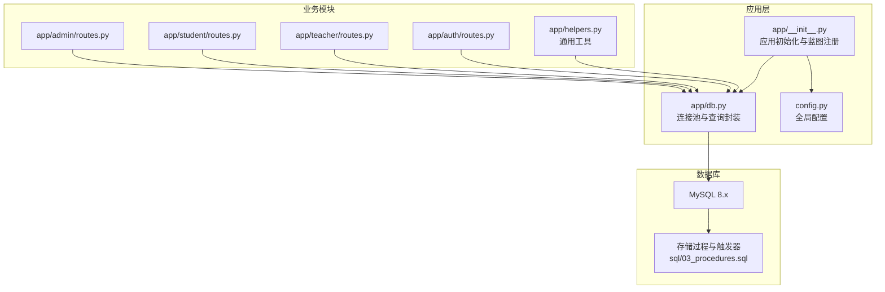
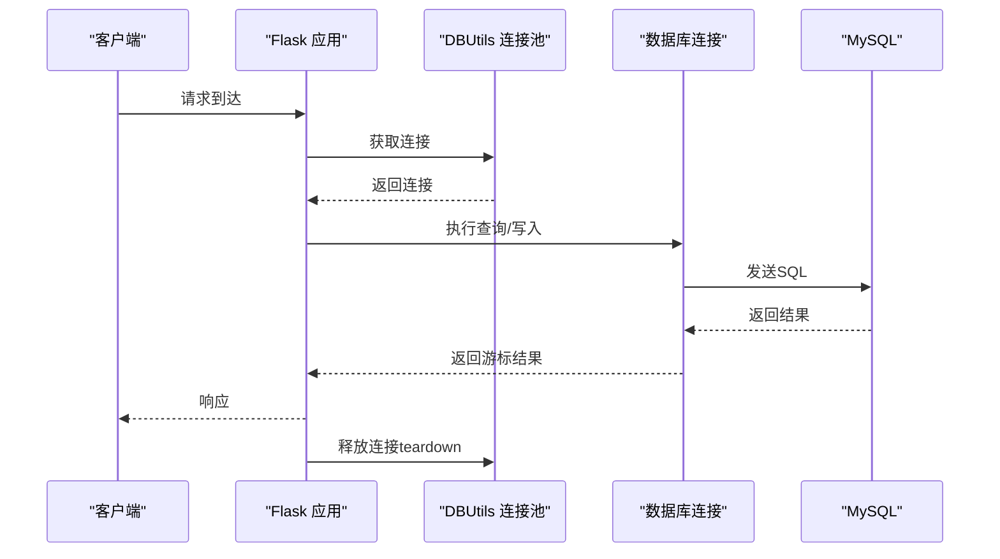
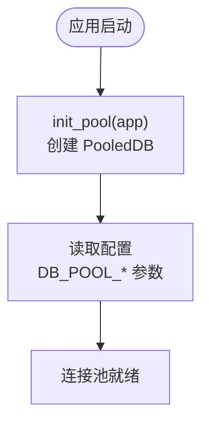
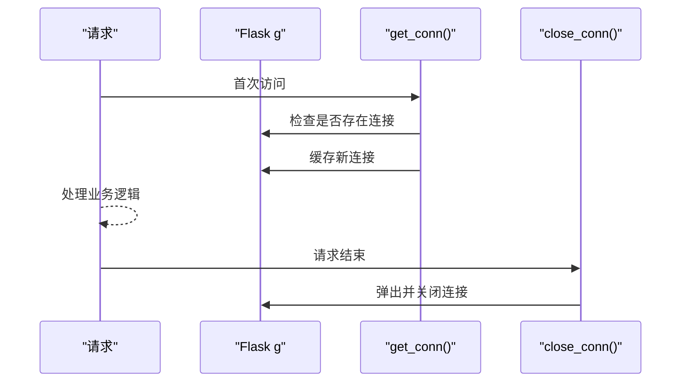
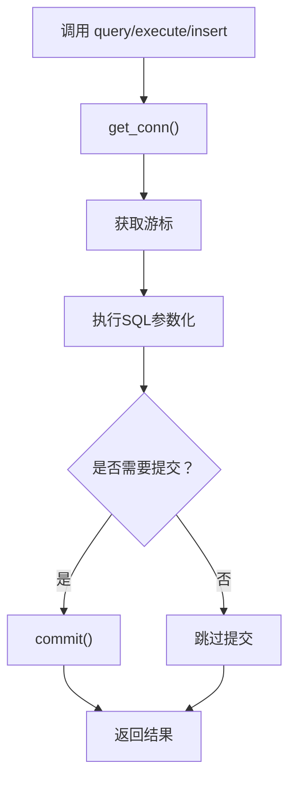
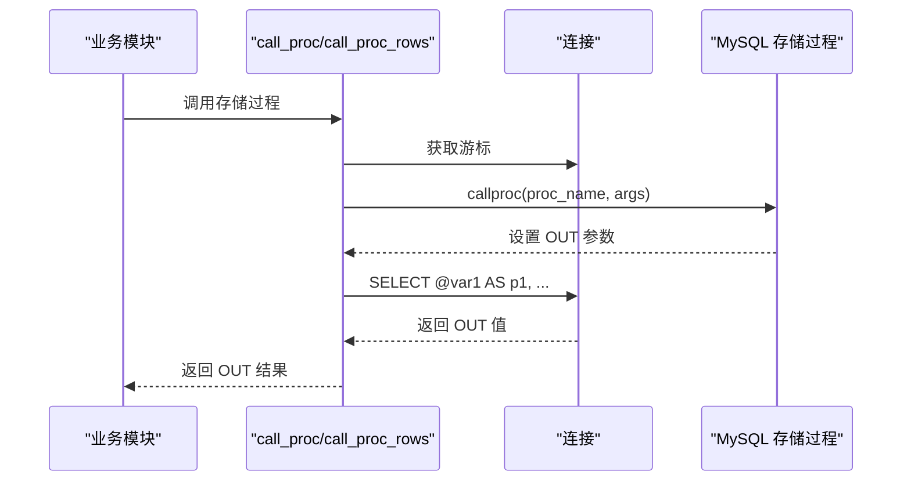
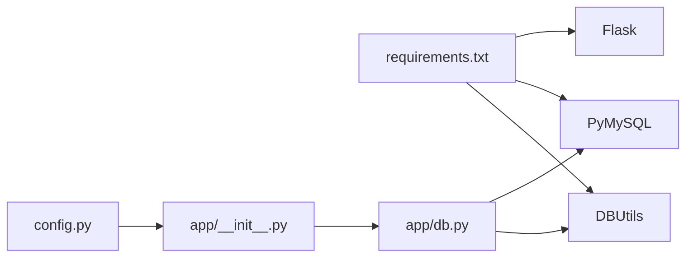

# 数据库连接池管理

<cite>
**本文档引用的文件**
- [app/db.py](file://app/db.py)
- [config.py](file://config.py)
- [app/__init__.py](file://app/__init__.py)
- [requirements.txt](file://requirements.txt)
- [sql/03_procedures.sql](file://sql/03_procedures.sql)
- [app/admin/routes.py](file://app/admin/routes.py)
- [app/student/routes.py](file://app/student/routes.py)
- [app/teacher/routes.py](file://app/teacher/routes.py)
- [app/auth/routes.py](file://app/auth/routes.py)
- [app/helpers.py](file://app/helpers.py)
- [README.md](file://README.md)
</cite>

## 目录
1. [引言](#引言)
2. [项目结构](#项目结构)
3. [核心组件](#核心组件)
4. [架构概览](#架构概览)
5. [详细组件分析](#详细组件分析)
6. [依赖分析](#依赖分析)
7. [性能考虑](#性能考虑)
8. [故障排查指南](#故障排查指南)
9. [结论](#结论)
10. [附录](#附录)

## 引言
本文件围绕数据库连接池管理进行深入技术文档编写，重点解释基于 DBUtils 的连接池实现、配置参数、连接生命周期管理、SQL 查询封装、存储过程调用、性能监控与故障处理策略，并给出最佳实践与优化建议。文档同时结合实际代码路径，确保读者能够将理论与实现对应起来。

## 项目结构
该项目采用 Flask 应用结构，数据库连接池位于 app/db.py，全局配置位于 config.py，应用初始化在 app/__init__.py 中完成。各业务模块（admin、student、teacher、auth）通过统一的数据库接口访问数据库。

**图表来源**
- [app/__init__.py:29-93](file://app/__init__.py#L29-L93)
- [app/db.py:10-121](file://app/db.py#L10-L121)
- [config.py:6-36](file://config.py#L6-L36)
- [sql/03_procedures.sql:1-381](file://sql/03_procedures.sql#L1-L381)

**章节来源**
- [app/__init__.py:29-93](file://app/__init__.py#L29-L93)
- [app/db.py:10-121](file://app/db.py#L10-L121)
- [config.py:6-36](file://config.py#L6-L36)
- [README.md:46-87](file://README.md#L46-L87)

## 核心组件
- 连接池初始化与配置：通过 DBUtils 的 PooledDB 创建连接池，支持最小缓存、最大缓存、最大连接数等参数。
- 连接获取与释放：使用 Flask g 对象在请求上下文中缓存连接，应用关闭时自动释放。
- 查询封装：提供 query、execute、insert、paginate 等常用方法，统一参数化查询。
- 存储过程调用：封装 call_proc 与 call_proc_rows，支持 OUT 参数读取与结果集返回。
- 分页查询：自动统计总数并生成分页数据结构。

**章节来源**
- [app/db.py:10-121](file://app/db.py#L10-L121)
- [config.py:19-25](file://config.py#L19-L25)

## 架构概览
连接池在应用启动时初始化，绑定到 Flask 应用上下文，在每个请求中通过 g 缓存连接，请求结束时由 teardown_appcontext 回调释放连接。业务模块通过统一的数据库接口访问数据库，支持同步事务与存储过程调用。

**图表来源**
- [app/__init__.py:35-38](file://app/__init__.py#L35-L38)
- [app/db.py:29-41](file://app/db.py#L29-L41)

**章节来源**
- [app/__init__.py:35-38](file://app/__init__.py#L35-L38)
- [app/db.py:29-41](file://app/db.py#L29-L41)

## 详细组件分析

### 连接池初始化与配置
- 初始化位置：应用启动时调用 init_pool(app)，创建 PooledDB 实例。
- 关键配置项：
  - DB_POOL_MIN_CACHED：最小缓存连接数
  - DB_POOL_MAX_CACHED：最大空闲缓存连接数
  - DB_POOL_MAX_CONNECTIONS：连接池最大连接数
- 连接属性：使用 DictCursor 返回字典结果，autocommit=False，需手动 commit。

**图表来源**
- [app/db.py:10-26](file://app/db.py#L10-L26)
- [config.py:19-22](file://config.py#L19-L22)

**章节来源**
- [app/db.py:10-26](file://app/db.py#L10-L26)
- [config.py:19-22](file://config.py#L19-L22)

### 连接获取与释放流程
- 获取连接：get_conn() 在 Flask g 中缓存连接，避免重复创建。
- 释放连接：close_conn() 在 teardown_appcontext 钩子中被调用，确保连接归还池中并关闭。

**图表来源**
- [app/db.py:29-41](file://app/db.py#L29-L41)
- [app/__init__.py:35-38](file://app/__init__.py#L35-L38)

**章节来源**
- [app/db.py:29-41](file://app/db.py#L29-L41)
- [app/__init__.py:35-38](file://app/__init__.py#L35-L38)

### SQL 查询封装设计
- query(sql, args=None, one=False)：执行查询，支持单行或全部行返回。
- execute(sql, args=None)：执行写操作，返回影响行数并自动 commit。
- insert(sql, args=None)：执行插入并返回 lastrowid。
- paginate(sql, args=None, page=1, per_page=None, count_sql=None, count_args=None)：分页查询，返回 items、total、pages、page、per_page 结构。

**图表来源**
- [app/db.py:43-89](file://app/db.py#L43-L89)
- [app/db.py:92-121](file://app/db.py#L92-L121)

**章节来源**
- [app/db.py:43-89](file://app/db.py#L43-L89)
- [app/db.py:92-121](file://app/db.py#L92-L121)

### 存储过程调用实现
- call_proc(proc_name, args, out_indices)：调用带 OUT 参数的存储过程，通过 SELECT 读取 OUT 变量。
- call_proc_rows(proc_name, args=())：调用返回结果集的存储过程。
- 业务模块示例：管理员审核、学生选课/退课、教师成绩录入等均通过上述封装调用存储过程。

**图表来源**
- [app/db.py:62-80](file://app/db.py#L62-L80)
- [app/admin/routes.py:390-398](file://app/admin/routes.py#L390-L398)
- [app/student/routes.py:139-146](file://app/student/routes.py#L139-L146)

**章节来源**
- [app/db.py:62-80](file://app/db.py#L62-L80)
- [app/admin/routes.py:390-398](file://app/admin/routes.py#L390-L398)
- [app/student/routes.py:139-146](file://app/student/routes.py#L139-L146)

### 分页查询与统计
- 自动统计总数：若未提供 count_sql，则自动包装 SQL 为 COUNT(*) 查询。
- 限制与偏移：根据 per_page 与 page 计算 LIMIT 与 OFFSET。
- 返回结构：包含 items、total、pages、page、per_page 字段，便于前端渲染。

**章节来源**
- [app/db.py:92-121](file://app/db.py#L92-L121)

### 连接池参数详解
- 最小缓存连接（mincached）：保持的空闲连接数量，降低首次请求延迟。
- 最大缓存连接（maxcached）：空闲连接上限，防止过度占用内存。
- 最大连接数（maxconnections）：连接池总容量，超过将阻塞或抛出异常。
- 字符集与游标类型：使用 utf8mb4 与 DictCursor 提升兼容性与易用性。
- 自动提交：autocommit=False，需显式 commit，保证事务一致性。

**章节来源**
- [app/db.py:13-26](file://app/db.py#L13-L26)
- [config.py:19-22](file://config.py#L19-L22)

## 依赖分析
- 运行时依赖：Flask、PyMySQL、DBUtils、Werkzeug、WTForms 等。
- 连接池依赖：DBUtils.PooledDB 作为连接池实现，PyMySQL 作为驱动。
- 配置依赖：config.py 提供数据库连接与连接池参数，app/__init__.py 在应用初始化时读取并创建连接池。

**图表来源**
- [requirements.txt:1-8](file://requirements.txt#L1-L8)
- [app/db.py:2-4](file://app/db.py#L2-L4)
- [app/__init__.py:30-38](file://app/__init__.py#L30-L38)
- [config.py:6-36](file://config.py#L6-L36)

**章节来源**
- [requirements.txt:1-8](file://requirements.txt#L1-L8)
- [app/db.py:2-4](file://app/db.py#L2-L4)
- [app/__init__.py:30-38](file://app/__init__.py#L30-L38)
- [config.py:6-36](file://config.py#L6-L36)

## 性能考虑
- 连接池大小：根据并发请求峰值与数据库承载能力调整 DB_POOL_MAX_CONNECTIONS，避免过高导致数据库压力过大或过低导致排队。
- 连接复用：通过 Flask g 缓存连接减少连接创建与销毁开销。
- 事务控制：默认 autocommit=False，确保写操作的原子性与一致性，避免长事务占用连接。
- SQL 参数化：所有查询均使用参数化，有效防止 SQL 注入，提升安全性与可维护性。
- 分页优化：合理设置 per_page，避免一次性加载大量数据；count_sql 可自定义以优化统计性能。
- 存储过程：将复杂业务逻辑下沉到数据库端，减少网络往返与应用层处理开销。

[本节为通用性能指导，不直接分析特定文件]

## 故障排查指南
- 连接泄漏检测：确认 teardown_appcontext 是否正确注册 close_conn，确保每次请求结束后连接被释放。
- 事务未提交：检查 execute/insert 是否遗漏 commit，或在异常分支中确保提交/回滚。
- 存储过程 OUT 参数：确保 call_proc 的 out_indices 与存储过程定义一致，SELECT 语句与变量命名匹配。
- 超时与阻塞：观察 maxconnections 是否过小导致请求阻塞，必要时增大连接池容量或优化 SQL。
- 日志与审计：通过 helpers.log_action 或业务模块的日志插入，定位问题发生点。

**章节来源**
- [app/__init__.py:35-38](file://app/__init__.py#L35-L38)
- [app/db.py:55-59](file://app/db.py#L55-L59)
- [app/db.py:62-80](file://app/db.py#L62-L80)
- [app/helpers.py:9-21](file://app/helpers.py#L9-L21)

## 结论
本项目通过 DBUtils 连接池实现了高效、安全、可控的数据库访问层。统一的查询封装与存储过程调用简化了业务开发，配合合理的连接池参数与事务管理，能够在高并发场景下保持稳定性能。建议在生产环境中持续监控连接池利用率、慢查询与异常情况，结合业务特点动态调整连接池参数与 SQL 设计。

[本节为总结性内容，不直接分析特定文件]

## 附录

### 配置参数一览
- 数据库连接参数：DB_HOST、DB_PORT、DB_USER、DB_PASSWORD、DB_NAME、DB_CHARSET
- 连接池参数：DB_POOL_MIN_CACHED、DB_POOL_MAX_CACHED、DB_POOL_MAX_CONNECTIONS
- 分页参数：PER_PAGE

**章节来源**
- [config.py:11-25](file://config.py#L11-L25)

### 存储过程清单与用途
- sp_enroll_course：学生选课，包含窗口检查、时间冲突检测、容量检查与事务控制
- sp_drop_course：学生退课，包含窗口检查、成绩状态检查与事务控制
- sp_calculate_total_grade：计算总评成绩与绩点
- sp_calculate_gpa：计算学期GPA与总学分
- sp_approve_course_offering：审核开课申请并记录日志
- 触发器：选课自动创建成绩、成绩更新自动计算、状态变更日志

**章节来源**
- [sql/03_procedures.sql:14-113](file://sql/03_procedures.sql#L14-L113)
- [sql/03_procedures.sql:119-194](file://sql/03_procedures.sql#L119-L194)
- [sql/03_procedures.sql:201-236](file://sql/03_procedures.sql#L201-L236)
- [sql/03_procedures.sql:242-274](file://sql/03_procedures.sql#L242-L274)
- [sql/03_procedures.sql:280-319](file://sql/03_procedures.sql#L280-L319)
- [sql/03_procedures.sql:327-378](file://sql/03_procedures.sql#L327-L378)