# 权限控制与装饰器

<cite>
**本文档引用的文件**
- [decorators.py](file://app/decorators.py)
- [__init__.py](file://app/__init__.py)
- [routes.py](file://app/admin/routes.py)
- [routes.py](file://app/teacher/routes.py)
- [routes.py](file://app/student/routes.py)
- [routes.py](file://app/auth/routes.py)
- [db.py](file://app/db.py)
- [helpers.py](file://app/helpers.py)
- [config.py](file://config.py)
- [app.py](file://app.py)
- [403.html](file://app/templates/403.html)
- [base.html](file://app/templates/base.html)
</cite>

## 目录
1. [简介](#简介)
2. [项目结构](#项目结构)
3. [核心组件](#核心组件)
4. [架构概览](#架构概览)
5. [详细组件分析](#详细组件分析)
6. [依赖关系分析](#依赖关系分析)
7. [性能考虑](#性能考虑)
8. [故障排除指南](#故障排除指南)
9. [结论](#结论)

## 简介

本项目是一个基于Flask的教务管理系统，实现了完善的权限控制与装饰器系统。系统采用基于角色的访问控制（RBAC）模型，支持管理员、教师、学生三种角色，通过装饰器机制实现细粒度的权限控制。本文档深入解析权限装饰器的设计原理、实现机制以及在实际业务场景中的应用方式。

## 项目结构

该项目采用模块化的Flask应用架构，主要包含以下核心目录和文件：

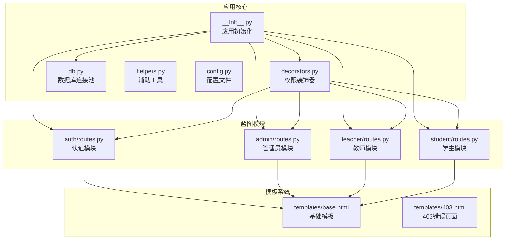

**图表来源**
- [__init__.py:1-93](file://app/__init__.py#L1-L93)
- [decorators.py:1-26](file://app/decorators.py#L1-L26)

**章节来源**
- [__init__.py:1-93](file://app/__init__.py#L1-L93)
- [app.py:1-13](file://app.py#L1-L13)

## 核心组件

### 权限装饰器系统

系统的核心是两个基础装饰器：`login_required`和`role_required`，它们共同构成了完整的权限控制体系。

#### 登录验证装饰器 (`login_required`)
- **功能**：确保用户必须登录才能访问受保护的路由
- **实现机制**：基于Flask-Login的`@login_required`装饰器
- **行为**：未登录用户会被重定向到登录页面

#### 角色验证装饰器 (`role_required`)
- **功能**：根据用户角色限制访问权限
- **实现机制**：动态装饰器工厂，支持任意角色参数
- **行为**：
  - 未登录用户：重定向到登录页面
  - 角色不匹配：返回403 Forbidden错误
  - 角色匹配：允许访问目标函数

**章节来源**
- [decorators.py:7-25](file://app/decorators.py#L7-L25)

### Flask-Login 集成

系统通过自定义的`User`类实现Flask-Login的兼容性：

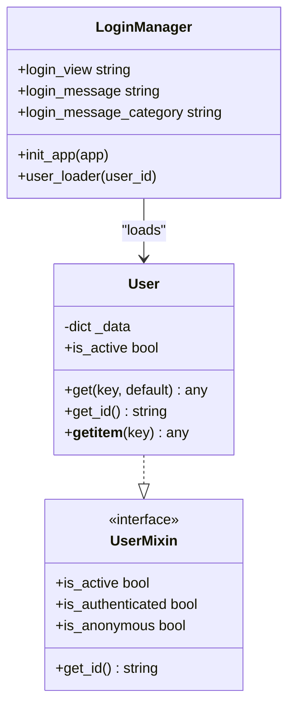

**图表来源**
- [__init__.py:10-27](file://app/__init__.py#L10-L27)
- [__init__.py:47-51](file://app/__init__.py#L47-L51)

**章节来源**
- [__init__.py:10-27](file://app/__init__.py#L10-L27)
- [__init__.py:47-51](file://app/__init__.py#L47-L51)

## 架构概览

系统采用蓝图（Blueprint）模式组织不同角色的功能模块，每个模块都有独立的路由定义和权限控制：

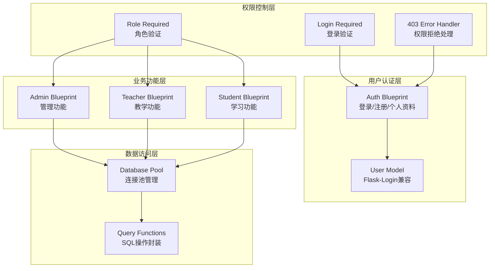

**图表来源**
- [__init__.py:29-93](file://app/__init__.py#L29-L93)
- [decorators.py:13-25](file://app/decorators.py#L13-L25)

**章节来源**
- [__init__.py:29-93](file://app/__init__.py#L29-L93)

## 详细组件分析

### 权限装饰器实现详解

#### 动态装饰器工厂模式

`role_required`装饰器采用了高级的装饰器工厂模式：

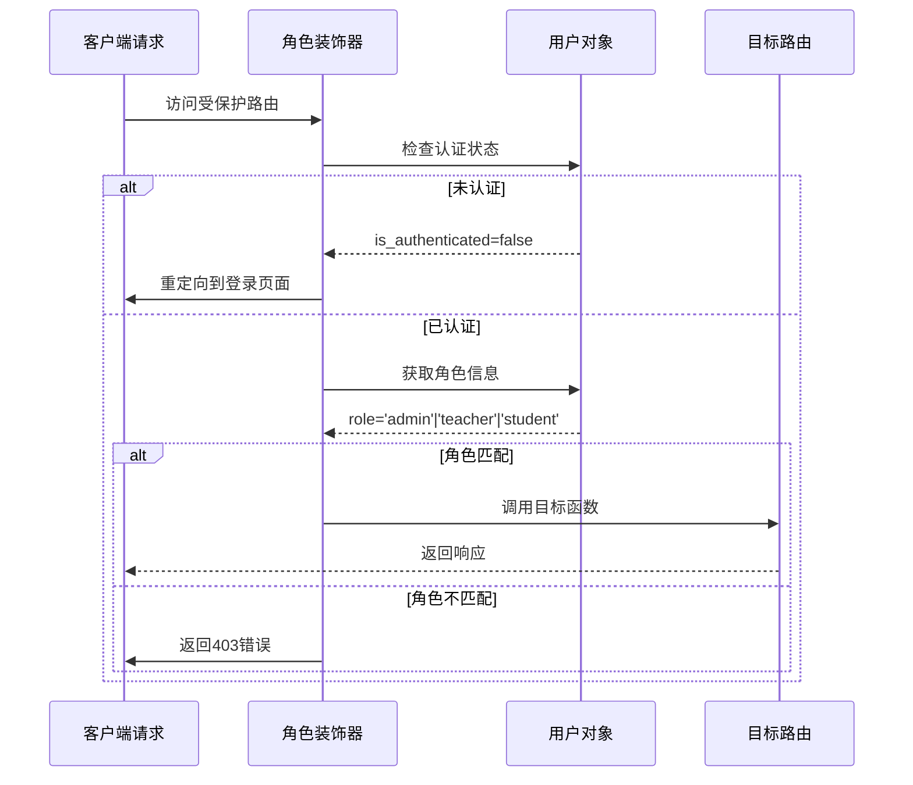

**图表来源**
- [decorators.py:13-25](file://app/decorators.py#L13-L25)

#### 蓝图前请求处理器

每个蓝图都使用`@before_request`装饰器设置全局权限检查：

```python
@admin_bp.before_request
@login_required
@role_required('admin')
def check_admin():
    pass
```

这种设计确保了：
- **统一性**：所有蓝图共享相同的权限检查逻辑
- **可维护性**：权限规则集中管理
- **可扩展性**：新增蓝图只需添加相应的装饰器链

**章节来源**
- [routes.py:14-18](file://app/admin/routes.py#L14-L18)
- [routes.py:11-15](file://app/teacher/routes.py#L11-L15)
- [routes.py:12-16](file://app/student/routes.py#L12-L16)

### 不同权限级别的定义与判断

#### 角色层次结构

系统定义了三个层级的角色权限：

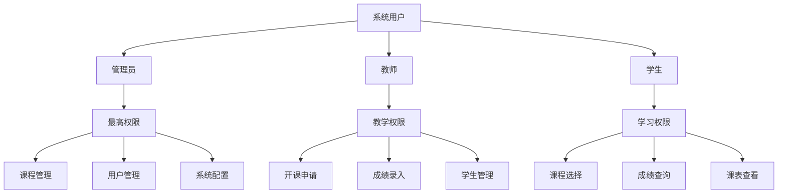

#### 权限差异对比

| 功能模块 | 管理员 | 教师 | 学生 |
|---------|--------|------|------|
| 登录验证 | ✅ | ✅ | ✅ |
| 角色验证 | ✅ | ✅ | ✅ |
| 系统管理 | ✅ | ❌ | ❌ |
| 课程管理 | ✅ | ❌ | ❌ |
| 用户管理 | ✅ | ❌ | ❌ |
| 成绩管理 | ✅ | ✅ | ❌ |
| 课程选择 | ❌ | ❌ | ✅ |
| 成绩查询 | ❌ | ❌ | ✅ |

**章节来源**
- [routes.py:43-58](file://app/admin/routes.py#L43-L58)
- [routes.py:51-65](file://app/teacher/routes.py#L51-L65)
- [routes.py:36-66](file://app/student/routes.py#L36-L66)

### 装饰器组合使用与嵌套调用机制

#### 组合装饰器链

系统支持多个装饰器的组合使用，形成装饰器链：

```python
@blueprint.before_request
@login_required
@role_required('admin')
def check_admin():
    pass
```

执行顺序遵循Python装饰器的标准行为：
1. 最接近路由函数的装饰器最先执行
2. 执行顺序：`role_required` → `login_required` → `before_request`
3. 任一环节失败都会中断后续执行

#### 嵌套调用的安全性

每个蓝图的装饰器链都独立维护，避免了跨模块的权限泄露：

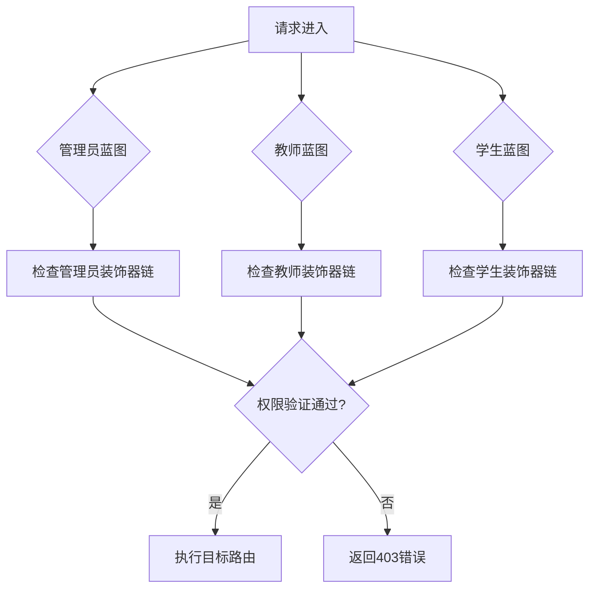

**图表来源**
- [routes.py:14-18](file://app/admin/routes.py#L14-L18)
- [routes.py:11-15](file://app/teacher/routes.py#L11-L15)
- [routes.py:12-16](file://app/student/routes.py#L12-L16)

**章节来源**
- [routes.py:14-18](file://app/admin/routes.py#L14-L18)
- [routes.py:11-15](file://app/teacher/routes.py#L11-L15)
- [routes.py:12-16](file://app/student/routes.py#L12-L16)

### 权限控制在路由中的应用

#### 路由装饰器注册流程

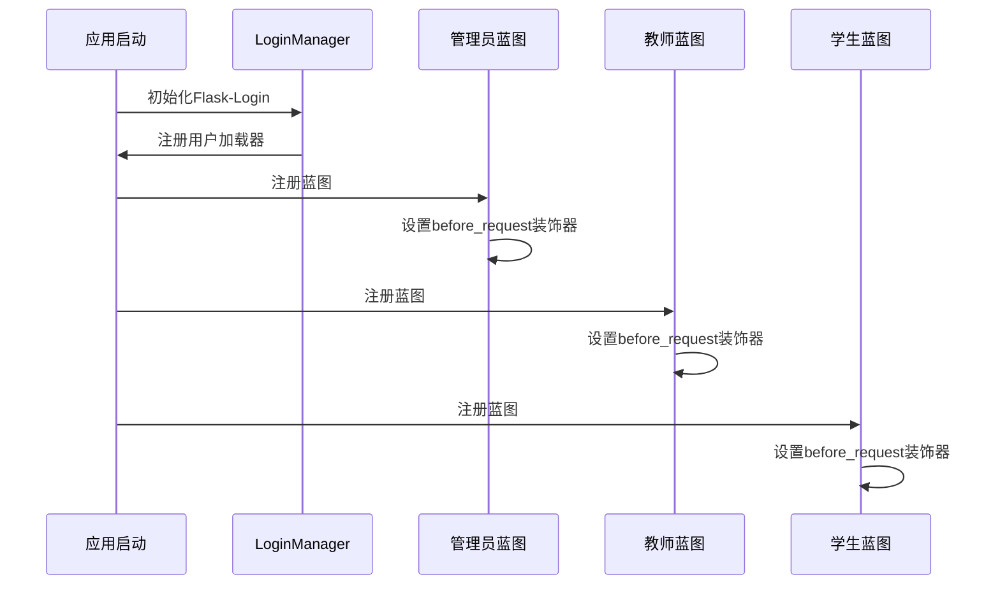

**图表来源**
- [__init__.py:53-64](file://app/__init__.py#L53-L64)
- [__init__.py:47-51](file://app/__init__.py#L47-L51)

#### 路由执行流程

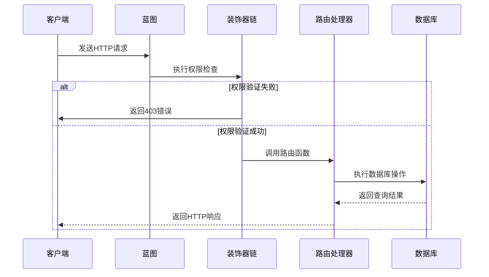

**图表来源**
- [decorators.py:13-25](file://app/decorators.py#L13-L25)
- [routes.py:43-58](file://app/admin/routes.py#L43-L58)

**章节来源**
- [__init__.py:53-64](file://app/__init__.py#L53-L64)
- [decorators.py:13-25](file://app/decorators.py#L13-L25)

### 权限系统的扩展方法

#### 自定义装饰器实现指南

要实现自定义权限装饰器，可以参考现有装饰器的模式：

```python
def permission_required(permission):
    """要求特定权限的装饰器"""
    def decorator(f):
        @wraps(f)
        def decorated_function(*args, **kwargs):
            # 检查用户是否有特定权限
            if not current_user.has_permission(permission):
                abort(403)
            return f(*args, **kwargs)
        return decorated_function
    return decorator
```

#### 复杂权限逻辑的实现

对于更复杂的权限需求，可以实现基于资源的权限控制：

```python
def resource_owner_required(resource_type):
    """要求资源拥有者的装饰器"""
    def decorator(f):
        @wraps(f)
        def decorated_function(*args, **kwargs):
            user_id = current_user.get_id()
            resource_id = kwargs.get('resource_id')
            
            # 验证用户是否是资源的所有者
            if not is_resource_owner(user_id, resource_id, resource_type):
                abort(403)
            return f(*args, **kwargs)
        return decorated_function
    return decorator
```

**章节来源**
- [decorators.py:13-25](file://app/decorators.py#L13-L25)

### Flask-Login 集成详解

#### 用户状态管理

系统通过自定义的`User`类实现Flask-Login的完整接口：

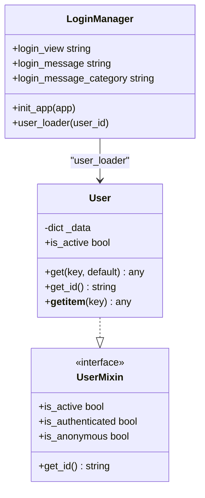

**图表来源**
- [__init__.py:10-27](file://app/__init__.py#L10-L27)
- [__init__.py:47-51](file://app/__init__.py#L47-L51)

#### 会话处理机制

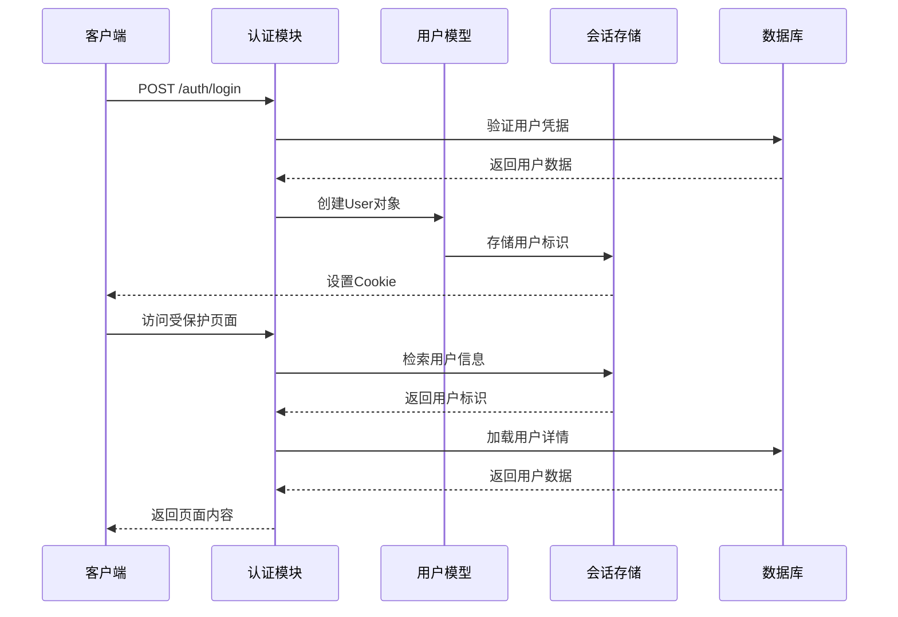

**图表来源**
- [routes.py:33-57](file://app/auth/routes.py#L33-L57)
- [__init__.py:47-51](file://app/__init__.py#L47-L51)

**章节来源**
- [routes.py:33-57](file://app/auth/routes.py#L33-L57)
- [__init__.py:47-51](file://app/__init__.py#L47-L51)

## 依赖关系分析

系统各组件之间的依赖关系如下：

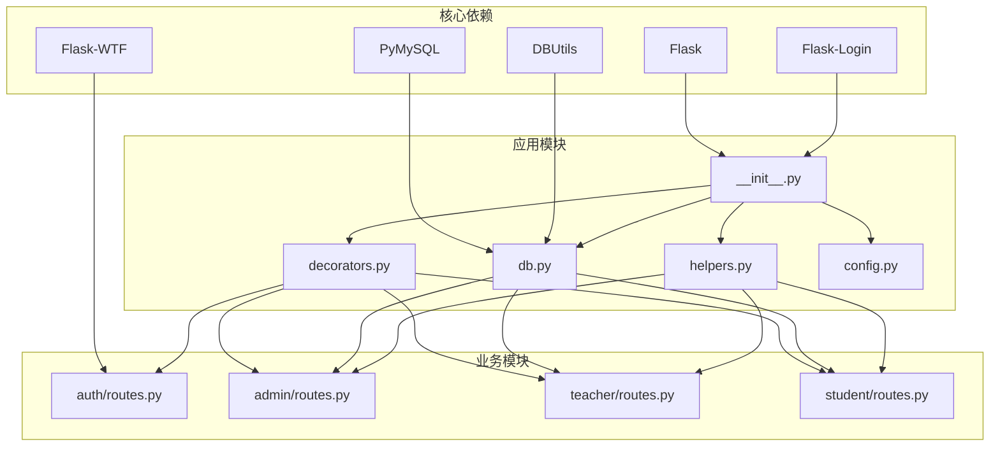

**图表来源**
- [__init__.py:2-5](file://app/__init__.py#L2-L5)
- [db.py:2-4](file://app/db.py#L2-L4)

**章节来源**
- [__init__.py:2-5](file://app/__init__.py#L2-L5)
- [db.py:2-4](file://app/db.py#L2-L4)

## 性能考虑

### 连接池优化

系统使用DBUtils实现数据库连接池，提高并发性能：

- **最小缓存连接数**：2个
- **最大缓存连接数**：10个  
- **最大连接数**：20个
- **字符集**：utf8mb4
- **自动提交**：禁用（手动控制事务）

### 缓存策略

- **用户信息缓存**：通过Flask-Login的session机制
- **数据库查询缓存**：按需实现（建议）
- **模板渲染缓存**：静态内容缓存（建议）

### 错误处理优化

- **403错误快速响应**：直接返回错误页面
- **异常捕获**：统一的异常处理机制
- **日志记录**：详细的审计日志

## 故障排除指南

### 常见权限问题

#### 403 Forbidden 错误

当用户访问无权限的页面时，系统会返回403错误：

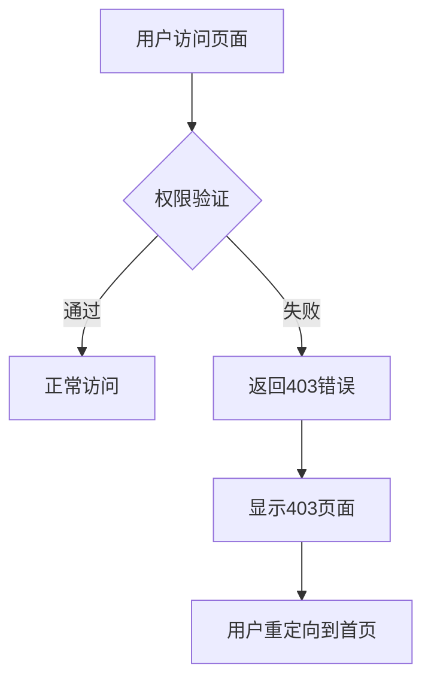

**图表来源**
- [__init__.py:77-80](file://app/__init__.py#L77-L80)
- [403.html:1-10](file://app/templates/403.html#L1-L10)

#### 登录状态异常

如果用户登录状态异常，可以通过以下步骤排查：

1. **检查会话状态**：确认Cookie是否正确设置
2. **验证用户数据**：检查数据库中的用户信息
3. **查看日志**：分析认证过程中的错误信息

**章节来源**
- [__init__.py:77-80](file://app/__init__.py#L77-L80)
- [403.html:1-10](file://app/templates/403.html#L1-L10)

### 调试技巧

#### 启用调试模式

在开发环境中启用调试模式以获取更多错误信息：

```python
# config.py
class Config:
    FLASK_DEBUG = True  # 启用调试模式
```

#### 日志记录

系统提供了完整的日志记录机制，可用于问题诊断：

```python
# helpers.py
def log_action(action, target_type=None, target_id=None, detail=None):
    """记录系统操作日志"""
    # 实现日志记录逻辑
```

**章节来源**
- [helpers.py:9-21](file://app/helpers.py#L9-L21)

## 结论

本权限控制与装饰器系统展现了现代Web应用安全架构的最佳实践。通过装饰器工厂模式、蓝图集成和Flask-Login的深度结合，系统实现了：

1. **清晰的权限层次**：管理员、教师、学生三级权限明确分离
2. **灵活的装饰器机制**：支持多种权限组合和自定义扩展
3. **高效的性能表现**：连接池和会话管理优化
4. **完善的错误处理**：统一的错误响应和日志记录

该系统为类似的教学管理系统提供了可复用的权限控制框架，具有良好的扩展性和维护性。开发者可以根据具体需求进一步增强权限控制能力，如添加基于资源的权限、动态权限分配等功能。