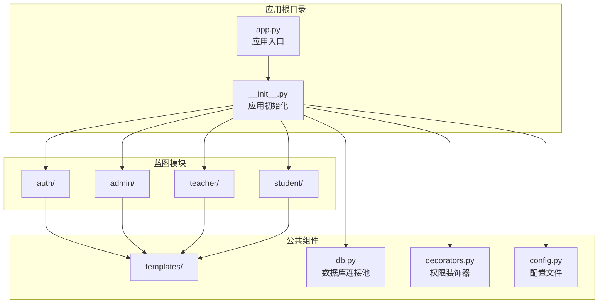
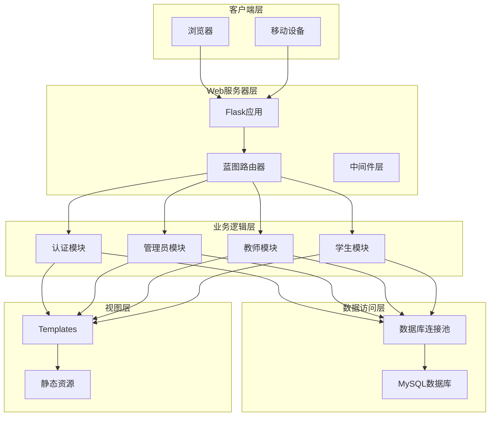
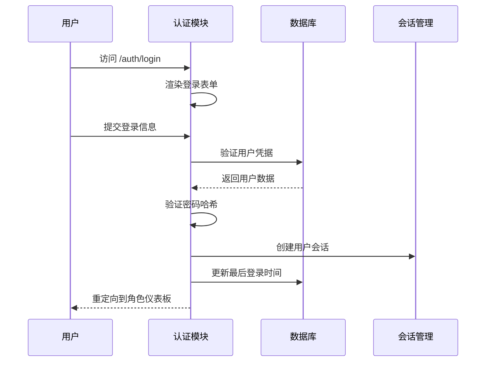
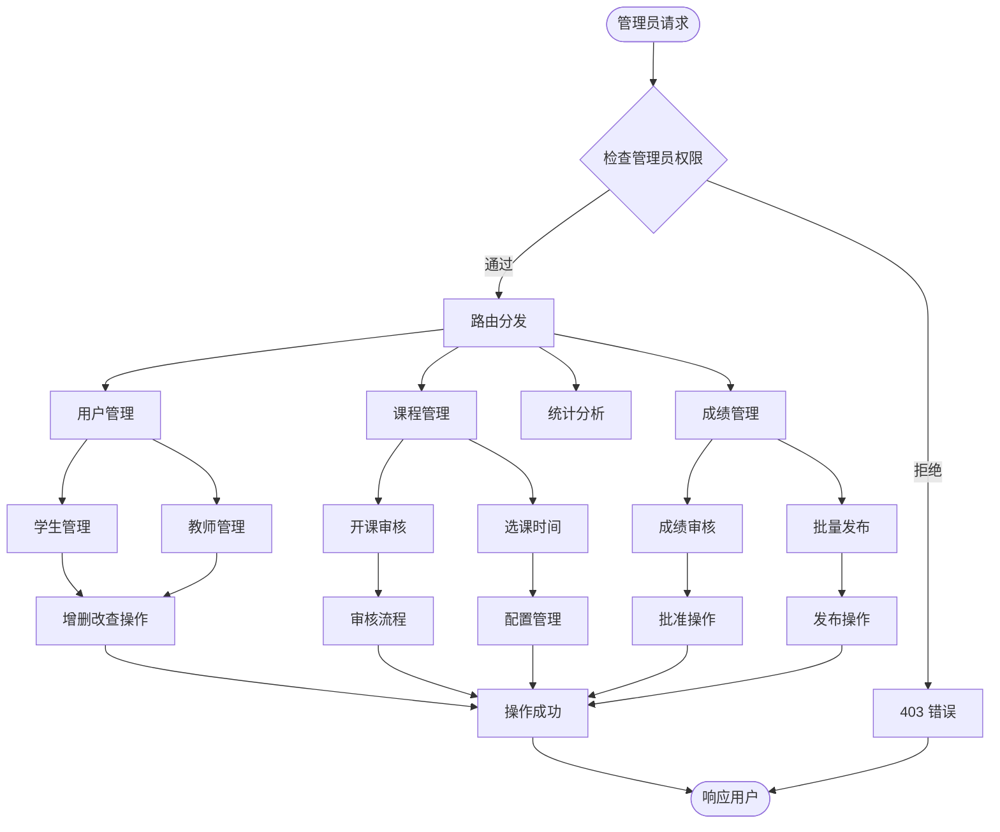
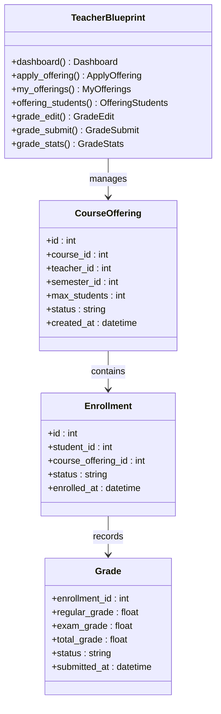
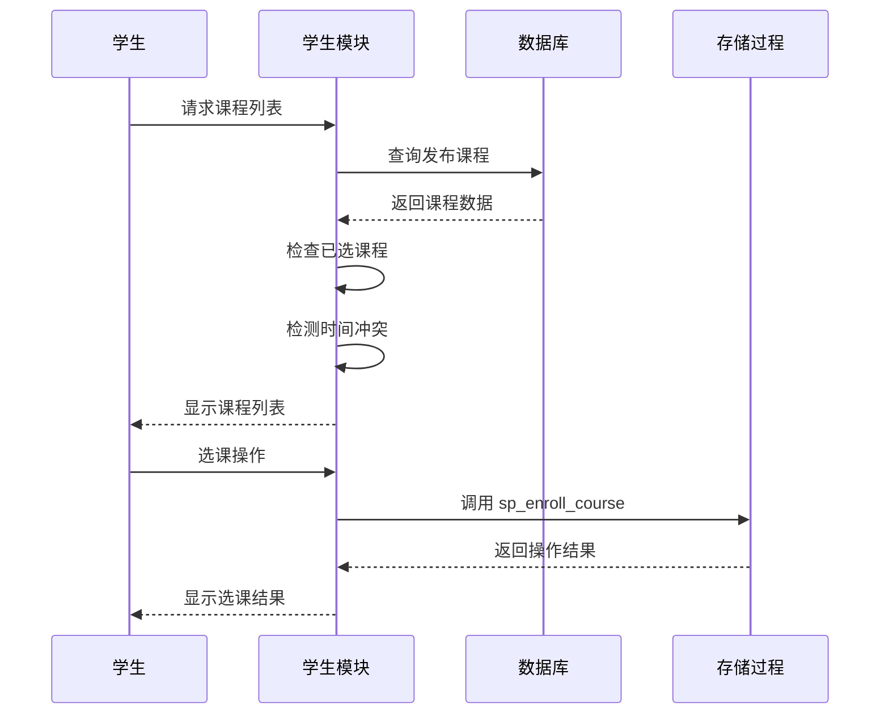
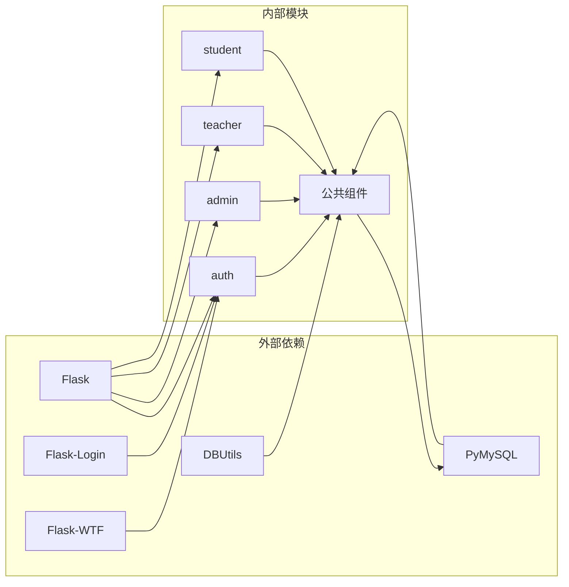
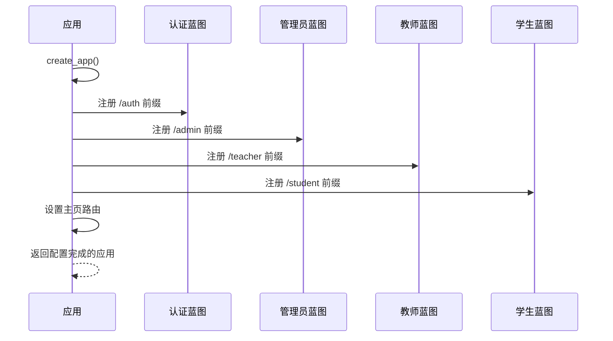

# 蓝图路由系统

<cite>
**本文档引用的文件**
- [app/__init__.py](file://app/__init__.py)
- [app/auth/routes.py](file://app/auth/routes.py)
- [app/admin/routes.py](file://app/admin/routes.py)
- [app/teacher/routes.py](file://app/teacher/routes.py)
- [app/student/routes.py](file://app/student/routes.py)
- [app/decorators.py](file://app/decorators.py)
- [app/db.py](file://app/db.py)
- [config.py](file://config.py)
- [app/auth/forms.py](file://app/auth/forms.py)
- [app.py](file://app.py)
- [app/templates/base.html](file://app/templates/base.html)
</cite>

## 目录
1. [简介](#简介)
2. [项目结构](#项目结构)
3. [核心组件](#核心组件)
4. [架构总览](#架构总览)
5. [详细组件分析](#详细组件分析)
6. [依赖关系分析](#依赖关系分析)
7. [性能考虑](#性能考虑)
8. [故障排除指南](#故障排除指南)
9. [结论](#结论)

## 简介
本项目是一个基于Flask的教务管理系统，采用蓝图（Blueprint）模式实现模块化路由设计。系统通过四个主要蓝图模块分别服务于不同角色用户：认证模块（auth）、管理员模块（admin）、教师模块（teacher）、学生模块（student）。每个模块都具有独立的URL前缀和特定的功能职责，实现了清晰的MVC架构分离和良好的可维护性。

## 项目结构
项目采用按功能模块划分的目录结构，每个模块包含独立的路由定义、模板文件和业务逻辑：

**图表来源**
- [app.py:1-13](file://app.py#L1-L13)
- [app/__init__.py:29-93](file://app/__init__.py#L29-L93)

**章节来源**
- [app/__init__.py:29-93](file://app/__init__.py#L29-L93)
- [app.py:1-13](file://app.py#L1-L13)

## 核心组件
系统的核心由以下关键组件构成：

### 应用初始化与蓝图注册
应用通过工厂函数模式创建Flask实例，并在其中完成蓝图的注册和全局配置：

- **应用工厂函数**：`create_app()`负责创建应用实例和配置
- **蓝图注册**：在应用初始化时统一注册四个主要蓝图
- **全局中间件**：CSRF保护、数据库连接池、用户登录管理

### 权限控制装饰器
系统实现了基于角色的访问控制机制：

- **登录验证装饰器**：确保用户已登录
- **角色验证装饰器**：限制特定路由的访问权限
- **统一错误处理**：403、404、500错误页面

### 数据库抽象层
提供统一的数据库操作接口：

- **连接池管理**：PooledDB连接池配置
- **查询封装**：SQL查询、存储过程调用、分页查询
- **事务处理**：自动提交和手动事务控制

**章节来源**
- [app/__init__.py:29-93](file://app/__init__.py#L29-L93)
- [app/decorators.py:7-26](file://app/decorators.py#L7-L26)
- [app/db.py:10-121](file://app/db.py#L10-L121)

## 架构总览
系统采用经典的MVC架构模式，通过蓝图实现功能模块化：

**图表来源**
- [app/__init__.py:53-64](file://app/__init__.py#L53-L64)
- [app/auth/routes.py:29](file://app/auth/routes.py#L29)
- [app/admin/routes.py:10](file://app/admin/routes.py#L10)
- [app/teacher/routes.py:7](file://app/teacher/routes.py#L7)
- [app/student/routes.py:7](file://app/student/routes.py#L7)

## 详细组件分析

### 认证模块（auth）
认证模块负责用户身份验证和基础账户管理：

#### 路由设计
- **URL前缀**：`/auth`
- **核心路由**：
  - `/login` - 用户登录
  - `/register` - 用户注册
  - `/logout` - 用户登出
  - `/profile` - 个人信息管理

#### 功能特性
- **动态角色分配**：根据注册角色创建对应用户表记录
- **唯一标识生成**：自动生成学号和工号
- **密码安全**：使用Werkzeug的安全哈希算法
- **会话管理**：集成Flask-Login实现持久登录

**图表来源**
- [app/auth/routes.py:32-55](file://app/auth/routes.py#L32-L55)
- [app/auth/routes.py:48-51](file://app/auth/routes.py#L48-L51)

**章节来源**
- [app/auth/routes.py:29-167](file://app/auth/routes.py#L29-L167)
- [app/auth/forms.py:6-37](file://app/auth/forms.py#L6-L37)

### 管理员模块（admin）
管理员模块提供完整的教务系统管理功能：

#### 路由设计
- **URL前缀**：`/admin`
- **核心功能路由**：
  - **基础管理**：学期、专业、班级、课程管理
  - **用户管理**：学生、教师账户管理
  - **课程管理**：开课审核、选课时间配置
  - **成绩管理**：成绩审核、批量发布
  - **统计分析**：系统统计、学业预警

#### 权限控制
- **全局装饰器**：`@login_required` 和 `@role_required('admin')`
- **细粒度控制**：针对具体操作的权限验证

**图表来源**
- [app/admin/routes.py:13-17](file://app/admin/routes.py#L13-L17)
- [app/admin/routes.py:42-57](file://app/admin/routes.py#L42-L57)

**章节来源**
- [app/admin/routes.py:10-615](file://app/admin/routes.py#L10-L615)

### 教师模块（teacher）
教师模块专注于教学相关的功能：

#### 路由设计
- **URL前缀**：`/teacher`
- **核心功能路由**：
  - **开课管理**：申请开课、查看我的课程
  - **学生管理**：查看选课学生、成绩录入
  - **成绩管理**：单个/批量成绩提交
  - **统计分析**：课程成绩分布统计

#### 安全机制
- **拥有者验证**：确保教师只能操作自己名下的课程
- **状态控制**：限制对非待审核状态课程的操作

**图表来源**
- [app/teacher/routes.py:7](file://app/teacher/routes.py#L7)
- [app/teacher/routes.py:50-64](file://app/teacher/routes.py#L50-L64)

**章节来源**
- [app/teacher/routes.py:7-271](file://app/teacher/routes.py#L7-L271)

### 学生模块（student）
学生模块提供学习相关的功能服务：

#### 路由设计
- **URL前缀**：`/student`
- **核心功能路由**：
  - **课程管理**：课程查询、选课/退课
  - **个人中心**：课表查询、成绩查询
  - **学术记录**：成绩单打印、GPA计算

#### 智能功能
- **冲突检测**：自动检测课程时间冲突
- **GPA计算**：实时计算累计GPA
- **存储过程集成**：通过MySQL存储过程实现复杂业务逻辑

**图表来源**
- [app/student/routes.py:78-114](file://app/student/routes.py#L78-L114)
- [app/student/routes.py:133-144](file://app/student/routes.py#L133-L144)

**章节来源**
- [app/student/routes.py:7-218](file://app/student/routes.py#L7-L218)

## 依赖关系分析

### 模块间依赖关系
系统采用松耦合设计，各模块间通过URL命名空间进行交互：

**图表来源**
- [app/__init__.py:2-5](file://app/__init__.py#L2-L5)
- [app/db.py:2-4](file://app/db.py#L2-L4)

### 蓝图注册流程
应用启动时的蓝图注册顺序和URL前缀管理：

**图表来源**
- [app/__init__.py:53-64](file://app/__init__.py#L53-L64)

**章节来源**
- [app/__init__.py:53-64](file://app/__init__.py#L53-L64)

## 性能考虑
系统在设计时充分考虑了性能优化：

### 数据库连接池
- **连接复用**：PooledDB实现连接池，减少连接建立开销
- **配置优化**：最小缓存、最大缓存、最大连接数参数调优
- **自动回收**：应用上下文结束时自动关闭连接

### 查询优化策略
- **分页查询**：大数据量场景下的分页处理
- **索引利用**：合理使用数据库索引提高查询效率
- **批量操作**：支持批量数据处理减少网络往返

### 缓存机制
- **会话缓存**：Flask-Login会话管理
- **模板缓存**：Jinja2模板编译缓存
- **静态资源**：浏览器端静态资源缓存

## 故障排除指南

### 常见问题诊断
1. **登录失败**
   - 检查用户名密码是否正确
   - 验证用户是否被激活
   - 查看数据库连接配置

2. **权限不足**
   - 确认用户角色是否正确
   - 检查装饰器是否正确应用
   - 验证URL前缀是否匹配

3. **数据库连接问题**
   - 检查连接池配置参数
   - 验证MySQL服务状态
   - 查看连接超时设置

### 错误处理机制
系统实现了完善的错误处理：

- **403 Forbidden**：权限不足访问
- **404 Not Found**：路由不存在
- **500 Internal Server Error**：服务器内部错误
- **Flash消息**：用户友好的错误提示

**章节来源**
- [app/__init__.py:76-90](file://app/__init__.py#L76-L90)

## 结论
本蓝图路由系统通过清晰的模块划分和严格的权限控制，实现了教务管理系统的功能模块化。四个主要蓝图模块各司其职，既保持了独立性又实现了有效的协作。系统采用的工厂函数模式、装饰器模式和连接池技术，为后续的功能扩展和性能优化奠定了良好的基础。

通过URL前缀管理和命名空间隔离，系统实现了良好的可维护性和可扩展性。每个模块都可以独立开发、测试和部署，符合现代Web应用的最佳实践。同时，系统的MVC架构分离使得业务逻辑、数据访问和表现层职责明确，便于团队协作开发。