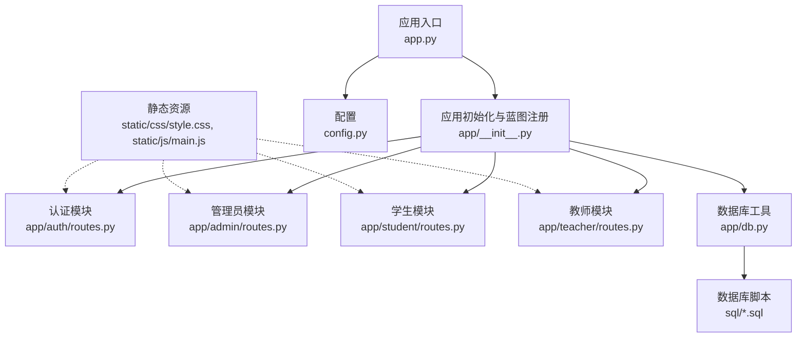
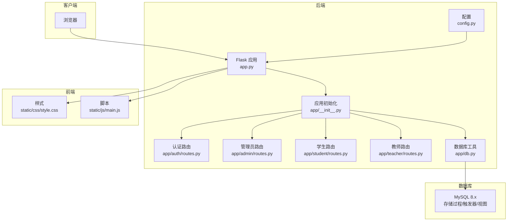
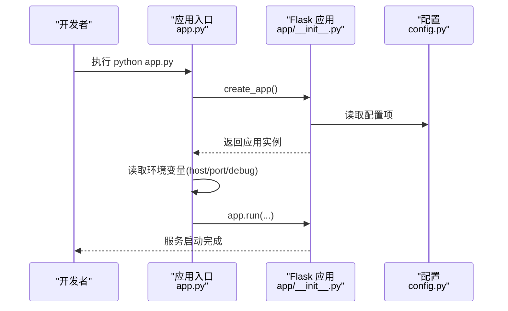
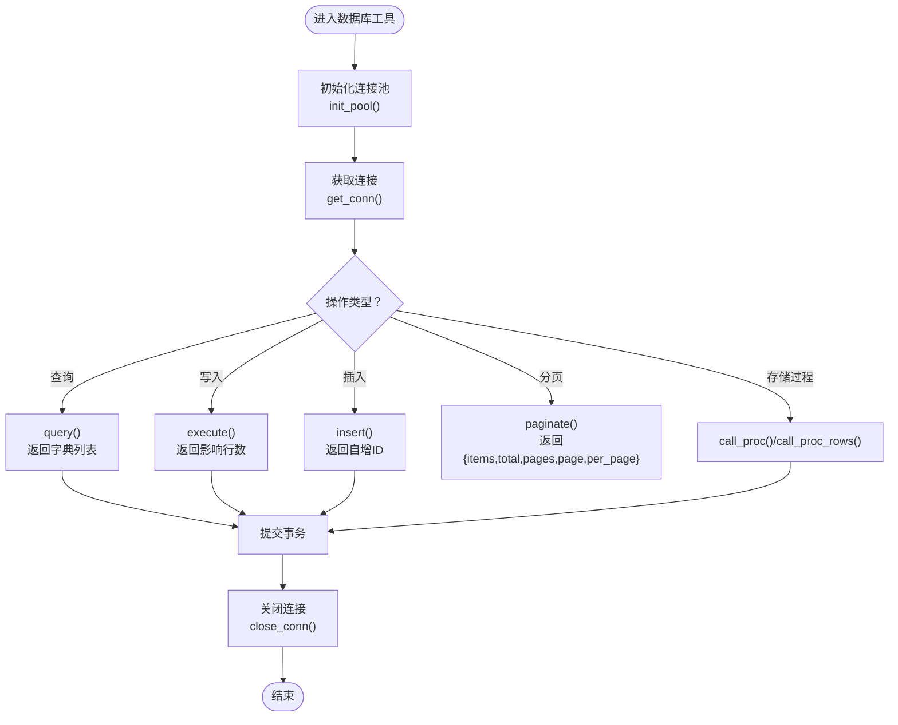
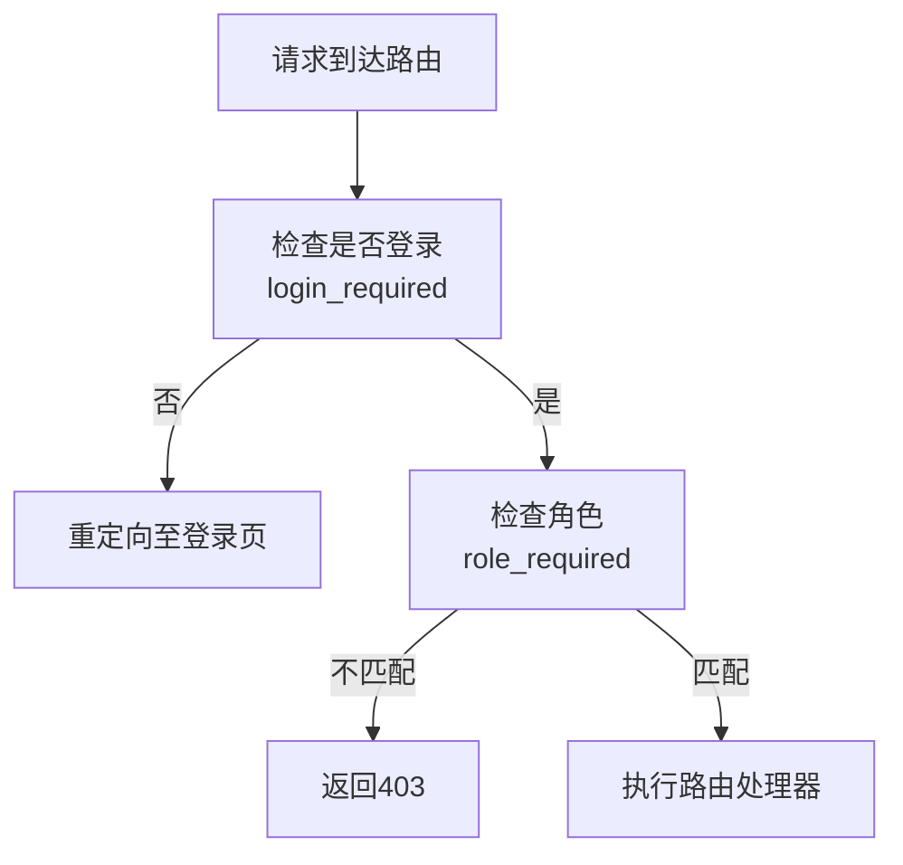
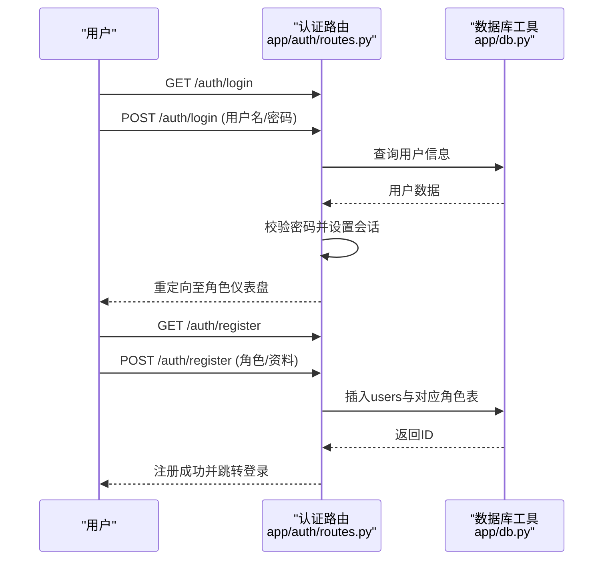
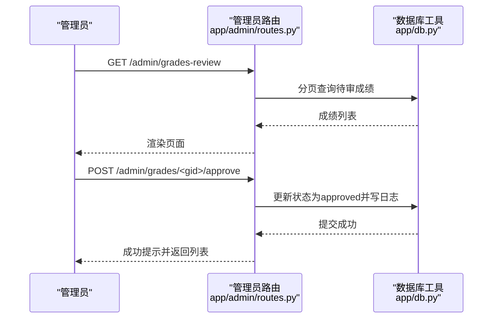
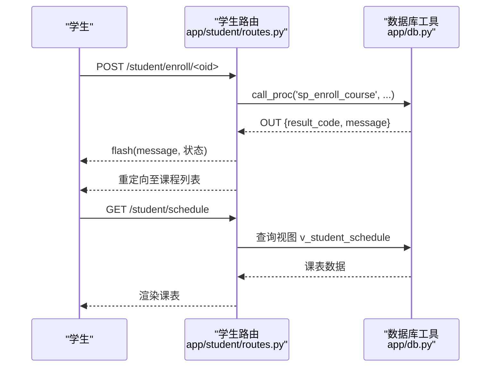
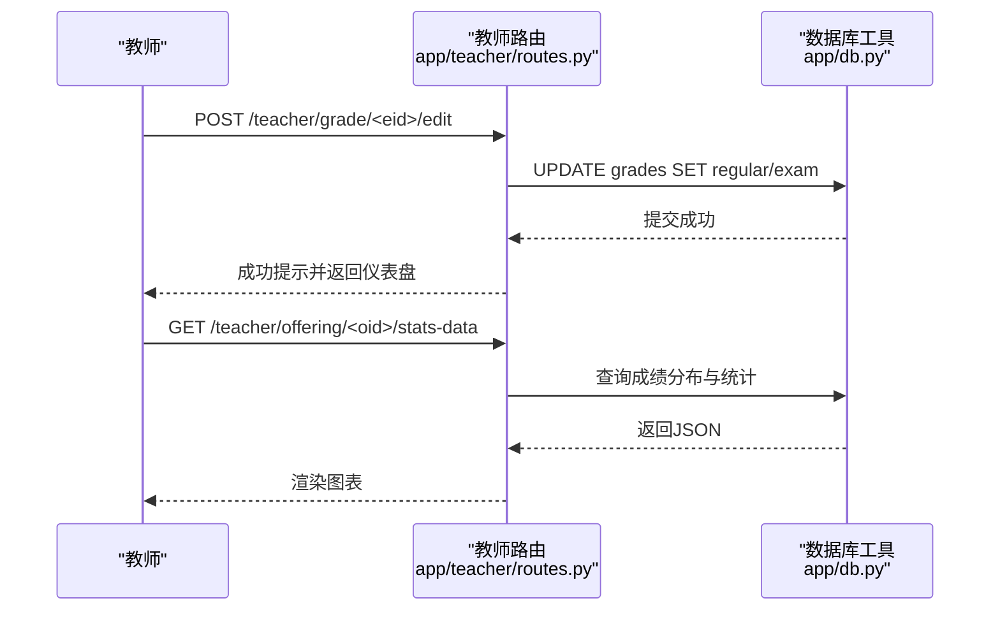
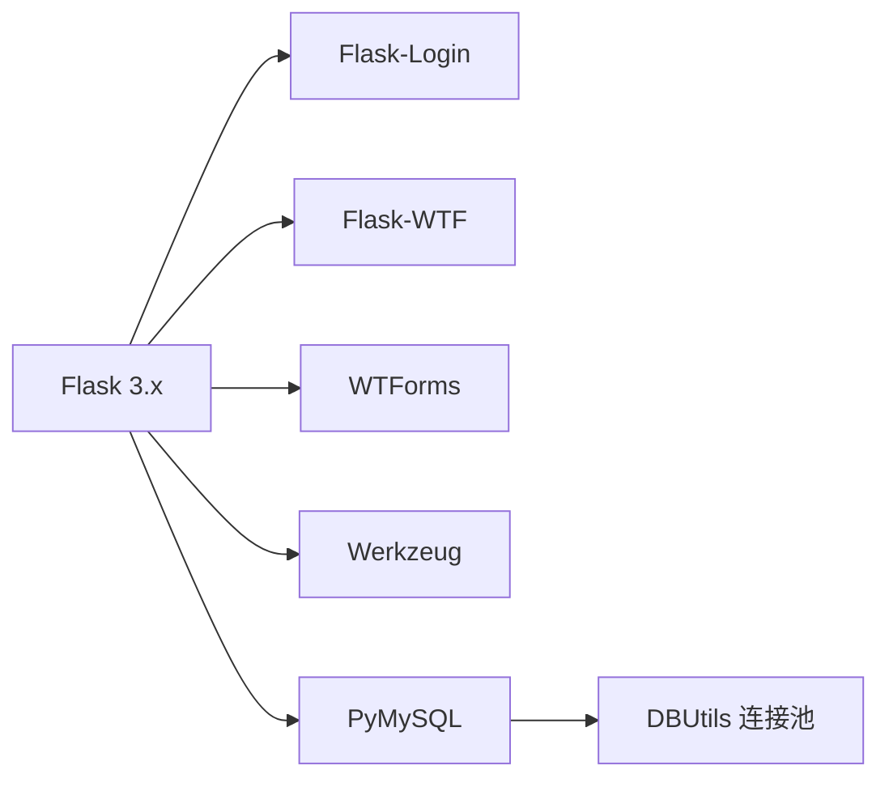

# 开发指南

<cite>
**本文引用的文件**
- [README.md](file://README.md)
- [app.py](file://app.py)
- [config.py](file://config.py)
- [requirements.txt](file://requirements.txt)
- [app/__init__.py](file://app/__init__.py)
- [app/db.py](file://app/db.py)
- [app/decorators.py](file://app/decorators.py)
- [app/auth/routes.py](file://app/auth/routes.py)
- [app/admin/routes.py](file://app/admin/routes.py)
- [app/student/routes.py](file://app/student/routes.py)
- [app/teacher/routes.py](file://app/teacher/routes.py)
- [sql/01_schema.sql](file://sql/01_schema.sql)
- [sql/02_seed.sql](file://sql/02_seed.sql)
- [static/css/style.css](file://static/css/style.css)
- [static/js/main.js](file://static/js/main.js)
</cite>

## 目录
1. [简介](#简介)
2. [项目结构](#项目结构)
3. [核心组件](#核心组件)
4. [架构总览](#架构总览)
5. [详细组件分析](#详细组件分析)
6. [依赖分析](#依赖分析)
7. [性能考虑](#性能考虑)
8. [故障排查指南](#故障排查指南)
9. [结论](#结论)
10. [附录](#附录)

## 简介
本指南面向参与“校园教务选课与成绩管理系统”（MIS）项目的开发者，提供从开发环境搭建、代码规范与最佳实践、Git 版本控制策略、测试策略、数据库开发流程、功能开发指导、文档维护到贡献流程与开发工具推荐的完整开发指南。系统采用 Python Flask 3.x 作为后端框架，MySQL 8.x 作为数据库，结合原生 SQL、存储过程、触发器与视图实现完整的教务业务闭环。

## 项目结构
项目采用模块化组织方式，核心目录与文件如下：
- 应用入口与配置：app.py、config.py
- 应用初始化与蓝图注册：app/__init__.py
- 数据库连接池与通用查询工具：app/db.py
- 权限装饰器：app/decorators.py
- 模块化路由：app/auth/、app/admin/、app/student/、app/teacher/
- 前端静态资源：static/css/style.css、static/js/main.js
- 数据库脚本：sql/01_schema.sql、sql/02_seed.sql 等
- 依赖声明：requirements.txt
- 项目说明：README.md

**图表来源**
- [app.py:1-13](file://app.py#L1-L13)
- [app/__init__.py:29-93](file://app/__init__.py#L29-L93)
- [app/db.py:1-121](file://app/db.py#L1-L121)
- [app/auth/routes.py:1-167](file://app/auth/routes.py#L1-L167)
- [app/admin/routes.py:1-615](file://app/admin/routes.py#L1-L615)
- [app/student/routes.py:1-218](file://app/student/routes.py#L1-L218)
- [app/teacher/routes.py:1-271](file://app/teacher/routes.py#L1-L271)
- [config.py:1-36](file://config.py#L1-L36)
- [sql/01_schema.sql:1-200](file://sql/01_schema.sql#L1-L200)
- [static/css/style.css:1-79](file://static/css/style.css#L1-L79)
- [static/js/main.js:1-11](file://static/js/main.js#L1-L11)

**章节来源**
- [README.md:46-69](file://README.md#L46-L69)
- [app.py:1-13](file://app.py#L1-L13)
- [app/__init__.py:29-93](file://app/__init__.py#L29-L93)

## 核心组件
- 应用入口与运行参数：负责加载配置、启动 Flask 应用并支持环境变量覆盖主机、端口与调试模式。
- 应用初始化：集中注册蓝图、初始化 CSRF 保护、数据库连接池、Flask-Login 用户加载器与全局错误处理。
- 数据库工具：封装连接池、查询、写入、存储过程调用、分页等通用能力，统一事务提交与连接回收。
- 权限装饰器：提供登录与角色校验，简化路由权限控制。
- 模块化路由：按角色拆分认证、管理员、教师、学生四个模块，职责清晰，便于扩展与维护。

**章节来源**
- [app.py:1-13](file://app.py#L1-L13)
- [app/__init__.py:29-93](file://app/__init__.py#L29-L93)
- [app/db.py:1-121](file://app/db.py#L1-L121)
- [app/decorators.py:1-26](file://app/decorators.py#L1-L26)

## 架构总览
系统采用前后端分离的 Web 架构，后端以 Flask 提供 RESTful 风格的路由接口与模板渲染，前端使用 Bootstrap 5 + Jinja2 + Chart.js 实现响应式界面与交互。数据库采用 MySQL 8.x，配合存储过程、触发器与视图实现复杂的业务逻辑与数据一致性。

**图表来源**
- [app.py:1-13](file://app.py#L1-L13)
- [app/__init__.py:29-93](file://app/__init__.py#L29-L93)
- [app/db.py:1-121](file://app/db.py#L1-L121)
- [config.py:1-36](file://config.py#L1-L36)
- [sql/01_schema.sql:1-200](file://sql/01_schema.sql#L1-L200)
- [static/css/style.css:1-79](file://static/css/style.css#L1-L79)
- [static/js/main.js:1-11](file://static/js/main.js#L1-L11)

## 详细组件分析

### 应用入口与配置
- 应用入口负责读取配置并启动服务，支持通过环境变量设置主机、端口与调试模式。
- 配置类集中管理数据库连接参数、连接池大小、分页数量以及成绩权重与预警阈值等业务常量。

**图表来源**
- [app.py:1-13](file://app.py#L1-L13)
- [app/__init__.py:29-93](file://app/__init__.py#L29-L93)
- [config.py:1-36](file://config.py#L1-L36)

**章节来源**
- [app.py:1-13](file://app.py#L1-L13)
- [config.py:1-36](file://config.py#L1-L36)

### 数据库工具与连接池
- 封装连接池初始化、连接获取与回收、查询/写入/插入/分页等常用操作。
- 提供存储过程调用与 OUT 参数读取、返回结果集的存储过程调用等高级能力。
- 分页函数支持自定义 count_sql 或自动包装统计，确保高并发下的稳定性。

**图表来源**
- [app/db.py:10-121](file://app/db.py#L10-L121)

**章节来源**
- [app/db.py:1-121](file://app/db.py#L1-L121)

### 权限装饰器
- 登录必需装饰器：基于 Flask-Login 的登录检查。
- 角色必需装饰器：根据当前用户角色进行访问控制，未授权时返回 403。

**图表来源**
- [app/decorators.py:7-26](file://app/decorators.py#L7-L26)

**章节来源**
- [app/decorators.py:1-26](file://app/decorators.py#L1-L26)

### 认证模块（登录/注册/个人资料）
- 登录：校验用户名与密码，记录最近登录时间，按角色重定向至对应仪表盘。
- 注册：按角色生成唯一编号，插入用户与角色表，返回成功提示。
- 个人资料：支持修改密码与联系方式，按角色读取不同资料表。

**图表来源**
- [app/auth/routes.py:32-110](file://app/auth/routes.py#L32-L110)
- [app/db.py:43-89](file://app/db.py#L43-L89)

**章节来源**
- [app/auth/routes.py:1-167](file://app/auth/routes.py#L1-L167)

### 管理员模块（基础信息管理、开课审核、成绩发布、统计分析、预警）
- 基础信息管理：学期、专业、班级、课程、用户等 CRUD。
- 开课审核：调用存储过程审批开课申请，支持发布。
- 成绩审核与发布：单条与批量发布，记录系统日志。
- 统计分析：选课统计、成绩分布、教师工作量。
- 学业预警：调用存储过程列出预警学生，支持筛选与汇总。

**图表来源**
- [app/admin/routes.py:454-526](file://app/admin/routes.py#L454-L526)
- [app/db.py:92-121](file://app/db.py#L92-L121)

**章节来源**
- [app/admin/routes.py:1-615](file://app/admin/routes.py#L1-L615)

### 学生模块（选课、退课、课表、成绩、成绩单）
- 选课/退课：调用存储过程执行选课与退课，返回多级结果码与消息。
- 课表与成绩：查询视图展示课表、成绩与累计 GPA。
- 成绩单：按学期聚合已发布成绩，计算累计 GPA。

**图表来源**
- [app/student/routes.py:133-159](file://app/student/routes.py#L133-L159)
- [app/student/routes.py:161-167](file://app/student/routes.py#L161-L167)
- [app/db.py:62-81](file://app/db.py#L62-L81)

**章节来源**
- [app/student/routes.py:1-218](file://app/student/routes.py#L1-L218)

### 教师模块（开课申请、学生名单、成绩录入与统计）
- 开课申请：提交课程、教师、学期、教室与时间安排。
- 学生名单：查看所授课程的学生名单与成绩状态。
- 成绩录入：支持单条与批量提交，防止重复修改已提交成绩。
- 成绩统计：按课程统计分布与均分、及格率等。

**图表来源**
- [app/teacher/routes.py:158-213](file://app/teacher/routes.py#L158-L213)
- [app/teacher/routes.py:237-271](file://app/teacher/routes.py#L237-L271)
- [app/db.py:92-121](file://app/db.py#L92-L121)

**章节来源**
- [app/teacher/routes.py:1-271](file://app/teacher/routes.py#L1-L271)

## 依赖分析
- 后端依赖：Flask 3.x、Flask-Login、Flask-WTF、Werkzeug、WTForms、PyMySQL、DBUtils。
- 前端依赖：Bootstrap 5、Jinja2、Chart.js（由模板引入）。
- 数据库：MySQL 8.x，使用连接池与存储过程/触发器/视图。

**图表来源**
- [requirements.txt:1-8](file://requirements.txt#L1-L8)

**章节来源**
- [requirements.txt:1-8](file://requirements.txt#L1-L8)
- [README.md:5-11](file://README.md#L5-L11)

## 性能考虑
- 使用连接池：通过 DBUtils 的 PooledDB 减少连接开销，合理设置最小缓存、最大缓存与最大连接数。
- 分页查询：对复杂查询使用 paginate 包装 count，避免全表扫描。
- 存储过程：将复杂业务逻辑下沉至数据库，减少网络往返与应用侧计算。
- 视图与索引：利用视图简化查询，确保关键字段建立索引与唯一约束，提高查询效率。
- 前端优化：样式与脚本按需加载，移动端适配与打印样式分离。

**章节来源**
- [app/db.py:10-26](file://app/db.py#L10-L26)
- [app/db.py:92-121](file://app/db.py#L92-L121)
- [sql/01_schema.sql:14-200](file://sql/01_schema.sql#L14-L200)
- [static/css/style.css:1-79](file://static/css/style.css#L1-L79)

## 故障排查指南
- 登录失败：检查用户名是否存在且账户启用，确认密码哈希匹配。
- 选课/退课异常：关注存储过程返回的结果码与消息，核对选课时间段与冲突规则。
- 成绩无法修改：已提交的成绩状态不可再改，需退回草稿或联系管理员。
- 数据库连接问题：检查 DB_HOST、DB_PORT、DB_USER、DB_PASSWORD、DB_NAME 是否正确，确认连接池参数合理。
- 权限不足：确认用户角色与路由装饰器匹配，未登录将被重定向至登录页。

**章节来源**
- [app/auth/routes.py:32-55](file://app/auth/routes.py#L32-L55)
- [app/student/routes.py:133-159](file://app/student/routes.py#L133-L159)
- [app/teacher/routes.py:158-187](file://app/teacher/routes.py#L158-L187)
- [app/db.py:10-26](file://app/db.py#L10-L26)
- [app/decorators.py:7-26](file://app/decorators.py#L7-L26)

## 结论
本指南提供了从环境搭建到功能开发、从数据库设计到测试与运维的全流程开发建议。建议团队遵循统一的代码规范、严格的权限控制与数据库变更流程，持续完善测试与文档，保障系统的可维护性与可扩展性。

## 附录

### 开发环境搭建
- Python 虚拟环境：建议使用 venv 创建隔离环境，安装依赖后运行应用。
- IDE 配置：推荐 VS Code，启用 Python 扩展、Pylance、flake8 或 ruff，配置格式化与自动导入。
- 调试工具：使用 Flask 内置调试模式（开发环境），结合浏览器开发者工具与网络面板定位问题。
- 数据库：按顺序执行 SQL 脚本初始化 Schema、存储过程、视图与种子数据。

**章节来源**
- [README.md:12-36](file://README.md#L12-L36)
- [sql/01_schema.sql:1-200](file://sql/01_schema.sql#L1-L200)
- [sql/02_seed.sql:1-49](file://sql/02_seed.sql#L1-L49)

### 代码规范与最佳实践
- 命名约定：模块与蓝图使用小写，路由函数语义明确；数据库表与列使用下划线命名；配置常量全大写。
- 注释标准：公共函数与复杂逻辑添加简要注释，说明输入输出与边界条件；路由层保持简洁，业务逻辑尽量下沉至数据库层。
- 代码审查：提交前自检，关注安全性（CSRF、密码哈希）、健壮性（空值处理、异常捕获）与性能（索引、分页）。

### Git 版本控制策略
- 分支管理：主分支用于稳定发布，特性开发在 feature/* 分支，修复在 hotfix/* 分支。
- 提交规范：使用动宾短语，首字母小写，限制在 50 字以内；正文说明动机与影响。
- 合并流程：使用 Rebase 合并以保持线性历史，或使用 Squash 合并整合多个提交。

### 测试策略
- 单元测试：针对数据库工具函数（查询、写入、分页、存储过程调用）编写测试，覆盖正常与异常路径。
- 集成测试：模拟认证、角色路由访问、选课/退课流程、成绩录入与发布流程。
- 端到端测试：使用自动化测试框架（如 pytest + selenium）验证关键业务流程与页面交互。

### 数据库开发流程
- Schema 变更：先在本地分支创建变更脚本，编写反向脚本；在测试环境验证后合并。
- 迁移脚本：按序号命名（如 06_xxx.sql），确保幂等与回滚安全。
- 测试数据：使用 seed 脚本准备最小可用数据集，覆盖典型场景与边界条件。

**章节来源**
- [sql/01_schema.sql:1-200](file://sql/01_schema.sql#L1-L200)
- [sql/02_seed.sql:1-49](file://sql/02_seed.sql#L1-L49)

### 功能开发指导
- 新功能模块：新增蓝图与路由，复用数据库工具与装饰器；优先实现最小可行方案，再迭代完善。
- 现有功能扩展：遵循现有命名与结构，补充分页、搜索、过滤与统计视图。
- Bug 修复：定位存储过程返回码与业务规则，确保修复不影响现有数据一致性。

### 文档维护
- 代码注释：关键函数与复杂逻辑添加注释；路由层注释说明用途与参数。
- API 文档：使用 OpenAPI/Swagger 描述接口（如有需要），保持与实现一致。
- 用户手册：更新操作流程与截图，确保与最新界面一致。

### 贡献指南
- 参与方式：Fork 仓库，在 feature 分支开发，提交 PR 并关联 Issue。
- 提交 Pull Request：描述变更内容、影响范围与测试情况；等待代码审查与 CI 通过。
- 讨论与协作：使用 GitHub Discussions 或团队沟通渠道同步进展。

### 开发工具推荐
- 编辑器：VS Code（Python、Pylance、GitLens、ESLint/Stylelint）。
- 调试：Flask 调试器、Postman 或 Insomnia（API 测试）。
- 数据库：MySQL Workbench 或 DBeaver（ER 图与查询）。
- 性能：PerfDog 或浏览器性能面板（前端性能）。
- 效率技巧：使用快捷键、代码片段、自动格式化与 LSP 智能提示。