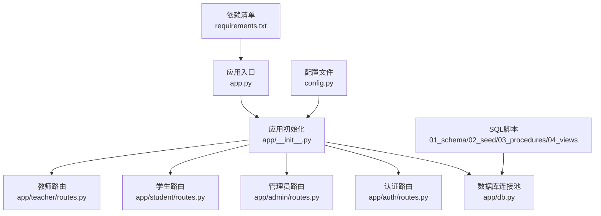
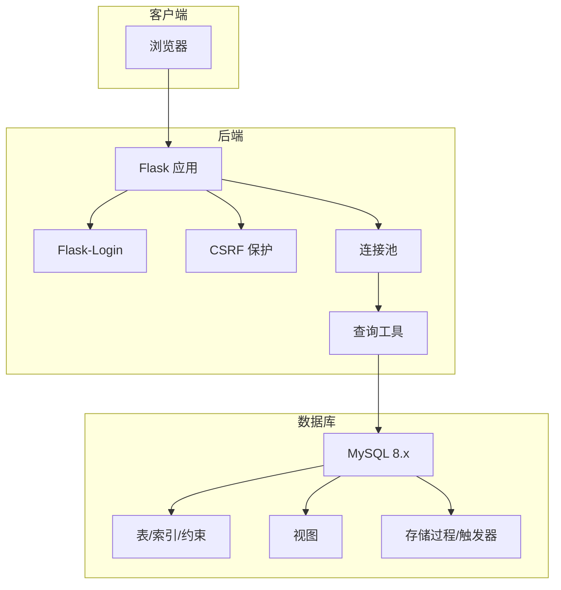

# 快速开始

<cite>
**本文引用的文件**
- [README.md](file://README.md)
- [requirements.txt](file://requirements.txt)
- [config.py](file://config.py)
- [app.py](file://app.py)
- [app/__init__.py](file://app/__init__.py)
- [app/db.py](file://app/db.py)
- [sql/01_schema.sql](file://sql/01_schema.sql)
- [sql/02_seed.sql](file://sql/02_seed.sql)
- [sql/03_procedures.sql](file://sql/03_procedures.sql)
- [sql/04_views.sql](file://sql/04_views.sql)
- [app/auth/routes.py](file://app/auth/routes.py)
- [app/admin/routes.py](file://app/admin/routes.py)
- [app/student/routes.py](file://app/student/routes.py)
- [app/teacher/routes.py](file://app/teacher/routes.py)
</cite>

## 目录
1. [简介](#简介)
2. [项目结构](#项目结构)
3. [核心组件](#核心组件)
4. [架构总览](#架构总览)
5. [详细组件分析](#详细组件分析)
6. [依赖分析](#依赖分析)
7. [性能考虑](#性能考虑)
8. [故障排查指南](#故障排查指南)
9. [结论](#结论)
10. [附录](#附录)

## 简介
本指南面向新手开发者，帮助你从零开始搭建并运行“校园教务选课与成绩管理系统”。内容覆盖：
- 环境准备（Python 3.x、MySQL 8.x）
- 依赖安装（requirements.txt）
- 数据库初始化（按顺序执行 SQL 脚本）
- 配置文件修改（config.py 或 .env）
- 应用启动与访问测试
- 测试账户与登录验证
- 常见问题排查

## 项目结构
系统采用 Flask 分层架构，核心目录与文件如下：
- 应用入口与配置：app.py、config.py
- 应用初始化与蓝图注册：app/__init__.py
- 数据库连接池与查询工具：app/db.py
- SQL 脚本：sql/01_schema.sql、sql/02_seed.sql、sql/03_procedures.sql、sql/04_views.sql
- 认证与角色模块：app/auth/routes.py、app/admin/routes.py、app/student/routes.py、app/teacher/routes.py

图表来源
- [app.py:1-13](file://app.py#L1-L13)
- [app/__init__.py:29-93](file://app/__init__.py#L29-L93)
- [app/db.py:10-111](file://app/db.py#L10-L111)
- [config.py:6-30](file://config.py#L6-L30)
- [requirements.txt:1-8](file://requirements.txt#L1-L8)
- [sql/01_schema.sql:1-235](file://sql/01_schema.sql#L1-L235)
- [sql/02_seed.sql:1-49](file://sql/02_seed.sql#L1-L49)
- [sql/03_procedures.sql:1-381](file://sql/03_procedures.sql#L1-L381)
- [sql/04_views.sql:1-113](file://sql/04_views.sql#L1-L113)

章节来源
- [README.md:45-67](file://README.md#L45-L67)

## 核心组件
- 应用入口与启动
  - 通过 app.py 创建 Flask 应用实例并运行，默认监听 0.0.0.0:5000。
- 应用初始化
  - 注册 CSRF 保护、数据库连接池、Flask-Login 用户加载器、各模块蓝图。
- 数据库连接池
  - 使用 PyMySQL + DBUtils 连接池，支持最小缓存、最大缓存、最大连接数等配置。
- 配置管理
  - 通过 config.py 提供数据库连接参数、连接池参数、分页参数、成绩权重等。
- SQL 脚本
  - 01_schema：建表（12 张核心表，含约束、索引、外键）
  - 02_seed：测试数据（管理员、学期、专业、班级、课程、选课时间段）
  - 03_procedures：存储过程（选课、退课、成绩计算、GPA 计算、审核）、触发器
  - 04_views：视图（课表、成绩单、选课统计、教师工作量）

章节来源
- [app.py:1-13](file://app.py#L1-L13)
- [app/__init__.py:29-93](file://app/__init__.py#L29-L93)
- [app/db.py:10-111](file://app/db.py#L10-L111)
- [config.py:6-30](file://config.py#L6-L30)
- [sql/01_schema.sql:1-235](file://sql/01_schema.sql#L1-L235)
- [sql/02_seed.sql:1-49](file://sql/02_seed.sql#L1-L49)
- [sql/03_procedures.sql:1-381](file://sql/03_procedures.sql#L1-L381)
- [sql/04_views.sql:1-113](file://sql/04_views.sql#L1-L113)

## 架构总览
系统采用前后端分离的 Web 架构，后端基于 Flask，前端模板使用 Jinja2，静态资源由 Flask 提供。数据库为 MySQL 8.x，使用存储过程、触发器与视图实现复杂业务逻辑。

图表来源
- [app/__init__.py:29-93](file://app/__init__.py#L29-L93)
- [app/db.py:10-111](file://app/db.py#L10-L111)
- [sql/01_schema.sql:1-235](file://sql/01_schema.sql#L1-L235)
- [sql/03_procedures.sql:1-381](file://sql/03_procedures.sql#L1-L381)
- [sql/04_views.sql:1-113](file://sql/04_views.sql#L1-L113)

## 详细组件分析

### 环境准备与依赖安装
- Python 3.x
  - 确保本地已安装 Python 3.x（建议 3.8+），并能使用 pip。
- MySQL 8.x
  - 安装 MySQL 8.x，确保可创建数据库与执行存储过程、触发器、视图。
- 安装依赖
  - 在项目根目录执行安装命令以安装 requirements.txt 中的所有依赖。

章节来源
- [README.md:14-17](file://README.md#L14-L17)
- [requirements.txt:1-8](file://requirements.txt#L1-L8)

### 数据库初始化步骤
- 按顺序执行 SQL 脚本，确保后续脚本依赖前序对象存在。
- 执行顺序与说明：
  1) 建表与约束
     - 创建数据库与 12 张核心表，包含主键、唯一键、索引、外键与检查约束。
  2) 存储过程与触发器
     - 创建选课、退课、成绩计算、GPA 计算、审核等存储过程。
     - 创建选课后自动创建成绩记录、成绩更新自动计算、开课状态变更记录日志等触发器。
  3) 视图
     - 创建学生课表、成绩单、选课统计、教师工作量等视图。
  4) 种子数据
     - 插入管理员账户、学期、专业、班级、课程、选课时间段等测试数据。

章节来源
- [README.md:19-26](file://README.md#L19-L26)
- [sql/01_schema.sql:1-235](file://sql/01_schema.sql#L1-L235)
- [sql/03_procedures.sql:1-381](file://sql/03_procedures.sql#L1-L381)
- [sql/04_views.sql:1-113](file://sql/04_views.sql#L1-L113)
- [sql/02_seed.sql:1-49](file://sql/02_seed.sql#L1-L49)

### 配置文件修改指南
- 方式一：直接编辑 config.py
  - 修改数据库主机、端口、用户名、密码、数据库名、字符集等参数。
  - 可调整连接池参数（最小缓存、最大缓存、最大连接数）与分页参数。
  - 成绩权重（平时 30%，期末 70%）需与存储过程一致。
- 方式二：使用环境变量（推荐）
  - 支持通过环境变量覆盖 config.py 中的默认值，便于部署时灵活配置。
  - 示例变量：DB_HOST、DB_PORT、DB_USER、DB_PASSWORD、DB_NAME、FLASK_DEBUG、FLASK_HOST、FLASK_PORT 等。

章节来源
- [config.py:6-30](file://config.py#L6-L30)
- [README.md:28-29](file://README.md#L28-L29)

### 应用启动与访问测试
- 启动应用
  - 在项目根目录执行应用入口文件，Flask 将根据配置启动服务。
- 访问测试
  - 默认访问地址为 http://localhost:5000，首次访问会跳转至登录页。
  - 登录后根据角色跳转至对应仪表盘。

章节来源
- [README.md:31-35](file://README.md#L31-L35)
- [app.py:1-13](file://app.py#L1-L13)
- [app/__init__.py:67-74](file://app/__init__.py#L67-L74)

### 测试账户与初始登录验证
- 管理员账户
  - 用户名：admin
  - 密码：admin123
- 学生与教师账户
  - 需自行注册，系统会为学生/教师生成唯一编号并写入对应表。
- 登录验证流程
  - 认证模块负责校验用户名与密码，成功后记录最近登录时间并跳转至对应角色首页。

章节来源
- [README.md:37-44](file://README.md#L37-L44)
- [app/auth/routes.py:32-56](file://app/auth/routes.py#L32-L56)
- [sql/02_seed.sql:7-9](file://sql/02_seed.sql#L7-L9)

## 依赖分析
- Python 依赖
  - Flask、Flask-Login、Flask-WTF、Werkzeug、WTForms、PyMySQL、DBUtils
- 数据库驱动
  - PyMySQL + DBUtils 连接池
- 前端技术
  - Bootstrap 5 + Jinja2 + Chart.js

章节来源
- [README.md:5-11](file://README.md#L5-L11)
- [requirements.txt:1-8](file://requirements.txt#L1-L8)

## 性能考虑
- 连接池配置
  - 合理设置最小缓存、最大缓存与最大连接数，避免高并发下的连接争用。
- 查询优化
  - 利用索引与视图减少复杂查询成本，分页查询避免一次性加载过多数据。
- 存储过程与触发器
  - 将业务逻辑下沉到数据库层，减少往返次数，提升一致性与性能。

## 故障排查指南
- 数据库连接失败
  - 检查 config.py 中的 DB_HOST、DB_PORT、DB_USER、DB_PASSWORD、DB_NAME 是否正确。
  - 确认 MySQL 服务已启动且允许远程连接（如需要）。
- SQL 脚本执行报错
  - 确保按顺序执行：先建表，再创建存储过程与触发器，最后创建视图与插入种子数据。
  - 检查 MySQL 版本与权限，确保具备创建存储过程、触发器、视图的权限。
- 应用启动异常
  - 查看终端输出的错误堆栈，确认依赖安装完整。
  - 检查环境变量是否正确覆盖 config.py 的默认值。
- 登录失败
  - 确认管理员账户是否存在且被激活。
  - 检查密码哈希是否匹配（系统使用 Werkzeug 的安全哈希）。

章节来源
- [config.py:12-16](file://config.py#L12-L16)
- [README.md:19-26](file://README.md#L19-L26)
- [app/auth/routes.py:32-56](file://app/auth/routes.py#L32-L56)

## 结论
按照本指南完成环境准备、依赖安装、数据库初始化与配置修改后，即可顺利启动系统并进行功能验证。系统提供了完善的角色权限、业务流程与数据一致性保障，适合进一步扩展与二次开发。

## 附录

### 快速操作清单
- 安装依赖：pip install -r requirements.txt
- 初始化数据库：按顺序执行 01_schema → 03_procedures → 04_views → 02_seed
- 修改配置：编辑 config.py 或设置环境变量
- 启动应用：python app.py
- 访问系统：http://localhost:5000
- 登录管理员：用户名 admin，密码 admin123

章节来源
- [README.md:14-35](file://README.md#L14-L35)