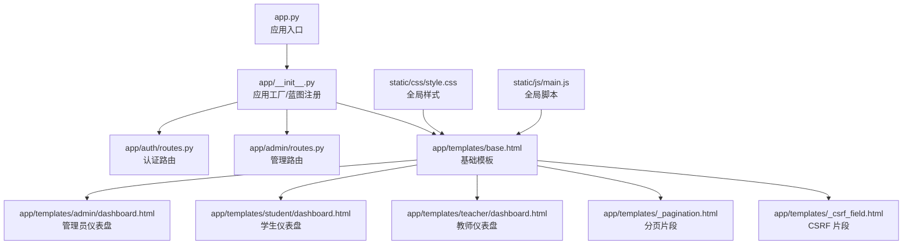
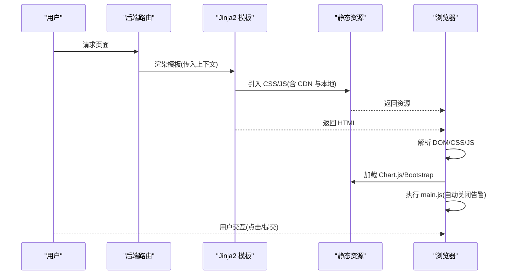
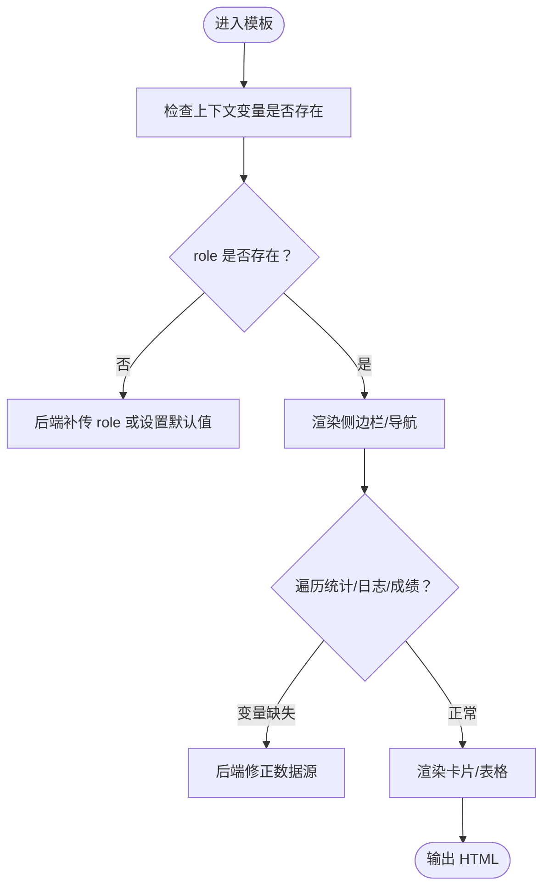
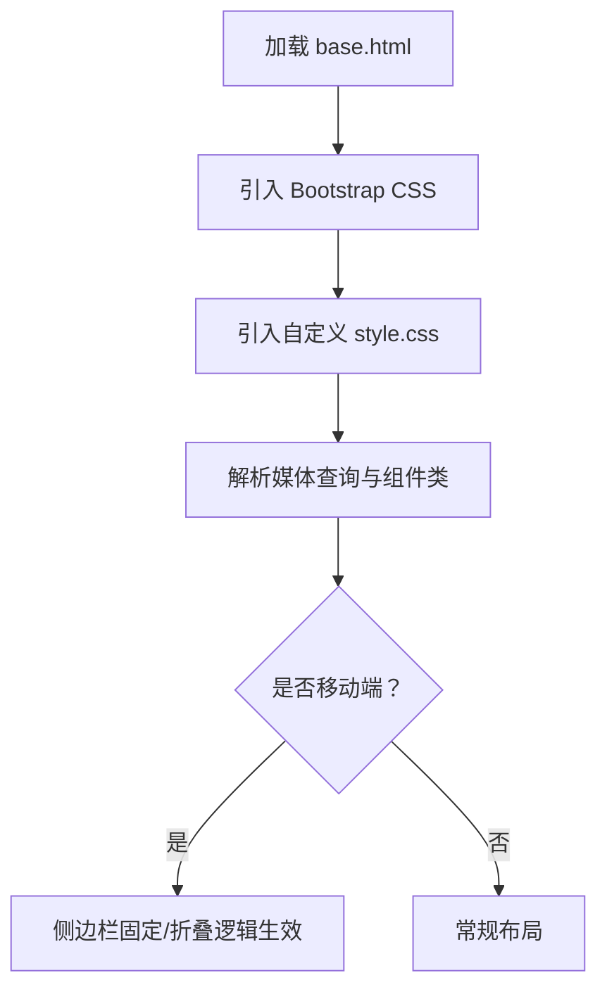
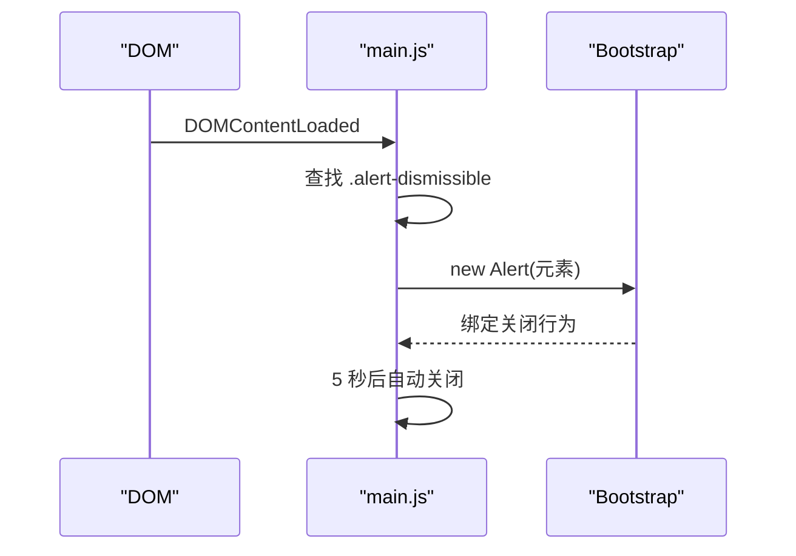
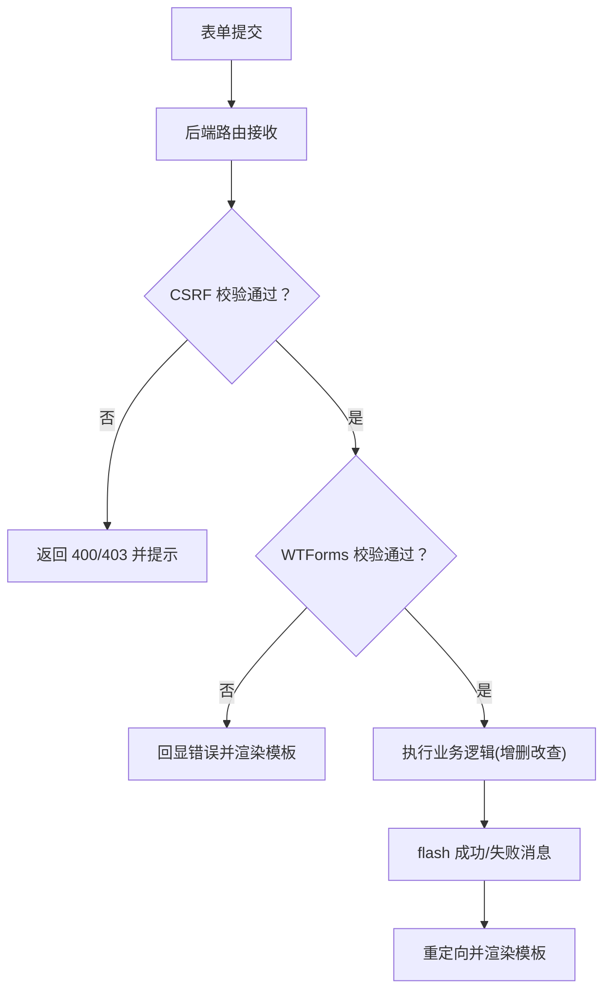
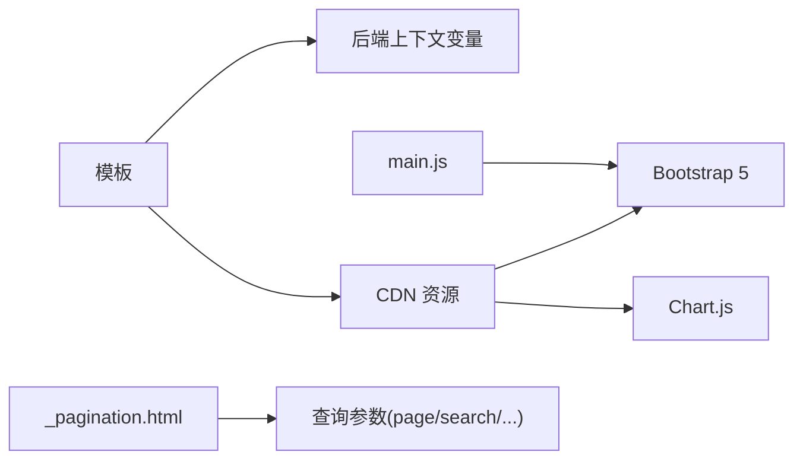

# 前端问题排查

<cite>
**本文引用的文件**
- [app.py](file://app.py)
- [app/__init__.py](file://app/__init__.py)
- [config.py](file://config.py)
- [requirements.txt](file://requirements.txt)
- [static/css/style.css](file://static/css/style.css)
- [static/js/main.js](file://static/js/main.js)
- [app/templates/base.html](file://app/templates/base.html)
- [app/templates/_pagination.html](file://app/templates/_pagination.html)
- [app/templates/_csrf_field.html](file://app/templates/_csrf_field.html)
- [app/templates/admin/dashboard.html](file://app/templates/admin/dashboard.html)
- [app/templates/student/dashboard.html](file://app/templates/student/dashboard.html)
- [app/templates/teacher/dashboard.html](file://app/templates/teacher/dashboard.html)
- [app/auth/routes.py](file://app/auth/routes.py)
- [app/auth/forms.py](file://app/auth/forms.py)
- [app/admin/routes.py](file://app/admin/routes.py)
</cite>

## 目录
1. [简介](#简介)
2. [项目结构](#项目结构)
3. [核心组件](#核心组件)
4. [架构总览](#架构总览)
5. [详细组件分析](#详细组件分析)
6. [依赖分析](#依赖分析)
7. [性能考虑](#性能考虑)
8. [故障排查指南](#故障排查指南)
9. [结论](#结论)
10. [附录](#附录)

## 简介
本指南面向前端页面与交互问题的排查，结合当前代码库的实际实现，系统讲解模板渲染、样式显示、JavaScript 功能、浏览器兼容性、静态资源加载以及表单交互等常见问题的定位与修复方法。文档同时提供可视化流程图与调试步骤，帮助快速定位问题根因。

## 项目结构
本项目采用 Flask + Jinja2 模板引擎 + Bootstrap 5 的前后端分离思路：后端负责数据与路由，前端模板负责页面结构与样式，静态资源由 CDN 或本地提供。关键目录与文件如下：
- 后端入口与应用工厂：app.py、app/__init__.py
- 配置：config.py
- 模板基页与子页：app/templates/base.html 及各角色 dashboard 与通用片段
- 静态资源：static/css/style.css、static/js/main.js
- 认证与表单：app/auth/routes.py、app/auth/forms.py
- 管理员路由与模板：app/admin/routes.py 及对应模板

**图表来源**
- [app.py:1-13](file://app.py#L1-L13)
- [app/__init__.py:29-93](file://app/__init__.py#L29-L93)
- [app/templates/base.html:1-85](file://app/templates/base.html#L1-L85)
- [app/templates/admin/dashboard.html:1-30](file://app/templates/admin/dashboard.html#L1-L30)
- [app/templates/student/dashboard.html:1-73](file://app/templates/student/dashboard.html#L1-L73)
- [app/templates/teacher/dashboard.html:1-27](file://app/templates/teacher/dashboard.html#L1-L27)
- [app/templates/_pagination.html:1-11](file://app/templates/_pagination.html#L1-L11)
- [app/templates/_csrf_field.html:1-2](file://app/templates/_csrf_field.html#L1-L2)
- [static/css/style.css:1-79](file://static/css/style.css#L1-L79)
- [static/js/main.js:1-11](file://static/js/main.js#L1-L11)

**章节来源**
- [app.py:1-13](file://app.py#L1-L13)
- [app/__init__.py:29-93](file://app/__init__.py#L29-L93)
- [config.py:1-36](file://config.py#L1-L36)

## 核心组件
- 应用工厂与蓝图注册：在应用工厂中完成 CSRF 初始化、数据库连接池、Flask-Login、错误页渲染与蓝图注册，确保模板上下文可用。
- 基础模板 base.html：统一引入 Bootstrap 5、图标字体、Chart.js、自定义样式与脚本，并提供侧边栏、导航、消息提示与块扩展机制。
- 角色仪表盘模板：分别展示管理员、教师、学生的业务数据与交互入口，使用 Bootstrap 组件与 Jinja2 循环/条件。
- 分页与 CSRF 片段：提供通用分页链接与隐藏 CSRF 字段，保证分页参数传递与安全。
- 全局脚本 main.js：自动关闭可关闭告警，依赖 Bootstrap 的 Alert 组件。
- 认证与表单：LoginForm/ RegisterForm 定义字段与校验规则，配合后端路由进行表单渲染与提交处理。

**章节来源**
- [app/__init__.py:29-93](file://app/__init__.py#L29-L93)
- [app/templates/base.html:1-85](file://app/templates/base.html#L1-L85)
- [app/templates/admin/dashboard.html:1-30](file://app/templates/admin/dashboard.html#L1-L30)
- [app/templates/student/dashboard.html:1-73](file://app/templates/student/dashboard.html#L1-L73)
- [app/templates/teacher/dashboard.html:1-27](file://app/templates/teacher/dashboard.html#L1-L27)
- [app/templates/_pagination.html:1-11](file://app/templates/_pagination.html#L1-L11)
- [app/templates/_csrf_field.html:1-2](file://app/templates/_csrf_field.html#L1-L2)
- [static/js/main.js:1-11](file://static/js/main.js#L1-L11)
- [app/auth/forms.py:1-37](file://app/auth/forms.py#L1-L37)

## 架构总览
前端渲染链路从后端路由到模板，再到静态资源与浏览器解析执行。下图展示了典型页面加载与交互的关键节点。

**图表来源**
- [app/__init__.py:76-90](file://app/__init__.py#L76-L90)
- [app/templates/base.html:7-10](file://app/templates/base.html#L7-L10)
- [app/templates/base.html:75-77](file://app/templates/base.html#L75-L77)
- [static/js/main.js:1-11](file://static/js/main.js#L1-L11)

## 详细组件分析

### 模板渲染与上下文
- 上下文变量：模板中使用 current_user、role、stats、logs、recent_grades 等变量，需确保后端正确传入。
- 块扩展：content/title/page_title 通过  机制供子模板覆盖，避免重复代码。
- 条件与循环：模板中广泛使用 if/elif/else 与 for，注意变量存在性与类型匹配。

**图表来源**
- [app/templates/base.html:13-46](file://app/templates/base.html#L13-L46)
- [app/templates/admin/dashboard.html:5-28](file://app/templates/admin/dashboard.html#L5-L28)
- [app/templates/student/dashboard.html:21-69](file://app/templates/student/dashboard.html#L21-L69)
- [app/templates/teacher/dashboard.html:6-25](file://app/templates/teacher/dashboard.html#L6-L25)

**章节来源**
- [app/templates/base.html:13-46](file://app/templates/base.html#L13-L46)
- [app/templates/admin/dashboard.html:5-28](file://app/templates/admin/dashboard.html#L5-L28)
- [app/templates/student/dashboard.html:21-69](file://app/templates/student/dashboard.html#L21-L69)
- [app/templates/teacher/dashboard.html:6-25](file://app/templates/teacher/dashboard.html#L6-L25)

### 样式与响应式布局
- 使用 Bootstrap 5 类名与栅格系统，确保移动端适配。
- 自定义样式集中于 style.css，包含侧边栏、卡片、表格、进度条、徽章、分页与打印媒体查询。
- 注意媒体查询断点与固定定位在小屏设备上的行为。

**图表来源**
- [app/templates/base.html:7-10](file://app/templates/base.html#L7-L10)
- [static/css/style.css:68-79](file://static/css/style.css#L68-L79)

**章节来源**
- [static/css/style.css:1-79](file://static/css/style.css#L1-L79)
- [app/templates/base.html:7-10](file://app/templates/base.html#L7-L10)

### JavaScript 与交互
- Chart.js：在 base.html 中引入，用于图表渲染；若页面未使用图表，可移除以减少加载。
- Bootstrap Bundle：提供弹窗、下拉菜单、告警等组件支持。
- main.js：DOMContentLoaded 时自动关闭可关闭告警，依赖 Bootstrap 的 Alert 组件。

**图表来源**
- [static/js/main.js:1-11](file://static/js/main.js#L1-L11)
- [app/templates/base.html:75-81](file://app/templates/base.html#L75-L81)

**章节来源**
- [static/js/main.js:1-11](file://static/js/main.js#L1-L11)
- [app/templates/base.html:75-81](file://app/templates/base.html#L75-L81)

### 表单与 CSRF
- CSRF 片段：_csrf_field.html 提供隐藏字段，确保 POST 提交安全。
- 表单校验：LoginForm/ RegisterForm 定义字段与验证规则，后端路由中进行校验与错误提示。
- Flash 消息：模板中通过 get_flashed_messages 渲染分类消息，配合自动关闭逻辑提升用户体验。

**图表来源**
- [app/templates/_csrf_field.html:1-2](file://app/templates/_csrf_field.html#L1-L2)
- [app/auth/forms.py:6-37](file://app/auth/forms.py#L6-L37)
- [app/auth/routes.py:33-57](file://app/auth/routes.py#L33-L57)

**章节来源**
- [app/templates/_csrf_field.html:1-2](file://app/templates/_csrf_field.html#L1-L2)
- [app/auth/forms.py:6-37](file://app/auth/forms.py#L6-L37)
- [app/auth/routes.py:33-57](file://app/auth/routes.py#L33-L57)

## 依赖分析
- 前端依赖：Bootstrap 5、Chart.js、Bootstrap Icons 通过 CDN 引入；本地 CSS/JS 作为补充。
- 后端依赖：Flask、Flask-Login、Flask-WTF、PyMySQL、Werkzeug、WTForms 等。
- 关键耦合点：模板依赖后端传入的上下文变量；main.js 依赖 Bootstrap 的 Alert 组件；分页模板依赖查询参数。

**图表来源**
- [app/templates/base.html:7-10](file://app/templates/base.html#L7-L10)
- [app/templates/base.html:75-77](file://app/templates/base.html#L75-L77)
- [static/js/main.js:1-11](file://static/js/main.js#L1-L11)
- [app/templates/_pagination.html:1-11](file://app/templates/_pagination.html#L1-L11)

**章节来源**
- [requirements.txt:1-8](file://requirements.txt#L1-L8)
- [app/templates/base.html:7-10](file://app/templates/base.html#L7-L10)
- [app/templates/base.html:75-77](file://app/templates/base.html#L75-L77)
- [static/js/main.js:1-11](file://static/js/main.js#L1-L11)
- [app/templates/_pagination.html:1-11](file://app/templates/_pagination.html#L1-L11)

## 性能考虑
- 资源合并与压缩：生产环境建议将 CSS/JS 合并与启用 gzip。
- 按需加载：仅在需要图表的页面引入 Chart.js，避免不必要的网络开销。
- CDN 选择：优先使用稳定 CDN，必要时增加回退策略。
- 图片与字体：确保字体与图标资源可用，避免阻塞渲染。
- 分页优化：对大数据集分页时，服务端分页与 SQL 限制结合，减少一次性传输。

## 故障排查指南

### 模板渲染错误
- 症状：页面空白、变量未显示、循环报错。
- 排查步骤：
  - 检查后端是否正确传入上下文变量（如 stats、logs、recent_grades、academic_alert 等）。
  - 在模板中使用条件判断避免访问不存在的键。
  - 对循环对象进行非空判断，防止空列表导致的渲染异常。
  - 使用块扩展时，确保子模板正确继承 base.html。
- 常见根因：
  - 变量名拼写错误或大小写不一致。
  - 数据库查询结果为空但模板未做保护。
  - 模板语法错误（如未闭合的块或标签）。

**章节来源**
- [app/templates/admin/dashboard.html:5-28](file://app/templates/admin/dashboard.html#L5-L28)
- [app/templates/student/dashboard.html:21-69](file://app/templates/student/dashboard.html#L21-L69)
- [app/templates/teacher/dashboard.html:6-25](file://app/templates/teacher/dashboard.html#L6-L25)

### CSS 样式显示异常
- 症状：布局错乱、侧边栏不显示、按钮/卡片样式异常。
- 排查步骤：
  - 确认 base.html 正确引入了 Bootstrap 与自定义样式。
  - 检查 style.css 中的媒体查询与固定定位在小屏设备上的表现。
  - 使用浏览器开发者工具检查元素最终计算样式，确认是否被其他样式覆盖。
  - 避免在子模板中直接覆盖全局样式，优先使用局部类名。
- 常见根因：
  - Bootstrap 版本冲突（CDN 与本地混用）。
  - 自定义样式优先级过高导致覆盖。
  - 响应式断点与设备 viewport 设置不当。

**章节来源**
- [app/templates/base.html:7-10](file://app/templates/base.html#L7-L10)
- [static/css/style.css:68-79](file://static/css/style.css#L68-L79)

### JavaScript 功能异常
- 症状：图表不显示、告警不消失、事件绑定无效。
- 排查步骤：
  - 确认 Chart.js 已正确加载且版本与文档兼容。
  - 检查 main.js 的执行时机（需等待 DOMContentLoaded）。
  - 若使用图表，确保容器元素存在且尺寸有效。
  - 使用浏览器控制台查看是否有脚本报错（如 Bootstrap 未加载导致 Alert 无法实例化）。
- 常见根因：
  - 资源加载顺序错误（先引入 JS 再引入 Bootstrap）。
  - DOM 结构变化导致选择器失效。
  - 作用域内变量未声明或命名冲突。

**章节来源**
- [app/templates/base.html:75-77](file://app/templates/base.html#L75-L77)
- [static/js/main.js:1-11](file://static/js/main.js#L1-L11)

### 浏览器兼容性问题
- 症状：部分样式/动画在某些浏览器不生效。
- 排查步骤：
  - 使用 Can I Use 检查 CSS 属性与 JavaScript API 支持范围。
  - 对不支持的特性提供降级方案（如使用更广泛的 CSS 属性）。
  - 避免使用实验性 API，或在使用前进行能力检测。
- 常见根因：
  - CSS Grid/Flexbox 在旧版浏览器中的支持差异。
  - ES6+ 语法在旧版浏览器中未转译。

### 静态资源加载问题
- 症状：CSS/JS 404、页面白屏、样式缺失。
- 排查步骤：
  - 检查 static 文件夹路径与 url_for('static', ...) 生成的链接。
  - 确认服务器可访问 static 目录，生产环境需正确配置静态资源路由。
  - 清除浏览器缓存或强制刷新，排除缓存干扰。
  - CDN 资源不可用时，准备本地回退方案。
- 常见根因：
  - 部署后静态资源路径变更。
  - 缓存头设置不当导致资源未更新。

**章节来源**
- [app/templates/base.html:9-10](file://app/templates/base.html#L9-L10)
- [app/templates/base.html:75-77](file://app/templates/base.html#L75-L77)

### 表单交互问题
- 症状：提交失败、重复提交、CSRF 失败、校验不生效。
- 排查步骤：
  - 确保模板中包含 CSRF 隐藏字段。
  - 检查 WTForms 校验器是否按预期触发，错误信息是否正确回显。
  - 使用 flash 分类消息提示用户，结合自动关闭逻辑提升体验。
  - 对重复提交场景，可在前端禁用提交按钮或在后端加幂等控制。
- 常见根因：
  - CSRF 令牌缺失或过期。
  - 表单字段名称与后端接收参数不一致。
  - 校验规则与业务期望不符。

**章节来源**
- [app/templates/_csrf_field.html:1-2](file://app/templates/_csrf_field.html#L1-L2)
- [app/auth/forms.py:6-37](file://app/auth/forms.py#L6-L37)
- [app/auth/routes.py:33-57](file://app/auth/routes.py#L33-L57)

### 浏览器开发者工具使用
- Elements：检查元素结构与最终样式，定位覆盖与定位问题。
- Network：查看静态资源与 AJAX 请求状态码与响应体，定位 404/跨域/缓存问题。
- Console：查看脚本错误与警告，定位 JS 报错与依赖缺失。
- Sources：设置断点调试 JS 执行流，确认事件绑定与回调是否触发。
- Performance/Network 面板：分析资源加载耗时与阻塞点。

## 结论
本指南基于现有代码库梳理了前端问题的常见类型与排查路径。通过规范模板上下文、合理组织静态资源、完善表单与 CSRF 保护、善用浏览器开发者工具，可显著提升问题定位效率与系统稳定性。建议在生产环境进一步完善资源压缩、CDN 回退与错误监控，持续优化用户体验。

## 附录
- 快速检查清单
  - 模板上下文变量是否完整传入？
  - base.html 是否正确引入 Bootstrap、Chart.js 与自定义样式？
  - main.js 是否在 DOMContentLoaded 后执行？
  - CSRF 隐藏字段是否存在且有效？
  - 分页链接是否携带必要的查询参数？
  - 静态资源路径与部署路径一致吗？