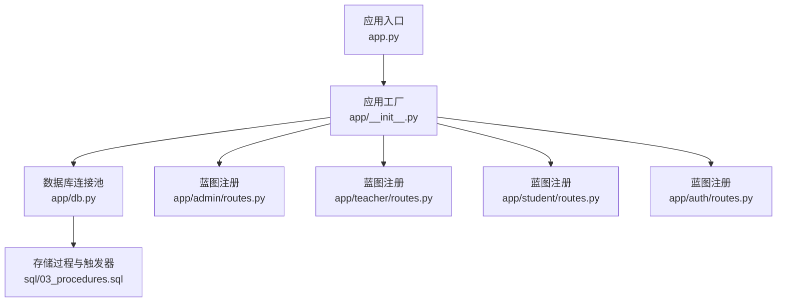
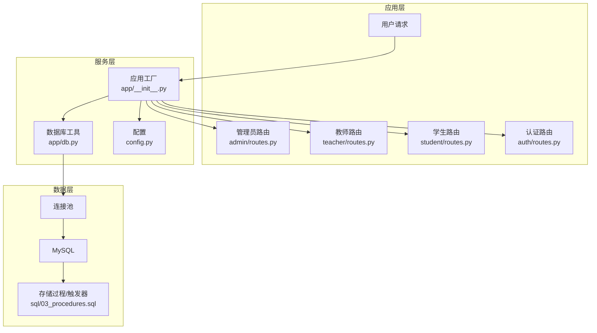
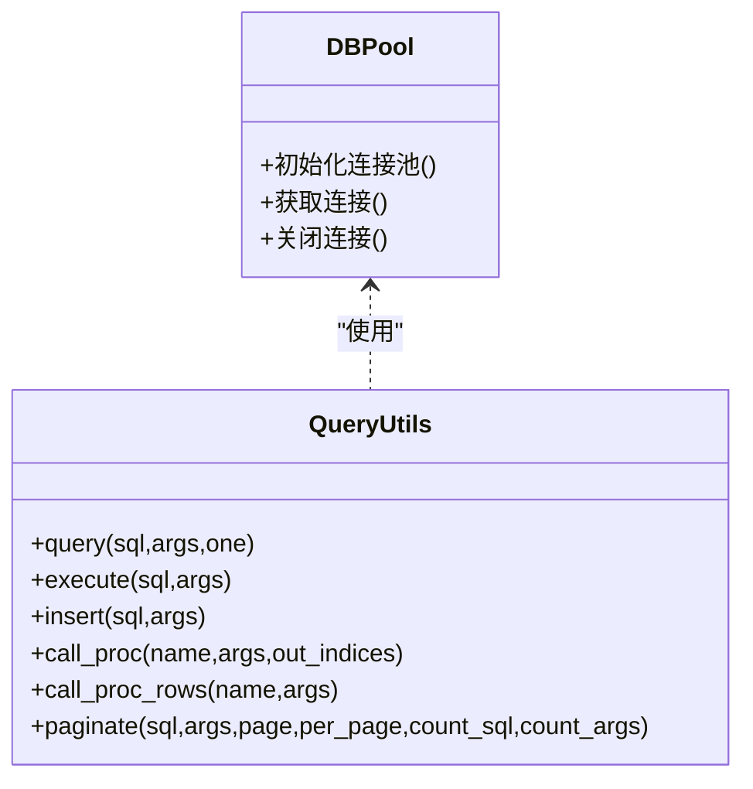
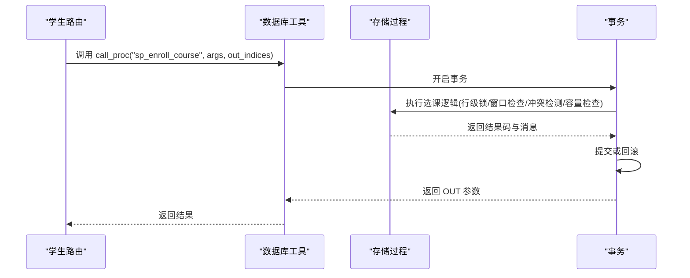
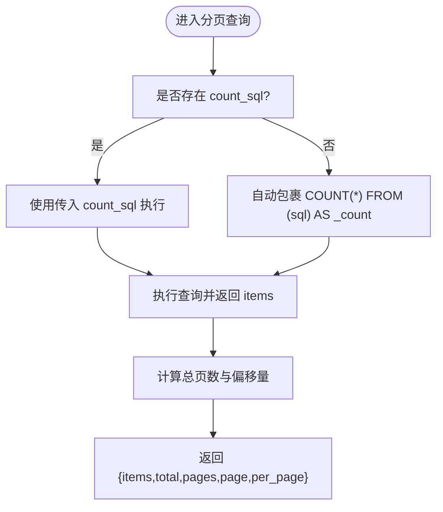
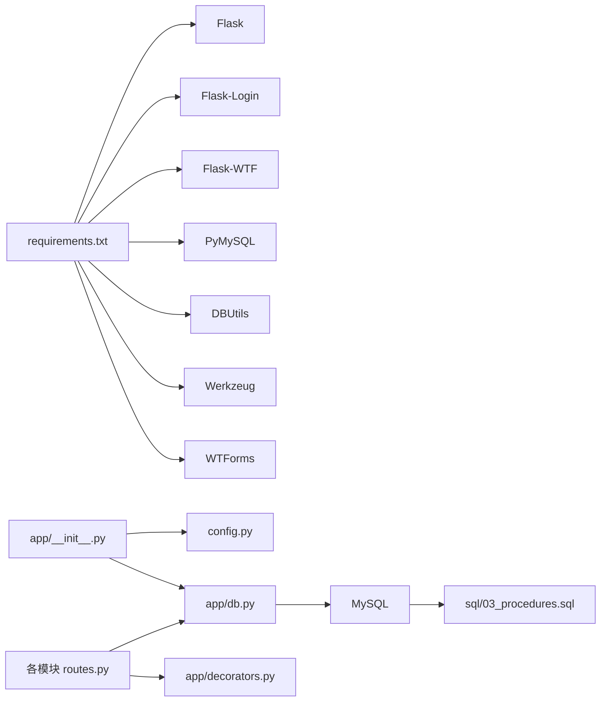

# 性能问题排查

<cite>
**本文引用的文件**
- [app.py](file://app.py)
- [config.py](file://config.py)
- [app/db.py](file://app/db.py)
- [app/__init__.py](file://app/__init__.py)
- [app/helpers.py](file://app/helpers.py)
- [app/admin/routes.py](file://app/admin/routes.py)
- [app/student/routes.py](file://app/student/routes.py)
- [app/teacher/routes.py](file://app/teacher/routes.py)
- [app/auth/routes.py](file://app/auth/routes.py)
- [sql/03_procedures.sql](file://sql/03_procedures.sql)
- [requirements.txt](file://requirements.txt)
</cite>

## 目录
1. [简介](#简介)
2. [项目结构](#项目结构)
3. [核心组件](#核心组件)
4. [架构总览](#架构总览)
5. [详细组件分析](#详细组件分析)
6. [依赖分析](#依赖分析)
7. [性能考量](#性能考量)
8. [故障排查指南](#故障排查指南)
9. [结论](#结论)
10. [附录](#附录)

## 简介
本指南面向系统运维与开发人员，围绕数据库性能、应用服务器性能、存储过程优化、系统资源监控、缓存策略问题、网络性能以及性能测试方法，提供一套可落地的排查流程与优化建议。结合代码库中的数据库连接池、分页查询、存储过程与触发器、视图统计等实现，给出针对性的定位与改进措施。

## 项目结构
- 应用入口与配置
  - 应用入口负责启动 Flask 应用，并从环境变量读取运行参数。
  - 配置集中定义数据库连接参数与连接池参数、分页参数、权重与预警阈值等。
- 数据层
  - 使用连接池封装查询工具，提供统一的查询、写入、存储过程调用与分页逻辑。
  - 提供基于游标的 DictCursor，便于以字典形式读取结果。
- 路由与业务
  - 管理员、教师、学生、认证模块分别提供不同业务场景的接口与页面。
  - 多处使用分页查询与视图统计，体现对大数据量场景的考虑。
- 存储过程与触发器
  - 实现选课、退课、成绩计算、GPA 计算、状态变更日志等核心业务逻辑，具备事务与行级锁保障。

**图表来源**
- [app.py:1-13](file://app.py#L1-L13)
- [app/__init__.py:29-93](file://app/__init__.py#L29-L93)
- [app/db.py:10-41](file://app/db.py#L10-L41)
- [app/admin/routes.py:1-692](file://app/admin/routes.py#L1-L692)
- [app/teacher/routes.py:1-333](file://app/teacher/routes.py#L1-L333)
- [app/student/routes.py:1-233](file://app/student/routes.py#L1-L233)
- [app/auth/routes.py:1-186](file://app/auth/routes.py#L1-L186)
- [sql/03_procedures.sql:1-381](file://sql/03_procedures.sql#L1-L381)

**章节来源**
- [app.py:1-13](file://app.py#L1-L13)
- [config.py:1-36](file://config.py#L1-L36)
- [app/__init__.py:29-93](file://app/__init__.py#L29-L93)

## 核心组件
- 连接池初始化与生命周期
  - 在应用工厂中初始化连接池，并在请求结束时关闭连接，避免连接泄漏。
- 查询与写入工具
  - 提供 query/execute/insert/call_proc/call_proc_rows/paginate 等通用方法，统一事务与连接管理。
- 分页与统计
  - 分页函数支持自动包裹 COUNT 或传入 count_sql，减少重复 SQL 编写。
- 存储过程与触发器
  - 选课/退课采用行级锁与事务，确保并发安全；成绩计算与 GPA 更新通过触发器自动化。

**章节来源**
- [app/db.py:10-121](file://app/db.py#L10-L121)
- [app/__init__.py:35-38](file://app/__init__.py#L35-L38)

## 架构总览
应用采用 Flask 蓝图分层组织，数据访问通过连接池统一管理，业务逻辑集中在各模块路由中。存储过程与触发器承担高并发下的原子性与一致性保障。

**图表来源**
- [app/__init__.py:29-93](file://app/__init__.py#L29-L93)
- [app/db.py:10-41](file://app/db.py#L10-L41)
- [config.py:11-25](file://config.py#L11-L25)
- [sql/03_procedures.sql:14-113](file://sql/03_procedures.sql#L14-L113)

## 详细组件分析

### 数据库连接池与查询工具
- 连接池参数
  - 最小缓存、最大缓存与最大连接数均在配置中定义，直接影响并发承载能力与资源占用。
- 生命周期管理
  - 请求上下文 g 中缓存连接，请求结束时关闭，避免长连接泄漏。
- 查询封装
  - query/execute/insert/call_proc/call_proc_rows/paginate 提供一致的 API，简化业务层代码。

**图表来源**
- [app/db.py:10-121](file://app/db.py#L10-L121)

**章节来源**
- [app/db.py:10-121](file://app/db.py#L10-L121)
- [config.py:19-25](file://config.py#L19-L25)

### 存储过程与触发器分析
- 选课存储过程
  - 使用行级锁与事务，严格校验选课窗口、时间冲突、容量上限与重复选课，保证并发安全。
- 退课存储过程
  - 同样采用行级锁与事务，检查退课窗口与成绩状态，防止误删。
- 成绩计算与 GPA
  - 触发器在更新成绩时自动计算总评与绩点，减少业务层重复逻辑。
- 日志与审计
  - 状态变更与审核动作记录系统日志，便于追踪与审计。

**图表来源**
- [app/student/routes.py:148-174](file://app/student/routes.py#L148-L174)
- [app/db.py:62-80](file://app/db.py#L62-L80)
- [sql/03_procedures.sql:14-113](file://sql/03_procedures.sql#L14-L113)

**章节来源**
- [sql/03_procedures.sql:14-113](file://sql/03_procedures.sql#L14-L113)
- [app/student/routes.py:148-174](file://app/student/routes.py#L148-L174)

### 分页与统计查询
- 分页实现
  - 自动包裹 COUNT 或使用传入 count_sql，支持自定义每页大小与手动分页。
- 统计查询
  - 管理端统计页面使用视图与聚合查询，展示选课统计、成绩分布与教师工作量等。

**图表来源**
- [app/db.py:92-121](file://app/db.py#L92-L121)
- [app/admin/routes.py:611-638](file://app/admin/routes.py#L611-L638)

**章节来源**
- [app/db.py:92-121](file://app/db.py#L92-L121)
- [app/admin/routes.py:611-638](file://app/admin/routes.py#L611-L638)

### 路由与并发处理
- 登录与角色校验
  - 路由前缀装饰器确保权限控制，降低越权风险。
- 业务路由
  - 管理员、教师、学生模块均涉及大量查询与写入，需关注连接池饱和与慢查询。
- 辅助工具
  - 解析课表冲突、获取生效选课时间段等工具，减少重复逻辑。

**章节来源**
- [app/admin/routes.py:14-18](file://app/admin/routes.py#L14-L18)
- [app/teacher/routes.py:11-15](file://app/teacher/routes.py#L11-L15)
- [app/student/routes.py:12-16](file://app/student/routes.py#L12-L16)
- [app/helpers.py:23-79](file://app/helpers.py#L23-L79)

## 依赖分析
- 外部依赖
  - Flask、Flask-Login、Flask-WTF、PyMySQL、DBUtils、Werkzeug、WTForms。
- 内部依赖
  - 应用工厂依赖配置与数据库工具；路由依赖数据库工具与装饰器；存储过程依赖数据库。

**图表来源**
- [requirements.txt:1-8](file://requirements.txt#L1-L8)
- [app/__init__.py:30-51](file://app/__init__.py#L30-L51)
- [app/db.py:10-41](file://app/db.py#L10-L41)
- [sql/03_procedures.sql:1-381](file://sql/03_procedures.sql#L1-L381)

**章节来源**
- [requirements.txt:1-8](file://requirements.txt#L1-L8)
- [app/__init__.py:30-51](file://app/__init__.py#L30-L51)

## 性能考量
- 连接池参数
  - DB_POOL_MIN_CACHED、DB_POOL_MAX_CACHED、DB_POOL_MAX_CONNECTIONS 决定并发承载与内存占用，应根据 QPS 与平均响应时间调优。
- 查询计划与索引
  - 选课/退课、成绩发布、日志查询等高频路径应建立合适的索引，避免全表扫描。
- 分页与统计
  - 大数据量分页建议使用覆盖索引与延迟关联，统计查询尽量使用物化视图或定期汇总表。
- 存储过程
  - 行级锁与事务范围需平衡一致性与吞吐；避免在存储过程中进行不必要的大结果集处理。
- 视图与触发器
  - 触发器自动计算成本由写入频率决定，需评估写放大与索引维护成本。

[本节为通用指导，不直接分析具体文件]

## 故障排查指南

### 数据库性能问题
- 慢查询识别
  - 使用数据库慢查询日志与执行计划分析工具，定位耗时 SQL；优先优化分页 COUNT、统计聚合与多表连接。
- 索引使用情况
  - 关注选课/退课、成绩发布、日志查询的关键列是否命中索引；对 LIKE '%keyword%' 的模式进行全文检索或前缀索引优化。
- 查询计划分析
  - 使用 EXPLAIN/EXPLAIN ANALYZE 查看执行路径，避免 N+1 查询与笛卡尔积。
- 连接池性能监控
  - 监控活跃连接数、等待队列长度与连接超时次数；根据业务峰值调整最大连接数与空闲回收策略。

**章节来源**
- [app/db.py:43-60](file://app/db.py#L43-L60)
- [app/db.py:92-121](file://app/db.py#L92-L121)
- [config.py:19-25](file://config.py#L19-L25)

### 应用服务器性能问题
- 内存使用过高
  - 检查模板渲染与大对象缓存；避免在请求中累积大列表；启用压缩与静态资源缓存。
- CPU 占用异常
  - 定位热点路由与循环逻辑；对频繁调用的存储过程与视图进行缓存或预计算。
- 并发处理能力不足
  - 结合连接池参数与业务峰值，评估并发请求量；必要时拆分读写分离或引入缓存中间件。

**章节来源**
- [app/__init__.py:35-38](file://app/__init__.py#L35-L38)
- [app/admin/routes.py:611-638](file://app/admin/routes.py#L611-L638)

### 存储过程性能优化
- 复杂查询优化
  - 将嵌套子查询改写为 JOIN，减少重复扫描；对大结果集分批处理。
- 递归调用问题
  - 避免在存储过程中使用递归；如确需递归，限制深度并增加超时保护。
- 临时表使用
  - 临时表会带来额外 IO 与锁竞争，优先使用派生表或物化中间结果。

**章节来源**
- [sql/03_procedures.sql:14-113](file://sql/03_procedures.sql#L14-L113)

### 系统资源监控
- 内存泄漏检测
  - 关注长生命周期对象与闭包持有；使用内存分析工具定位泄漏点。
- 文件描述符泄露
  - 确保连接池与文件句柄在异常路径也能释放；监控 fd 使用率。
- 线程池阻塞
  - 避免在请求线程中执行阻塞操作；将耗时任务放入异步队列。

[本节为通用指导，不直接分析具体文件]

### 缓存策略问题
- Redis 连接问题
  - 检查连接池大小、超时与重连策略；避免单点故障。
- 缓存穿透
  - 对空结果设置短 TTL；使用布隆过滤器拦截不存在的 key。
- 缓存雪崩
  - 为缓存项设置随机过期时间；热点数据预热与多级缓存。

[本节为通用指导，不直接分析具体文件]

### 网络性能问题
- 数据库连接超时
  - 检查网络延迟与防火墙策略；缩短连接超时与重试间隔。
- API 响应延迟
  - 分析路由层级与数据库调用链；对热点接口进行限流与缓存。
- 静态资源加载缓慢
  - 启用 CDN 与压缩；合理设置缓存头与版本控制。

[本节为通用指导，不直接分析具体文件]

### 性能测试与基准测试
- 工具选择
  - 使用压测工具模拟并发请求，覆盖登录、选课、退课、成绩发布等关键路径。
- 基准测试步骤
  - 设定基线环境与数据规模；逐步提升并发与数据量，记录响应时间与错误率；对比不同参数组合的效果。

[本节为通用指导，不直接分析具体文件]

## 结论
通过统一的连接池管理、规范的查询封装、完善的存储过程与触发器设计，以及分页与统计查询的工程化实现，系统在高并发场景下具备较好的一致性与可维护性。建议结合本文提供的排查方法与优化策略，持续监控与迭代，确保系统在业务增长中保持稳定与高效。

## 附录
- 关键配置项
  - 数据库主机、端口、用户、密码、字符集
  - 连接池最小缓存、最大缓存、最大连接数
  - 分页每页数量
  - 成绩权重与预警阈值
- 常用 SQL 优化要点
  - 为高频查询列建立合适索引
  - 避免 SELECT *
  - 使用 LIMIT 与覆盖索引
  - 减少子查询，优先 JOIN

**章节来源**
- [config.py:11-35](file://config.py#L11-L35)