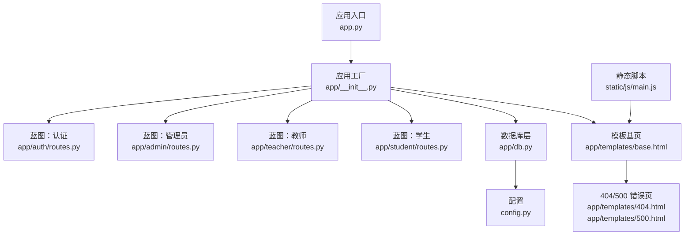
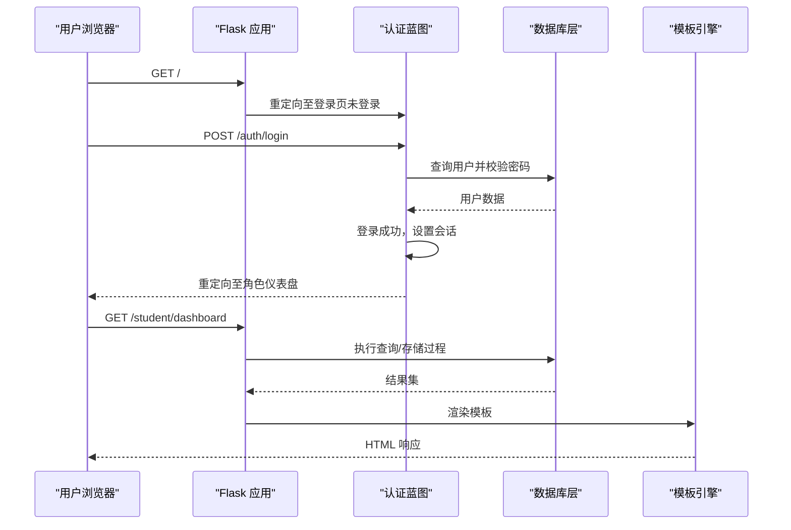
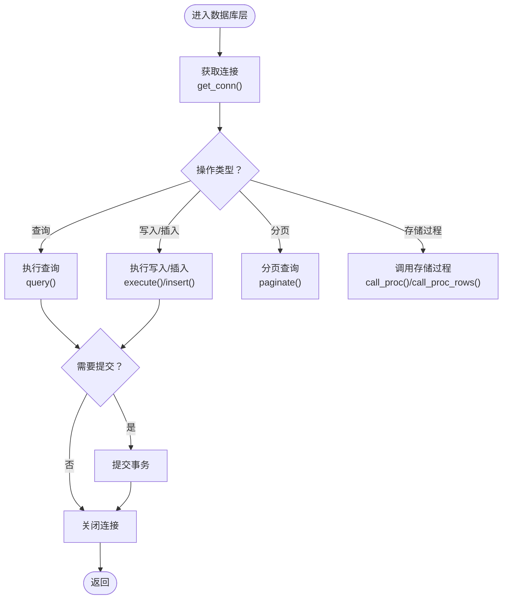
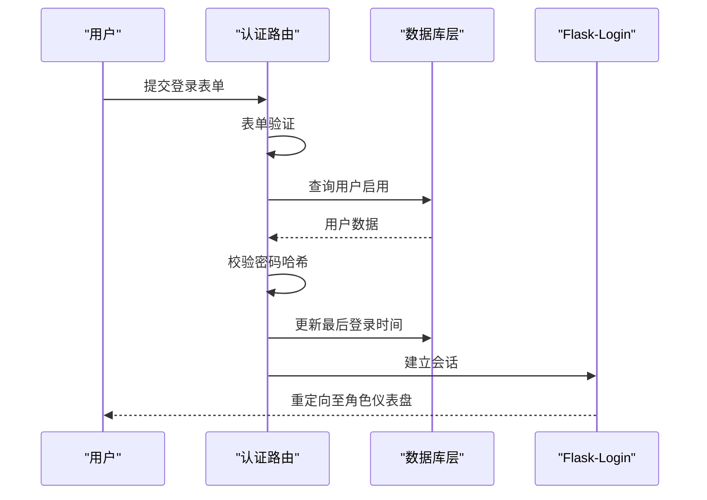
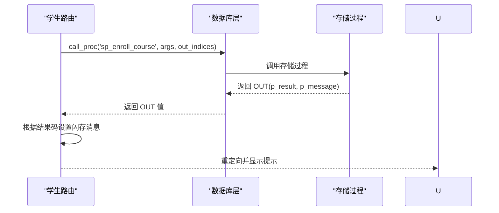
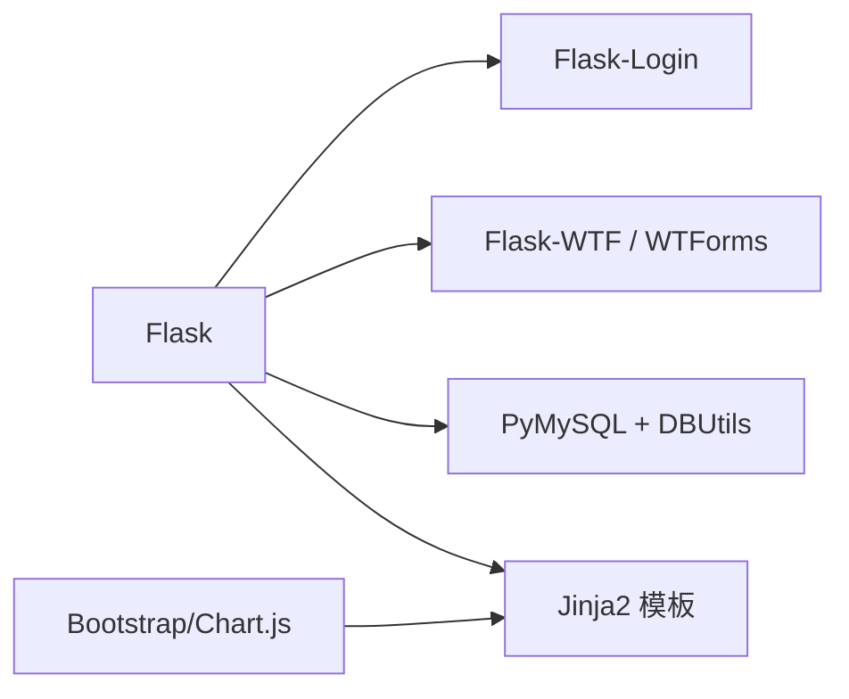

# 故障排除

<cite>
**本文引用的文件**
- [app.py](file://app.py)
- [config.py](file://config.py)
- [app/db.py](file://app/db.py)
- [app/__init__.py](file://app/__init__.py)
- [app/decorators.py](file://app/decorators.py)
- [app/auth/routes.py](file://app/auth/routes.py)
- [app/auth/forms.py](file://app/auth/forms.py)
- [app/admin/routes.py](file://app/admin/routes.py)
- [app/student/routes.py](file://app/student/routes.py)
- [app/templates/base.html](file://app/templates/base.html)
- [app/templates/404.html](file://app/templates/404.html)
- [app/templates/500.html](file://app/templates/500.html)
- [static/js/main.js](file://static/js/main.js)
- [README.md](file://README.md)
- [requirements.txt](file://requirements.txt)
- [sql/01_schema.sql](file://sql/01_schema.sql)
- [sql/03_procedures.sql](file://sql/03_procedures.sql)
</cite>

## 目录
1. [简介](#简介)
2. [项目结构](#项目结构)
3. [核心组件](#核心组件)
4. [架构总览](#架构总览)
5. [详细组件分析](#详细组件分析)
6. [依赖分析](#依赖分析)
7. [性能考虑](#性能考虑)
8. [故障排除指南](#故障排除指南)
9. [结论](#结论)
10. [附录](#附录)

## 简介
本指南面向运维与开发人员，围绕学生信息管理系统（MIS）提供系统化的故障排除方法。内容覆盖数据库连接与存储过程异常、认证与权限问题、前端模板与脚本问题、性能瓶颈与并发风险、以及监控与应急处置策略。文档以仓库现有代码为依据，结合实际可落地的诊断步骤与修复建议。

## 项目结构
系统采用 Flask 微服务风格，按功能模块划分蓝图，数据库连接通过连接池统一管理，模板基于 Jinja2，前端使用 Bootstrap 与 Chart.js。

图表来源
- [app.py:1-13](file://app.py#L1-L13)
- [app/__init__.py:29-93](file://app/__init__.py#L29-L93)
- [app/db.py:10-41](file://app/db.py#L10-L41)
- [config.py:6-36](file://config.py#L6-L36)
- [app/templates/base.html:1-85](file://app/templates/base.html#L1-L85)
- [app/templates/404.html:1-12](file://app/templates/404.html#L1-L12)
- [app/templates/500.html:1-12](file://app/templates/500.html#L1-L12)
- [static/js/main.js:1-11](file://static/js/main.js#L1-L11)

章节来源
- [README.md:46-87](file://README.md#L46-L87)
- [app.py:1-13](file://app.py#L1-L13)
- [app/__init__.py:29-93](file://app/__init__.py#L29-L93)

## 核心组件
- 应用工厂与蓝图注册：负责初始化 CSRF、数据库连接池、Flask-Login、错误页与各模块蓝图注册。
- 数据库层：封装连接池、查询、写入、分页与存储过程调用。
- 认证与权限：基于 Flask-Login 的用户加载、登录/注册/登出流程与角色校验装饰器。
- 前端模板与脚本：Bootstrap 导航、侧边栏、消息提示与自动关闭逻辑。

章节来源
- [app/__init__.py:29-93](file://app/__init__.py#L29-L93)
- [app/db.py:10-121](file://app/db.py#L10-L121)
- [app/decorators.py:7-26](file://app/decorators.py#L7-L26)
- [app/auth/routes.py:32-167](file://app/auth/routes.py#L32-L167)
- [app/templates/base.html:1-85](file://app/templates/base.html#L1-L85)

## 架构总览
系统采用“应用工厂 + 蓝图 + 连接池”的分层架构。请求从入口进入，经由蓝图路由到业务逻辑，数据库层通过连接池执行 SQL 或调用存储过程，模板渲染响应。

图表来源
- [app/__init__.py:67-75](file://app/__init__.py#L67-L75)
- [app/auth/routes.py:32-56](file://app/auth/routes.py#L32-L56)
- [app/student/routes.py:34-65](file://app/student/routes.py#L34-L65)
- [app/db.py:43-71](file://app/db.py#L43-L71)

## 详细组件分析

### 数据库层与连接池
- 连接池初始化：通过配置项设置主机、端口、账号、密码、数据库名、字符集与最大连接数。
- 连接生命周期：使用 Flask g 对象绑定连接，应用上下文结束时自动关闭。
- 查询与写入：提供通用查询、写入、插入、分页与存储过程调用封装。
- 存储过程：封装 OUT 参数读取与返回结果集的存储过程调用。

图表来源
- [app/db.py:29-121](file://app/db.py#L29-L121)
- [config.py:11-25](file://config.py#L11-L25)

章节来源
- [app/db.py:10-121](file://app/db.py#L10-L121)
- [config.py:11-25](file://config.py#L11-L25)

### 认证与权限
- 用户模型：兼容 Flask-Login 的 UserMixin，支持动态属性访问与激活状态。
- 登录流程：表单校验、用户查询、密码校验、最后登录时间更新、会话建立。
- 注册流程：唯一性校验、密码哈希、角色分支插入用户与对应身份表。
- 权限控制：装饰器 login_required 与 role_required 实现登录与角色校验。
- 错误页：403/404/500 模板用于统一错误展示。

图表来源
- [app/auth/routes.py:32-56](file://app/auth/routes.py#L32-L56)
- [app/auth/forms.py:6-37](file://app/auth/forms.py#L6-L37)
- [app/__init__.py:47-51](file://app/__init__.py#L47-L51)

章节来源
- [app/auth/routes.py:32-167](file://app/auth/routes.py#L32-L167)
- [app/auth/forms.py:6-37](file://app/auth/forms.py#L6-L37)
- [app/decorators.py:7-26](file://app/decorators.py#L7-L26)
- [app/templates/404.html:1-12](file://app/templates/404.html#L1-L12)
- [app/templates/500.html:1-12](file://app/templates/500.html#L1-L12)

### 学生模块与存储过程交互
- 选课/退课：通过存储过程执行原子操作，返回结果码与消息，前端根据消息分类提示。
- 成绩与GPA：查询已发布成绩与累计GPA，统计分析与课表展示。
- 异常处理：存储过程内部事务回滚与错误码返回，调用方捕获异常并提示。

图表来源
- [app/student/routes.py:133-144](file://app/student/routes.py#L133-L144)
- [app/db.py:62-80](file://app/db.py#L62-L80)
- [sql/03_procedures.sql:14-113](file://sql/03_procedures.sql#L14-L113)

章节来源
- [app/student/routes.py:133-159](file://app/student/routes.py#L133-L159)
- [sql/03_procedures.sql:14-113](file://sql/03_procedures.sql#L14-L113)

### 管理员模块与系统日志
- 审核与发布：对开课申请与成绩进行审核与批量发布，记录系统日志。
- 学业预警：调用存储过程获取预警列表，支持筛选与汇总。
- 分页与搜索：多处使用分页工具，提升大数据量场景下的响应效率。

章节来源
- [app/admin/routes.py:380-398](file://app/admin/routes.py#L380-L398)
- [app/admin/routes.py:491-526](file://app/admin/routes.py#L491-L526)
- [app/admin/routes.py:577-615](file://app/admin/routes.py#L577-L615)

## 依赖分析
- 后端框架：Flask 3.x 及扩展（Flask-Login、Flask-WTF、WTForms）。
- 数据库驱动：PyMySQL + DBUtils 连接池。
- 前端：Bootstrap 5、Chart.js、Jinja2 模板。

图表来源
- [requirements.txt:1-8](file://requirements.txt#L1-L8)
- [README.md:5-11](file://README.md#L5-L11)

章节来源
- [requirements.txt:1-8](file://requirements.txt#L1-L8)
- [README.md:5-11](file://README.md#L5-L11)

## 性能考虑
- 连接池参数：最小缓存、最大缓存与最大连接数直接影响并发能力与资源占用。建议根据峰值 QPS 与平均事务时长调整。
- 分页查询：默认每页条目数在配置中设定，避免一次性加载大量数据。
- 存储过程：使用显式事务与行级锁，保证一致性的同时减少死锁概率。
- 前端脚本：自动关闭提示消息，避免 DOM 堆积导致页面卡顿。

章节来源
- [config.py:19-25](file://config.py#L19-L25)
- [app/db.py:92-121](file://app/db.py#L92-L121)
- [static/js/main.js:1-11](file://static/js/main.js#L1-L11)

## 故障排除指南

### 一、数据库连接失败
- 症状
  - 应用启动时报连接错误或请求时抛出连接异常。
  - 页面出现 500 错误或长时间等待。
- 诊断步骤
  - 检查环境变量或配置文件中的数据库连接参数（主机、端口、账号、密码、数据库名、字符集）。
  - 使用命令行或图形化工具验证数据库可达性与凭据正确性。
  - 查看连接池初始化是否成功，确认最大连接数与缓存参数合理。
- 修复建议
  - 调整连接池参数以匹配并发需求。
  - 在生产环境使用专用数据库账号与强密码。
  - 如使用容器或云数据库，检查网络策略与白名单。

章节来源
- [config.py:11-17](file://config.py#L11-L17)
- [app/db.py:10-26](file://app/db.py#L10-L26)

### 二、权限错误与会话问题
- 症状
  - 访问受保护页面被重定向至登录页或返回 403。
  - 登录后仍提示未登录或角色不匹配。
- 诊断步骤
  - 确认用户状态为启用，且角色字段正确。
  - 检查 Flask-Login 的用户加载函数是否能正确查询用户。
  - 核对装饰器 login_required 与 role_required 的使用位置。
- 修复建议
  - 为被禁用用户重新启用，或清理异常会话。
  - 确保用户角色与蓝图前缀一致（如 /student、/teacher、/admin）。
  - 检查 CSRF 配置与令牌传递。

章节来源
- [app/__init__.py:40-51](file://app/__init__.py#L40-L51)
- [app/decorators.py:7-26](file://app/decorators.py#L7-L26)
- [app/templates/404.html:1-12](file://app/templates/404.html#L1-L12)

### 三、表单验证失败
- 症状
  - 注册/登录表单提交后立即返回错误提示。
  - 字段长度、格式或必填校验未通过。
- 诊断步骤
  - 检查 WTForms 表单定义与验证器配置。
  - 确认模板中是否正确渲染了闪存消息与字段错误。
- 修复建议
  - 调整验证器参数以符合业务规则。
  - 在模板中确保消息块循环渲染所有闪存消息。

章节来源
- [app/auth/forms.py:6-37](file://app/auth/forms.py#L6-L37)
- [app/auth/routes.py:58-110](file://app/auth/routes.py#L58-L110)
- [app/templates/base.html:64-69](file://app/templates/base.html#L64-L69)

### 四、数据库相关问题
- 连接池耗尽
  - 症状：请求堆积、超时或报错。
  - 处理：增加最大连接数或优化事务时长，检查是否存在未释放连接。
- SQL 语法错误
  - 症状：执行查询/写入时报错。
  - 处理：对照建表脚本与视图/存储过程定义逐项核对字段与约束。
- 存储过程异常
  - 症状：选课/退课返回错误码或抛出异常。
  - 处理：查看存储过程内部错误处理与事务回滚逻辑，定位具体条件分支。

章节来源
- [app/db.py:10-26](file://app/db.py#L10-L26)
- [sql/01_schema.sql:1-200](file://sql/01_schema.sql#L1-L200)
- [sql/03_procedures.sql:14-113](file://sql/03_procedures.sql#L14-L113)

### 五、用户认证问题
- 登录失败
  - 症状：用户名或密码错误提示。
  - 处理：确认密码哈希算法一致，检查用户是否启用。
- 会话超时
  - 症状：登录后短暂可用即跳转登录页。
  - 处理：检查会话配置与 Cookie 设置，确认中间件未拦截。
- 权限不足
  - 症状：访问其他角色页面返回 403。
  - 处理：确认用户角色与访问路径匹配，检查装饰器链路。

章节来源
- [app/auth/routes.py:32-56](file://app/auth/routes.py#L32-L56)
- [app/__init__.py:40-51](file://app/__init__.py#L40-L51)
- [app/templates/404.html:1-12](file://app/templates/404.html#L1-L12)

### 六、前端问题
- 模板渲染错误
  - 症状：页面空白或部分区域缺失。
  - 处理：检查模板继承链与块定义，确认静态资源路径正确。
- JavaScript 冲突
  - 症状：按钮无响应、侧边栏切换失效。
  - 处理：确认脚本加载顺序，避免重复引入或版本冲突。
- 样式显示异常
  - 症状：布局错位、图标不显示。
  - 处理：检查 CDN 链接与本地 CSS 路径，确认字符集与缓存。

章节来源
- [app/templates/base.html:1-85](file://app/templates/base.html#L1-L85)
- [static/js/main.js:1-11](file://static/js/main.js#L1-L11)

### 七、性能问题
- 慢查询优化
  - 使用分页工具限制结果集大小，避免全表扫描。
  - 为高频查询字段添加索引（参考建表脚本中的索引定义）。
- 内存泄漏检测
  - 关注模板渲染与静态资源缓存，避免重复创建对象。
- 并发问题排查
  - 存储过程使用行级锁与事务，减少死锁；观察连接池使用率与排队情况。

章节来源
- [app/db.py:92-121](file://app/db.py#L92-L121)
- [sql/01_schema.sql:24-200](file://sql/01_schema.sql#L24-L200)
- [sql/03_procedures.sql:33-113](file://sql/03_procedures.sql#L33-L113)

### 八、系统监控与预警
- 日志与审计
  - 利用系统日志表记录关键操作，便于回溯与审计。
- 健康检查
  - 定期检查数据库连接池状态、磁盘空间与进程 CPU/内存。
- 告警阈值
  - 将连接池使用率、慢查询比例、错误率纳入监控告警。

章节来源
- [app/admin/routes.py:529-544](file://app/admin/routes.py#L529-L544)

### 九、应急处理与数据恢复
- 应急处理
  - 降级：临时关闭高并发接口，优先保障核心流程。
  - 回滚：对最近一次变更进行回滚，恢复稳定版本。
- 数据恢复
  - 基于备份脚本顺序执行：先建表、再存储过程与视图、最后种子数据。
  - 恢复后验证关键数据完整性与索引有效性。

章节来源
- [README.md:19-27](file://README.md#L19-L27)
- [sql/01_schema.sql:1-200](file://sql/01_schema.sql#L1-L200)
- [sql/03_procedures.sql:1-200](file://sql/03_procedures.sql#L1-L200)

## 结论
本指南基于系统现有代码与配置，提供了从数据库、认证、前端到性能与监控的全链路故障排除方法。建议在生产环境中结合日志与监控体系，持续优化连接池与查询性能，并定期演练数据恢复流程，以降低故障影响面。

## 附录
- 快速启动与测试账户见项目说明。
- 依赖清单与技术栈见 README 与 requirements 文件。

章节来源
- [README.md:12-45](file://README.md#L12-L45)
- [requirements.txt:1-8](file://requirements.txt#L1-L8)