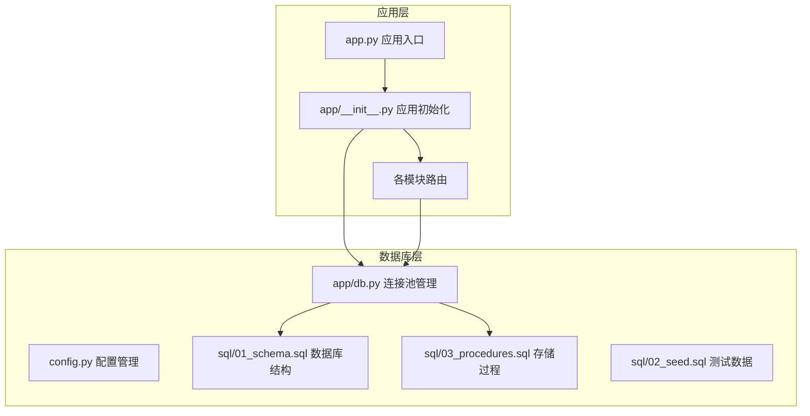
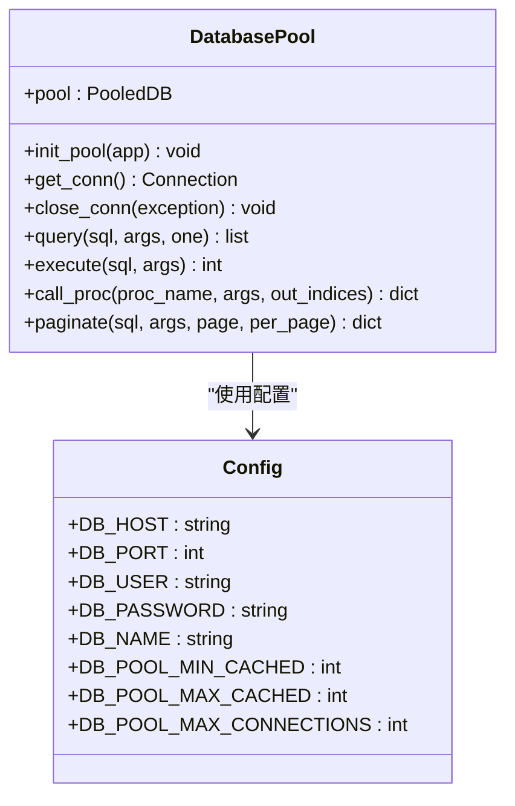
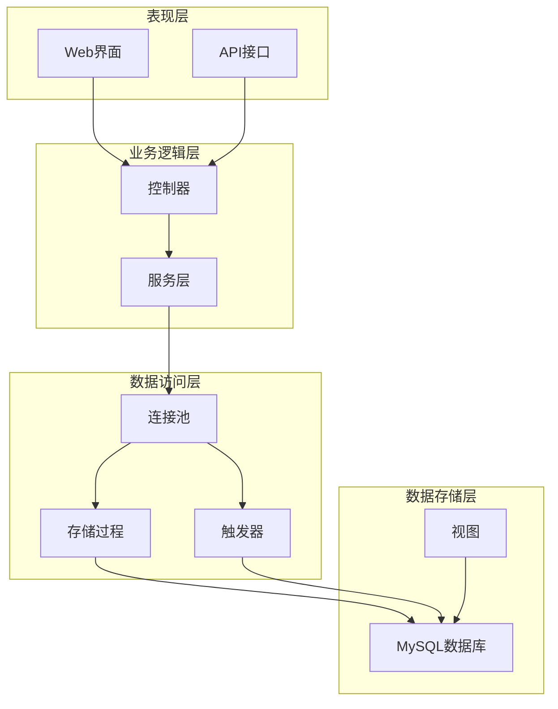
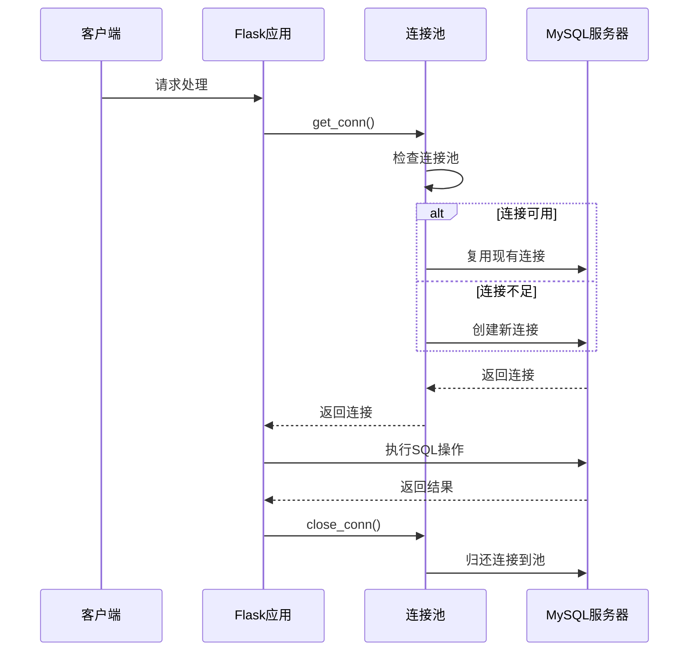
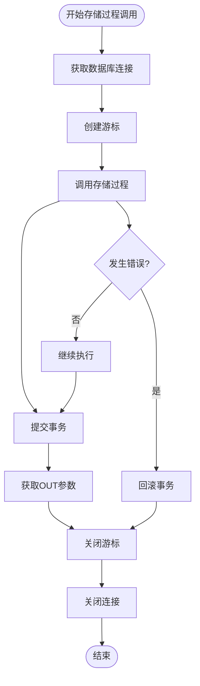
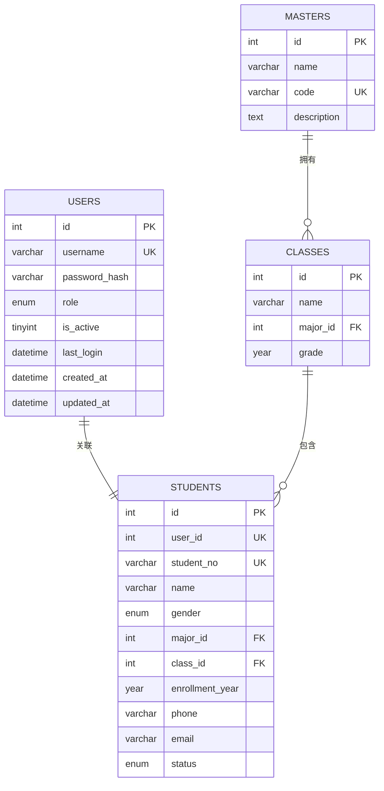
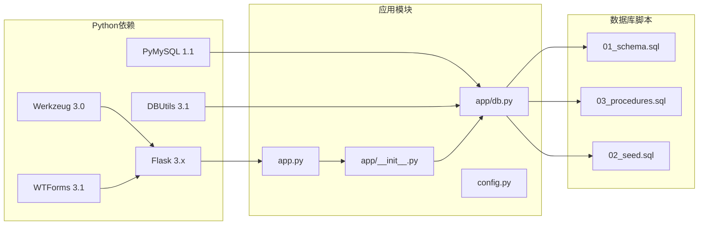

# 数据库问题排查

<cite>
**本文档引用的文件**
- [app/db.py](file://app/db.py)
- [config.py](file://config.py)
- [app/__init__.py](file://app/__init__.py)
- [app.py](file://app.py)
- [sql/01_schema.sql](file://sql/01_schema.sql)
- [sql/03_procedures.sql](file://sql/03_procedures.sql)
- [app/admin/routes.py](file://app/admin/routes.py)
- [app/student/routes.py](file://app/student/routes.py)
- [app/teacher/routes.py](file://app/teacher/routes.py)
- [requirements.txt](file://requirements.txt)
- [README.md](file://README.md)
</cite>

## 目录
1. [简介](#简介)
2. [项目结构](#项目结构)
3. [核心组件](#核心组件)
4. [架构概览](#架构概览)
5. [详细组件分析](#详细组件分析)
6. [依赖关系分析](#依赖关系分析)
7. [性能考虑](#性能考虑)
8. [故障排查指南](#故障排查指南)
9. [结论](#结论)

## 简介

本指南针对校园教务选课与成绩管理系统中的数据库相关问题提供全面的排查方法。该系统采用Flask + MySQL架构，使用PyMySQL和DBUtils连接池，实现了完整的数据库连接管理、存储过程调用和事务处理机制。

## 项目结构

系统采用模块化设计，数据库相关的核心组件分布如下：



**图表来源**
- [app.py:1-13](file://app.py#L1-L13)
- [app/__init__.py:29-93](file://app/__init__.py#L29-L93)
- [app/db.py:1-121](file://app/db.py#L1-L121)

**章节来源**
- [README.md:46-87](file://README.md#L46-L87)
- [requirements.txt:1-8](file://requirements.txt#L1-L8)

## 核心组件

### 数据库连接池管理

系统使用DBUtils的PooledDB实现连接池管理，提供高效的数据库连接复用机制：



**图表来源**
- [app/db.py:10-26](file://app/db.py#L10-L26)
- [config.py:11-22](file://config.py#L11-L22)

### 存储过程体系

系统实现了5个核心存储过程，覆盖完整的业务流程：

| 存储过程名称 | 功能描述 | 主要参数 | 返回值 |
|------------|----------|----------|--------|
| sp_enroll_course | 学生选课 | p_student_id, p_offering_id | p_result, p_message |
| sp_drop_course | 学生退课 | p_student_id, p_offering_id | p_result, p_message |
| sp_calculate_total_grade | 计算总评成绩 | p_enrollment_id | 无 |
| sp_calculate_gpa | 计算学期GPA | p_student_id, p_semester_id | p_gpa, p_total_credits, p_message |
| sp_approve_course_offering | 审核开课申请 | p_offering_id, p_admin_id, p_action | p_result, p_message |

**章节来源**
- [app/db.py:62-80](file://app/db.py#L62-L80)
- [sql/03_procedures.sql:14-113](file://sql/03_procedures.sql#L14-L113)

## 架构概览

系统采用三层架构模式，数据库层通过连接池统一管理：



**图表来源**
- [app/__init__.py:29-93](file://app/__init__.py#L29-L93)
- [app/db.py:10-26](file://app/db.py#L10-L26)

## 详细组件分析

### 连接池配置与管理

系统使用DBUtils的PooledDB实现连接池，支持最小缓存、最大缓存和最大连接数的灵活配置：



**图表来源**
- [app/db.py:29-40](file://app/db.py#L29-L40)
- [app/__init__.py:35-38](file://app/__init__.py#L35-L38)

### 存储过程调用流程

系统通过call_proc方法统一管理存储过程调用，支持OUT参数的获取：



**图表来源**
- [app/db.py:62-70](file://app/db.py#L62-L70)

**章节来源**
- [app/db.py:10-26](file://app/db.py#L10-L26)
- [app/db.py:62-80](file://app/db.py#L62-L80)

### 数据库表结构分析

系统包含12张核心表，采用完整的外键约束和索引设计：



**图表来源**
- [sql/01_schema.sql:15-77](file://sql/01_schema.sql#L15-L77)

**章节来源**
- [sql/01_schema.sql:1-235](file://sql/01_schema.sql#L1-L235)

## 依赖关系分析

系统的关键依赖关系如下：



**图表来源**
- [requirements.txt:1-8](file://requirements.txt#L1-L8)
- [app.py:1-13](file://app.py#L1-L13)

**章节来源**
- [requirements.txt:1-8](file://requirements.txt#L1-L8)
- [app/__init__.py:29-93](file://app/__init__.py#L29-L93)

## 性能考虑

### 连接池性能优化

系统配置了合理的连接池参数：
- 最小缓存连接：2个
- 最大缓存连接：10个  
- 最大连接数：20个
- 字符集：utf8mb4

### 锁机制与并发控制

存储过程使用行级锁确保数据一致性：
- 使用`FOR UPDATE`锁定相关记录
- 在事务边界内执行原子操作
- 避免死锁和长时间持有锁

### 索引优化策略

关键表的索引设计：
- 主键索引：自动为主键创建
- 唯一索引：用户名、学号、课程唯一标识
- 外键索引：关联字段建立索引
- 复合索引：常用查询条件组合

## 故障排查指南

### 数据库连接失败诊断

#### 1. 连接字符串配置错误

**症状表现**：
- 应用启动时报连接错误
- 数据库操作超时
- 连接池初始化失败

**诊断步骤**：
1. 检查环境变量配置
2. 验证数据库主机和端口
3. 确认数据库名称正确性
4. 验证用户凭据有效性

**解决方案**：
```python
# 检查配置项
DB_HOST = os.environ.get('DB_HOST') or 'localhost'
DB_PORT = int(os.environ.get('DB_PORT') or 3306)
DB_USER = os.environ.get('DB_USER') or 'root'
DB_PASSWORD = os.environ.get('DB_PASSWORD') or '123456'
DB_NAME = os.environ.get('DB_NAME') or 'mis_system'
```

#### 2. 网络连接问题

**症状表现**：
- 连接超时错误
- 连接被拒绝
- 网络不可达

**诊断方法**：
1. 使用telnet测试端口连通性
2. 检查防火墙设置
3. 验证MySQL服务状态
4. 测试DNS解析

#### 3. MySQL服务状态检查

**检查命令**：
```bash
# 检查MySQL服务状态
sudo systemctl status mysql

# 检查端口监听
netstat -tlnp | grep 3306

# 测试数据库连接
mysql -h localhost -P 3306 -u root -p
```

**章节来源**
- [config.py:12-17](file://config.py#L12-L17)
- [app/db.py:10-26](file://app/db.py#L10-L26)

### 连接池问题排查

#### 1. 连接池耗尽

**症状表现**：
- "Too many connections"错误
- 应用响应缓慢
- 新连接请求被拒绝

**诊断方法**：
1. 监控连接池使用情况
2. 检查连接泄漏
3. 分析并发请求模式

**解决方案**：
```python
# 调整连接池配置
DB_POOL_MIN_CACHED = 5
DB_POOL_MAX_CACHED = 20
DB_POOL_MAX_CONNECTIONS = 50
```

#### 2. 连接泄漏问题

**症状表现**：
- 连接数持续增长
- 内存使用增加
- 最终导致连接池耗尽

**诊断步骤**：
1. 检查每个请求后的连接关闭
2. 确保异常处理中的连接释放
3. 监控g对象中的连接状态

**解决方案**：
```python
@app.teardown_appcontext
def close_db(error):
    """确保数据库连接正确关闭"""
    conn = g.pop('db_conn', None)
    if conn is not None:
        conn.close()
```

#### 3. 超时设置不当

**症状表现**：
- 查询超时错误
- 长时间阻塞
- 事务超时

**诊断方法**：
1. 分析慢查询日志
2. 检查索引使用情况
3. 监控锁等待时间

**章节来源**
- [app/db.py:36-40](file://app/db.py#L36-L40)
- [config.py:20-22](file://config.py#L20-L22)

### SQL语句执行错误排查

#### 1. 语法错误诊断

**常见语法错误类型**：
- 缺少分号或逗号
- 引号不匹配
- 关键字拼写错误
- 表名或列名不存在

**诊断方法**：
1. 使用MySQL客户端验证SQL
2. 检查参数绑定
3. 验证数据类型匹配

#### 2. 权限不足问题

**症状表现**：
- "Access denied"错误
- 无法执行特定操作
- 存储过程调用失败

**诊断步骤**：
1. 检查数据库用户权限
2. 验证存储过程权限
3. 确认视图访问权限

#### 3. 约束冲突问题

**外键约束冲突**：
- 删除父表记录时报错
- 插入子表记录失败
- 更新外键字段冲突

**主键/唯一约束冲突**：
- 重复插入主键
- 违反唯一约束
- 唯一索引冲突

**章节来源**
- [sql/01_schema.sql:47-76](file://sql/01_schema.sql#L47-L76)

### 存储过程和触发器异常处理

#### 1. 参数传递错误

**症状表现**：
- 存储过程调用失败
- 参数类型不匹配
- OUT参数获取失败

**诊断方法**：
1. 验证参数数量和顺序
2. 检查参数数据类型
3. 确认OUT参数索引正确

**解决方案**：
```python
# 正确的存储过程调用
result = call_proc('sp_enroll_course', 
                  (student_id, offering_id, 0, ''), 
                  [2, 3])
```

#### 2. 事务回滚问题

**症状表现**：
- 数据不一致
- 部分操作未生效
- 错误状态未恢复

**诊断步骤**：
1. 检查存储过程中的异常处理
2. 验证事务边界
3. 确认回滚逻辑

**章节来源**
- [sql/03_procedures.sql:26-31](file://sql/03_procedures.sql#L26-L31)
- [app/db.py:62-70](file://app/db.py#L62-L70)

### 数据库性能问题分析

#### 1. 慢查询识别

**诊断工具**：
```sql
-- 查看慢查询日志
SHOW VARIABLES LIKE 'slow_query_log';
SHOW VARIABLES LIKE 'long_query_time';

-- 分析查询执行计划
EXPLAIN SELECT * FROM enrollments WHERE student_id = ?;
```

**优化建议**：
1. 为常用查询字段添加索引
2. 优化复杂查询的WHERE条件
3. 减少不必要的JOIN操作

#### 2. 索引优化

**索引使用分析**：
- 检查索引命中率
- 分析查询执行计划
- 识别缺失的索引

**索引创建建议**：
```sql
-- 为高频查询字段创建索引
CREATE INDEX idx_enrollment_student ON enrollments(student_id);
CREATE INDEX idx_enrollment_status ON enrollments(status);
CREATE INDEX idx_grade_enrollment ON grades(enrollment_id);
```

#### 3. 锁等待问题

**症状表现**：
- 查询长时间阻塞
- 锁等待超时
- 死锁错误

**诊断方法**：
1. 使用`SHOW ENGINE INNODB STATUS`查看锁信息
2. 检查长事务
3. 分析锁竞争情况

**章节来源**
- [sql/03_procedures.sql:35-40](file://sql/03_procedures.sql#L35-L40)

### 数据一致性问题排查

#### 1. 外键约束冲突

**症状表现**：
- 删除/更新操作失败
- 数据完整性破坏
- 外键约束违反

**诊断步骤**：
1. 检查相关表的数据关系
2. 验证外键约束定义
3. 分析数据删除顺序

#### 2. 数据重复问题

**症状表现**：
- 唯一约束冲突
- 重复记录出现
- 数据去重困难

**解决方案**：
```sql
-- 查找重复记录
SELECT column_name, COUNT(*) 
FROM table_name 
GROUP BY column_name 
HAVING COUNT(*) > 1;

-- 删除重复记录保留最新
DELETE t1 FROM table_name t1
INNER JOIN table_name t2 
WHERE t1.id < t2.id AND t1.column_name = t2.column_name;
```

#### 3. 事务隔离级别问题

**症状表现**：
- 脏读现象
- 不可重复读
- 幻读问题

**解决方案**：
1. 调整事务隔离级别
2. 使用适当的锁机制
3. 重新设计查询逻辑

**章节来源**
- [sql/01_schema.sql:47-76](file://sql/01_schema.sql#L47-L76)

### 错误代码对照表

| 错误类型 | 错误代码 | 可能原因 | 解决方案 |
|---------|---------|---------|---------|
| 连接错误 | 2003 | MySQL服务未启动 | 启动MySQL服务 |
| 连接错误 | 1045 | 用户名或密码错误 | 验证认证信息 |
| 连接错误 | 2006 | MySQL服务器已失联 | 检查网络连接 |
| 连接错误 | 1153 | 连接超时 | 增加超时设置 |
| 连接错误 | 1040 | 连接数过多 | 调整连接池配置 |
| SQL语法错误 | 1064 | 语法错误 | 检查SQL语法 |
| 权限错误 | 13 | 访问被拒绝 | 检查用户权限 |
| 外键错误 | 1452 | 外键约束冲突 | 检查关联数据 |
| 唯一约束错误 | 1062 | 重复键值 | 检查唯一性 |
| 事务错误 | 1213 | 死锁 | 重新执行事务 |
| 存储过程错误 | 1305 | 过程不存在 | 检查过程定义 |

## 结论

本数据库问题排查指南涵盖了从连接配置到性能优化的完整排查流程。通过系统化的诊断方法和针对性的解决方案，可以有效解决大多数数据库相关问题。建议在实际部署中：

1. 建立完善的监控机制
2. 定期进行性能分析
3. 制定应急响应预案
4. 持续优化数据库配置

这些实践将有助于确保系统的稳定运行和良好的用户体验。