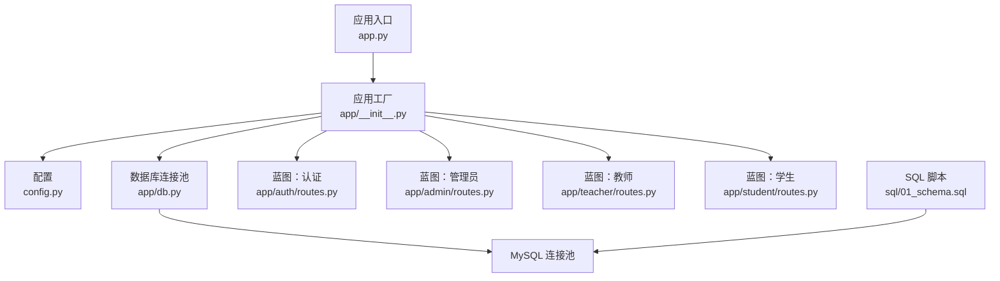
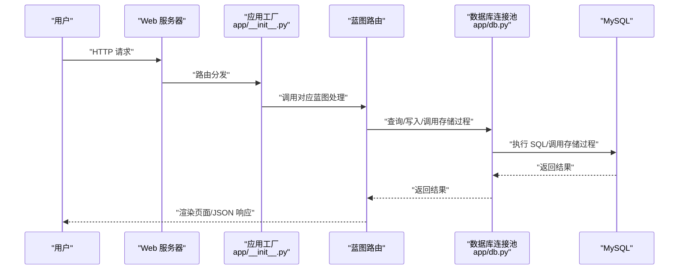
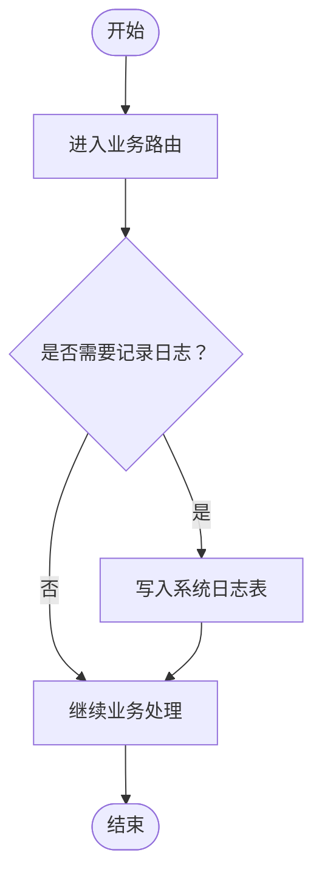
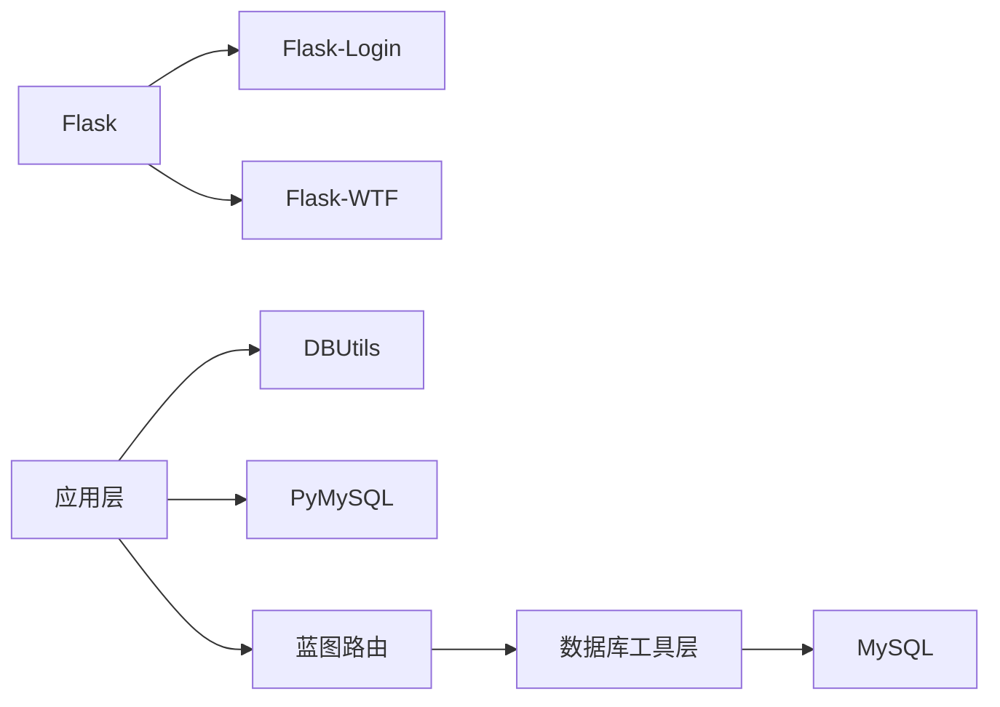

# 系统监控与预警

<cite>
**本文引用的文件**
- [app.py](file://app.py)
- [config.py](file://config.py)
- [requirements.txt](file://requirements.txt)
- [README.md](file://README.md)
- [app/__init__.py](file://app/__init__.py)
- [app/db.py](file://app/db.py)
- [app/decorators.py](file://app/decorators.py)
- [app/admin/routes.py](file://app/admin/routes.py)
- [app/auth/routes.py](file://app/auth/routes.py)
- [app/student/routes.py](file://app/student/routes.py)
- [app/teacher/routes.py](file://app/teacher/routes.py)
- [sql/01_schema.sql](file://sql/01_schema.sql)
</cite>

## 目录
1. [简介](#简介)
2. [项目结构](#项目结构)
3. [核心组件](#核心组件)
4. [架构总览](#架构总览)
5. [详细组件分析](#详细组件分析)
6. [依赖分析](#依赖分析)
7. [性能考虑](#性能考虑)
8. [故障排查指南](#故障排查指南)
9. [结论](#结论)
10. [附录](#附录)

## 简介
本指南面向“系统监控与预警”的落地实施，结合本项目的实际代码结构与数据库设计，给出日志系统配置与分析、关键指标监控、告警机制、健康检查、性能基线与异常检测、备份与恢复监控、监控工具与可视化建议。文档以“可操作”为目标，既适合技术读者也适合非技术读者快速上手。

## 项目结构
本项目采用 Flask 微服务风格的单体应用，核心由应用入口、配置、数据库连接池、蓝图路由与 SQL 脚本组成。数据库层使用 PyMySQL + DBUtils 连接池，并通过存储过程与视图支撑核心业务流程。

图表来源
- [app.py:1-13](file://app.py#L1-L13)
- [app/__init__.py:29-93](file://app/__init__.py#L29-L93)
- [config.py:6-36](file://config.py#L6-L36)
- [app/db.py:10-26](file://app/db.py#L10-L26)
- [sql/01_schema.sql:1-200](file://sql/01_schema.sql#L1-L200)

章节来源
- [app.py:1-13](file://app.py#L1-L13)
- [app/__init__.py:29-93](file://app/__init__.py#L29-L93)
- [config.py:6-36](file://config.py#L6-L36)
- [app/db.py:10-26](file://app/db.py#L10-L26)
- [README.md:46-69](file://README.md#L46-L69)

## 核心组件
- 应用工厂与蓝图注册：集中初始化 CSRF、登录管理、数据库连接池与蓝图注册，统一错误处理。
- 配置中心：集中管理数据库连接参数、连接池参数、分页参数与业务阈值。
- 数据库连接池：基于 DBUtils 的 PooledDB，支持最小缓存、最大缓存与最大连接数。
- 日志与审计：系统日志表用于记录用户行为，支持分页与过滤，便于审计与问题追踪。
- 关键业务：选课、退课、成绩录入与发布、学业预警等均通过存储过程与视图完成，便于监控与审计。

章节来源
- [app/__init__.py:29-93](file://app/__init__.py#L29-L93)
- [config.py:6-36](file://config.py#L6-L36)
- [app/db.py:10-26](file://app/db.py#L10-L26)
- [app/admin/routes.py:585-609](file://app/admin/routes.py#L585-L609)
- [sql/01_schema.sql:1-200](file://sql/01_schema.sql#L1-L200)

## 架构总览
系统监控与预警应覆盖“日志采集—指标聚合—异常检测—告警通知—恢复验证”的闭环。下图展示从请求到数据库的关键路径与监控点位。

图表来源
- [app/__init__.py:29-93](file://app/__init__.py#L29-L93)
- [app/db.py:43-80](file://app/db.py#L43-L80)
- [app/admin/routes.py:43-58](file://app/admin/routes.py#L43-L58)

## 详细组件分析

### 日志系统配置与分析
- 系统日志表结构：包含操作类型、用户 ID、目标对象、时间戳等字段，支持分页与按操作类型过滤。
- 日志采集：在各业务路由中统一调用日志记录函数，确保关键操作可追溯。
- 日志分析：
  - 按操作类型统计高频动作，识别异常批量操作。
  - 结合用户维度分析权限滥用或越权行为。
  - 将日志接入集中式日志平台进行检索与可视化。

图表来源
- [app/admin/routes.py:585-609](file://app/admin/routes.py#L585-L609)

章节来源
- [app/admin/routes.py:585-609](file://app/admin/routes.py#L585-L609)
- [sql/01_schema.sql:1-200](file://sql/01_schema.sql#L1-L200)

### 关键指标监控方案
- 数据库连接数
  - 指标：活跃连接数、空闲连接数、最大连接使用率。
  - 来源：连接池配置与运行时统计。
  - 告警：超过阈值（如最大连接的 80%）触发预警。
- 响应时间
  - 指标：P50/P95/P99 响应时间、慢查询占比。
  - 来源：Web 服务器与数据库慢查询日志。
  - 告警：响应时间超阈或慢查询突增。
- 错误率
  - 指标：HTTP 5xx 错误率、业务异常（存储过程返回码）。
  - 来源：应用错误处理与业务返回码。
  - 告警：错误率上升或特定错误码激增。
- 用户活跃度
  - 指标：日活跃用户数、会话时长、关键操作频次。
  - 来源：登录日志与系统日志。
  - 告警：活跃度断崖式下降。

章节来源
- [config.py:19-25](file://config.py#L19-L25)
- [app/__init__.py:76-91](file://app/__init__.py#L76-L91)
- [app/admin/routes.py:43-58](file://app/admin/routes.py#L43-L58)

### 告警机制配置
- 阈值设置
  - 连接数：高水位线设为最大连接数的 80%，低水位线设为 50%。
  - 响应时间：P95 超过 2 秒，慢查询占比超过 5%。
  - 错误率：5xx 错误率超过 1%，业务异常码超过 2%。
  - 活跃度：日活环比下降超过 20%。
- 告警级别
  - 信息：连接池预热、慢查询回归。
  - 警告：接近阈值。
  - 严重：超过阈值持续 5 分钟。
- 通知方式
  - 邮件、即时通讯群机器人、电话（严重级别）。
- 故障自愈
  - 连接池扩容/缩容、重启应用进程、降级非关键接口。

章节来源
- [config.py:19-25](file://config.py#L19-L25)
- [app/__init__.py:76-91](file://app/__init__.py#L76-L91)

### 系统健康检查
- 数据库连通性
  - 周期性执行简单查询（如 SELECT 1），失败则告警。
- 服务可用性
  - 对根路径或健康端点发起探测，检查 HTTP 状态码与响应时间。
- 资源使用率
  - CPU、内存、磁盘 IO、网络带宽。
- 业务健康
  - 关键存储过程执行成功率、视图查询耗时。

章节来源
- [app/db.py:43-80](file://app/db.py#L43-L80)
- [app/__init__.py:67-75](file://app/__init__.py#L67-L75)

### 性能基线与异常检测
- 建立基线
  - 历史数据：按天/小时聚合关键指标，形成基准曲线。
  - 周期性：每周/每月滚动更新。
- 异常检测
  - 统计模型：3σ、IQR、孤立森林。
  - 机器学习：LSTM/Prophet 进行趋势预测与异常识别。
- 行为识别
  - 登录/登出频率异常、批量操作异常、越权访问尝试。

章节来源
- [app/admin/routes.py:612-639](file://app/admin/routes.py#L612-L639)
- [app/student/routes.py:148-174](file://app/student/routes.py#L148-L174)
- [app/teacher/routes.py:194-220](file://app/teacher/routes.py#L194-L220)

### 数据备份与恢复监控
- 备份任务执行状态
  - 备份脚本/命令输出解析，记录开始/结束时间、大小、状态。
- 数据完整性验证
  - 校验和/哈希校验、抽样查询一致性。
- 灾难恢复演练
  - 定期演练恢复流程，记录恢复时间与数据一致性。

章节来源
- [README.md:19-27](file://README.md#L19-L27)

### 监控工具与可视化
- 工具选择
  - Prometheus + Grafana：指标采集与可视化。
  - ELK/EFK：日志采集、检索与可视化。
  - Zabbix/Nagios：主机与服务健康检查。
  - APM：如 New Relic/AppDynamics，观测应用性能。
- 可视化建议
  - 仪表盘：连接数、错误率、响应时间、活跃用户、慢查询。
  - 告警面板：实时告警列表与历史趋势。

章节来源
- [requirements.txt:1-8](file://requirements.txt#L1-L8)
- [README.md:5-11](file://README.md#L5-L11)

## 依赖分析
- 应用依赖
  - Flask、Flask-Login、Flask-WTF、Werkzeug、WTForms。
  - PyMySQL、DBUtils：数据库驱动与连接池。
- 组件耦合
  - 路由层依赖数据库工具层；数据库工具层依赖配置与连接池。
- 外部依赖
  - MySQL：作为主数据存储，承载业务数据与日志。

图表来源
- [requirements.txt:1-8](file://requirements.txt#L1-L8)
- [app/db.py:2-4](file://app/db.py#L2-L4)
- [app/__init__.py:29-93](file://app/__init__.py#L29-L93)

章节来源
- [requirements.txt:1-8](file://requirements.txt#L1-L8)
- [app/db.py:2-4](file://app/db.py#L2-L4)
- [app/__init__.py:29-93](file://app/__init__.py#L29-L93)

## 性能考虑
- 连接池优化
  - 合理设置最小缓存、最大缓存与最大连接数，避免连接不足或过度占用。
  - 在应用关闭阶段显式释放连接，防止泄漏。
- 查询优化
  - 使用分页与索引，避免全表扫描。
  - 对热点视图与存储过程进行性能剖析与优化。
- 缓存策略
  - 对静态数据与热点查询引入缓存，降低数据库压力。
- 异步处理
  - 将非关键任务异步化，减少请求延迟。

章节来源
- [config.py:19-25](file://config.py#L19-L25)
- [app/db.py:92-121](file://app/db.py#L92-L121)

## 故障排查指南
- 常见错误与处理
  - 403/404/500：统一错误页面与日志记录，定位具体路由与异常堆栈。
  - 数据库连接失败：检查连接池配置、网络连通性与 MySQL 服务状态。
  - 业务异常：根据存储过程返回码与日志定位问题环节。
- 排查步骤
  - 快速确认：健康检查、日志检索、指标面板。
  - 深入分析：慢查询、锁等待、事务回滚。
  - 回归验证：修复后验证指标恢复与业务功能正常。

章节来源
- [app/__init__.py:76-91](file://app/__init__.py#L76-L91)
- [app/db.py:36-41](file://app/db.py#L36-L41)
- [app/admin/routes.py:414-432](file://app/admin/routes.py#L414-L432)

## 结论
通过将日志、指标、告警与健康检查体系化落地，结合连接池与存储过程的可观测性，可以有效保障系统稳定性与可维护性。建议优先完善日志与关键指标采集，再逐步引入异常检测与自动化恢复能力，最终形成闭环的监控与预警体系。

## 附录
- 快速启动与环境准备
  - 安装依赖、初始化数据库、配置环境变量后启动应用。
- 数据库设计要点
  - 12 张核心表、存储过程、触发器与视图，支撑完整业务生命周期。

章节来源
- [README.md:12-36](file://README.md#L12-L36)
- [sql/01_schema.sql:1-200](file://sql/01_schema.sql#L1-L200)