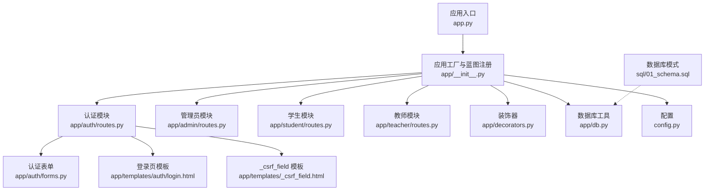
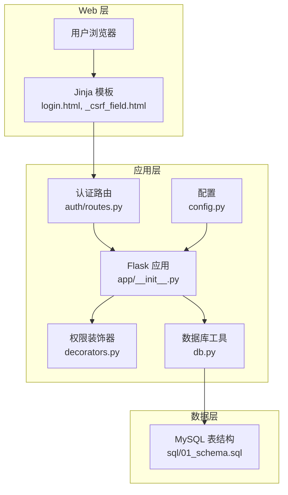
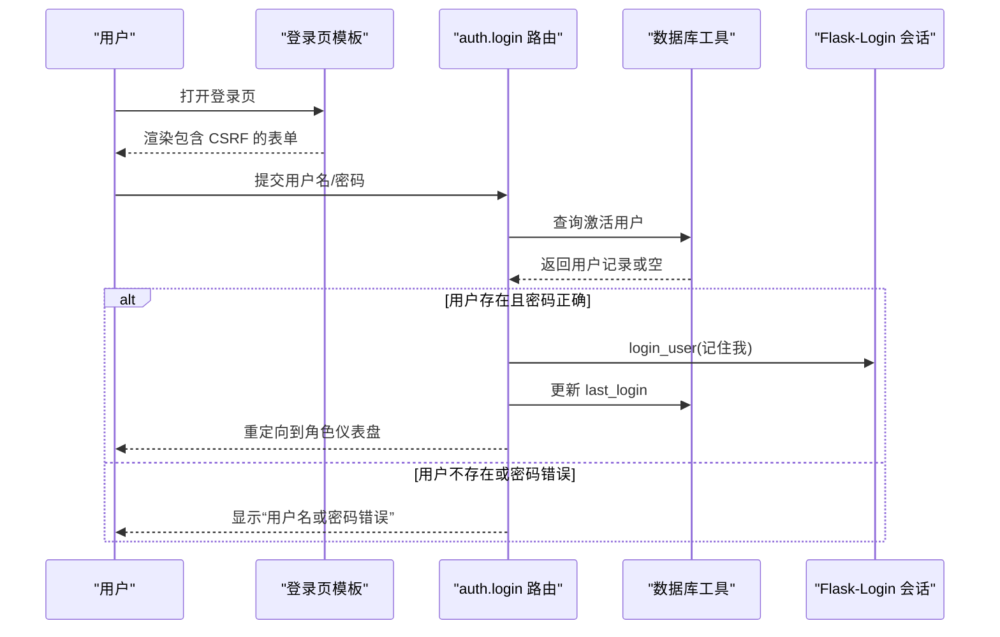
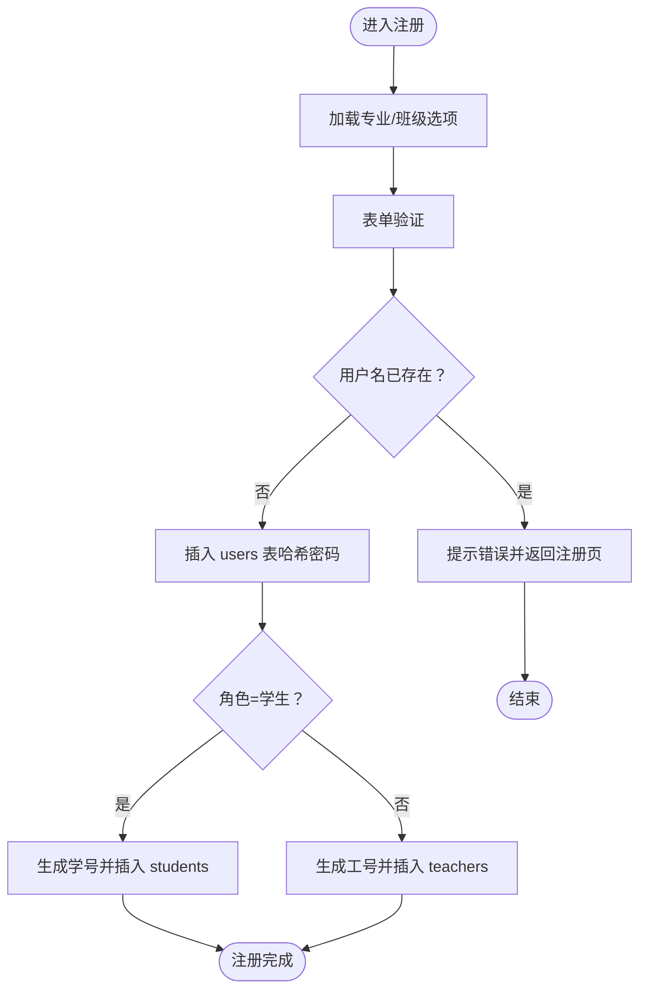
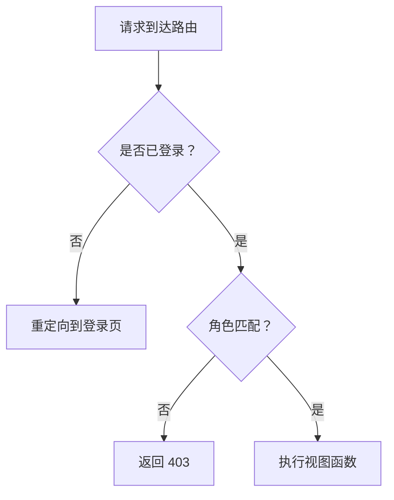
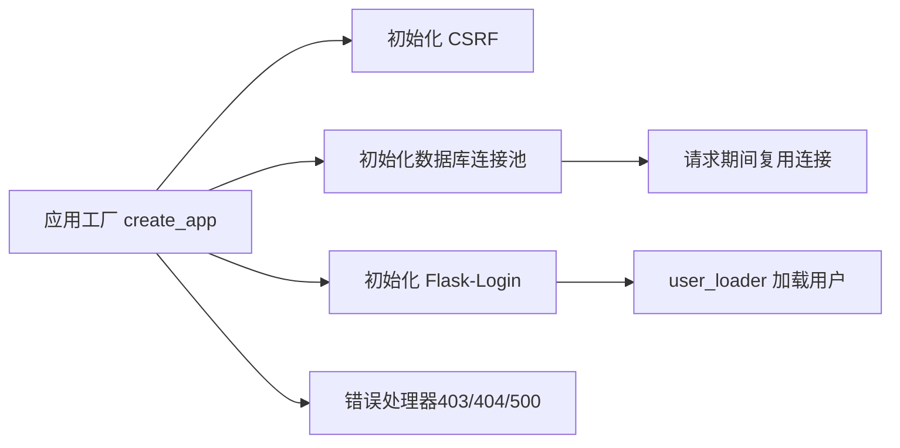
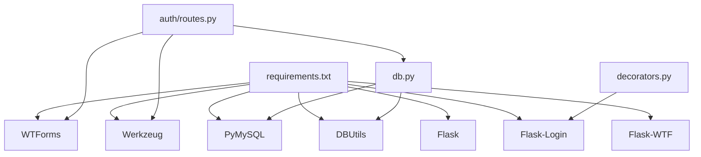

# 认证系统问题排查

<cite>
**本文引用的文件**
- [app.py](file://app.py)
- [app/__init__.py](file://app/__init__.py)
- [app/auth/routes.py](file://app/auth/routes.py)
- [app/auth/forms.py](file://app/auth/forms.py)
- [app/decorators.py](file://app/decorators.py)
- [app/db.py](file://app/db.py)
- [config.py](file://config.py)
- [app/admin/routes.py](file://app/admin/routes.py)
- [app/student/routes.py](file://app/student/routes.py)
- [app/teacher/routes.py](file://app/teacher/routes.py)
- [app/templates/auth/login.html](file://app/templates/auth/login.html)
- [app/templates/_csrf_field.html](file://app/templates/_csrf_field.html)
- [requirements.txt](file://requirements.txt)
- [sql/01_schema.sql](file://sql/01_schema.sql)
</cite>

## 目录
1. [简介](#简介)
2. [项目结构](#项目结构)
3. [核心组件](#核心组件)
4. [架构总览](#架构总览)
5. [详细组件分析](#详细组件分析)
6. [依赖分析](#依赖分析)
7. [性能考虑](#性能考虑)
8. [故障排查指南](#故障排查指南)
9. [结论](#结论)
10. [附录](#附录)

## 简介
本指南面向“认证系统问题”的综合排查，覆盖登录失败、权限验证失败、会话管理、表单验证、密码相关问题以及安全防护等场景。文档基于实际代码库进行分析，提供可操作的诊断步骤、流程图与排障建议，帮助快速定位并解决问题。

## 项目结构
系统采用 Flask 微框架，按功能模块组织蓝图（Blueprint），认证、角色权限、数据库访问与配置分离清晰。前端使用 Jinja 模板渲染，配合 CSRF 保护与基础错误页。

**图表来源**
- [app.py:1-13](file://app.py#L1-L13)
- [app/__init__.py:29-92](file://app/__init__.py#L29-L92)
- [app/auth/routes.py:29-167](file://app/auth/routes.py#L29-L167)
- [app/admin/routes.py:11-640](file://app/admin/routes.py#L11-L640)
- [app/student/routes.py:7-218](file://app/student/routes.py#L7-L218)
- [app/teacher/routes.py:8-288](file://app/teacher/routes.py#L8-L288)
- [app/auth/forms.py:6-37](file://app/auth/forms.py#L6-L37)
- [app/decorators.py:7-26](file://app/decorators.py#L7-L26)
- [app/db.py:10-121](file://app/db.py#L10-L121)
- [config.py:6-36](file://config.py#L6-L36)
- [app/templates/auth/login.html:1-45](file://app/templates/auth/login.html#L1-L45)
- [app/templates/_csrf_field.html:1-2](file://app/templates/_csrf_field.html#L1-L2)
- [sql/01_schema.sql:14-26](file://sql/01_schema.sql#L14-L26)

**章节来源**
- [app.py:1-13](file://app.py#L1-L13)
- [app/__init__.py:29-92](file://app/__init__.py#L29-L92)

## 核心组件
- 应用工厂与蓝图注册：负责初始化 CSRF、数据库连接池、Flask-Login、错误处理器与蓝图注册。
- 认证模块：登录、注册、注销、个人资料与密码修改。
- 权限装饰器：统一登录与角色校验。
- 数据库工具：连接池、查询、事务、分页与存储过程调用。
- 配置：密钥、CSRF、数据库连接参数与分页默认值。
- 模板：登录页、CSRF 字段、各角色仪表盘与错误页。

**章节来源**
- [app/__init__.py:29-92](file://app/__init__.py#L29-L92)
- [app/auth/routes.py:32-167](file://app/auth/routes.py#L32-L167)
- [app/decorators.py:7-26](file://app/decorators.py#L7-L26)
- [app/db.py:10-121](file://app/db.py#L10-L121)
- [config.py:6-36](file://config.py#L6-L36)
- [app/templates/auth/login.html:1-45](file://app/templates/auth/login.html#L1-L45)
- [app/templates/_csrf_field.html:1-2](file://app/templates/_csrf_field.html#L1-L2)

## 架构总览
认证与权限控制围绕 Flask-Login 与自定义装饰器展开；CSRF 由 Flask-WTF 提供；数据库访问通过连接池封装；角色路由通过 before_request 装饰器统一拦截。

**图表来源**
- [app/__init__.py:29-92](file://app/__init__.py#L29-L92)
- [app/auth/routes.py:32-167](file://app/auth/routes.py#L32-L167)
- [app/decorators.py:7-26](file://app/decorators.py#L7-L26)
- [app/db.py:10-121](file://app/db.py#L10-L121)
- [config.py:6-36](file://config.py#L6-L36)
- [sql/01_schema.sql:14-26](file://sql/01_schema.sql#L14-L26)

## 详细组件分析

### 登录流程与错误处理
- 登录页模板包含 CSRF 字段，确保表单提交受 CSRF 保护。
- 登录路由接收表单，校验用户名与密码哈希匹配，成功后设置会话并更新最后登录时间。
- 失败时提示“用户名或密码错误”。

**图表来源**
- [app/auth/routes.py:32-55](file://app/auth/routes.py#L32-L55)
- [app/templates/auth/login.html:11-29](file://app/templates/auth/login.html#L11-L29)
- [app/templates/_csrf_field.html:1-2](file://app/templates/_csrf_field.html#L1-L2)

**章节来源**
- [app/auth/routes.py:32-55](file://app/auth/routes.py#L32-L55)
- [app/templates/auth/login.html:11-29](file://app/templates/auth/login.html#L11-L29)
- [app/templates/_csrf_field.html:1-2](file://app/templates/_csrf_field.html#L1-L2)

### 注册流程与唯一性校验
- 注册表单包含用户名、密码、确认密码、角色与基础信息。
- 校验用户名唯一性，生成角色专属编号，插入 users 与对应角色表。
- 密码使用哈希存储。

**图表来源**
- [app/auth/routes.py:58-110](file://app/auth/routes.py#L58-L110)
- [app/auth/forms.py:11-37](file://app/auth/forms.py#L11-L37)

**章节来源**
- [app/auth/routes.py:58-110](file://app/auth/routes.py#L58-L110)
- [app/auth/forms.py:11-37](file://app/auth/forms.py#L11-L37)

### 权限验证与装饰器
- 登录装饰器：基于 Flask-Login 的 login_required。
- 角色装饰器：检查当前用户角色是否匹配目标路由所需角色，否则返回 403。

**图表来源**
- [app/decorators.py:7-26](file://app/decorators.py#L7-L26)
- [app/admin/routes.py:14-18](file://app/admin/routes.py#L14-L18)
- [app/student/routes.py:10-14](file://app/student/routes.py#L10-L14)
- [app/teacher/routes.py:11-15](file://app/teacher/routes.py#L11-L15)

**章节来源**
- [app/decorators.py:7-26](file://app/decorators.py#L7-L26)
- [app/admin/routes.py:14-18](file://app/admin/routes.py#L14-L18)
- [app/student/routes.py:10-14](file://app/student/routes.py#L10-L14)
- [app/teacher/routes.py:11-15](file://app/teacher/routes.py#L11-L15)

### 会话管理与数据库连接
- 应用启动时初始化 CSRF 与数据库连接池，并在请求结束时关闭连接。
- 登录成功后由 Flask-Login 创建会话；用户信息通过 user_loader 从数据库加载。

**图表来源**
- [app/__init__.py:29-92](file://app/__init__.py#L29-L92)
- [app/db.py:10-41](file://app/db.py#L10-L41)

**章节来源**
- [app/__init__.py:29-92](file://app/__init__.py#L29-L92)
- [app/db.py:10-41](file://app/db.py#L10-L41)

## 依赖分析
- 运行时依赖：Flask、Flask-Login、Flask-WTF、Werkzeug、WTForms、PyMySQL、DBUtils。
- 关键耦合点：认证路由依赖表单验证与数据库工具；权限装饰器依赖 Flask-Login；CSRF 保护贯穿表单提交。

**图表来源**
- [requirements.txt:1-8](file://requirements.txt#L1-L8)
- [app/auth/routes.py:6-9](file://app/auth/routes.py#L6-L9)
- [app/db.py:2-4](file://app/db.py#L2-L4)
- [app/decorators.py:3-4](file://app/decorators.py#L3-L4)

**章节来源**
- [requirements.txt:1-8](file://requirements.txt#L1-L8)

## 性能考虑
- 数据库连接池：通过连接池减少连接开销，避免频繁创建/销毁连接。
- 分页查询：对大表查询使用分页，降低一次性传输量。
- 哈希存储：密码使用哈希存储，避免明文泄露风险。

[本节为通用指导，无需特定文件来源]

## 故障排查指南

### 登录失败问题
- 常见原因
  - 用户名或密码错误
  - 账户被禁用（is_active=0）
  - CSRF 令牌缺失或过期
  - 会话创建失败（服务器异常）
- 排查步骤
  1) 检查登录页是否包含 CSRF 字段。
  2) 确认用户名存在且 is_active=1。
  3) 使用正确密码尝试登录，确认哈希匹配逻辑。
  4) 查看服务器错误日志，确认会话初始化与数据库连接正常。
  5) 若使用“记住我”，确认 Cookie 设置与跨域策略。
- 相关实现位置
  - 登录路由与错误提示
  - 登录模板与 CSRF 字段
  - 用户加载与激活状态判断

**章节来源**
- [app/auth/routes.py:32-55](file://app/auth/routes.py#L32-L55)
- [app/templates/auth/login.html:11-29](file://app/templates/auth/login.html#L11-L29)
- [app/templates/_csrf_field.html:1-2](file://app/templates/_csrf_field.html#L1-L2)
- [app/__init__.py:47-51](file://app/__init__.py#L47-L51)
- [sql/01_schema.sql:14-26](file://sql/01_schema.sql#L14-L26)

### 权限验证失败
- 常见原因
  - 未登录即访问受保护路由
  - 当前用户角色与目标路由不匹配
  - 装饰器链路错误或被覆盖
- 排查步骤
  1) 确认路由装饰器顺序：先 login_required 再 role_required。
  2) 检查用户角色字段是否正确写入会话。
  3) 若出现 403，检查模板或前端是否绕过登录。
- 相关实现位置
  - 登录与角色装饰器
  - 各模块 before_request 装饰器

**章节来源**
- [app/decorators.py:7-26](file://app/decorators.py#L7-L26)
- [app/admin/routes.py:14-18](file://app/admin/routes.py#L14-L18)
- [app/student/routes.py:10-14](file://app/student/routes.py#L10-L14)
- [app/teacher/routes.py:11-15](file://app/teacher/routes.py#L11-L15)

### 会话管理问题
- 会话超时
  - 检查 Flask-Login 的 session 持久化配置与浏览器 Cookie 设置。
- 会话劫持
  - 确保 HTTPS 环境与 Secure/SameSite Cookie 设置（若启用）。
- 多设备登录冲突
  - 系统未显式实现强制单点登录，可在业务侧增加 token 管理或 last_login 更新策略。
- 相关实现位置
  - 会话创建与用户加载
  - 错误页处理（403/404/500）

**章节来源**
- [app/auth/routes.py:43-48](file://app/auth/routes.py#L43-L48)
- [app/__init__.py:47-51](file://app/__init__.py#L47-L51)
- [app/__init__.py:76-91](file://app/__init__.py#L76-L91)

### 表单验证错误
- 输入格式错误
  - 用户名长度/字符限制、密码长度与一致性校验。
- 字段缺失
  - 必填字段未填写导致验证失败。
- 验证规则冲突
  - 确认 EqualTo、Length、Regexp 等规则顺序与消息提示。
- 相关实现位置
  - 认证表单定义与验证器

**章节来源**
- [app/auth/forms.py:6-37](file://app/auth/forms.py#L6-L37)

### 密码相关问题
- 密码重置失败
  - 管理端密码重置接口需校验新密码长度。
  - 修改密码时使用哈希存储。
- 加密算法不兼容
  - 确保前后端使用相同哈希算法（Werkzeug 默认）。
- 密码策略冲突
  - 最小长度、字符类型等策略需与表单验证一致。
- 相关实现位置
  - 管理员密码重置
  - 登录与密码修改逻辑

**章节来源**
- [app/admin/routes.py:270-283](file://app/admin/routes.py#L270-L283)
- [app/admin/routes.py:350-363](file://app/admin/routes.py#L350-L363)
- [app/auth/routes.py:143-153](file://app/auth/routes.py#L143-L153)

### 安全相关问题
- XSS 防护
  - 使用 Jinja2 自动转义，避免直接输出未经转义的数据。
- SQL 注入防护
  - 全部使用参数化查询，避免字符串拼接。
- 暴力破解防护
  - 可在认证层增加速率限制与账户锁定策略（当前未实现，建议扩展）。
- CSRF 防护
  - 表单必须包含 CSRF 字段，服务端自动校验。
- 相关实现位置
  - 登录模板包含 CSRF 字段
  - 数据库工具统一使用参数化查询

**章节来源**
- [app/templates/_csrf_field.html:1-2](file://app/templates/_csrf_field.html#L1-L2)
- [app/auth/routes.py:37-54](file://app/auth/routes.py#L37-L54)
- [app/db.py:43-59](file://app/db.py#L43-L59)

### 错误日志分析与调试技巧
- 日志定位
  - 服务器错误页：403/404/500 页面用于捕获未处理异常。
  - 数据库异常：检查连接池初始化与事务提交。
- 调试建议
  - 在开发环境开启 debug，观察请求上下文与异常堆栈。
  - 对关键路径（登录、权限、数据库）增加最小化日志输出。
  - 使用浏览器开发者工具检查网络请求与响应状态码。

**章节来源**
- [app/__init__.py:76-91](file://app/__init__.py#L76-L91)
- [app/db.py:10-41](file://app/db.py#L10-L41)

## 结论
本认证系统以 Flask-Login 为核心，结合 Flask-WTF 的 CSRF 保护与参数化查询，提供了基础但完整的认证与权限控制能力。针对常见问题，建议优先检查登录流程中的用户名/密码与账户状态、CSRF 字段完整性、权限装饰器链路与数据库连接池状态，并根据需要扩展安全策略（如速率限制与单点登录）。

[本节为总结，无需特定文件来源]

## 附录
- 数据库用户表结构（关键字段）
  - users 表包含 id、username、password_hash、role、is_active、last_login 等字段，支持按角色索引与唯一用户名约束。

**章节来源**
- [sql/01_schema.sql:14-26](file://sql/01_schema.sql#L14-L26)