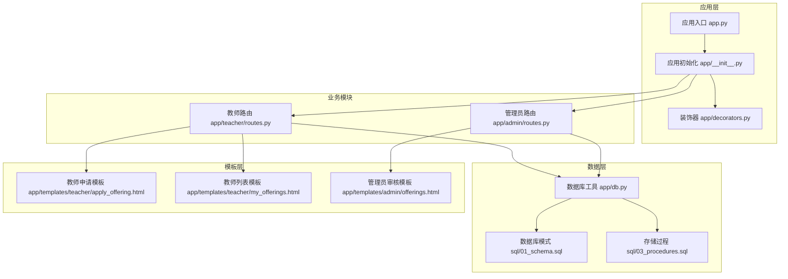
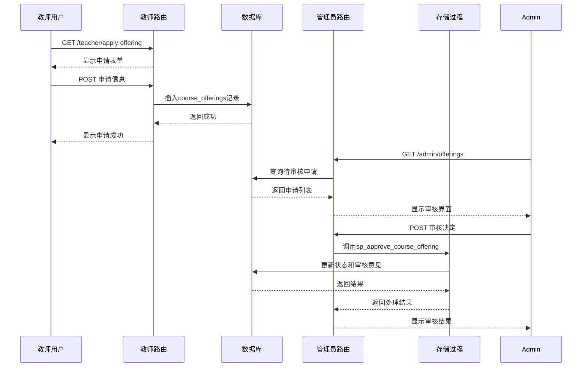
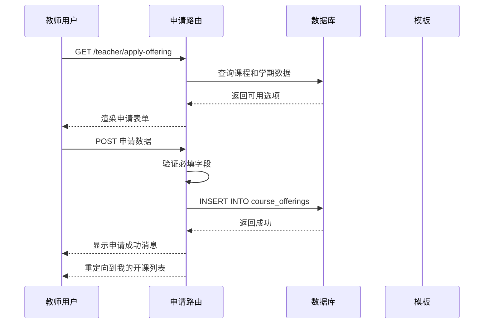
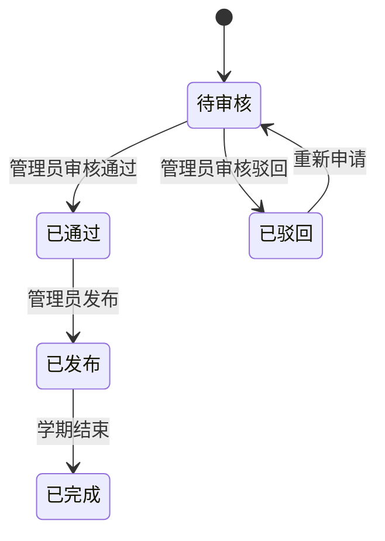
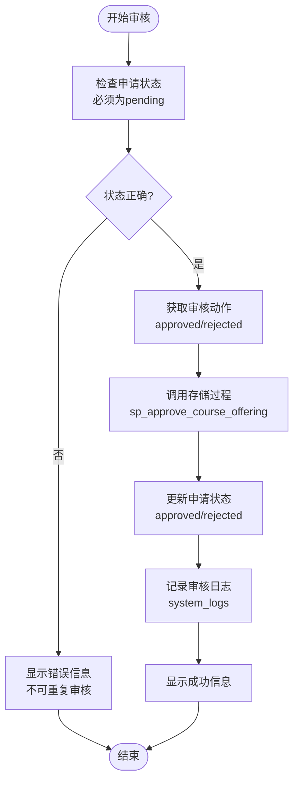
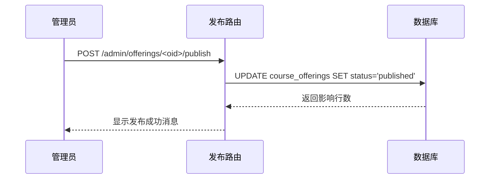
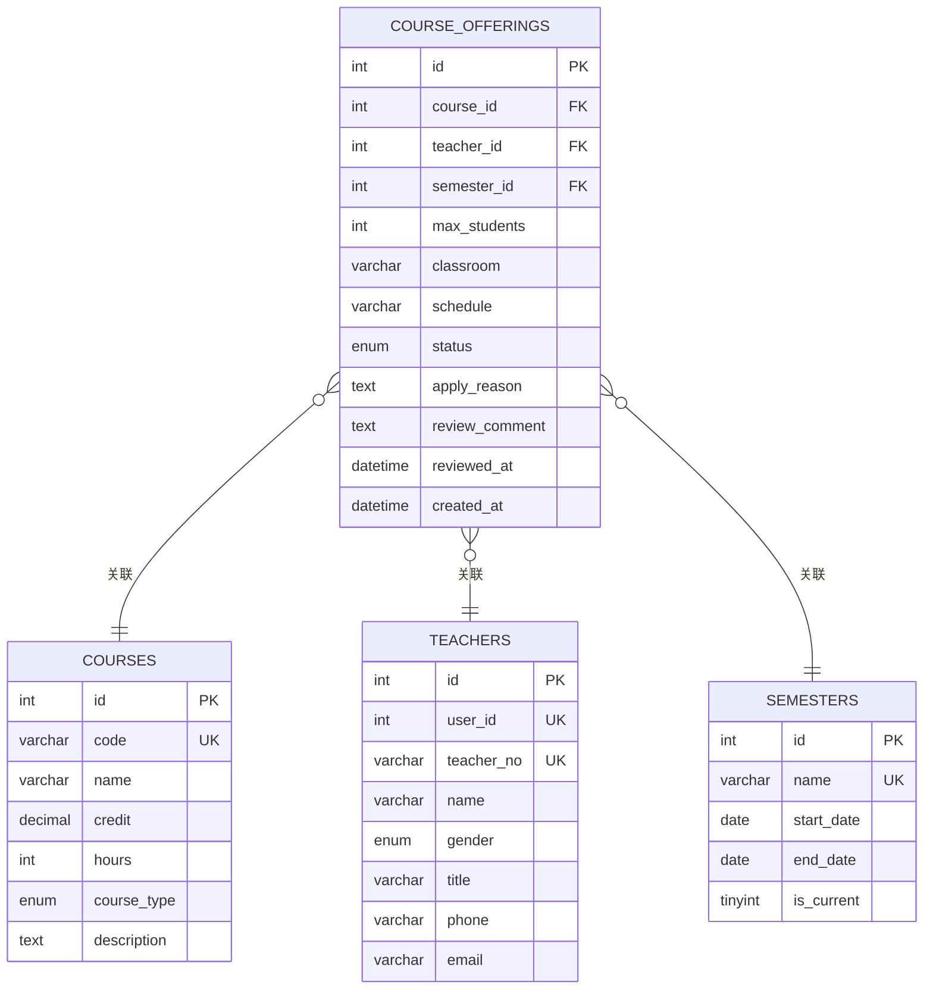
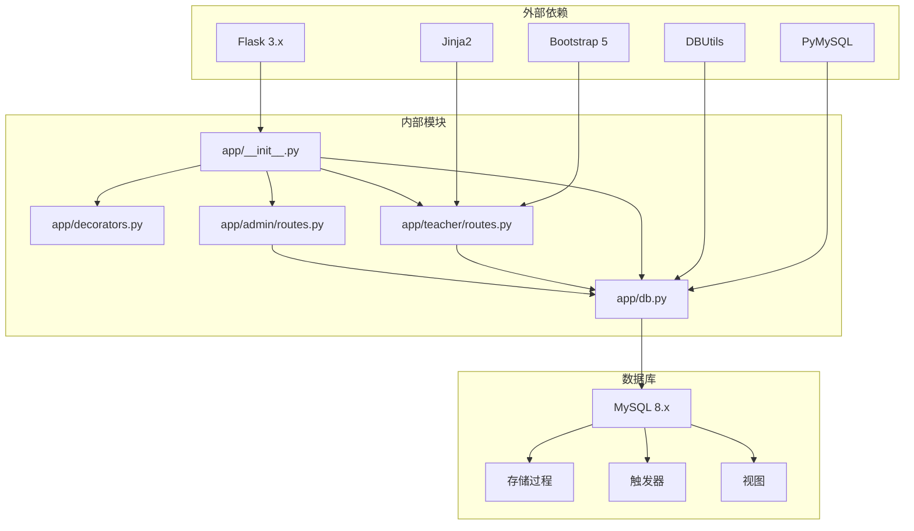
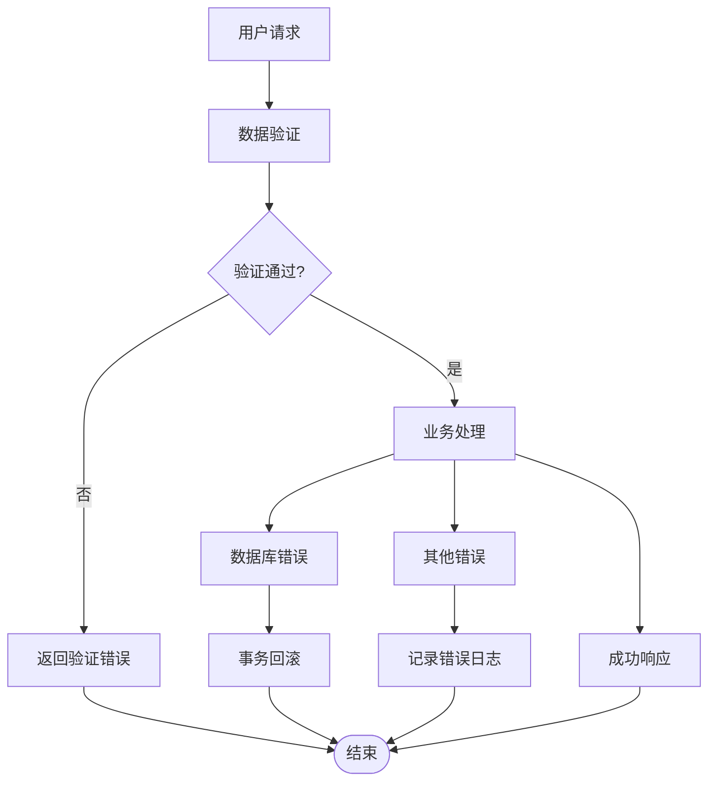

# 开课申请管理

<cite>
**本文档引用的文件**
- [app.py](file://app.py)
- [app/__init__.py](file://app/__init__.py)
- [app/db.py](file://app/db.py)
- [app/decorators.py](file://app/decorators.py)
- [app/admin/routes.py](file://app/admin/routes.py)
- [app/teacher/routes.py](file://app/teacher/routes.py)
- [app/templates/teacher/apply_offering.html](file://app/templates/teacher/apply_offering.html)
- [app/templates/teacher/my_offerings.html](file://app/templates/teacher/my_offerings.html)
- [app/templates/admin/offerings.html](file://app/templates/admin/offerings.html)
- [sql/01_schema.sql](file://sql/01_schema.sql)
- [sql/03_procedures.sql](file://sql/03_procedures.sql)
- [README.md](file://README.md)
</cite>

## 目录
1. [简介](#简介)
2. [项目结构](#项目结构)
3. [核心组件](#核心组件)
4. [架构概览](#架构概览)
5. [详细组件分析](#详细组件分析)
6. [依赖分析](#依赖分析)
7. [性能考虑](#性能考虑)
8. [故障排除指南](#故障排除指南)
9. [结论](#结论)
10. [附录](#附录)

## 简介
本文件为开课申请管理功能的详细操作文档，涵盖从教师提交申请到管理员审核发布的完整流程。系统基于Flask框架构建，采用MySQL数据库，通过存储过程和触发器确保业务逻辑的一致性和完整性。本文档将详细说明申请条件检查、课程信息填写、申请表单提交、管理员审核状态跟踪等环节，并解释申请状态的各个阶段及其处理流程。

## 项目结构
系统采用模块化设计，主要包含以下核心模块：
- 应用入口与初始化：负责Flask应用创建、蓝图注册和全局配置
- 教师模块：处理教师的开课申请、申请状态查看、申请编辑与撤销
- 管理员模块：负责开课申请的审核、发布以及相关的统计分析
- 数据库层：提供数据库连接池、查询工具和存储过程封装
- 模板层：使用Jinja2模板引擎渲染HTML页面

**图表来源**
- [app.py:1-13](file://app.py#L1-L13)
- [app/__init__.py:29-93](file://app/__init__.py#L29-L93)
- [app/teacher/routes.py:1-271](file://app/teacher/routes.py#L1-L271)
- [app/admin/routes.py:1-615](file://app/admin/routes.py#L1-L615)

**章节来源**
- [README.md:46-87](file://README.md#L46-L87)
- [app/__init__.py:29-93](file://app/__init__.py#L29-L93)

## 核心组件
开课申请管理功能由以下核心组件构成：

### 数据模型
系统的核心数据模型围绕课程开设展开，主要包括：
- **course_offerings表**：存储开课申请的详细信息，包括课程ID、教师ID、学期ID、最大选课人数、教室安排、时间安排等
- **courses表**：存储课程基本信息，包括课程编号、名称、学分、学时、课程类型等
- **teachers表**：存储教师基本信息
- **semesters表**：存储学期信息

### 关键业务流程
1. **申请提交流程**：教师填写申请表单 → 系统验证必填字段 → 插入course_offerings记录 → 状态默认为pending
2. **审核流程**：管理员查看待审核列表 → 选择通过或驳回 → 调用存储过程更新状态 → 记录审核意见
3. **发布流程**：管理员将已批准的申请发布 → 状态变更为published → 学生可进行选课

**章节来源**
- [sql/01_schema.sql:128-155](file://sql/01_schema.sql#L128-L155)
- [app/teacher/routes.py:67-84](file://app/teacher/routes.py#L67-L84)
- [app/admin/routes.py:380-398](file://app/admin/routes.py#L380-L398)

## 架构概览
系统采用经典的三层架构设计，通过蓝图实现模块化组织：

**图表来源**
- [app/teacher/routes.py:67-84](file://app/teacher/routes.py#L67-L84)
- [app/admin/routes.py:366-398](file://app/admin/routes.py#L366-L398)
- [sql/03_procedures.sql:278-320](file://sql/03_procedures.sql#L278-L320)

## 详细组件分析

### 教师申请组件
教师申请组件提供了完整的开课申请功能，包括申请表单展示、数据验证、申请提交和状态管理。

#### 申请表单字段说明
申请表单包含以下关键字段：

| 字段名称 | 字段类型 | 必填 | 默认值 | 说明 |
|---------|---------|------|--------|------|
| course_id | 下拉选择 | 是 | 无 | 选择要申请的课程 |
| semester_id | 下拉选择 | 是 | 无 | 选择开课学期 |
| max_students | 数字输入 | 是 | 60 | 最大选课人数，必须≥1 |
| classroom | 文本输入 | 否 | 空 | 上课教室，如：教学楼A301 |
| schedule | 文本输入 | 否 | 空 | 上课时间，如：周一1-2节 |
| apply_reason | 多行文本 | 否 | 空 | 申请理由说明 |

#### 申请流程时序图

**图表来源**
- [app/teacher/routes.py:67-84](file://app/teacher/routes.py#L67-L84)
- [app/templates/teacher/apply_offering.html:7-30](file://app/templates/teacher/apply_offering.html#L7-L30)

#### 申请状态管理
教师可以查看和管理自己的开课申请状态：

**图表来源**
- [sql/01_schema.sql:138](file://sql/01_schema.sql#L138)
- [app/templates/teacher/my_offerings.html:12-15](file://app/templates/teacher/my_offerings.html#L12-L15)

**章节来源**
- [app/teacher/routes.py:67-131](file://app/teacher/routes.py#L67-L131)
- [app/templates/teacher/apply_offering.html:10-27](file://app/templates/teacher/apply_offering.html#L10-L27)

### 管理员审核组件
管理员审核组件提供了完整的开课申请审核功能，包括申请列表查看、审核决策和状态更新。

#### 审核界面设计
管理员审核界面采用表格形式展示所有开课申请，支持按状态排序和分页显示：

| 列名 | 显示内容 | 状态标识 |
|------|----------|----------|
| ID | 申请ID | - |
| 课程 | 课程名称(编号) | - |
| 教师 | 教师姓名 | - |
| 学期 | 学期名称 | - |
| 上限 | 最大选课人数 | - |
| 教室 | 教室安排 | - |
| 时间 | 上课时间 | - |
| 状态 | 状态徽章 | 待审核/已通过/已发布/已驳回 |
| 操作 | 审核按钮 | 通过/驳回/发布 |

#### 审核流程
管理员审核流程通过存储过程实现，确保事务一致性和数据完整性：

**图表来源**
- [app/admin/routes.py:380-398](file://app/admin/routes.py#L380-L398)
- [sql/03_procedures.sql:278-320](file://sql/03_procedures.sql#L278-L320)

#### 发布流程
对于已批准的申请，管理员可以将其发布供学生选课：

**图表来源**
- [app/admin/routes.py:400-405](file://app/admin/routes.py#L400-L405)

**章节来源**
- [app/admin/routes.py:366-405](file://app/admin/routes.py#L366-L405)
- [app/templates/admin/offerings.html:18-28](file://app/templates/admin/offerings.html#L18-L28)

### 数据库设计
系统采用12张核心表的设计，确保数据的完整性和一致性：

**图表来源**
- [sql/01_schema.sql:112-155](file://sql/01_schema.sql#L112-L155)

**章节来源**
- [sql/01_schema.sql:112-155](file://sql/01_schema.sql#L112-L155)

## 依赖分析
系统各组件之间的依赖关系如下：

**图表来源**
- [README.md:5-11](file://README.md#L5-L11)
- [app/__init__.py:29-93](file://app/__init__.py#L29-L93)

**章节来源**
- [README.md:5-11](file://README.md#L5-L11)
- [app/db.py:10-27](file://app/db.py#L10-L27)

## 性能考虑
系统在设计时充分考虑了性能优化：

### 数据库连接池
- 使用DBUtils连接池减少连接开销
- 支持最小缓存、最大缓存和最大连接数配置
- 自动管理连接生命周期

### 分页查询
- 所有列表页面均采用分页机制
- 支持自定义每页记录数
- 优化大数据量场景下的查询性能

### 索引优化
- course_offerings表建立多处索引
- 支持按状态、课程、教师、学期快速查询
- 唯一约束防止重复申请

### 存储过程优化
- 将复杂的业务逻辑封装在存储过程中
- 减少网络往返次数
- 提供原子性操作保证

## 故障排除指南

### 常见问题及解决方案

#### 申请提交失败
**问题描述**：教师提交申请时出现错误提示
**可能原因**：
- 必填字段缺失
- 数据库连接异常
- 权限不足

**解决步骤**：
1. 检查浏览器控制台是否有JavaScript错误
2. 确认所有必填字段均已填写
3. 查看服务器日志获取详细错误信息
4. 验证数据库连接配置

#### 审核操作异常
**问题描述**：管理员审核时系统报错
**可能原因**：
- 申请状态已改变
- 存储过程执行失败
- 权限不足

**解决步骤**：
1. 刷新页面确认最新状态
2. 检查申请是否已被其他管理员处理
3. 查看系统日志中的错误详情
4. 确认管理员权限

#### 数据不一致
**问题描述**：页面显示与实际数据库状态不符
**可能原因**：
- 缓存问题
- 并发访问冲突
- 触发器未正确执行

**解决步骤**：
1. 清除浏览器缓存
2. 检查数据库触发器状态
3. 验证存储过程执行情况
4. 查看system_logs表获取审计信息

### 错误处理机制
系统采用多层次的错误处理机制：

**章节来源**
- [app/teacher/routes.py:105-115](file://app/teacher/routes.py#L105-L115)
- [app/admin/routes.py:388-397](file://app/admin/routes.py#L388-L397)

## 结论
开课申请管理功能通过清晰的业务流程设计、完善的权限控制和可靠的数据库设计，为教师和管理员提供了高效、安全的开课管理体验。系统支持完整的申请-审核-发布流程，具备良好的扩展性和维护性。通过存储过程和触发器的应用，确保了业务逻辑的一致性和数据的完整性。

## 附录

### 快速操作指南

#### 教师申请流程
1. 登录系统 → 进入教师面板
2. 点击"申请开课" → 填写申请表单
3. 提交申请 → 等待管理员审核
4. 查看申请状态 → 如需修改可编辑或撤销

#### 管理员审核流程
1. 登录系统 → 进入管理员面板
2. 查看待审核申请 → 点击"通过/驳回"
3. 填写审核意见 → 确认操作
4. 对已批准申请进行发布 → 学生可选课

### 配置要求
- Python 3.x
- Flask 3.x
- MySQL 8.x
- PyMySQL驱动
- DBUtils连接池

### 安全特性
- CSRF保护
- 角色权限控制
- 输入验证和过滤
- 审计日志记录
- 事务性操作保证